# Post Constructor Component

<cite>
**Referenced Files in This Document**
- [PostConstructor.tsx](file://src/components/PostConstructor.tsx)
- [App.tsx](file://src/App.tsx)
- [types.ts](file://src/types.ts)
- [useDrafts.ts](file://src/hooks/useDrafts.ts)
- [useButtonTemplates.ts](file://src/hooks/useButtonTemplates.ts)
- [useImageSync.ts](file://src/hooks/useImageSync.ts)
</cite>

## Table of Contents
1. [Introduction](#introduction)
2. [Project Structure](#project-structure)
3. [Core Components](#core-components)
4. [Architecture Overview](#architecture-overview)
5. [Detailed Component Analysis](#detailed-component-analysis)
6. [Dependency Analysis](#dependency-analysis)
7. [Performance Considerations](#performance-considerations)
8. [Troubleshooting Guide](#troubleshooting-guide)
9. [Conclusion](#conclusion)

## Introduction
The Post Constructor component is the primary content creation interface for building Telegram posts with rich formatting, embedded images, and interactive buttons. It integrates AI-powered text processing, drag-and-drop image management, button template systems, and dual-mode publishing (standalone vs server-based). The component provides a comprehensive authoring experience with real-time preview, character limits, and responsive design.

## Project Structure
The Post Constructor is implemented as a standalone React component that receives all state and handlers via props from the main application container. It leverages external libraries for markdown editing, drag-and-drop functionality, and animation effects.

```mermaid
graph TB
subgraph "Application Container"
App[App.tsx]
Hooks[React Hooks]
end
subgraph "UI Components"
PostConstructor[PostConstructor.tsx]
SortableImage[SortableImage Component]
end
subgraph "External Libraries"
Motion[motion/react]
DnDKit[@dnd-kit/*]
MdEditor[react-markdown-editor-lite]
MarkdownIt[markdown-it]
end
subgraph "Data Layer"
Types[types.ts]
Drafts[useDrafts.ts]
Templates[useButtonTemplates.ts]
ImageSync[useImageSync.ts]
end
App --> PostConstructor
PostConstructor --> SortableImage
PostConstructor --> Motion
PostConstructor --> DnDKit
PostConstructor --> MdEditor
PostConstructor --> MarkdownIt
App --> Hooks
Hooks --> Drafts
Hooks --> Templates
Hooks --> ImageSync
PostConstructor --> Types
```

**Diagram sources**
- [PostConstructor.tsx:1-294](file://src/components/PostConstructor.tsx#L1-L294)
- [App.tsx:1792-1841](file://src/App.tsx#L1792-L1841)
- [types.ts:1-48](file://src/types.ts#L1-L48)

**Section sources**
- [PostConstructor.tsx:1-294](file://src/components/PostConstructor.tsx#L1-L294)
- [App.tsx:1792-1841](file://src/App.tsx#L1792-L1841)

## Core Components
The Post Constructor consists of several integrated subsystems:

### Main Component Structure
- **State Management**: Local state for text editing with controlled component pattern
- **Tabbed Interface**: Responsive tabs for text editor, image gallery, and button configuration
- **Real-time Preview**: Live markdown rendering with custom spoiler support
- **Drag-and-Drop**: Reorderable image gallery with visual feedback
- **AI Integration**: Text processing pipeline with provider selection
- **Template System**: Button template management with save/delete operations

### Key Features
- **Markdown Editor**: Full-featured editor with HTML preview mode
- **Image Management**: Upload, sync, select, and reorder images
- **Button Configuration**: Dynamic button creation with URL validation
- **Character Limits**: Real-time character count with Telegram-specific constraints
- **Responsive Design**: Mobile-first layout with desktop enhancements

**Section sources**
- [PostConstructor.tsx:50-94](file://src/components/PostConstructor.tsx#L50-L94)
- [PostConstructor.tsx:96-294](file://src/components/PostConstructor.tsx#L96-L294)

## Architecture Overview
The component follows a unidirectional data flow pattern where the parent container manages all state and passes it down as props. This ensures predictable updates and simplifies debugging.

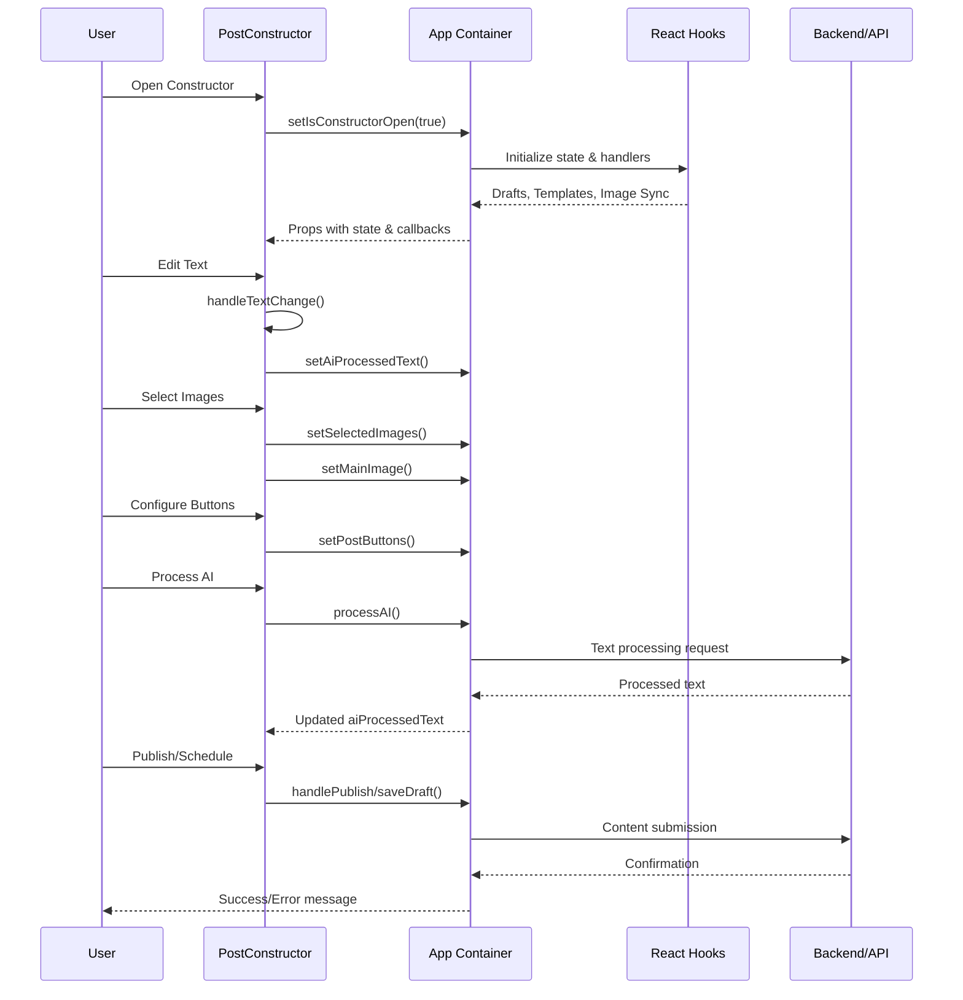

**Diagram sources**
- [PostConstructor.tsx:105-108](file://src/components/PostConstructor.tsx#L105-L108)
- [App.tsx:811-864](file://src/App.tsx#L811-L864)
- [App.tsx:905-975](file://src/App.tsx#L905-L975)

## Detailed Component Analysis

### Visual Appearance and Layout
The component uses a dark theme with blue accents, designed for content creators who spend extended periods editing posts.

#### Color Scheme
- **Primary Background**: Neutral-900 (#111827)
- **Card Background**: Neutral-800/30 with subtle borders
- **Accent Colors**: Blue-500 for active states, Emerald-500 for success
- **Text Colors**: White for headings, Neutral-400 for secondary text

#### Responsive Design
- **Mobile First**: Single-column layout with tab switching
- **Desktop Enhancement**: Two-column layout with separate panels
- **Breakpoints**: XL screens (1200px+) for optimal desktop experience
- **Touch Targets**: Minimum 44px for interactive elements

#### Accessibility Features
- **Keyboard Navigation**: Full keyboard support for all interactive elements
- **Focus Management**: Clear focus indicators and logical tab order
- **Color Contrast**: Sufficient contrast ratios for text and controls
- **Screen Reader**: Proper ARIA labels and roles throughout

**Section sources**
- [PostConstructor.tsx:110-116](file://src/components/PostConstructor.tsx#L110-L116)
- [PostConstructor.tsx:124-136](file://src/components/PostConstructor.tsx#L124-L136)

### User Interaction Patterns

#### Tab Navigation System
The component implements a responsive tab system that adapts to screen size:

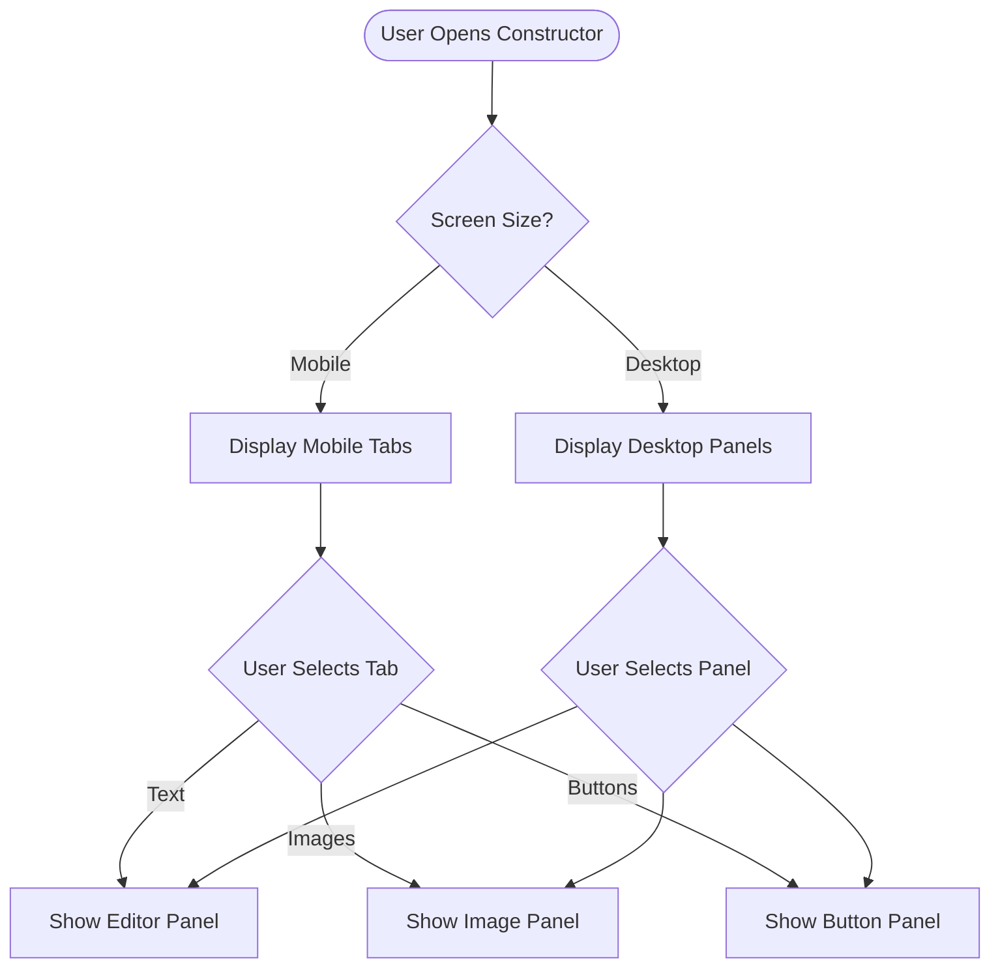

**Diagram sources**
- [PostConstructor.tsx:125-136](file://src/components/PostConstructor.tsx#L125-L136)
- [PostConstructor.tsx:139-266](file://src/components/PostConstructor.tsx#L139-L266)

#### Image Management Workflow
The image management system supports multiple input methods with robust validation:

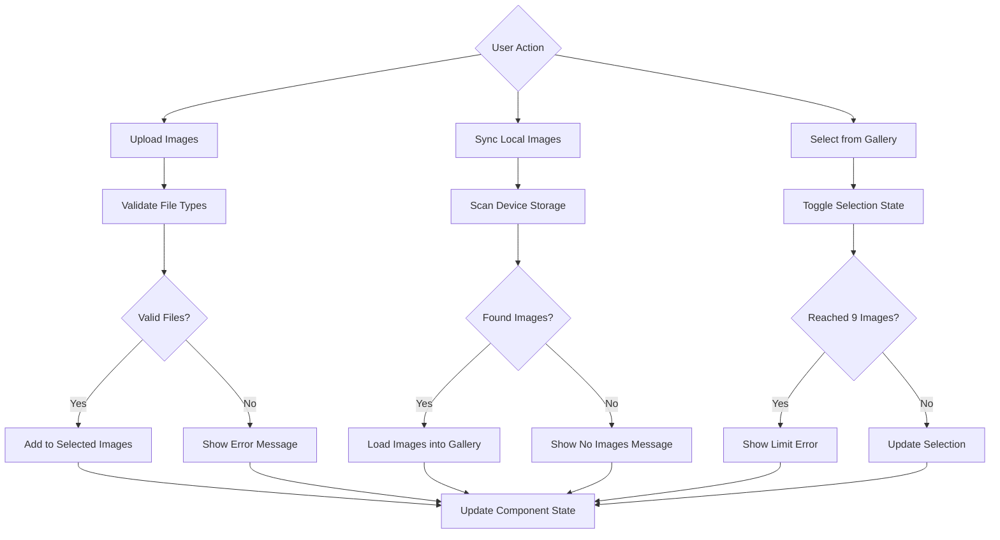

**Diagram sources**
- [PostConstructor.tsx:207-242](file://src/components/PostConstructor.tsx#L207-L242)
- [App.tsx:866-872](file://src/App.tsx#L866-L872)

#### Button Configuration System
The button system allows dynamic creation and management of interactive elements:

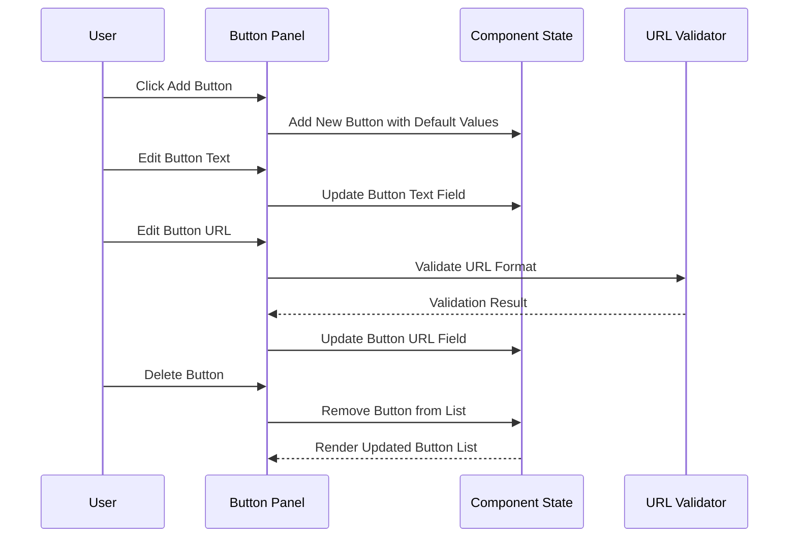

**Diagram sources**
- [PostConstructor.tsx:252-263](file://src/components/PostConstructor.tsx#L252-L263)
- [PostConstructor.tsx:254-259](file://src/components/PostConstructor.tsx#L254-L259)

### Content Formatting Capabilities

#### Markdown Editor Features
The component uses react-markdown-editor-lite with custom extensions:

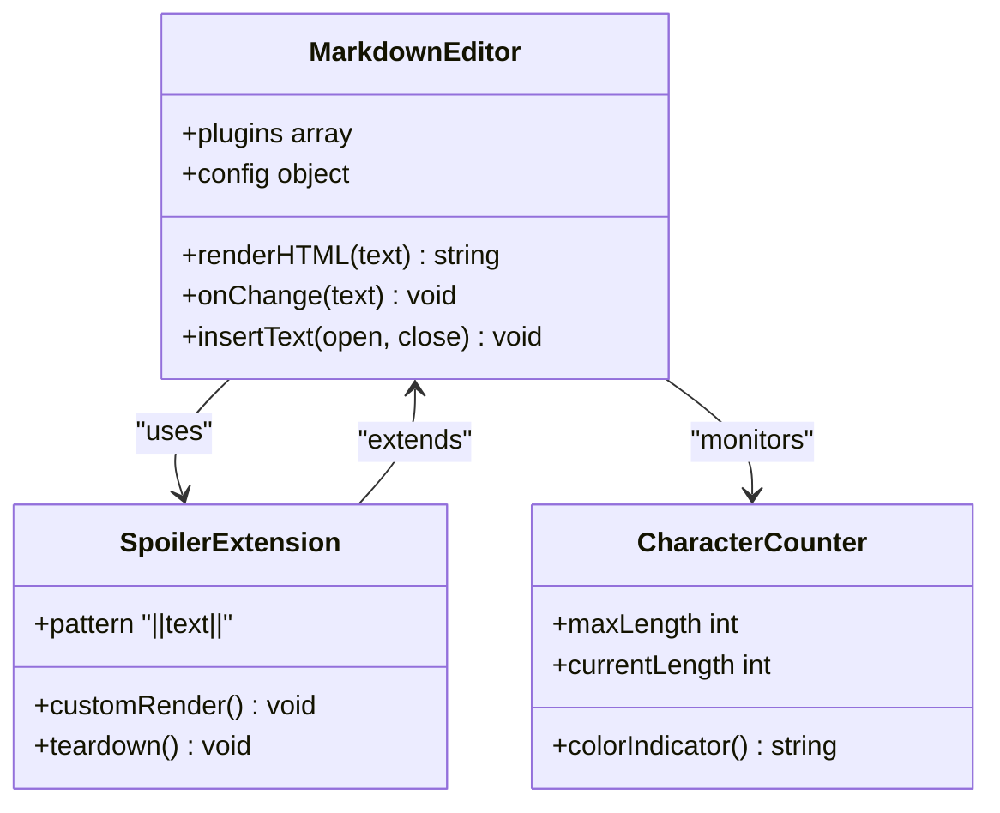

**Diagram sources**
- [PostConstructor.tsx:11-40](file://src/components/PostConstructor.tsx#L11-L40)
- [PostConstructor.tsx:182-193](file://src/components/PostConstructor.tsx#L182-L193)

#### Custom Spoiler Implementation
The component implements a custom spoiler feature using MarkdownIt's inline parser extension:

| Feature | Implementation | Behavior |
|---------|---------------|----------|
| Syntax | `||spoiler text||` | Enclosed in tg-spoiler tags |
| Rendering | Custom inline rule | Hidden until clicked |
| Editor Integration | Insert button in toolbar | Automatic text wrapping |
| Preview | HTML sanitizer | Preserved in Telegram format |

#### Character Limit Management
The component enforces Telegram-specific character limits:

- **Without Images**: 4096 characters
- **With Images**: 1024 characters
- **Real-time Monitoring**: Visual indicator changes color at thresholds
- **Sanitization**: HTML tags converted to Telegram-compatible format

**Section sources**
- [PostConstructor.tsx:11-40](file://src/components/PostConstructor.tsx#L11-L40)
- [PostConstructor.tsx:173-179](file://src/components/PostConstructor.tsx#L173-L179)

### Integration with Draft Management Hooks

#### Draft Persistence System
The component integrates with a sophisticated draft management system:

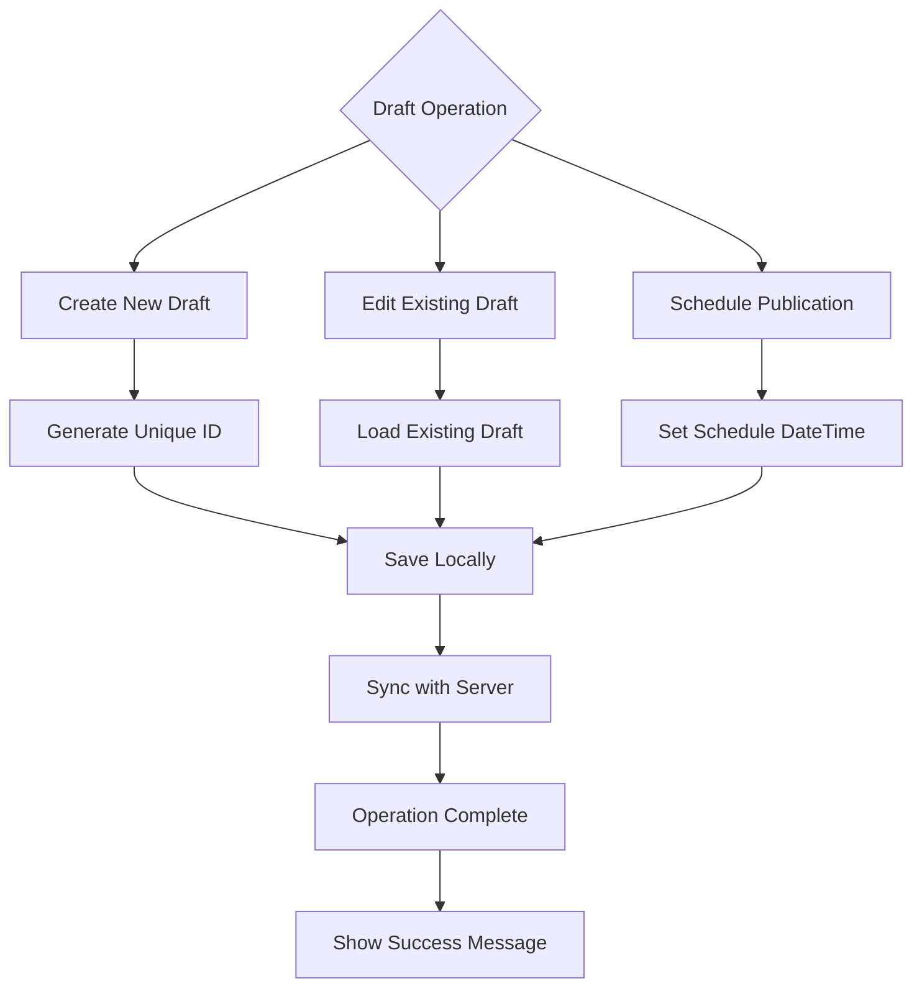

**Diagram sources**
- [App.tsx:874-903](file://src/App.tsx#L874-L903)
- [useDrafts.ts:31-54](file://src/hooks/useDrafts.ts#L31-L54)

#### Draft State Management
The draft system handles multiple scenarios:

- **Local Storage**: Standalone mode persistence
- **Server Sync**: Remote storage and synchronization
- **Auto-save**: Automatic saving on component unmount
- **Conflict Resolution**: Merge strategies for concurrent edits

**Section sources**
- [useDrafts.ts:1-88](file://src/hooks/useDrafts.ts#L1-L88)
- [App.tsx:874-903](file://src/App.tsx#L874-L903)

### Image Synchronization System

#### Multi-Platform Image Management
The component supports both local device storage and server-based image repositories:

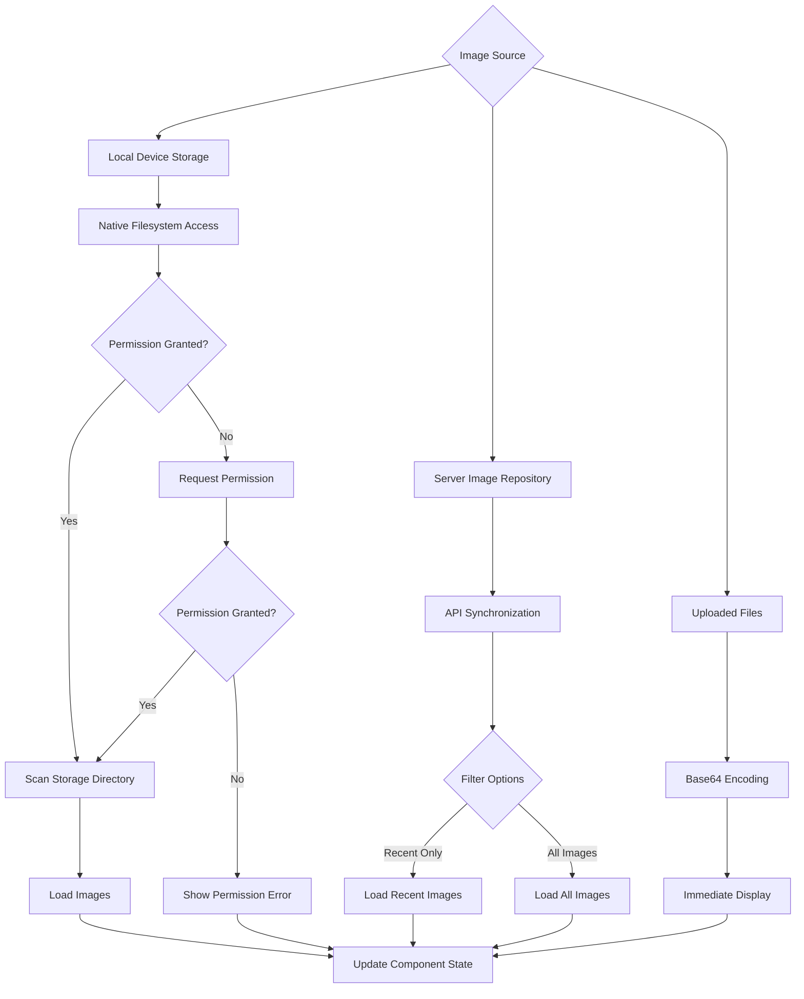

**Diagram sources**
- [App.tsx:401-522](file://src/App.tsx#L401-L522)
- [useImageSync.ts:5-42](file://src/hooks/useImageSync.ts#L5-L42)

#### Image Path Management
The system maintains persistent image path configurations:

- **Local Paths**: Android external storage paths
- **Server Paths**: Configurable repository locations
- **Automatic Detection**: Smart path resolution
- **Manual Override**: User-defined path specification

**Section sources**
- [useImageSync.ts:1-42](file://src/hooks/useImageSync.ts#L1-L42)
- [App.tsx:401-522](file://src/App.tsx#L401-L522)

### Button Template Systems

#### Template Management Architecture
The button template system provides reusable button configurations:

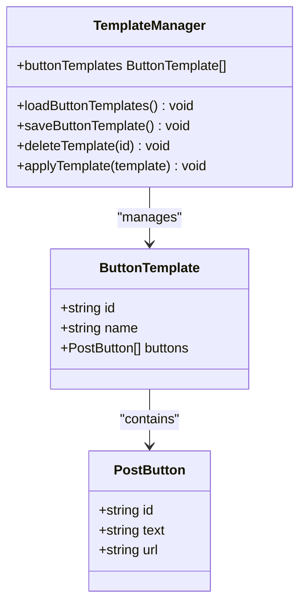

**Diagram sources**
- [types.ts:28-32](file://src/types.ts#L28-L32)
- [types.ts:1-5](file://src/types.ts#L1-L5)

#### Template Operations
The template system supports:

- **Template Creation**: Save current button configuration
- **Template Loading**: Apply predefined button layouts
- **Template Deletion**: Remove unused configurations
- **Template Sharing**: Cross-platform template synchronization

**Section sources**
- [types.ts:28-32](file://src/types.ts#L28-L32)
- [App.tsx:1044-1075](file://src/App.tsx#L1044-L1075)

### Markdown Editor Functionality

#### Editor Configuration
The markdown editor is configured with:

- **View Modes**: Menu, Markdown, and HTML preview
- **Plugins**: Bold, italic, clear, logger, mode-toggle
- **Custom Toolbar**: Spoiler insertion button
- **Real-time Preview**: Live HTML rendering
- **Accessibility**: Keyboard shortcuts and screen reader support

#### Custom Spoiler Implementation
The spoiler feature extends MarkdownIt with custom inline parsing:

```mermaid
flowchart TD
TextInput[User Types ||text||] --> Parser[MarkdownIt Parser]
Parser --> SpoilerRule[Spoiler Inline Rule]
SpoilerRule --> SpoilerOpen[tg-spoiler opening tag]
SpoilerRule --> SpoilerContent[text content]
SpoilerRule --> SpoilerClose[tg-spoiler closing tag]
SpoilerOpen --> HTMLRenderer[HTML Renderer]
SpoilerContent --> HTMLRenderer
SpoilerClose --> HTMLRenderer
HTMLRenderer --> TelegramFormat[Telegram-Compatible Output]
```

**Diagram sources**
- [PostConstructor.tsx:17-33](file://src/components/PostConstructor.tsx#L17-L33)
- [PostConstructor.tsx:35-40](file://src/components/PostConstructor.tsx#L35-L40)

### Content Preview Features

#### Real-time Preview Pipeline
The preview system processes content through multiple stages:

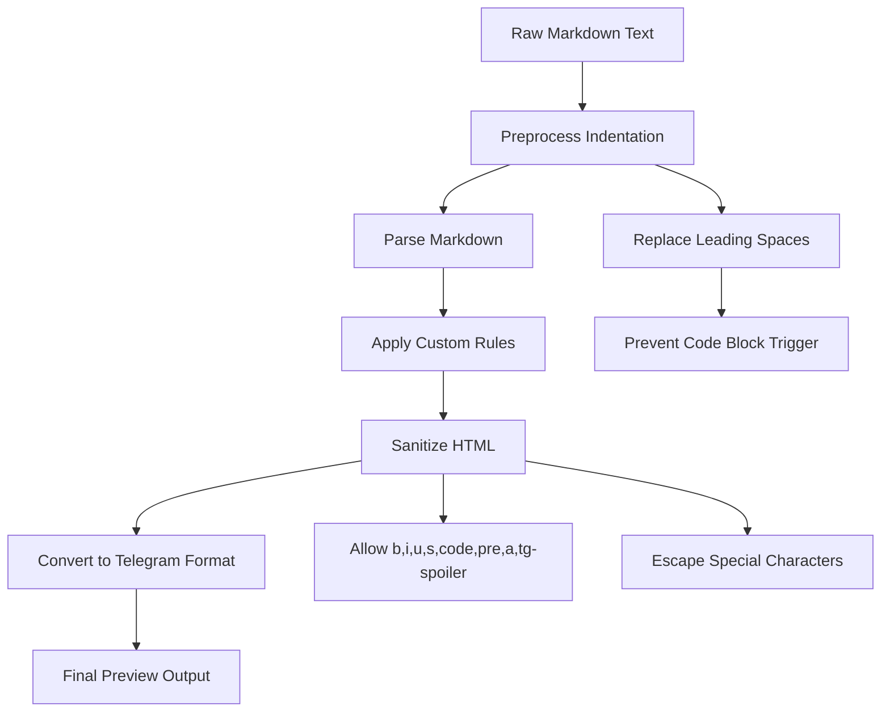

**Diagram sources**
- [PostConstructor.tsx:35-40](file://src/components/PostConstructor.tsx#L35-L40)
- [App.tsx:375-399](file://src/App.tsx#L375-L399)

#### Character Limit Enforcement
The system enforces Telegram's character limits:

- **Dynamic Calculation**: Adjusts based on image presence
- **Visual Indicators**: Color-coded counters for immediate feedback
- **Validation**: Prevents publication attempts exceeding limits
- **Error Messaging**: Clear user-friendly error messages

**Section sources**
- [PostConstructor.tsx:173-179](file://src/components/PostConstructor.tsx#L173-L179)
- [App.tsx:914-918](file://src/App.tsx#L914-L918)

### Template System Integration

#### Template Application Workflow
The template system integrates seamlessly with the editor:

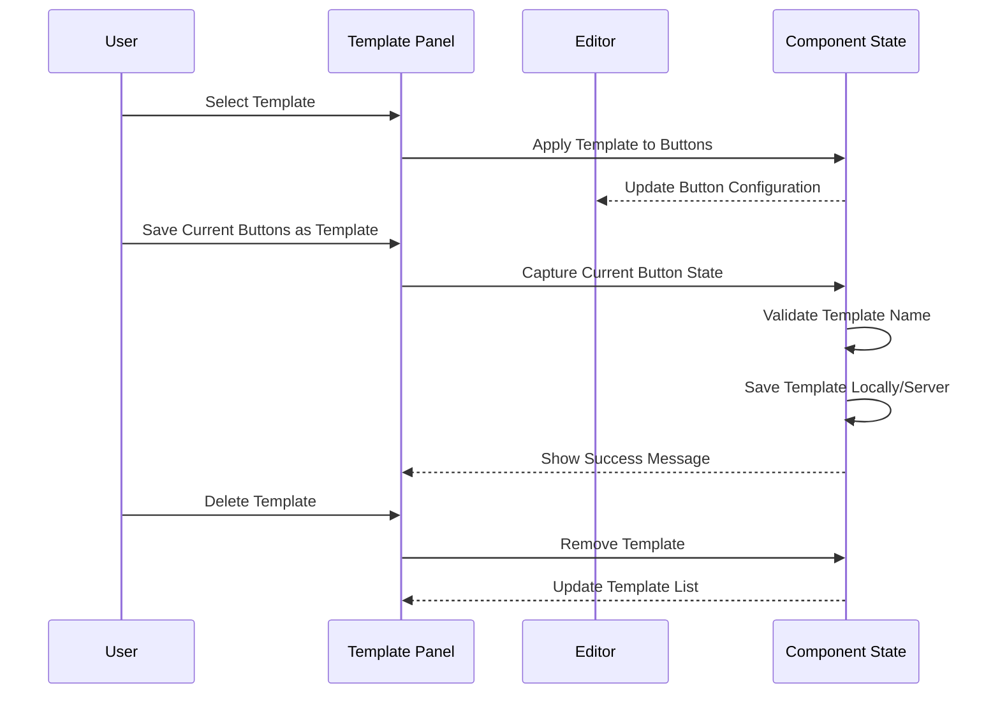

**Diagram sources**
- [App.tsx:1044-1075](file://src/App.tsx#L1044-L1075)
- [useButtonTemplates.ts:9-29](file://src/hooks/useButtonTemplates.ts#L9-L29)

#### Template Persistence
Templates are persisted using the same storage mechanisms as drafts:

- **Local Storage**: Standalone mode templates
- **Server Storage**: Network mode templates
- **Synchronization**: Automatic sync between modes
- **Conflict Resolution**: Merge strategies for template conflicts

**Section sources**
- [useButtonTemplates.ts:1-38](file://src/hooks/useButtonTemplates.ts#L1-L38)
- [App.tsx:1044-1075](file://src/App.tsx#L1044-L1075)

### Usage Examples

#### Basic Content Creation Workflow
1. **Open Constructor**: Click "New Publication" button
2. **Write Content**: Use markdown editor with real-time preview
3. **Add Images**: Upload or sync images from device
4. **Configure Buttons**: Add interactive buttons with URLs
5. **Review Limits**: Check character count and adjust content
6. **Publish**: Choose publish or schedule options

#### Image Insertion Process
1. **Upload Method**: Select files from device storage
2. **Sync Method**: Scan device storage for existing images
3. **Gallery Method**: Browse synchronized images
4. **Selection**: Drag to reorder, click to select/deselect
5. **Main Image**: Designate featured image

#### Button Configuration Example
1. **Add Button**: Click plus icon in button panel
2. **Set Text**: Enter button label
3. **Set URL**: Enter destination URL
4. **Validate**: System automatically adds protocol if missing
5. **Remove**: Use trash icon to delete unwanted buttons

#### Template Application
1. **Create Template**: Save current button configuration
2. **Apply Template**: Select template from dropdown
3. **Edit Template**: Modify saved template configuration
4. **Delete Template**: Remove unused templates

### Component Props and State Management

#### Props Interface
The component receives comprehensive state and handlers via props:

| Prop Category | Purpose | Data Type | Usage |
|---------------|---------|-----------|-------|
| **State Management** | Component state | Various | Controlled component pattern |
| **Callbacks** | User actions | Functions | Event handling and state updates |
| **Integration** | External systems | Objects/Arrays | Hook integration and API communication |
| **UI Controls** | Presentation logic | Booleans | Conditional rendering and animations |

#### State Management Patterns
- **Local State**: Text editing with controlled component pattern
- **Parent State**: Shared state managed by application container
- **Event Handlers**: Callback functions for state updates
- **Lifecycle**: Cleanup and cleanup handlers for resource management

**Section sources**
- [PostConstructor.tsx:50-94](file://src/components/PostConstructor.tsx#L50-L94)

### Event Handling Patterns

#### User Interaction Events
The component handles various user interaction patterns:

- **Form Inputs**: Controlled components with immediate state updates
- **Button Clicks**: Action triggers with validation and error handling
- **Drag-and-Drop**: Reordering with visual feedback and state persistence
- **File Uploads**: Async operations with progress indication
- **Keyboard Shortcuts**: Accessibility-enhanced navigation

#### Error Handling
Robust error handling covers:

- **Network Errors**: Graceful degradation with retry mechanisms
- **Validation Errors**: User-friendly error messages
- **Permission Errors**: Clear permission request flows
- **System Errors**: Comprehensive logging and user notification

**Section sources**
- [PostConstructor.tsx:283-288](file://src/components/PostConstructor.tsx#L283-L288)
- [App.tsx:851-863](file://src/App.tsx#L851-L863)

## Dependency Analysis

### External Dependencies
The component relies on several key external libraries:

```mermaid
graph TB
PostConstructor --> Motion[motion/react]
PostConstructor --> DnDKit[@dnd-kit/core]
PostConstructor --> SortableContext[@dnd-kit/sortable]
PostConstructor --> MdEditor[react-markdown-editor-lite]
PostConstructor --> MarkdownIt[markdown-it]
PostConstructor --> LucideIcons[lucide-react]
Motion --> FramerMotion[Framer Motion Library]
DnDKit --> DnDKitCore[Drag and Drop Core]
SortableContext --> SortableUtilities[Sortable Utilities]
MdEditor --> ReactMarkdownEditorLite[Markdown Editor Library]
MarkdownIt --> MarkdownParser[Markdown Parser]
LucideIcons --> IconComponents[Icon Components]
```

**Diagram sources**
- [PostConstructor.tsx:1-9](file://src/components/PostConstructor.tsx#L1-L9)

### Internal Dependencies
The component integrates with multiple internal systems:

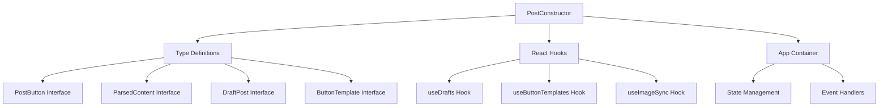

**Diagram sources**
- [types.ts:1-48](file://src/types.ts#L1-L48)
- [useDrafts.ts:1-88](file://src/hooks/useDrafts.ts#L1-L88)
- [useButtonTemplates.ts:1-38](file://src/hooks/useButtonTemplates.ts#L1-L38)
- [useImageSync.ts:1-42](file://src/hooks/useImageSync.ts#L1-L42)

### Coupling and Cohesion
The component demonstrates excellent separation of concerns:

- **High Cohesion**: Related functionality grouped within component
- **Low Coupling**: Minimal dependencies on external systems
- **Single Responsibility**: Focused on content creation workflow
- **Testability**: Clear boundaries for unit testing

**Section sources**
- [PostConstructor.tsx:1-294](file://src/components/PostConstructor.tsx#L1-L294)

## Performance Considerations

### Optimization Strategies
The component implements several performance optimizations:

- **Virtual Scrolling**: Efficient rendering of large image galleries
- **Lazy Loading**: Images loaded on demand
- **Debounced Updates**: Input handling with debouncing
- **Memoization**: Expensive computations cached with useMemo
- **Conditional Rendering**: Dynamic content loading based on active tab

### Memory Management
- **Cleanup Functions**: Proper cleanup of event listeners and timers
- **Resource Pooling**: Reuse of DOM elements where possible
- **State Optimization**: Minimized state updates to reduce re-renders

### Network Performance
- **Batch Operations**: Multiple image uploads processed efficiently
- **Progress Indication**: User feedback during long-running operations
- **Error Recovery**: Graceful handling of network failures

## Troubleshooting Guide

### Common Issues and Solutions

#### Image Loading Problems
**Symptoms**: Images not appearing in gallery
**Causes**: 
- Insufficient storage permissions
- Incorrect image path configuration
- Network connectivity issues

**Solutions**:
- Verify storage permissions in device settings
- Check image path configuration in settings
- Test network connectivity and retry operation

#### AI Processing Failures
**Symptoms**: AI processing errors or empty results
**Causes**:
- Invalid API key configuration
- Exceeded quota limits
- Network connectivity issues

**Solutions**:
- Verify API key configuration in settings
- Check provider quota status
- Retry operation after cooldown period

#### Character Limit Exceeded
**Symptoms**: Publication blocked with error message
**Solutions**:
- Reduce content length or remove images
- Use external links instead of embedded content
- Optimize markdown formatting

#### Drag-and-Drop Issues
**Symptoms**: Images won't reorder or selection fails
**Solutions**:
- Ensure sufficient touch target size
- Check for overlapping elements
- Restart application if issues persist

**Section sources**
- [App.tsx:851-863](file://src/App.tsx#L851-L863)
- [App.tsx:914-918](file://src/App.tsx#L914-L918)

## Conclusion
The Post Constructor component provides a comprehensive, production-ready solution for content creation with Telegram posts. Its modular architecture, extensive integration capabilities, and thoughtful user experience design make it suitable for both individual content creators and enterprise content management workflows. The component's responsive design, accessibility features, and robust error handling ensure reliable operation across diverse deployment scenarios.

The integration with draft management, image synchronization, and template systems creates a cohesive content creation ecosystem that streamlines the entire publishing workflow from ideation to publication. The component's extensible design allows for future enhancements while maintaining backward compatibility and performance standards.