# Publishing Workflow

<cite>
**Referenced Files in This Document**
- [server.ts](file://server.ts)
- [App.tsx](file://src/App.tsx)
- [standaloneService.ts](file://src/services/standaloneService.ts)
- [types.ts](file://src/types.ts)
- [useDrafts.ts](file://src/hooks/useDrafts.ts)
- [useScheduledPosts.ts](file://src/hooks/useScheduledPosts.ts)
- [usePublishedPosts.ts](file://src/hooks/usePublishedPosts.ts)
- [useImageSync.ts](file://src/hooks/useImageSync.ts)
- [PostConstructor.tsx](file://src/components/PostConstructor.tsx)
- [serverUtils.ts](file://src/serverUtils.ts)
</cite>

## Table of Contents
1. [Introduction](#introduction)
2. [Project Structure](#project-structure)
3. [Core Components](#core-components)
4. [Architecture Overview](#architecture-overview)
5. [Detailed Component Analysis](#detailed-component-analysis)
6. [Dependency Analysis](#dependency-analysis)
7. [Performance Considerations](#performance-considerations)
8. [Troubleshooting Guide](#troubleshooting-guide)
9. [Conclusion](#conclusion)

## Introduction
This document explains the complete content publishing workflow for a Telegram channel publishing system. It covers the end-to-end process from content preparation through AI processing, media selection, formatting, and final publication. It also documents the integration with Telegram bot APIs, media group support, inline button creation, publishing history tracking, post status management, error handling, and the differences between standalone and web publishing modes. Additionally, it describes the role of the standalone service in direct API calls and how AI processing, image synchronization, and content formatting are handled.

## Project Structure
The publishing workflow spans both the frontend application and the backend server:
- Frontend (React/TypeScript): Handles user interactions, content construction, AI processing, media selection, scheduling, and publishing actions.
- Backend (Node.js/Express): Manages Telegram bot lifecycle, publishes posts to Telegram channels, stores drafts/scheduled/published posts, and exposes APIs for the frontend.

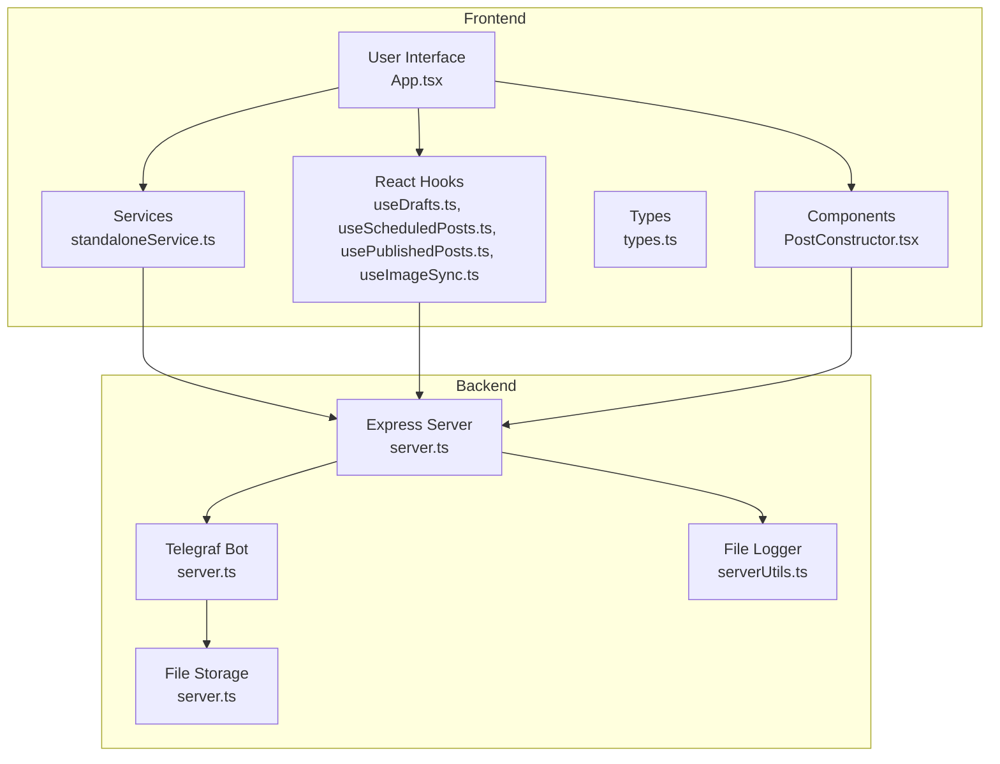

**Diagram sources**
- [App.tsx:168-1888](file://src/App.tsx#L168-L1888)
- [standaloneService.ts:1-175](file://src/services/standaloneService.ts#L1-L175)
- [useDrafts.ts:1-88](file://src/hooks/useDrafts.ts#L1-L88)
- [useScheduledPosts.ts:1-38](file://src/hooks/useScheduledPosts.ts#L1-L38)
- [usePublishedPosts.ts:1-38](file://src/hooks/usePublishedPosts.ts#L1-L38)
- [useImageSync.ts:1-42](file://src/hooks/useImageSync.ts#L1-L42)
- [PostConstructor.tsx:1-294](file://src/components/PostConstructor.tsx#L1-L294)
- [server.ts:1-1454](file://server.ts#L1-L1454)
- [serverUtils.ts:1-23](file://src/serverUtils.ts#L1-L23)

**Section sources**
- [App.tsx:168-1888](file://src/App.tsx#L168-L1888)
- [server.ts:1-1454](file://server.ts#L1-L1454)

## Core Components
- Telegram API integration: Direct HTTP calls to Telegram Bot API for sending messages, photos, and media groups, plus inline keyboard buttons.
- AI processing: Gemini-based content rewriting and translation with fallback providers and rate limiting.
- Media handling: Local image sync for standalone mode and server-side image storage and retrieval.
- Content formatting: Markdown-to-HTML conversion with Telegram-safe sanitization and spoiler support.
- Publishing lifecycle: Drafts, scheduling, publishing, and published history tracking.

**Section sources**
- [standaloneService.ts:75-146](file://src/services/standaloneService.ts#L75-L146)
- [server.ts:412-645](file://server.ts#L412-L645)
- [server.ts:806-934](file://server.ts#L806-L934)
- [App.tsx:348-399](file://src/App.tsx#L348-L399)

## Architecture Overview
The publishing workflow integrates frontend and backend components to deliver a seamless experience:
- Frontend constructs posts, optionally processes text via AI, selects images, and schedules or publishes immediately.
- Backend runs a Telegraf bot, validates configurations, sanitizes content, and publishes to Telegram channels.
- Both standalone and web modes share the same core logic, differing only in transport and persistence.

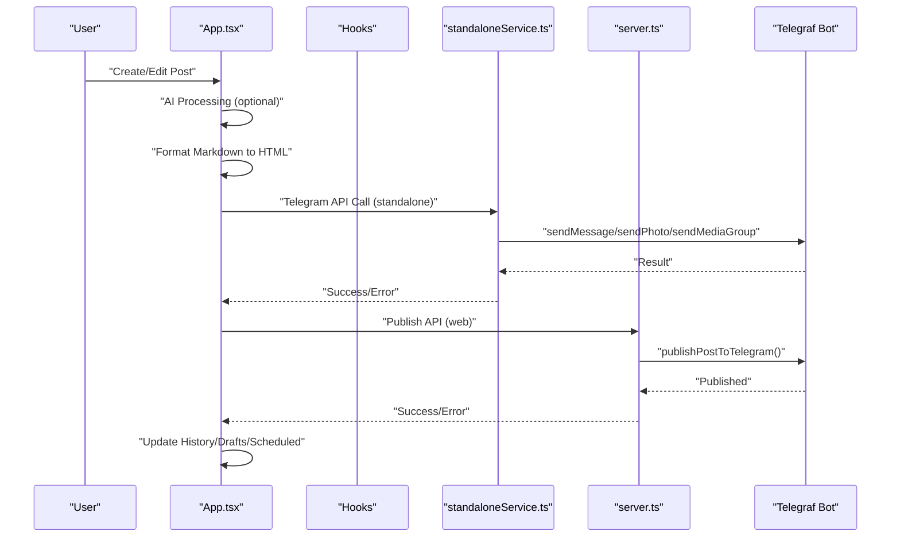

**Diagram sources**
- [App.tsx:905-975](file://src/App.tsx#L905-L975)
- [standaloneService.ts:75-146](file://src/services/standaloneService.ts#L75-L146)
- [server.ts:806-934](file://server.ts#L806-L934)

## Detailed Component Analysis

### Telegram API Integration and Publishing
The standalone service encapsulates Telegram API calls for direct operation without a backend dependency:
- Direct HTTP calls to Telegram Bot API endpoints for getMe, sendMessage, sendPhoto, sendMediaGroup, and getUpdates.
- Native platform detection enables Capacitor HTTP for Android; otherwise uses browser fetch.
- Inline keyboard buttons are constructed from post buttons and attached to messages.

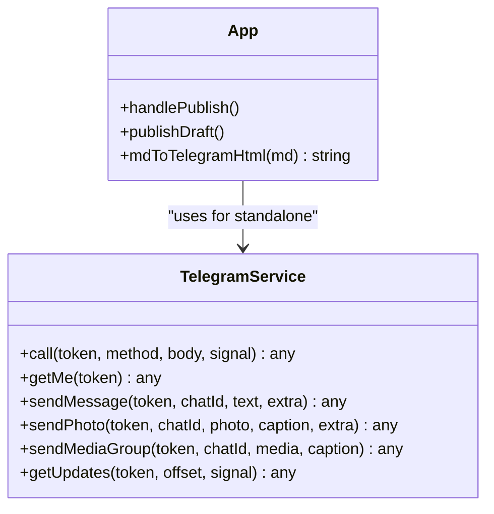

**Diagram sources**
- [standaloneService.ts:75-146](file://src/services/standaloneService.ts#L75-L146)
- [App.tsx:905-975](file://src/App.tsx#L905-L975)

**Section sources**
- [standaloneService.ts:75-146](file://src/services/standaloneService.ts#L75-L146)
- [App.tsx:905-975](file://src/App.tsx#L905-L975)

### AI Processing and Content Formatting
AI processing transforms raw text into Telegram-ready HTML:
- Provider fallback chain: Gemini, GitHub, OpenRouter, DeepSeek.
- Rate limiting and quota handling with user-friendly messages.
- Markdown-to-HTML conversion with Telegram-safe sanitization and spoiler support.

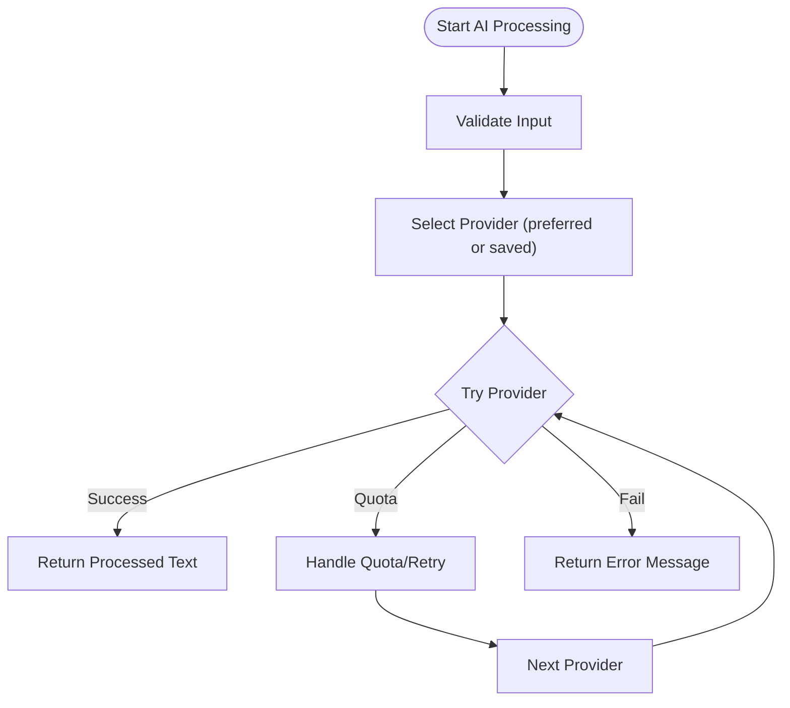

**Diagram sources**
- [server.ts:412-645](file://server.ts#L412-L645)

**Section sources**
- [server.ts:412-645](file://server.ts#L412-L645)
- [App.tsx:811-864](file://src/App.tsx#L811-L864)
- [App.tsx:375-399](file://src/App.tsx#L375-L399)

### Media Group Support and Inline Buttons
Media group support allows publishing multiple images as a single unit with a shared caption. Inline buttons are added as reply markup when present:
- Single image: sendPhoto with optional caption and buttons.
- Multiple images: sendMediaGroup with per-image captions and optional buttons appended after the group.
- Inline keyboard buttons: constructed from post buttons and attached to messages.

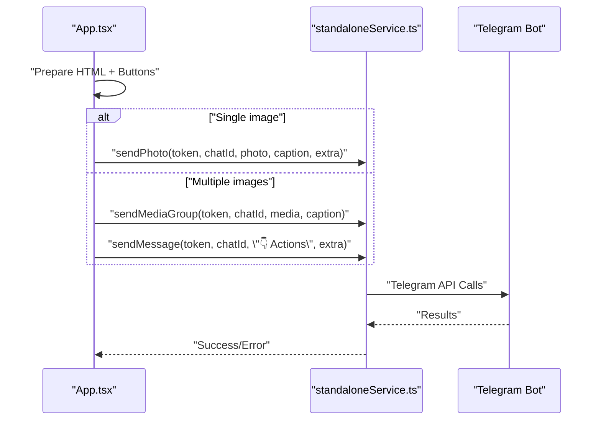

**Diagram sources**
- [App.tsx:938-948](file://src/App.tsx#L938-L948)
- [standaloneService.ts:131-141](file://src/services/standaloneService.ts#L131-L141)

**Section sources**
- [App.tsx:938-948](file://src/App.tsx#L938-L948)
- [standaloneService.ts:131-141](file://src/services/standaloneService.ts#L131-L141)

### Publishing History Tracking and Status Management
Drafts, scheduled posts, and published posts are tracked and persisted:
- Drafts: editable posts saved locally or via backend API.
- Scheduled posts: posts with future timestamps managed by the scheduler.
- Published posts: recent publications stored for quick access.

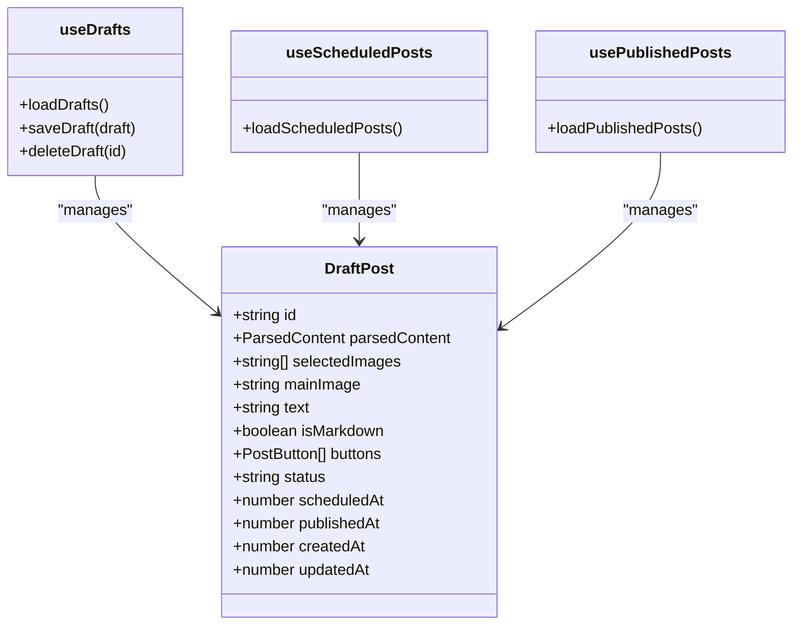

**Diagram sources**
- [types.ts:13-26](file://src/types.ts#L13-L26)
- [useDrafts.ts:1-88](file://src/hooks/useDrafts.ts#L1-L88)
- [useScheduledPosts.ts:1-38](file://src/hooks/useScheduledPosts.ts#L1-L38)
- [usePublishedPosts.ts:1-38](file://src/hooks/usePublishedPosts.ts#L1-L38)

**Section sources**
- [types.ts:13-26](file://src/types.ts#L13-L26)
- [useDrafts.ts:1-88](file://src/hooks/useDrafts.ts#L1-L88)
- [useScheduledPosts.ts:1-38](file://src/hooks/useScheduledPosts.ts#L1-L38)
- [usePublishedPosts.ts:1-38](file://src/hooks/usePublishedPosts.ts#L1-L38)

### Image Synchronization and Content Formatting
Image synchronization supports both standalone and web modes:
- Standalone: reads device storage, filters images, and updates UI state.
- Web: server manages image uploads, storage, and retrieval via API endpoints.

Content formatting ensures compatibility with Telegram’s HTML subset:
- Markdown preprocessing preserves indentation and spoiler syntax.
- HTML sanitization removes disallowed tags and normalizes output.

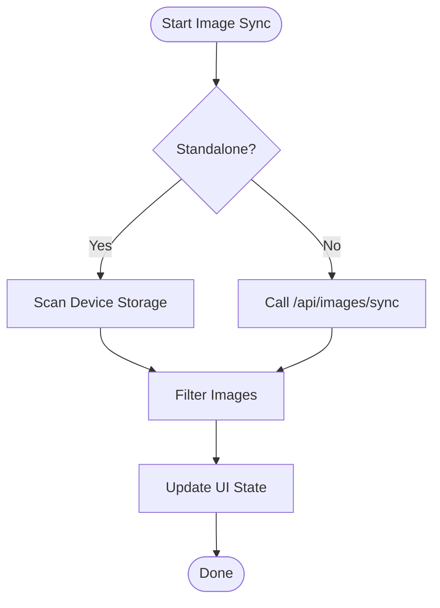

**Diagram sources**
- [App.tsx:401-522](file://src/App.tsx#L401-L522)
- [server.ts:1098-1123](file://server.ts#L1098-L1123)

**Section sources**
- [App.tsx:401-522](file://src/App.tsx#L401-L522)
- [server.ts:1098-1123](file://server.ts#L1098-L1123)
- [App.tsx:348-399](file://src/App.tsx#L348-L399)

### Standalone vs Web Publishing Differences
- Standalone mode: Uses standaloneService to call Telegram API directly and persists data locally.
- Web mode: Uses server.ts to manage Telegraf bot, publish posts, and persist data to files.

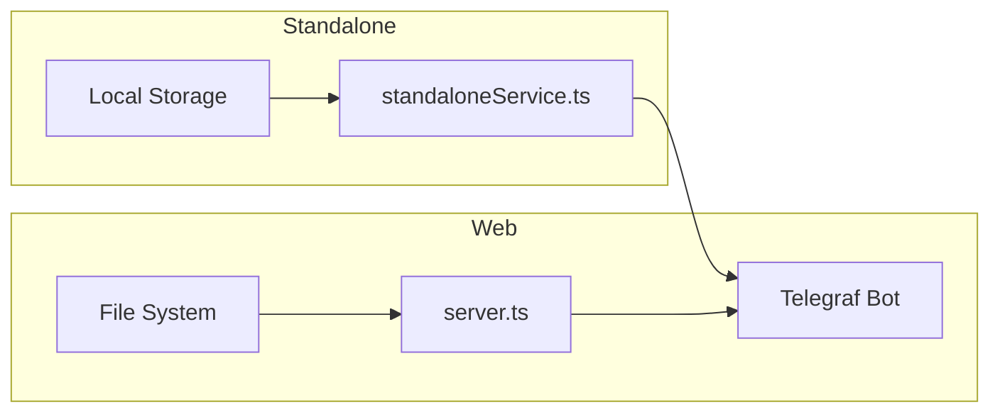

**Diagram sources**
- [standaloneService.ts:1-72](file://src/services/standaloneService.ts#L1-L72)
- [server.ts:127-173](file://server.ts#L127-L173)

**Section sources**
- [standaloneService.ts:1-72](file://src/services/standaloneService.ts#L1-L72)
- [server.ts:127-173](file://server.ts#L127-L173)

### Publishing Workflows

#### Publishing a New Post
- Construct post content in PostConstructor.
- Optionally process text via AI.
- Select images and add inline buttons.
- Choose publish mode (standalone or web).
- Send to Telegram and update history.

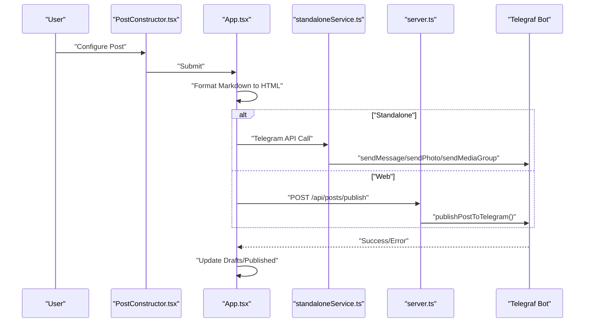

**Diagram sources**
- [PostConstructor.tsx:1-294](file://src/components/PostConstructor.tsx#L1-L294)
- [App.tsx:905-975](file://src/App.tsx#L905-L975)
- [standaloneService.ts:75-146](file://src/services/standaloneService.ts#L75-L146)
- [server.ts:1233-1241](file://server.ts#L1233-L1241)

**Section sources**
- [PostConstructor.tsx:1-294](file://src/components/PostConstructor.tsx#L1-L294)
- [App.tsx:905-975](file://src/App.tsx#L905-L975)
- [standaloneService.ts:75-146](file://src/services/standaloneService.ts#L75-L146)
- [server.ts:1233-1241](file://server.ts#L1233-L1241)

#### Publishing a Draft
- Load draft from storage.
- Convert Markdown to HTML.
- Send to Telegram and move from drafts/scheduled to published.

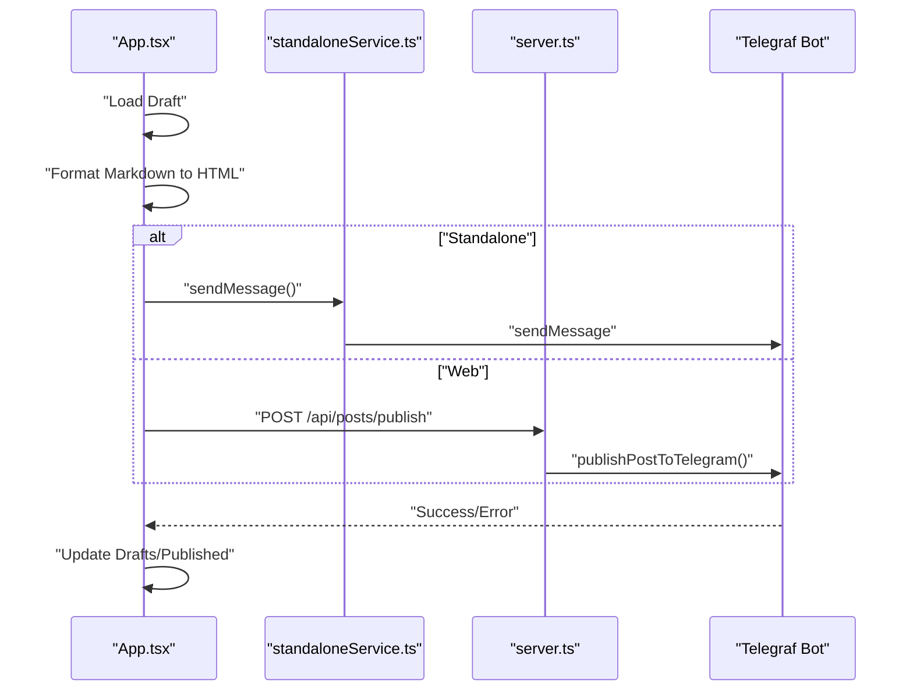

**Diagram sources**
- [App.tsx:977-1020](file://src/App.tsx#L977-L1020)
- [standaloneService.ts:104-114](file://src/services/standaloneService.ts#L104-L114)
- [server.ts:1233-1241](file://server.ts#L1233-L1241)

**Section sources**
- [App.tsx:977-1020](file://src/App.tsx#L977-L1020)
- [standaloneService.ts:104-114](file://src/services/standaloneService.ts#L104-L114)
- [server.ts:1233-1241](file://server.ts#L1233-L1241)

## Dependency Analysis
The publishing workflow depends on several subsystems:
- Frontend dependencies: React hooks for state management, standaloneService for Telegram API, and server utilities for logging.
- Backend dependencies: Telegraf for bot operations, Cheerio for HTML manipulation, and file system for persistence.

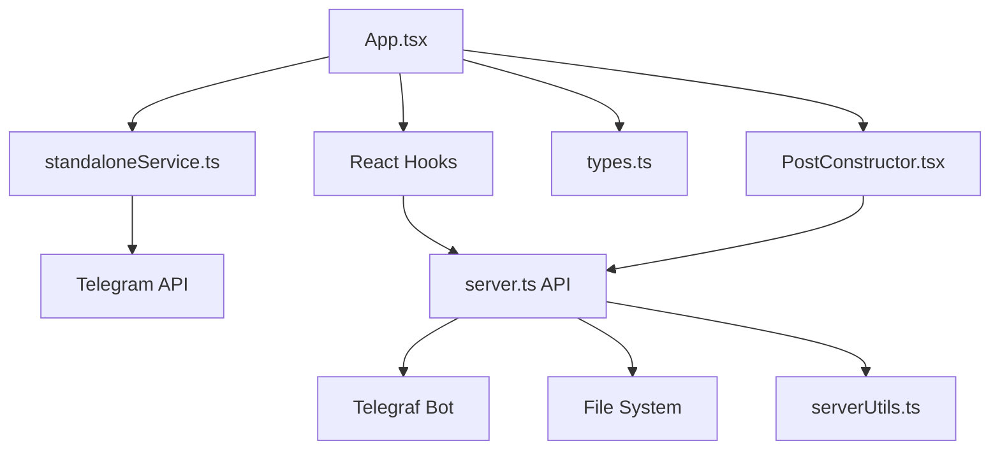

**Diagram sources**
- [App.tsx:168-1888](file://src/App.tsx#L168-L1888)
- [standaloneService.ts:1-175](file://src/services/standaloneService.ts#L1-L175)
- [types.ts:1-48](file://src/types.ts#L1-L48)
- [PostConstructor.tsx:1-294](file://src/components/PostConstructor.tsx#L1-L294)
- [server.ts:1-1454](file://server.ts#L1-L1454)
- [serverUtils.ts:1-23](file://src/serverUtils.ts#L1-L23)

**Section sources**
- [App.tsx:168-1888](file://src/App.tsx#L168-L1888)
- [server.ts:1-1454](file://server.ts#L1-L1454)

## Performance Considerations
- Rate limiting: AI and mutation endpoints enforce rate limits to prevent abuse.
- Chunked media publishing: Images are sent in chunks to respect Telegram limits.
- Health checks: Backend monitors bot health and restarts on failures.
- Logging: File-based logging helps diagnose performance and errors.

[No sources needed since this section provides general guidance]

## Troubleshooting Guide
Common issues and resolutions:
- Telegram API errors: Verify token and chat ID configuration; check for 409 conflicts and restart bot.
- AI quota exceeded: Switch providers or wait for quota reset; server returns retry hints.
- Image sync failures: Ensure correct image path and permissions; standalone requires storage permissions.
- Publishing failures: Review logs and error messages; confirm content length limits and button URLs.

**Section sources**
- [server.ts:377-409](file://server.ts#L377-L409)
- [server.ts:548-562](file://server.ts#L548-L562)
- [App.tsx:1313-1335](file://src/App.tsx#L1313-L1335)
- [serverUtils.ts:1-23](file://src/serverUtils.ts#L1-L23)

## Conclusion
The publishing workflow integrates frontend and backend components to provide a robust, flexible system for publishing Telegram posts. It supports both standalone and web modes, offers AI-powered content processing, handles media efficiently, and maintains comprehensive publishing history. By leveraging Telegram’s API capabilities and structured data models, the system ensures reliable and scalable content delivery.