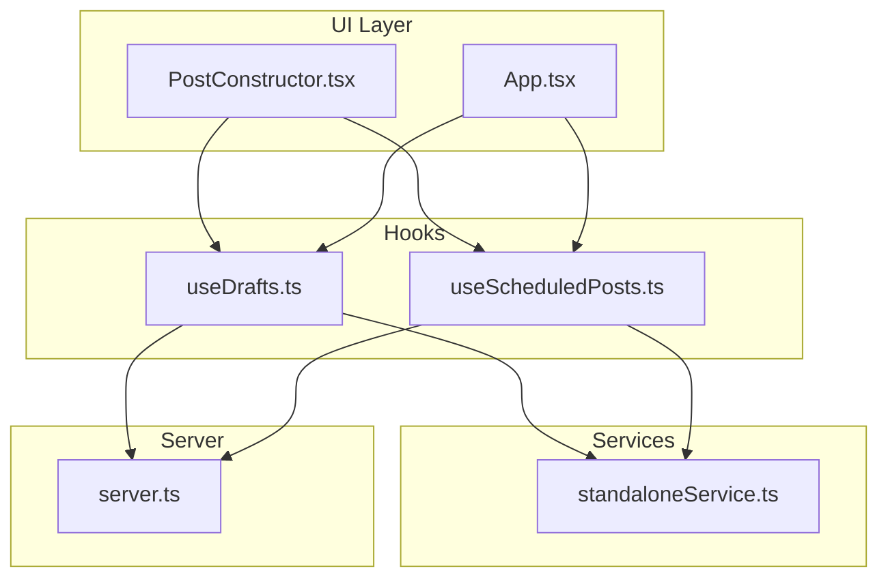
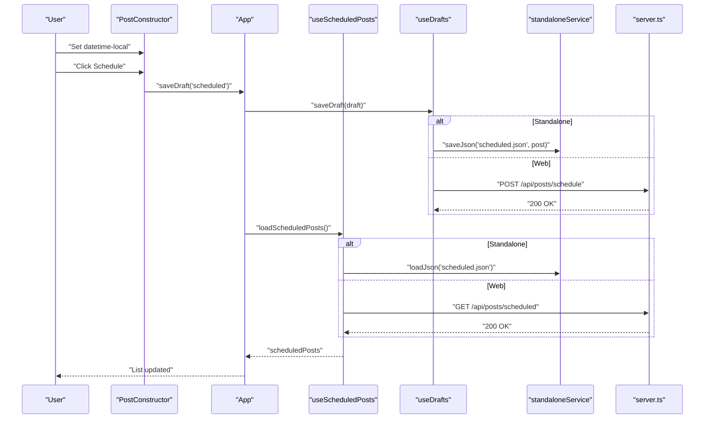
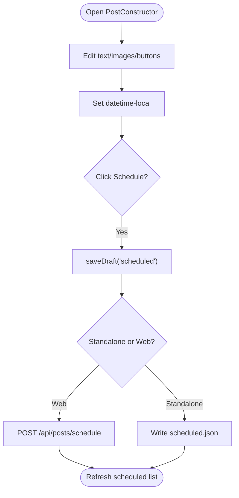
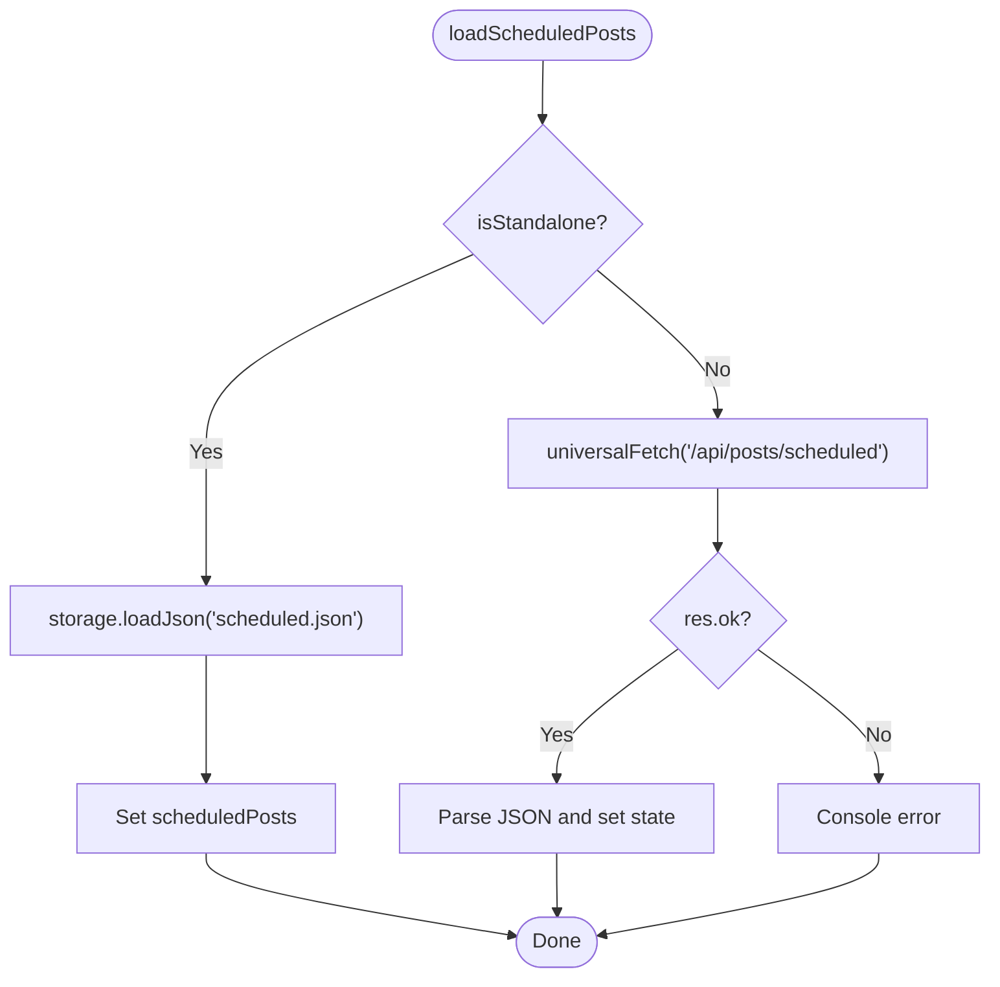
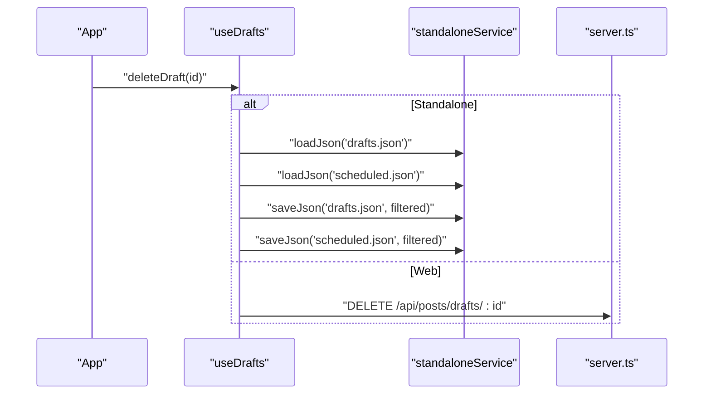
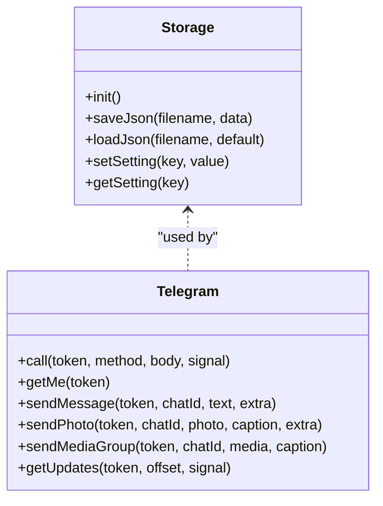
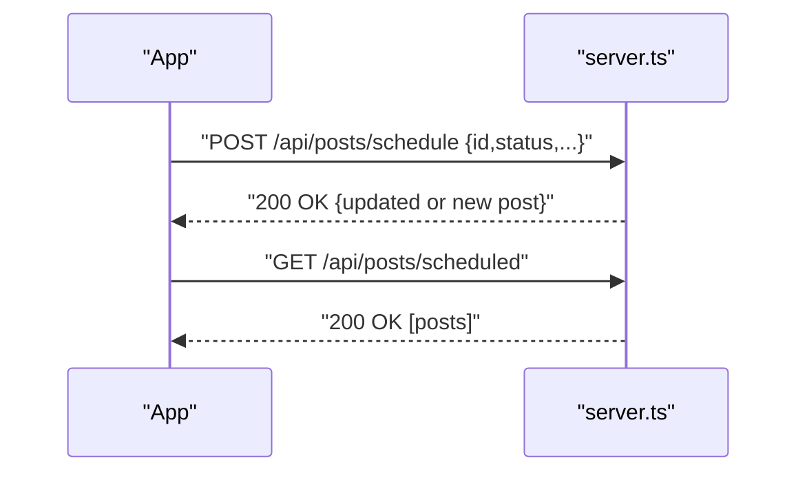
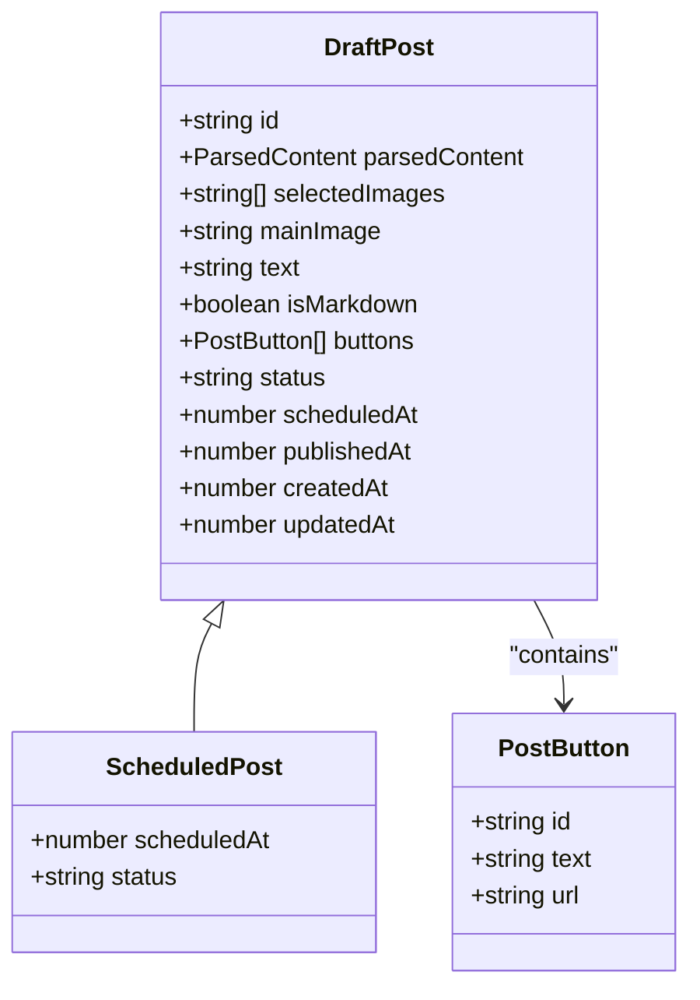
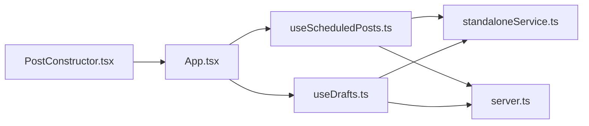

# Scheduling System

<cite>
**Referenced Files in This Document**
- [App.tsx](file://src/App.tsx)
- [PostConstructor.tsx](file://src/components/PostConstructor.tsx)
- [useScheduledPosts.ts](file://src/hooks/useScheduledPosts.ts)
- [useDrafts.ts](file://src/hooks/useDrafts.ts)
- [standaloneService.ts](file://src/services/standaloneService.ts)
- [types.ts](file://src/types.ts)
- [server.ts](file://server.ts)
</cite>

## Table of Contents
1. [Introduction](#introduction)
2. [Project Structure](#project-structure)
3. [Core Components](#core-components)
4. [Architecture Overview](#architecture-overview)
5. [Detailed Component Analysis](#detailed-component-analysis)
6. [Dependency Analysis](#dependency-analysis)
7. [Performance Considerations](#performance-considerations)
8. [Troubleshooting Guide](#troubleshooting-guide)
9. [Conclusion](#conclusion)

## Introduction
This document describes the scheduling system for time-based publishing. It covers how scheduled posts are created, stored, and tracked across standalone and web environments, how the PostConstructor integrates with scheduling, and how the UI enables users to set future publish times. It also outlines the data models, dual-mode operation (standalone vs server-backed), and practical examples for future scheduling, recurring-like patterns, and conflict handling.

## Project Structure
The scheduling system spans UI components, hooks for data access, service abstractions for storage, and a server backend for web mode. Key areas:
- UI: PostConstructor provides scheduling controls and draft persistence.
- Hooks: useScheduledPosts and useDrafts encapsulate loading and saving logic for both modes.
- Services: standaloneService abstracts filesystem/local storage for standalone mode.
- Server: server.ts exposes endpoints for drafts, scheduled posts, and publishing.

**Diagram sources**
- [PostConstructor.tsx:1-294](file://src/components/PostConstructor.tsx#L1-L294)
- [App.tsx:168-1834](file://src/App.tsx#L168-L1834)
- [useScheduledPosts.ts:1-38](file://src/hooks/useScheduledPosts.ts#L1-L38)
- [useDrafts.ts:1-88](file://src/hooks/useDrafts.ts#L1-L88)
- [standaloneService.ts:1-175](file://src/services/standaloneService.ts#L1-L175)
- [server.ts:1185-1241](file://server.ts#L1185-L1241)

**Section sources**
- [App.tsx:168-1834](file://src/App.tsx#L168-L1834)
- [PostConstructor.tsx:1-294](file://src/components/PostConstructor.tsx#L1-L294)
- [useScheduledPosts.ts:1-38](file://src/hooks/useScheduledPosts.ts#L1-L38)
- [useDrafts.ts:1-88](file://src/hooks/useDrafts.ts#L1-L88)
- [standaloneService.ts:1-175](file://src/services/standaloneService.ts#L1-L175)
- [server.ts:1185-1241](file://server.ts#L1185-L1241)

## Core Components
- PostConstructor: Provides scheduling UI (datetime picker) and actions to save as draft or schedule.
- useScheduledPosts: Loads scheduled posts in standalone or web mode.
- useDrafts: Manages drafts and ensures deletion removes associated scheduled entries.
- standaloneService: Filesystem and preferences for standalone storage.
- Types: Defines DraftPost, ScheduledPost, and conversion helpers.
- Server endpoints: Expose CRUD for drafts, scheduled posts, and publishing.

**Section sources**
- [PostConstructor.tsx:270-281](file://src/components/PostConstructor.tsx#L270-L281)
- [useScheduledPosts.ts:5-36](file://src/hooks/useScheduledPosts.ts#L5-L36)
- [useDrafts.ts:31-73](file://src/hooks/useDrafts.ts#L31-L73)
- [standaloneService.ts:11-72](file://src/services/standaloneService.ts#L11-L72)
- [types.ts:13-41](file://src/types.ts#L13-L41)
- [server.ts:1204-1241](file://server.ts#L1204-L1241)

## Architecture Overview
The system supports two operational modes:
- Standalone: Uses local filesystem and preferences via standaloneService to persist drafts and scheduled posts.
- Web: Uses server endpoints to manage posts and publishes via Telegram API through the server.

**Diagram sources**
- [PostConstructor.tsx:270-281](file://src/components/PostConstructor.tsx#L270-L281)
- [App.tsx:873-904](file://src/App.tsx#L873-L904)
- [useScheduledPosts.ts:9-29](file://src/hooks/useScheduledPosts.ts#L9-L29)
- [useDrafts.ts:31-54](file://src/hooks/useDrafts.ts#L31-L54)
- [standaloneService.ts:25-54](file://src/services/standaloneService.ts#L25-L54)
- [server.ts:1218-1231](file://server.ts#L1218-L1231)

## Detailed Component Analysis

### PostConstructor Integration for Scheduling
- UI Elements:
  - Datetime-local input bound to scheduleDateTime.
  - “Schedule” action invokes saveDraft with status 'scheduled'.
  - “Publish” triggers server-side publish endpoint.
- Behavior:
  - When scheduled, the post is persisted with status 'scheduled' and a timestamp.
  - The scheduled list is refreshed after save.

**Diagram sources**
- [PostConstructor.tsx:270-281](file://src/components/PostConstructor.tsx#L270-L281)
- [App.tsx:873-904](file://src/App.tsx#L873-L904)
- [server.ts:1218-1231](file://server.ts#L1218-L1231)
- [standaloneService.ts:25-54](file://src/services/standaloneService.ts#L25-L54)

**Section sources**
- [PostConstructor.tsx:270-281](file://src/components/PostConstructor.tsx#L270-L281)
- [App.tsx:873-904](file://src/App.tsx#L873-L904)

### Scheduled Posts Hook (useScheduledPosts)
- Responsibilities:
  - Load scheduled posts depending on mode.
  - Standalone: reads scheduled.json via storage.loadJson.
  - Web: calls GET /api/posts/scheduled and normalizes response.
- Returns:
  - scheduledPosts array, setScheduledPosts, loading flag, and loadScheduledPosts callback.

**Diagram sources**
- [useScheduledPosts.ts:9-29](file://src/hooks/useScheduledPosts.ts#L9-L29)
- [standaloneService.ts:38-54](file://src/services/standaloneService.ts#L38-L54)
- [server.ts:1205-1207](file://server.ts#L1205-L1207)

**Section sources**
- [useScheduledPosts.ts:5-36](file://src/hooks/useScheduledPosts.ts#L5-L36)

### Drafts Management and Deletion (useDrafts)
- Saving:
  - Standalone: writes to drafts.json and scheduled.json.
  - Web: POST /api/posts/drafts.
- Deleting:
  - Standalone: removes from both drafts.json and scheduled.json.
  - Web: DELETE /api/posts/drafts/:id.

**Diagram sources**
- [useDrafts.ts:56-73](file://src/hooks/useDrafts.ts#L56-L73)
- [standaloneService.ts:25-54](file://src/services/standaloneService.ts#L25-L54)
- [server.ts:1196-1202](file://server.ts#L1196-L1202)

**Section sources**
- [useDrafts.ts:31-73](file://src/hooks/useDrafts.ts#L31-L73)

### Standalone Storage Abstraction (standaloneService)
- Provides:
  - saveJson/loadJson for persistent JSON storage.
  - getSetting/setSetting for preferences.
  - Telegram API wrappers for standalone publishing.
- Ensures:
  - Native vs web fallback behavior.
  - Initialization of documents directory on native platforms.

**Diagram sources**
- [standaloneService.ts:11-146](file://src/services/standaloneService.ts#L11-L146)

**Section sources**
- [standaloneService.ts:11-72](file://src/services/standaloneService.ts#L11-L72)

### Server-Side Endpoints (server.ts)
- Scheduled posts:
  - GET /api/posts/scheduled returns posts with status 'scheduled'.
  - POST /api/posts/schedule creates or updates a scheduled post.
- Drafts:
  - GET /api/posts/drafts returns all drafts.
  - POST /api/posts/drafts persists a draft.
  - DELETE /api/posts/drafts/:id removes a draft.
- Publishing:
  - POST /api/posts/publish sends the post to Telegram via server.

**Diagram sources**
- [server.ts:1205-1231](file://server.ts#L1205-L1231)

**Section sources**
- [server.ts:1185-1241](file://server.ts#L1185-L1241)

### Data Models for Scheduled Posts
- DraftPost:
  - Fields include id, text, selectedImages, buttons, status, timestamps, and createdAt/updatedAt.
- ScheduledPost:
  - Extends DraftPost with required scheduledAt and enforced status 'scheduled'.
- Timestamp conversion:
  - convertToTimestamp converts ISO datetime-local to milliseconds.

**Diagram sources**
- [types.ts:13-41](file://src/types.ts#L13-L41)

**Section sources**
- [types.ts:13-41](file://src/types.ts#L13-L41)

## Dependency Analysis
- PostConstructor depends on App state and hooks to save and publish.
- useScheduledPosts and useDrafts depend on:
  - standaloneService for standalone mode.
  - server endpoints for web mode.
- App orchestrates:
  - saving drafts/schedules.
  - loading scheduled lists.
  - publishing via server.

**Diagram sources**
- [PostConstructor.tsx:1-294](file://src/components/PostConstructor.tsx#L1-L294)
- [App.tsx:168-1834](file://src/App.tsx#L168-L1834)
- [useScheduledPosts.ts:1-38](file://src/hooks/useScheduledPosts.ts#L1-L38)
- [useDrafts.ts:1-88](file://src/hooks/useDrafts.ts#L1-L88)
- [standaloneService.ts:1-175](file://src/services/standaloneService.ts#L1-L175)
- [server.ts:1185-1241](file://server.ts#L1185-L1241)

**Section sources**
- [App.tsx:168-1834](file://src/App.tsx#L168-L1834)
- [PostConstructor.tsx:1-294](file://src/components/PostConstructor.tsx#L1-L294)
- [useScheduledPosts.ts:1-38](file://src/hooks/useScheduledPosts.ts#L1-L38)
- [useDrafts.ts:1-88](file://src/hooks/useDrafts.ts#L1-L88)
- [standaloneService.ts:1-175](file://src/services/standaloneService.ts#L1-L175)
- [server.ts:1185-1241](file://server.ts#L1185-L1241)

## Performance Considerations
- Standalone mode:
  - Filesystem I/O occurs on save/delete; batch operations where possible.
  - Limit concurrent writes to scheduled.json and drafts.json.
- Web mode:
  - Rate limiting applies to API endpoints; avoid rapid successive saves.
  - Debounce image path updates to reduce network calls.
- Rendering:
  - Keep scheduled list updates minimal; avoid unnecessary re-renders by normalizing responses.

## Troubleshooting Guide
- Scheduled post not appearing:
  - Verify status is 'scheduled' and scheduledAt is set.
  - Confirm mode: standalone must have scheduled.json; web must reach /api/posts/scheduled.
- Save errors:
  - Check console logs for failed saveDraft or loadScheduledPosts errors.
  - Ensure server URL is valid and reachable.
- Conflicts:
  - Deleting a draft also removes it from scheduled lists in standalone mode.
  - In web mode, deleting via DELETE /api/posts/drafts/:id removes both draft and schedule.

**Section sources**
- [useScheduledPosts.ts:24-28](file://src/hooks/useScheduledPosts.ts#L24-L28)
- [useDrafts.ts:56-73](file://src/hooks/useDrafts.ts#L56-L73)
- [server.ts:1205-1207](file://server.ts#L1205-L1207)

## Conclusion
The scheduling system cleanly separates UI, hooks, and storage concerns across standalone and web modes. Users can set future publish times via PostConstructor, and the system persists and tracks scheduled posts accordingly. The hooks and server endpoints provide a consistent contract for loading, saving, and deleting posts, while the data models ensure type safety and clarity around timestamps and statuses.