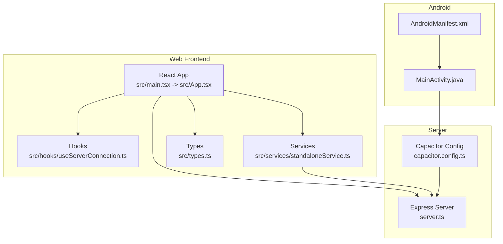
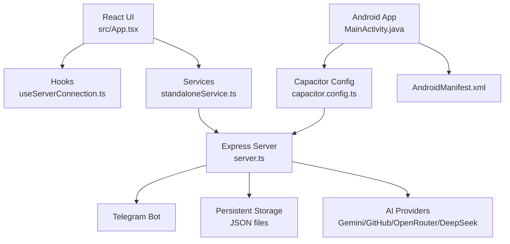
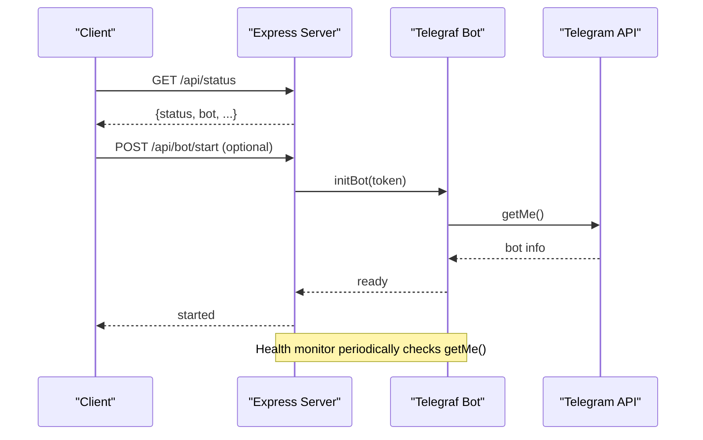
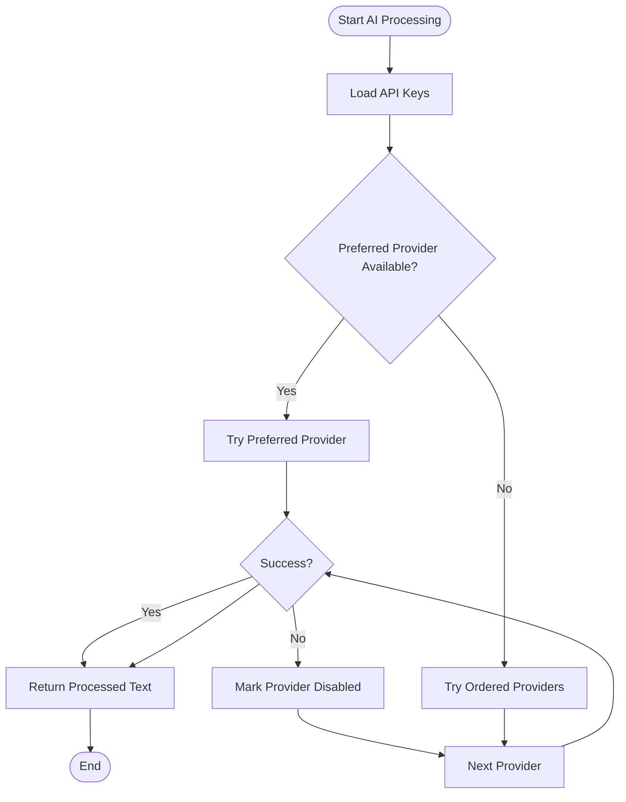
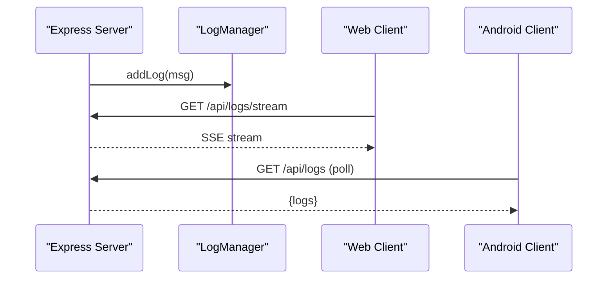
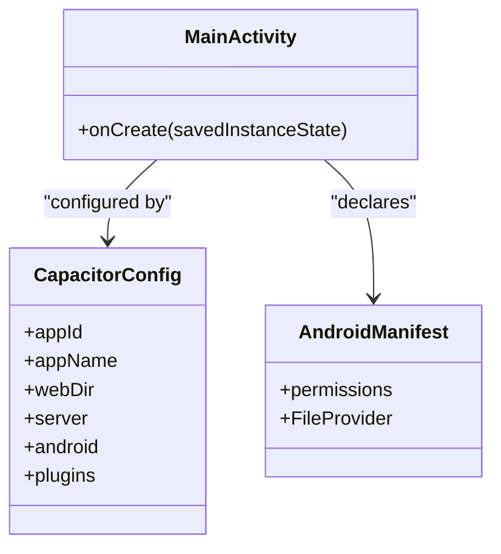
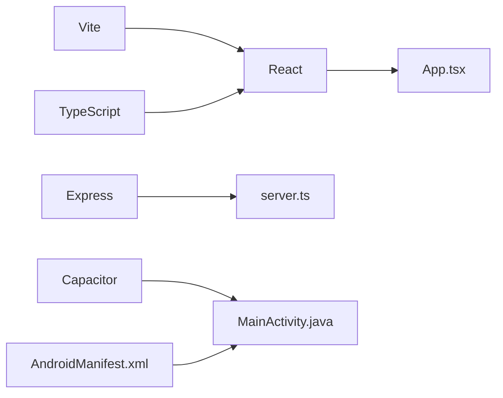
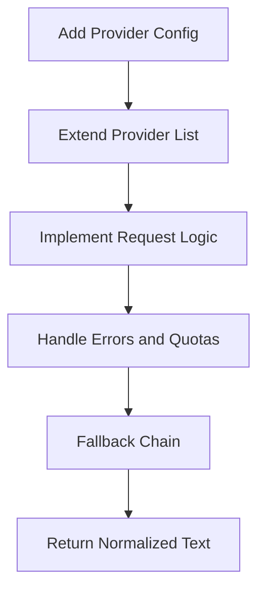

# Contributing and Development

<cite>
**Referenced Files in This Document**
- [README.md](file://README.md)
- [package.json](file://package.json)
- [capacitor.config.ts](file://capacitor.config.ts)
- [server.ts](file://server.ts)
- [src/main.tsx](file://src/main.tsx)
- [src/App.tsx](file://src/App.tsx)
- [src/types.ts](file://src/types.ts)
- [src/services/standaloneService.ts](file://src/services/standaloneService.ts)
- [src/hooks/useServerConnection.ts](file://src/hooks/useServerConnection.ts)
- [vite.config.ts](file://vite.config.ts)
- [tsconfig.json](file://tsconfig.json)
- [android/app/src/main/java/com/newsbot/manager/MainActivity.java](file://android/app/src/main/java/com/newsbot/manager/MainActivity.java)
- [android/app/src/main/AndroidManifest.xml](file://android/app/src/main/AndroidManifest.xml)
</cite>

## Table of Contents
1. [Introduction](#introduction)
2. [Project Structure](#project-structure)
3. [Core Components](#core-components)
4. [Architecture Overview](#architecture-overview)
5. [Detailed Component Analysis](#detailed-component-analysis)
6. [Dependency Analysis](#dependency-analysis)
7. [Performance Considerations](#performance-considerations)
8. [Testing Strategy and Quality Assurance](#testing-strategy-and-quality-assurance)
9. [Development Guidelines and Coding Standards](#development-guidelines-and-coding-standards)
10. [Extension and Feature Development](#extension-and-feature-development)
11. [Pull Request and Code Review Process](#pull-request-and-code-review-process)
12. [Community Standards and Communication](#community-standards-and-communication)
13. [Development Environment Setup](#development-environment-setup)
14. [Debugging Techniques](#debugging-techniques)
15. [Release Procedures](#release-procedures)
16. [Troubleshooting Guide](#troubleshooting-guide)
17. [Conclusion](#conclusion)

## Introduction
This document provides comprehensive contributing and development guidance for the AI News Bot project. It covers development guidelines, code standards, testing procedures, pull request and code review processes, architectural principles, extension development (plugins, AI provider integrations, and new features), continuous integration and quality assurance, community standards, environment setup, debugging, and release procedures. The goal is to help contributors understand how the system works, how to extend it safely, and how to collaborate effectively.

## Project Structure
The project is a hybrid web-capacitor application with a React frontend, a TypeScript/Node.js backend server, and an Android app built with Capacitor. The structure supports:
- A React SPA served by Vite and bundled for production
- A Node.js Express server exposing REST APIs and managing Telegram bot operations
- Capacitor integration for Android, enabling native capabilities (filesystem, preferences, browser)
- Shared TypeScript types and service abstractions for cross-platform logic

**Diagram sources**
- [src/main.tsx:1-11](file://src/main.tsx#L1-L11)
- [src/App.tsx:1-100](file://src/App.tsx#L1-L100)
- [src/hooks/useServerConnection.ts:1-52](file://src/hooks/useServerConnection.ts#L1-L52)
- [src/services/standaloneService.ts:1-175](file://src/services/standaloneService.ts#L1-L175)
- [src/types.ts:1-48](file://src/types.ts#L1-L48)
- [server.ts:1-120](file://server.ts#L1-L120)
- [capacitor.config.ts:1-26](file://capacitor.config.ts#L1-L26)
- [android/app/src/main/java/com/newsbot/manager/MainActivity.java:1-6](file://android/app/src/main/java/com/newsbot/manager/MainActivity.java#L1-L6)
- [android/app/src/main/AndroidManifest.xml:1-46](file://android/app/src/main/AndroidManifest.xml#L1-L46)

**Section sources**
- [README.md:1-25](file://README.md#L1-L25)
- [package.json:1-70](file://package.json#L1-L70)
- [vite.config.ts:1-28](file://vite.config.ts#L1-L28)
- [tsconfig.json:1-27](file://tsconfig.json#L1-L27)

## Core Components
- React application bootstrapped in main.tsx and rendered in App.tsx
- Server.ts exposes REST endpoints, manages Telegram bot lifecycle, AI provider selection, logging, and persistence
- Capacitor configuration and Android manifest enable native features and app packaging
- Shared types define data contracts for posts, drafts, templates, and server status
- Services encapsulate standalone storage, Telegram API calls, AI processing, and scraping

Key responsibilities:
- App.tsx orchestrates UI state, network requests, logs streaming, and integration with server and standalone modes
- server.ts handles environment validation, rate limiting, persistent storage wrappers, bot initialization, and AI translation pipeline
- standaloneService.ts abstracts filesystem and preferences for native mode and provides Telegram and AI helpers
- useServerConnection.ts polls server status and exposes connectivity state to the UI

**Section sources**
- [src/main.tsx:1-11](file://src/main.tsx#L1-L11)
- [src/App.tsx:168-200](file://src/App.tsx#L168-L200)
- [server.ts:24-36](file://server.ts#L24-L36)
- [src/services/standaloneService.ts:11-72](file://src/services/standaloneService.ts#L11-L72)
- [src/hooks/useServerConnection.ts:15-51](file://src/hooks/useServerConnection.ts#L15-L51)
- [src/types.ts:1-48](file://src/types.ts#L1-L48)

## Architecture Overview
The system follows a layered architecture:
- Presentation layer: React UI with drag-and-drop, markdown rendering, and real-time logs
- Service layer: Shared services for storage, Telegram, AI, and scraping
- API layer: Express server exposing endpoints for configuration, images, logs, and bot controls
- Native layer: Capacitor plugins for filesystem, preferences, and HTTP on Android

**Diagram sources**
- [src/App.tsx:168-200](file://src/App.tsx#L168-L200)
- [src/hooks/useServerConnection.ts:15-51](file://src/hooks/useServerConnection.ts#L15-L51)
- [src/services/standaloneService.ts:75-146](file://src/services/standaloneService.ts#L75-L146)
- [server.ts:412-645](file://server.ts#L412-L645)
- [capacitor.config.ts:1-26](file://capacitor.config.ts#L1-L26)
- [android/app/src/main/java/com/newsbot/manager/MainActivity.java:1-6](file://android/app/src/main/java/com/newsbot/manager/MainActivity.java#L1-L6)
- [android/app/src/main/AndroidManifest.xml:1-46](file://android/app/src/main/AndroidManifest.xml#L1-L46)

## Detailed Component Analysis

### Server Lifecycle and Bot Management
The server initializes and monitors the Telegram bot, handles polling, and restarts on failures. It validates environment variables, sets up rate limits, and streams logs via Server-Sent Events.

**Diagram sources**
- [server.ts:688-799](file://server.ts#L688-L799)
- [server.ts:377-409](file://server.ts#L377-L409)

**Section sources**
- [server.ts:688-799](file://server.ts#L688-L799)
- [server.ts:377-409](file://server.ts#L377-L409)

### AI Provider Selection and Fallback
The server selects an AI provider based on preference and availability, with fallbacks across multiple providers. It logs attempts and errors, and returns a sanitized Telegram-ready response.

**Diagram sources**
- [server.ts:412-645](file://server.ts#L412-L645)

**Section sources**
- [server.ts:412-645](file://server.ts#L412-L645)

### Logging and Real-Time Updates
The server maintains an in-memory rolling log buffer and streams logs to clients via SSE (web) or polling (Android). The UI subscribes to logs and displays them.

**Diagram sources**
- [server.ts:219-277](file://server.ts#L219-L277)
- [server.ts:342-352](file://server.ts#L342-L352)
- [server.ts:681-698](file://server.ts#L681-L698)

**Section sources**
- [server.ts:219-277](file://server.ts#L219-L277)
- [server.ts:342-352](file://server.ts#L342-L352)
- [server.ts:681-698](file://server.ts#L681-L698)

### Capacitor and Android Integration
Capacitor bridges the web app to native Android features. The MainActivity extends the Capacitor bridge, and the manifest declares permissions and the FileProvider.

**Diagram sources**
- [android/app/src/main/java/com/newsbot/manager/MainActivity.java:1-6](file://android/app/src/main/java/com/newsbot/manager/MainActivity.java#L1-L6)
- [capacitor.config.ts:1-26](file://capacitor.config.ts#L1-L26)
- [android/app/src/main/AndroidManifest.xml:1-46](file://android/app/src/main/AndroidManifest.xml#L1-L46)

**Section sources**
- [android/app/src/main/java/com/newsbot/manager/MainActivity.java:1-6](file://android/app/src/main/java/com/newsbot/manager/MainActivity.java#L1-L6)
- [capacitor.config.ts:1-26](file://capacitor.config.ts#L1-L26)
- [android/app/src/main/AndroidManifest.xml:1-46](file://android/app/src/main/AndroidManifest.xml#L1-L46)

## Dependency Analysis
- Build and toolchain: Vite, React, TailwindCSS, TypeScript
- Backend runtime: Express, Telegraf, Cheerio, Marked, Rate limiting
- Native and cross-platform: Capacitor (Android), Axios, Firebase Admin
- UI libraries: Lucide icons, motion, dnd-kit

**Diagram sources**
- [package.json:19-56](file://package.json#L19-L56)
- [vite.config.ts:1-28](file://vite.config.ts#L1-L28)
- [tsconfig.json:1-27](file://tsconfig.json#L1-L27)
- [server.ts:1-17](file://server.ts#L1-L17)
- [android/app/src/main/java/com/newsbot/manager/MainActivity.java:1-6](file://android/app/src/main/java/com/newsbot/manager/MainActivity.java#L1-L6)

**Section sources**
- [package.json:19-56](file://package.json#L19-L56)
- [vite.config.ts:1-28](file://vite.config.ts#L1-L28)
- [tsconfig.json:1-27](file://tsconfig.json#L1-L27)

## Performance Considerations
- Rate limiting: The server applies separate limits for API, AI, and mutations to protect resources and manage quotas
- Streaming logs: SSE reduces overhead for web clients; Android falls back to polling
- Image synchronization: Debounce and filtering reduce unnecessary network calls
- Timeout tuning: Native HTTP requests and fetch timeouts are configured to avoid hanging connections
- Model fallback: Gemini supports multiple models with graceful degradation

[No sources needed since this section provides general guidance]

## Testing Strategy and Quality Assurance
Current repository does not include dedicated unit or integration tests. Recommended practices:
- Unit tests: Jest or Vitest for React components and service logic
- Integration tests: Supertest for Express endpoints, mock Telegram API
- E2E tests: Detox or Appium for Android flows
- Linting and type checking: Use existing scripts and TypeScript strictness
- Security scanning: Audit dependencies regularly

[No sources needed since this section provides general guidance]

## Development Guidelines and Coding Standards
- Language and tooling
  - Use TypeScript for type safety and maintainability
  - Follow ESLint/TSLint conventions via TypeScript compiler options
  - Keep React components functional and stateless where possible
- Code organization
  - Group related hooks, services, and components under src/
  - Use shared types for cross-layer contracts
  - Prefer small, focused functions and pure transformations
- Error handling
  - Centralize logging with the server’s logger and UI logs
  - Surface user-friendly messages and avoid leaking internal errors
- Security
  - Validate and sanitize inputs (HTML, URLs)
  - Store secrets in environment variables or secure storage
- UI/UX
  - Use motion and animations sparingly for clarity
  - Provide clear feedback for long-running operations

**Section sources**
- [tsconfig.json:1-27](file://tsconfig.json#L1-L27)
- [src/App.tsx:348-399](file://src/App.tsx#L348-L399)
- [server.ts:285-340](file://server.ts#L285-L340)

## Extension and Feature Development

### Plugin Development
- Extend UI: Add new tabs or modals in App.tsx and wire them via hooks/services
- Add new endpoints: Define routes in server.ts with appropriate middleware and validation
- Native features: Use Capacitor plugins and expose thin wrappers in standaloneService.ts

**Section sources**
- [src/App.tsx:168-200](file://src/App.tsx#L168-L200)
- [server.ts:41-83](file://server.ts#L41-L83)
- [src/services/standaloneService.ts:11-72](file://src/services/standaloneService.ts#L11-L72)

### Custom AI Provider Integration
- Add provider logic in the AI processing function with retries and error mapping
- Respect rate limits and quota handling
- Sanitize and validate provider responses before sending to Telegram

**Diagram sources**
- [server.ts:412-645](file://server.ts#L412-L645)

**Section sources**
- [server.ts:412-645](file://server.ts#L412-L645)

### New Feature Development Checklist
- Define data contracts in types.ts
- Implement UI in App.tsx with hooks for state and effects
- Add server endpoints and persistence as needed
- Integrate with Capacitor where required
- Add logging and error handling
- Verify Android compatibility

**Section sources**
- [src/types.ts:1-48](file://src/types.ts#L1-L48)
- [src/App.tsx:168-200](file://src/App.tsx#L168-L200)
- [server.ts:127-173](file://server.ts#L127-L173)
- [capacitor.config.ts:15-22](file://capacitor.config.ts#L15-L22)

## Pull Request and Code Review Process
- Branching
  - Feature branches per task; keep commits atomic and descriptive
- PR checklist
  - Link related issues
  - Summarize changes and rationale
  - Include screenshots or videos for UI changes
  - Update documentation and comments
- Code review
  - Focus on correctness, readability, performance, and security
  - Ensure tests pass and new coverage is acceptable
  - Verify Android compatibility and Capacitor usage
- Merge
  - Squash or rebase; ensure clean history
  - Protect main branch with required reviews

[No sources needed since this section provides general guidance]

## Community Standards and Communication
- Be respectful and inclusive
- Use clear titles and descriptions in issues and PRs
- Provide reproducible steps for bug reports
- Use labels appropriately (enhancement, bug, documentation)
- Respond promptly to reviews and discussions

[No sources needed since this section provides general guidance]

## Development Environment Setup
- Prerequisites
  - Node.js and npm
  - Android Studio and Android SDK for native builds
- Steps
  - Install dependencies
  - Set environment variables for AI providers and Telegram
  - Run the dev server and app
  - Sync Android assets and build the APK

**Section sources**
- [README.md:11-25](file://README.md#L11-L25)
- [package.json:6-17](file://package.json#L6-L17)

## Debugging Techniques
- Server logs: Use the logs endpoint or SSE stream to inspect runtime behavior
- UI logs: Toggle pause/collapse/fullscreen in the UI to focus on recent events
- Native debugging: Enable web contents debugging in Capacitor config
- Network inspection: Monitor requests to Telegram and external AI providers
- Android: Use adb/logcat for native-side diagnostics

**Section sources**
- [server.ts:342-352](file://server.ts#L342-L352)
- [server.ts:681-698](file://server.ts#L681-L698)
- [capacitor.config.ts:11-14](file://capacitor.config.ts#L11-L14)

## Release Procedures
- Versioning
  - Increment version in package.json
- Build
  - Build client and server artifacts
  - Sync Capacitor and rebuild Android
- QA
  - Smoke test web and Android
  - Verify AI provider switching and logs
- Deploy
  - Publish artifacts and update deployment targets
- Post-release
  - Monitor logs and fix regressions

**Section sources**
- [package.json:4](file://package.json#L4)
- [package.json:15-17](file://package.json#L15-L17)
- [capacitor.config.ts:6](file://capacitor.config.ts#L6)

## Troubleshooting Guide
- Missing environment variables
  - Ensure TELEGRAM_BOT_TOKEN and AI keys are present
- Rate limiting and quotas
  - Observe quota messages and adjust provider selection
- Bot conflicts
  - Health monitor detects 409 conflicts and restarts automatically
- Android permissions
  - Verify storage and media permissions in the manifest
- CORS and network
  - Use CapacitorHttp on Android; ensure proper base URL normalization

**Section sources**
- [server.ts:24-33](file://server.ts#L24-L33)
- [server.ts:368-375](file://server.ts#L368-L375)
- [server.ts:395-408](file://server.ts#L395-L408)
- [android/app/src/main/AndroidManifest.xml:40-44](file://android/app/src/main/AndroidManifest.xml#L40-L44)

## Conclusion
This guide consolidates how to contribute to the AI News Bot project, covering architecture, development practices, extensions, testing, CI/CD, and releases. By following these guidelines, contributors can implement features safely, maintain code quality, and deliver reliable updates across web and Android platforms.