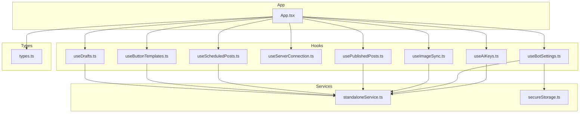
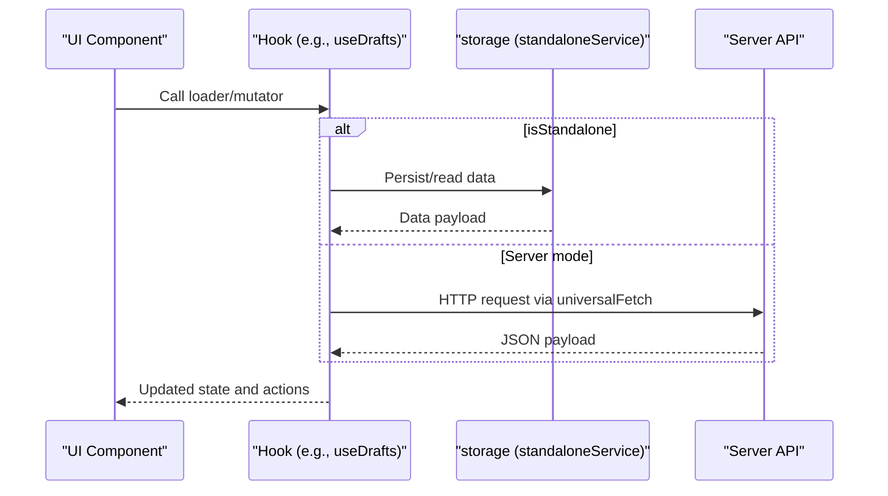
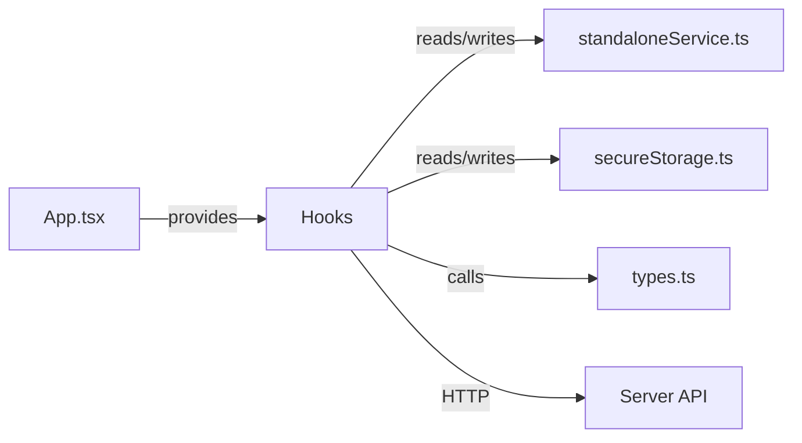

# Custom Hooks System

<cite>
**Referenced Files in This Document**
- [useDrafts.ts](file://src/hooks/useDrafts.ts)
- [useAiKeys.ts](file://src/hooks/useAiKeys.ts)
- [useImageSync.ts](file://src/hooks/useImageSync.ts)
- [useServerConnection.ts](file://src/hooks/useServerConnection.ts)
- [useButtonTemplates.ts](file://src/hooks/useButtonTemplates.ts)
- [useScheduledPosts.ts](file://src/hooks/useScheduledPosts.ts)
- [usePublishedPosts.ts](file://src/hooks/usePublishedPosts.ts)
- [useBotSettings.ts](file://src/hooks/useBotSettings.ts)
- [standaloneService.ts](file://src/services/standaloneService.ts)
- [secureStorage.ts](file://src/services/secureStorage.ts)
- [types.ts](file://src/types.ts)
- [App.tsx](file://src/App.tsx)
</cite>

## Table of Contents
1. [Introduction](#introduction)
2. [Project Structure](#project-structure)
3. [Core Components](#core-components)
4. [Architecture Overview](#architecture-overview)
5. [Detailed Component Analysis](#detailed-component-analysis)
6. [Dependency Analysis](#dependency-analysis)
7. [Performance Considerations](#performance-considerations)
8. [Troubleshooting Guide](#troubleshooting-guide)
9. [Conclusion](#conclusion)

## Introduction
This document describes the custom hooks system that manages application state and business logic for a React/TypeScript application integrating Telegram bot publishing, AI text processing, and cross-platform storage. The hooks encapsulate:
- Draft management
- AI key management
- Image synchronization
- Server connection monitoring
- Button templates
- Scheduled posts
- Published posts
- Bot settings

They support both standalone (native/mobile) and server modes, with state persistence via Capacitor preferences/filesystem on native platforms and localStorage on web, and integrate with a shared universal fetch abstraction for network requests.

## Project Structure
The hooks live under src/hooks and are consumed by the main application component in src/App.tsx. Supporting services for storage and secure token handling reside under src/services, with shared types under src/types.

**Diagram sources**
- [App.tsx](file://src/App.tsx)
- [useDrafts.ts](file://src/hooks/useDrafts.ts)
- [useServerConnection.ts](file://src/hooks/useServerConnection.ts)
- [useImageSync.ts](file://src/hooks/useImageSync.ts)
- [useButtonTemplates.ts](file://src/hooks/useButtonTemplates.ts)
- [useScheduledPosts.ts](file://src/hooks/useScheduledPosts.ts)
- [usePublishedPosts.ts](file://src/hooks/usePublishedPosts.ts)
- [useAiKeys.ts](file://src/hooks/useAiKeys.ts)
- [useBotSettings.ts](file://src/hooks/useBotSettings.ts)
- [standaloneService.ts](file://src/services/standaloneService.ts)
- [secureStorage.ts](file://src/services/secureStorage.ts)
- [types.ts](file://src/types.ts)

**Section sources**
- [App.tsx](file://src/App.tsx)
- [useDrafts.ts](file://src/hooks/useDrafts.ts)
- [useServerConnection.ts](file://src/hooks/useServerConnection.ts)
- [useImageSync.ts](file://src/hooks/useImageSync.ts)
- [useButtonTemplates.ts](file://src/hooks/useButtonTemplates.ts)
- [useScheduledPosts.ts](file://src/hooks/useScheduledPosts.ts)
- [usePublishedPosts.ts](file://src/hooks/usePublishedPosts.ts)
- [useAiKeys.ts](file://src/hooks/useAiKeys.ts)
- [useBotSettings.ts](file://src/hooks/useBotSettings.ts)
- [standaloneService.ts](file://src/services/standaloneService.ts)
- [secureStorage.ts](file://src/services/secureStorage.ts)
- [types.ts](file://src/types.ts)

## Core Components
Each hook exposes a consistent pattern:
- A single factory function accepting mode flags and helpers
- Internal state initialized via useState
- Asynchronous loaders and mutators using useCallback
- Optional initialization via useEffect
- Return an object of state and actions

Key integration points:
- isStandalone flag switches between native/localStorage and server-backed storage
- getCleanBaseUrl normalizes and validates the server URL
- universalFetch provides a unified HTTP client with timeouts and error handling
- storage service abstracts filesystem and preferences on native vs web

Examples of usage are integrated throughout the main application component, including:
- Draft CRUD operations
- Template management
- Scheduled and published post listings
- Image sync and selection
- Bot settings and AI key management
- Server connectivity monitoring

**Section sources**
- [useDrafts.ts](file://src/hooks/useDrafts.ts)
- [useAiKeys.ts](file://src/hooks/useAiKeys.ts)
- [useImageSync.ts](file://src/hooks/useImageSync.ts)
- [useServerConnection.ts](file://src/hooks/useServerConnection.ts)
- [useButtonTemplates.ts](file://src/hooks/useButtonTemplates.ts)
- [useScheduledPosts.ts](file://src/hooks/useScheduledPosts.ts)
- [usePublishedPosts.ts](file://src/hooks/usePublishedPosts.ts)
- [useBotSettings.ts](file://src/hooks/useBotSettings.ts)
- [standaloneService.ts](file://src/services/standaloneService.ts)
- [App.tsx](file://src/App.tsx)

## Architecture Overview
The hooks operate in two modes:
- Standalone (native): Uses Capacitor filesystem and preferences for persistence; direct Telegram API calls; optional AI processing via local service
- Server: Uses universalFetch to communicate with backend endpoints for all data operations

**Diagram sources**
- [useDrafts.ts](file://src/hooks/useDrafts.ts)
- [standaloneService.ts](file://src/services/standaloneService.ts)
- [App.tsx](file://src/App.tsx)

**Section sources**
- [App.tsx](file://src/App.tsx)
- [standaloneService.ts](file://src/services/standaloneService.ts)
- [useDrafts.ts](file://src/hooks/useDrafts.ts)

## Detailed Component Analysis

### useDrafts
Purpose: Manage drafts, including loading, saving, and deleting drafts. Also cleans associated scheduled entries when deleting drafts in standalone mode.

Parameters:
- isStandalone: boolean
- getCleanBaseUrl: () => string | null
- universalFetch: (url, options?) => Promise<Response>

Returns:
- drafts: DraftPost[]
- setDrafts: setter
- loading: boolean
- saveDraft: (draft: DraftPost) => Promise<void>
- deleteDraft: (id: string) => Promise<void>
- reload: () => Promise<void>

Usage patterns:
- Load on mount via effect
- Save draft with either standalone storage or server endpoint
- Delete draft and synchronize scheduled list in standalone mode

Error handling:
- Catches errors during load/save/delete and logs them
- Throws on save failure to surface to caller

Persistence strategy:
- Standalone: JSON files per list
- Server: REST endpoints for CRUD

Integration:
- Consumed by the main app for draft listing and editor actions

**Section sources**
- [useDrafts.ts](file://src/hooks/useDrafts.ts)
- [standaloneService.ts](file://src/services/standaloneService.ts)
- [types.ts](file://src/types.ts)
- [App.tsx](file://src/App.tsx)

### useAiKeys
Purpose: Centralized management of AI provider API keys across providers (Gemini, GitHub, OpenRouter, DeepSeek).

Parameters:
- isStandalone: boolean

Returns:
- aiKeys: Record<string, string>
- updateAiKey: (provider, value) => Promise<void>
- loadAiKeys: () => Promise<void>
- error: string | null

Usage patterns:
- Load keys from native preferences or localStorage depending on mode
- Update keys immediately in memory and persist to appropriate store
- Trigger re-load on mode change

Error handling:
- Captures and surfaces errors during load

Persistence strategy:
- Native: Capacitor Preferences
- Server: localStorage

Integration:
- Used by the main app to configure preferred provider and test keys

**Section sources**
- [useAiKeys.ts](file://src/hooks/useAiKeys.ts)
- [standaloneService.ts](file://src/services/standaloneService.ts)
- [App.tsx](file://src/App.tsx)

### useImageSync
Purpose: Manage image path configuration and browsing capabilities for image synchronization.

Parameters:
- isStandalone: boolean
- getCleanBaseUrl: () => string | null

Returns:
- imagePath: string
- setImagePath: setter
- isActionInProgress: boolean
- browserPath: string
- setBrowserPath: setter
- browserDirs: Array<{name: string, path: string}>
- setBrowserDirs: setter
- browserParent: string | null
- setBrowserParent: setter
- saveImagePath: (path: string) => Promise<void>

Usage patterns:
- Initialize saved path on mount in standalone mode
- Persist path updates to storage or server
- Provide UI state for folder browser modal

Persistence strategy:
- Standalone: Preferences setting
- Server: Endpoint for path persistence

Integration:
- Used by the main app for image gallery and upload flows

**Section sources**
- [useImageSync.ts](file://src/hooks/useImageSync.ts)
- [standaloneService.ts](file://src/services/standaloneService.ts)
- [App.tsx](file://src/App.tsx)

### useServerConnection
Purpose: Monitor server availability and bot status, with periodic polling.

Parameters:
- baseUrl: string

Returns:
- status: ServerStatus | null
- loading: boolean
- error: string | null
- refetch: () => Promise<void>

Usage patterns:
- Fetch status on mount and every 8 seconds
- Surface online/offline and bot state
- Expose refetch for manual refresh

Error handling:
- Handles HTTP errors and network exceptions
- Sets loading state appropriately

Persistence strategy:
- No persistent state; reactive to URL changes

Integration:
- Consumed by the main app to drive UI indicators and conditional behavior

**Section sources**
- [useServerConnection.ts](file://src/hooks/useServerConnection.ts)
- [App.tsx](file://src/App.tsx)

### useButtonTemplates
Purpose: Manage reusable button templates for posts.

Parameters:
- isStandalone: boolean
- getCleanBaseUrl: () => string | null
- universalFetch: (url, options?) => Promise<Response>

Returns:
- buttonTemplates: ButtonTemplate[]
- setButtonTemplates: setter
- loading: boolean
- loadButtonTemplates: () => Promise<void>

Usage patterns:
- Load templates from storage or server
- Integrate with the post constructor UI

Persistence strategy:
- Standalone: JSON file
- Server: REST endpoint

Integration:
- Used by the main app for template management UI

**Section sources**
- [useButtonTemplates.ts](file://src/hooks/useButtonTemplates.ts)
- [standaloneService.ts](file://src/services/standaloneService.ts)
- [types.ts](file://src/types.ts)
- [App.tsx](file://src/App.tsx)

### useScheduledPosts
Purpose: List and manage scheduled posts.

Parameters:
- isStandalone: boolean
- getCleanBaseUrl: () => string | null
- universalFetch: (url, options?) => Promise<Response>

Returns:
- scheduledPosts: DraftPost[]
- setScheduledPosts: setter
- loading: boolean
- loadScheduledPosts: () => Promise<void>

Usage patterns:
- Load scheduled posts from storage or server
- Used alongside drafts and published posts

Persistence strategy:
- Standalone: JSON file
- Server: REST endpoint

Integration:
- Consumed by the main app for scheduled list UI

**Section sources**
- [useScheduledPosts.ts](file://src/hooks/useScheduledPosts.ts)
- [standaloneService.ts](file://src/services/standaloneService.ts)
- [types.ts](file://src/types.ts)
- [App.tsx](file://src/App.tsx)

### usePublishedPosts
Purpose: List and manage published posts.

Parameters:
- isStandalone: boolean
- getCleanBaseUrl: () => string | null
- universalFetch: (url, options?) => Promise<Response>

Returns:
- publishedPosts: DraftPost[]
- setPublishedPosts: setter
- loading: boolean
- loadPublishedPosts: () => Promise<void>

Usage patterns:
- Load published posts from storage or server
- Supports deletion in both modes

Persistence strategy:
- Standalone: JSON file
- Server: REST endpoint

Integration:
- Consumed by the main app for published list UI

**Section sources**
- [usePublishedPosts.ts](file://src/hooks/usePublishedPosts.ts)
- [standaloneService.ts](file://src/services/standaloneService.ts)
- [types.ts](file://src/types.ts)
- [App.tsx](file://src/App.tsx)

### useBotSettings
Purpose: Manage Telegram bot token and chat ID, with secure storage for tokens.

Parameters:
- isStandalone: boolean

Returns:
- botToken: string
- tempChatId: string
- updateSetting: (key, value) => Promise<void>
- loadSettings: () => Promise<void>

Usage patterns:
- Load tokens from secure storage or localStorage
- Persist tokens securely on native platforms
- Update chat ID locally or remotely

Persistence strategy:
- Tokens: SecureStorage (Preferences on native)
- Chat ID: storage setting or localStorage
- Server tokens: localStorage

Integration:
- Used by the main app for bot configuration and testing

**Section sources**
- [useBotSettings.ts](file://src/hooks/useBotSettings.ts)
- [secureStorage.ts](file://src/services/secureStorage.ts)
- [standaloneService.ts](file://src/services/standaloneService.ts)
- [App.tsx](file://src/App.tsx)

## Dependency Analysis
The hooks depend on:
- Mode flag (isStandalone) to select storage/network strategy
- URL normalization helper (getCleanBaseUrl) for server mode
- Universal fetch (universalFetch) for HTTP requests
- Shared types for data contracts
- Services for storage and secure token handling

**Diagram sources**
- [App.tsx](file://src/App.tsx)
- [useDrafts.ts](file://src/hooks/useDrafts.ts)
- [useButtonTemplates.ts](file://src/hooks/useButtonTemplates.ts)
- [useScheduledPosts.ts](file://src/hooks/useScheduledPosts.ts)
- [usePublishedPosts.ts](file://src/hooks/usePublishedPosts.ts)
- [useImageSync.ts](file://src/hooks/useImageSync.ts)
- [useAiKeys.ts](file://src/hooks/useAiKeys.ts)
- [useBotSettings.ts](file://src/hooks/useBotSettings.ts)
- [standaloneService.ts](file://src/services/standaloneService.ts)
- [secureStorage.ts](file://src/services/secureStorage.ts)
- [types.ts](file://src/types.ts)

**Section sources**
- [App.tsx](file://src/App.tsx)
- [useDrafts.ts](file://src/hooks/useDrafts.ts)
- [useButtonTemplates.ts](file://src/hooks/useButtonTemplates.ts)
- [useScheduledPosts.ts](file://src/hooks/useScheduledPosts.ts)
- [usePublishedPosts.ts](file://src/hooks/usePublishedPosts.ts)
- [useImageSync.ts](file://src/hooks/useImageSync.ts)
- [useAiKeys.ts](file://src/hooks/useAiKeys.ts)
- [useBotSettings.ts](file://src/hooks/useBotSettings.ts)
- [standaloneService.ts](file://src/services/standaloneService.ts)
- [secureStorage.ts](file://src/services/secureStorage.ts)
- [types.ts](file://src/types.ts)

## Performance Considerations
- Debounce and avoid redundant saves: The main app debounces image path persistence and auto-saves drafts only when meaningful changes occur.
- Efficient loading: Hooks load data on mount and expose reload functions; avoid unnecessary re-renders by passing memoized callbacks.
- Network timeouts: universalFetch sets explicit timeouts for native and web requests to prevent hanging UI.
- Polling intervals: useServerConnection polls every 8 seconds; adjust as needed to balance responsiveness and battery/network usage.
- Local caching: In server mode, consider caching small payloads in memory to reduce repeated network calls.

[No sources needed since this section provides general guidance]

## Troubleshooting Guide
Common issues and resolutions:
- Invalid or malformed URL: The main app validates URLs and throws descriptive errors for invalid inputs.
- Network timeouts: universalFetch distinguishes between timeout and other errors; retry or adjust timeouts accordingly.
- Storage permission failures (native): The image sync flow checks and requests filesystem permissions on native platforms.
- Server-side HTML responses: The main app detects HTML responses and suggests using a proper Cloud Run URL.
- AI key errors: Dedicated error messages differentiate quota limits, unauthorized access, and empty responses.

**Section sources**
- [App.tsx](file://src/App.tsx)
- [useServerConnection.ts](file://src/hooks/useServerConnection.ts)
- [standaloneService.ts](file://src/services/standaloneService.ts)

## Conclusion
The custom hooks system provides a cohesive, mode-aware layer for managing application state across standalone and server environments. They encapsulate persistence, networking, and UI integration, enabling consistent behavior and maintainable code. By leveraging the provided patterns, developers can extend functionality while preserving mode-specific behavior and robust error handling.

[No sources needed since this section summarizes without analyzing specific files]