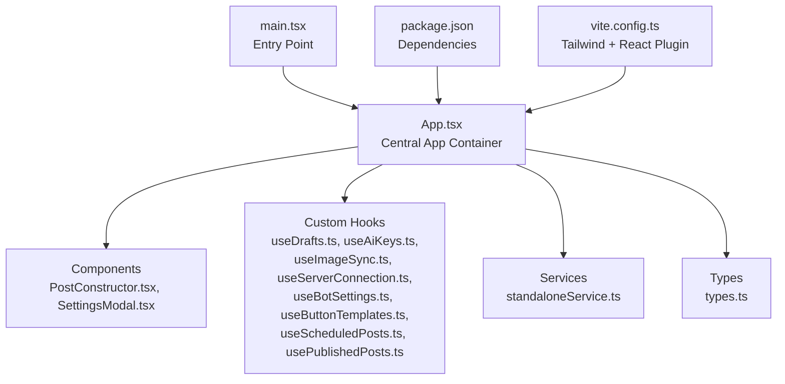
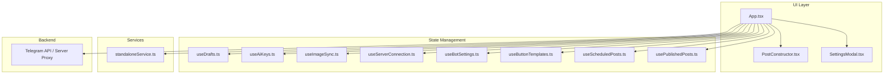
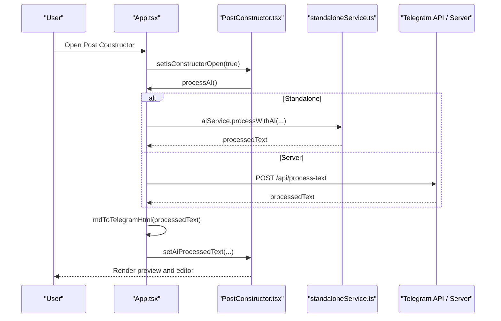
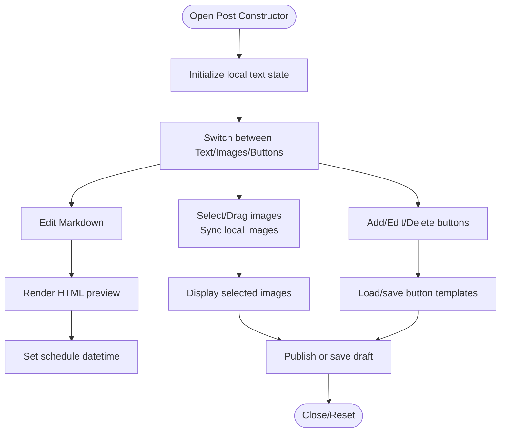
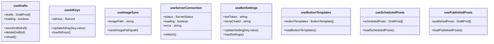
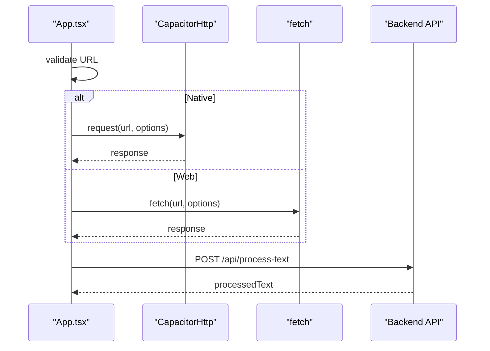
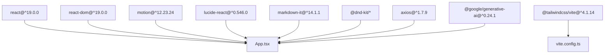
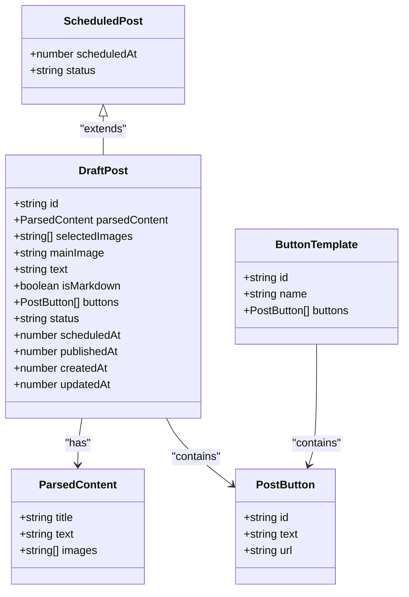

# Frontend Application

<cite>
**Referenced Files in This Document**
- [App.tsx](file://src/App.tsx)
- [main.tsx](file://src/main.tsx)
- [PostConstructor.tsx](file://src/components/PostConstructor.tsx)
- [SettingsModal.tsx](file://src/components/SettingsModal.tsx)
- [useDrafts.ts](file://src/hooks/useDrafts.ts)
- [useAiKeys.ts](file://src/hooks/useAiKeys.ts)
- [useImageSync.ts](file://src/hooks/useImageSync.ts)
- [useServerConnection.ts](file://src/hooks/useServerConnection.ts)
- [useBotSettings.ts](file://src/hooks/useBotSettings.ts)
- [useButtonTemplates.ts](file://src/hooks/useButtonTemplates.ts)
- [useScheduledPosts.ts](file://src/hooks/useScheduledPosts.ts)
- [usePublishedPosts.ts](file://src/hooks/usePublishedPosts.ts)
- [standaloneService.ts](file://src/services/standaloneService.ts)
- [types.ts](file://src/types.ts)
- [package.json](file://package.json)
- [vite.config.ts](file://vite.config.ts)
</cite>

## Table of Contents
1. [Introduction](#introduction)
2. [Project Structure](#project-structure)
3. [Core Components](#core-components)
4. [Architecture Overview](#architecture-overview)
5. [Detailed Component Analysis](#detailed-component-analysis)
6. [Dependency Analysis](#dependency-analysis)
7. [Performance Considerations](#performance-considerations)
8. [Troubleshooting Guide](#troubleshooting-guide)
9. [Conclusion](#conclusion)
10. [Appendices](#appendices)

## Introduction
This document describes the React-based frontend application for managing Telegram bot posts. It covers the component architecture, state management via custom hooks, UI patterns, data binding, user interaction flows, lifecycle considerations, backend integration, and styling approach using TailwindCSS. The application supports two operational modes: Standalone (native phone mode) and Server (web proxy mode), enabling flexible deployment and development scenarios.

## Project Structure
The frontend is organized around a single-page application entry, a central App container orchestrating state and UI, reusable components, domain-specific custom hooks for stateful logic, and service modules for platform and network concerns. Build-time configuration integrates TailwindCSS and React plugin.

**Diagram sources**
- [main.tsx:1-11](file://src/main.tsx#L1-L11)
- [App.tsx:168-170](file://src/App.tsx#L168-L170)
- [PostConstructor.tsx:1-294](file://src/components/PostConstructor.tsx#L1-L294)
- [SettingsModal.tsx:1-107](file://src/components/SettingsModal.tsx#L1-L107)
- [useDrafts.ts:1-88](file://src/hooks/useDrafts.ts#L1-L88)
- [useAiKeys.ts:1-57](file://src/hooks/useAiKeys.ts#L1-L57)
- [useImageSync.ts:1-42](file://src/hooks/useImageSync.ts#L1-L42)
- [useServerConnection.ts:1-52](file://src/hooks/useServerConnection.ts#L1-L52)
- [useBotSettings.ts:1-56](file://src/hooks/useBotSettings.ts#L1-L56)
- [useButtonTemplates.ts:1-38](file://src/hooks/useButtonTemplates.ts#L1-L38)
- [useScheduledPosts.ts:1-38](file://src/hooks/useScheduledPosts.ts#L1-L38)
- [usePublishedPosts.ts:1-38](file://src/hooks/usePublishedPosts.ts#L1-L38)
- [standaloneService.ts:1-175](file://src/services/standaloneService.ts#L1-L175)
- [types.ts:1-48](file://src/types.ts#L1-L48)
- [package.json:1-70](file://package.json#L1-L70)
- [vite.config.ts:1-28](file://vite.config.ts#L1-L28)

**Section sources**
- [main.tsx:1-11](file://src/main.tsx#L1-L11)
- [package.json:19-56](file://package.json#L19-L56)
- [vite.config.ts:1-28](file://vite.config.ts#L1-L28)

## Core Components
- App (AppContent): Central orchestrator managing global state, platform detection, universal fetch abstraction, markdown-to-Telegram conversion, AI processing, publishing flows, and navigation tabs. It composes SettingsModal and PostConstructor and manages lists (drafts, scheduled, published) and image galleries.
- PostConstructor: Modal-based editor for constructing posts with markdown editing, image selection, drag-and-drop reordering, button templates, scheduling, and publishing actions.
- SettingsModal: Modal dialog for switching between Standalone and Server modes, configuring base URL, bot token, and testing connectivity.

Key responsibilities:
- State orchestration and persistence across modes (Standalone vs Server)
- Backend integration via a unified fetch wrapper supporting native and web environments
- AI text processing and character limit enforcement
- Publishing to Telegram via direct API calls or server proxy
- Image synchronization and gallery management

**Section sources**
- [App.tsx:168-170](file://src/App.tsx#L168-L170)
- [PostConstructor.tsx:96-294](file://src/components/PostConstructor.tsx#L96-L294)
- [SettingsModal.tsx:28-107](file://src/components/SettingsModal.tsx#L28-L107)

## Architecture Overview
The application follows a layered architecture:
- UI Layer: App, PostConstructor, SettingsModal
- State Management: Custom hooks encapsulate domain logic and persistence
- Services: Platform abstractions for filesystem, preferences, and Telegram API
- Backend Integration: Unified fetch wrapper with native CapacitorHttp and web fetch fallback

**Diagram sources**
- [App.tsx:168-170](file://src/App.tsx#L168-L170)
- [PostConstructor.tsx:96-294](file://src/components/PostConstructor.tsx#L96-L294)
- [SettingsModal.tsx:28-107](file://src/components/SettingsModal.tsx#L28-L107)
- [useDrafts.ts:5-87](file://src/hooks/useDrafts.ts#L5-L87)
- [useAiKeys.ts:4-56](file://src/hooks/useAiKeys.ts#L4-L56)
- [useImageSync.ts:5-41](file://src/hooks/useImageSync.ts#L5-L41)
- [useServerConnection.ts:15-51](file://src/hooks/useServerConnection.ts#L15-L51)
- [useBotSettings.ts:5-55](file://src/hooks/useBotSettings.ts#L5-L55)
- [useButtonTemplates.ts:5-37](file://src/hooks/useButtonTemplates.ts#L5-L37)
- [useScheduledPosts.ts:5-37](file://src/hooks/useScheduledPosts.ts#L5-L37)
- [usePublishedPosts.ts:5-37](file://src/hooks/usePublishedPosts.ts#L5-L37)
- [standaloneService.ts:11-175](file://src/services/standaloneService.ts#L11-L175)

## Detailed Component Analysis

### App (AppContent)
Responsibilities:
- Global state: base URL, server status, logs, tabs, modal visibility, and action flags
- Platform detection and native-capable fetch
- Markdown-to-Telegram sanitization and rendering
- AI processing orchestration and error handling
- Publishing pipeline for Standalone and Server modes
- Image synchronization and gallery population
- List management for drafts, scheduled, published posts, and button templates

Lifecycle highlights:
- Initializes standalone flag from preferences
- Loads all lists on mount and when constructor opens
- Auto-saves drafts when constructor closes and detects changes
- Polls logs via SSE (web) or periodic fetch (native)
- Periodic server status checks and chat ID preset loading

Integration points:
- Uses standaloneService for Telegram API calls and local storage
- Uses CapacitorHttp for native requests and fetch for web
- Manages bot polling loop and updates online status

**Diagram sources**
- [App.tsx:811-864](file://src/App.tsx#L811-L864)
- [standaloneService.ts:148-159](file://src/services/standaloneService.ts#L148-L159)
- [PostConstructor.tsx:144-154](file://src/components/PostConstructor.tsx#L144-L154)

**Section sources**
- [App.tsx:173-182](file://src/App.tsx#L173-L182)
- [App.tsx:194-251](file://src/App.tsx#L194-L251)
- [App.tsx:348-399](file://src/App.tsx#L348-L399)
- [App.tsx:401-522](file://src/App.tsx#L401-L522)
- [App.tsx:538-622](file://src/App.tsx#L538-L622)
- [App.tsx:622-698](file://src/App.tsx#L622-L698)
- [App.tsx:700-725](file://src/App.tsx#L700-L725)
- [App.tsx:735-750](file://src/App.tsx#L735-L750)
- [App.tsx:752-770](file://src/App.tsx#L752-L770)
- [App.tsx:772-774](file://src/App.tsx#L772-L774)

### PostConstructor
Responsibilities:
- Tabbed layout for text, images, and buttons
- Markdown editor with live preview and spoiler insertion
- Image gallery with drag-and-drop reordering and selection
- Button template management and saving
- Scheduling and publishing actions
- Validation and feedback messaging

UI patterns:
- Responsive grid layout with mobile-first tabs
- Animated transitions for modal and collapsible sections
- Controlled inputs with local state to reduce lag

**Diagram sources**
- [PostConstructor.tsx:96-294](file://src/components/PostConstructor.tsx#L96-L294)

**Section sources**
- [PostConstructor.tsx:96-294](file://src/components/PostConstructor.tsx#L96-L294)

### SettingsModal
Responsibilities:
- Toggle between Standalone and Server modes
- Configure base URL and bot token
- Test connection and network availability
- Persist settings and refresh server status

UI patterns:
- Animated modal with backdrop and staggered animations
- Conditional fields based on mode
- Status indicators and feedback messages

**Section sources**
- [SettingsModal.tsx:28-107](file://src/components/SettingsModal.tsx#L28-L107)

### Custom Hooks (State Management)
- useDrafts: Loads, saves, and deletes drafts; supports Standalone/local storage and Server/backend
- useAiKeys: Manages AI API keys per provider; persists in secure storage or local storage
- useImageSync: Tracks image path and browser state; persists Standalone path
- useServerConnection: Polls server status and exposes refetch
- useBotSettings: Loads and updates bot token and chat ID; integrates secure storage
- useButtonTemplates: Manages button templates for reuse
- useScheduledPosts, usePublishedPosts: Manage lists of scheduled and published posts

**Diagram sources**
- [useDrafts.ts:5-87](file://src/hooks/useDrafts.ts#L5-L87)
- [useAiKeys.ts:4-56](file://src/hooks/useAiKeys.ts#L4-L56)
- [useImageSync.ts:5-41](file://src/hooks/useImageSync.ts#L5-L41)
- [useServerConnection.ts:15-51](file://src/hooks/useServerConnection.ts#L15-L51)
- [useBotSettings.ts:5-55](file://src/hooks/useBotSettings.ts#L5-L55)
- [useButtonTemplates.ts:5-37](file://src/hooks/useButtonTemplates.ts#L5-L37)
- [useScheduledPosts.ts:5-37](file://src/hooks/useScheduledPosts.ts#L5-L37)
- [usePublishedPosts.ts:5-37](file://src/hooks/usePublishedPosts.ts#L5-L37)

**Section sources**
- [useDrafts.ts:5-87](file://src/hooks/useDrafts.ts#L5-L87)
- [useAiKeys.ts:4-56](file://src/hooks/useAiKeys.ts#L4-L56)
- [useImageSync.ts:5-41](file://src/hooks/useImageSync.ts#L5-L41)
- [useServerConnection.ts:15-51](file://src/hooks/useServerConnection.ts#L15-L51)
- [useBotSettings.ts:5-55](file://src/hooks/useBotSettings.ts#L5-L55)
- [useButtonTemplates.ts:5-37](file://src/hooks/useButtonTemplates.ts#L5-L37)
- [useScheduledPosts.ts:5-37](file://src/hooks/useScheduledPosts.ts#L5-L37)
- [usePublishedPosts.ts:5-37](file://src/hooks/usePublishedPosts.ts#L5-L37)

### Services and Backend Integration
- standaloneService: Provides storage abstraction (filesystem/preferences vs localStorage), Telegram API wrappers, AI processing, and scraping helpers
- App.tsx implements a universalFetch that:
  - Validates URLs and normalizes protocols
  - Uses CapacitorHttp for native platforms
  - Uses fetch with timeouts for web
  - Handles errors consistently

**Diagram sources**
- [App.tsx:194-251](file://src/App.tsx#L194-L251)
- [standaloneService.ts:74-146](file://src/services/standaloneService.ts#L74-L146)

**Section sources**
- [standaloneService.ts:11-175](file://src/services/standaloneService.ts#L11-L175)
- [App.tsx:194-251](file://src/App.tsx#L194-L251)

## Dependency Analysis
External dependencies relevant to the frontend include React, React DOM, TailwindCSS v4, Motion for animated UI, Lucide icons, markdown-it, and DnD Kit for drag-and-drop. Build-time plugins integrate TailwindCSS and React.

**Diagram sources**
- [package.json:19-56](file://package.json#L19-L56)
- [vite.config.ts:1-28](file://vite.config.ts#L1-L28)

**Section sources**
- [package.json:19-56](file://package.json#L19-L56)
- [vite.config.ts:1-28](file://vite.config.ts#L1-L28)

## Performance Considerations
- Debounced auto-save: Drafts are saved when the constructor closes and changes are detected, preventing unnecessary writes.
- Efficient image handling: Selected images are capped and deduplicated; gallery updates are batched.
- Lazy initialization: Lists are loaded on demand (e.g., when the constructor opens) to reduce startup cost.
- Native fetch optimization: CapacitorHttp is used on native platforms to avoid CORS and improve reliability.
- Rendering optimizations: Motion animations are scoped; collapsible sections minimize DOM when closed.

## Troubleshooting Guide
Common issues and resolutions:
- Invalid or malformed URL: The app validates and normalizes URLs; ensure no whitespace and correct protocol.
- AI quota or key errors: Errors are surfaced with user-friendly messages; verify API keys and provider quotas.
- Network connectivity: Use the built-in network test and connection tester in Settings.
- Standalone vs Server mode: Switch modes via Settings; Standalone requires proper permissions and local storage setup.
- Logs: Use the Logs tab to inspect client-side logs and server-side SSE/web polling logs.

**Section sources**
- [App.tsx:194-251](file://src/App.tsx#L194-L251)
- [App.tsx:811-864](file://src/App.tsx#L811-L864)
- [App.tsx:1337-1344](file://src/App.tsx#L1337-L1344)
- [App.tsx:1313-1335](file://src/App.tsx#L1313-L1335)

## Conclusion
The frontend provides a robust, modular React application with clear separation of concerns. Custom hooks encapsulate stateful logic, while services abstract platform and backend interactions. The UI emphasizes usability with animated transitions, responsive layouts, and practical workflows for content creation, scheduling, and publishing across Standalone and Server modes.

## Appendices

### UI Patterns and Styling
- TailwindCSS v4 is integrated via Vite plugin for utility-first styling.
- Responsive design uses grid and flex utilities with mobile-first breakpoints.
- Motion animations enhance transitions for modals and collapsible sections.
- Icons from Lucide provide consistent visual language.

**Section sources**
- [vite.config.ts:1-28](file://vite.config.ts#L1-L28)

### Data Models

**Diagram sources**
- [types.ts:1-48](file://src/types.ts#L1-L48)