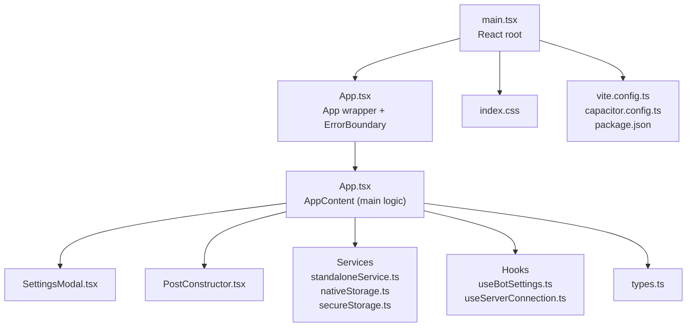
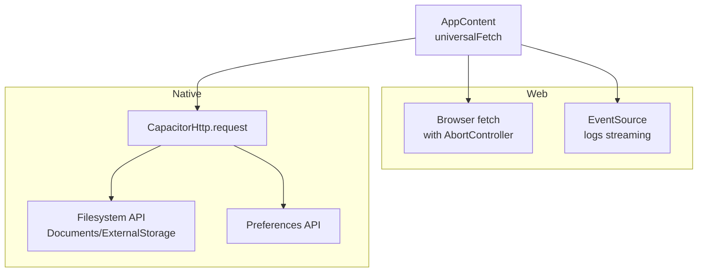
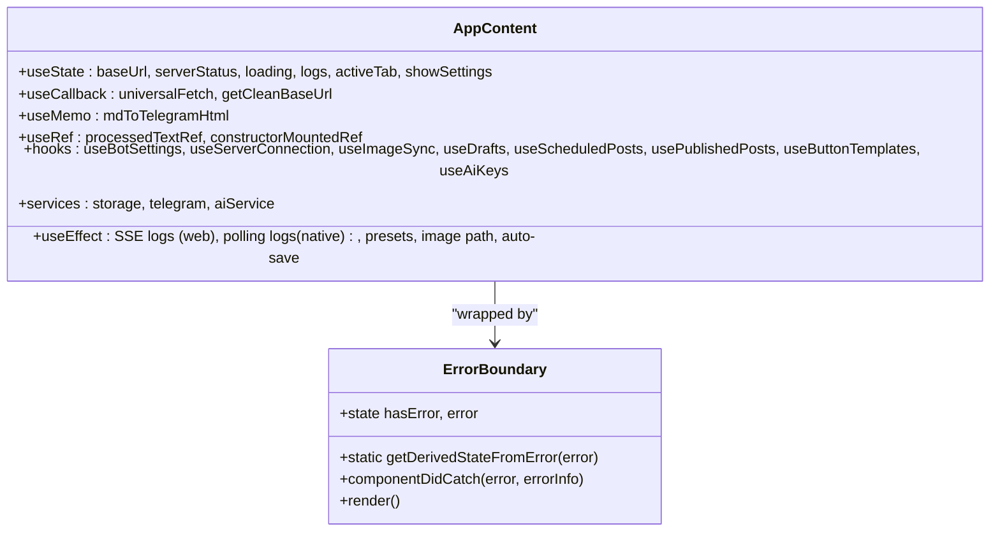
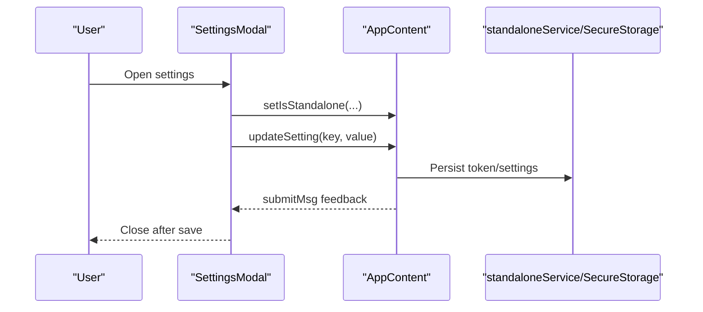
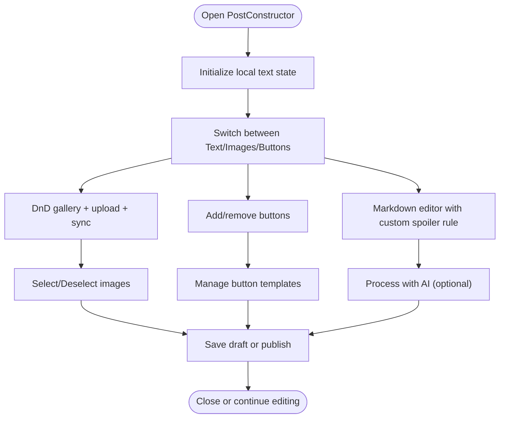
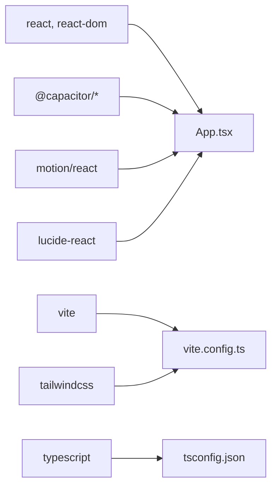

# React Application Structure

<cite>
**Referenced Files in This Document**
- [App.tsx](file://src/App.tsx)
- [main.tsx](file://src/main.tsx)
- [capacitor.config.ts](file://capacitor.config.ts)
- [package.json](file://package.json)
- [vite.config.ts](file://vite.config.ts)
- [standaloneService.ts](file://src/services/standaloneService.ts)
- [nativeStorage.ts](file://src/services/nativeStorage.ts)
- [secureStorage.ts](file://src/services/secureStorage.ts)
- [useBotSettings.ts](file://src/hooks/useBotSettings.ts)
- [useServerConnection.ts](file://src/hooks/useServerConnection.ts)
- [SettingsModal.tsx](file://src/components/SettingsModal.tsx)
- [PostConstructor.tsx](file://src/components/PostConstructor.tsx)
- [types.ts](file://src/types.ts)
- [index.css](file://src/index.css)
- [tsconfig.json](file://tsconfig.json)
</cite>

## Table of Contents
1. [Introduction](#introduction)
2. [Project Structure](#project-structure)
3. [Core Components](#core-components)
4. [Architecture Overview](#architecture-overview)
5. [Detailed Component Analysis](#detailed-component-analysis)
6. [Dependency Analysis](#dependency-analysis)
7. [Performance Considerations](#performance-considerations)
8. [Troubleshooting Guide](#troubleshooting-guide)
9. [Conclusion](#conclusion)
10. [Appendices](#appendices)

## Introduction
This document explains the React application structure and initialization for a dual-platform Telegram publishing tool that runs on both web and native environments through Capacitor. It covers the main App component architecture, component hierarchy, application entry point setup, error boundaries, state management patterns, cross-platform compatibility handling, build configuration, CSS architecture, and TypeScript integration. It also documents the integration with Motion for animations and Lucide icons for UI.

## Project Structure
The application follows a feature-based structure with clear separation of concerns:
- Entry point initializes the React root and renders the App component.
- App orchestrates platform detection, global state, and platform-specific networking.
- Services encapsulate native and server interactions.
- Hooks manage domain-specific state and side effects.
- Components are organized under src/components and src/hooks.
- Build and dev tooling configured via Vite and Capacitor.



**Diagram sources**
- [main.tsx:1-11](file://src/main.tsx#L1-L11)
- [App.tsx:168-170](file://src/App.tsx#L168-L170)
- [SettingsModal.tsx:1-107](file://src/components/SettingsModal.tsx#L1-L107)
- [PostConstructor.tsx:1-294](file://src/components/PostConstructor.tsx#L1-L294)
- [standaloneService.ts:1-175](file://src/services/standaloneService.ts#L1-L175)
- [nativeStorage.ts:1-63](file://src/services/nativeStorage.ts#L1-L63)
- [secureStorage.ts:1-40](file://src/services/secureStorage.ts#L1-L40)
- [useBotSettings.ts:1-56](file://src/hooks/useBotSettings.ts#L1-L56)
- [useServerConnection.ts:1-52](file://src/hooks/useServerConnection.ts#L1-L52)
- [types.ts:1-48](file://src/types.ts#L1-L48)
- [index.css:1-83](file://src/index.css#L1-L83)
- [vite.config.ts:1-28](file://vite.config.ts#L1-L28)
- [capacitor.config.ts:1-26](file://capacitor.config.ts#L1-L26)
- [package.json:1-70](file://package.json#L1-L70)

**Section sources**
- [main.tsx:1-11](file://src/main.tsx#L1-L11)
- [App.tsx:168-170](file://src/App.tsx#L168-L170)
- [vite.config.ts:1-28](file://vite.config.ts#L1-L28)
- [capacitor.config.ts:1-26](file://capacitor.config.ts#L1-L26)
- [package.json:1-70](file://package.json#L1-L70)

## Core Components
- App wrapper and ErrorBoundary: Wraps the main application with an error boundary to gracefully handle runtime errors and offer recovery actions.
- AppContent: Central orchestration component managing platform detection, global state, platform-specific networking, and integration with services and hooks.
- SettingsModal: Modal UI for toggling standalone/server mode, editing tokens, testing connectivity, and saving settings.
- PostConstructor: Rich composition tool for building posts with markdown editing, image selection, drag-and-drop reordering, button templates, scheduling, and publishing.

Key integration points:
- Platform detection via Capacitor to switch between native HTTP and browser fetch.
- Motion and Lucide for animations and icons.
- Tailwind CSS for styling and responsive design.
- TypeScript types for data contracts and safer development.

**Section sources**
- [App.tsx:146-170](file://src/App.tsx#L146-L170)
- [App.tsx:173-800](file://src/App.tsx#L173-L800)
- [SettingsModal.tsx:28-107](file://src/components/SettingsModal.tsx#L28-L107)
- [PostConstructor.tsx:96-294](file://src/components/PostConstructor.tsx#L96-L294)

## Architecture Overview
The application implements a dual-platform architecture:
- Web mode: Uses browser fetch with timeouts and SSE for logs streaming.
- Native mode: Uses Capacitor’s HTTP plugin for requests and filesystem APIs for standalone data persistence.



**Diagram sources**
- [App.tsx:195-251](file://src/App.tsx#L195-L251)
- [App.tsx:652-698](file://src/App.tsx#L652-L698)
- [standaloneService.ts:11-72](file://src/services/standaloneService.ts#L11-L72)
- [nativeStorage.ts:8-62](file://src/services/nativeStorage.ts#L8-L62)

**Section sources**
- [App.tsx:195-251](file://src/App.tsx#L195-L251)
- [App.tsx:652-698](file://src/App.tsx#L652-L698)
- [standaloneService.ts:11-72](file://src/services/standaloneService.ts#L11-L72)
- [nativeStorage.ts:8-62](file://src/services/nativeStorage.ts#L8-L62)

## Detailed Component Analysis

### App Component and Error Boundary
- ErrorBoundary: Captures errors in the UI tree, displays a localized error screen, and offers quick fixes (reset URL, full reset).
- AppContent: Manages global state, platform detection, universal networking, markdown processing, image synchronization, logs streaming/polling, and integration with services and hooks.



**Diagram sources**
- [App.tsx:146-170](file://src/App.tsx#L146-L170)
- [App.tsx:173-800](file://src/App.tsx#L173-L800)

**Section sources**
- [App.tsx:146-170](file://src/App.tsx#L146-L170)
- [App.tsx:173-800](file://src/App.tsx#L173-L800)

### SettingsModal Component
- Props-driven modal for toggling standalone/server mode, editing tokens, testing connection/network, and saving settings.
- Integrates with Motion for smooth transitions and Lucide icons for visual cues.



**Diagram sources**
- [SettingsModal.tsx:28-107](file://src/components/SettingsModal.tsx#L28-L107)
- [useBotSettings.ts:25-43](file://src/hooks/useBotSettings.ts#L25-L43)
- [secureStorage.ts:7-30](file://src/services/secureStorage.ts#L7-L30)

**Section sources**
- [SettingsModal.tsx:28-107](file://src/components/SettingsModal.tsx#L28-L107)
- [useBotSettings.ts:25-43](file://src/hooks/useBotSettings.ts#L25-L43)
- [secureStorage.ts:7-30](file://src/services/secureStorage.ts#L7-L30)

### PostConstructor Component
- Rich post composition UI with tabs for text, images, and buttons.
- Integrates drag-and-drop reordering, markdown editor, AI processing, scheduling, and publishing actions.
- Uses Lucide icons and Motion for animations.



**Diagram sources**
- [PostConstructor.tsx:96-294](file://src/components/PostConstructor.tsx#L96-L294)
- [App.tsx:375-399](file://src/App.tsx#L375-L399)

**Section sources**
- [PostConstructor.tsx:96-294](file://src/components/PostConstructor.tsx#L96-L294)
- [App.tsx:375-399](file://src/App.tsx#L375-L399)

### Data Models and Types
- Defines core shapes for posts, drafts, button templates, and server configuration status.
- Provides conversion helpers and shared interfaces across components and services.

```mermaid
erDiagram
POST_BUTTON {
string id PK
string text
string url
}
PARSED_CONTENT {
string title
string text
string[] images
}
DRAFT_POST {
string id PK
string text
string[] selectedImages
string mainImage
boolean isMarkdown
POST_BUTTON[] buttons
enum status
number scheduledAt
number publishedAt
number createdAt
number updatedAt
}
BUTTON_TEMPLATE {
string id PK
string name
POST_BUTTON[] buttons
}
SCHEDULED_POST {
string id PK
number scheduledAt
enum status
}
SERVER_CONFIG_STATUS {
boolean hasServerKey
string serverKeyMasked
map apiKeys
string preferredProvider
}
DRAFT_POST ||--o{ POST_BUTTON : "contains"
BUTTON_TEMPLATE ||--o{ POST_BUTTON : "contains"
SCHEDULED_POST <|-- DRAFT_POST : "extends"
```

**Diagram sources**
- [types.ts:1-48](file://src/types.ts#L1-L48)

**Section sources**
- [types.ts:1-48](file://src/types.ts#L1-L48)

## Dependency Analysis
The application relies on a cohesive set of libraries and plugins:
- React and ReactDOM for UI rendering.
- Capacitor ecosystem for native capabilities (HTTP, Browser, Preferences, Filesystem).
- Motion for animations and Lucide for icons.
- Vite with TailwindCSS for build and styling.
- TypeScript for type safety.



**Diagram sources**
- [package.json:19-56](file://package.json#L19-L56)
- [vite.config.ts:1-28](file://vite.config.ts#L1-L28)
- [tsconfig.json:1-27](file://tsconfig.json#L1-L27)

**Section sources**
- [package.json:19-56](file://package.json#L19-L56)
- [vite.config.ts:1-28](file://vite.config.ts#L1-L28)
- [tsconfig.json:1-27](file://tsconfig.json#L1-L27)

## Performance Considerations
- Network timeouts: Both native and web fetch paths enforce timeouts to avoid hanging requests.
- Conditional logging: SSE is used on web; polling is used on native to avoid unsupported APIs.
- Debounced auto-save: Image path updates are debounced to reduce unnecessary server calls.
- Lazy initialization: Standalone data is loaded only when standalone mode is active.
- Drag-and-drop optimization: Sorting uses efficient array manipulation to reorder images.

[No sources needed since this section provides general guidance]

## Troubleshooting Guide
Common issues and remedies:
- Invalid or malformed URLs: Validation prevents empty or malformed URLs from being used.
- Timeout errors: Dedicated error messages distinguish network timeouts from other failures.
- Platform-specific limitations: SSE is disabled on native; logs fall back to polling.
- Storage permission errors (native): Requests permissions before filesystem operations.
- Error boundary recovery: Offers quick actions to reset URL or clear preferences.

**Section sources**
- [App.tsx:195-251](file://src/App.tsx#L195-L251)
- [App.tsx:652-698](file://src/App.tsx#L652-L698)
- [App.tsx:408-416](file://src/App.tsx#L408-L416)
- [App.tsx:146-170](file://src/App.tsx#L146-L170)

## Conclusion
The application is structured around a robust dual-platform architecture leveraging Capacitor for native capabilities and React for UI composition. The main App component orchestrates platform detection, state, and integrations, while modular services and hooks encapsulate cross-cutting concerns. Motion and Lucide enhance UX, and TailwindCSS provides a consistent design system. TypeScript ensures type safety across the codebase.

[No sources needed since this section summarizes without analyzing specific files]

## Appendices

### Build Configuration and Tooling
- Vite configuration enables React plugin, TailwindCSS, environment variable injection, and path aliases.
- Capacitor configuration defines app identifiers, web directory, server scheme, and plugin settings.
- Package scripts support development, client/server builds, preview, linting, and Android sync.

**Section sources**
- [vite.config.ts:1-28](file://vite.config.ts#L1-L28)
- [capacitor.config.ts:1-26](file://capacitor.config.ts#L1-L26)
- [package.json:6-17](file://package.json#L6-L17)

### CSS Architecture and Theming
- Tailwind directives and layering establish base styles, dark theme, and component-specific overrides.
- Custom editor styles for markdown editor and pseudo-elements for Telegram spoiler tags.

**Section sources**
- [index.css:1-83](file://src/index.css#L1-L83)

### TypeScript Integration Patterns
- Strict JSX transform and module resolution tailored for ES modules.
- Path aliases simplify imports across the project.
- NoEmit and isolated modules enable fast type checking without bundling.

**Section sources**
- [tsconfig.json:1-27](file://tsconfig.json#L1-L27)