# State Management Patterns

<cite>
**Referenced Files in This Document**
- [App.tsx](file://src/App.tsx)
- [main.tsx](file://src/main.tsx)
- [types.ts](file://src/types.ts)
- [useBotSettings.ts](file://src/hooks/useBotSettings.ts)
- [useDrafts.ts](file://src/hooks/useDrafts.ts)
- [useScheduledPosts.ts](file://src/hooks/useScheduledPosts.ts)
- [usePublishedPosts.ts](file://src/hooks/usePublishedPosts.ts)
- [useServerConnection.ts](file://src/hooks/useServerConnection.ts)
- [useImageSync.ts](file://src/hooks/useImageSync.ts)
- [useButtonTemplates.ts](file://src/hooks/useButtonTemplates.ts)
- [useAiKeys.ts](file://src/hooks/useAiKeys.ts)
- [standaloneService.ts](file://src/services/standaloneService.ts)
- [nativeStorage.ts](file://src/services/nativeStorage.ts)
- [secureStorage.ts](file://src/services/secureStorage.ts)
- [SettingsModal.tsx](file://src/components/SettingsModal.tsx)
</cite>

## Table of Contents
1. [Introduction](#introduction)
2. [Project Structure](#project-structure)
3. [Core Components](#core-components)
4. [Architecture Overview](#architecture-overview)
5. [Detailed Component Analysis](#detailed-component-analysis)
6. [Dependency Analysis](#dependency-analysis)
7. [Performance Considerations](#performance-considerations)
8. [Troubleshooting Guide](#troubleshooting-guide)
9. [Conclusion](#conclusion)

## Introduction
This document explains the state management patterns used across the application. It covers how React hooks encapsulate component and hook-level state, how local storage and Capacitor preferences/backing files persist data, and how centralized services orchestrate cross-component communication. It also documents state synchronization between web and native environments, error boundaries for recovery, and performance optimizations. Finally, it provides examples of state flow, persistence strategies, and debugging approaches.

## Project Structure
The application is a React client integrated with Capacitor for native capabilities. State is organized across:
- Component state in the root application component
- Hook-managed state for domain-specific lists and settings
- Persistent storage via Capacitor Preferences and filesystem (native), with localStorage fallback (web)
- Centralized services for storage, Telegram API, AI, and scraping

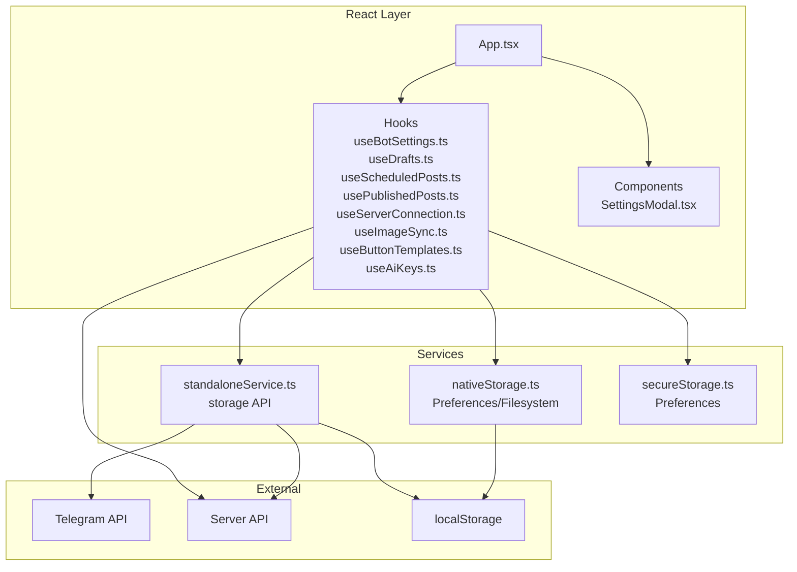

**Diagram sources**
- [App.tsx:168-170](file://src/App.tsx#L168-L170)
- [useBotSettings.ts:1-56](file://src/hooks/useBotSettings.ts#L1-L56)
- [useDrafts.ts:1-88](file://src/hooks/useDrafts.ts#L1-L88)
- [useScheduledPosts.ts:1-38](file://src/hooks/useScheduledPosts.ts#L1-L38)
- [usePublishedPosts.ts:1-38](file://src/hooks/usePublishedPosts.ts#L1-L38)
- [useServerConnection.ts:1-52](file://src/hooks/useServerConnection.ts#L1-L52)
- [useImageSync.ts:1-42](file://src/hooks/useImageSync.ts#L1-L42)
- [useButtonTemplates.ts:1-38](file://src/hooks/useButtonTemplates.ts#L1-L38)
- [useAiKeys.ts:1-57](file://src/hooks/useAiKeys.ts#L1-L57)
- [standaloneService.ts:11-72](file://src/services/standaloneService.ts#L11-L72)
- [nativeStorage.ts:8-63](file://src/services/nativeStorage.ts#L8-L63)
- [secureStorage.ts:4-40](file://src/services/secureStorage.ts#L4-L40)
- [SettingsModal.tsx:28-107](file://src/components/SettingsModal.tsx#L28-L107)

**Section sources**
- [main.tsx:1-11](file://src/main.tsx#L1-L11)
- [App.tsx:168-170](file://src/App.tsx#L168-L170)

## Core Components
- Root application orchestrates environment detection, URL normalization, universal fetch, and cross-cutting concerns like logs and error boundary.
- Hooks encapsulate domain state and persistence:
  - Settings and credentials: useBotSettings
  - Drafts, scheduled, published posts: useDrafts, useScheduledPosts, usePublishedPosts
  - Server connectivity: useServerConnection
  - Image path and browsing: useImageSync
  - Button templates: useButtonTemplates
  - AI keys: useAiKeys
- Services abstract storage and external integrations:
  - standaloneService: filesystem-backed storage, Telegram API, AI, scraping
  - nativeStorage: unified read/write for native vs web
  - secureStorage: encrypted-like token storage via Preferences

**Section sources**
- [App.tsx:168-170](file://src/App.tsx#L168-L170)
- [useBotSettings.ts:5-56](file://src/hooks/useBotSettings.ts#L5-L56)
- [useDrafts.ts:5-88](file://src/hooks/useDrafts.ts#L5-L88)
- [useScheduledPosts.ts:5-38](file://src/hooks/useScheduledPosts.ts#L5-L38)
- [usePublishedPosts.ts:5-38](file://src/hooks/usePublishedPosts.ts#L5-L38)
- [useServerConnection.ts:15-52](file://src/hooks/useServerConnection.ts#L15-L52)
- [useImageSync.ts:5-42](file://src/hooks/useImageSync.ts#L5-L42)
- [useButtonTemplates.ts:5-38](file://src/hooks/useButtonTemplates.ts#L5-L38)
- [useAiKeys.ts:4-57](file://src/hooks/useAiKeys.ts#L4-L57)
- [standaloneService.ts:11-72](file://src/services/standaloneService.ts#L11-L72)
- [nativeStorage.ts:8-63](file://src/services/nativeStorage.ts#L8-L63)
- [secureStorage.ts:4-40](file://src/services/secureStorage.ts#L4-L40)

## Architecture Overview
The state lifecycle follows a layered pattern:
- Environment detection determines whether to use native storage/HTTP or web fallbacks.
- Hooks manage component-local state and delegate persistence to services.
- Centralized services unify filesystem, preferences, and HTTP requests.
- Cross-component communication occurs via shared hooks and callbacks passed down from the root.

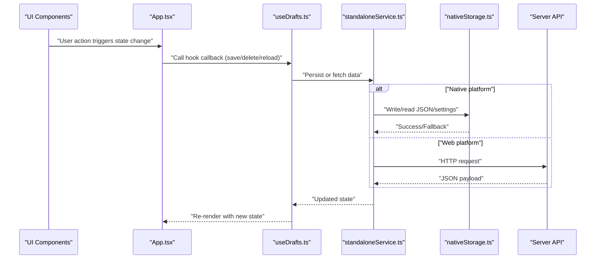

**Diagram sources**
- [App.tsx:324-329](file://src/App.tsx#L324-L329)
- [useDrafts.ts:31-54](file://src/hooks/useDrafts.ts#L31-L54)
- [standaloneService.ts:25-71](file://src/services/standaloneService.ts#L25-L71)
- [nativeStorage.ts:16-46](file://src/services/nativeStorage.ts#L16-L46)

**Section sources**
- [App.tsx:174-182](file://src/App.tsx#L174-L182)
- [standaloneService.ts:8-9](file://src/services/standaloneService.ts#L8-L9)

## Detailed Component Analysis

### Settings and Credentials: useBotSettings
- Manages bot token and chat ID with environment-aware persistence.
- Loads settings on mount and updates both memory and storage.
- Supports secure token storage on native platforms.

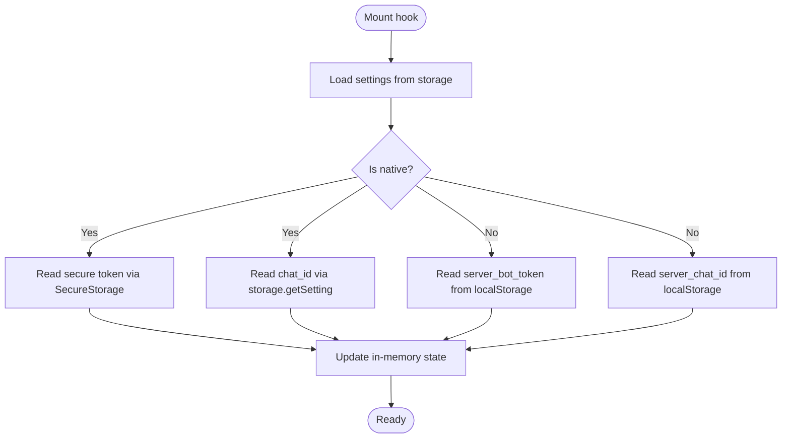

**Diagram sources**
- [useBotSettings.ts:9-23](file://src/hooks/useBotSettings.ts#L9-L23)
- [secureStorage.ts:21-29](file://src/services/secureStorage.ts#L21-L29)
- [standaloneService.ts:64-71](file://src/services/standaloneService.ts#L64-L71)

**Section sources**
- [useBotSettings.ts:5-56](file://src/hooks/useBotSettings.ts#L5-L56)
- [secureStorage.ts:4-40](file://src/services/secureStorage.ts#L4-L40)
- [standaloneService.ts:56-71](file://src/services/standaloneService.ts#L56-L71)

### Drafts Management: useDrafts
- Maintains a list of DraftPost entries with loading state.
- Persists drafts locally on native or via server endpoint on web.
- Provides save and delete operations with optimistic updates and reload.

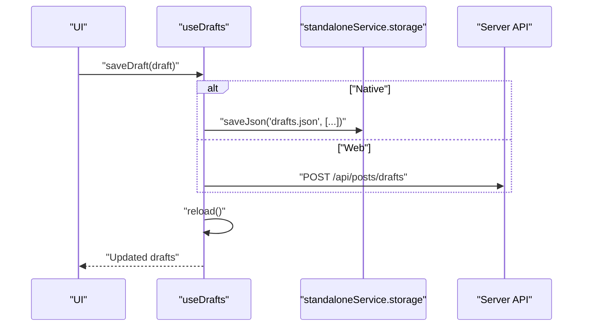

**Diagram sources**
- [useDrafts.ts:31-54](file://src/hooks/useDrafts.ts#L31-L54)
- [standaloneService.ts:25-36](file://src/services/standaloneService.ts#L25-L36)

**Section sources**
- [useDrafts.ts:5-88](file://src/hooks/useDrafts.ts#L5-L88)
- [types.ts:13-26](file://src/types.ts#L13-L26)

### Scheduled and Published Posts: useScheduledPosts, usePublishedPosts
- Mirror drafts’ pattern with environment-aware loading and state.
- Normalize server responses to arrays for robustness.

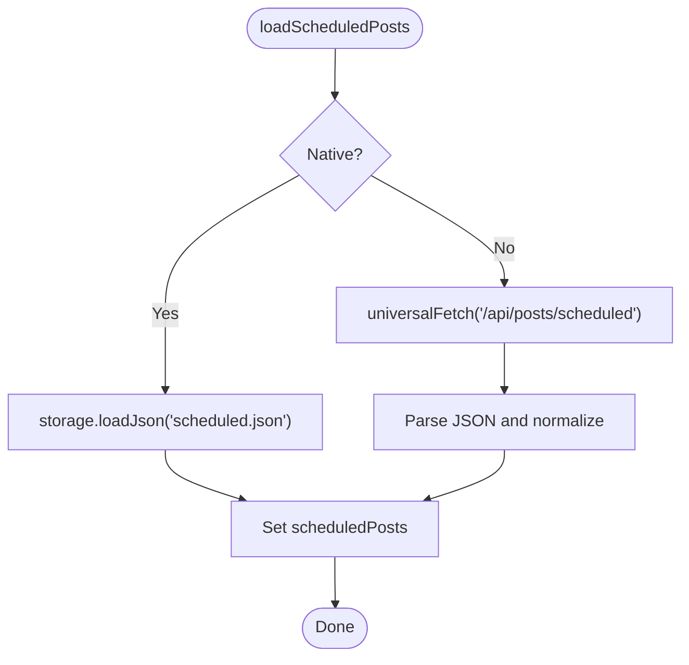

**Diagram sources**
- [useScheduledPosts.ts:9-29](file://src/hooks/useScheduledPosts.ts#L9-L29)
- [usePublishedPosts.ts:9-29](file://src/hooks/usePublishedPosts.ts#L9-L29)
- [standaloneService.ts:38-54](file://src/services/standaloneService.ts#L38-L54)

**Section sources**
- [useScheduledPosts.ts:5-38](file://src/hooks/useScheduledPosts.ts#L5-L38)
- [usePublishedPosts.ts:5-38](file://src/hooks/usePublishedPosts.ts#L5-L38)

### Server Connectivity: useServerConnection
- Periodically polls server status and exposes loading/error states.
- Uses CapacitorHttp for native reliability.

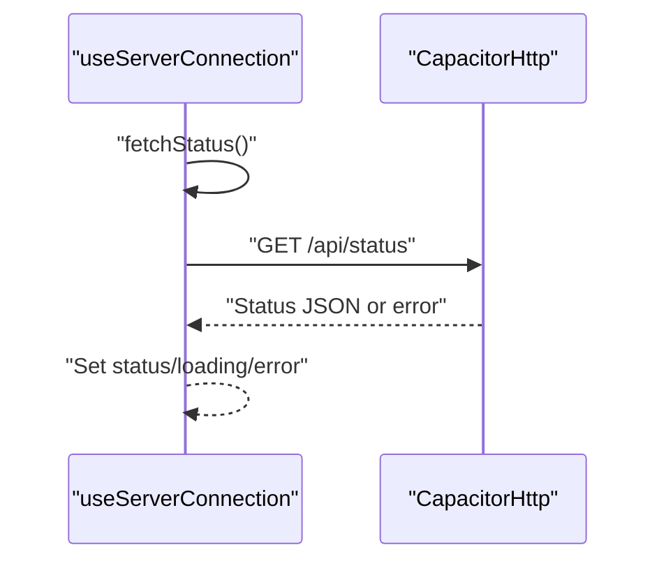

**Diagram sources**
- [useServerConnection.ts:20-42](file://src/hooks/useServerConnection.ts#L20-L42)

**Section sources**
- [useServerConnection.ts:15-52](file://src/hooks/useServerConnection.ts#L15-L52)

### Image Path and Sync: useImageSync
- Stores and retrieves image path setting in environment-appropriate storage.
- Integrates with filesystem APIs on native and server endpoints on web.

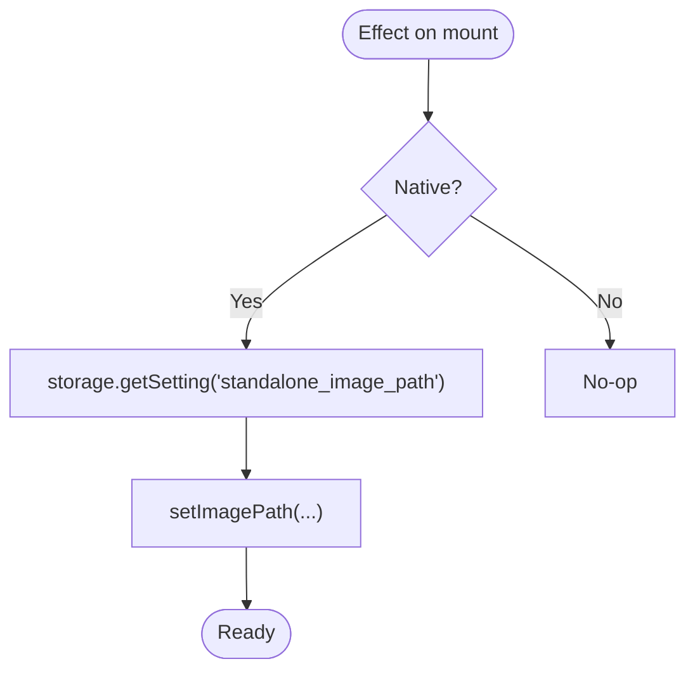

**Diagram sources**
- [useImageSync.ts:12-27](file://src/hooks/useImageSync.ts#L12-L27)
- [standaloneService.ts:64-71](file://src/services/standaloneService.ts#L64-L71)

**Section sources**
- [useImageSync.ts:5-42](file://src/hooks/useImageSync.ts#L5-L42)

### Button Templates: useButtonTemplates
- Loads reusable button templates from local storage or server.

**Section sources**
- [useButtonTemplates.ts:5-38](file://src/hooks/useButtonTemplates.ts#L5-L38)

### AI Keys: useAiKeys
- Manages multiple provider keys with environment-aware persistence and batched reads/writes.

**Section sources**
- [useAiKeys.ts:4-57](file://src/hooks/useAiKeys.ts#L4-L57)

### Centralized Storage and Services
- standaloneService.storage: filesystem-backed JSON and settings with web fallbacks.
- nativeStorage: unified read/write for native vs web.
- secureStorage: token wrapper around Preferences/localStorage.

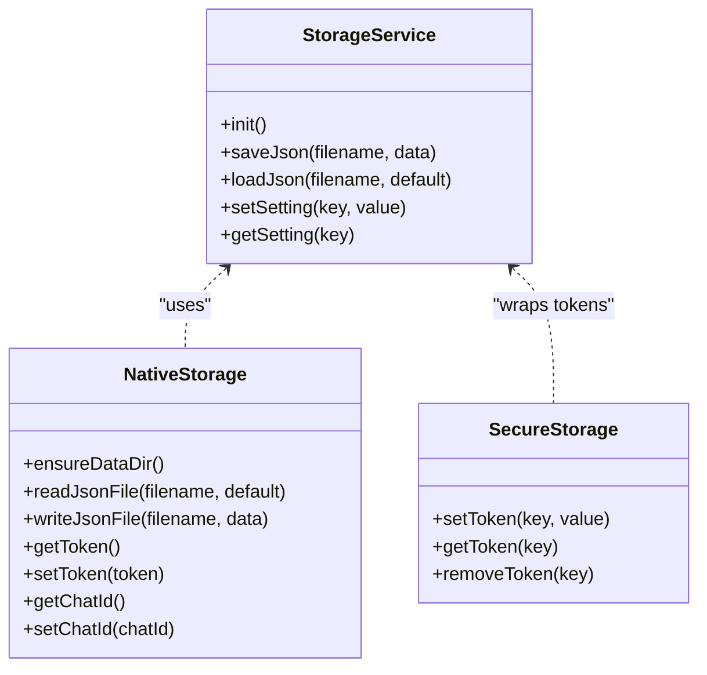

**Diagram sources**
- [standaloneService.ts:11-72](file://src/services/standaloneService.ts#L11-L72)
- [nativeStorage.ts:8-63](file://src/services/nativeStorage.ts#L8-L63)
- [secureStorage.ts:4-40](file://src/services/secureStorage.ts#L4-L40)

**Section sources**
- [standaloneService.ts:11-72](file://src/services/standaloneService.ts#L11-L72)
- [nativeStorage.ts:8-63](file://src/services/nativeStorage.ts#L8-L63)
- [secureStorage.ts:4-40](file://src/services/secureStorage.ts#L4-L40)

### Settings Modal and Cross-Component Communication
- SettingsModal coordinates environment toggle, URL input, and credential updates.
- App composes hooks and passes callbacks to modal and other components.

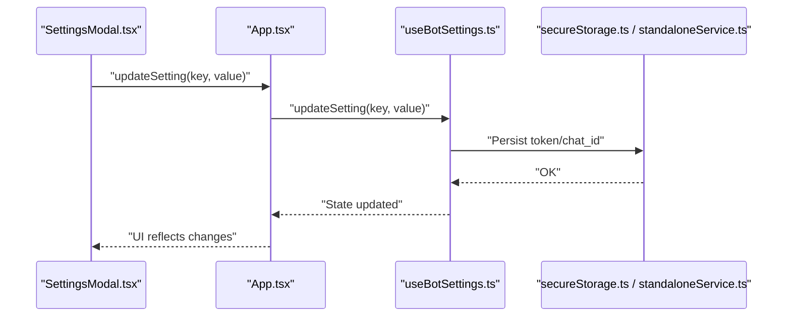

**Diagram sources**
- [SettingsModal.tsx:28-107](file://src/components/SettingsModal.tsx#L28-L107)
- [App.tsx:274-283](file://src/App.tsx#L274-L283)
- [useBotSettings.ts:25-43](file://src/hooks/useBotSettings.ts#L25-L43)
- [secureStorage.ts:7-19](file://src/services/secureStorage.ts#L7-L19)
- [standaloneService.ts:56-71](file://src/services/standaloneService.ts#L56-L71)

**Section sources**
- [SettingsModal.tsx:28-107](file://src/components/SettingsModal.tsx#L28-L107)
- [App.tsx:267-283](file://src/App.tsx#L267-L283)

## Dependency Analysis
- Coupling:
  - Hooks depend on standaloneService and environment checks.
  - App composes hooks and provides shared utilities (universalFetch, URL helpers).
- Cohesion:
  - Each hook encapsulates a single domain concern.
- External dependencies:
  - Capacitor (Preferences, Filesystem, Http) for native behavior.
  - localStorage for web fallbacks.
  - Telegram API and server endpoints for remote operations.

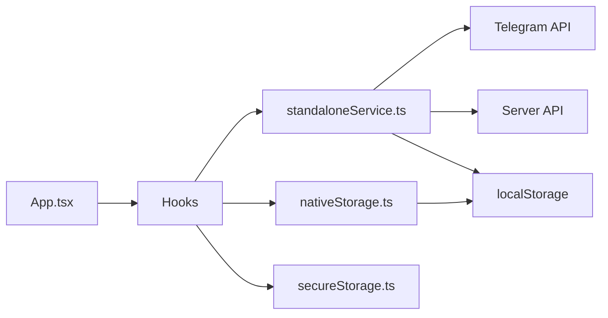

**Diagram sources**
- [App.tsx:168-170](file://src/App.tsx#L168-L170)
- [standaloneService.ts:11-72](file://src/services/standaloneService.ts#L11-L72)
- [nativeStorage.ts:8-63](file://src/services/nativeStorage.ts#L8-L63)
- [secureStorage.ts:4-40](file://src/services/secureStorage.ts#L4-L40)

**Section sources**
- [App.tsx:168-170](file://src/App.tsx#L168-L170)
- [standaloneService.ts:11-72](file://src/services/standaloneService.ts#L11-L72)

## Performance Considerations
- Minimize re-renders:
  - Use useCallback for callbacks passed to hooks to avoid unnecessary prop changes.
  - Keep derived computations outside effects when possible.
- Debounce and throttle:
  - Auto-save image path with a short debounce to reduce network calls.
- Efficient polling:
  - Use intervals judiciously; cancel on unmount and avoid redundant requests.
- Environment-aware fetch:
  - Prefer CapacitorHttp on native for better timeouts and reliability.
- Local-first UX:
  - Initialize UI quickly with localStorage/fallbacks; overlay server data asynchronously.

[No sources needed since this section provides general guidance]

## Troubleshooting Guide
- Error boundary:
  - App wraps the main content in an ErrorBoundary to recover from runtime errors and offer quick resets.
- Logging:
  - Client-side logs are appended with timestamps and can be paused/collapsed/fullscreen toggled.
- Network diagnostics:
  - Dedicated tests for connection and network availability; SSE polling fallbacks for logs.
- Recovery actions:
  - Clearing server URL preference or full reset via the error UI.

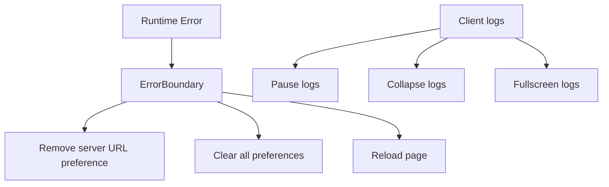

**Diagram sources**
- [App.tsx:146-166](file://src/App.tsx#L146-L166)

**Section sources**
- [App.tsx:146-166](file://src/App.tsx#L146-L166)
- [App.tsx:531-535](file://src/App.tsx#L531-L535)
- [App.tsx:651-698](file://src/App.tsx#L651-L698)

## Conclusion
The application employs a layered state management strategy:
- React hooks encapsulate domain state and side effects.
- Environment detection switches between native and web storage/HTTP.
- Centralized services unify filesystem, preferences, and external APIs.
- Cross-component communication is achieved via shared hooks and callbacks.
- Robust error handling and logging enable effective debugging and recovery.

[No sources needed since this section summarizes without analyzing specific files]