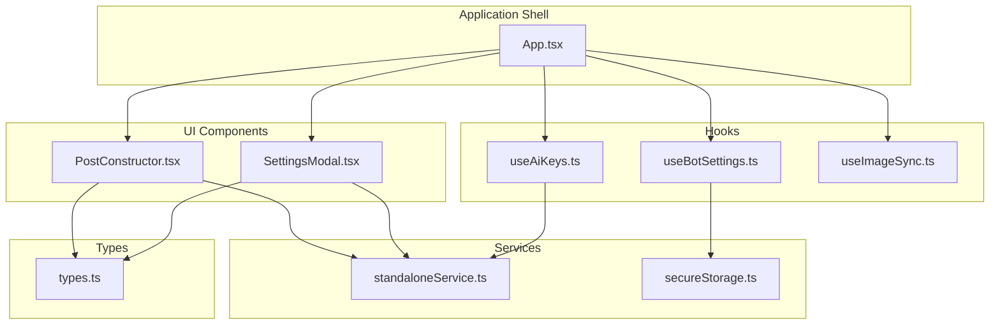
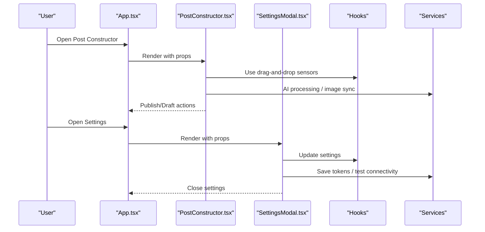
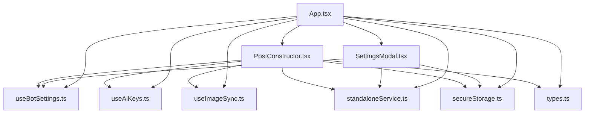

# UI Components

<cite>
**Referenced Files in This Document**
- [PostConstructor.tsx](file://src/components/PostConstructor.tsx)
- [SettingsModal.tsx](file://src/components/SettingsModal.tsx)
- [App.tsx](file://src/App.tsx)
- [types.ts](file://src/types.ts)
- [useBotSettings.ts](file://src/hooks/useBotSettings.ts)
- [useAiKeys.ts](file://src/hooks/useAiKeys.ts)
- [useImageSync.ts](file://src/hooks/useImageSync.ts)
- [standaloneService.ts](file://src/services/standaloneService.ts)
- [secureStorage.ts](file://src/services/secureStorage.ts)
</cite>

## Table of Contents
1. [Introduction](#introduction)
2. [Project Structure](#project-structure)
3. [Core Components](#core-components)
4. [Architecture Overview](#architecture-overview)
5. [Detailed Component Analysis](#detailed-component-analysis)
6. [Dependency Analysis](#dependency-analysis)
7. [Performance Considerations](#performance-considerations)
8. [Troubleshooting Guide](#troubleshooting-guide)
9. [Conclusion](#conclusion)
10. [Appendices](#appendices)

## Introduction
This document provides comprehensive documentation for two primary UI components: PostConstructor and SettingsModal. It explains their roles in content creation, markdown editing, image gallery management, AI processing integration, configuration management, form handling, and persistence. It also covers component lifecycle, event handling, accessibility features, responsive design, usage examples, customization options, and integration patterns within the broader application.

## Project Structure
The UI components are implemented as React functional components with TypeScript interfaces and are orchestrated by the main application shell. They integrate with hooks for state management and services for platform-specific capabilities and data persistence.



**Diagram sources**
- [App.tsx](file://src/App.tsx)
- [PostConstructor.tsx](file://src/components/PostConstructor.tsx)
- [SettingsModal.tsx](file://src/components/SettingsModal.tsx)
- [useBotSettings.ts](file://src/hooks/useBotSettings.ts)
- [useAiKeys.ts](file://src/hooks/useAiKeys.ts)
- [useImageSync.ts](file://src/hooks/useImageSync.ts)
- [standaloneService.ts](file://src/services/standaloneService.ts)
- [secureStorage.ts](file://src/services/secureStorage.ts)
- [types.ts](file://src/types.ts)

**Section sources**
- [App.tsx](file://src/App.tsx)
- [PostConstructor.tsx](file://src/components/PostConstructor.tsx)
- [SettingsModal.tsx](file://src/components/SettingsModal.tsx)

## Core Components
- PostConstructor: A modal-driven editor for creating posts with markdown editing, image gallery management, AI processing integration, and scheduling/publishing actions.
- SettingsModal: A modal for managing application settings, including standalone/server mode, base URL, bot token, and testing connectivity.

**Section sources**
- [PostConstructor.tsx](file://src/components/PostConstructor.tsx)
- [SettingsModal.tsx](file://src/components/SettingsModal.tsx)

## Architecture Overview
The components are rendered conditionally within the application shell. PostConstructor is controlled by state in App.tsx and receives callbacks and state props to manage content creation and publishing. SettingsModal manages configuration and persists settings via hooks and services.



**Diagram sources**
- [App.tsx](file://src/App.tsx)
- [PostConstructor.tsx](file://src/components/PostConstructor.tsx)
- [SettingsModal.tsx](file://src/components/SettingsModal.tsx)
- [useBotSettings.ts](file://src/hooks/useBotSettings.ts)
- [useAiKeys.ts](file://src/hooks/useAiKeys.ts)
- [standaloneService.ts](file://src/services/standaloneService.ts)

## Detailed Component Analysis

### PostConstructor Component
PostConstructor is a comprehensive content creation UI with:
- Tabbed layout for text, images, and buttons
- Markdown editor with custom spoiler support
- AI processing integration with Gemini
- Drag-and-drop image gallery with selection and main image designation
- Button templates and management
- Scheduling and publishing actions
- Status feedback and error messaging

#### Props Interface
The component accepts a comprehensive set of props for state management and actions:
- Modal control: isOpen, onClose, isConstructorOpen, setIsConstructorOpen
- Content state: parsedContent, setParsedContent, aiProcessedText, setAiProcessedText, originalText, setOriginalText
- Images: selectedImages, setSelectedImages, mainImage, setMainImage, SortableImage
- Buttons: postButtons, setPostButtons, showTemplates, setShowTemplates, buttonTemplates, handleDeleteTemplate, saveButtonTemplate, templateName, setTemplateName
- AI: isProcessingAI, processAI
- Paths and folders: imagePath, setImagePath, openFolderBrowser, isBrowserLoading, saveImagePath, handleFolderSelect, syncLocalImages
- Scheduling: scheduleDateTime, setScheduleDateTime
- Actions: saveDraft, handlePublish, submitMsg
- Drag-and-drop: sensors, handleDragEnd, toggleImageSelection
- Ref: processedTextRef

#### State Management
- Local state for editor text to avoid lag with controlled editors
- Active tab state for responsive layout switching
- Derived state from props for character limits and UI feedback

#### User Interaction Patterns
- Tab navigation switches between text editor, image gallery, and button editor
- AI processing via paste and process button
- Image selection/deselection with drag-and-drop reordering
- Button creation/deletion with inline inputs
- Scheduling with datetime picker
- Draft saving and publishing actions

#### Accessibility Features
- Proper labeling and ARIA attributes for interactive elements
- Focus management and keyboard navigation support
- Clear visual feedback for disabled states
- Semantic markup for screen readers

#### Responsive Design Implementation
- Mobile-first layout with collapsible tabs
- Adaptive grid layouts for desktop and mobile
- Touch-friendly controls and spacing
- Responsive typography and sizing

#### Lifecycle and Events
- Mount initializes local state from props
- Effect updates local state when AI processed text changes
- Drag-and-drop events trigger image reordering
- Form submissions trigger async actions with loading states

#### Integration Patterns
- Integrates with App.tsx state for content creation
- Uses hooks for AI keys and bot settings
- Leverages services for platform-specific capabilities
- Persists data via hooks and services

**Section sources**
- [PostConstructor.tsx](file://src/components/PostConstructor.tsx)
- [App.tsx](file://src/App.tsx)
- [types.ts](file://src/types.ts)

#### PostConstructor Class Diagram
```mermaid
classDiagram
class PostConstructor {
+boolean isOpen
+boolean isConstructorOpen
+ParsedContent parsedContent
+string aiProcessedText
+string originalText
+string[] selectedImages
+string mainImage
+PostButton[] postButtons
+string scheduleDateTime
+boolean isProcessingAI
+boolean isActionInProgress
+boolean showTemplates
+string templateName
+string imagePath
+boolean isBrowserLoading
+{type : string, text : string} submitMsg
+Ref processedTextRef
+useSensors sensors
+handleTextChange(value)
+processAI()
+toggleImageSelection(url)
+handleDragEnd(event)
+saveDraft(type)
+handlePublish()
+saveButtonTemplate()
+handleDeleteTemplate(id)
+openFolderBrowser(path)
+handleFolderSelect(event)
+syncLocalImages(shouldSavePath, overridePath)
+saveImagePath()
+setParsedContent(action)
+setAiProcessedText(value)
+setOriginalText(value)
+setSelectedImages(action)
+setMainImage(url)
+setPostButtons(action)
+setScheduleDateTime(value)
+setIsConstructorOpen(flag)
+setShowTemplates(flag)
+setTemplateName(name)
+setImagePath(path)
+onClose()
}
class SortableImage {
+string id
+string url
+boolean isMain
+onSelect(url)
+onSetMain(url)
}
PostConstructor --> SortableImage : "renders"
```

**Diagram sources**
- [PostConstructor.tsx](file://src/components/PostConstructor.tsx)

### SettingsModal Component
SettingsModal provides configuration management with:
- Mode selection between standalone and server modes
- Base URL configuration for server mode
- Bot token management with secure storage
- Connectivity testing and network diagnostics
- Setting persistence and validation

#### Props Interface
The component accepts props for:
- Modal control: isOpen, onClose
- Mode and URLs: isStandalone, setIsStandalone, tempBaseUrl, setTempBaseUrl, setBaseUrl
- Bot configuration: botToken, updateSetting
- Server status: serverStatus, getCleanBaseUrl, universalFetch
- Feedback: submitMsg, isSubmitting, isTestingConnection, isTestingNet, netTestResult
- Actions: testConnection, testNetwork, handleSaveSettings

#### State Management
- Temporary state for base URL during editing
- Submit message state for user feedback
- Loading states for async operations

#### User Interaction Patterns
- Toggle between standalone and server modes
- Enter and validate base URL
- Manage bot token securely
- Test connections and network availability
- Save settings with validation

#### Accessibility Features
- Clear labels and instructions
- Disabled states during operations
- Visual feedback for success/error states
- Keyboard navigable controls

#### Responsive Design Implementation
- Compact layout suitable for mobile devices
- Adaptive spacing and sizing
- Touch-friendly buttons and inputs

#### Integration Patterns
- Integrates with App.tsx for mode switching
- Uses hooks for bot settings and AI keys
- Persists settings via secure storage and preferences
- Validates and tests configurations before saving

**Section sources**
- [SettingsModal.tsx](file://src/components/SettingsModal.tsx)
- [App.tsx](file://src/App.tsx)
- [useBotSettings.ts](file://src/hooks/useBotSettings.ts)
- [useAiKeys.ts](file://src/hooks/useAiKeys.ts)
- [secureStorage.ts](file://src/services/secureStorage.ts)

#### SettingsModal Class Diagram
```mermaid
classDiagram
class SettingsModal {
+boolean isOpen
+boolean isStandalone
+string tempBaseUrl
+string botToken
+ServerConfigStatus serverStatus
+{type : string, text : string} submitMsg
+boolean isSubmitting
+boolean isTestingConnection
+boolean isTestingNet
+string netTestResult
+setIsStandalone(flag)
+setTempBaseUrl(url)
+setBaseUrl(url)
+updateSetting(key, value)
+getCleanBaseUrl(url)
+universalFetch(url, options)
+testConnection()
+testNetwork()
+handleSaveSettings()
+onClose()
}
```

**Diagram sources**
- [SettingsModal.tsx](file://src/components/SettingsModal.tsx)

## Dependency Analysis
The components depend on shared hooks and services for state management and platform capabilities.



**Diagram sources**
- [PostConstructor.tsx](file://src/components/PostConstructor.tsx)
- [SettingsModal.tsx](file://src/components/SettingsModal.tsx)
- [App.tsx](file://src/App.tsx)
- [useBotSettings.ts](file://src/hooks/useBotSettings.ts)
- [useAiKeys.ts](file://src/hooks/useAiKeys.ts)
- [useImageSync.ts](file://src/hooks/useImageSync.ts)
- [standaloneService.ts](file://src/services/standaloneService.ts)
- [secureStorage.ts](file://src/services/secureStorage.ts)
- [types.ts](file://src/types.ts)

**Section sources**
- [App.tsx](file://src/App.tsx)
- [PostConstructor.tsx](file://src/components/PostConstructor.tsx)
- [SettingsModal.tsx](file://src/components/SettingsModal.tsx)

## Performance Considerations
- Local state management in PostConstructor prevents unnecessary re-renders during text editing
- Debounced image path saving reduces network requests
- Conditional rendering of modals minimizes DOM overhead
- Platform-specific optimizations for native vs web environments
- Efficient drag-and-drop implementation with minimal reflows

## Troubleshooting Guide
Common issues and resolutions:
- AI processing failures: Check API key configuration and provider selection
- Image synchronization errors: Verify file permissions and path correctness
- Bot token issues: Confirm token validity and chat ID configuration
- Server connectivity problems: Validate base URL and network access
- Storage permission errors: Grant necessary permissions for file system access

**Section sources**
- [App.tsx](file://src/App.tsx)
- [standaloneService.ts](file://src/services/standaloneService.ts)

## Conclusion
PostConstructor and SettingsModal provide a robust foundation for content creation and configuration management. Their modular design, comprehensive prop interfaces, and integration with hooks and services enable flexible customization and reliable operation across platforms. The components demonstrate strong separation of concerns, accessibility considerations, and responsive design patterns suitable for both mobile and desktop environments.

## Appendices
- Integration examples and customization patterns are demonstrated in the main application shell
- Data models and types are defined in the shared types module
- Platform-specific services handle native capabilities and secure storage