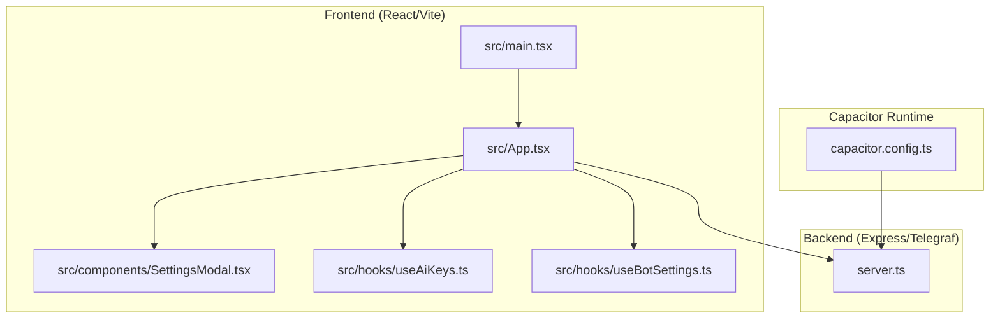
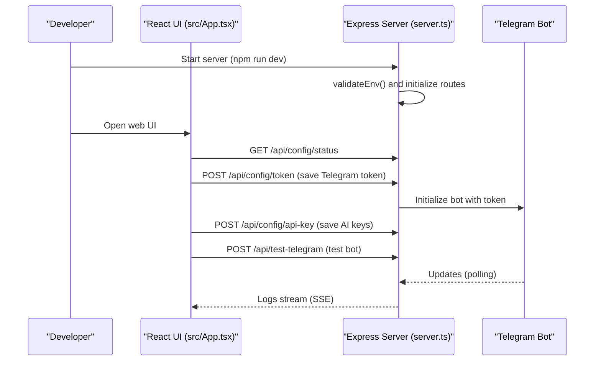
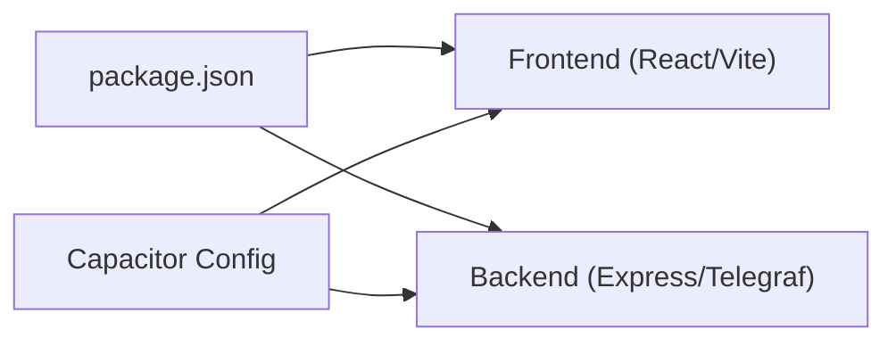

# Getting Started

<cite>
**Referenced Files in This Document**
- [README.md](file://README.md)
- [package.json](file://package.json)
- [server.ts](file://server.ts)
- [vite.config.ts](file://vite.config.ts)
- [capacitor.config.ts](file://capacitor.config.ts)
- [src/main.tsx](file://src/main.tsx)
- [src/App.tsx](file://src/App.tsx)
- [src/components/SettingsModal.tsx](file://src/components/SettingsModal.tsx)
- [src/hooks/useAiKeys.ts](file://src/hooks/useAiKeys.ts)
- [src/hooks/useBotSettings.ts](file://src/hooks/useBotSettings.ts)
- [src/services/standaloneService.ts](file://src/services/standaloneService.ts)
- [src/services/storageWrapper.ts](file://src/services/storageWrapper.ts)
- [src/serverUtils.ts](file://src/serverUtils.ts)
</cite>

## Table of Contents
1. [Introduction](#introduction)
2. [Project Structure](#project-structure)
3. [Core Components](#core-components)
4. [Architecture Overview](#architecture-overview)
5. [Detailed Component Analysis](#detailed-component-analysis)
6. [Dependency Analysis](#dependency-analysis)
7. [Performance Considerations](#performance-considerations)
8. [Troubleshooting Guide](#troubleshooting-guide)
9. [Conclusion](#conclusion)
10. [Appendices](#appendices)

## Introduction
This guide helps you install, configure, and run the AI News Bot locally. It covers prerequisites, environment setup, development server startup, web interface usage, Telegram bot configuration, and troubleshooting.

## Project Structure
The project is a hybrid web-capacitor app with a Node.js backend server:
- Frontend built with React and Vite
- Backend server written in TypeScript using Express and Telegraf
- Capacitor configuration for Android packaging and runtime APIs
- Environment variables for AI provider keys and Telegram bot token

**Diagram sources**
- [src/main.tsx:1-11](file://src/main.tsx#L1-L11)
- [src/App.tsx:1-100](file://src/App.tsx#L1-L100)
- [src/components/SettingsModal.tsx:1-107](file://src/components/SettingsModal.tsx#L1-L107)
- [src/hooks/useAiKeys.ts:1-57](file://src/hooks/useAiKeys.ts#L1-L57)
- [src/hooks/useBotSettings.ts:1-55](file://src/hooks/useBotSettings.ts#L1-L55)
- [server.ts:1-100](file://server.ts#L1-L100)
- [capacitor.config.ts:1-26](file://capacitor.config.ts#L1-L26)

**Section sources**
- [README.md:11-25](file://README.md#L11-L25)
- [package.json:1-70](file://package.json#L1-L70)
- [vite.config.ts:1-28](file://vite.config.ts#L1-L28)
- [capacitor.config.ts:1-26](file://capacitor.config.ts#L1-L26)
- [src/main.tsx:1-11](file://src/main.tsx#L1-L11)

## Core Components
- Backend server initializes environment, validates required variables, sets up routes, rate limits, and the Telegram bot.
- Frontend provides a React UI with settings modal, AI key management, and server connectivity helpers.
- Capacitor integrates native capabilities (filesystem, preferences, browser) for Android builds.

Key responsibilities:
- Environment validation and logging
- Telegram bot lifecycle and polling
- AI provider selection and fallback
- Persistent configuration storage (tokens, chat IDs, API keys)
- Web UI for configuration and testing

**Section sources**
- [server.ts:17-36](file://server.ts#L17-L36)
- [server.ts:688-800](file://server.ts#L688-L800)
- [src/App.tsx:168-220](file://src/App.tsx#L168-L220)
- [src/components/SettingsModal.tsx:28-107](file://src/components/SettingsModal.tsx#L28-L107)
- [src/hooks/useAiKeys.ts:1-57](file://src/hooks/useAiKeys.ts#L1-L57)
- [src/hooks/useBotSettings.ts:1-55](file://src/hooks/useBotSettings.ts#L1-L55)
- [src/services/standaloneService.ts:11-72](file://src/services/standaloneService.ts#L11-L72)
- [src/services/storageWrapper.ts:9-99](file://src/services/storageWrapper.ts#L9-L99)

## Architecture Overview
High-level flow:
- Developer runs the backend server locally.
- Frontend connects to the server, loads configuration, and allows saving AI keys and Telegram token.
- The server manages the Telegram bot via polling and processes text through configured AI providers.

**Diagram sources**
- [server.ts:17-36](file://server.ts#L17-L36)
- [server.ts:991-1000](file://server.ts#L991-L1000)
- [server.ts:1038-1048](file://server.ts#L1038-L1048)
- [server.ts:1369-1377](file://server.ts#L1369-L1377)
- [server.ts:342-352](file://server.ts#L342-L352)
- [src/App.tsx:622-641](file://src/App.tsx#L622-L641)

## Detailed Component Analysis

### Prerequisites and Installation
- Node.js: Required to run the development server and build the frontend.
- Install dependencies and run the development server as described below.

Step-by-step:
1. Install dependencies
   - Run: npm install
2. Configure environment variables
   - Set TELEGRAM_BOT_TOKEN
   - Optional: GEMINI_API_KEY, GITHUB_TOKEN, OPENROUTER_API_KEY, DEEPSEEK_API_KEY
3. Start the development server
   - Run: npm run dev

Verification:
- Access the web UI at http://localhost:5173
- Use the Settings modal to save Telegram token and AI keys
- Test Telegram connectivity and AI key validity

**Section sources**
- [README.md:13-25](file://README.md#L13-L25)
- [package.json:6-17](file://package.json#L6-L17)
- [server.ts:24-33](file://server.ts#L24-L33)

### Environment Variables
Required and optional keys:
- TELEGRAM_BOT_TOKEN (required)
- GEMINI_API_KEY (recommended)
- GITHUB_TOKEN (optional)
- OPENROUTER_API_KEY (optional)
- DEEPSEEK_API_KEY (optional)

Where they are used:
- TELEGRAM_BOT_TOKEN is validated at startup and stored persistently by the server.
- AI keys are saved per provider and used for translation and formatting tasks.

**Section sources**
- [server.ts:24-33](file://server.ts#L24-L33)
- [server.ts:1038-1048](file://server.ts#L1038-L1048)
- [src/hooks/useAiKeys.ts:4-56](file://src/hooks/useAiKeys.ts#L4-L56)

### Running the Development Server
- Start the server: npm run dev
- The server initializes logging, loads persistent data, and starts the Telegram bot if a token is present.
- Access logs via the UI or SSE endpoint.

**Section sources**
- [package.json:7-8](file://package.json#L7-L8)
- [server.ts:1380-1384](file://server.ts#L1380-L1384)
- [server.ts:342-352](file://server.ts#L342-L352)

### Web Interface and First Run
- Open http://localhost:5173 in your browser.
- Use the Settings modal to:
  - Toggle between Standalone and Server modes
  - Enter Telegram bot token
  - Optionally enter server URL for server mode
- Save settings to persist token and URL.
- Manage AI keys via the “AI Keys” section in the UI.

UI entry point:
- Root renders App component.

**Section sources**
- [src/App.tsx:168-220](file://src/App.tsx#L168-L220)
- [src/components/SettingsModal.tsx:28-107](file://src/components/SettingsModal.tsx#L28-L107)
- [src/main.tsx:1-11](file://src/main.tsx#L1-L11)

### Telegram Bot Configuration
- Save the Telegram token in the UI; the server will initialize the bot automatically.
- Test the bot by sending a message to the bot’s username or using the test endpoint.
- The server deletes any existing webhook and starts polling to receive updates.

**Section sources**
- [server.ts:991-1000](file://server.ts#L991-L1000)
- [server.ts:1369-1377](file://server.ts#L1369-L1377)
- [server.ts:706-789](file://server.ts#L706-L789)

### AI Provider Keys Management
- The UI supports four providers: gemini, github, openrouter, deepseek.
- Keys can be saved per provider and tested individually.
- The server stores keys persistently and selects a preferred provider.

**Section sources**
- [src/App.tsx:1685-1720](file://src/App.tsx#L1685-L1720)
- [src/hooks/useAiKeys.ts:1-57](file://src/hooks/useAiKeys.ts#L1-L57)
- [server.ts:1038-1048](file://server.ts#L1038-L1048)

### Capacitor and Android Build
- Capacitor configuration defines the app ID, app name, web directory, and server settings.
- Android-specific settings enable mixed content and web debugging.

**Section sources**
- [capacitor.config.ts:1-26](file://capacitor.config.ts#L1-L26)

## Dependency Analysis
- Frontend depends on React, Vite, and Capacitor plugins.
- Backend depends on Express, Telegraf, rate limiting, and environment configuration.
- AI services integrate with Gemini, GitHub, OpenRouter, and DeepSeek.

**Diagram sources**
- [package.json:19-56](file://package.json#L19-L56)
- [vite.config.ts:1-28](file://vite.config.ts#L1-L28)
- [capacitor.config.ts:1-26](file://capacitor.config.ts#L1-L26)

**Section sources**
- [package.json:19-56](file://package.json#L19-L56)
- [vite.config.ts:1-28](file://vite.config.ts#L1-L28)
- [capacitor.config.ts:1-26](file://capacitor.config.ts#L1-L26)

## Performance Considerations
- Rate limiting is applied to API endpoints and AI requests to prevent abuse.
- Logging uses a rolling buffer and file logger to avoid excessive memory usage.
- SSE streaming for logs is supported in browsers; polling is used on Android.

[No sources needed since this section provides general guidance]

## Troubleshooting Guide
Common issues and resolutions:
- Missing TELEGRAM_BOT_TOKEN
  - Symptom: Startup validation error or bot not initializing.
  - Fix: Set TELEGRAM_BOT_TOKEN and restart the server.
- AI key warnings
  - Symptom: Warning logged if GEMINI_API_KEY is missing.
  - Fix: Provide a valid Gemini key or another provider key.
- Telegram connectivity failures
  - Symptom: Health checks failing or 409 conflicts.
  - Fix: Clear or reinitialize the bot token; ensure no duplicate instances.
- CORS or network errors in browser
  - Symptom: Fetch failures when using server mode.
  - Fix: Use a valid server URL; ensure HTTPS for production environments.
- Android WebView limitations
  - Symptom: SSE not available; logs require polling.
  - Fix: Use polling logs or run on a desktop browser.

**Section sources**
- [server.ts:24-33](file://server.ts#L24-L33)
- [server.ts:377-409](file://server.ts#L377-L409)
- [src/App.tsx:651-698](file://src/App.tsx#L651-L698)

## Conclusion
You now have the essentials to install, configure, and run the AI News Bot locally. Use the web UI to manage Telegram and AI keys, and rely on the server logs to monitor runtime behavior.

[No sources needed since this section summarizes without analyzing specific files]

## Appendices

### Environment Variable Reference
- TELEGRAM_BOT_TOKEN: Required for Telegram bot initialization.
- GEMINI_API_KEY: Recommended for AI processing.
- GITHUB_TOKEN: Optional for GitHub models.
- OPENROUTER_API_KEY: Optional for OpenRouter.
- DEEPSEEK_API_KEY: Optional for DeepSeek.

**Section sources**
- [server.ts:24-33](file://server.ts#L24-L33)
- [server.ts:1038-1048](file://server.ts#L1038-L1048)

### First Run Checklist
- Install dependencies
- Set environment variables
- Start the server
- Open the web UI
- Save Telegram token and AI keys
- Test Telegram and AI connectivity

**Section sources**
- [README.md:16-24](file://README.md#L16-L24)
- [server.ts:1380-1384](file://server.ts#L1380-L1384)
- [src/App.tsx:168-220](file://src/App.tsx#L168-L220)