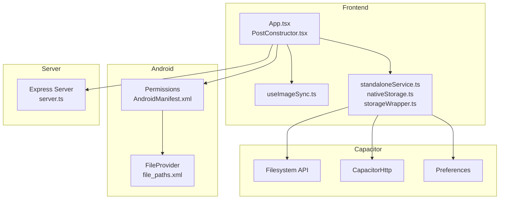
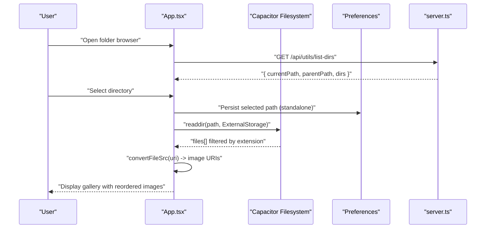
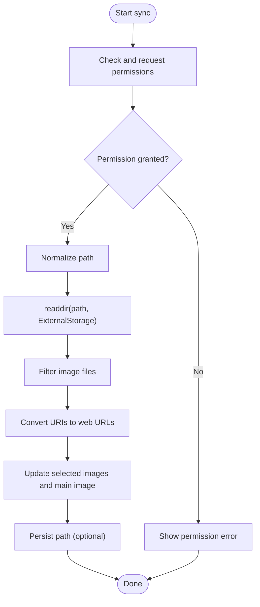
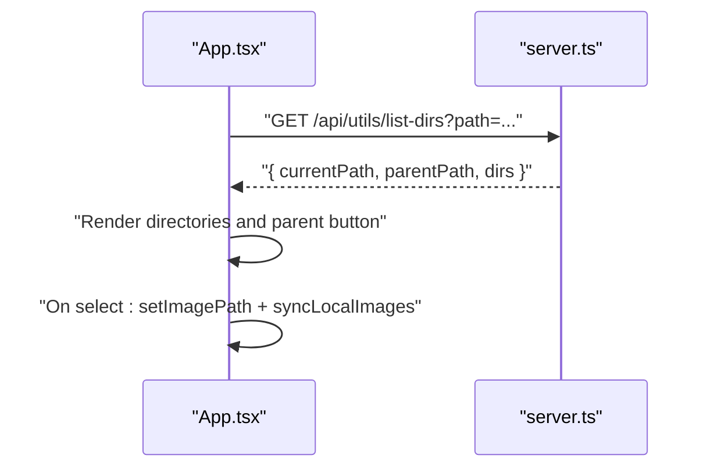
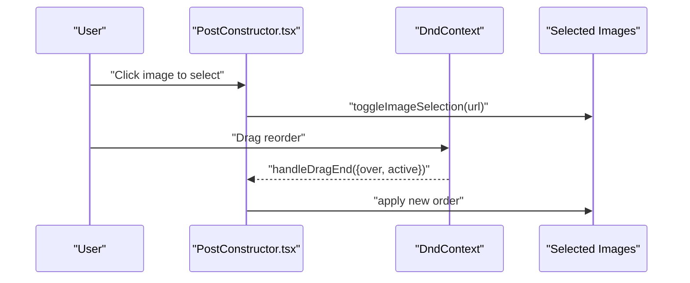
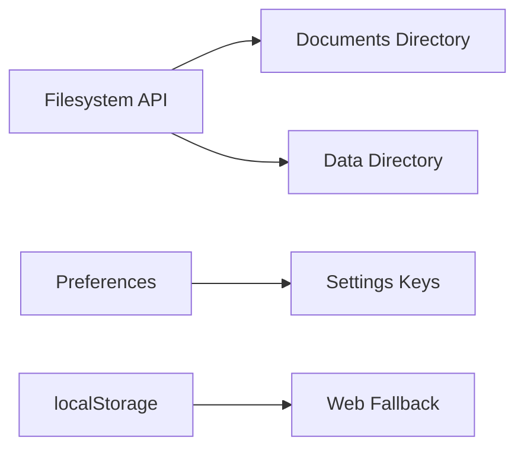
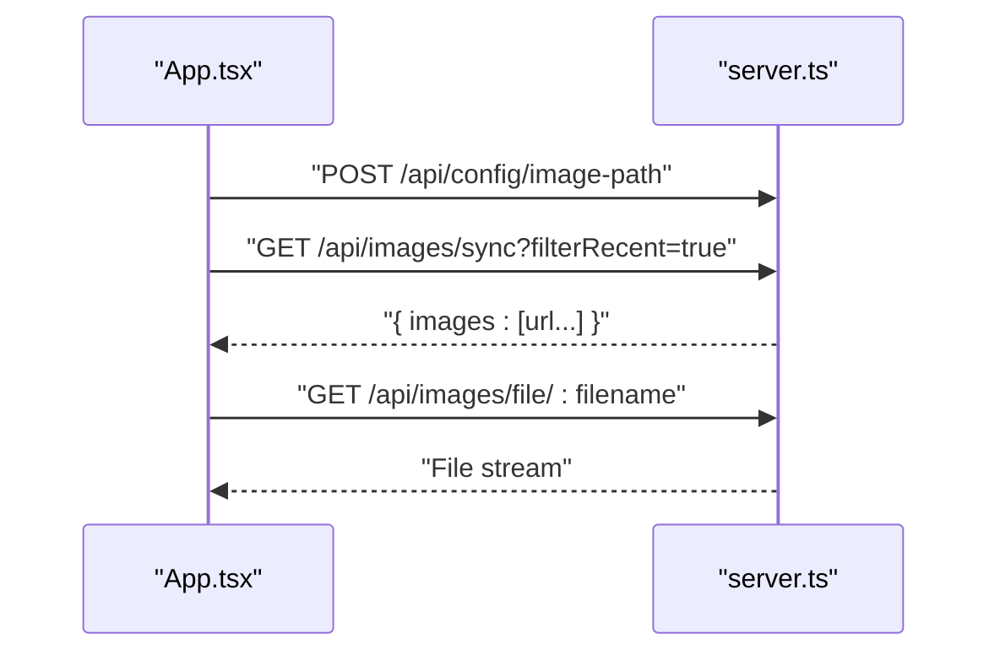
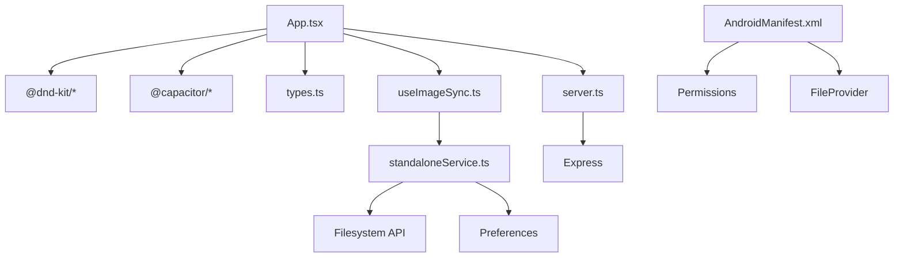

# Image Gallery Management

<cite>
**Referenced Files in This Document**
- [App.tsx](file://src/App.tsx)
- [PostConstructor.tsx](file://src/components/PostConstructor.tsx)
- [useImageSync.ts](file://src/hooks/useImageSync.ts)
- [standaloneService.ts](file://src/services/standaloneService.ts)
- [nativeStorage.ts](file://src/services/nativeStorage.ts)
- [storageWrapper.ts](file://src/services/storageWrapper.ts)
- [server.ts](file://server.ts)
- [AndroidManifest.xml](file://android/app/src/main/AndroidManifest.xml)
- [file_paths.xml](file://android/app/src/main/res/xml/file_paths.xml)
- [capacitor.config.ts](file://capacitor.config.ts)
- [types.ts](file://src/types.ts)
</cite>

## Table of Contents
1. [Introduction](#introduction)
2. [Project Structure](#project-structure)
3. [Core Components](#core-components)
4. [Architecture Overview](#architecture-overview)
5. [Detailed Component Analysis](#detailed-component-analysis)
6. [Dependency Analysis](#dependency-analysis)
7. [Performance Considerations](#performance-considerations)
8. [Troubleshooting Guide](#troubleshooting-guide)
9. [Conclusion](#conclusion)

## Introduction
This document describes the image gallery management system, focusing on local image synchronization, directory browsing, drag-and-drop reordering, selection mechanisms, browser integration, cross-platform file access, Capacitor filesystem integration, and standalone storage. It also covers configuration options, permission handling, error recovery strategies, and performance optimization for large image collections.

## Project Structure
The image gallery feature spans the frontend React application, Capacitor plugins, Android platform configuration, and the backend server:
- Frontend: React components orchestrate image selection, drag-and-drop reordering, and synchronization actions.
- Capacitor: Provides filesystem APIs for native platforms and HTTP for network calls.
- Android: Declares permissions and file provider paths for external storage access.
- Backend server: Serves image lists, serves image files, and exposes directory browsing.

**Diagram sources**
- [App.tsx:401-522](file://src/App.tsx#L401-L522)
- [PostConstructor.tsx:198-222](file://src/components/PostConstructor.tsx#L198-L222)
- [useImageSync.ts:1-42](file://src/hooks/useImageSync.ts#L1-L42)
- [standaloneService.ts:1-175](file://src/services/standaloneService.ts#L1-L175)
- [nativeStorage.ts:1-63](file://src/services/nativeStorage.ts#L1-L63)
- [storageWrapper.ts:1-100](file://src/services/storageWrapper.ts#L1-L100)
- [AndroidManifest.xml:39-45](file://android/app/src/main/AndroidManifest.xml#L39-L45)
- [file_paths.xml:1-5](file://android/app/src/main/res/xml/file_paths.xml#L1-L5)
- [server.ts:1098-1144](file://server.ts#L1098-L1144)

**Section sources**
- [App.tsx:401-522](file://src/App.tsx#L401-L522)
- [PostConstructor.tsx:198-222](file://src/components/PostConstructor.tsx#L198-L222)
- [useImageSync.ts:1-42](file://src/hooks/useImageSync.ts#L1-L42)
- [standaloneService.ts:1-175](file://src/services/standaloneService.ts#L1-L175)
- [nativeStorage.ts:1-63](file://src/services/nativeStorage.ts#L1-L63)
- [storageWrapper.ts:1-100](file://src/services/storageWrapper.ts#L1-L100)
- [AndroidManifest.xml:39-45](file://android/app/src/main/AndroidManifest.xml#L39-L45)
- [file_paths.xml:1-5](file://android/app/src/main/res/xml/file_paths.xml#L1-L5)
- [server.ts:1098-1144](file://server.ts#L1098-L1144)

## Core Components
- Local image synchronization and path management:
  - Path persistence and retrieval via preferences for standalone mode.
  - Directory scanning on external storage with permission checks.
  - Filtering and URI conversion for display.
- Directory browser:
  - Server endpoint to list directories with parent navigation.
  - Frontend modal to select a directory and trigger synchronization.
- Drag-and-drop reordering:
  - DnD Kit integration for reordering selected images.
  - Selection toggling and main image assignment.
- Cross-platform storage:
  - Capacitor filesystem for native and localStorage fallback for web.
  - Standalone storage initialization and JSON/text file helpers.
- Browser integration:
  - Universal fetch wrapper with URL validation.
  - Server endpoints to serve images and list directories.

**Section sources**
- [useImageSync.ts:5-41](file://src/hooks/useImageSync.ts#L5-L41)
- [App.tsx:401-522](file://src/App.tsx#L401-L522)
- [App.tsx:1077-1092](file://src/App.tsx#L1077-L1092)
- [App.tsx:1756-1784](file://src/App.tsx#L1756-L1784)
- [PostConstructor.tsx:198-222](file://src/components/PostConstructor.tsx#L198-L222)
- [standaloneService.ts:11-72](file://src/services/standaloneService.ts#L11-L72)
- [nativeStorage.ts:8-63](file://src/services/nativeStorage.ts#L8-L63)
- [storageWrapper.ts:9-99](file://src/services/storageWrapper.ts#L9-L99)
- [server.ts:1098-1144](file://server.ts#L1098-L1144)
- [server.ts:1341-1367](file://server.ts#L1341-L1367)

## Architecture Overview
The system supports two modes:
- Standalone mode (native): Uses Capacitor Filesystem to scan external storage, applies filters, converts URIs, and stores selected images locally.
- Server mode (web): Sends requests to backend endpoints to configure image path, synchronize recent images, and serve image files.

**Diagram sources**
- [App.tsx:1077-1092](file://src/App.tsx#L1077-L1092)
- [App.tsx:1756-1784](file://src/App.tsx#L1756-L1784)
- [server.ts:1341-1367](file://server.ts#L1341-L1367)
- [useImageSync.ts:12-27](file://src/hooks/useImageSync.ts#L12-L27)

**Section sources**
- [App.tsx:401-522](file://src/App.tsx#L401-L522)
- [server.ts:1098-1144](file://server.ts#L1098-L1144)

## Detailed Component Analysis

### Local Image Synchronization
- Permission handling:
  - On native platforms, checks and requests public storage permissions before scanning.
- Path normalization:
  - Removes device-specific prefixes to maintain portable paths.
- Directory scanning:
  - Reads directory entries, filters image extensions, and converts URIs to web-accessible URLs.
- Selection and ordering:
  - Maintains a list of selected images and sets a main image if none is set.
- Persistence:
  - Saves the chosen path to preferences for reuse.

**Diagram sources**
- [App.tsx:401-522](file://src/App.tsx#L401-L522)

**Section sources**
- [App.tsx:401-522](file://src/App.tsx#L401-L522)

### Directory Browser and Path Management
- Frontend modal:
  - Calls server endpoint to list directories and renders clickable entries with a “Choose” action.
  - Supports navigating up to parent directory.
- Backend endpoint:
  - Validates path, blocks sensitive directories, and returns directory listings.

**Diagram sources**
- [App.tsx:1077-1092](file://src/App.tsx#L1077-L1092)
- [App.tsx:1756-1784](file://src/App.tsx#L1756-L1784)
- [server.ts:1341-1367](file://server.ts#L1341-L1367)

**Section sources**
- [App.tsx:1077-1092](file://src/App.tsx#L1077-L1092)
- [App.tsx:1756-1784](file://src/App.tsx#L1756-L1784)
- [server.ts:1341-1367](file://server.ts#L1341-L1367)

### Drag-and-Drop Reordering and Selection
- DnD Kit integration:
  - Wraps the image grid with DndContext and SortableContext.
  - Uses pointer and keyboard sensors for mouse and keyboard interactions.
- Sorting logic:
  - Updates internal order when drag ends.
- Selection and main image:
  - Click-to-select toggles inclusion in selected images.
  - Assigning a main image highlights it distinctly.

**Diagram sources**
- [PostConstructor.tsx:198-222](file://src/components/PostConstructor.tsx#L198-L222)

**Section sources**
- [PostConstructor.tsx:198-222](file://src/components/PostConstructor.tsx#L198-L222)

### Cross-Platform File Access and Storage
- Capacitor filesystem:
  - Standalone service initializes a documents directory and reads/writes JSON and text files.
  - Native storage ensures a data directory and persists small configuration files.
- Web fallback:
  - Uses localStorage when not on a native platform.
- File provider:
  - Android declares FileProvider paths for external storage access.

**Diagram sources**
- [standaloneService.ts:11-72](file://src/services/standaloneService.ts#L11-L72)
- [nativeStorage.ts:8-63](file://src/services/nativeStorage.ts#L8-L63)
- [AndroidManifest.xml:28-36](file://android/app/src/main/AndroidManifest.xml#L28-L36)
- [file_paths.xml:2-4](file://android/app/src/main/res/xml/file_paths.xml#L2-L4)

**Section sources**
- [standaloneService.ts:11-72](file://src/services/standaloneService.ts#L11-L72)
- [nativeStorage.ts:8-63](file://src/services/nativeStorage.ts#L8-L63)
- [AndroidManifest.xml:28-36](file://android/app/src/main/AndroidManifest.xml#L28-L36)
- [file_paths.xml:2-4](file://android/app/src/main/res/xml/file_paths.xml#L2-L4)

### Server-Side Image Serving and Sync
- Configure image path:
  - POST endpoint saves the configured path to persistent storage.
- List recent images:
  - Scans the configured directory, filters images under a size threshold, sorts by modification time, and returns a limited list of URLs.
- Serve images:
  - Serves files from the configured directory with path traversal protection.
- Directory listing:
  - Lists directories with parent navigation and blocks sensitive paths.

**Diagram sources**
- [server.ts:1087-1123](file://server.ts#L1087-L1123)
- [server.ts:1125-1144](file://server.ts#L1125-L1144)
- [server.ts:1341-1367](file://server.ts#L1341-L1367)

**Section sources**
- [server.ts:1087-1123](file://server.ts#L1087-L1123)
- [server.ts:1125-1144](file://server.ts#L1125-L1144)
- [server.ts:1341-1367](file://server.ts#L1341-L1367)

## Dependency Analysis
- Frontend depends on:
  - Capacitor Filesystem and Preferences for native access.
  - DnD Kit for drag-and-drop reordering.
  - Universal fetch wrapper for robust HTTP calls.
- Backend depends on:
  - Express routes for configuration, image serving, and directory listing.
- Android platform:
  - Permissions and FileProvider configuration enable external storage access.

**Diagram sources**
- [App.tsx:401-522](file://src/App.tsx#L401-L522)
- [PostConstructor.tsx:198-222](file://src/components/PostConstructor.tsx#L198-L222)
- [useImageSync.ts:1-42](file://src/hooks/useImageSync.ts#L1-L42)
- [standaloneService.ts:1-10](file://src/services/standaloneService.ts#L1-L10)
- [types.ts:1-48](file://src/types.ts#L1-L48)
- [server.ts:1098-1144](file://server.ts#L1098-L1144)
- [AndroidManifest.xml:39-45](file://android/app/src/main/AndroidManifest.xml#L39-L45)

**Section sources**
- [App.tsx:401-522](file://src/App.tsx#L401-L522)
- [PostConstructor.tsx:198-222](file://src/components/PostConstructor.tsx#L198-L222)
- [useImageSync.ts:1-42](file://src/hooks/useImageSync.ts#L1-L42)
- [standaloneService.ts:1-10](file://src/services/standaloneService.ts#L1-L10)
- [types.ts:1-48](file://src/types.ts#L1-L48)
- [server.ts:1098-1144](file://server.ts#L1098-L1144)
- [AndroidManifest.xml:39-45](file://android/app/src/main/AndroidManifest.xml#L39-L45)

## Performance Considerations
- Limit image count and size:
  - Server limits returned images and filters by size to reduce payload.
- Efficient filtering:
  - Frontend filters by extension and limits to a recent subset.
- URI conversion:
  - Converts file URIs to web-accessible URLs only when needed.
- Debounce or batch updates:
  - Avoid frequent re-renders by batching selection and ordering updates.
- Caching:
  - Persist selected images and path to minimize repeated scans.

[No sources needed since this section provides general guidance]

## Troubleshooting Guide
- Permission denied when scanning:
  - Ensure public storage permission is granted; request permissions before scanning.
- Path not found or inaccessible:
  - Verify the path is relative to external storage root; normalize paths by removing device prefixes.
- Empty gallery after sync:
  - Confirm the directory contains supported image files and is readable.
- CORS or network errors:
  - Use the universal fetch wrapper to validate URLs and handle malformed inputs.
- Android storage access:
  - Confirm FileProvider paths and permissions are declared in the manifest.
- Large image collections:
  - Reduce directory size or filter by date; server enforces size thresholds and limits.

**Section sources**
- [App.tsx:401-522](file://src/App.tsx#L401-L522)
- [server.ts:1107-1122](file://server.ts#L1107-L1122)
- [AndroidManifest.xml:39-45](file://android/app/src/main/AndroidManifest.xml#L39-L45)
- [file_paths.xml:2-4](file://android/app/src/main/res/xml/file_paths.xml#L2-L4)

## Conclusion
The image gallery management system integrates Capacitor’s filesystem APIs with a React-based UI and an Express backend to support both standalone and server modes. It provides robust directory browsing, permission-aware scanning, drag-and-drop reordering, and cross-platform storage. By following the configuration and troubleshooting guidance, teams can reliably manage large image collections across devices.