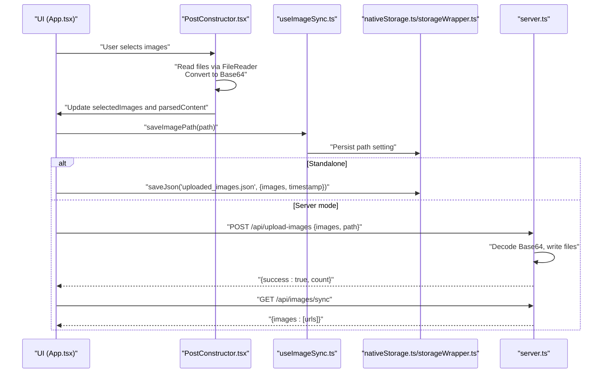
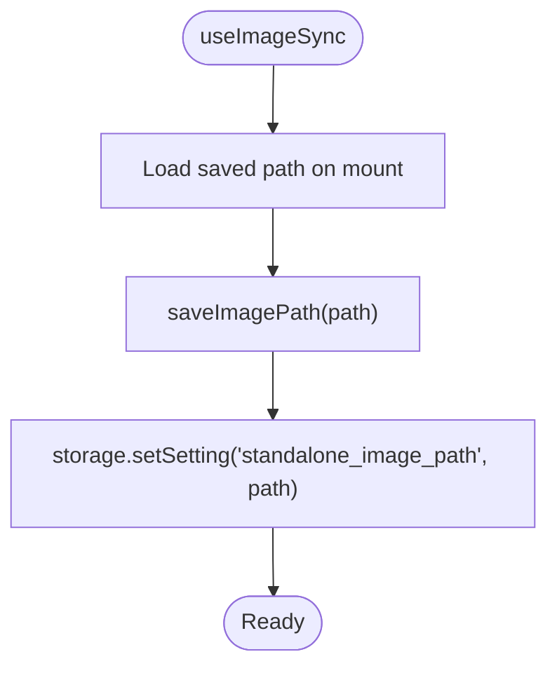
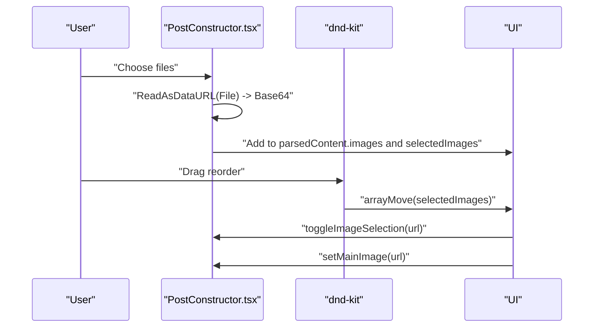
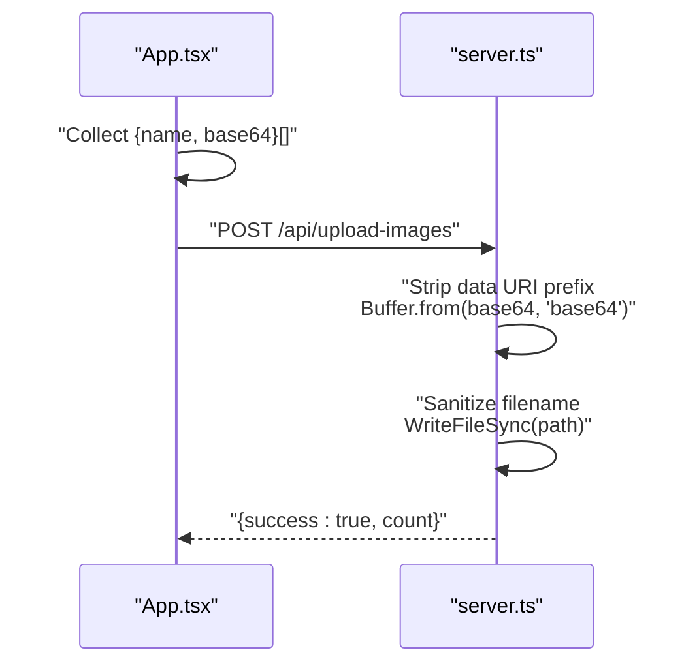
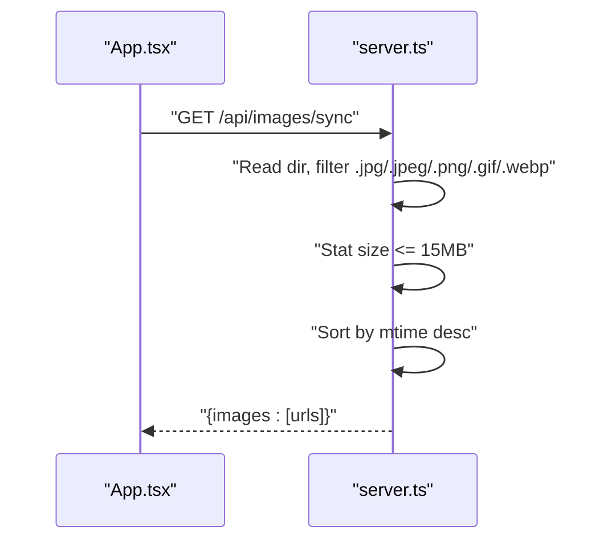
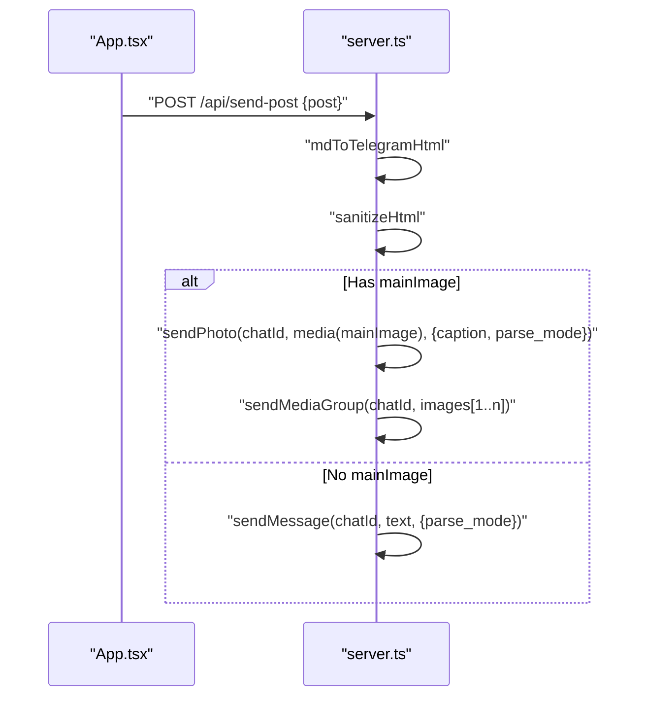
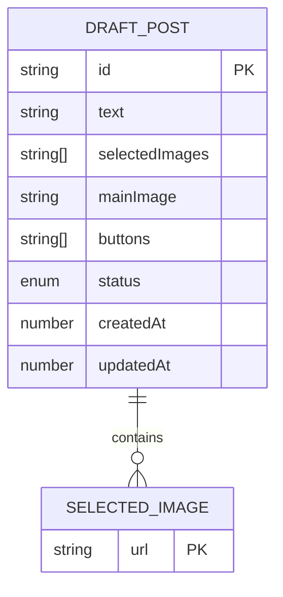
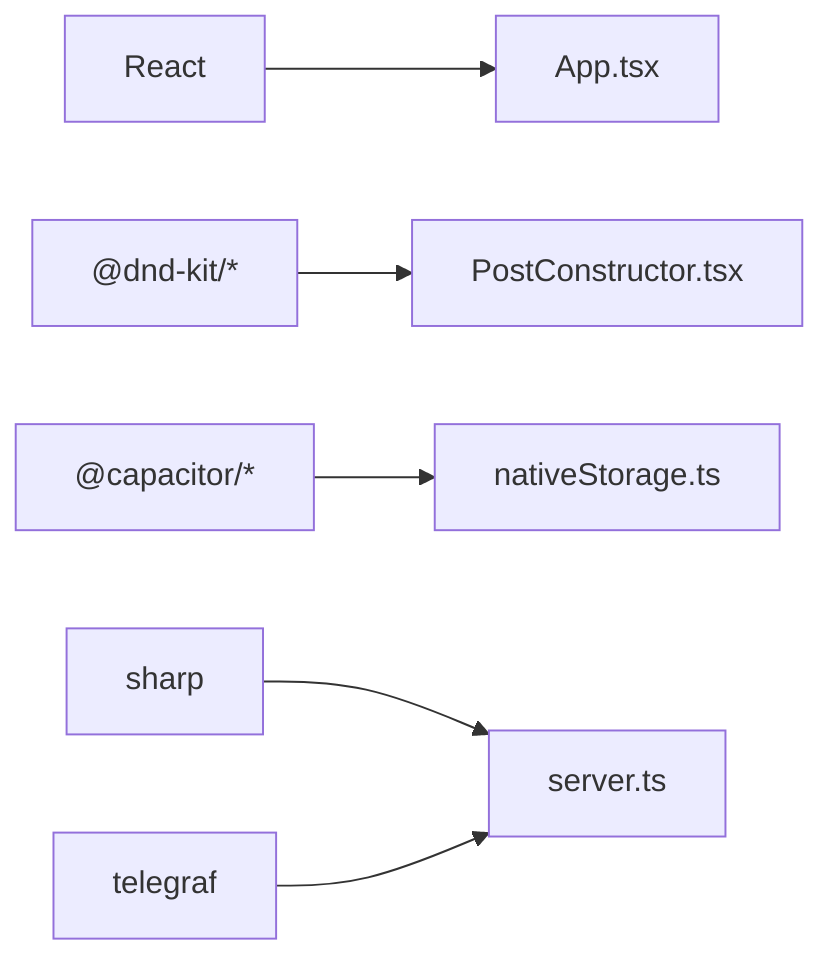

# Image Management System

<cite>
**Referenced Files in This Document**
- [src/hooks/useImageSync.ts](file://src/hooks/useImageSync.ts)
- [src/services/nativeStorage.ts](file://src/services/nativeStorage.ts)
- [src/services/storageWrapper.ts](file://src/services/storageWrapper.ts)
- [src/App.tsx](file://src/App.tsx)
- [src/components/PostConstructor.tsx](file://src/components/PostConstructor.tsx)
- [src/types.ts](file://src/types.ts)
- [server.ts](file://server.ts)
- [package.json](file://package.json)
</cite>

## Table of Contents
1. [Introduction](#introduction)
2. [Project Structure](#project-structure)
3. [Core Components](#core-components)
4. [Architecture Overview](#architecture-overview)
5. [Detailed Component Analysis](#detailed-component-analysis)
6. [Dependency Analysis](#dependency-analysis)
7. [Performance Considerations](#performance-considerations)
8. [Troubleshooting Guide](#troubleshooting-guide)
9. [Conclusion](#conclusion)

## Introduction
This document describes the image management system that powers local image synchronization, drag-and-drop reordering, and image selection mechanisms. It also explains the image processing pipeline including Base64 encoding, validation, size optimization considerations, and cross-platform compatibility handling. Finally, it covers integration with Telegram's media upload capabilities and the gallery display system, along with data models, storage strategies, and performance considerations for large image collections.

## Project Structure
The image management system spans client-side React components, shared hooks, and a Node.js server backend. Key areas include:
- Client-side image selection and ordering via drag-and-drop
- Local storage and platform abstraction for file operations
- Server-side Base64 decoding, file persistence, and Telegram media uploads
- Gallery display and selection mechanisms

```mermaid
graph TB
subgraph "Client"
App["App.tsx"]
PostConstructor["PostConstructor.tsx"]
Hooks["useImageSync.ts"]
Storage["nativeStorage.ts / storageWrapper.ts"]
Types["types.ts"]
end
subgraph "Server"
Server["server.ts"]
end
App --> PostConstructor
App --> Hooks
App --> Storage
App --> Types
App --> Server
PostConstructor --> Server
Hooks --> Storage
Storage --> Server
```

**Diagram sources**
- [src/App.tsx:168-182](file://src/App.tsx#L168-L182)
- [src/components/PostConstructor.tsx:96-110](file://src/components/PostConstructor.tsx#L96-L110)
- [src/hooks/useImageSync.ts:5-41](file://src/hooks/useImageSync.ts#L5-L41)
- [src/services/nativeStorage.ts:8-62](file://src/services/nativeStorage.ts#L8-L62)
- [src/services/storageWrapper.ts:9-99](file://src/services/storageWrapper.ts#L9-L99)
- [src/types.ts:7-26](file://src/types.ts#L7-L26)
- [server.ts:954-973](file://server.ts#L954-L973)

**Section sources**
- [src/App.tsx:168-182](file://src/App.tsx#L168-L182)
- [src/components/PostConstructor.tsx:96-110](file://src/components/PostConstructor.tsx#L96-L110)
- [src/hooks/useImageSync.ts:5-41](file://src/hooks/useImageSync.ts#L5-L41)
- [src/services/nativeStorage.ts:8-62](file://src/services/nativeStorage.ts#L8-L62)
- [src/services/storageWrapper.ts:9-99](file://src/services/storageWrapper.ts#L9-L99)
- [src/types.ts:7-26](file://src/types.ts#L7-L26)
- [server.ts:954-973](file://server.ts#L954-L973)

## Core Components
- Image selection and drag-and-drop reordering: Implemented with dnd-kit in the Post Constructor component, enabling reordering of selected images and setting a main image.
- Local image synchronization hook: Provides persistent storage of the image path and actions for saving/loading the path.
- Storage abstractions: Cross-platform file operations for JSON and text files, supporting both native and web environments.
- Server-side image upload and gallery sync: Handles Base64 decoding, filename sanitization, and serving images via a controlled endpoint.
- Telegram integration: Converts posts to HTML, sanitizes content, and sends media groups/photos to Telegram with rate limits and chunking.

**Section sources**
- [src/components/PostConstructor.tsx:207-212](file://src/components/PostConstructor.tsx#L207-L212)
- [src/hooks/useImageSync.ts:5-41](file://src/hooks/useImageSync.ts#L5-L41)
- [src/services/nativeStorage.ts:8-62](file://src/services/nativeStorage.ts#L8-L62)
- [src/services/storageWrapper.ts:9-99](file://src/services/storageWrapper.ts#L9-L99)
- [server.ts:954-973](file://server.ts#L954-L973)
- [server.ts:834-921](file://server.ts#L834-L921)

## Architecture Overview
The system supports two primary workflows:
- Standalone mode: Images are stored locally and optionally synced to a configured path.
- Server mode: Images are uploaded to the server, persisted, and served back to the UI for gallery browsing.



**Diagram sources**
- [src/App.tsx:1094-1170](file://src/App.tsx#L1094-L1170)
- [src/components/PostConstructor.tsx:214-226](file://src/components/PostConstructor.tsx#L214-L226)
- [src/hooks/useImageSync.ts:22-27](file://src/hooks/useImageSync.ts#L22-L27)
- [src/services/nativeStorage.ts:34-46](file://src/services/nativeStorage.ts#L34-L46)
- [src/services/storageWrapper.ts:35-54](file://src/services/storageWrapper.ts#L35-L54)
- [server.ts:954-973](file://server.ts#L954-L973)
- [server.ts:1098-1123](file://server.ts#L1098-L1123)

## Detailed Component Analysis

### Local Image Synchronization Hook
The hook manages the persistent image path and exposes helpers to save/load it. It integrates with platform-specific storage when in standalone mode.



**Diagram sources**
- [src/hooks/useImageSync.ts:12-27](file://src/hooks/useImageSync.ts#L12-L27)

**Section sources**
- [src/hooks/useImageSync.ts:5-41](file://src/hooks/useImageSync.ts#L5-L41)

### Image Selection and Drag-and-Drop Reordering
The Post Constructor component provides:
- File input to select multiple images
- FileReader to convert files to Base64
- dnd-kit sortable context for reordering selected images
- Gallery preview of available images not yet selected



**Diagram sources**
- [src/components/PostConstructor.tsx:207-212](file://src/components/PostConstructor.tsx#L207-L212)
- [src/components/PostConstructor.tsx:214-226](file://src/components/PostConstructor.tsx#L214-L226)

**Section sources**
- [src/components/PostConstructor.tsx:207-244](file://src/components/PostConstructor.tsx#L207-L244)

### Image Upload Pipeline (Client → Server)
The client reads selected images, converts them to Base64, and uploads them to the server. The server decodes Base64, writes files safely, and responds with counts.



**Diagram sources**
- [src/App.tsx:1094-1170](file://src/App.tsx#L1094-L1170)
- [server.ts:954-973](file://server.ts#L954-L973)

**Section sources**
- [src/App.tsx:1094-1170](file://src/App.tsx#L1094-L1170)
- [server.ts:954-973](file://server.ts#L954-L973)

### Gallery Sync and Serving
The server scans a configured image directory, filters valid image files, enforces size limits, sorts by modification time, and serves image URLs. The client fetches these URLs to populate the gallery.



**Diagram sources**
- [server.ts:1098-1123](file://server.ts#L1098-L1123)

**Section sources**
- [server.ts:1098-1123](file://server.ts#L1098-L1123)

### Telegram Media Upload Integration
The server converts Markdown to HTML, sanitizes it, and sends either a single photo with optional caption or a media group. It handles rate limits and chunking for multiple images.



**Diagram sources**
- [server.ts:834-921](file://server.ts#L834-L921)

**Section sources**
- [server.ts:834-921](file://server.ts#L834-L921)

### Data Models and Storage Strategies
- Selected images and main image are tracked in the UI state and persisted per draft.
- Local storage uses JSON files for small datasets (e.g., uploaded images).
- Platform abstraction ensures consistent behavior across native and web environments.



**Diagram sources**
- [src/types.ts:13-26](file://src/types.ts#L13-L26)

**Section sources**
- [src/types.ts:7-26](file://src/types.ts#L7-L26)
- [src/services/nativeStorage.ts:16-46](file://src/services/nativeStorage.ts#L16-L46)
- [src/services/storageWrapper.ts:9-54](file://src/services/storageWrapper.ts#L9-L54)

## Dependency Analysis
- Client dependencies include React, dnd-kit for drag-and-drop, and Capacitor for native features.
- Server depends on Telegraf for Telegram integration and Sharp for image processing.



**Diagram sources**
- [package.json:19-55](file://package.json#L19-L55)
- [server.ts:834-921](file://server.ts#L834-L921)

**Section sources**
- [package.json:19-55](file://package.json#L19-L55)
- [server.ts:834-921](file://server.ts#L834-L921)

## Performance Considerations
- Base64 conversion increases payload size by approximately 33%; consider streaming or binary uploads for very large images.
- Limit concurrent uploads and chunk media groups to respect Telegram rate limits.
- Enforce file size checks on the server to prevent oversized uploads.
- Cache frequently accessed gallery images and invalidate on change.
- On mobile devices, prefer lazy loading and virtualized grids for large galleries.

## Troubleshooting Guide
- Base64 decoding errors: Verify the data URI prefix is stripped before decoding.
- Path traversal attacks: Ensure filenames are sanitized and resolved paths stay within the configured directory.
- File size limits: Images exceeding the configured threshold are skipped during gallery sync.
- Telegram rate limits: Implement retry logic and respect delays between media group chunks.
- Local storage failures: Fallback to in-memory state and notify users to enable permissions.

**Section sources**
- [server.ts:954-973](file://server.ts#L954-L973)
- [server.ts:1098-1123](file://server.ts#L1098-L1123)
- [server.ts:834-921](file://server.ts#L834-L921)

## Conclusion
The image management system combines robust client-side selection and ordering with reliable server-side processing and Telegram integration. By leveraging Base64 encoding, strict validation, and platform-aware storage, it provides a seamless experience across environments. Following the performance and troubleshooting recommendations will help maintain responsiveness and reliability, especially with large image collections.