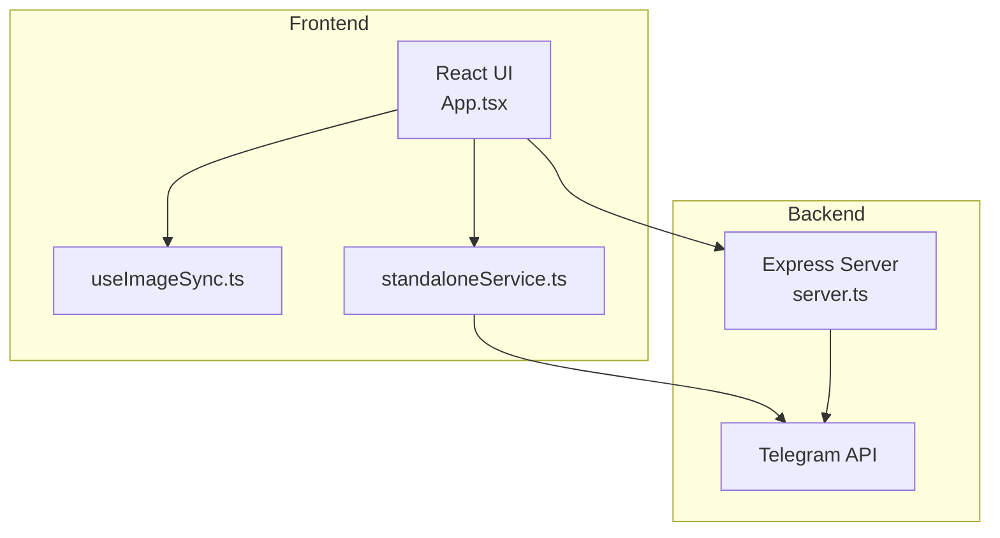
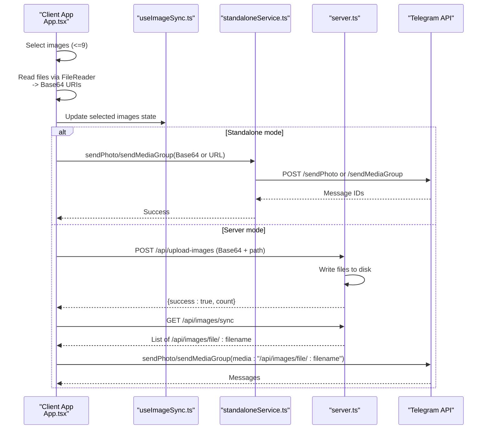
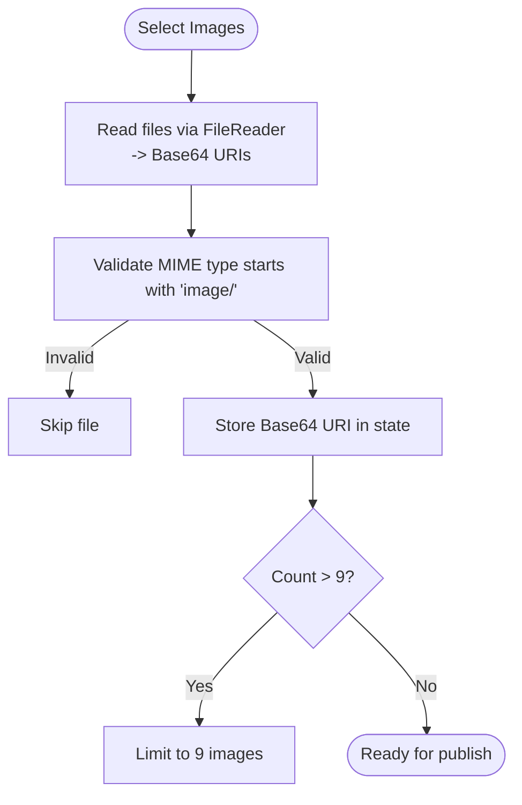
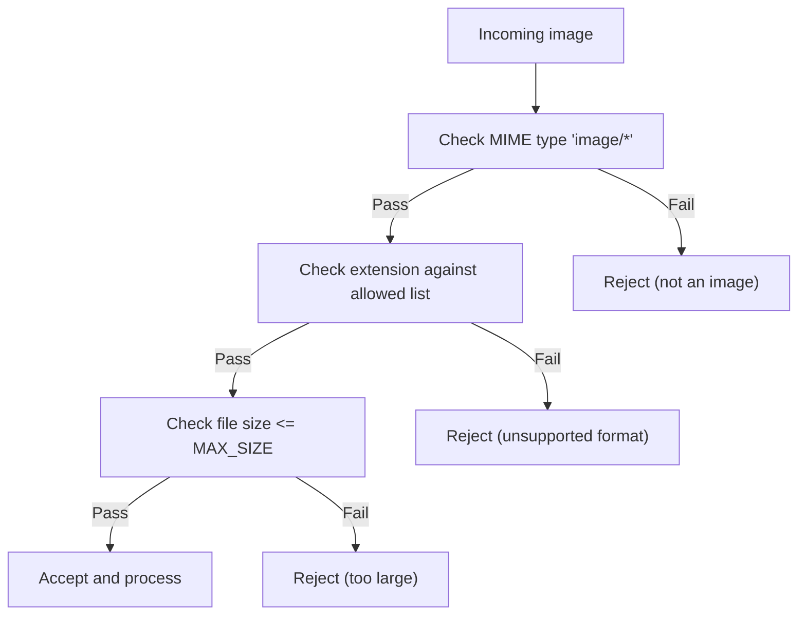
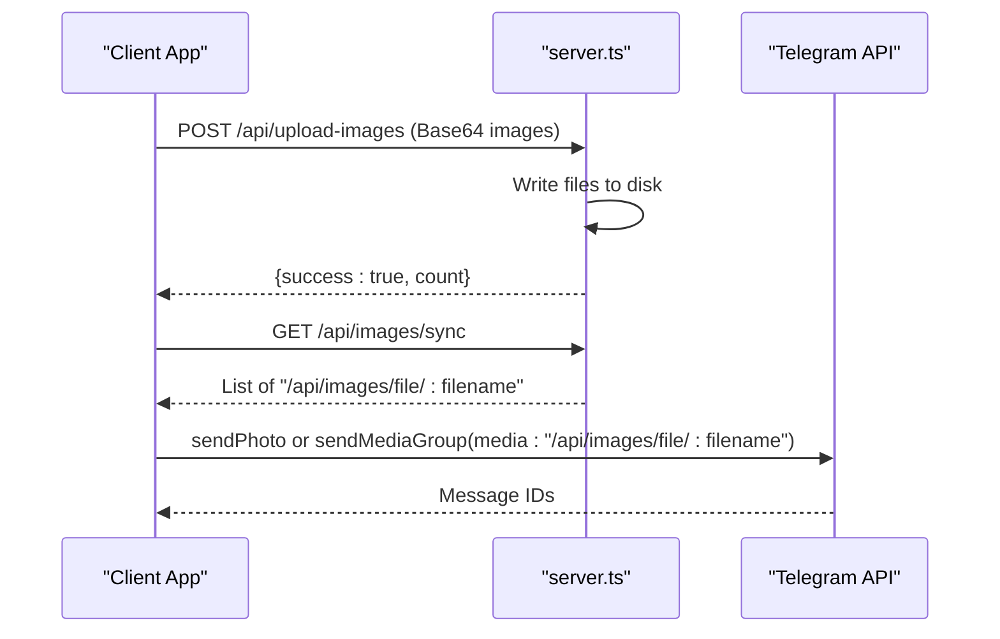
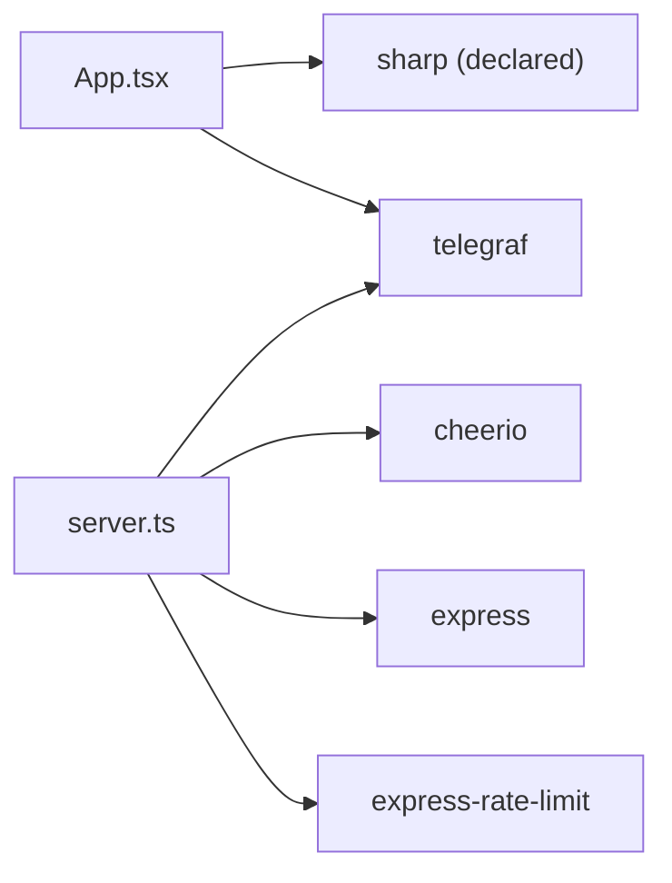

# Image Processing Pipeline

<cite>
**Referenced Files in This Document**
- [server.ts](file://server.ts)
- [App.tsx](file://src/App.tsx)
- [useImageSync.ts](file://src/hooks/useImageSync.ts)
- [standaloneService.ts](file://src/services/standaloneService.ts)
- [package.json](file://package.json)
</cite>

## Table of Contents
1. [Introduction](#introduction)
2. [Project Structure](#project-structure)
3. [Core Components](#core-components)
4. [Architecture Overview](#architecture-overview)
5. [Detailed Component Analysis](#detailed-component-analysis)
6. [Dependency Analysis](#dependency-analysis)
7. [Performance Considerations](#performance-considerations)
8. [Troubleshooting Guide](#troubleshooting-guide)
9. [Conclusion](#conclusion)

## Introduction
This document describes the image processing pipeline used by the application to encode, validate, optimize, and upload images for Telegram posts. It covers:
- Base64 encoding implementation for client-side image ingestion
- Image validation and size filtering
- Cross-platform compatibility handling for different image formats and resolutions
- Integration with Telegram's media upload capabilities including file size limits and supported formats
- Data models, transformation workflows, and caching mechanisms
- Performance considerations for mobile environments, memory management for large images, and error handling for corrupted or unsupported formats
- Optimization techniques for reducing image sizes while maintaining quality

## Project Structure
The image processing pipeline spans both the frontend and backend:
- Frontend (React + Capacitor): Reads local images, converts them to Base64, validates formats, and uploads to the backend or publishes directly in standalone mode
- Backend (Node.js + Express): Receives Base64 images, writes them to disk, serves them via API, and integrates with Telegram for media uploads

**Diagram sources**
- [App.tsx:1094-1184](file://src/App.tsx#L1094-L1184)
- [useImageSync.ts:1-42](file://src/hooks/useImageSync.ts#L1-L42)
- [standaloneService.ts:75-146](file://src/services/standaloneService.ts#L75-L146)
- [server.ts:834-921](file://server.ts#L834-L921)

**Section sources**
- [App.tsx:1094-1184](file://src/App.tsx#L1094-L1184)
- [server.ts:834-921](file://server.ts#L834-L921)

## Core Components
- Base64 encoding and ingestion:
  - Client reads files via FileReader and produces Base64 URIs
  - Supports multiple image formats (jpg, jpeg, png, gif, webp)
  - Limits selection to 9 images per post
- Validation and sanitization:
  - Validates MIME type starts with "image/"
  - Filters out non-image files
  - Sanitizes filenames and prevents path traversal
- Upload and persistence:
  - Sends Base64 images to backend endpoint
  - Writes images to a configurable persistent directory
  - Serves images via "/api/images/file/:filename"
- Telegram integration:
  - Accepts Base64 URIs or file URLs for media
  - Uses sendPhoto/sendMediaGroup with HTML captions
  - Respects Telegram character limits (1024 for posts with images, 4096 otherwise)

**Section sources**
- [App.tsx:1094-1184](file://src/App.tsx#L1094-L1184)
- [server.ts:954-973](file://server.ts#L954-L973)
- [server.ts:1125-1144](file://server.ts#L1125-L1144)
- [server.ts:834-921](file://server.ts#L834-L921)

## Architecture Overview
The pipeline follows a client-first ingestion model with optional backend persistence and Telegram integration.

**Diagram sources**
- [App.tsx:1094-1184](file://src/App.tsx#L1094-L1184)
- [standaloneService.ts:117-141](file://src/services/standaloneService.ts#L117-L141)
- [server.ts:954-973](file://server.ts#L954-L973)
- [server.ts:1107-1122](file://server.ts#L1107-L1122)
- [server.ts:834-921](file://server.ts#L834-L921)

## Detailed Component Analysis

### Base64 Encoding Implementation
- FileReader.readAsDataURL produces "data:image/*;base64,..." strings
- Client-side conversion avoids server bandwidth and enables offline previews
- Selected images are stored as Base64 URIs and rendered immediately

**Diagram sources**
- [App.tsx:1094-1184](file://src/App.tsx#L1094-L1184)

**Section sources**
- [App.tsx:1094-1184](file://src/App.tsx#L1094-L1184)

### Image Validation and Size Filtering
- MIME validation: Only files whose type starts with "image/" are accepted
- Local filesystem scanning filters by extension (.jpg, .jpeg, .png, .gif, .webp)
- Server-side file listing enforces a maximum file size threshold and sorts by modification time
- Filename sanitization and path traversal protection on server

**Diagram sources**
- [App.tsx:401-522](file://src/App.tsx#L401-L522)
- [server.ts:1107-1122](file://server.ts#L1107-L1122)

**Section sources**
- [App.tsx:401-522](file://src/App.tsx#L401-L522)
- [server.ts:1107-1122](file://server.ts#L1107-L1122)

### Size Optimization Algorithms
- The repository declares the sharp dependency but does not implement explicit optimization logic in the analyzed files
- Current optimization relies on:
  - Client-side selection of smaller images
  - Server-side size checks and rejection of oversized files
  - Telegram-native compression for uploaded media
- Recommended improvements (conceptual):
  - Resize to target dimensions
  - Adjust quality/compression dynamically
  - Convert to WebP for better compression ratios

**Section sources**
- [package.json:51](file://package.json#L51)
- [server.ts:1112](file://server.ts#L1112)

### Cross-Platform Compatibility
- Capacitor file APIs enable filesystem access on Android
- FileReader ensures consistent Base64 generation across platforms
- Path normalization and permission checks for Android external storage
- Platform-specific HTTP client usage (CapacitorHttp vs fetch)

**Section sources**
- [App.tsx:401-522](file://src/App.tsx#L401-L522)
- [standaloneService.ts:1-72](file://src/services/standaloneService.ts#L1-L72)

### Telegram Media Upload Integration
- Supported media sources:
  - Base64 data URIs ("data:image/...;base64,...")
  - Server-side file URLs ("/api/images/file/:filename")
  - Direct URLs
- Upload methods:
  - sendPhoto for single images
  - sendMediaGroup for albums (up to 10 photos)
- Caption handling:
  - HTML parse mode enabled
  - Character limits enforced (1024 with images, 4096 without)
- Rate limiting and retries:
  - Backend uses express-rate-limit middleware
  - Telegram bot polling with health monitoring

**Diagram sources**
- [server.ts:954-973](file://server.ts#L954-L973)
- [server.ts:1107-1122](file://server.ts#L1107-L1122)
- [server.ts:834-921](file://server.ts#L834-L921)

**Section sources**
- [server.ts:834-921](file://server.ts#L834-L921)
- [server.ts:954-973](file://server.ts#L954-L973)
- [server.ts:1107-1122](file://server.ts#L1107-L1122)

### Data Models and Transformation Workflows
- Image ingestion model:
  - name: string (sanitized)
  - base64: string (data URI)
- Server-side file model:
  - url: string ("/api/images/file/:filename")
  - mtime: number (modification time)
- Publishing workflow:
  - Convert Markdown to HTML
  - Sanitize HTML for Telegram
  - Enforce character limits
  - Upload media and send messages

**Section sources**
- [server.ts:954-973](file://server.ts#L954-L973)
- [server.ts:1107-1122](file://server.ts#L1107-L1122)
- [App.tsx:905-975](file://src/App.tsx#L905-L975)

### Caching Mechanisms
- Client-side:
  - In-memory image URIs in React state
  - Local storage for standalone mode
- Server-side:
  - Filesystem cache of uploaded images
  - In-memory configuration cache (paths, chat IDs, templates)
- Streaming logs for real-time diagnostics

**Section sources**
- [App.tsx:401-522](file://src/App.tsx#L401-L522)
- [server.ts:84-91](file://server.ts#L84-L91)
- [server.ts:219-277](file://server.ts#L219-L277)

## Dependency Analysis
- External libraries:
  - sharp: declared for potential image optimization
  - telegraf: Telegram bot framework
  - cheerio: HTML sanitization
  - express-rate-limit: request throttling
- No circular dependencies observed among analyzed modules

**Diagram sources**
- [package.json:51](file://package.json#L51)
- [server.ts:1-16](file://server.ts#L1-L16)

**Section sources**
- [package.json:19-56](file://package.json#L19-L56)
- [server.ts:1-16](file://server.ts#L1-L16)

## Performance Considerations
- Mobile memory management:
  - Prefer Base64 only for small images; large images can cause memory pressure
  - Limit concurrent uploads and enforce a strict cap (9 images)
- Network efficiency:
  - Use sendMediaGroup for multiple images to reduce round trips
  - Serve images from local API to minimize external network hops
- Compression and sizing:
  - Implement server-side resizing and quality adjustment using sharp
  - Convert to WebP for reduced payload sizes
- Platform differences:
  - CapacitorHttp bypasses WebView CORS issues on Android
  - Native platform file permissions must be granted before scanning

[No sources needed since this section provides general guidance]

## Troubleshooting Guide
- Common issues and resolutions:
  - Unsupported format: Ensure files have "image/*" MIME type and allowed extensions
  - Oversized files: Reduce resolution or switch to WebP; server rejects files exceeding the configured size
  - Path traversal attempts: Server validates resolved paths against base directory
  - Telegram rate limits: Backend applies rate limiting; client should throttle requests
  - CORS on Android: Use CapacitorHttp for outbound requests
  - Permission denied: Request and verify external storage permissions before scanning
  - Corrupted images: Validate Base64 and file integrity before upload

**Section sources**
- [App.tsx:401-522](file://src/App.tsx#L401-L522)
- [server.ts:1125-1144](file://server.ts#L1125-L1144)
- [server.ts:51-72](file://server.ts#L51-L72)

## Conclusion
The pipeline provides a robust foundation for image ingestion, validation, and Telegram publishing with strong cross-platform support. While Base64 encoding and basic size checks are implemented, production-grade optimization (sharp-based resizing and compression) is recommended to improve performance and reduce payload sizes. The modular design allows incremental enhancements to meet evolving requirements for quality, speed, and reliability.