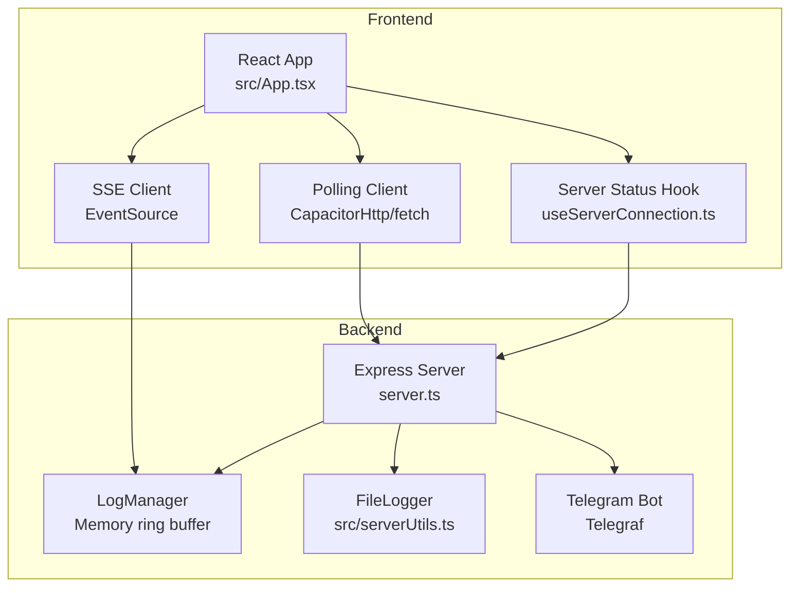
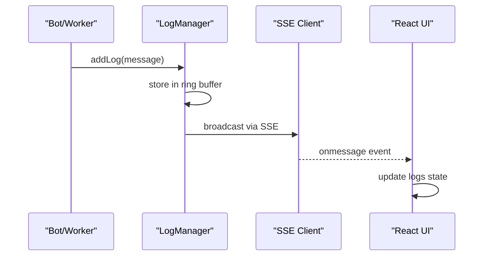
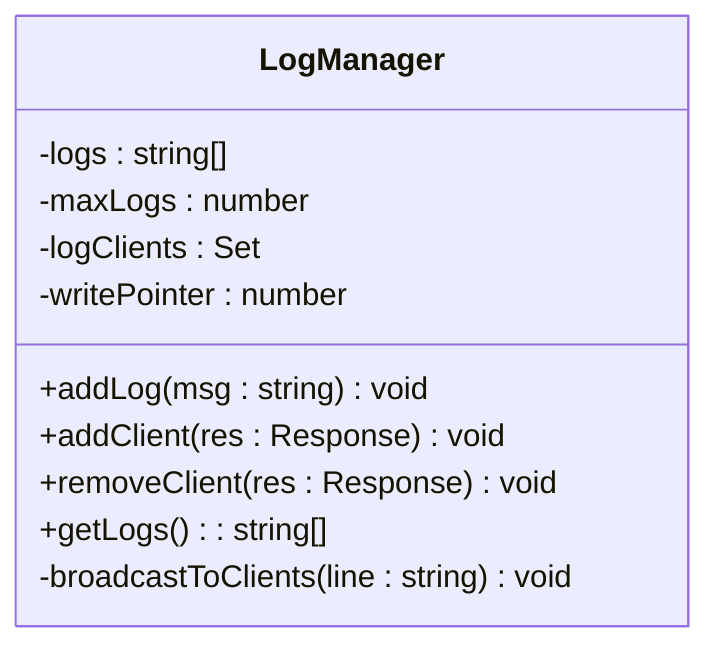
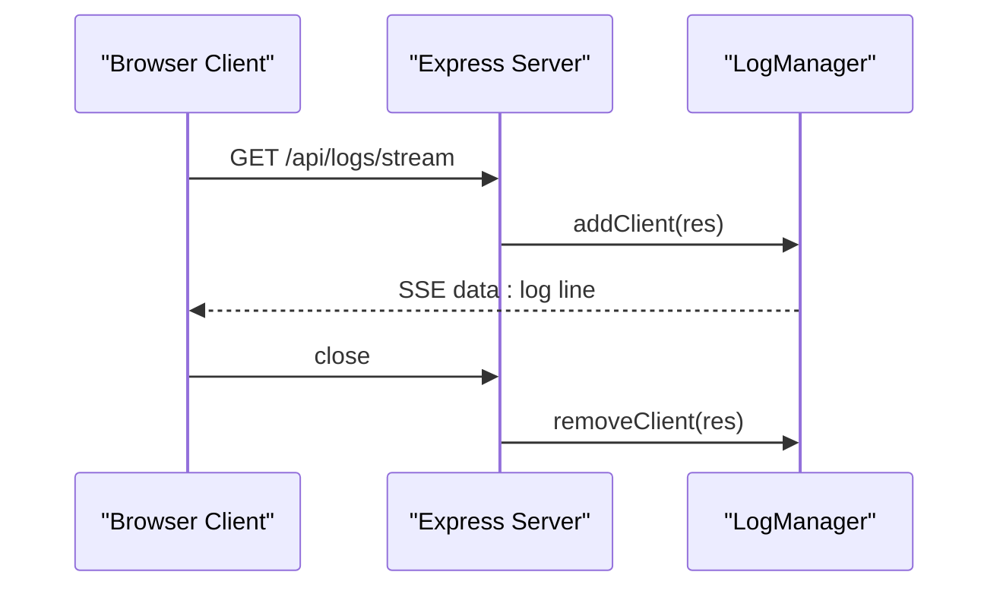
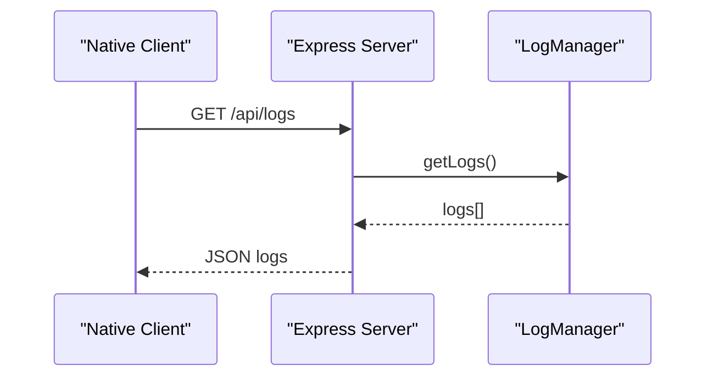
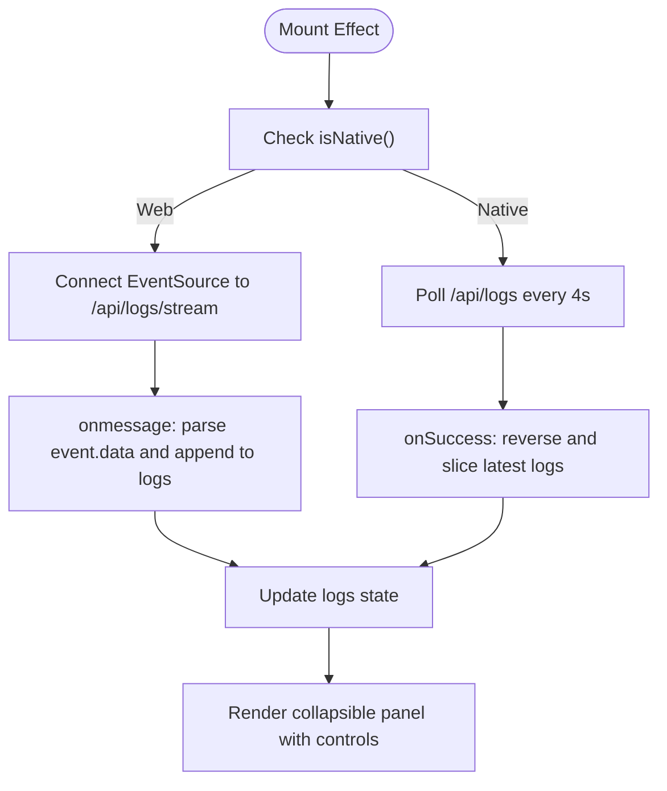
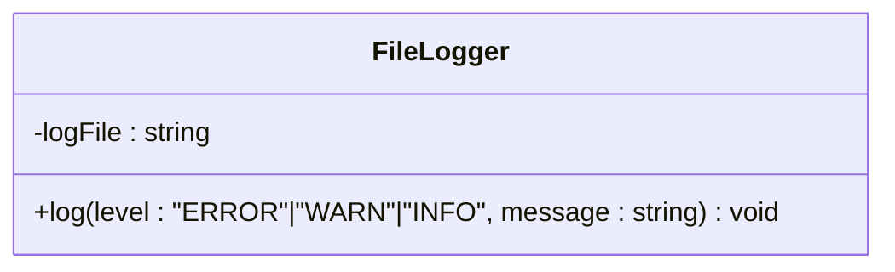
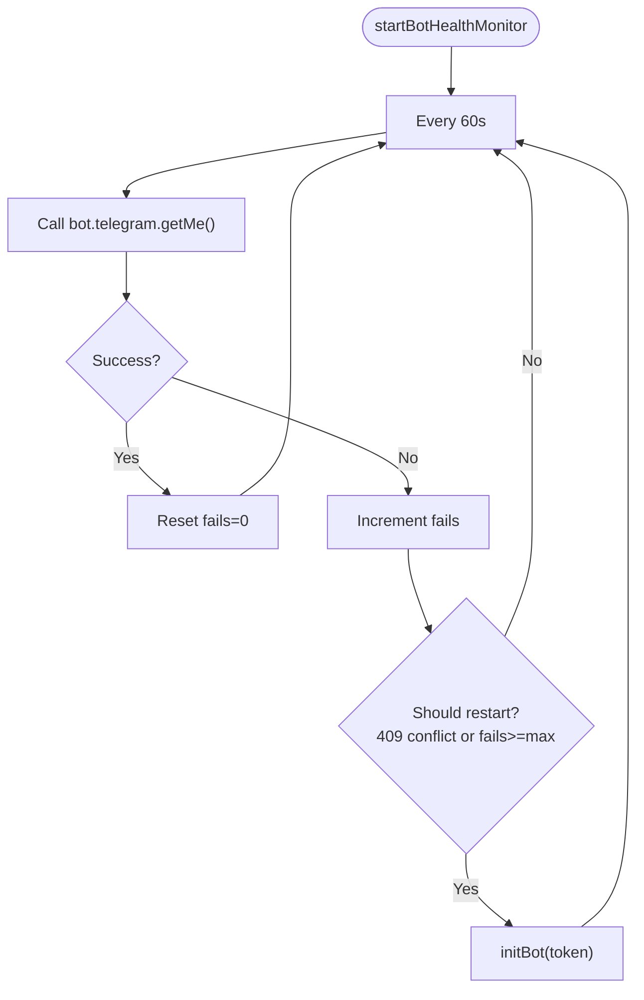
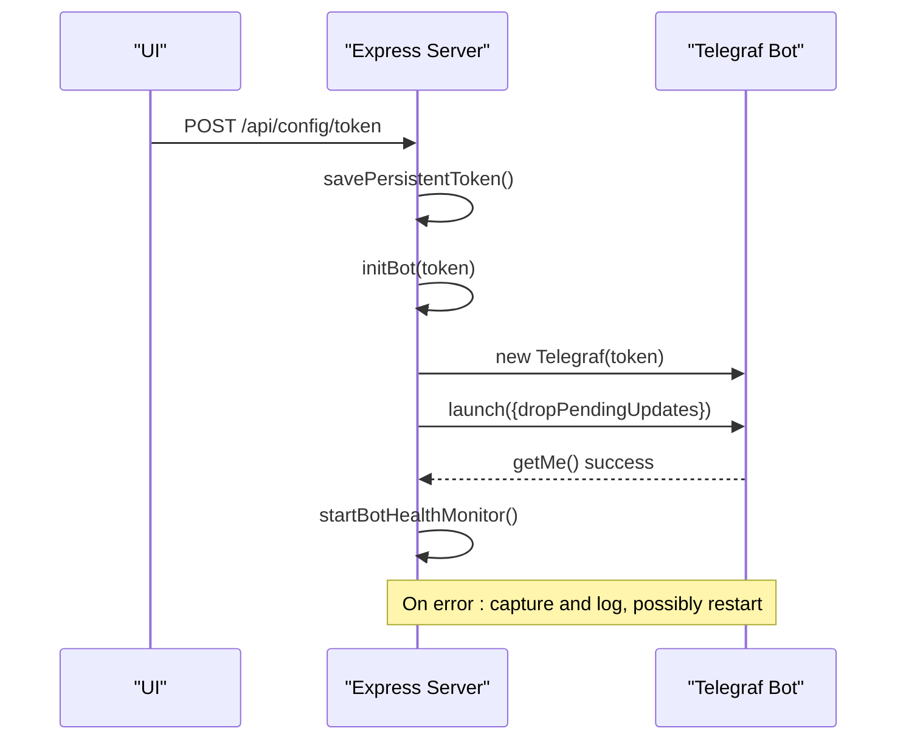
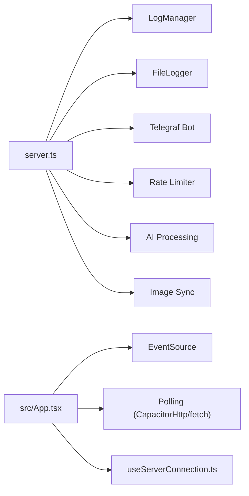

# Logging and Monitoring

<cite>
**Referenced Files in This Document**
- [server.ts](file://server.ts)
- [src/App.tsx](file://src/App.tsx)
- [src/serverUtils.ts](file://src/serverUtils.ts)
- [src/services/standaloneService.ts](file://src/services/standaloneService.ts)
- [src/hooks/useServerConnection.ts](file://src/hooks/useServerConnection.ts)
- [README.md](file://README.md)
</cite>

## Table of Contents
1. [Introduction](#introduction)
2. [Project Structure](#project-structure)
3. [Core Components](#core-components)
4. [Architecture Overview](#architecture-overview)
5. [Detailed Component Analysis](#detailed-component-analysis)
6. [Dependency Analysis](#dependency-analysis)
7. [Performance Considerations](#performance-considerations)
8. [Troubleshooting Guide](#troubleshooting-guide)
9. [Conclusion](#conclusion)
10. [Appendices](#appendices)

## Introduction
This document describes the logging and monitoring system implemented in the project. It covers real-time logging via Server-Sent Events (SSE), log streaming architecture, log display management in the UI, server health monitoring (including bot health checks, error tracking, performance metrics, and automatic recovery), log filtering and search capabilities, log persistence strategies, and log rotation policies. It also documents the monitoring dashboard functionality, alerting mechanisms, diagnostic tools, troubleshooting guides for log analysis, performance profiling techniques, and network debugging approaches, along with guidance on log retention and monitoring best practices.

## Project Structure
The logging and monitoring system spans both backend and frontend components:
- Backend server exposes SSE endpoints and manages a memory-backed log buffer.
- Frontend connects to SSE endpoints (web) or polls logs (native) and renders logs in collapsible panels with pause and clear controls.
- A file-based logger is available for persistent error tracking.
- A health monitor periodically validates bot connectivity and triggers restarts on failures.

**Diagram sources**
- [server.ts](file://server.ts)
- [src/App.tsx](file://src/App.tsx)
- [src/serverUtils.ts](file://src/serverUtils.ts)
- [src/hooks/useServerConnection.ts](file://src/hooks/useServerConnection.ts)

**Section sources**
- [server.ts](file://server.ts)
- [src/App.tsx](file://src/App.tsx)
- [src/serverUtils.ts](file://src/serverUtils.ts)
- [src/hooks/useServerConnection.ts](file://src/hooks/useServerConnection.ts)

## Core Components
- Log Manager: Maintains a fixed-size ring buffer of recent logs and broadcasts new entries via SSE to connected clients. It tracks connected clients and removes dead ones automatically.
- SSE Endpoint: Exposes /api/logs/stream for real-time log delivery to browsers.
- Polling Endpoint: Exposes /api/logs for native clients to poll logs at intervals.
- File Logger: Provides persistent logging to disk for error tracking and diagnostics.
- Health Monitor: Periodically checks bot health and restarts on failure or conflict.
- Frontend Log Panel: Displays logs with pause, clear, and fullscreen modes; integrates with SSE and polling depending on platform.

**Section sources**
- [server.ts](file://server.ts)
- [src/App.tsx](file://src/App.tsx)
- [src/serverUtils.ts](file://src/serverUtils.ts)

## Architecture Overview
The logging pipeline consists of:
- Server-side logging: All logs are funneled through a central addLog function that delegates to the LogManager and optionally to the FileLogger.
- Real-time delivery: Clients subscribe to SSE for live updates; native clients fall back to polling.
- UI rendering: The React app renders logs with color-coded severity and provides controls to pause, clear, and expand the panel.

**Diagram sources**
- [server.ts](file://server.ts)
- [src/App.tsx](file://src/App.tsx)

## Detailed Component Analysis

### Log Manager (Memory Ring Buffer)
The LogManager maintains a fixed-capacity circular buffer of recent logs and broadcasts them to connected clients. It:
- Stores timestamps alongside messages.
- Broadcasts to all connected clients and prunes dead connections.
- Provides a snapshot of recent logs for polling endpoints.

**Diagram sources**
- [server.ts](file://server.ts)

**Section sources**
- [server.ts](file://server.ts)

### SSE Streaming Endpoint
The /api/logs/stream endpoint:
- Sets appropriate SSE headers.
- Registers the client with the LogManager.
- On client disconnect, removes the client from the registry.

**Diagram sources**
- [server.ts](file://server.ts)

**Section sources**
- [server.ts](file://server.ts)

### Polling Endpoint for Native Clients
The /api/logs endpoint:
- Returns the last N logs from the LogManager for native clients that cannot use SSE.

**Diagram sources**
- [server.ts](file://server.ts)

**Section sources**
- [server.ts](file://server.ts)

### Frontend Log Display Management
The React app manages log display with:
- SSE subscription for web (EventSource).
- Polling fallback for native (CapacitorHttp/fetch).
- Controls to pause/resume, clear, and toggle fullscreen.
- Color-coded severity indicators for quick scanning.

**Diagram sources**
- [src/App.tsx](file://src/App.tsx)

**Section sources**
- [src/App.tsx](file://src/App.tsx)

### File Logger (Persistent Error Tracking)
The FileLogger writes structured log lines to a file for persistent diagnostics:
- Creates a logs directory if absent.
- Appends timestamped entries with level markers.

**Diagram sources**
- [src/serverUtils.ts](file://src/serverUtils.ts)

**Section sources**
- [src/serverUtils.ts](file://src/serverUtils.ts)

### Server Health Monitoring and Automatic Recovery
The health monitor:
- Periodically calls getMe() on the Telegram bot.
- Resets failure counter on success.
- Increments failure counter on error and logs warnings.
- Triggers restarts on specific conditions (conflict, termination, or exceeding max fails).
- Uses a restart delay and caps retries to avoid thrashing.

**Diagram sources**
- [server.ts](file://server.ts)

**Section sources**
- [server.ts](file://server.ts)

### Bot Lifecycle and Error Handling
- initBot handles token validation, stops existing instances, deletes webhooks, launches polling, and sets up error handlers.
- stopBot clears timers and intervals, resets health state, and logs stop reasons.
- Bot errors are captured and surfaced to logs and UI status.

**Diagram sources**
- [server.ts](file://server.ts)

**Section sources**
- [server.ts](file://server.ts)

### Log Filtering and Search Capabilities
- Severity-based highlighting in the UI (error/warn/success).
- Optional pause to freeze the log stream for inspection.
- Clear action to reset the UI log buffer.
- Native polling allows periodic refresh for offline analysis.

**Section sources**
- [src/App.tsx](file://src/App.tsx)

### Log Persistence Strategies
- Memory-backed logs for SSE streaming (ring buffer).
- File-based logs for persistent diagnostics via FileLogger.
- Server status and configuration endpoints enable external persistence of operational state (tokens, chat IDs, image paths).

**Section sources**
- [server.ts](file://server.ts)
- [src/serverUtils.ts](file://src/serverUtils.ts)

### Log Rotation Policies
- The LogManager uses a fixed-size ring buffer; older entries are overwritten when capacity is reached.
- No external log rotation is implemented; consider integrating external log rotation tools if long-term archival is required.

**Section sources**
- [server.ts](file://server.ts)

### Monitoring Dashboard and Alerting
- Real-time SSE feed for live monitoring.
- Server status endpoint provides bot state, chat ID presence, and token visibility.
- UI includes a dedicated logs tab with severity-aware coloring and controls.
- Health monitor acts as an internal alerting mechanism by restarting on failure.

**Section sources**
- [server.ts](file://server.ts)
- [src/App.tsx](file://src/App.tsx)
- [src/hooks/useServerConnection.ts](file://src/hooks/useServerConnection.ts)

### Diagnostic Tools
- Standalone service provides native-friendly HTTP calls for Telegram API and scraping utilities.
- UI includes a test message endpoint and token/key testing endpoints.
- Server status endpoint surfaces bot and configuration state for quick diagnosis.

**Section sources**
- [src/services/standaloneService.ts](file://src/services/standaloneService.ts)
- [server.ts](file://server.ts)
- [src/hooks/useServerConnection.ts](file://src/hooks/useServerConnection.ts)

## Dependency Analysis
- server.ts depends on:
  - Express for routing and SSE.
  - Telegraf for bot lifecycle and health checks.
  - Cheerio and Marked for content processing.
  - Rate limiter for API protection.
  - FileLogger for persistent logs.
- src/App.tsx depends on:
  - EventSource for SSE on web.
  - CapacitorHttp/fetch for native and web polling.
  - useServerConnection hook for status polling.
- src/serverUtils.ts provides FileLogger used by server.ts.
- src/services/standaloneService.ts provides native HTTP and Telegram API wrappers.

**Diagram sources**
- [server.ts](file://server.ts)
- [src/App.tsx](file://src/App.tsx)
- [src/serverUtils.ts](file://src/serverUtils.ts)
- [src/hooks/useServerConnection.ts](file://src/hooks/useServerConnection.ts)

**Section sources**
- [server.ts](file://server.ts)
- [src/App.tsx](file://src/App.tsx)
- [src/serverUtils.ts](file://src/serverUtils.ts)
- [src/hooks/useServerConnection.ts](file://src/hooks/useServerConnection.ts)

## Performance Considerations
- SSE vs Polling: SSE reduces bandwidth and latency on web; native falls back to polling to avoid unsupported APIs.
- Buffer sizing: LogManager’s fixed capacity prevents unbounded memory growth; adjust maxLogs as needed.
- Health check cadence: 60s interval balances responsiveness with overhead.
- Rate limiting: API endpoints use rate limits to protect resources.
- Image sync: Filesystem operations are bounded and filtered by file type and size.

[No sources needed since this section provides general guidance]

## Troubleshooting Guide

### Log Analysis
- Use the UI logs panel to inspect recent events; leverage pause to freeze the stream.
- On native platforms, rely on polling to observe logs.
- For persistent diagnostics, review the file-based logs written by FileLogger.

**Section sources**
- [src/App.tsx](file://src/App.tsx)
- [src/serverUtils.ts](file://src/serverUtils.ts)

### Performance Profiling
- Monitor bot health failures and restarts via logs and status endpoint.
- Observe SSE delivery latency and polling intervals in the UI.
- Use server status to confirm bot state and token presence.

**Section sources**
- [server.ts](file://server.ts)
- [src/hooks/useServerConnection.ts](file://src/hooks/useServerConnection.ts)

### Network Debugging Approaches
- Web: Verify SSE connectivity and reconnection behavior.
- Native: Confirm CapacitorHttp requests succeed and inspect error messages.
- Use the test endpoints to validate Telegram connectivity and API key validity.

**Section sources**
- [src/App.tsx](file://src/App.tsx)
- [src/services/standaloneService.ts](file://src/services/standaloneService.ts)
- [server.ts](file://server.ts)

### Health and Recovery
- If health checks fail repeatedly, the system attempts restarts; monitor logs for repeated failures.
- For 409 conflicts, the system triggers restarts; ensure only one bot instance is active.

**Section sources**
- [server.ts](file://server.ts)

## Conclusion
The logging and monitoring system combines real-time SSE streaming for web clients, polling for native environments, and a memory-backed ring buffer for efficient log delivery. Persistent diagnostics are available through file logging, while server health monitoring ensures automatic recovery from transient failures. The UI provides a practical dashboard for log inspection, filtering, and alerting via severity indicators. For production deployments, consider integrating external log rotation and archival to complement the in-memory buffer.

[No sources needed since this section summarizes without analyzing specific files]

## Appendices

### API Endpoints Related to Logging and Monitoring
- GET /api/logs/stream: SSE endpoint for real-time logs.
- GET /api/logs: Polling endpoint for logs.
- GET /api/status: Server status including bot state and configuration.

**Section sources**
- [server.ts](file://server.ts)

### Environment and Setup Notes
- AI provider keys can be set via UI or environment variables.
- Run locally with npm scripts as described in the project README.

**Section sources**
- [README.md](file://README.md)