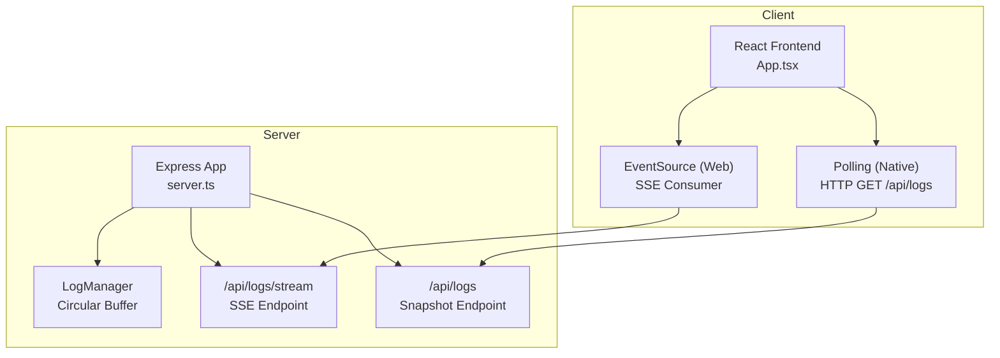
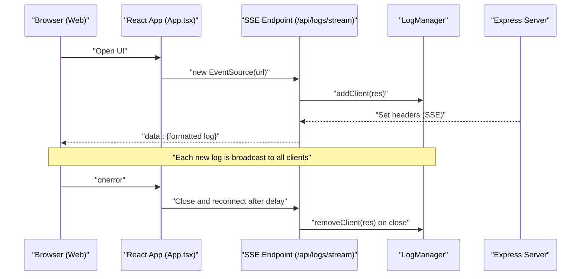
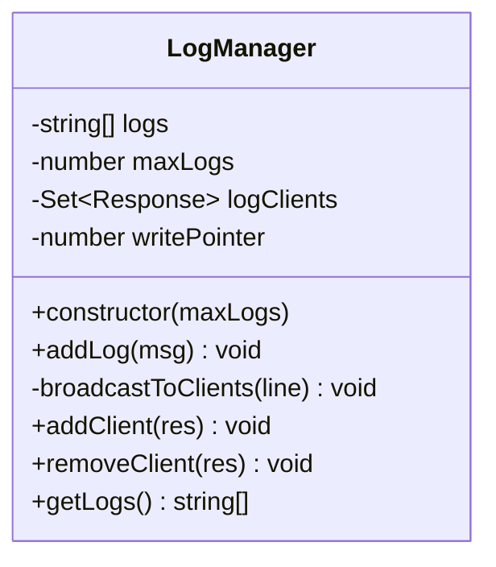
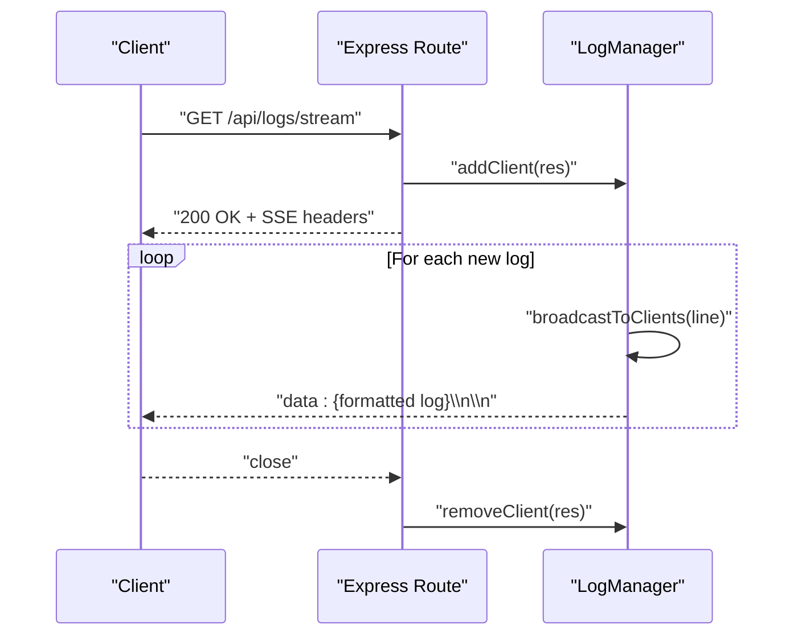
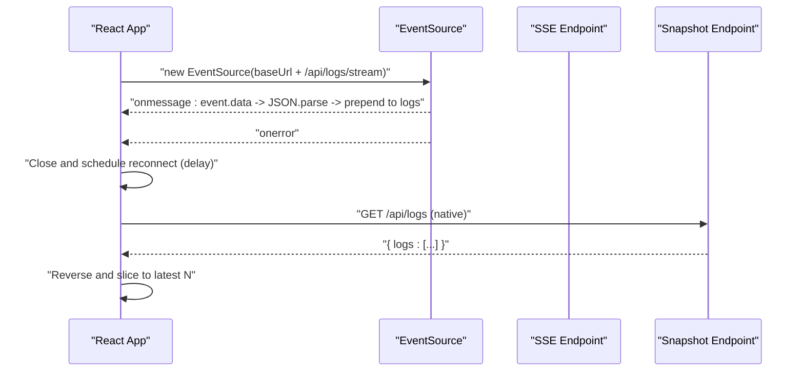
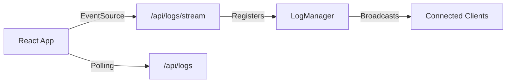

# Real-time Logging

<cite>
**Referenced Files in This Document**
- [server.ts](file://server.ts)
- [App.tsx](file://src/App.tsx)
- [serverUtils.ts](file://src/serverUtils.ts)
</cite>

## Table of Contents
1. [Introduction](#introduction)
2. [Project Structure](#project-structure)
3. [Core Components](#core-components)
4. [Architecture Overview](#architecture-overview)
5. [Detailed Component Analysis](#detailed-component-analysis)
6. [Dependency Analysis](#dependency-analysis)
7. [Performance Considerations](#performance-considerations)
8. [Troubleshooting Guide](#troubleshooting-guide)
9. [Conclusion](#conclusion)
10. [Appendices](#appendices)

## Introduction
This document explains the real-time logging system built with Server-Sent Events (SSE) in the project. It covers the server-side LogManager class, the SSE endpoint, client-side consumption in the React application, and operational guidance for high-frequency logging, concurrency, and troubleshooting.

## Project Structure
The logging system spans two primary areas:
- Server: Express-based backend with an SSE endpoint and a circular log buffer.
- Client: React frontend that consumes the SSE stream or falls back to polling on native environments.

**Diagram sources**
- [server.ts:342-352](file://server.ts#L342-L352)
- [server.ts:1146-1148](file://server.ts#L1146-L1148)
- [App.tsx:651-698](file://src/App.tsx#L651-L698)

**Section sources**
- [server.ts:342-352](file://server.ts#L342-L352)
- [server.ts:1146-1148](file://server.ts#L1146-L1148)
- [App.tsx:651-698](file://src/App.tsx#L651-L698)

## Core Components
- LogManager: Maintains a fixed-size circular buffer of formatted log lines and broadcasts new entries to connected clients.
- SSE Endpoint: Establishes a long-lived connection and streams log events to browsers.
- Snapshot Endpoint: Returns recent logs as a JSON array for polling clients.
- Client Consumers: Web browsers use EventSource; native environments use periodic polling.

Key responsibilities:
- Circular buffer management with a write pointer.
- Broadcasting to all connected clients and automatic cleanup of broken connections.
- Timestamp formatting and line composition for logs.
- SSE header configuration and client lifecycle handling.

**Section sources**
- [server.ts:219-277](file://server.ts#L219-L277)
- [server.ts:342-352](file://server.ts#L342-L352)
- [server.ts:1146-1148](file://server.ts#L1146-L1148)

## Architecture Overview
The system uses SSE for real-time log delivery to web clients and falls back to HTTP polling for native environments. The server maintains a shared log buffer and a set of active client connections.

**Diagram sources**
- [server.ts:342-352](file://server.ts#L342-L352)
- [server.ts:247-257](file://server.ts#L247-L257)
- [App.tsx:651-698](file://src/App.tsx#L651-L698)

## Detailed Component Analysis

### LogManager
The LogManager encapsulates:
- A circular buffer of strings sized by maxLogs.
- A write pointer that advances modulo maxLogs.
- A Set of active Response objects representing SSE clients.
- Methods to add logs, broadcast to clients, add/remove clients, and retrieve recent logs.

Implementation highlights:
- addLog formats each message with a localized time and appends it to the buffer at writePointer, then increments the pointer.
- broadcastToClients writes a structured SSE line to each client and removes broken ones.
- getLogs returns the most recent logs by traversing from writePointer backward and wrapping around.

**Diagram sources**
- [server.ts:219-277](file://server.ts#L219-L277)

**Section sources**
- [server.ts:219-277](file://server.ts#L219-L277)

### SSE Endpoint: /api/logs/stream
The SSE endpoint:
- Sets Content-Type to text/event-stream and disables caching.
- Adds the incoming Response to the LogManager’s client set.
- Registers a close listener to remove the client when the connection ends.

Behavior:
- On successful connection, the client receives a continuous stream of log lines.
- The server does not send an initial snapshot; clients should poll /api/logs if they need historical logs.

**Diagram sources**
- [server.ts:342-352](file://server.ts#L342-L352)
- [server.ts:247-257](file://server.ts#L247-L257)

**Section sources**
- [server.ts:342-352](file://server.ts#L342-L352)

### Snapshot Endpoint: /api/logs
The snapshot endpoint:
- Returns the last N logs from the circular buffer as a JSON object containing a logs array.

Usage:
- Used by native clients or when a client needs a baseline of recent logs upon connection.

**Section sources**
- [server.ts:1146-1148](file://server.ts#L1146-L1148)

### Client-side Consumption (React)
The React application handles both SSE and polling:
- Web (non-native): Uses EventSource to connect to /api/logs/stream. Parses event.data as JSON and prepends to the logs state. Implements exponential backoff on error.
- Native: Uses periodic polling to /api/logs every 4 seconds to fetch recent logs.

Additional client-side logging:
- The app also maintains a small client-side log buffer for UI events and actions.

**Diagram sources**
- [App.tsx:651-698](file://src/App.tsx#L651-L698)
- [server.ts:1146-1148](file://server.ts#L1146-L1148)

**Section sources**
- [App.tsx:651-698](file://src/App.tsx#L651-L698)

### Log Formatting and Timestamp Handling
- Server-side logs: Each log line is prefixed with a localized time string in the format HH:MM:SS.
- Client-side logs: The app adds a "[Client]" marker to distinguish client-originated messages.

These conventions ensure logs are human-readable and timestamped consistently.

**Section sources**
- [server.ts:232-238](file://server.ts#L232-L238)
- [App.tsx:532-535](file://src/App.tsx#L532-L535)

### Log Filtering Techniques
- Client-side filtering: The UI displays logs with color-coded severity based on keywords (e.g., error, warning, success indicators).
- Practical approach: Use substring checks or regex to highlight or hide specific categories (e.g., hide warnings or show only errors).

[No sources needed since this section provides general guidance]

### Concurrent Client Connections
- The server tracks all connected clients in a Set and broadcasts each new log to every client synchronously.
- Dead clients are automatically removed when writes fail, preventing resource leaks.

**Section sources**
- [server.ts:222-229](file://server.ts#L222-L229)
- [server.ts:247-257](file://server.ts#L247-L257)

## Dependency Analysis
- LogManager depends on:
  - An internal circular buffer array and a write pointer.
  - A Set of Response objects for SSE clients.
- SSE endpoint depends on:
  - Express Response headers for SSE.
  - LogManager for client registration and broadcasting.
- Client-side depends on:
  - EventSource for web and fetch for polling on native.

**Diagram sources**
- [server.ts:219-277](file://server.ts#L219-L277)
- [server.ts:342-352](file://server.ts#L342-L352)
- [server.ts:1146-1148](file://server.ts#L1146-L1148)
- [App.tsx:651-698](file://src/App.tsx#L651-L698)

**Section sources**
- [server.ts:219-277](file://server.ts#L219-L277)
- [server.ts:342-352](file://server.ts#L342-L352)
- [server.ts:1146-1148](file://server.ts#L1146-L1148)
- [App.tsx:651-698](file://src/App.tsx#L651-L698)

## Performance Considerations
- Circular buffer sizing: Tune maxLogs to balance memory usage and history depth. Larger buffers increase memory footprint but reduce wrap-around overhead.
- Broadcast cost: Broadcasting scales linearly with the number of clients. For high concurrency, consider batching or throttling bursts.
- SSE headers: Keep headers minimal and avoid unnecessary compression to reduce overhead.
- Client-side rendering: Limit the number of displayed logs to a manageable size (e.g., 50) to keep the UI responsive.
- Polling fallback: On native platforms, polling reduces SSE overhead but increases network traffic. Adjust intervals carefully.

[No sources needed since this section provides general guidance]

## Troubleshooting Guide
Common issues and resolutions:
- Connection drops:
  - The client reconnects automatically with backoff. Verify SSE headers are set and the route is reachable.
- Broken connections accumulate:
  - The server removes dead clients on write failures. Ensure the close event handler is firing and the client closes connections on errors.
- Memory growth:
  - Monitor the circular buffer size and adjust maxLogs. Consider periodic log rotation or external logging for persistent records.
- High-frequency logging:
  - Reduce log verbosity or throttle frequent updates. Consider batching multiple events into a single SSE message.
- Native environment limitations:
  - EventSource may not be available. The app polls /api/logs; ensure the polling interval is appropriate for your UX needs.

**Section sources**
- [server.ts:247-257](file://server.ts#L247-L257)
- [App.tsx:651-698](file://src/App.tsx#L651-L698)

## Conclusion
The logging system combines a compact circular buffer with SSE for real-time updates and a polling fallback for native clients. It balances simplicity, performance, and resilience, enabling effective monitoring of server-side operations across diverse environments.

## Appendices

### Practical Setup Examples
- Server-side logging:
  - Use the centralized addLog function to emit formatted log lines. These appear immediately in connected browsers and are stored in the circular buffer.
- Client-side consumption:
  - Web: Initialize EventSource to /api/logs/stream; parse event.data as JSON and append to the UI log list.
  - Native: Poll /api/logs every few seconds to refresh the log list.

**Section sources**
- [server.ts:279-280](file://server.ts#L279-L280)
- [App.tsx:651-698](file://src/App.tsx#L651-L698)

### Log Formatting Standards
- Server-side: Each log line includes a localized HH:MM:SS timestamp and the message text.
- Client-side: Client-originated logs include a "[Client]" marker.

**Section sources**
- [server.ts:232-238](file://server.ts#L232-L238)
- [App.tsx:532-535](file://src/App.tsx#L532-L535)

### File Logger Utility
While not used for SSE logs, the FileLogger utility demonstrates consistent timestamped logging to disk for persistent records.

**Section sources**
- [serverUtils.ts:7-22](file://src/serverUtils.ts#L7-L22)