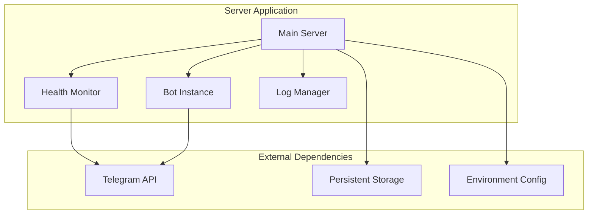
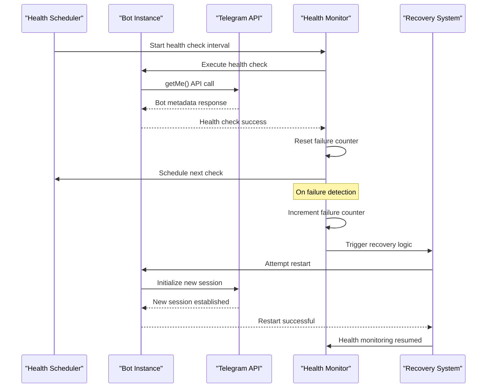
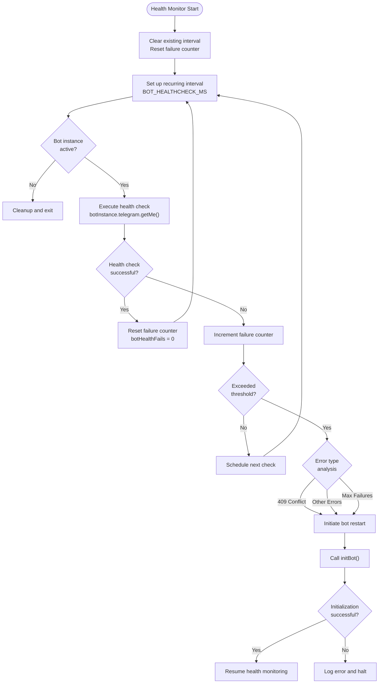
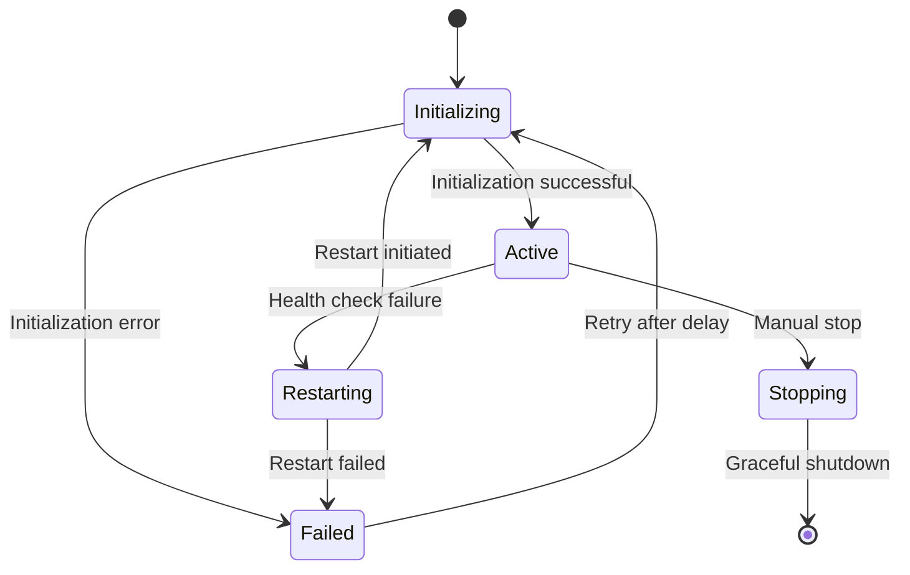
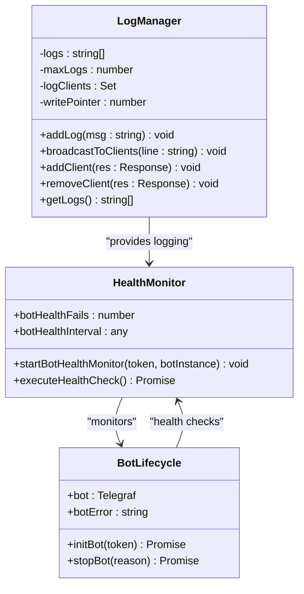
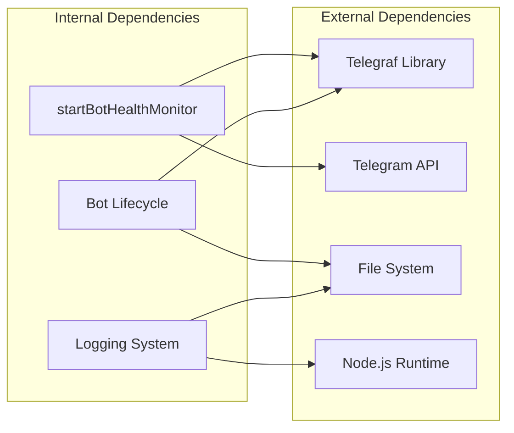

# Server Health Monitoring

<cite>
**Referenced Files in This Document**
- [server.ts](file://server.ts)
- [README.md](file://README.md)
- [.codex/environments/environment.toml](file://.codex/environments/environment.toml)
</cite>

## Table of Contents
1. [Introduction](#introduction)
2. [Project Structure](#project-structure)
3. [Core Components](#core-components)
4. [Architecture Overview](#architecture-overview)
5. [Detailed Component Analysis](#detailed-component-analysis)
6. [Dependency Analysis](#dependency-analysis)
7. [Performance Considerations](#performance-considerations)
8. [Troubleshooting Guide](#troubleshooting-guide)
9. [Conclusion](#conclusion)

## Introduction

The server health monitoring system is a critical component of the Telegram bot management platform that ensures continuous operation and automatic recovery of bot instances. This system implements sophisticated health checking mechanisms, automatic restart capabilities, and comprehensive error tracking to maintain reliable bot service availability.

The health monitoring system operates independently of the main bot functionality, providing continuous oversight through periodic health checks, intelligent failure detection, and automated recovery processes. It integrates seamlessly with the bot lifecycle management system to ensure graceful handling of various operational states and error conditions.

## Project Structure

The health monitoring system is implemented within the main server application, utilizing a modular architecture that separates concerns between bot management, health monitoring, and logging infrastructure.

**Diagram sources**
- [server.ts:377-409](file://server.ts#L377-L409)
- [server.ts:688-799](file://server.ts#L688-L799)

**Section sources**
- [server.ts:1-1454](file://server.ts#L1-L1454)

## Core Components

The health monitoring system consists of several interconnected components that work together to ensure bot reliability and automatic recovery:

### Health Monitor Engine
The core health monitoring functionality is implemented through the `startBotHealthMonitor` function, which establishes a recurring health check mechanism using JavaScript's `setInterval` function.

### Bot Lifecycle Management
The system manages bot instances through comprehensive lifecycle functions including initialization, graceful shutdown, and restart procedures with proper cleanup and resource management.

### Error Tracking and Recovery
Intelligent error detection and recovery mechanisms track failures, implement exponential backoff strategies, and trigger automatic restarts based on predefined failure thresholds.

### Logging Infrastructure
A sophisticated logging system provides real-time monitoring capabilities through Server-Sent Events (SSE) and persistent log storage for debugging and operational visibility.

**Section sources**
- [server.ts:204-217](file://server.ts#L204-L217)
- [server.ts:377-409](file://server.ts#L377-L409)
- [server.ts:674-799](file://server.ts#L674-L799)

## Architecture Overview

The health monitoring system follows a reactive architecture pattern where health checks are performed asynchronously and independently of the main bot processing pipeline.

**Diagram sources**
- [server.ts:377-409](file://server.ts#L377-L409)
- [server.ts:688-799](file://server.ts#L688-L799)

The architecture implements several key design patterns:

- **Observer Pattern**: Health monitoring observes bot state changes
- **Strategy Pattern**: Different recovery strategies for different failure types
- **Command Pattern**: Health check commands executed at scheduled intervals
- **State Machine**: Bot lifecycle transitions between states

## Detailed Component Analysis

### Health Check Implementation

The `startBotHealthMonitor` function serves as the central orchestrator for bot health monitoring:

**Diagram sources**
- [server.ts:377-409](file://server.ts#L377-L409)

The health check mechanism implements the following detection algorithms:

#### Failure Detection Algorithm
The system employs a multi-layered failure detection approach:

1. **Direct API Response Analysis**: Examines Telegram API responses for specific error patterns
2. **Error Message Classification**: Categorizes errors based on content patterns
3. **Failure Counter Threshold**: Implements configurable failure thresholds
4. **Context-Aware Decision Making**: Considers bot initialization state and instance identity

#### Recovery Decision Matrix
The recovery system uses a comprehensive decision matrix for determining appropriate actions:

| Error Type | Condition Met | Action Taken |
|------------|---------------|--------------|
| 409 Conflict | `errMsg.includes("409")` | Automatic restart |
| Terminated Session | `errMsg.includes("terminated by other getUpdates")` | Automatic restart |
| Max Failures Reached | `botHealthFails >= BOT_MAX_HEALTH_FAILS` | Automatic restart |
| Network Timeout | ETIMEDOUT/ECONNRESET | Continue monitoring |
| Authentication Error | 401/403 status codes | Manual intervention required |

**Section sources**
- [server.ts:377-409](file://server.ts#L377-L409)
- [server.ts:204-217](file://server.ts#L204-L217)

### Bot Initialization and Restart Logic

The bot initialization system implements sophisticated restart mechanisms with proper cleanup and resource management:

**Diagram sources**
- [server.ts:688-799](file://server.ts#L688-L799)

The initialization process includes:

1. **Graceful Shutdown**: Properly stops existing bot instances before restart
2. **Resource Cleanup**: Clears health check intervals and resets counters
3. **Session Management**: Handles Telegram API session conflicts
4. **Error Propagation**: Maintains error context for debugging

### Health Status Tracking and Metrics

The system maintains comprehensive health metrics and status tracking:

#### Global Health Variables
- `botHealthFails`: Current consecutive failure count
- `botHealthInterval`: Reference to health check interval timer
- `isInitializingBot`: Indicates active initialization state
- `botError`: Last recorded error message

#### Health Check Configuration
- **Interval Duration**: 60,000 milliseconds (1 minute)
- **Failure Threshold**: 3 consecutive failures
- **Max 409 Conflicts**: 3 attempts with 15-second delays
- **Initialization Timeout**: 3-second startup validation period

**Section sources**
- [server.ts:204-217](file://server.ts#L204-L217)
- [server.ts:688-799](file://server.ts#L688-L799)

### Logging and Monitoring Infrastructure

The logging system provides comprehensive monitoring capabilities:

**Diagram sources**
- [server.ts:219-277](file://server.ts#L219-L277)
- [server.ts:377-409](file://server.ts#L377-L409)
- [server.ts:674-799](file://server.ts#L674-L799)

**Section sources**
- [server.ts:219-277](file://server.ts#L219-L277)
- [server.ts:342-352](file://server.ts#L342-L352)

## Dependency Analysis

The health monitoring system has minimal external dependencies and maintains loose coupling with other system components:

**Diagram sources**
- [server.ts:377-409](file://server.ts#L377-L409)
- [server.ts:688-799](file://server.ts#L688-L799)

### Key Dependencies Analysis

The system relies on several critical dependencies:

1. **Telegraf Library**: Provides Telegram bot functionality and API communication
2. **Node.js Runtime**: Enables asynchronous operations and interval scheduling
3. **File System**: Supports persistent configuration and state management
4. **Express.js**: Powers the HTTP server and API endpoints

### Coupling and Cohesion

The health monitoring system demonstrates excellent design principles:

- **High Cohesion**: Related health monitoring functionality is grouped together
- **Low Coupling**: Minimal dependencies on external systems
- **Separation of Concerns**: Health monitoring is separate from bot business logic
- **Single Responsibility**: Focused solely on bot health and recovery

**Section sources**
- [server.ts:377-409](file://server.ts#L377-L409)
- [server.ts:688-799](file://server.ts#L688-L799)

## Performance Considerations

The health monitoring system is designed for optimal performance with minimal resource overhead:

### Resource Optimization Strategies

1. **Efficient Interval Management**: Health checks occur every 60 seconds, balancing responsiveness with resource usage
2. **Asynchronous Operations**: Health checks use non-blocking asynchronous calls
3. **Memory Management**: Proper cleanup of intervals and references prevents memory leaks
4. **Network Efficiency**: Health checks use lightweight API calls (`getMe` endpoint)

### Scalability Considerations

The current implementation supports single bot instances efficiently. For multi-bot deployments, consider:

- **Per-Bot Monitoring**: Extend health monitoring to track multiple bot instances
- **Centralized Logging**: Implement distributed logging for multi-instance scenarios
- **Resource Pooling**: Optimize shared resources across multiple bot instances

### Monitoring Overhead

The health monitoring system introduces minimal overhead:

- **CPU Usage**: Negligible impact from periodic API calls
- **Memory Usage**: Small memory footprint for health state variables
- **Network Usage**: Low bandwidth consumption from health check requests
- **Storage Usage**: Log rotation prevents unbounded growth

## Troubleshooting Guide

### Common Health Issues and Solutions

#### 409 Conflict Resolution
**Symptoms**: Repeated "Conflict: terminated by other getUpdates" errors
**Causes**: Multiple bot instances running simultaneously
**Solutions**:
1. Verify single bot instance is running
2. Check for multiple deployment instances
3. Restart bot to clear conflicting sessions
4. Use unique bot tokens for different environments

#### Health Check Failure Patterns
**Symptoms**: Increasing failure counters despite healthy bot operation
**Causes**: Network connectivity issues, API rate limiting
**Solutions**:
1. Monitor network connectivity
2. Implement retry logic with exponential backoff
3. Check API rate limits and quotas
4. Review firewall and proxy configurations

#### Initialization Failures
**Symptoms**: Bot fails to start after health check failures
**Causes**: Invalid bot token, Telegram API unavailability
**Solutions**:
1. Verify bot token validity
2. Check Telegram API status
3. Review network connectivity
4. Validate environment configuration

### Debugging Techniques

#### Health Check Debugging
1. **Enable Verbose Logging**: Monitor health check logs in real-time
2. **Check Error Messages**: Analyze specific error patterns and timestamps
3. **Monitor API Responses**: Track Telegram API response codes and timing
4. **Validate Bot State**: Confirm bot instance identity and lifecycle state

#### Manual Intervention Procedures
1. **Stop Bot**: Use `/api/bot/stop` endpoint for controlled shutdown
2. **Restart Bot**: Use `/api/bot/restart` endpoint for automated restart
3. **Clear Token**: Use `/api/config/clear-token` to reset bot configuration
4. **Update Configuration**: Use `/api/config/token` to update bot credentials

#### Health Status Monitoring
1. **Check `/api/status` Endpoint**: Monitor bot health and configuration status
2. **Review Logs**: Use `/api/logs` and `/api/logs/stream` for real-time monitoring
3. **Monitor Health Counters**: Track `botHealthFails` and recovery attempts
4. **Validate Environment**: Check environment variables and configuration files

**Section sources**
- [server.ts:975-989](file://server.ts#L975-L989)
- [server.ts:1074-1085](file://server.ts#L1074-L1085)
- [server.ts:1146-1148](file://server.ts#L1146-L1148)

### Recovery Procedures

#### Automatic Recovery Process
1. **Failure Detection**: Health check failure triggers recovery logic
2. **Error Classification**: Determine failure type and severity
3. **Recovery Strategy**: Apply appropriate recovery action based on failure type
4. **Bot Restart**: Initialize new bot instance with proper cleanup
5. **Health Monitoring Resumption**: Resume health checks after successful restart

#### Manual Recovery Steps
1. **Stop Current Bot**: Execute graceful shutdown procedure
2. **Clear Health State**: Reset failure counters and intervals
3. **Reinitialize Bot**: Start fresh bot instance with updated configuration
4. **Verify Health**: Confirm successful health check completion
5. **Resume Operations**: Resume normal bot functionality

## Conclusion

The server health monitoring system provides robust, automated bot management with comprehensive error detection, intelligent recovery mechanisms, and extensive monitoring capabilities. The system's design emphasizes reliability, performance, and ease of maintenance while providing flexible configuration options for different deployment scenarios.

Key strengths of the implementation include:

- **Proactive Health Monitoring**: Continuous monitoring with configurable intervals
- **Intelligent Recovery**: Multi-tiered recovery strategies based on failure analysis
- **Comprehensive Logging**: Real-time monitoring through SSE and persistent storage
- **Graceful Degradation**: Controlled shutdown procedures and error state handling
- **Minimal Overhead**: Efficient resource utilization with low performance impact

The system successfully balances automation with human oversight, providing automatic recovery for common issues while requiring manual intervention for complex problems. This approach ensures both operational reliability and maintainable system behavior.

Future enhancements could include distributed health monitoring for multi-bot deployments, advanced analytics and alerting systems, and integration with external monitoring platforms for enterprise-scale deployments.