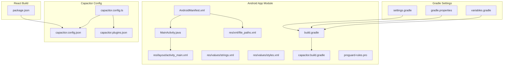
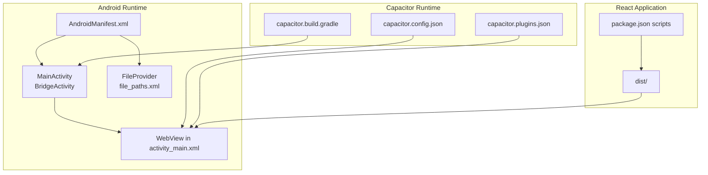
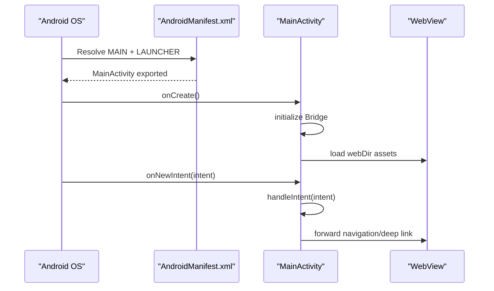
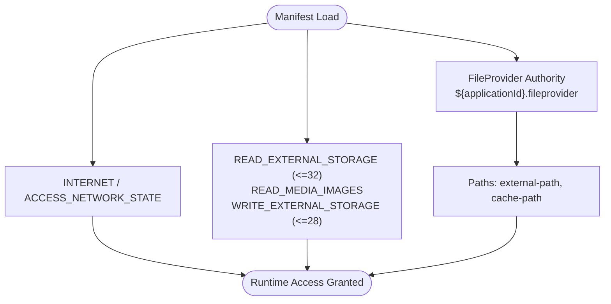
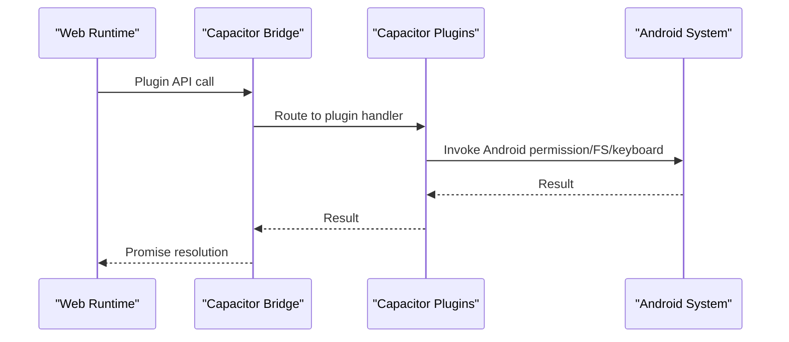
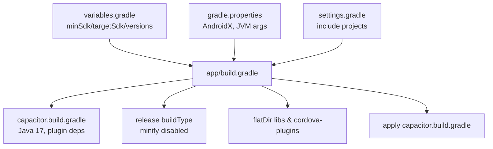
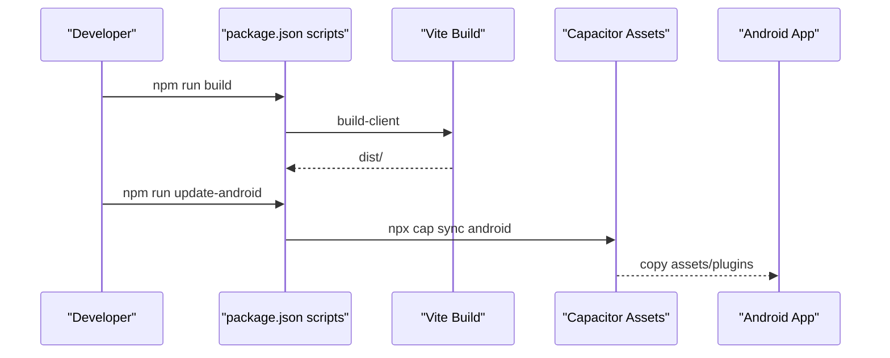
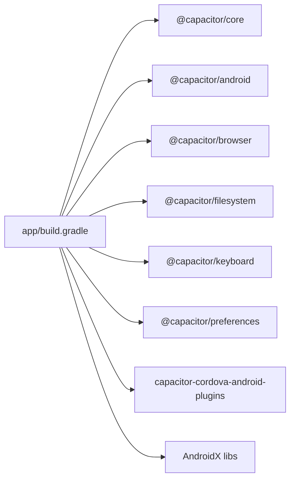

# Android Integration

<cite>
**Referenced Files in This Document**
- [MainActivity.java](file://android/app/src/main/java/com/newsbot/manager/MainActivity.java)
- [AndroidManifest.xml](file://android/app/src/main/AndroidManifest.xml)
- [activity_main.xml](file://android/app/src/main/res/layout/activity_main.xml)
- [strings.xml](file://android/app/src/main/res/values/strings.xml)
- [styles.xml](file://android/app/src/main/res/values/styles.xml)
- [file_paths.xml](file://android/app/src/main/res/xml/file_paths.xml)
- [build.gradle](file://android/app/build.gradle)
- [capacitor.build.gradle](file://android/app/capacitor.build.gradle)
- [settings.gradle](file://android/settings.gradle)
- [gradle.properties](file://android/gradle.properties)
- [variables.gradle](file://android/variables.gradle)
- [capacitor.config.ts](file://capacitor.config.ts)
- [capacitor.config.json](file://android/app/src/main/assets/capacitor.config.json)
- [capacitor.plugins.json](file://android/app/src/main/assets/capacitor.plugins.json)
- [proguard-rules.pro](file://android/app/proguard-rules.pro)
- [package.json](file://package.json)
</cite>

## Table of Contents
1. [Introduction](#introduction)
2. [Project Structure](#project-structure)
3. [Core Components](#core-components)
4. [Architecture Overview](#architecture-overview)
5. [Detailed Component Analysis](#detailed-component-analysis)
6. [Dependency Analysis](#dependency-analysis)
7. [Performance Considerations](#performance-considerations)
8. [Troubleshooting Guide](#troubleshooting-guide)
9. [Conclusion](#conclusion)
10. [Appendices](#appendices)

## Introduction
This document explains the Android integration for a Capacitor-based hybrid application. It focuses on the Android activity lifecycle, manifest configuration, build system setup, and the integration between the React frontend and Android native components. It also covers permissions, hardware capabilities, inter-process communication patterns via Capacitor plugins, and practical debugging and performance optimization strategies.

## Project Structure
The Android module is organized around the Capacitor framework and a minimal Activity wrapper. The React client builds to a distribution folder consumed by the Android WebView.

**Diagram sources**
- [AndroidManifest.xml:1-46](file://android/app/src/main/AndroidManifest.xml#L1-L46)
- [MainActivity.java:1-6](file://android/app/src/main/java/com/newsbot/manager/MainActivity.java#L1-L6)
- [activity_main.xml:1-13](file://android/app/src/main/res/layout/activity_main.xml#L1-L13)
- [strings.xml:1-8](file://android/app/src/main/res/values/strings.xml#L1-L8)
- [styles.xml:1-22](file://android/app/src/main/res/values/styles.xml#L1-L22)
- [file_paths.xml:1-5](file://android/app/src/main/res/xml/file_paths.xml#L1-L5)
- [build.gradle:1-55](file://android/app/build.gradle#L1-L55)
- [capacitor.build.gradle:1-23](file://android/app/capacitor.build.gradle#L1-L23)
- [settings.gradle:1-5](file://android/settings.gradle#L1-L5)
- [gradle.properties:1-23](file://android/gradle.properties#L1-L23)
- [variables.gradle:1-16](file://android/variables.gradle#L1-L16)
- [capacitor.config.ts:1-26](file://capacitor.config.ts#L1-L26)
- [capacitor.config.json:1-24](file://android/app/src/main/assets/capacitor.config.json#L1-L24)
- [capacitor.plugins.json:1-19](file://android/app/src/main/assets/capacitor.plugins.json#L1-L19)
- [package.json:1-70](file://package.json#L1-L70)

**Section sources**
- [AndroidManifest.xml:1-46](file://android/app/src/main/AndroidManifest.xml#L1-L46)
- [build.gradle:1-55](file://android/app/build.gradle#L1-L55)
- [capacitor.config.ts:1-26](file://capacitor.config.ts#L1-L26)
- [capacitor.config.json:1-24](file://android/app/src/main/assets/capacitor.config.json#L1-L24)
- [capacitor.plugins.json:1-19](file://android/app/src/main/assets/capacitor.plugins.json#L1-L19)
- [settings.gradle:1-5](file://android/settings.gradle#L1-L5)
- [gradle.properties:1-23](file://android/gradle.properties#L1-L23)
- [variables.gradle:1-16](file://android/variables.gradle#L1-L16)
- [package.json:1-70](file://package.json#L1-L70)

## Core Components
- MainActivity: Minimal bridge Activity extending the Capacitor BridgeActivity. It delegates lifecycle and navigation to the embedded WebView.
- Manifest: Declares the main Activity, exported provider for file sharing, and required permissions for network and media access.
- Layout: Provides a CoordinatorLayout hosting a WebView for rendering the React application.
- Capacitor configuration: Defines app identity, webDir, server scheme, and plugin enablement.
- Build configuration: Gradle settings define SDK versions, repositories, dependencies, and Capacitor-generated build steps.

Key integration points:
- The React app builds to the configured webDir and is served by the Android WebView.
- Capacitor plugins expose native capabilities to the web runtime.
- FileProvider enables safe sharing of files outside the app.

**Section sources**
- [MainActivity.java:1-6](file://android/app/src/main/java/com/newsbot/manager/MainActivity.java#L1-L6)
- [AndroidManifest.xml:1-46](file://android/app/src/main/AndroidManifest.xml#L1-L46)
- [activity_main.xml:1-13](file://android/app/src/main/res/layout/activity_main.xml#L1-L13)
- [capacitor.config.ts:1-26](file://capacitor.config.ts#L1-L26)
- [capacitor.config.json:1-24](file://android/app/src/main/assets/capacitor.config.json#L1-L24)
- [capacitor.plugins.json:1-19](file://android/app/src/main/assets/capacitor.plugins.json#L1-L19)
- [build.gradle:1-55](file://android/app/build.gradle#L1-L55)

## Architecture Overview
The Android app hosts a WebView that loads the React application built for production. Capacitor bridges the web runtime with Android-native capabilities through plugins. The manifest defines the entry point and permissions, while Gradle manages dependencies and build steps.

**Diagram sources**
- [AndroidManifest.xml:1-46](file://android/app/src/main/AndroidManifest.xml#L1-L46)
- [MainActivity.java:1-6](file://android/app/src/main/java/com/newsbot/manager/MainActivity.java#L1-L6)
- [activity_main.xml:1-13](file://android/app/src/main/res/layout/activity_main.xml#L1-L13)
- [file_paths.xml:1-5](file://android/app/src/main/res/xml/file_paths.xml#L1-L5)
- [capacitor.config.json:1-24](file://android/app/src/main/assets/capacitor.config.json#L1-L24)
- [capacitor.plugins.json:1-19](file://android/app/src/main/assets/capacitor.plugins.json#L1-L19)
- [capacitor.build.gradle:1-23](file://android/app/capacitor.build.gradle#L1-L23)
- [package.json:1-70](file://package.json#L1-L70)

## Detailed Component Analysis

### MainActivity Lifecycle and Intent Handling
- MainActivity extends the Capacitor BridgeActivity, which initializes the WebView and handles deep links and intents routed through the Android manifest.
- The Activity is exported and launched via the MAIN action with LAUNCHER category, making it the app’s entry point.
- Configuration changes are handled to preserve state during orientation and keyboard visibility changes.

**Diagram sources**
- [AndroidManifest.xml:13-26](file://android/app/src/main/AndroidManifest.xml#L13-L26)
- [MainActivity.java:1-6](file://android/app/src/main/java/com/newsbot/manager/MainActivity.java#L1-L6)
- [activity_main.xml:1-13](file://android/app/src/main/res/layout/activity_main.xml#L1-L13)
- [capacitor.config.json:1-24](file://android/app/src/main/assets/capacitor.config.json#L1-L24)

**Section sources**
- [AndroidManifest.xml:13-26](file://android/app/src/main/AndroidManifest.xml#L13-L26)
- [MainActivity.java:1-6](file://android/app/src/main/java/com/newsbot/manager/MainActivity.java#L1-L6)
- [activity_main.xml:1-13](file://android/app/src/main/res/layout/activity_main.xml#L1-L13)

### Android Manifest Permissions and Hardware Capabilities
- Network permissions: INTERNET and ACCESS_NETWORK_STATE are declared for connectivity.
- Media permissions: READ_EXTERNAL_STORAGE up to SDK 32 and READ_MEDIA_IMAGES for newer devices; WRITE_EXTERNAL_STORAGE up to SDK 28.
- File sharing: A FileProvider is declared with authority derived from the application ID and configured paths for external and cache directories.

**Diagram sources**
- [AndroidManifest.xml:39-45](file://android/app/src/main/AndroidManifest.xml#L39-L45)
- [file_paths.xml:1-5](file://android/app/src/main/res/xml/file_paths.xml#L1-L5)

**Section sources**
- [AndroidManifest.xml:39-45](file://android/app/src/main/AndroidManifest.xml#L39-L45)
- [file_paths.xml:1-5](file://android/app/src/main/res/xml/file_paths.xml#L1-L5)

### Capacitor Plugin Integration and Inter-Process Communication
- Plugins are declared in both the TypeScript configuration and the generated JSON. The build script injects Capacitor plugin modules into the app.
- The Browser, Filesystem, Keyboard, and Preferences plugins are enabled, exposing native APIs to the web runtime.

**Diagram sources**
- [capacitor.config.ts:15-22](file://capacitor.config.ts#L15-L22)
- [capacitor.config.json:15-22](file://android/app/src/main/assets/capacitor.config.json#L15-L22)
- [capacitor.plugins.json:1-19](file://android/app/src/main/assets/capacitor.plugins.json#L1-L19)
- [capacitor.build.gradle:11-17](file://android/app/capacitor.build.gradle#L11-L17)

**Section sources**
- [capacitor.config.ts:15-22](file://capacitor.config.ts#L15-L22)
- [capacitor.config.json:15-22](file://android/app/src/main/assets/capacitor.config.json#L15-L22)
- [capacitor.plugins.json:1-19](file://android/app/src/main/assets/capacitor.plugins.json#L1-L19)
- [capacitor.build.gradle:11-17](file://android/app/capacitor.build.gradle#L11-L17)

### Gradle Build Configuration and Release Process
- SDK versions and repositories are centralized in variables and applied to the app module.
- Dependencies include AndroidX libraries, Capacitor modules, and Cordova compatibility artifacts.
- The Capacitor build script sets Java compatibility and adds plugin modules.
- Release configuration disables code shrinking and applies ProGuard rules.

**Diagram sources**
- [variables.gradle:1-16](file://android/variables.gradle#L1-L16)
- [gradle.properties:1-23](file://android/gradle.properties#L1-L23)
- [settings.gradle:1-5](file://android/settings.gradle#L1-L5)
- [build.gradle:1-55](file://android/app/build.gradle#L1-L55)
- [capacitor.build.gradle:1-23](file://android/app/capacitor.build.gradle#L1-L23)

**Section sources**
- [variables.gradle:1-16](file://android/variables.gradle#L1-L16)
- [gradle.properties:1-23](file://android/gradle.properties#L1-L23)
- [settings.gradle:1-5](file://android/settings.gradle#L1-L5)
- [build.gradle:1-55](file://android/app/build.gradle#L1-L55)
- [capacitor.build.gradle:1-23](file://android/app/capacitor.build.gradle#L1-L23)

### React Frontend Integration and Sync Workflow
- The React app builds to a distribution directory consumed by the Android WebView.
- The project script updates Android assets and synchronizes Capacitor after building the client.

**Diagram sources**
- [package.json:6-17](file://package.json#L6-L17)
- [capacitor.config.ts:6-14](file://capacitor.config.ts#L6-L14)

**Section sources**
- [package.json:6-17](file://package.json#L6-L17)
- [capacitor.config.ts:6-14](file://capacitor.config.ts#L6-L14)

## Dependency Analysis
The Android app depends on Capacitor modules and AndroidX libraries. The build script integrates Cordova plugins and applies Capacitor’s generated configuration.

**Diagram sources**
- [build.gradle:33-43](file://android/app/build.gradle#L33-L43)
- [capacitor.build.gradle:11-17](file://android/app/capacitor.build.gradle#L11-L17)
- [package.json:19-56](file://package.json#L19-L56)

**Section sources**
- [build.gradle:33-43](file://android/app/build.gradle#L33-L43)
- [capacitor.build.gradle:11-17](file://android/app/capacitor.build.gradle#L11-L17)
- [package.json:19-56](file://package.json#L19-L56)

## Performance Considerations
- Disable minification in release builds to simplify debugging and reduce build overhead during development iterations.
- Keep WebView debugging enabled in development builds for rapid iteration.
- Use AndroidX libraries consistently to benefit from performance improvements and reduced bloat.
- Configure ProGuard rules to preserve necessary WebView and plugin interfaces if enabling minification later.
- Ensure asset ignore patterns exclude unnecessary files to reduce APK size.

[No sources needed since this section provides general guidance]

## Troubleshooting Guide
Common Android-specific issues and resolutions:
- Mixed content blocked: The configuration allows mixed content for Android to support HTTP resources during development.
- WebContents debugging: Enabled for easier inspection of the WebView content.
- File sharing failures: Verify FileProvider authority and paths match the declared provider and requested directories.
- Plugin not found: Confirm plugin entries exist in both the Capacitor configuration and the generated plugin manifest.
- Build errors with Google Services: The build script conditionally applies the Google Services plugin only if the JSON file exists.

**Section sources**
- [capacitor.config.ts:11-14](file://capacitor.config.ts#L11-L14)
- [capacitor.config.json:11-14](file://android/app/src/main/assets/capacitor.config.json#L11-L14)
- [AndroidManifest.xml:28-36](file://android/app/src/main/AndroidManifest.xml#L28-L36)
- [capacitor.plugins.json:1-19](file://android/app/src/main/assets/capacitor.plugins.json#L1-L19)
- [build.gradle:47-54](file://android/app/build.gradle#L47-L54)

## Conclusion
The Android integration leverages Capacitor to embed a React application within a WebView, exposing native capabilities through plugins. The manifest defines essential permissions and providers, while Gradle coordinates dependencies and Capacitor’s generated build steps. By aligning the React build pipeline with Capacitor’s sync workflow and maintaining clear plugin configurations, the system supports reliable development, debugging, and deployment.

[No sources needed since this section summarizes without analyzing specific files]

## Appendices

### Android Activity Lifecycle Reference
- Entry point: MAIN + LAUNCHER intent launches MainActivity.
- Configuration changes: Handled via configChanges flags to avoid recreation.
- Deep links: Managed by the BridgeActivity and forwarded to the WebView.

**Section sources**
- [AndroidManifest.xml:13-26](file://android/app/src/main/AndroidManifest.xml#L13-L26)
- [MainActivity.java:1-6](file://android/app/src/main/java/com/newsbot/manager/MainActivity.java#L1-L6)

### Manifest Permissions Reference
- Network: INTERNET, ACCESS_NETWORK_STATE
- Storage: READ_EXTERNAL_STORAGE (up to SDK 32), READ_MEDIA_IMAGES, WRITE_EXTERNAL_STORAGE (up to SDK 28)
- File sharing: FileProvider with authority and path mappings

**Section sources**
- [AndroidManifest.xml:39-45](file://android/app/src/main/AndroidManifest.xml#L39-L45)
- [file_paths.xml:1-5](file://android/app/src/main/res/xml/file_paths.xml#L1-L5)

### Build and Release Reference
- SDK versions and libraries defined centrally and applied in the app module.
- Capacitor build script injects plugin modules and sets Java compatibility.
- Release build disables minification and applies ProGuard rules.

**Section sources**
- [variables.gradle:1-16](file://android/variables.gradle#L1-L16)
- [build.gradle:1-55](file://android/app/build.gradle#L1-L55)
- [capacitor.build.gradle:1-23](file://android/app/capacitor.build.gradle#L1-L23)
- [proguard-rules.pro:1-22](file://android/app/proguard-rules.pro#L1-L22)