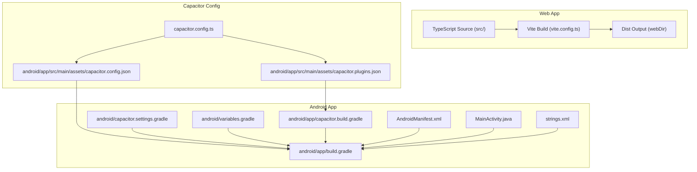
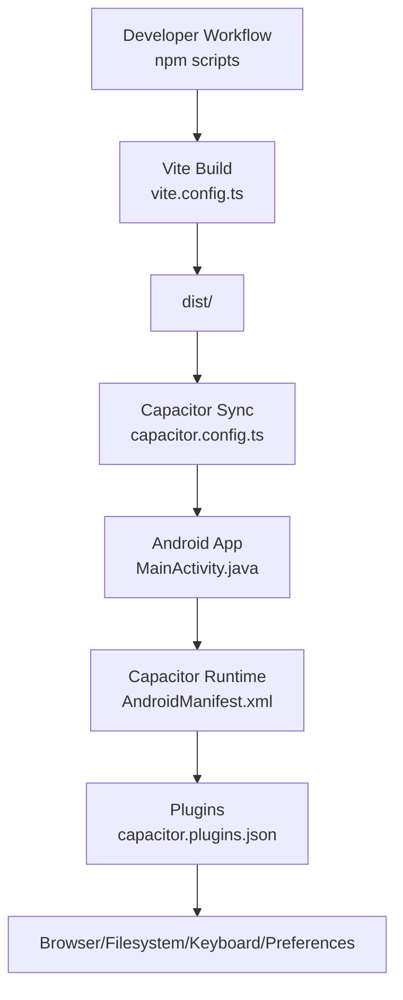
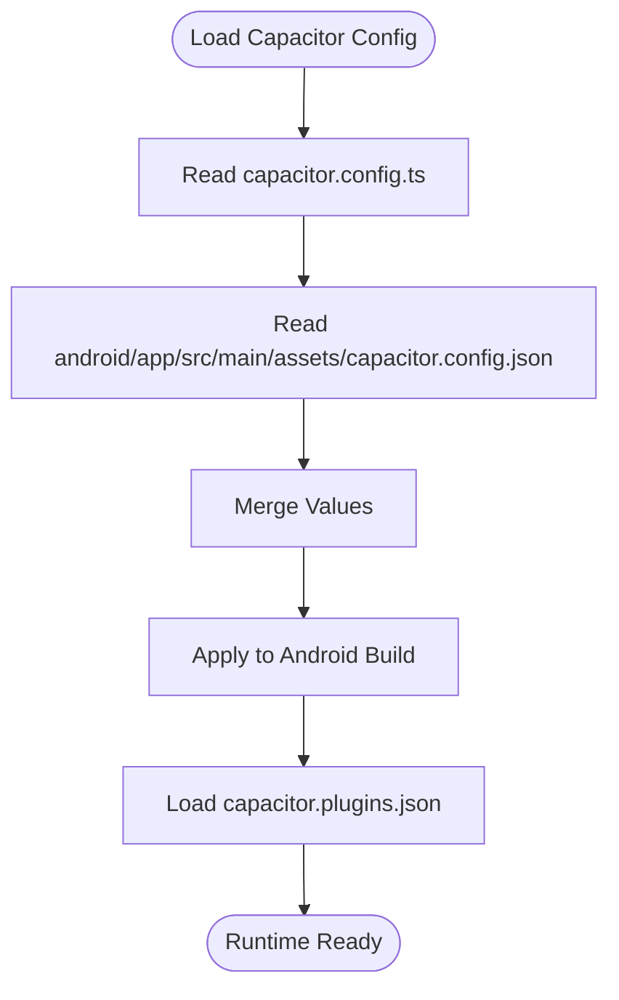
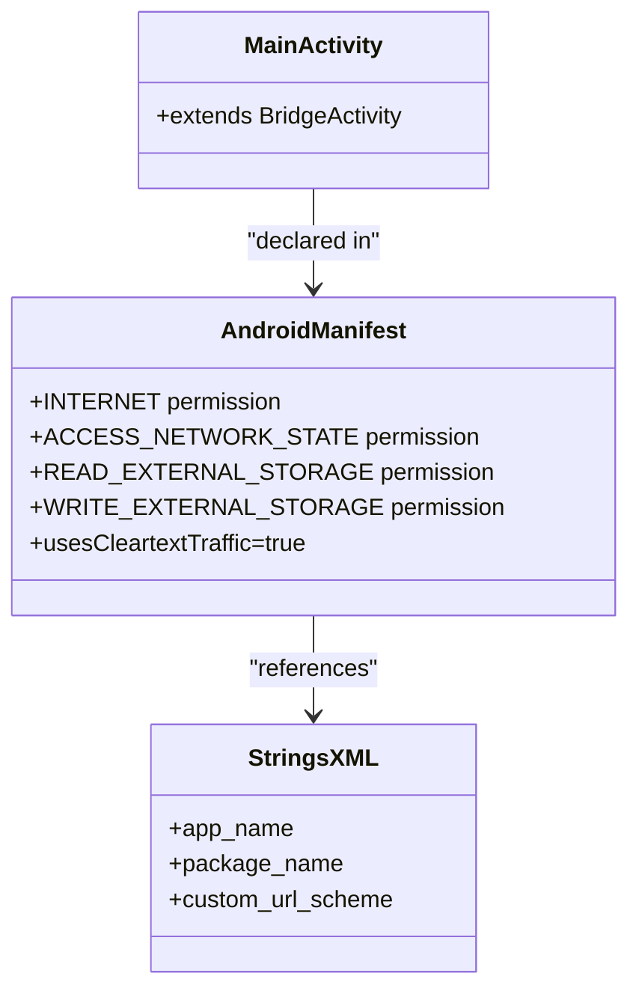
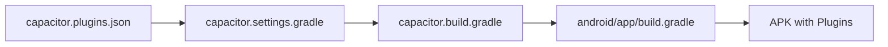
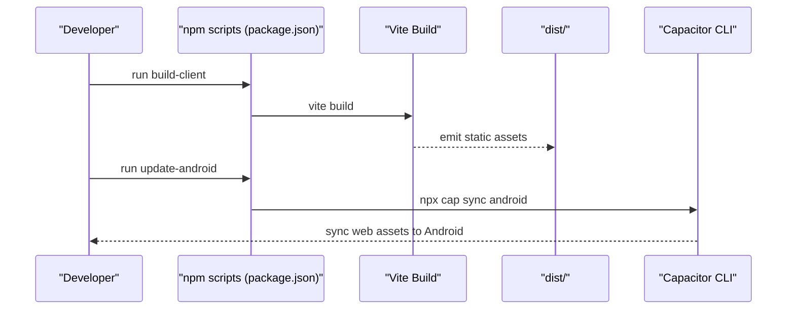
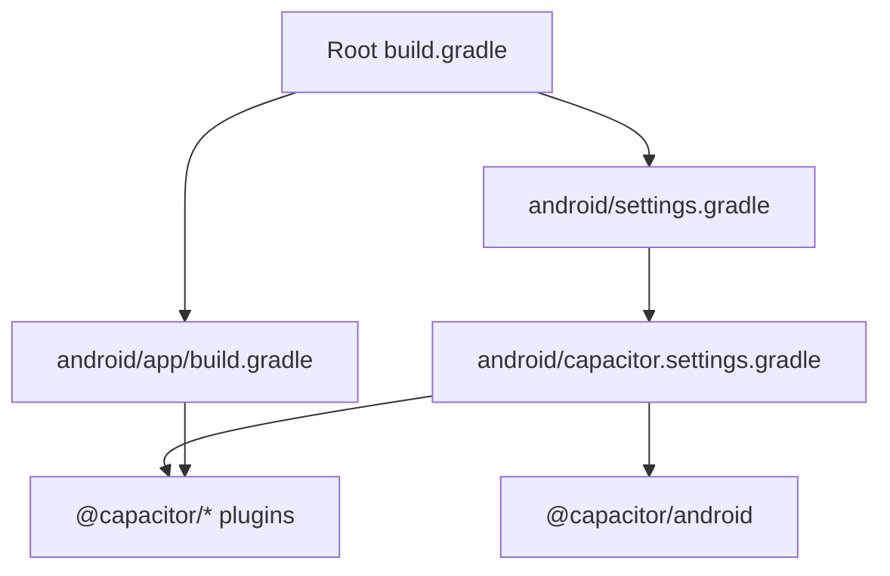

# Capacitor Framework

<cite>
**Referenced Files in This Document**
- [capacitor.config.ts](file://capacitor.config.ts)
- [capacitor.config.json](file://android/app/src/main/assets/capacitor.config.json)
- [capacitor.plugins.json](file://android/app/src/main/assets/capacitor.plugins.json)
- [AndroidManifest.xml](file://android/app/src/main/AndroidManifest.xml)
- [MainActivity.java](file://android/app/src/main/java/com/newsbot/manager/MainActivity.java)
- [package.json](file://package.json)
- [vite.config.ts](file://vite.config.ts)
- [build.gradle](file://android/app/build.gradle)
- [capacitor.settings.gradle](file://android/capacitor.settings.gradle)
- [capacitor.build.gradle](file://android/app/capacitor.build.gradle)
- [variables.gradle](file://android/variables.gradle)
- [strings.xml](file://android/app/src/main/res/values/strings.xml)
- [README.md](file://README.md)
</cite>

## Table of Contents
1. [Introduction](#introduction)
2. [Project Structure](#project-structure)
3. [Core Components](#core-components)
4. [Architecture Overview](#architecture-overview)
5. [Detailed Component Analysis](#detailed-component-analysis)
6. [Dependency Analysis](#dependency-analysis)
7. [Performance Considerations](#performance-considerations)
8. [Troubleshooting Guide](#troubleshooting-guide)
9. [Conclusion](#conclusion)
10. [Appendices](#appendices)

## Introduction
This document explains the Capacitor framework implementation for the AI News Bot mobile application. It covers Capacitor configuration (app identifiers, web directory, server settings), Android-specific options (mixed content, web contents debugging), plugin management (HTTP and Keyboard), the build and development workflow, deployment procedures, troubleshooting, performance tips, and best practices for hybrid app development.

## Project Structure
The project integrates a React-based web app built with Vite and TypeScript, packaged into a Capacitor Android shell. Capacitor configuration is defined in both TypeScript and JSON formats, with Android Gradle scripts wiring Capacitor plugins and runtime behavior.

**Diagram sources**
- [vite.config.ts:1-28](file://vite.config.ts#L1-L28)
- [capacitor.config.ts:1-26](file://capacitor.config.ts#L1-L26)
- [capacitor.config.json:1-24](file://android/app/src/main/assets/capacitor.config.json#L1-L24)
- [capacitor.plugins.json:1-19](file://android/app/src/main/assets/capacitor.plugins.json#L1-L19)
- [build.gradle:1-55](file://android/app/build.gradle#L1-L55)
- [capacitor.settings.gradle:1-16](file://android/capacitor.settings.gradle#L1-L16)
- [capacitor.build.gradle:1-23](file://android/app/capacitor.build.gradle#L1-L23)
- [variables.gradle:1-16](file://android/variables.gradle#L1-L16)
- [AndroidManifest.xml:1-46](file://android/app/src/main/AndroidManifest.xml#L1-L46)
- [MainActivity.java:1-6](file://android/app/src/main/java/com/newsbot/manager/MainActivity.java#L1-L6)
- [strings.xml:1-8](file://android/app/src/main/res/values/strings.xml#L1-L8)

**Section sources**
- [capacitor.config.ts:1-26](file://capacitor.config.ts#L1-L26)
- [capacitor.config.json:1-24](file://android/app/src/main/assets/capacitor.config.json#L1-L24)
- [capacitor.plugins.json:1-19](file://android/app/src/main/assets/capacitor.plugins.json#L1-L19)
- [vite.config.ts:1-28](file://vite.config.ts#L1-L28)
- [build.gradle:1-55](file://android/app/build.gradle#L1-L55)
- [capacitor.settings.gradle:1-16](file://android/capacitor.settings.gradle#L1-L16)
- [capacitor.build.gradle:1-23](file://android/app/capacitor.build.gradle#L1-L23)
- [variables.gradle:1-16](file://android/variables.gradle#L1-L16)
- [AndroidManifest.xml:1-46](file://android/app/src/main/AndroidManifest.xml#L1-L46)
- [MainActivity.java:1-6](file://android/app/src/main/java/com/newsbot/manager/MainActivity.java#L1-L6)
- [strings.xml:1-8](file://android/app/src/main/res/values/strings.xml#L1-L8)

## Core Components
- Capacitor configuration defines app identity, web directory, server scheme and navigation allowances, Android-specific flags, and plugin settings.
- Android app integrates Capacitor runtime via Gradle settings and builds the web assets into the app bundle.
- Web build pipeline uses Vite with React and Tailwind; environment variables are injected at build time.

Key configuration highlights:
- App ID and name: com.newsbot.manager, AI News Bot
- Web directory: dist
- Server scheme: https for Android
- Mixed content: allowed
- Web contents debugging: enabled
- Plugins: HTTP enabled, Keyboard resize set to body
- Cordova plugin registry: Browser, Filesystem, Keyboard, Preferences

**Section sources**
- [capacitor.config.ts:3-23](file://capacitor.config.ts#L3-L23)
- [capacitor.config.json:1-24](file://android/app/src/main/assets/capacitor.config.json#L1-L24)
- [capacitor.plugins.json:1-19](file://android/app/src/main/assets/capacitor.plugins.json#L1-L19)
- [vite.config.ts:6-27](file://vite.config.ts#L6-L27)

## Architecture Overview
The app architecture combines a web UI built with React/Vite and a native Android shell powered by Capacitor. Capacitor synchronizes the built web assets into the Android app and exposes selected native-capable plugins.

**Diagram sources**
- [package.json:6-17](file://package.json#L6-L17)
- [vite.config.ts:6-27](file://vite.config.ts#L6-L27)
- [capacitor.config.ts:3-23](file://capacitor.config.ts#L3-L23)
- [MainActivity.java:1-6](file://android/app/src/main/java/com/newsbot/manager/MainActivity.java#L1-L6)
- [AndroidManifest.xml:1-46](file://android/app/src/main/AndroidManifest.xml#L1-L46)
- [capacitor.plugins.json:1-19](file://android/app/src/main/assets/capacitor.plugins.json#L1-L19)

## Detailed Component Analysis

### Capacitor Configuration
- App identity and webDir: App ID and name are defined in both TypeScript and JSON forms; webDir points to dist.
- Server settings: Android scheme configured to https; navigation allowed globally.
- Android flags: Mixed content allowed and web contents debugging enabled.
- Plugins: HTTP plugin enabled; Keyboard plugin configured with body resize.

**Diagram sources**
- [capacitor.config.ts:3-23](file://capacitor.config.ts#L3-L23)
- [capacitor.config.json:1-24](file://android/app/src/main/assets/capacitor.config.json#L1-L24)
- [capacitor.plugins.json:1-19](file://android/app/src/main/assets/capacitor.plugins.json#L1-L19)

**Section sources**
- [capacitor.config.ts:3-23](file://capacitor.config.ts#L3-L23)
- [capacitor.config.json:1-24](file://android/app/src/main/assets/capacitor.config.json#L1-L24)
- [capacitor.plugins.json:1-19](file://android/app/src/main/assets/capacitor.plugins.json#L1-L19)

### Android Runtime and Activity
- MainActivity extends the Capacitor BridgeActivity, enabling the Capacitor runtime.
- AndroidManifest declares app permissions and network cleartext traffic allowance.
- Strings resource defines app name and package identifiers.

**Diagram sources**
- [MainActivity.java:1-6](file://android/app/src/main/java/com/newsbot/manager/MainActivity.java#L1-L6)
- [AndroidManifest.xml:1-46](file://android/app/src/main/AndroidManifest.xml#L1-L46)
- [strings.xml:1-8](file://android/app/src/main/res/values/strings.xml#L1-L8)

**Section sources**
- [MainActivity.java:1-6](file://android/app/src/main/java/com/newsbot/manager/MainActivity.java#L1-L6)
- [AndroidManifest.xml:1-46](file://android/app/src/main/AndroidManifest.xml#L1-L46)
- [strings.xml:1-8](file://android/app/src/main/res/values/strings.xml#L1-L8)

### Plugin Management
- Plugins are declared in capacitor.plugins.json and wired via Gradle settings and build scripts.
- HTTP plugin is enabled; Keyboard plugin is configured with body resize.
- Additional plugins included: Browser, Filesystem, Preferences.

**Diagram sources**
- [capacitor.plugins.json:1-19](file://android/app/src/main/assets/capacitor.plugins.json#L1-L19)
- [capacitor.settings.gradle:1-16](file://android/capacitor.settings.gradle#L1-L16)
- [capacitor.build.gradle:1-23](file://android/app/capacitor.build.gradle#L1-L23)
- [build.gradle:1-55](file://android/app/build.gradle#L1-L55)

**Section sources**
- [capacitor.plugins.json:1-19](file://android/app/src/main/assets/capacitor.plugins.json#L1-L19)
- [capacitor.settings.gradle:1-16](file://android/capacitor.settings.gradle#L1-L16)
- [capacitor.build.gradle:1-23](file://android/app/capacitor.build.gradle#L1-L23)
- [build.gradle:1-55](file://android/app/build.gradle#L1-L55)

### Build and Development Workflow
- Scripts orchestrate client and server builds, preview, and Capacitor synchronization.
- Vite build uses React and Tailwind; base path is set to relative to support Capacitor’s file:// loading.
- Environment variables are injected at build time for API keys and URLs.

**Diagram sources**
- [package.json:6-17](file://package.json#L6-L17)
- [vite.config.ts:6-27](file://vite.config.ts#L6-L27)

**Section sources**
- [package.json:6-17](file://package.json#L6-L17)
- [vite.config.ts:6-27](file://vite.config.ts#L6-L27)

### Deployment Procedures
- Build the web app and synchronize to Android using the Capacitor sync command.
- Use Android Studio or Gradle to assemble the APK/AAB for distribution.
- Ensure environment variables are set appropriately for production builds.

[No sources needed since this section provides general guidance]

## Dependency Analysis
Capacitor dependencies and plugin wiring are managed via Gradle settings and build scripts. The Android app depends on Capacitor core and selected plugins, while the settings file dynamically includes plugin projects.

**Diagram sources**
- [build.gradle:1-55](file://android/app/build.gradle#L1-L55)
- [settings.gradle:1-5](file://android/settings.gradle#L1-L5)
- [capacitor.settings.gradle:1-16](file://android/capacitor.settings.gradle#L1-L16)

**Section sources**
- [build.gradle:1-55](file://android/app/build.gradle#L1-L55)
- [settings.gradle:1-5](file://android/settings.gradle#L1-L5)
- [capacitor.settings.gradle:1-16](file://android/capacitor.settings.gradle#L1-L16)

## Performance Considerations
- Keep webDir minimal and optimized; avoid unnecessary assets in dist.
- Disable HMR in Vite for Capacitor builds to prevent file-watching conflicts.
- Prefer lazy-loading for large libraries and images.
- Use Capacitor plugins judiciously; enable only what is needed.
- Minimize network requests and cache aggressively in the web app.

[No sources needed since this section provides general guidance]

## Troubleshooting Guide
Common issues and resolutions:
- Mixed content blocked: Mixed content is allowed in configuration; ensure HTTPS scheme is used for external resources.
- Debugging WebView: Web contents debugging is enabled; use Chrome DevTools to inspect the WebView on connected devices.
- Navigation restrictions: Global navigation is allowed; verify server settings and CSP policies if navigation fails.
- Plugin not found: Confirm plugin entries in capacitor.plugins.json and that Gradle settings include the plugin projects.
- Build sync errors: Re-run the Capacitor sync after rebuilding the web assets.
- Network connectivity: Verify INTERNET permission and cleartext traffic allowance in AndroidManifest if HTTP is required.

**Section sources**
- [capacitor.config.ts:7-14](file://capacitor.config.ts#L7-L14)
- [capacitor.config.json:5-14](file://android/app/src/main/assets/capacitor.config.json#L5-L14)
- [AndroidManifest.xml:10-45](file://android/app/src/main/AndroidManifest.xml#L10-L45)
- [capacitor.plugins.json:1-19](file://android/app/src/main/assets/capacitor.plugins.json#L1-L19)
- [package.json:15-17](file://package.json#L15-L17)

## Conclusion
The AI News Bot integrates Capacitor to deliver a hybrid Android application with a modern React web UI. Configuration is centralized in Capacitor config files, synchronized to Android via Gradle, and built with Vite. By following the documented workflow and best practices, teams can maintain a reliable build, efficient runtime, and smooth developer experience.

[No sources needed since this section summarizes without analyzing specific files]

## Appendices

### Quick Setup and Run
- Install dependencies and run locally as described in the project README.
- Build and sync to Android using the provided npm scripts.

**Section sources**
- [README.md:16-24](file://README.md#L16-L24)