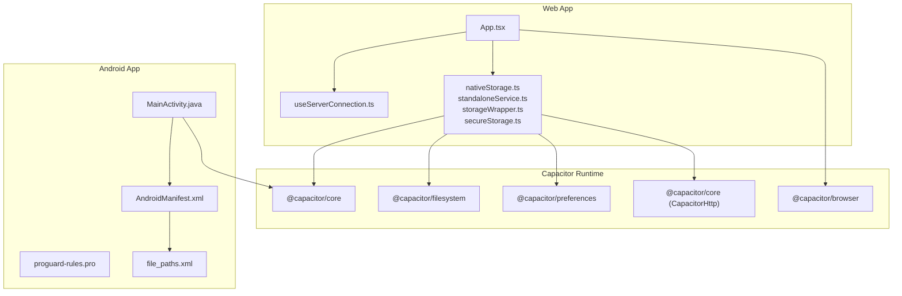
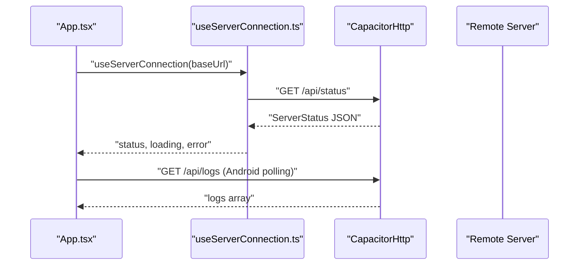
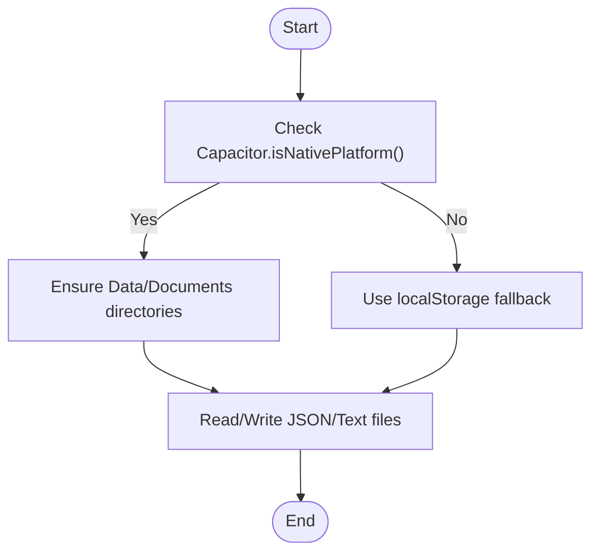
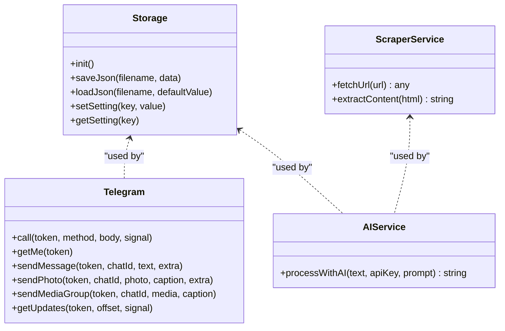
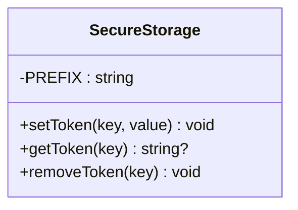
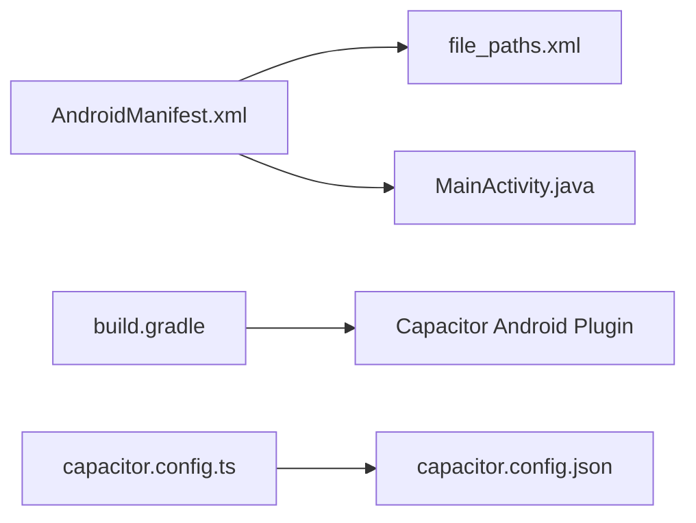
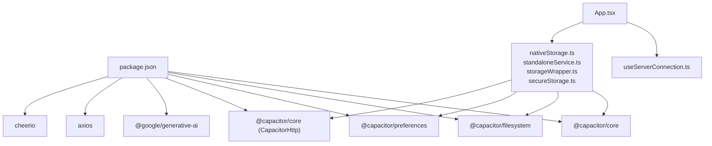

# Mobile Integration

<cite>
**Referenced Files in This Document**
- [capacitor.config.ts](file://capacitor.config.ts)
- [AndroidManifest.xml](file://android/app/src/main/AndroidManifest.xml)
- [nativeStorage.ts](file://src/services/nativeStorage.ts)
- [standaloneService.ts](file://src/services/standaloneService.ts)
- [storageWrapper.ts](file://src/services/storageWrapper.ts)
- [secureStorage.ts](file://src/services/secureStorage.ts)
- [useServerConnection.ts](file://src/hooks/useServerConnection.ts)
- [MainActivity.java](file://android/app/src/main/java/com/newsbot/manager/MainActivity.java)
- [file_paths.xml](file://android/app/src/main/res/xml/file_paths.xml)
- [build.gradle](file://android/app/build.gradle)
- [capacitor.config.json](file://android/app/src/main/assets/capacitor.config.json)
- [package.json](file://package.json)
- [README.md](file://README.md)
- [App.tsx](file://src/App.tsx)
- [proguard-rules.pro](file://android/app/proguard-rules.pro)
</cite>

## Table of Contents
1. [Introduction](#introduction)
2. [Project Structure](#project-structure)
3. [Core Components](#core-components)
4. [Architecture Overview](#architecture-overview)
5. [Detailed Component Analysis](#detailed-component-analysis)
6. [Dependency Analysis](#dependency-analysis)
7. [Performance Considerations](#performance-considerations)
8. [Troubleshooting Guide](#troubleshooting-guide)
9. [Conclusion](#conclusion)
10. [Appendices](#appendices)

## Introduction
This document describes the mobile integration layer built with the Capacitor framework. It covers native device integration (file system access, HTTP request handling, and permission management), the standalone service layer for native storage, Telegram API direct calls, AI service integration, and scraper service functionality. It also documents Android app configuration, build process, and deployment procedures, along with cross-platform data persistence strategies, secure storage implementation, and native device capability utilization. Finally, it includes troubleshooting guidance for common mobile-specific issues and performance optimization techniques.

## Project Structure
The project is organized around a React client bundled via Vite and integrated with Capacitor for Android. The Android app is configured under the android/app directory and uses Capacitor plugins for filesystem, preferences, keyboard, and HTTP. Services and hooks encapsulate platform-aware logic for storage, network requests, and Telegram integration.

**Diagram sources**
- [App.tsx](file://src/App.tsx)
- [useServerConnection.ts](file://src/hooks/useServerConnection.ts)
- [nativeStorage.ts](file://src/services/nativeStorage.ts)
- [standaloneService.ts](file://src/services/standaloneService.ts)
- [storageWrapper.ts](file://src/services/storageWrapper.ts)
- [secureStorage.ts](file://src/services/secureStorage.ts)
- [MainActivity.java](file://android/app/src/main/java/com/newsbot/manager/MainActivity.java)
- [AndroidManifest.xml](file://android/app/src/main/AndroidManifest.xml)
- [file_paths.xml](file://android/app/src/main/res/xml/file_paths.xml)
- [proguard-rules.pro](file://android/app/proguard-rules.pro)

**Section sources**
- [capacitor.config.ts](file://capacitor.config.ts)
- [package.json](file://package.json)

## Core Components
- Capacitor configuration defines app identity, web directory, server scheme, and plugin settings including HTTP and keyboard behavior.
- Native storage service abstracts filesystem and preferences for both native and web environments.
- Standalone service layer provides Telegram API calls, AI service integration, and scraper functionality with platform-aware HTTP handling.
- Storage wrapper offers robust file read/write with cross-platform fallbacks.
- Secure storage class manages encrypted preference-backed token storage on native platforms.
- Server connection hook uses Capacitor HTTP for reliable network calls.
- Android app integrates Capacitor bridge activity and declares required permissions and providers.

**Section sources**
- [capacitor.config.ts](file://capacitor.config.ts)
- [nativeStorage.ts](file://src/services/nativeStorage.ts)
- [standaloneService.ts](file://src/services/standaloneService.ts)
- [storageWrapper.ts](file://src/services/storageWrapper.ts)
- [secureStorage.ts](file://src/services/secureStorage.ts)
- [useServerConnection.ts](file://src/hooks/useServerConnection.ts)
- [AndroidManifest.xml](file://android/app/src/main/AndroidManifest.xml)
- [MainActivity.java](file://android/app/src/main/java/com/newsbot/manager/MainActivity.java)

## Architecture Overview
The mobile architecture leverages Capacitor to expose native APIs to the web runtime. The React app orchestrates UI and business logic, delegating platform-specific tasks to services and hooks. On Android, CapacitorHttp is used for network requests, Filesystem for file operations, and Preferences for secure settings. The app supports both server-driven and standalone modes, with Telegram bot polling and AI processing available in standalone mode.

**Diagram sources**
- [App.tsx](file://src/App.tsx)
- [useServerConnection.ts](file://src/hooks/useServerConnection.ts)

**Section sources**
- [App.tsx](file://src/App.tsx)
- [useServerConnection.ts](file://src/hooks/useServerConnection.ts)

## Detailed Component Analysis

### Native Device Integration
- File system access: Services use Filesystem with Directory.Data/Documents and Directory.ExternalStorage. The app ensures directories exist and reads/writes UTF-8 encoded JSON/text files. On web, localStorage is used as a fallback.
- HTTP request handling: CapacitorHttp is used for Android to avoid CORS and improve reliability. The universal fetch abstraction selects CapacitorHttp on native and fetch on web, with timeouts and error normalization.
- Permission management: The app checks and requests storage permissions before scanning external storage. Android manifest declares internet, network state, and media storage permissions.

**Diagram sources**
- [nativeStorage.ts](file://src/services/nativeStorage.ts)
- [standaloneService.ts](file://src/services/standaloneService.ts)
- [storageWrapper.ts](file://src/services/storageWrapper.ts)

**Section sources**
- [nativeStorage.ts](file://src/services/nativeStorage.ts)
- [standaloneService.ts](file://src/services/standaloneService.ts)
- [storageWrapper.ts](file://src/services/storageWrapper.ts)
- [AndroidManifest.xml](file://android/app/src/main/AndroidManifest.xml)

### Standalone Service Layer
- Native storage: Initializes Documents directory for standalone mode, persists JSON and settings via Filesystem and Preferences.
- Telegram API: Provides typed methods for getMe, sendMessage, sendPhoto, sendMediaGroup, and getUpdates, selecting CapacitorHttp or fetch depending on platform.
- AI service: Integrates Gemini AI via @google/generative-ai for content processing.
- Scraper service: Uses CapacitorHttp to fetch pages and Cheerio to extract text content.

**Diagram sources**
- [standaloneService.ts](file://src/services/standaloneService.ts)

**Section sources**
- [standaloneService.ts](file://src/services/standaloneService.ts)

### Cross-Platform Data Persistence and Secure Storage
- Cross-platform persistence: nativeStorage and storageWrapper abstract filesystem and localStorage to maintain consistent behavior across platforms.
- Secure storage: SecureStorage prefixes keys and stores values via Preferences on native platforms, falling back to localStorage on web with a warning.
- Token management: Separate token getters/setters enable per-key secure storage suitable for API credentials.

**Diagram sources**
- [secureStorage.ts](file://src/services/secureStorage.ts)

**Section sources**
- [nativeStorage.ts](file://src/services/nativeStorage.ts)
- [storageWrapper.ts](file://src/services/storageWrapper.ts)
- [secureStorage.ts](file://src/services/secureStorage.ts)

### Android App Configuration and Build
- App identity and permissions: Application ID, exported activity, FileProvider authority, and declared permissions for internet, network state, and media storage.
- File provider paths: Defines external and cache paths for file sharing.
- Gradle configuration: Applies Capacitor Android plugin, includes Cordova plugins, and conditionally applies google-services if present.
- Capacitor config: Mirrors webDir, server scheme, and plugin settings in assets.

**Diagram sources**
- [AndroidManifest.xml](file://android/app/src/main/AndroidManifest.xml)
- [file_paths.xml](file://android/app/src/main/res/xml/file_paths.xml)
- [MainActivity.java](file://android/app/src/main/java/com/newsbot/manager/MainActivity.java)
- [build.gradle](file://android/app/build.gradle)
- [capacitor.config.ts](file://capacitor.config.ts)
- [capacitor.config.json](file://android/app/src/main/assets/capacitor.config.json)

**Section sources**
- [AndroidManifest.xml](file://android/app/src/main/AndroidManifest.xml)
- [file_paths.xml](file://android/app/src/main/res/xml/file_paths.xml)
- [MainActivity.java](file://android/app/src/main/java/com/newsbot/manager/MainActivity.java)
- [build.gradle](file://android/app/build.gradle)
- [capacitor.config.ts](file://capacitor.config.ts)
- [capacitor.config.json](file://android/app/src/main/assets/capacitor.config.json)

### Deployment Procedures
- Build and sync: The project script builds the server and client, then syncs Capacitor to Android. The README outlines local development steps and prerequisites.
- Release configuration: The Android build uses minified releases with ProGuard rules; google-services plugin is applied conditionally.

**Section sources**
- [package.json](file://package.json)
- [README.md](file://README.md)
- [build.gradle](file://android/app/build.gradle)
- [proguard-rules.pro](file://android/app/proguard-rules.pro)

## Dependency Analysis
The app depends on Capacitor core and plugins for filesystem, preferences, keyboard, and HTTP. The React app consumes services and hooks that encapsulate platform differences. Android build integrates Capacitor and Cordova plugins and optionally Firebase.

**Diagram sources**
- [package.json](file://package.json)
- [App.tsx](file://src/App.tsx)
- [useServerConnection.ts](file://src/hooks/useServerConnection.ts)
- [nativeStorage.ts](file://src/services/nativeStorage.ts)
- [standaloneService.ts](file://src/services/standaloneService.ts)
- [storageWrapper.ts](file://src/services/storageWrapper.ts)
- [secureStorage.ts](file://src/services/secureStorage.ts)

**Section sources**
- [package.json](file://package.json)

## Performance Considerations
- Prefer CapacitorHttp on Android for reduced overhead and CORS avoidance.
- Use Directory.Documents/Data for app data to minimize permission friction.
- Implement timeouts and retry logic for network operations.
- Minimize file I/O by batching writes and caching small data in memory.
- Avoid heavy DOM manipulation in image galleries; leverage virtualization and lazy loading.
- Use selective polling intervals and abort signals to reduce unnecessary work.

## Troubleshooting Guide
- Network errors on Android: Verify CapacitorHttp is enabled and server allowsNavigation settings. Check androidScheme and mixed content settings.
- Storage permission denied: Ensure Filesystem.checkPermissions and requestPermissions are called before accessing external storage.
- Telegram API failures: Validate token and chatId, and inspect returned error messages from Telegram API.
- CORS issues: Use CapacitorHttp instead of fetch on Android to bypass WebView restrictions.
- Build failures: Confirm google-services.json presence if push notifications are enabled; otherwise, the build script handles absence gracefully.
- Logging discrepancies: On Android, logs are polled rather than streamed; ensure polling is active and baseUrl is valid.

**Section sources**
- [capacitor.config.ts](file://capacitor.config.ts)
- [standaloneService.ts](file://src/services/standaloneService.ts)
- [App.tsx](file://src/App.tsx)
- [build.gradle](file://android/app/build.gradle)

## Conclusion
The mobile integration layer leverages Capacitor to unify web and native capabilities. It provides robust storage abstractions, reliable HTTP communication, and seamless Telegram/AI integrations. Android configuration and build scripts support production-ready deployment, while cross-platform strategies ensure consistent behavior across environments.

## Appendices
- Local development: Install dependencies and run the dev server as described in the README.
- Keys and secrets: Manage AI provider keys via UI or environment variables.

**Section sources**
- [README.md](file://README.md)