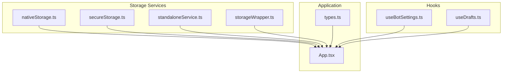
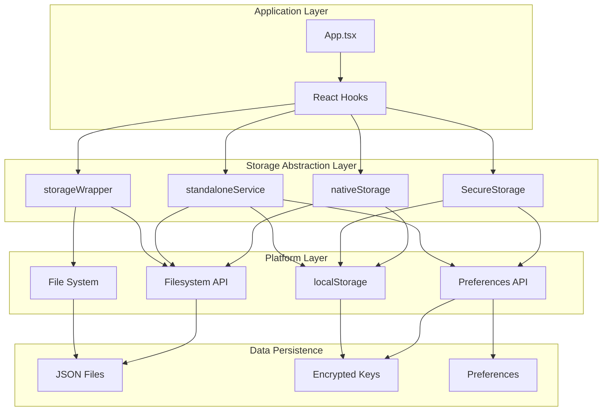
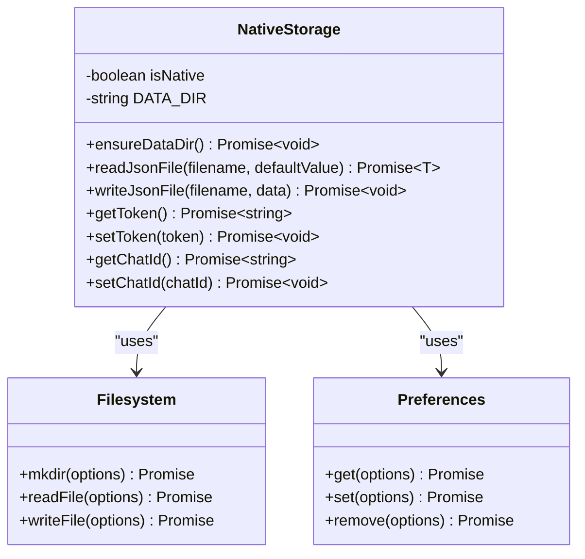
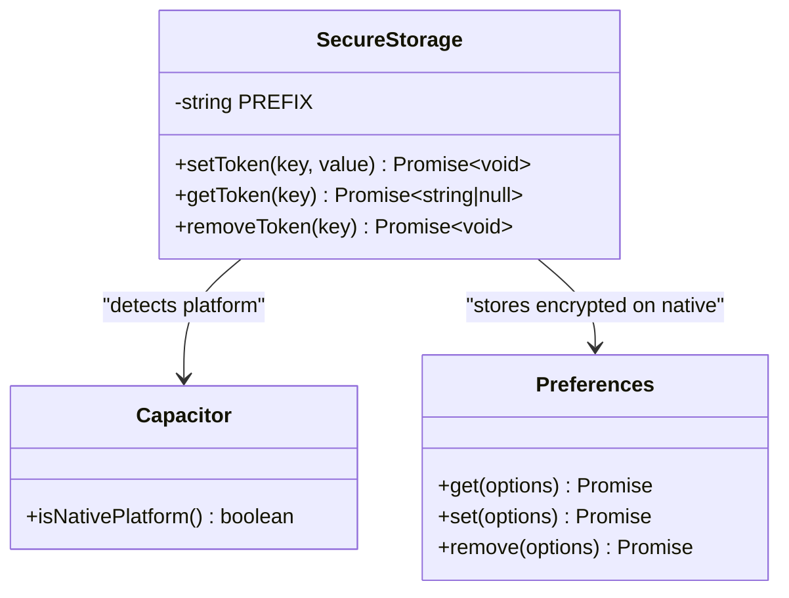
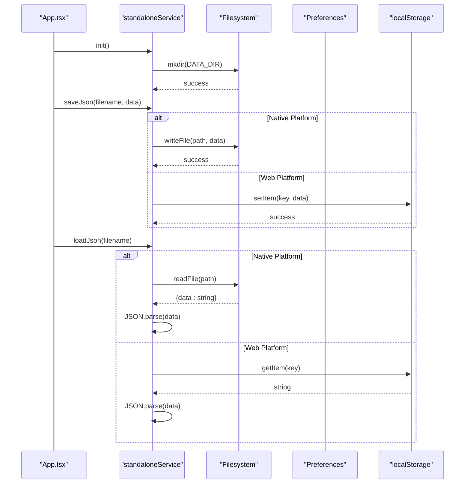
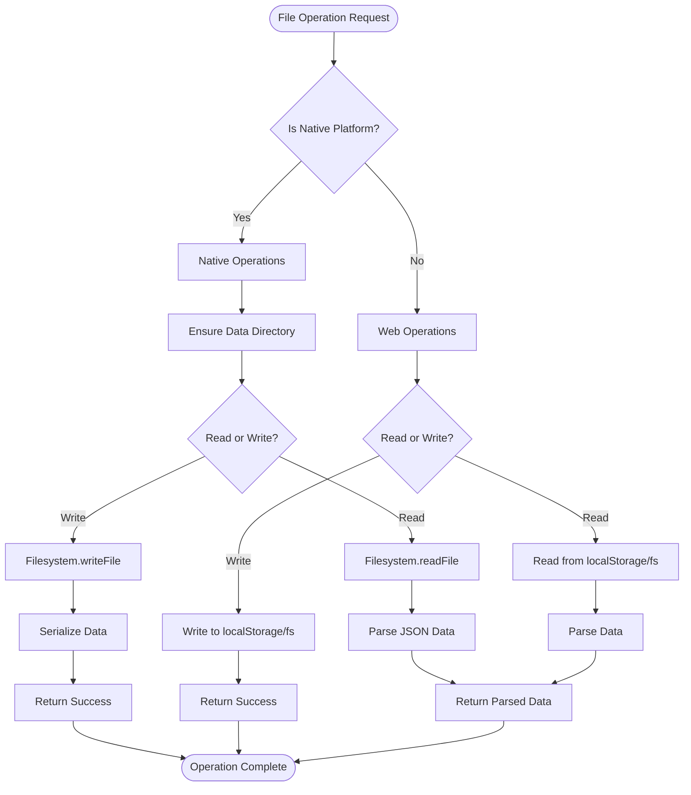
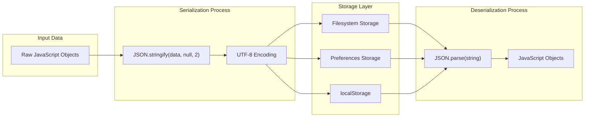
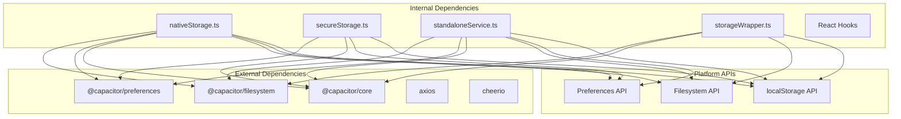
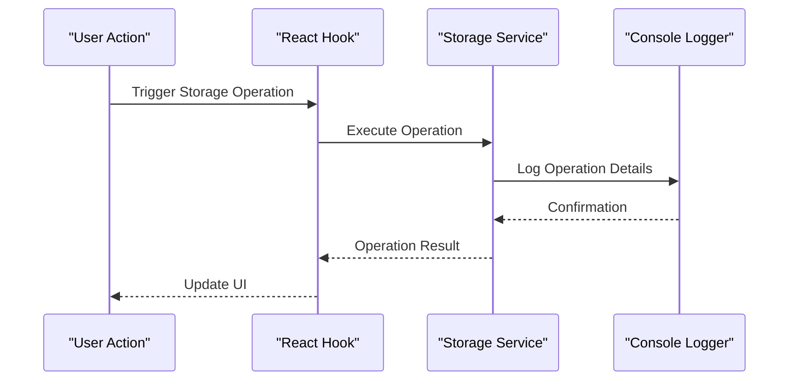

# Native Storage System

<cite>
**Referenced Files in This Document**
- [nativeStorage.ts](file://src/services/nativeStorage.ts)
- [secureStorage.ts](file://src/services/secureStorage.ts)
- [standaloneService.ts](file://src/services/standaloneService.ts)
- [storageWrapper.ts](file://src/services/storageWrapper.ts)
- [useBotSettings.ts](file://src/hooks/useBotSettings.ts)
- [useDrafts.ts](file://src/hooks/useDrafts.ts)
- [App.tsx](file://src/App.tsx)
- [types.ts](file://src/types.ts)
- [package.json](file://package.json)
- [capacitor.config.ts](file://capacitor.config.ts)
</cite>

## Table of Contents
1. [Introduction](#introduction)
2. [Project Structure](#project-structure)
3. [Core Components](#core-components)
4. [Architecture Overview](#architecture-overview)
5. [Detailed Component Analysis](#detailed-component-analysis)
6. [Dependency Analysis](#dependency-analysis)
7. [Performance Considerations](#performance-considerations)
8. [Troubleshooting Guide](#troubleshooting-guide)
9. [Conclusion](#conclusion)

## Introduction
This document provides comprehensive documentation for the native storage system implementation, covering both standard native storage and secure storage mechanisms. It explains the storage abstraction layer, data persistence strategies, cross-platform compatibility approaches, and secure storage implementation for sensitive data protection. The documentation includes practical examples, performance optimization techniques, and troubleshooting guidance for storage-related issues.

## Project Structure
The storage system is implemented across several services and hooks, with integration points in the main application component. The key files include:

- Storage services: nativeStorage.ts, secureStorage.ts, standaloneService.ts, storageWrapper.ts
- Hooks: useBotSettings.ts, useDrafts.ts
- Application integration: App.tsx
- Types: types.ts
- Dependencies: package.json, capacitor.config.ts

**Diagram sources**
- [nativeStorage.ts:1-63](file://src/services/nativeStorage.ts#L1-L63)
- [secureStorage.ts:1-40](file://src/services/secureStorage.ts#L1-L40)
- [standaloneService.ts:1-175](file://src/services/standaloneService.ts#L1-L175)
- [storageWrapper.ts:1-100](file://src/services/storageWrapper.ts#L1-L100)
- [useBotSettings.ts:1-56](file://src/hooks/useBotSettings.ts#L1-L56)
- [useDrafts.ts:1-88](file://src/hooks/useDrafts.ts#L1-L88)
- [App.tsx:1-1888](file://src/App.tsx#L1-L1888)
- [types.ts:1-48](file://src/types.ts#L1-L48)

**Section sources**
- [nativeStorage.ts:1-63](file://src/services/nativeStorage.ts#L1-L63)
- [secureStorage.ts:1-40](file://src/services/secureStorage.ts#L1-L40)
- [standaloneService.ts:1-175](file://src/services/standaloneService.ts#L1-L175)
- [storageWrapper.ts:1-100](file://src/services/storageWrapper.ts#L1-L100)
- [useBotSettings.ts:1-56](file://src/hooks/useBotSettings.ts#L1-L56)
- [useDrafts.ts:1-88](file://src/hooks/useDrafts.ts#L1-L88)
- [App.tsx:1-1888](file://src/App.tsx#L1-L1888)
- [types.ts:1-48](file://src/types.ts#L1-L48)

## Core Components
The storage system consists of four primary components:

1. **nativeStorage**: Provides file-based JSON storage for non-sensitive data with platform-specific handling
2. **secureStorage**: Implements encrypted storage for sensitive credentials using Capacitor Preferences
3. **standaloneService**: Offers comprehensive file and preference management for offline mode
4. **storageWrapper**: Provides a unified interface for file operations across platforms

Each component handles both native (Android/iOS) and web environments differently, ensuring consistent behavior across platforms.

**Section sources**
- [nativeStorage.ts:8-62](file://src/services/nativeStorage.ts#L8-L62)
- [secureStorage.ts:4-39](file://src/services/secureStorage.ts#L4-L39)
- [standaloneService.ts:11-72](file://src/services/standaloneService.ts#L11-L72)
- [storageWrapper.ts:9-99](file://src/services/storageWrapper.ts#L9-L99)

## Architecture Overview
The storage architecture follows a layered approach with clear separation of concerns:

**Diagram sources**
- [App.tsx:16-25](file://src/App.tsx#L16-L25)
- [nativeStorage.ts:1-3](file://src/services/nativeStorage.ts#L1-L3)
- [secureStorage.ts:1-2](file://src/services/secureStorage.ts#L1-L2)
- [standaloneService.ts:1-6](file://src/services/standaloneService.ts#L1-L6)
- [storageWrapper.ts:1-4](file://src/services/storageWrapper.ts#L1-L4)

## Detailed Component Analysis

### Native Storage Implementation
The native storage service provides file-based JSON storage with automatic platform detection:

**Diagram sources**
- [nativeStorage.ts:8-62](file://src/services/nativeStorage.ts#L8-L62)

Key features:
- Automatic directory creation for native platforms
- JSON serialization/deserialization for structured data
- Fallback to localStorage for web environments
- Token and chat ID management via Preferences API

**Section sources**
- [nativeStorage.ts:8-62](file://src/services/nativeStorage.ts#L8-L62)

### Secure Storage Implementation
The secure storage service implements encrypted credential storage:

**Diagram sources**
- [secureStorage.ts:4-39](file://src/services/secureStorage.ts#L4-L39)

Security characteristics:
- Prefix-based key separation for organized storage
- Native platform encryption via Preferences API
- Web environment warning for unencrypted localStorage usage
- Consistent API across platforms

**Section sources**
- [secureStorage.ts:4-39](file://src/services/secureStorage.ts#L4-L39)

### Standalone Service Architecture
The standalone service provides comprehensive offline storage capabilities:

**Diagram sources**
- [standaloneService.ts:11-72](file://src/services/standaloneService.ts#L11-L72)
- [App.tsx:539-570](file://src/App.tsx#L539-L570)

**Section sources**
- [standaloneService.ts:11-72](file://src/services/standaloneService.ts#L11-L72)
- [App.tsx:539-570](file://src/App.tsx#L539-L570)

### Storage Wrapper Functionality
The storage wrapper provides a unified interface for file operations:

**Diagram sources**
- [storageWrapper.ts:9-99](file://src/services/storageWrapper.ts#L9-L99)

**Section sources**
- [storageWrapper.ts:9-99](file://src/services/storageWrapper.ts#L9-L99)

### Data Serialization and Deserialization
The system implements robust data serialization across multiple components:

**Diagram sources**
- [nativeStorage.ts:37-42](file://src/services/nativeStorage.ts#L37-L42)
- [standaloneService.ts:28-32](file://src/services/standaloneService.ts#L28-L32)
- [storageWrapper.ts:41-46](file://src/services/storageWrapper.ts#L41-L46)

**Section sources**
- [nativeStorage.ts:16-46](file://src/services/nativeStorage.ts#L16-L46)
- [standaloneService.ts:25-54](file://src/services/standaloneService.ts#L25-L54)
- [storageWrapper.ts:10-54](file://src/services/storageWrapper.ts#L10-L54)

## Dependency Analysis
The storage system has minimal external dependencies, relying primarily on Capacitor APIs:

**Diagram sources**
- [package.json:19-55](file://package.json#L19-L55)
- [nativeStorage.ts:1-3](file://src/services/nativeStorage.ts#L1-L3)
- [secureStorage.ts:1-2](file://src/services/secureStorage.ts#L1-L2)
- [standaloneService.ts:1-6](file://src/services/standaloneService.ts#L1-L6)
- [storageWrapper.ts:1-4](file://src/services/storageWrapper.ts#L1-L4)

**Section sources**
- [package.json:19-55](file://package.json#L19-L55)
- [nativeStorage.ts:1-3](file://src/services/nativeStorage.ts#L1-L3)
- [secureStorage.ts:1-2](file://src/services/secureStorage.ts#L1-L2)
- [standaloneService.ts:1-6](file://src/services/standaloneService.ts#L1-L6)
- [storageWrapper.ts:1-4](file://src/services/storageWrapper.ts#L1-L4)

## Performance Considerations
The storage system implements several optimization strategies:

1. **Asynchronous Operations**: All storage operations are asynchronous to prevent UI blocking
2. **Platform Detection**: Automatic platform detection avoids unnecessary API calls
3. **Directory Caching**: Ensures data directories exist only when needed
4. **Error Recovery**: Graceful fallback to default values prevents application crashes
5. **Memory Management**: Proper cleanup of file handles and API connections

Best practices for optimal performance:
- Batch multiple writes into single operations when possible
- Use appropriate data structures to minimize serialization overhead
- Implement proper error handling for network failures
- Consider implementing caching for frequently accessed data
- Monitor file sizes to prevent excessive memory usage

## Troubleshooting Guide

### Common Storage Issues

**Permission Denied Errors**
- Verify filesystem permissions on Android devices
- Check that external storage permissions are granted
- Ensure proper directory paths are used for file operations

**Data Corruption**
- Implement proper JSON validation before deserialization
- Use try-catch blocks around storage operations
- Consider implementing checksums for critical data

**Cross-Platform Compatibility**
- Test both native and web environments thoroughly
- Handle platform-specific differences in file paths
- Ensure consistent API behavior across platforms

**Performance Issues**
- Monitor storage operation timing
- Implement debouncing for frequent writes
- Consider lazy loading for large datasets

**Section sources**
- [App.tsx:408-472](file://src/App.tsx#L408-L472)
- [standaloneService.ts:12-23](file://src/services/standaloneService.ts#L12-L23)

### Debugging Storage Operations
The application includes comprehensive logging for storage operations:

**Section sources**
- [App.tsx:532-535](file://src/App.tsx#L532-L535)
- [useDrafts.ts:24-26](file://src/hooks/useDrafts.ts#L24-L26)

## Conclusion
The native storage system provides a robust, cross-platform solution for data persistence with clear separation between standard and secure storage mechanisms. The implementation leverages Capacitor's native APIs while maintaining compatibility with web environments. The modular architecture allows for easy maintenance and extension, while the comprehensive error handling ensures reliable operation across different platforms and scenarios.

The system successfully balances security, performance, and usability, making it suitable for production applications requiring both offline capabilities and secure credential management.