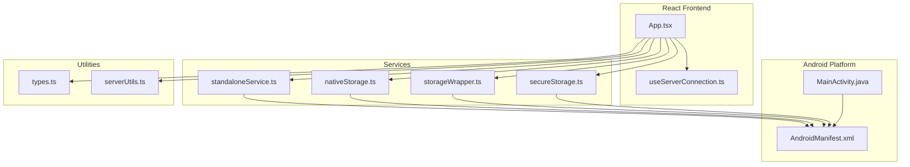
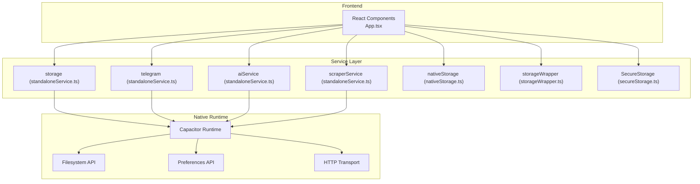
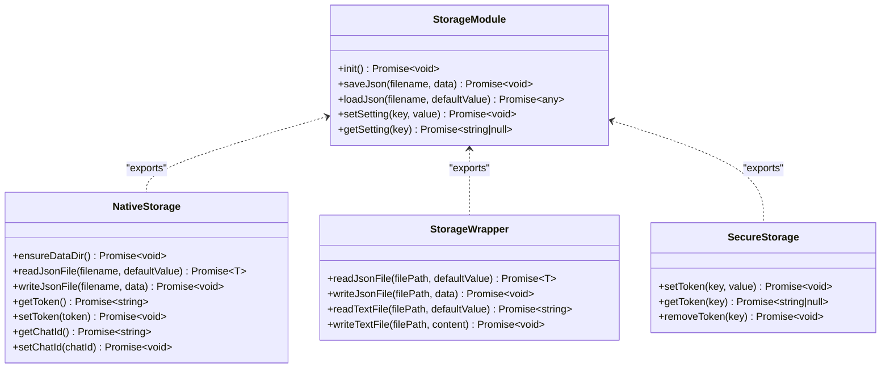
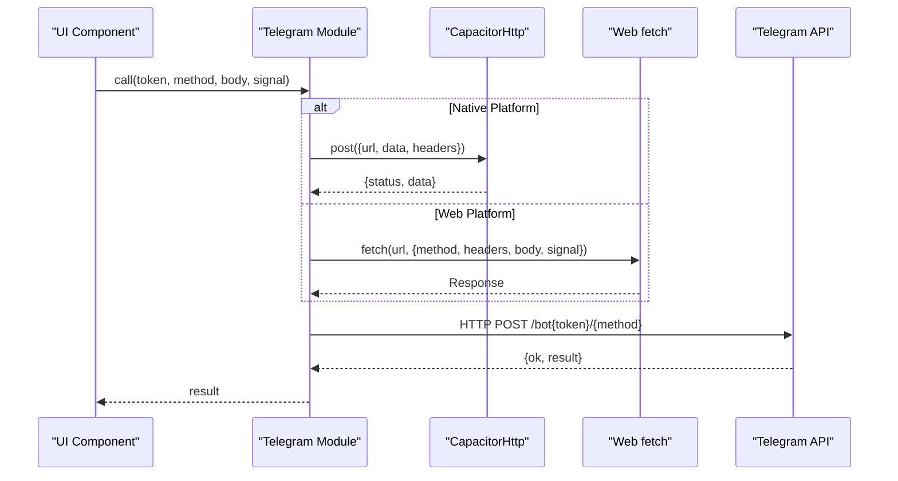
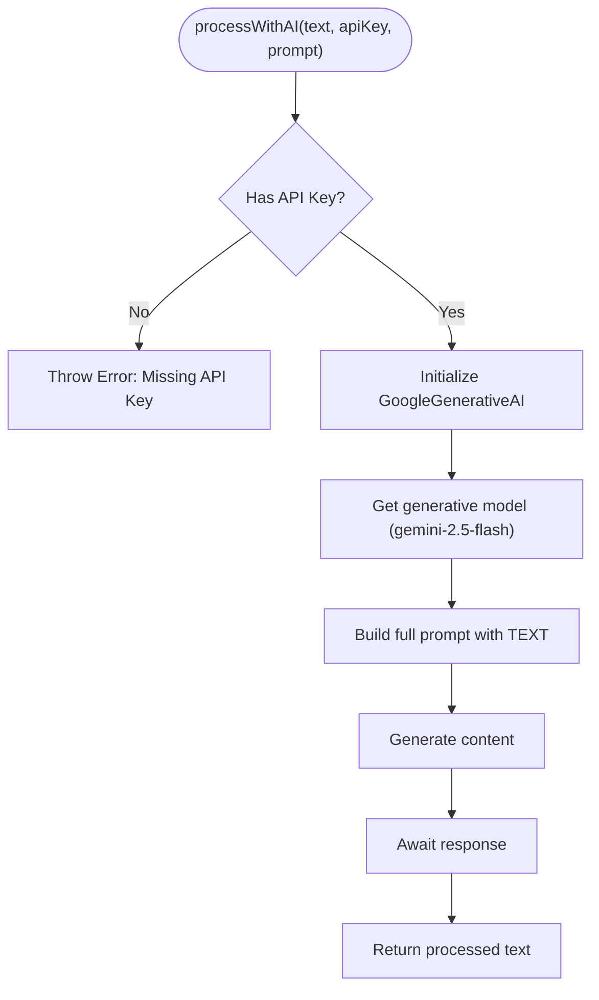
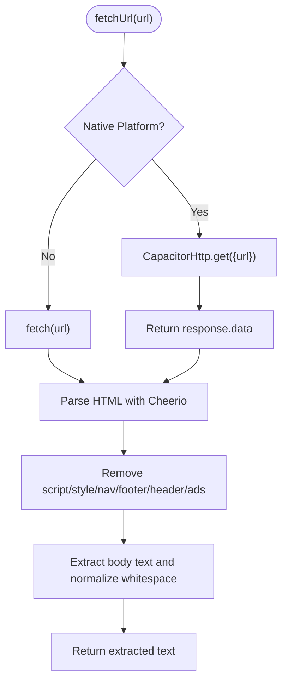
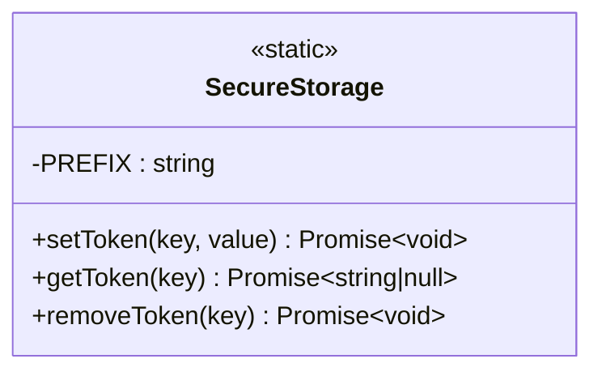
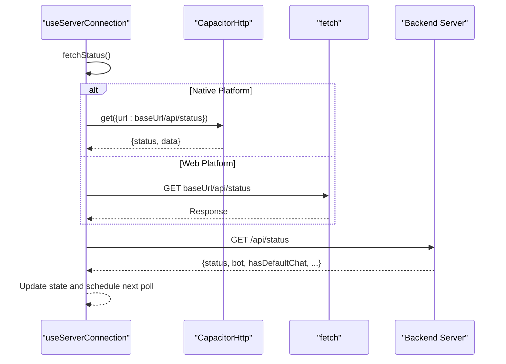
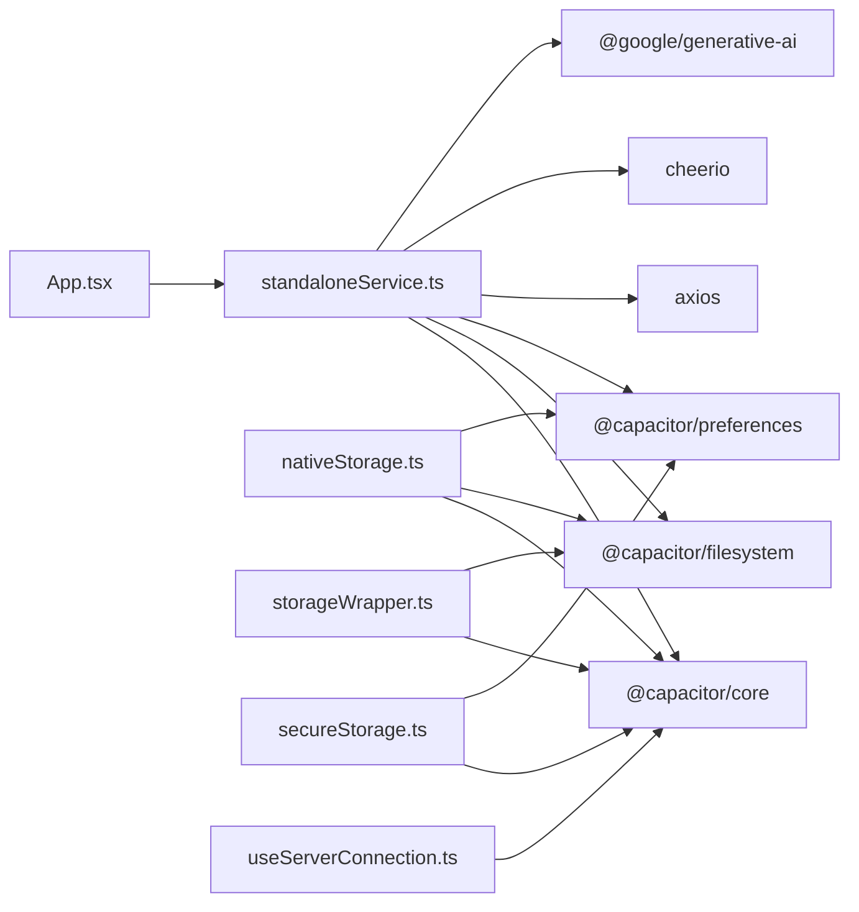

# Standalone Service Layer

<cite>
**Referenced Files in This Document**
- [standaloneService.ts](file://src/services/standaloneService.ts)
- [nativeStorage.ts](file://src/services/nativeStorage.ts)
- [storageWrapper.ts](file://src/services/storageWrapper.ts)
- [secureStorage.ts](file://src/services/secureStorage.ts)
- [useServerConnection.ts](file://src/hooks/useServerConnection.ts)
- [serverUtils.ts](file://src/serverUtils.ts)
- [types.ts](file://src/types.ts)
- [MainActivity.java](file://android/app/src/main/java/com/newsbot/manager/MainActivity.java)
- [AndroidManifest.xml](file://android/app/src/main/AndroidManifest.xml)
- [package.json](file://package.json)
- [App.tsx](file://src/App.tsx)
</cite>

## Table of Contents
1. [Introduction](#introduction)
2. [Project Structure](#project-structure)
3. [Core Components](#core-components)
4. [Architecture Overview](#architecture-overview)
5. [Detailed Component Analysis](#detailed-component-analysis)
6. [Dependency Analysis](#dependency-analysis)
7. [Performance Considerations](#performance-considerations)
8. [Troubleshooting Guide](#troubleshooting-guide)
9. [Conclusion](#conclusion)

## Introduction
This document describes the standalone service layer that bridges the React frontend with native device capabilities. It covers native storage integration, Telegram API direct calls, AI service coordination, and scraper service functionality. It explains service wrapper patterns for cross-platform compatibility, method signatures, error handling strategies, integration with native Android components, HTTP request handling, and file system operations. Practical usage examples, performance considerations, troubleshooting guidance, and service lifecycle management are included.

## Project Structure
The standalone service layer is implemented primarily in TypeScript under the `src/services` directory, with complementary hooks and Android platform integration under `android/app/src/main`.

**Diagram sources**
- [standaloneService.ts:1-175](file://src/services/standaloneService.ts#L1-L175)
- [nativeStorage.ts:1-63](file://src/services/nativeStorage.ts#L1-L63)
- [storageWrapper.ts:1-100](file://src/services/storageWrapper.ts#L1-L100)
- [secureStorage.ts:1-40](file://src/services/secureStorage.ts#L1-L40)
- [useServerConnection.ts:1-52](file://src/hooks/useServerConnection.ts#L1-L52)
- [MainActivity.java:1-6](file://android/app/src/main/java/com/newsbot/manager/MainActivity.java#L1-L6)
- [AndroidManifest.xml:1-46](file://android/app/src/main/AndroidManifest.xml#L1-L46)
- [types.ts:1-48](file://src/types.ts#L1-L48)
- [serverUtils.ts:1-23](file://src/serverUtils.ts#L1-L23)
- [App.tsx:168-800](file://src/App.tsx#L168-L800)

**Section sources**
- [standaloneService.ts:1-175](file://src/services/standaloneService.ts#L1-L175)
- [nativeStorage.ts:1-63](file://src/services/nativeStorage.ts#L1-L63)
- [storageWrapper.ts:1-100](file://src/services/storageWrapper.ts#L1-L100)
- [secureStorage.ts:1-40](file://src/services/secureStorage.ts#L1-L40)
- [useServerConnection.ts:1-52](file://src/hooks/useServerConnection.ts#L1-L52)
- [MainActivity.java:1-6](file://android/app/src/main/java/com/newsbot/manager/MainActivity.java#L1-L6)
- [AndroidManifest.xml:1-46](file://android/app/src/main/AndroidManifest.xml#L1-L46)
- [types.ts:1-48](file://src/types.ts#L1-L48)
- [serverUtils.ts:1-23](file://src/serverUtils.ts#L1-L23)
- [App.tsx:168-800](file://src/App.tsx#L168-L800)

## Core Components
- Storage abstraction with dual-mode support for native and web environments
- Telegram API client with platform-aware HTTP transport
- AI service integration for content processing
- Scraper service for fetching and extracting content
- Secure storage wrapper for sensitive credentials
- Server connection hook for monitoring backend health

Key responsibilities:
- Provide unified APIs for file system, preferences, HTTP, and AI operations
- Maintain cross-platform compatibility using Capacitor runtime detection
- Offer robust error handling and graceful fallbacks
- Manage service lifecycle and resource cleanup

**Section sources**
- [standaloneService.ts:11-175](file://src/services/standaloneService.ts#L11-L175)
- [nativeStorage.ts:8-63](file://src/services/nativeStorage.ts#L8-L63)
- [storageWrapper.ts:9-100](file://src/services/storageWrapper.ts#L9-L100)
- [secureStorage.ts:4-40](file://src/services/secureStorage.ts#L4-L40)
- [useServerConnection.ts:15-52](file://src/hooks/useServerConnection.ts#L15-L52)

## Architecture Overview
The standalone service layer orchestrates four primary subsystems:
- Native storage: file system and preferences
- Telegram API: direct HTTP calls with platform-specific transport
- AI service: Gemini integration for content processing
- Scraper service: HTTP fetching and HTML parsing

**Diagram sources**
- [standaloneService.ts:11-175](file://src/services/standaloneService.ts#L11-L175)
- [nativeStorage.ts:8-63](file://src/services/nativeStorage.ts#L8-L63)
- [storageWrapper.ts:9-100](file://src/services/storageWrapper.ts#L9-L100)
- [secureStorage.ts:4-40](file://src/services/secureStorage.ts#L4-L40)
- [App.tsx:15-29](file://src/App.tsx#L15-L29)

## Detailed Component Analysis

### Storage Abstraction
The storage module provides a unified interface for file system and preference operations across platforms. It detects native mode and routes operations accordingly.

Key behaviors:
- Native mode creates a dedicated documents/data directory for app data
- Web mode falls back to browser storage
- JSON serialization/deserialization with UTF-8 encoding
- Graceful error handling with default values

**Diagram sources**
- [standaloneService.ts:11-72](file://src/services/standaloneService.ts#L11-L72)
- [nativeStorage.ts:8-63](file://src/services/nativeStorage.ts#L8-L63)
- [storageWrapper.ts:9-100](file://src/services/storageWrapper.ts#L9-L100)
- [secureStorage.ts:4-40](file://src/services/secureStorage.ts#L4-L40)

**Section sources**
- [standaloneService.ts:11-72](file://src/services/standaloneService.ts#L11-L72)
- [nativeStorage.ts:8-63](file://src/services/nativeStorage.ts#L8-L63)
- [storageWrapper.ts:9-100](file://src/services/storageWrapper.ts#L9-L100)
- [secureStorage.ts:4-40](file://src/services/secureStorage.ts#L4-L40)

### Telegram API Client
The Telegram client encapsulates direct API calls with platform-aware HTTP transport and convenience methods for common operations.

Supported operations:
- getMe, sendMessage, sendPhoto, sendMediaGroup, getUpdates
- Automatic parse_mode injection for HTML content
- Timeout configuration for long polling

**Diagram sources**
- [standaloneService.ts:75-146](file://src/services/standaloneService.ts#L75-L146)

**Section sources**
- [standaloneService.ts:75-146](file://src/services/standaloneService.ts#L75-L146)

### AI Service Coordination
The AI service integrates with Google Generative AI to process text according to a provided prompt.

**Diagram sources**
- [standaloneService.ts:148-159](file://src/services/standaloneService.ts#L148-L159)

**Section sources**
- [standaloneService.ts:148-159](file://src/services/standaloneService.ts#L148-L159)

### Scraper Service
The scraper service performs HTTP requests and content extraction using Cheerio.

**Diagram sources**
- [standaloneService.ts:161-174](file://src/services/standaloneService.ts#L161-L174)

**Section sources**
- [standaloneService.ts:161-174](file://src/services/standaloneService.ts#L161-L174)

### Secure Storage Wrapper
The secure storage wrapper provides encrypted storage on native platforms and warns on web.

Behavior:
- Prefixes keys to avoid collisions
- Uses Preferences API on native (encrypted on modern devices)
- Warns and falls back to localStorage on web

**Diagram sources**
- [secureStorage.ts:4-40](file://src/services/secureStorage.ts#L4-L40)

**Section sources**
- [secureStorage.ts:4-40](file://src/services/secureStorage.ts#L4-L40)

### Server Connection Hook
The server connection hook monitors backend health using CapacitorHttp on native and fetch on web.

**Diagram sources**
- [useServerConnection.ts:15-52](file://src/hooks/useServerConnection.ts#L15-L52)

**Section sources**
- [useServerConnection.ts:15-52](file://src/hooks/useServerConnection.ts#L15-L52)

## Dependency Analysis
External dependencies relevant to the service layer:
- Capacitor core and plugins for native capabilities
- Axios for HTTP requests
- Cheerio for HTML parsing
- Google Generative AI SDK for AI processing

**Diagram sources**
- [package.json:19-56](file://package.json#L19-L56)
- [standaloneService.ts:1-7](file://src/services/standaloneService.ts#L1-L7)
- [nativeStorage.ts:1-3](file://src/services/nativeStorage.ts#L1-L3)
- [storageWrapper.ts:1-5](file://src/services/storageWrapper.ts#L1-L5)
- [secureStorage.ts:1-2](file://src/services/secureStorage.ts#L1-L2)
- [useServerConnection.ts:1-3](file://src/hooks/useServerConnection.ts#L1-L3)

**Section sources**
- [package.json:19-56](file://package.json#L19-L56)
- [standaloneService.ts:1-7](file://src/services/standaloneService.ts#L1-L7)
- [nativeStorage.ts:1-3](file://src/services/nativeStorage.ts#L1-L3)
- [storageWrapper.ts:1-5](file://src/services/storageWrapper.ts#L1-L5)
- [secureStorage.ts:1-2](file://src/services/secureStorage.ts#L1-L2)
- [useServerConnection.ts:1-3](file://src/hooks/useServerConnection.ts#L1-L3)

## Performance Considerations
- Prefer CapacitorHttp on native for better network stack integration and reduced overhead compared to fetch polyfills.
- Use timeouts and cancellation to prevent hanging requests during polling or long-running operations.
- Minimize file I/O by batching writes and avoiding frequent small reads/writes.
- Cache frequently accessed settings and tokens to reduce repeated preference reads.
- Normalize and trim extracted text to reduce payload sizes for downstream processing.
- Avoid blocking UI threads during heavy operations; leverage async/await and background processing where appropriate.

## Troubleshooting Guide
Common issues and resolutions:
- Network errors on Android: Ensure internet permission is declared and cleartext traffic is allowed if needed. Verify CapacitorHttp configuration and timeouts.
- Storage permission failures: Request and check public storage permissions before accessing external storage directories.
- Telegram API conflicts: Handle 409 conflicts gracefully; avoid running multiple instances of the standalone bot simultaneously.
- CORS issues: On native, use CapacitorHttp to bypass CORS restrictions; on web, configure backend CORS policies.
- JSON parsing errors: Implement robust error handling with default values and logging to diagnose malformed data.
- AI key validation: Ensure API keys are present before invoking AI processing; handle invalid or expired keys gracefully.
- File system directory creation: Handle exceptions when creating directories; ensure recursive creation is attempted and existing directories are tolerated.

**Section sources**
- [standaloneService.ts:11-72](file://src/services/standaloneService.ts#L11-L72)
- [standaloneService.ts:75-146](file://src/services/standaloneService.ts#L75-L146)
- [standaloneService.ts:161-174](file://src/services/standaloneService.ts#L161-L174)
- [nativeStorage.ts:8-63](file://src/services/nativeStorage.ts#L8-L63)
- [storageWrapper.ts:9-100](file://src/services/storageWrapper.ts#L9-L100)
- [secureStorage.ts:4-40](file://src/services/secureStorage.ts#L4-L40)
- [useServerConnection.ts:15-52](file://src/hooks/useServerConnection.ts#L15-L52)

## Conclusion
The standalone service layer provides a cohesive bridge between the React frontend and native device capabilities. It offers platform-aware storage, HTTP transport, AI processing, and scraping functionality, with careful error handling and lifecycle management. By leveraging Capacitor APIs and maintaining cross-platform compatibility, it enables reliable operation across environments while preserving performance and usability.