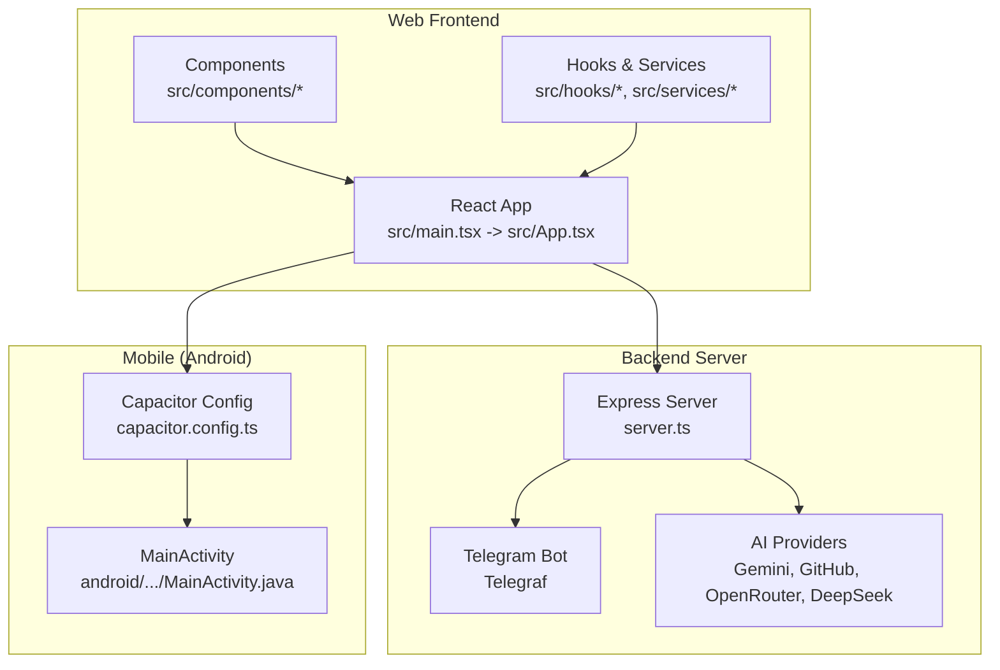
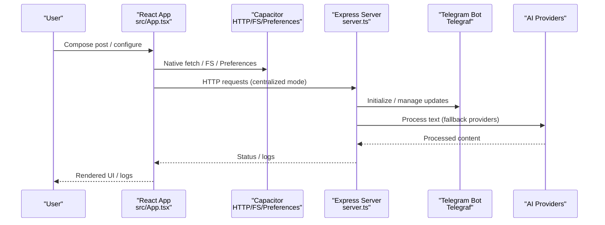
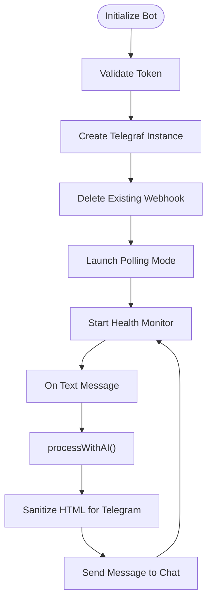
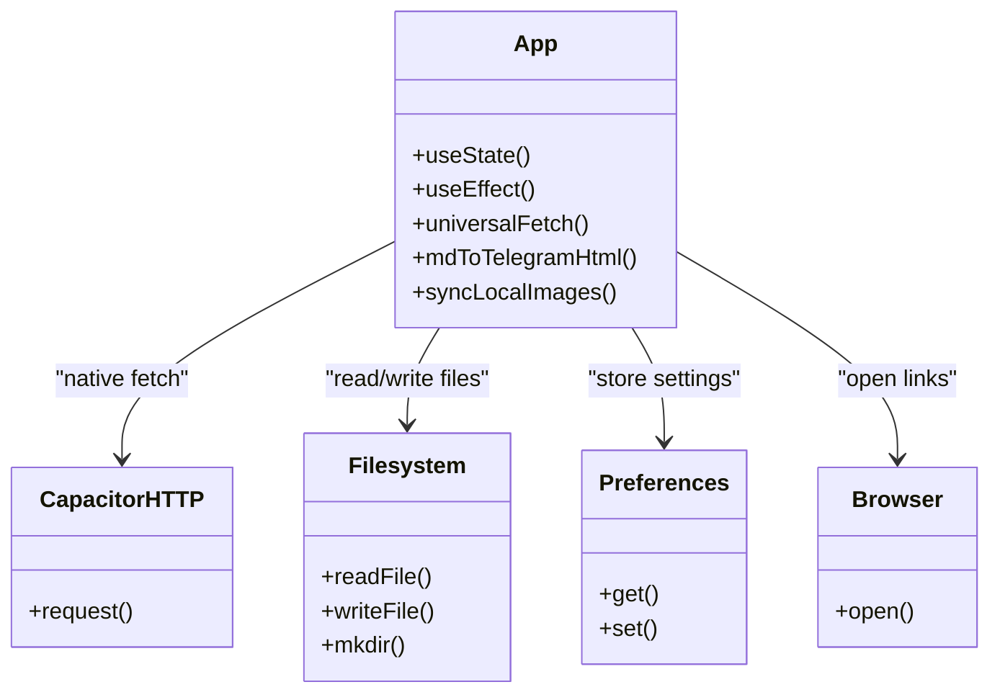
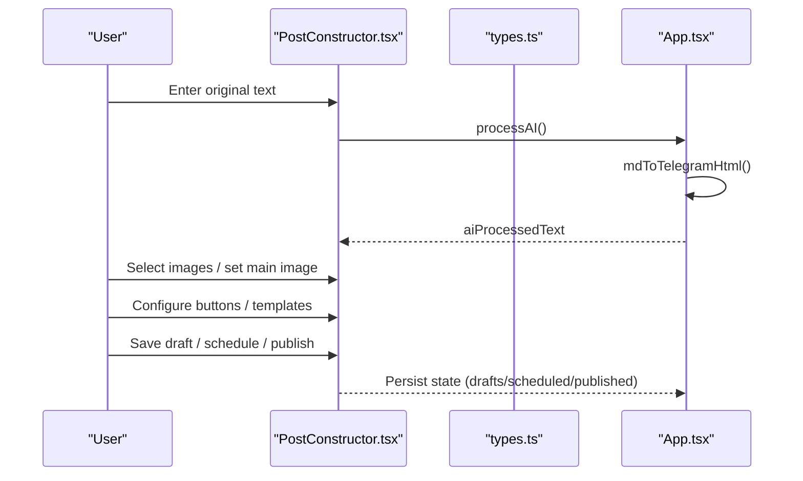
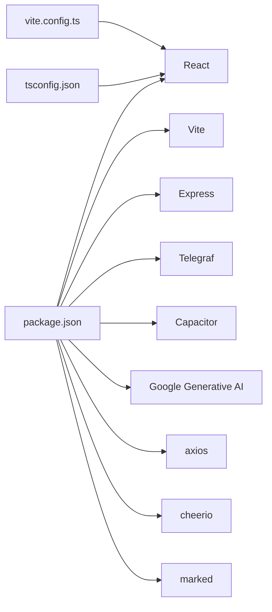

# Project Overview

<cite>
**Referenced Files in This Document**
- [README.md](file://README.md)
- [package.json](file://package.json)
- [capacitor.config.ts](file://capacitor.config.ts)
- [server.ts](file://server.ts)
- [src/main.tsx](file://src/main.tsx)
- [src/App.tsx](file://src/App.tsx)
- [src/types.ts](file://src/types.ts)
- [src/services/standaloneService.ts](file://src/services/standaloneService.ts)
- [src/hooks/useServerConnection.ts](file://src/hooks/useServerConnection.ts)
- [src/components/PostConstructor.tsx](file://src/components/PostConstructor.tsx)
- [.codex/environments/environment.toml](file://.codex/environments/environment.toml)
- [vite.config.ts](file://vite.config.ts)
- [tsconfig.json](file://tsconfig.json)
- [android/app/src/main/java/com/newsbot/manager/MainActivity.java](file://android/app/src/main/java/com/newsbot/manager/MainActivity.java)
</cite>

## Table of Contents
1. [Introduction](#introduction)
2. [Project Structure](#project-structure)
3. [Core Components](#core-components)
4. [Architecture Overview](#architecture-overview)
5. [Detailed Component Analysis](#detailed-component-analysis)
6. [Dependency Analysis](#dependency-analysis)
7. [Performance Considerations](#performance-considerations)
8. [Troubleshooting Guide](#troubleshooting-guide)
9. [Conclusion](#conclusion)

## Introduction
AI News Bot is an AI-powered news aggregation and Telegram channel publishing platform designed to automate content creation and distribution. It combines a modern React-based web/mobile frontend, a TypeScript/Express backend, and Capacitor for cross-platform mobile integration. The system supports AI-driven content processing, Telegram bot orchestration, multi-platform content management, and streamlined cross-platform deployment.

Key goals:
- Automate news content processing and formatting for Telegram channels
- Provide a unified authoring experience across desktop and mobile
- Enable standalone operation on devices and centralized operation via a backend server
- Deliver robust cross-platform deployment with a single codebase

## Project Structure
The repository follows a hybrid architecture:
- Frontend: React SPA built with Vite and TailwindCSS, integrated with Capacitor for native capabilities
- Backend: Express server handling Telegram bot lifecycle, AI content processing, and persistent configuration
- Mobile: Android app built with Capacitor, embedding the web app and enabling native APIs

**Diagram sources**
- [src/main.tsx:1-11](file://src/main.tsx#L1-L11)
- [src/App.tsx:168-171](file://src/App.tsx#L168-L171)
- [server.ts:37-38](file://server.ts#L37-L38)
- [capacitor.config.ts:3-23](file://capacitor.config.ts#L3-L23)
- [android/app/src/main/java/com/newsbot/manager/MainActivity.java:1-6](file://android/app/src/main/java/com/newsbot/manager/MainActivity.java#L1-L6)

**Section sources**
- [README.md:1-25](file://README.md#L1-L25)
- [package.json:1-70](file://package.json#L1-L70)
- [capacitor.config.ts:1-26](file://capacitor.config.ts#L1-L26)
- [vite.config.ts:1-28](file://vite.config.ts#L1-L28)
- [tsconfig.json:1-27](file://tsconfig.json#L1-L27)

## Core Components
- React frontend with drag-and-drop, markdown editing, and real-time logging
- Capacitor integration for native device features and HTTP requests
- Express server with Telegraf-based Telegram bot, AI content processing, and persistent configuration
- Standalone service layer for native storage, Telegram API calls, and scraping utilities
- Hooks for server connectivity and state management

Key capabilities:
- AI content processing with multiple providers and fallback logic
- Telegram bot lifecycle management and message routing
- Drafts, scheduling, and published posts management
- Cross-platform deployment via Capacitor and Vite

**Section sources**
- [src/App.tsx:168-171](file://src/App.tsx#L168-L171)
- [src/services/standaloneService.ts:1-175](file://src/services/standaloneService.ts#L1-L175)
- [server.ts:412-645](file://server.ts#L412-L645)
- [src/hooks/useServerConnection.ts:1-52](file://src/hooks/useServerConnection.ts#L1-L52)

## Architecture Overview
The system operates in two modes:
- Centralized server mode: React app communicates with Express backend over HTTP
- Standalone mode: React app runs natively on device using Capacitor APIs and local storage

**Diagram sources**
- [src/App.tsx:194-251](file://src/App.tsx#L194-L251)
- [src/services/standaloneService.ts:74-146](file://src/services/standaloneService.ts#L74-L146)
- [server.ts:688-799](file://server.ts#L688-L799)
- [server.ts:412-645](file://server.ts#L412-L645)

## Detailed Component Analysis

### Telegram Bot Lifecycle and AI Processing
The backend manages a Telegraf-based Telegram bot with health monitoring, polling, and error handling. AI processing supports multiple providers with fallback logic and rate limiting.

**Diagram sources**
- [server.ts:688-799](file://server.ts#L688-L799)
- [server.ts:412-645](file://server.ts#L412-L645)
- [server.ts:284-340](file://server.ts#L284-L340)

**Section sources**
- [server.ts:24-33](file://server.ts#L24-L33)
- [server.ts:412-645](file://server.ts#L412-L645)
- [server.ts:688-799](file://server.ts#L688-L799)

### React Frontend and Capacitor Integration
The React app renders the UI, manages state, and routes network requests. Capacitor enables native HTTP, filesystem, and preferences access, with a fallback to browser fetch for web.

**Diagram sources**
- [src/App.tsx:194-251](file://src/App.tsx#L194-L251)
- [src/App.tsx:401-522](file://src/App.tsx#L401-L522)
- [src/services/standaloneService.ts:11-72](file://src/services/standaloneService.ts#L11-L72)

**Section sources**
- [src/App.tsx:194-251](file://src/App.tsx#L194-L251)
- [src/App.tsx:401-522](file://src/App.tsx#L401-L522)
- [src/services/standaloneService.ts:11-72](file://src/services/standaloneService.ts#L11-L72)

### Post Construction and Content Management
The Post Constructor component provides a structured authoring experience with markdown editing, image selection, and button templates.

**Diagram sources**
- [src/components/PostConstructor.tsx:1-200](file://src/components/PostConstructor.tsx#L1-L200)
- [src/types.ts:1-48](file://src/types.ts#L1-L48)
- [src/App.tsx:307-336](file://src/App.tsx#L307-L336)

**Section sources**
- [src/components/PostConstructor.tsx:1-200](file://src/components/PostConstructor.tsx#L1-L200)
- [src/types.ts:1-48](file://src/types.ts#L1-L48)
- [src/App.tsx:307-336](file://src/App.tsx#L307-L336)

### Conceptual Overview
The platform targets content creators, newsrooms, and teams who need automated, multichannel publishing. It supports:
- Multi-source content ingestion and AI-driven formatting
- Telegram channel publishing with rich media and interactive buttons
- Cross-device content management with drafts, schedules, and published history
- Flexible deployment across web, Android, and potentially other platforms

[No sources needed since this section doesn't analyze specific files]

## Dependency Analysis
The project leverages a cohesive set of libraries and frameworks:
- Frontend: React, Vite, TailwindCSS, DnD Kit, markdown editors
- Backend: Express, Telegraf, rate limiting, Cheerio, Marked
- AI: Google Generative AI, external provider integrations
- Mobile: Capacitor core and plugins for HTTP, filesystem, preferences, keyboard

**Diagram sources**
- [package.json:19-56](file://package.json#L19-L56)
- [vite.config.ts:6-27](file://vite.config.ts#L6-L27)
- [tsconfig.json:1-27](file://tsconfig.json#L1-L27)

**Section sources**
- [package.json:19-56](file://package.json#L19-L56)
- [vite.config.ts:6-27](file://vite.config.ts#L6-L27)
- [tsconfig.json:1-27](file://tsconfig.json#L1-L27)

## Performance Considerations
- Rate limiting: API and AI request limits prevent overload and quota exhaustion
- Streaming logs: Server-Sent Events for real-time logs on web; polling fallback on Android
- Image handling: Local filesystem scanning and Media Group sending for efficient media delivery
- Build and deployment: Vite-based build pipeline with Capacitor sync for Android

[No sources needed since this section provides general guidance]

## Troubleshooting Guide
Common operational checks:
- Verify environment variables for Telegram and AI providers
- Confirm server availability and token configuration
- Inspect logs via SSE (web) or polling (Android)
- Validate image path configuration and permissions (native)

**Section sources**
- [README.md:16-24](file://README.md#L16-L24)
- [server.ts:24-33](file://server.ts#L24-L33)
- [src/App.tsx:651-698](file://src/App.tsx#L651-L698)

## Conclusion
AI News Bot delivers a complete, cross-platform solution for automated news publishing. By combining a modern React frontend, a resilient Express backend, and Capacitor-powered mobile integration, it enables flexible deployment and robust content workflows. The system’s AI processing, Telegram bot orchestration, and multi-platform management make it suitable for diverse publishing needs.

[No sources needed since this section summarizes without analyzing specific files]