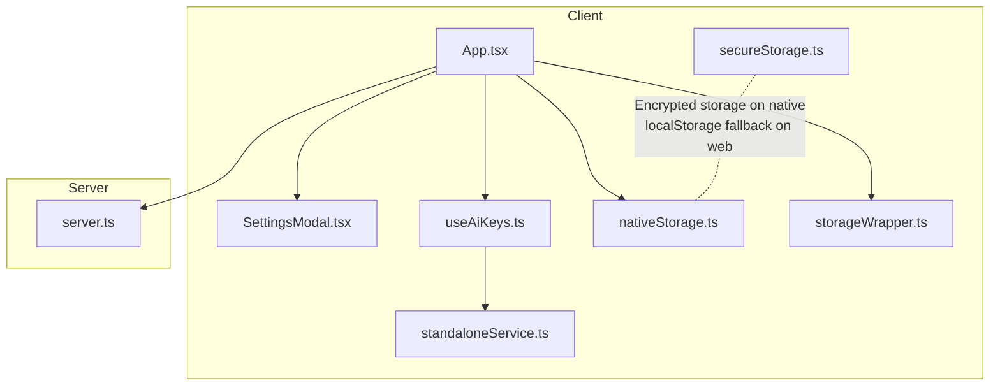
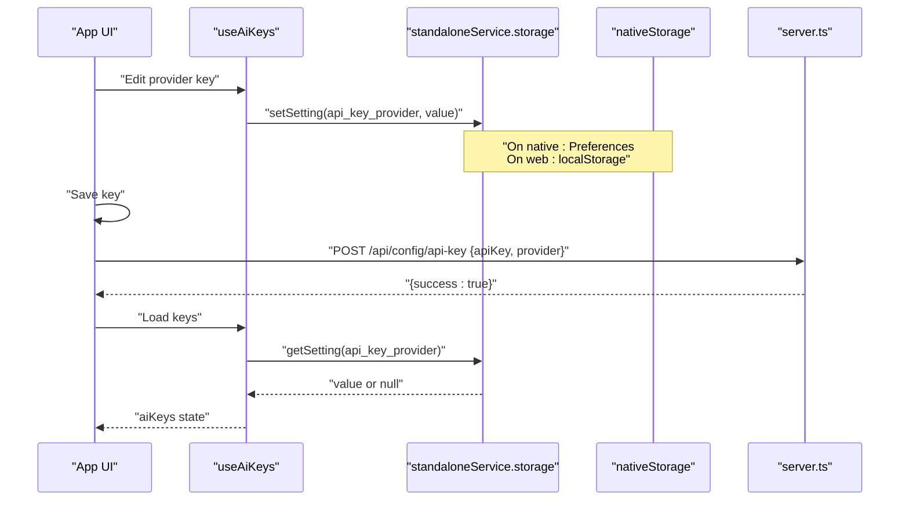
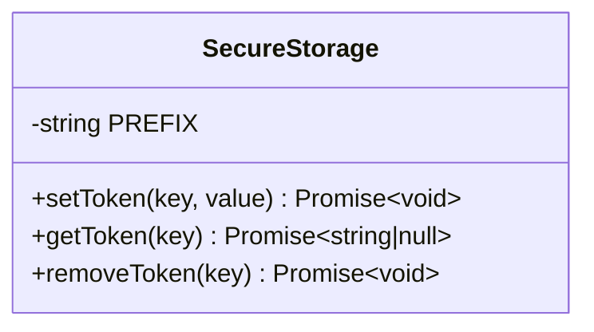
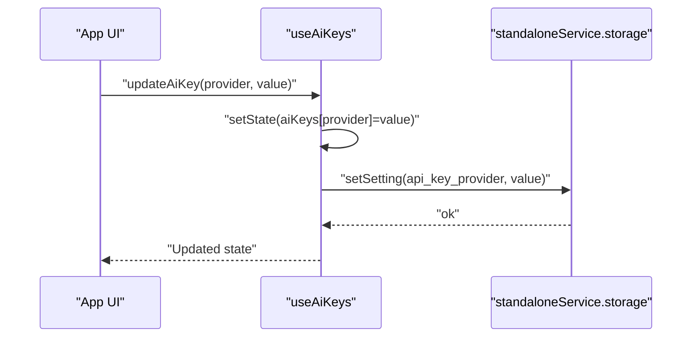
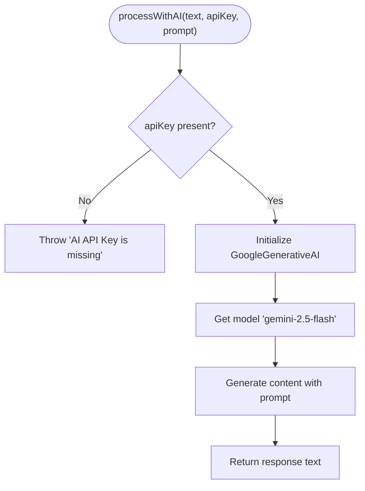
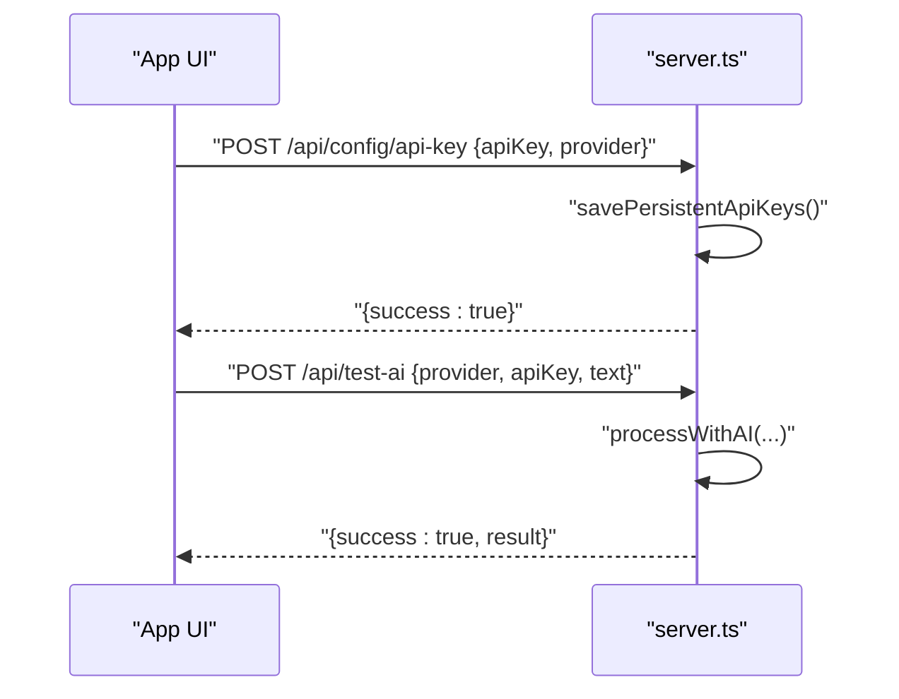
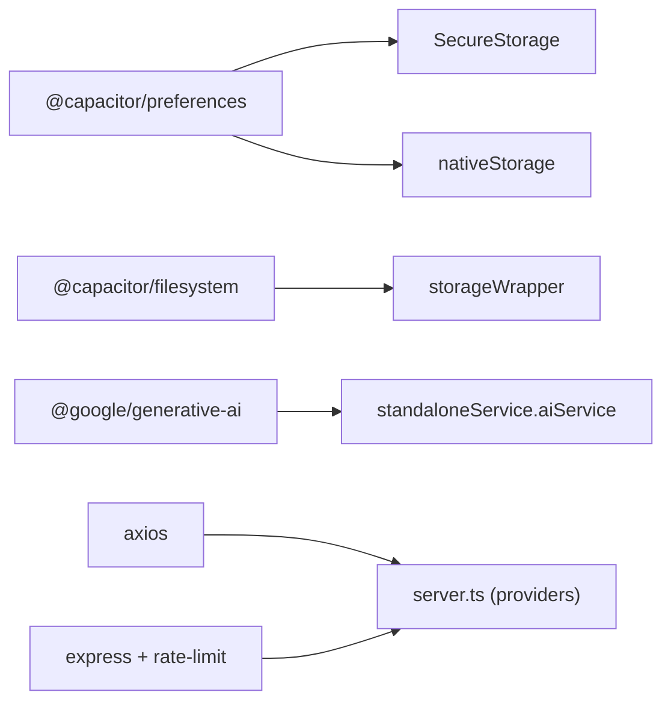

# API Key Management

<cite>
**Referenced Files in This Document**
- [secureStorage.ts](file://src/services/secureStorage.ts)
- [useAiKeys.ts](file://src/hooks/useAiKeys.ts)
- [standaloneService.ts](file://src/services/standaloneService.ts)
- [nativeStorage.ts](file://src/services/nativeStorage.ts)
- [storageWrapper.ts](file://src/services/storageWrapper.ts)
- [server.ts](file://server.ts)
- [App.tsx](file://src/App.tsx)
- [SettingsModal.tsx](file://src/components/SettingsModal.tsx)
- [package.json](file://package.json)
</cite>

## Table of Contents
1. [Introduction](#introduction)
2. [Project Structure](#project-structure)
3. [Core Components](#core-components)
4. [Architecture Overview](#architecture-overview)
5. [Detailed Component Analysis](#detailed-component-analysis)
6. [Dependency Analysis](#dependency-analysis)
7. [Performance Considerations](#performance-considerations)
8. [Troubleshooting Guide](#troubleshooting-guide)
9. [Conclusion](#conclusion)

## Introduction
This document explains the API key management system used to securely store and manage AI provider keys across native and browser environments. It covers:
- Secure storage implementation via a unified SecureStorage class
- Encrypted token handling on native platforms and browser fallbacks
- AI provider key configuration workflow for Gemini, GitHub, OpenRouter, and DeepSeek
- Key validation mechanisms and authentication flows
- Key rotation strategies, access control patterns, and provider-specific requirements
- Practical examples of setting up keys, interpreting validation errors, and troubleshooting common authentication issues
- Integration between the useAiKeys hook and storage services for persistence, retrieval, and removal

## Project Structure
The API key management spans client-side React hooks and services, plus server-side endpoints for persistent configuration and testing.

**Diagram sources**
- [App.tsx](file://src/App.tsx)
- [SettingsModal.tsx](file://src/components/SettingsModal.tsx)
- [useAiKeys.ts](file://src/hooks/useAiKeys.ts)
- [secureStorage.ts](file://src/services/secureStorage.ts)
- [standaloneService.ts](file://src/services/standaloneService.ts)
- [nativeStorage.ts](file://src/services/nativeStorage.ts)
- [storageWrapper.ts](file://src/services/storageWrapper.ts)
- [server.ts](file://server.ts)

**Section sources**
- [App.tsx](file://src/App.tsx)
- [SettingsModal.tsx](file://src/components/SettingsModal.tsx)
- [useAiKeys.ts](file://src/hooks/useAiKeys.ts)
- [secureStorage.ts](file://src/services/secureStorage.ts)
- [standaloneService.ts](file://src/services/standaloneService.ts)
- [nativeStorage.ts](file://src/services/nativeStorage.ts)
- [storageWrapper.ts](file://src/services/storageWrapper.ts)
- [server.ts](file://server.ts)

## Core Components
- SecureStorage: Provides a unified abstraction for storing tokens and keys with platform-aware encryption on native vs. browser fallback.
- useAiKeys: React hook that loads, updates, and persists AI provider keys for Gemini, GitHub, OpenRouter, and DeepSeek.
- standaloneService: Offers cross-platform storage APIs for settings and JSON documents, and an AI service for Gemini.
- nativeStorage: Dedicated preferences-based storage for bot tokens and chat IDs.
- storageWrapper: Cross-platform file system wrapper for JSON/text files.
- server.ts: Exposes endpoints to persist and validate API keys, and to test AI provider connectivity.

**Section sources**
- [secureStorage.ts](file://src/services/secureStorage.ts)
- [useAiKeys.ts](file://src/hooks/useAiKeys.ts)
- [standaloneService.ts](file://src/services/standaloneService.ts)
- [nativeStorage.ts](file://src/services/nativeStorage.ts)
- [storageWrapper.ts](file://src/services/storageWrapper.ts)
- [server.ts](file://server.ts)

## Architecture Overview
The system supports two operational modes:
- Standalone mode (native): Uses Capacitor Preferences and filesystem APIs for encrypted storage and local JSON files.
- Server mode (browser/web): Uses localStorage for keys and server endpoints for persistence and testing.

**Diagram sources**
- [App.tsx](file://src/App.tsx)
- [useAiKeys.ts](file://src/hooks/useAiKeys.ts)
- [standaloneService.ts](file://src/services/standaloneService.ts)
- [nativeStorage.ts](file://src/services/nativeStorage.ts)
- [server.ts](file://server.ts)

## Detailed Component Analysis

### SecureStorage: Cross-Platform Token Persistence
SecureStorage centralizes token/key persistence with platform detection:
- Native platforms: Uses Capacitor Preferences for encrypted storage.
- Web browsers: Stores values in localStorage with a warning about reduced security.

Key behaviors:
- setToken(key, value): Writes encrypted on native; localStorage fallback on web.
- getToken(key): Reads encrypted on native; localStorage fallback on web.
- removeToken(key): Removes encrypted on native; localStorage fallback on web.

**Diagram sources**
- [secureStorage.ts](file://src/services/secureStorage.ts)

**Section sources**
- [secureStorage.ts](file://src/services/secureStorage.ts)

### useAiKeys: Hook for Provider Keys
The hook manages four AI provider keys and integrates with storage:
- Loads keys in parallel for Gemini, GitHub, OpenRouter, DeepSeek.
- Updates keys locally and persists them either to Preferences (standalone) or localStorage (server mode).
- Exposes aiKeys, updateAiKey, loadAiKeys, and error state.

**Diagram sources**
- [useAiKeys.ts](file://src/hooks/useAiKeys.ts)
- [standaloneService.ts](file://src/services/standaloneService.ts)

**Section sources**
- [useAiKeys.ts](file://src/hooks/useAiKeys.ts)
- [App.tsx](file://src/App.tsx)

### standaloneService: Storage and AI Service
- storage: Cross-platform settings and JSON storage using Capacitor Filesystem and Preferences on native; localStorage fallback on web.
- aiService: Validates presence of API key and uses Google Generative AI SDK to process content with Gemini.

**Diagram sources**
- [standaloneService.ts](file://src/services/standaloneService.ts)

**Section sources**
- [standaloneService.ts](file://src/services/standaloneService.ts)

### nativeStorage: Telegram Bot Tokens and Chat IDs
Provides dedicated storage for bot tokens and chat IDs using Capacitor Preferences, ensuring encrypted storage on native platforms.

**Section sources**
- [nativeStorage.ts](file://src/services/nativeStorage.ts)

### storageWrapper: Cross-Platform File Operations
Wrapper around Capacitor Filesystem and Node.js filesystem for reading/writing JSON and text files, with automatic directory creation and fallback to localStorage on web.

**Section sources**
- [storageWrapper.ts](file://src/services/storageWrapper.ts)

### Server-Side API Key Management
The server exposes endpoints to persist and validate API keys:
- POST /api/config/api-key: Saves a provider key or preferred provider selection.
- GET /api/config/status: Returns current key availability and preferred provider.
- POST /api/test-ai: Tests a provider key against the AI service.

**Diagram sources**
- [server.ts](file://server.ts)

**Section sources**
- [server.ts](file://server.ts)

## Dependency Analysis
External libraries and their roles:
- @capacitor/preferences and @capacitor/filesystem: Native encrypted storage and filesystem access.
- @google/generative-ai: Gemini AI integration.
- axios: HTTP client for provider endpoints.
- express and rate-limit: Server-side API and rate limiting.

**Diagram sources**
- [package.json](file://package.json)
- [secureStorage.ts](file://src/services/secureStorage.ts)
- [nativeStorage.ts](file://src/services/nativeStorage.ts)
- [storageWrapper.ts](file://src/services/storageWrapper.ts)
- [standaloneService.ts](file://src/services/standaloneService.ts)
- [server.ts](file://server.ts)

**Section sources**
- [package.json](file://package.json)
- [secureStorage.ts](file://src/services/secureStorage.ts)
- [nativeStorage.ts](file://src/services/nativeStorage.ts)
- [storageWrapper.ts](file://src/services/storageWrapper.ts)
- [standaloneService.ts](file://src/services/standaloneService.ts)
- [server.ts](file://server.ts)

## Performance Considerations
- Parallel loading of keys reduces UI latency during initialization.
- Rate limiting on server endpoints prevents abuse and ensures stability under load.
- On native, encrypted storage via Preferences minimizes overhead compared to manual encryption.
- On web, localStorage fallback avoids heavy cryptography but increases risk exposure.

## Troubleshooting Guide

Common validation errors and resolutions:
- Missing AI API Key
  - Symptom: Error indicating missing key when invoking AI processing.
  - Resolution: Enter a valid provider key in the settings UI and save it.
  - Section sources
    - [standaloneService.ts](file://src/services/standaloneService.ts)
    - [App.tsx](file://src/App.tsx)

- Provider-specific authentication failures
  - Gemini
    - Symptoms: Quota exceeded, resource exhaustion, or model not found errors.
    - Resolutions: Rotate to a different model, reduce request frequency, or switch to another provider.
    - Section sources
      - [server.ts](file://server.ts)
      - [App.tsx](file://src/App.tsx)

  - GitHub (OpenAI-compatible endpoint)
    - Symptoms: 401/403 unauthorized or rate limits.
    - Resolutions: Verify Authorization header and token scope; retry after cooldown.
    - Section sources
      - [server.ts](file://server.ts)

  - OpenRouter
    - Symptoms: 429/503 with retry hints; invalid API key.
    - Resolutions: Respect retry-after guidance; confirm key validity.
    - Section sources
      - [server.ts](file://server.ts)

  - DeepSeek
    - Symptoms: Invalid authorization or model errors.
    - Resolutions: Confirm Authorization header and model name; check account status.
    - Section sources
      - [server.ts](file://server.ts)

- Testing keys
  - Use the “Test” action in the UI to validate a key against the configured provider.
  - Section sources
    - [App.tsx](file://src/App.tsx)
    - [server.ts](file://server.ts)

- Access control patterns
  - Preferred provider selection: Save preferred provider via the server endpoint to influence routing.
  - Section sources
    - [server.ts](file://server.ts)

- Key rotation strategies
  - Rotate keys by updating them in the UI; the system persists them immediately.
  - For server mode, keys are stored on the server and validated via /api/test-ai.
  - Section sources
    - [App.tsx](file://src/App.tsx)
    - [server.ts](file://server.ts)

- Browser vs. native differences
  - Native: Encrypted Preferences storage.
  - Browser: localStorage fallback with a console warning.
  - Section sources
    - [secureStorage.ts](file://src/services/secureStorage.ts)

## Conclusion
The API key management system provides a robust, cross-platform solution for storing, validating, and rotating AI provider keys. On native platforms, it leverages encrypted storage for enhanced security, while offering a practical localStorage fallback for web environments. The useAiKeys hook and server endpoints streamline key setup, testing, and persistence, enabling reliable authentication flows for Gemini, GitHub, OpenRouter, and DeepSeek.