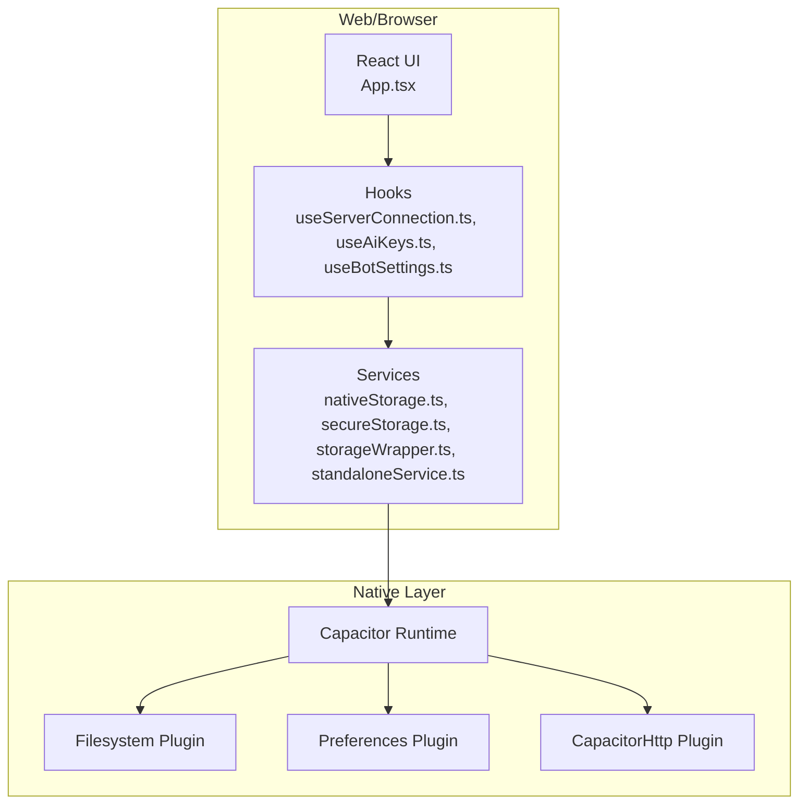
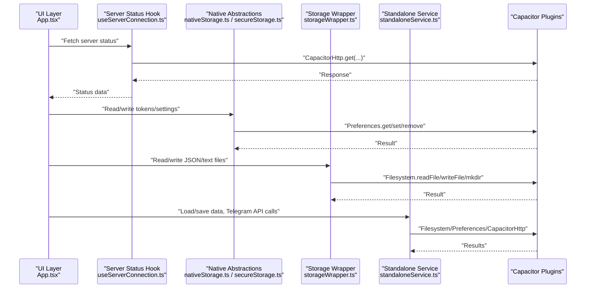
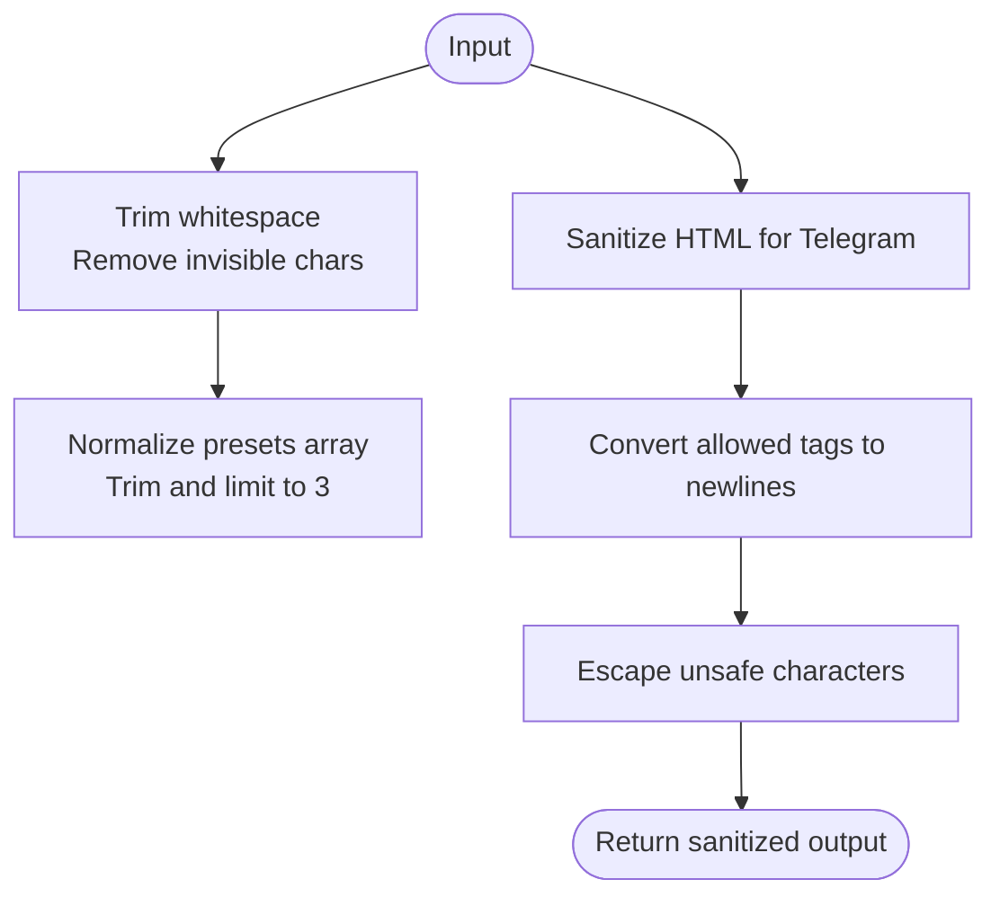
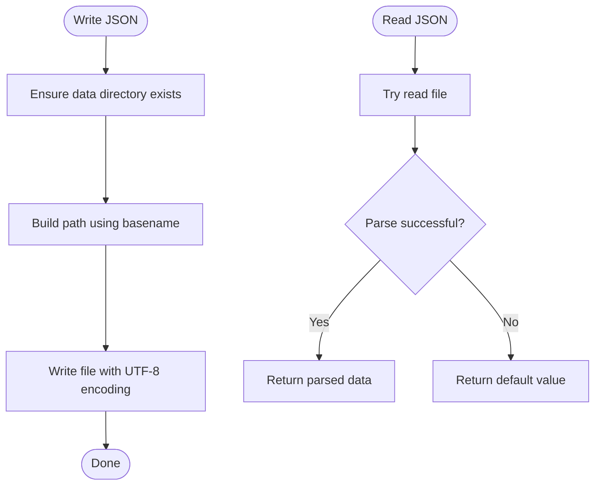
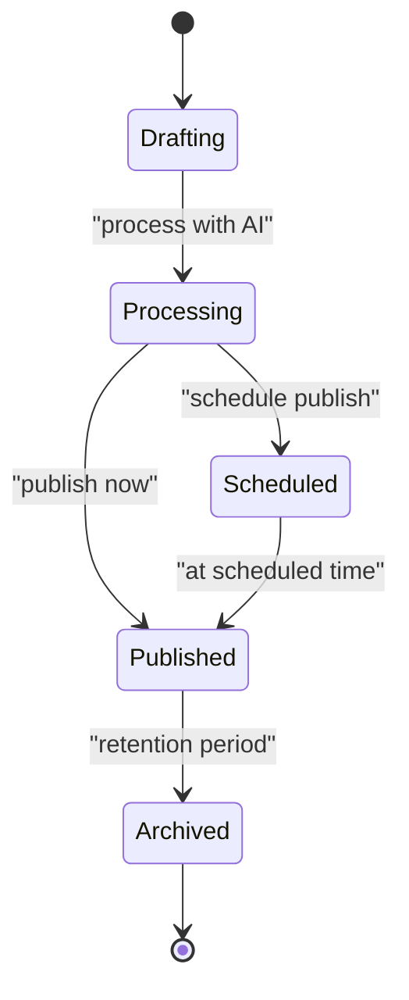
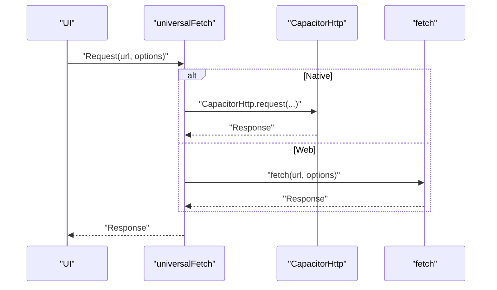
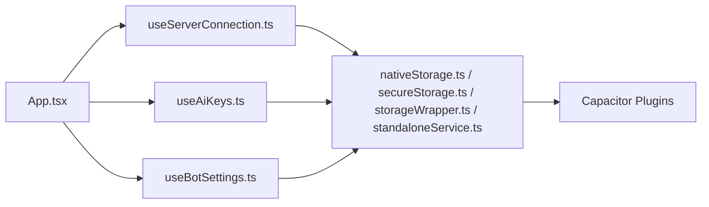

# Data Protection and Privacy

<cite>
**Referenced Files in This Document**
- [nativeStorage.ts](file://src/services/nativeStorage.ts)
- [secureStorage.ts](file://src/services/secureStorage.ts)
- [storageWrapper.ts](file://src/services/storageWrapper.ts)
- [standaloneService.ts](file://src/services/standaloneService.ts)
- [useServerConnection.ts](file://src/hooks/useServerConnection.ts)
- [useAiKeys.ts](file://src/hooks/useAiKeys.ts)
- [useBotSettings.ts](file://src/hooks/useBotSettings.ts)
- [App.tsx](file://src/App.tsx)
- [capacitor.config.ts](file://capacitor.config.ts)
- [AndroidManifest.xml](file://android/app/src/main/AndroidManifest.xml)
- [MainActivity.java](file://android/app/src/main/java/com/newsbot/manager/MainActivity.java)
- [types.ts](file://src/types.ts)
</cite>

## Table of Contents
1. [Introduction](#introduction)
2. [Project Structure](#project-structure)
3. [Core Components](#core-components)
4. [Architecture Overview](#architecture-overview)
5. [Detailed Component Analysis](#detailed-component-analysis)
6. [Dependency Analysis](#dependency-analysis)
7. [Performance Considerations](#performance-considerations)
8. [Troubleshooting Guide](#troubleshooting-guide)
9. [Conclusion](#conclusion)
10. [Appendices](#appendices)

## Introduction
This document provides comprehensive guidance on data protection and privacy for the application. It explains how local storage is implemented across native and web environments, outlines current encryption strategies, and documents data sanitization and persistence patterns. It also covers privacy considerations for content processing, user data collection, compliance requirements, data lifecycle management, retention policies, secure deletion procedures, secure transmission practices, and mobile security best practices including backup and recovery.

## Project Structure
The application uses a hybrid architecture via Capacitor, supporting both native and web environments. Storage abstractions are provided by dedicated services and wrappers, while hooks manage settings and credentials. Security-sensitive data is handled through a dedicated secure storage module and platform-specific preferences on native platforms.

**Diagram sources**
- [App.tsx:16–25:16-25](file://src/App.tsx#L16-L25)
- [nativeStorage.ts:1–63:1-63](file://src/services/nativeStorage.ts#L1-L63)
- [secureStorage.ts:1–40:1-40](file://src/services/secureStorage.ts#L1-L40)
- [storageWrapper.ts:1–100:1-100](file://src/services/storageWrapper.ts#L1-L100)
- [standaloneService.ts:1–175:1-175](file://src/services/standaloneService.ts#L1-L175)
- [useServerConnection.ts:1–52:1-52](file://src/hooks/useServerConnection.ts#L1-L52)
- [useAiKeys.ts:1–57:1-57](file://src/hooks/useAiKeys.ts#L1-L57)
- [useBotSettings.ts:1–56:1-56](file://src/hooks/useBotSettings.ts#L1-L56)

**Section sources**
- [App.tsx:16–25:16-25](file://src/App.tsx#L16-L25)
- [capacitor.config.ts:1–26:1-26](file://capacitor.config.ts#L1-L26)

## Core Components
- Native storage abstraction: Provides unified JSON/text read/write operations for native and web environments, ensuring consistent behavior across platforms.
- Secure storage: Centralized handler for sensitive credentials, leveraging platform preferences on native devices.
- Storage wrapper: Cross-platform file I/O with consistent JSON and text operations, including directory creation and path normalization.
- Standalone service: Local filesystem and preference management for offline mode, including Telegram API calls and AI processing utilities.
- Server connectivity hook: Manages server status and network requests with timeouts and error handling.
- UI-level sanitization helpers: Input sanitization and content sanitization for safe rendering and transmission.

**Section sources**
- [nativeStorage.ts:8–62:8-62](file://src/services/nativeStorage.ts#L8-L62)
- [secureStorage.ts:4–39:4-39](file://src/services/secureStorage.ts#L4-L39)
- [storageWrapper.ts:9–99:9-99](file://src/services/storageWrapper.ts#L9-L99)
- [standaloneService.ts:11–72:11-72](file://src/services/standaloneService.ts#L11-L72)
- [useServerConnection.ts:15–52:15-52](file://src/hooks/useServerConnection.ts#L15-L52)
- [App.tsx:48–100:48-100](file://src/App.tsx#L48-L100)

## Architecture Overview
The system separates concerns across UI, hooks, services, and native plugins. Sensitive data is routed through secure storage on native platforms, while general settings and files are persisted via preferences and filesystem APIs. Network communication uses Capacitor’s HTTP plugin for native environments and standard fetch for web.

**Diagram sources**
- [useServerConnection.ts:20–42:20-42](file://src/hooks/useServerConnection.ts#L20-L42)
- [nativeStorage.ts:48–61:48-61](file://src/services/nativeStorage.ts#L48-L61)
- [secureStorage.ts:7–38:7-38](file://src/services/secureStorage.ts#L7-L38)
- [storageWrapper.ts:10–54:10-54](file://src/services/storageWrapper.ts#L10-L54)
- [standaloneService.ts:75–146:75-146](file://src/services/standaloneService.ts#L75-L146)

## Detailed Component Analysis

### Local Storage Security: Native vs Web
- Native platform:
  - Tokens and sensitive settings are stored via preferences with automatic encryption on modern devices.
  - General data is written to the application data/documents directory using filesystem APIs.
- Web platform:
  - Tokens and sensitive data are stored in browser local storage without encryption.
  - General JSON/text files are written to the local filesystem via Node.js file system.

Recommendations:
- Prefer native builds for production to leverage encrypted preferences.
- Avoid storing sensitive tokens in web local storage; warn users accordingly.
- Apply strict Content Security Policy and HTTPS enforcement.

**Section sources**
- [nativeStorage.ts:16–46:16-46](file://src/services/nativeStorage.ts#L16-L46)
- [secureStorage.ts:8–18:8-18](file://src/services/secureStorage.ts#L8-L18)
- [storageWrapper.ts:35–53:35-53](file://src/services/storageWrapper.ts#L35-L53)

### Encryption Strategies
- Native:
  - Preferences plugin provides encryption on modern Android devices.
- Web:
  - No built-in encryption for local storage; mitigate risk by avoiding sensitive data storage.

Best practices:
- Use secure storage for tokens and secrets.
- Consider client-side encryption libraries for additional protection if storing sensitive data in web mode.

**Section sources**
- [secureStorage.ts:9](file://src/services/secureStorage.ts#L9)
- [secureStorage.ts:16](file://src/services/secureStorage.ts#L16)

### Data Sanitization Processes
- Base URL sanitization trims whitespace and removes invisible Unicode characters.
- Chat ID presets normalization ensures arrays of strings with fixed length.
- HTML-to-Telegram sanitization:
  - Converts block-level tags to newlines.
  - Removes disallowed tags and escapes unsafe characters.
  - Preserves allowed inline tags and placeholders.

**Diagram sources**
- [App.tsx:75–100:75-100](file://src/App.tsx#L75-L100)
- [App.tsx:348–399:348-399](file://src/App.tsx#L348-L399)

**Section sources**
- [App.tsx:75–100:75-100](file://src/App.tsx#L75-L100)
- [App.tsx:348–399:348-399](file://src/App.tsx#L348-L399)

### Storage Wrapper Functionality and Persistence Patterns
- Ensures target directories exist before writing.
- Reads/writes JSON files with UTF-8 encoding.
- Normalizes file paths by extracting base filenames.
- Provides separate methods for text and JSON content.

**Diagram sources**
- [storageWrapper.ts:35–54:35-54](file://src/services/storageWrapper.ts#L35-L54)
- [storageWrapper.ts:10–33:10-33](file://src/services/storageWrapper.ts#L10-L33)

**Section sources**
- [storageWrapper.ts:9–99:9-99](file://src/services/storageWrapper.ts#L9-L99)

### Cross-Platform Data Handling
- Platform detection via Capacitor runtime.
- Native: Filesystem and Preferences plugins.
- Web: Node.js file system and browser local storage.
- Hybrid UI components adapt behavior based on platform.

**Section sources**
- [storageWrapper.ts:6](file://src/services/storageWrapper.ts#L6)
- [nativeStorage.ts:5](file://src/services/nativeStorage.ts#L5)
- [standaloneService.ts:8–9:8-9](file://src/services/standaloneService.ts#L8-L9)

### Privacy Considerations for Content Processing and User Data Collection
- Input validation and sanitization reduce injection risks.
- Avoid storing sensitive tokens in web local storage; prefer native preferences.
- Respect user privacy by minimizing data collection and providing clear controls.

**Section sources**
- [App.tsx:75–100:75-100](file://src/App.tsx#L75-L100)
- [secureStorage.ts:16](file://src/services/secureStorage.ts#L16)

### Compliance Requirements
- Token storage:
  - Native: Encrypted preferences.
  - Web: Warn users; avoid sensitive data in local storage.
- Data retention:
  - Implement explicit retention periods for logs and drafts.
  - Provide user controls to delete data.
- Secure transmission:
  - Enforce HTTPS and certificate pinning where applicable.
  - Validate and sanitize all inputs and outputs.

**Section sources**
- [secureStorage.ts:9](file://src/services/secureStorage.ts#L9)
- [secureStorage.ts:16](file://src/services/secureStorage.ts#L16)

### Data Lifecycle Management, Retention, and Secure Deletion
- Lifecycle stages:
  - Creation: Drafts, templates, scheduled posts.
  - Processing: AI transformations and content sanitization.
  - Publication: Telegram API calls and media uploads.
  - Archival: Published posts and logs.
- Retention:
  - Define retention windows for drafts, logs, and published posts.
  - Provide user-initiated deletion.
- Secure deletion:
  - Remove entries from local storage and filesystem.
  - Clear sensitive tokens via secure storage.

**Diagram sources**
- [types.ts:13–26:13-26](file://src/types.ts#L13-L26)

**Section sources**
- [types.ts:13–26:13-26](file://src/types.ts#L13-L26)
- [standaloneService.ts:25–54:25-54](file://src/services/standaloneService.ts#L25-L54)

### Secure Transmission and Transport Security
- Native HTTP requests use Capacitor’s HTTP plugin with timeouts.
- Web requests use standard fetch with abort signals and timeouts.
- Enforce HTTPS and validate URLs before requests.

**Diagram sources**
- [App.tsx:195–251:195-251](file://src/App.tsx#L195-L251)

**Section sources**
- [App.tsx:195–251:195-251](file://src/App.tsx#L195-L251)

### Mobile Security Best Practices
- Android manifest allows mixed content and cleartext traffic; prefer HTTPS and disable cleartext where possible.
- Request and check external storage permissions before accessing files.
- Use FileProvider for secure file sharing.

**Section sources**
- [AndroidManifest.xml:10](file://android/app/src/main/AndroidManifest.xml#L10)
- [App.tsx:408–416:408-416](file://src/App.tsx#L408-L416)
- [AndroidManifest.xml:28–36:28-36](file://android/app/src/main/AndroidManifest.xml#L28-L36)

### Backup Security and Recovery Procedures
- Local backups:
  - Persist drafts, templates, and published posts to filesystem.
  - Store settings in preferences.
- Recovery:
  - Rehydrate UI state from saved files and settings.
  - Provide manual restore actions for critical data.

**Section sources**
- [standaloneService.ts:25–72:25-72](file://src/services/standaloneService.ts#L25-L72)
- [storageWrapper.ts:10–54:10-54](file://src/services/storageWrapper.ts#L10-L54)

## Dependency Analysis
The UI depends on hooks and services for data operations. Services depend on Capacitor plugins for native capabilities. The secure storage module centralizes sensitive data handling.

**Diagram sources**
- [App.tsx:16–25:16-25](file://src/App.tsx#L16-L25)
- [useServerConnection.ts:1–52:1-52](file://src/hooks/useServerConnection.ts#L1-L52)
- [useAiKeys.ts:1–57:1-57](file://src/hooks/useAiKeys.ts#L1-L57)
- [useBotSettings.ts:1–56:1-56](file://src/hooks/useBotSettings.ts#L1-L56)
- [nativeStorage.ts:1–63:1-63](file://src/services/nativeStorage.ts#L1-L63)
- [secureStorage.ts:1–40:1-40](file://src/services/secureStorage.ts#L1-L40)
- [storageWrapper.ts:1–100:1-100](file://src/services/storageWrapper.ts#L1-L100)
- [standaloneService.ts:1–175:1-175](file://src/services/standaloneService.ts#L1-L175)

**Section sources**
- [App.tsx:16–25:16-25](file://src/App.tsx#L16-L25)
- [nativeStorage.ts:1–63:1-63](file://src/services/nativeStorage.ts#L1-L63)
- [secureStorage.ts:1–40:1-40](file://src/services/secureStorage.ts#L1-L40)
- [storageWrapper.ts:1–100:1-100](file://src/services/storageWrapper.ts#L1-L100)
- [standaloneService.ts:1–175:1-175](file://src/services/standaloneService.ts#L1-L175)

## Performance Considerations
- Minimize synchronous disk I/O; batch writes where possible.
- Use timeouts and cancellation for network requests.
- Avoid frequent re-renders by memoizing derived data.

## Troubleshooting Guide
- Storage errors:
  - Ensure directories exist before writing.
  - Fallback to defaults when reads fail.
- Network failures:
  - Inspect error messages and retry with backoff.
  - Validate base URLs and enforce HTTPS.
- Platform-specific issues:
  - On Android, verify permissions for external storage access.
  - On web, confirm local storage availability and CSP settings.

**Section sources**
- [storageWrapper.ts:12–22:12-22](file://src/services/storageWrapper.ts#L12-L22)
- [useServerConnection.ts:36–41:36-41](file://src/hooks/useServerConnection.ts#L36-L41)
- [App.tsx:408–416:408-416](file://src/App.tsx#L408-L416)

## Conclusion
The application implements a layered approach to data protection, leveraging native encryption for sensitive data, sanitizing inputs and outputs, and providing robust cross-platform storage abstractions. To strengthen privacy and security, prioritize native deployment, avoid storing sensitive tokens in web local storage, enforce HTTPS, and implement clear retention and deletion policies.

## Appendices
- Capacitor configuration enables HTTP plugin and allows navigation to arbitrary hosts; review and restrict as needed for production.
- Android manifest permits cleartext traffic; enable network security config to enforce HTTPS in production.

**Section sources**
- [capacitor.config.ts:7–22:7-22](file://capacitor.config.ts#L7-L22)
- [AndroidManifest.xml:10](file://android/app/src/main/AndroidManifest.xml#L10)