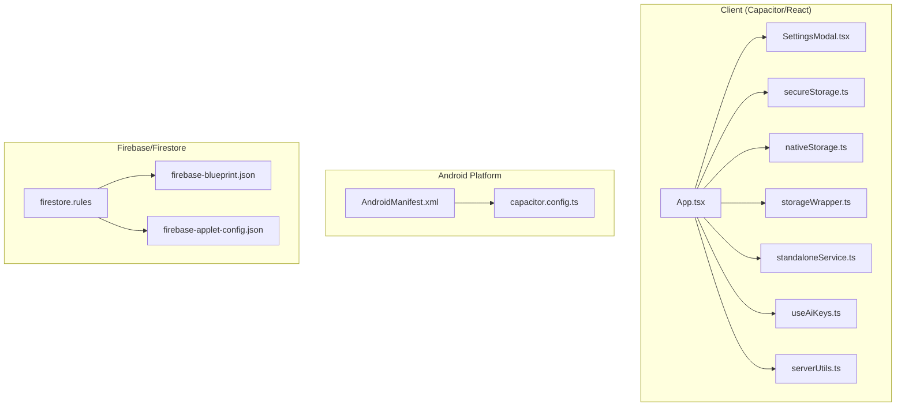
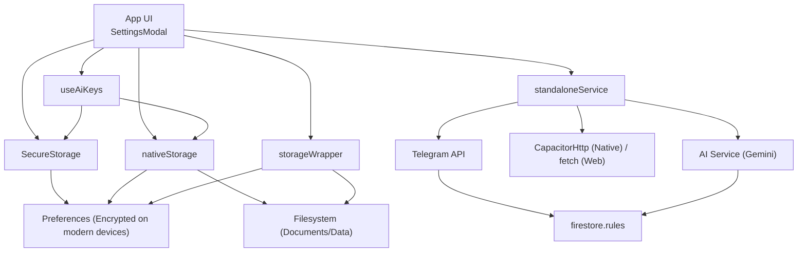
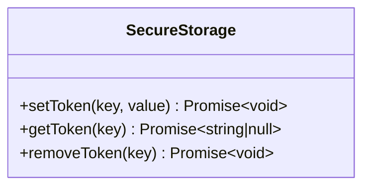
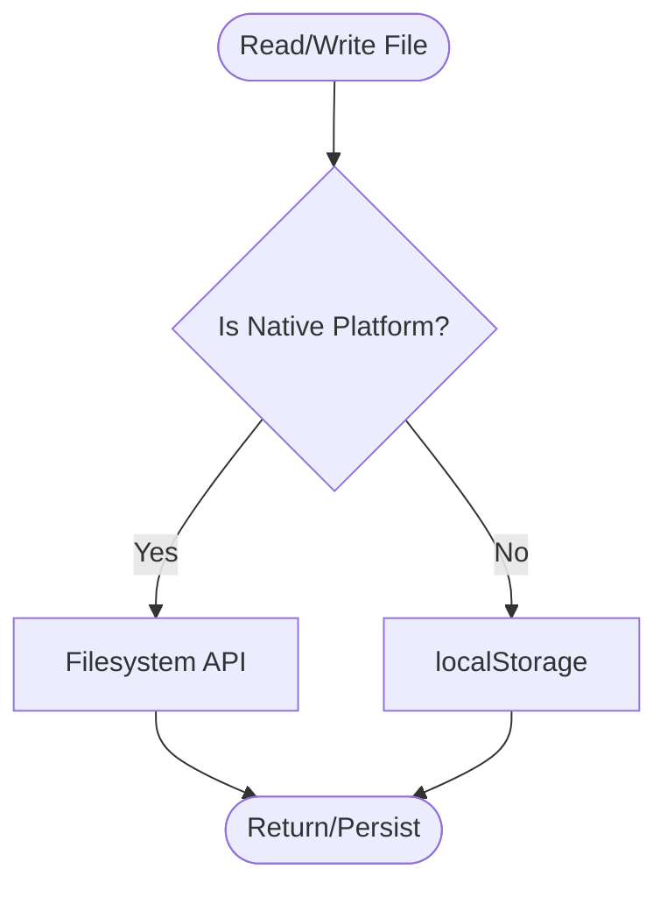
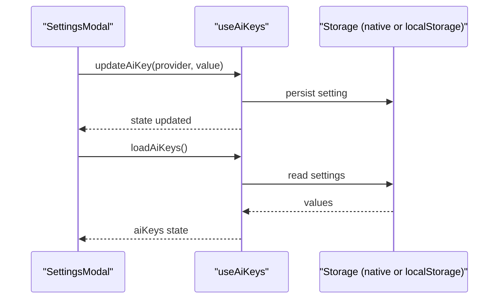
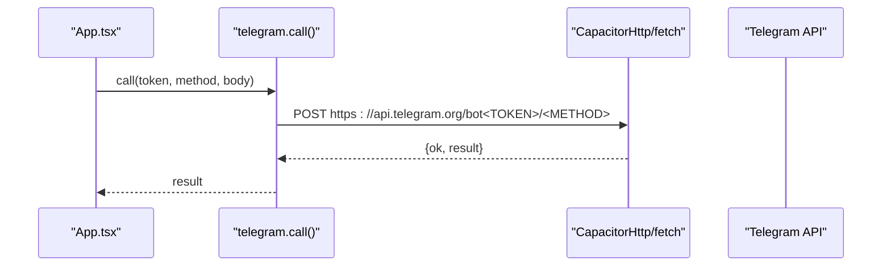
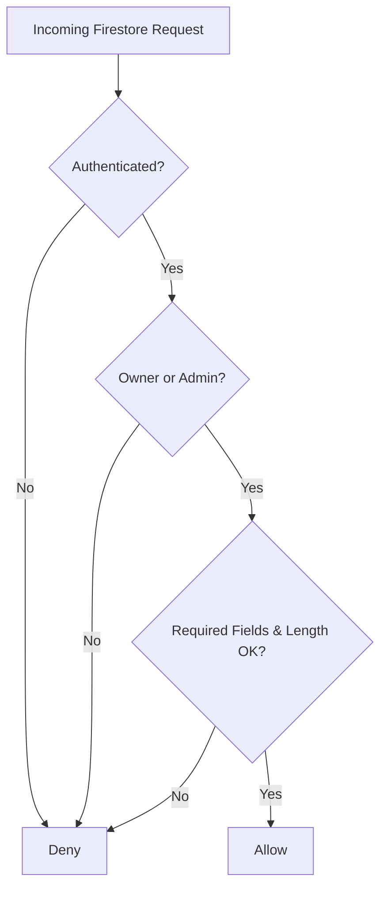
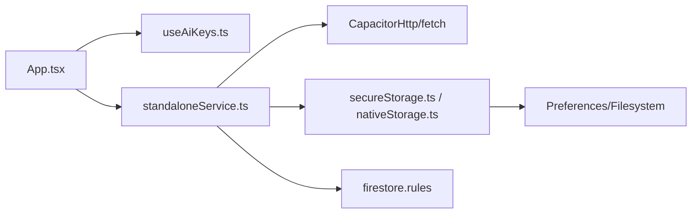
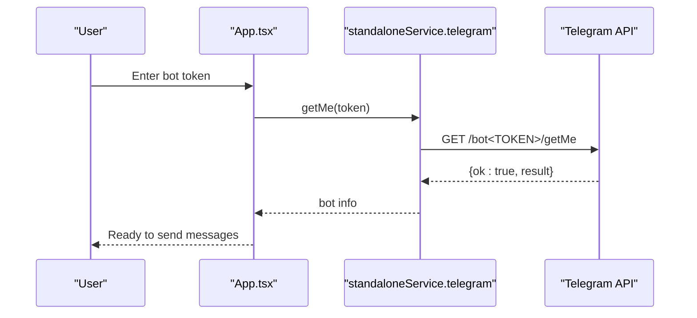

# Security and Authentication

<cite>
**Referenced Files in This Document**
- [secureStorage.ts](file://src/services/secureStorage.ts)
- [nativeStorage.ts](file://src/services/nativeStorage.ts)
- [storageWrapper.ts](file://src/services/storageWrapper.ts)
- [standaloneService.ts](file://src/services/standaloneService.ts)
- [useAiKeys.ts](file://src/hooks/useAiKeys.ts)
- [serverUtils.ts](file://src/serverUtils.ts)
- [App.tsx](file://src/App.tsx)
- [SettingsModal.tsx](file://src/components/SettingsModal.tsx)
- [AndroidManifest.xml](file://android/app/src/main/AndroidManifest.xml)
- [capacitor.config.ts](file://capacitor.config.ts)
- [firestore.rules](file://firestore.rules)
- [firebase-blueprint.json](file://firebase-blueprint.json)
- [firebase-applet-config.json](file://firebase-applet-config.json)
</cite>

## Table of Contents
1. [Introduction](#introduction)
2. [Project Structure](#project-structure)
3. [Core Components](#core-components)
4. [Architecture Overview](#architecture-overview)
5. [Detailed Component Analysis](#detailed-component-analysis)
6. [Dependency Analysis](#dependency-analysis)
7. [Performance Considerations](#performance-considerations)
8. [Troubleshooting Guide](#troubleshooting-guide)
9. [Conclusion](#conclusion)
10. [Appendices](#appendices)

## Introduction
This document describes the security and authentication system of the project, focusing on secure API key management, encrypted storage, provider authentication, access control, local storage security, network security, and data protection. It also covers privacy considerations, compliance-relevant Firestore rules, authentication flows, session management, credential handling, best practices, vulnerability assessment, incident response, and production hardening guidance.

## Project Structure
The security-related logic spans client-side Capacitor/React services, hooks, and platform-specific Android configuration, along with Firebase/Firestore backend rules and configuration.

**Diagram sources**
- [App.tsx](file://src/App.tsx)
- [SettingsModal.tsx](file://src/components/SettingsModal.tsx)
- [secureStorage.ts](file://src/services/secureStorage.ts)
- [nativeStorage.ts](file://src/services/nativeStorage.ts)
- [storageWrapper.ts](file://src/services/storageWrapper.ts)
- [standaloneService.ts](file://src/services/standaloneService.ts)
- [useAiKeys.ts](file://src/hooks/useAiKeys.ts)
- [serverUtils.ts](file://src/serverUtils.ts)
- [AndroidManifest.xml](file://android/app/src/main/AndroidManifest.xml)
- [capacitor.config.ts](file://capacitor.config.ts)
- [firestore.rules](file://firestore.rules)
- [firebase-blueprint.json](file://firebase-blueprint.json)
- [firebase-applet-config.json](file://firebase-applet-config.json)

**Section sources**
- [App.tsx](file://src/App.tsx)
- [secureStorage.ts](file://src/services/secureStorage.ts)
- [nativeStorage.ts](file://src/services/nativeStorage.ts)
- [storageWrapper.ts](file://src/services/storageWrapper.ts)
- [standaloneService.ts](file://src/services/standaloneService.ts)
- [useAiKeys.ts](file://src/hooks/useAiKeys.ts)
- [serverUtils.ts](file://src/serverUtils.ts)
- [AndroidManifest.xml](file://android/app/src/main/AndroidManifest.xml)
- [capacitor.config.ts](file://capacitor.config.ts)
- [firestore.rules](file://firestore.rules)
- [firebase-blueprint.json](file://firebase-blueprint.json)
- [firebase-applet-config.json](file://firebase-applet-config.json)

## Core Components
- Secure token and secret storage:
  - Encrypted preferences-backed storage on native platforms; fallback to browser storage with explicit warnings.
- Provider authentication:
  - Telegram bot token handling via direct API calls with platform-aware HTTP transport.
  - AI provider keys managed per provider and persisted securely when running natively.
- Access control:
  - Firestore security rules enforcing authentication, ownership checks, admin overrides, and field validation.
- Network security:
  - Capacitor HTTP plugin usage on native; HTTPS enforcement in Capacitor configuration; Android manifest cleartext traffic allowance.
- Logging and diagnostics:
  - Local file logger for error tracking.

**Section sources**
- [secureStorage.ts](file://src/services/secureStorage.ts)
- [nativeStorage.ts](file://src/services/nativeStorage.ts)
- [standaloneService.ts](file://src/services/standaloneService.ts)
- [firestore.rules](file://firestore.rules)
- [capacitor.config.ts](file://capacitor.config.ts)
- [AndroidManifest.xml](file://android/app/src/main/AndroidManifest.xml)
- [serverUtils.ts](file://src/serverUtils.ts)

## Architecture Overview
High-level security architecture integrating client-side storage, platform HTTP transport, and backend access control.

**Diagram sources**
- [App.tsx](file://src/App.tsx)
- [SettingsModal.tsx](file://src/components/SettingsModal.tsx)
- [secureStorage.ts](file://src/services/secureStorage.ts)
- [nativeStorage.ts](file://src/services/nativeStorage.ts)
- [storageWrapper.ts](file://src/services/storageWrapper.ts)
- [standaloneService.ts](file://src/services/standaloneService.ts)
- [useAiKeys.ts](file://src/hooks/useAiKeys.ts)
- [firestore.rules](file://firestore.rules)

## Detailed Component Analysis

### Secure Token Storage (SecureStorage)
- Purpose: Provide encrypted storage for tokens and secrets on native platforms; warn and fall back to browser storage otherwise.
- Behavior:
  - Prefixes keys to isolate secure entries.
  - Uses Capacitor Preferences on native; localStorage on web with a warning.
  - Supports set/get/remove operations.

**Diagram sources**
- [secureStorage.ts](file://src/services/secureStorage.ts)

**Section sources**
- [secureStorage.ts](file://src/services/secureStorage.ts)

### Native and Browser Storage Abstraction (nativeStorage, storageWrapper)
- Purpose: Unified JSON/text file read/write with platform-aware filesystem and preferences.
- Behavior:
  - Ensures data directories on native.
  - Reads/writes JSON and text files via Capacitor Filesystem on native; localStorage on web.
  - Provides convenience getters/setters for bot token and chat ID.

**Diagram sources**
- [nativeStorage.ts](file://src/services/nativeStorage.ts)
- [storageWrapper.ts](file://src/services/storageWrapper.ts)

**Section sources**
- [nativeStorage.ts](file://src/services/nativeStorage.ts)
- [storageWrapper.ts](file://src/services/storageWrapper.ts)

### AI Keys Management (useAiKeys)
- Purpose: Manage provider-specific API keys (e.g., Gemini, GitHub, OpenRouter, DeepSeek).
- Behavior:
  - Loads keys from either secure storage (native) or browser localStorage (web).
  - Updates keys atomically and persists them immediately.
  - Aggregates errors during load/update.

**Diagram sources**
- [useAiKeys.ts](file://src/hooks/useAiKeys.ts)
- [SettingsModal.tsx](file://src/components/SettingsModal.tsx)
- [nativeStorage.ts](file://src/services/nativeStorage.ts)
- [secureStorage.ts](file://src/services/secureStorage.ts)

**Section sources**
- [useAiKeys.ts](file://src/hooks/useAiKeys.ts)
- [SettingsModal.tsx](file://src/components/SettingsModal.tsx)
- [nativeStorage.ts](file://src/services/nativeStorage.ts)
- [secureStorage.ts](file://src/services/secureStorage.ts)

### Telegram API Integration and Authentication (standaloneService)
- Purpose: Direct Telegram Bot API calls with platform-aware HTTP transport and basic validation.
- Behavior:
  - Calls endpoint with token and method; validates response structure.
  - Uses CapacitorHttp on native; fetch on web.
  - Exposes methods for getMe, sendMessage, sendPhoto, sendMediaGroup, getUpdates.

**Diagram sources**
- [standaloneService.ts](file://src/services/standaloneService.ts)
- [App.tsx](file://src/App.tsx)

**Section sources**
- [standaloneService.ts](file://src/services/standaloneService.ts)
- [App.tsx](file://src/App.tsx)

### Access Control and Data Protection (Firestore Rules)
- Purpose: Enforce authentication, ownership, admin privileges, and field validation.
- Highlights:
  - Authentication guard via request.auth presence.
  - Admin role check against user document and verified email condition.
  - Field validation helpers for required fields and string length bounds.
  - Per-collection rules for posts and templates.

**Diagram sources**
- [firestore.rules](file://firestore.rules)

**Section sources**
- [firestore.rules](file://firestore.rules)
- [firebase-blueprint.json](file://firebase-blueprint.json)
- [firebase-applet-config.json](file://firebase-applet-config.json)

### Logging and Diagnostics (FileLogger)
- Purpose: Append-only file logging for error tracking in server-like environments.
- Behavior:
  - Creates logs directory if absent.
  - Appends timestamped log lines to a rolling-style file.

**Section sources**
- [serverUtils.ts](file://src/serverUtils.ts)

### Network Security and Transport
- Capacitor HTTP:
  - Native requests use CapacitorHttp; web uses fetch with timeouts.
- Android Manifest:
  - Cleartext HTTP allowed; consider enabling strict mode and HTTPS-only for production.
- Capacitor Server:
  - Android scheme configured to HTTPS; mixed content allowed.

**Section sources**
- [App.tsx](file://src/App.tsx)
- [capacitor.config.ts](file://capacitor.config.ts)
- [AndroidManifest.xml](file://android/app/src/main/AndroidManifest.xml)

## Dependency Analysis
- Client-side dependencies:
  - Capacitor Preferences/Filesystem for secure storage abstractions.
  - CapacitorHttp for native HTTP transport.
  - React hooks for stateful key management.
- Backend dependencies:
  - Firestore rules enforce access control and data integrity.
  - Firebase configuration defines project identity and services.

**Diagram sources**
- [App.tsx](file://src/App.tsx)
- [useAiKeys.ts](file://src/hooks/useAiKeys.ts)
- [standaloneService.ts](file://src/services/standaloneService.ts)
- [secureStorage.ts](file://src/services/secureStorage.ts)
- [nativeStorage.ts](file://src/services/nativeStorage.ts)
- [firestore.rules](file://firestore.rules)

**Section sources**
- [App.tsx](file://src/App.tsx)
- [standaloneService.ts](file://src/services/standaloneService.ts)
- [secureStorage.ts](file://src/services/secureStorage.ts)
- [nativeStorage.ts](file://src/services/nativeStorage.ts)
- [firestore.rules](file://firestore.rules)

## Performance Considerations
- Prefer native HTTP transport for reliability and reduced overhead.
- Minimize synchronous disk writes; batch file operations when possible.
- Avoid storing sensitive data in browser localStorage; use native encrypted storage when available.
- Validate and sanitize inputs before persistence to reduce I/O and potential corruption.

## Troubleshooting Guide
- Tokens not persisting on web:
  - Expected behavior; SecureStorage warns and falls back to localStorage. Use the native app for encrypted storage.
- Telegram API errors:
  - Verify token correctness and network connectivity; check response validation and error propagation.
- Firestore permission denied:
  - Ensure user is authenticated; confirm ownership or admin role; validate required fields and lengths.
- Android cleartext traffic:
  - Production builds should avoid cleartext; configure HTTPS and restrict network permissions.

**Section sources**
- [secureStorage.ts](file://src/services/secureStorage.ts)
- [standaloneService.ts](file://src/services/standaloneService.ts)
- [firestore.rules](file://firestore.rules)
- [AndroidManifest.xml](file://android/app/src/main/AndroidManifest.xml)

## Conclusion
The project implements layered security with encrypted storage on native platforms, platform-aware HTTP transport, and Firestore-based access control. To strengthen security, prioritize HTTPS-only transport, avoid cleartext traffic, enforce stricter input validation, and adopt secure defaults for development and production.

## Appendices

### Authentication Flow (Telegram Bot)

**Diagram sources**
- [standaloneService.ts](file://src/services/standaloneService.ts)
- [App.tsx](file://src/App.tsx)

### Data Protection Policies and Compliance Notes
- Data classification:
  - Tokens and API keys are treated as sensitive; stored in encrypted preferences on native.
- Access control:
  - Firestore rules require authentication, enforce ownership, and support admin overrides.
- Privacy:
  - Avoid logging sensitive data; sanitize inputs; prefer encrypted channels.
- Compliance:
  - Align storage and transport with organizational policies; regularly audit access rules and credentials.

**Section sources**
- [secureStorage.ts](file://src/services/secureStorage.ts)
- [firestore.rules](file://firestore.rules)
- [serverUtils.ts](file://src/serverUtils.ts)

### Best Practices and Hardening Checklist
- Prefer native app for encrypted storage; avoid browser localStorage for secrets.
- Enforce HTTPS; disable cleartext traffic in production.
- Rotate API keys; limit scope; use environment-specific configurations.
- Harden Capacitor config: disallow mixed content; enforce secure schemes.
- Monitor logs; apply rate limits; validate and sanitize all inputs.
- Regularly review Firestore rules and access patterns.

**Section sources**
- [capacitor.config.ts](file://capacitor.config.ts)
- [AndroidManifest.xml](file://android/app/src/main/AndroidManifest.xml)
- [firestore.rules](file://firestore.rules)