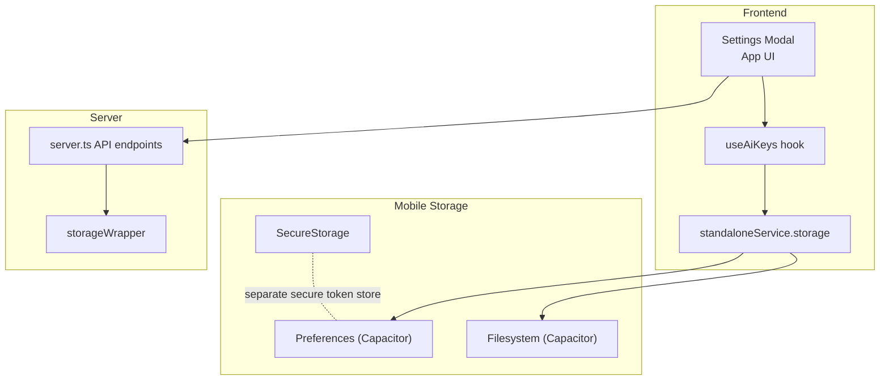
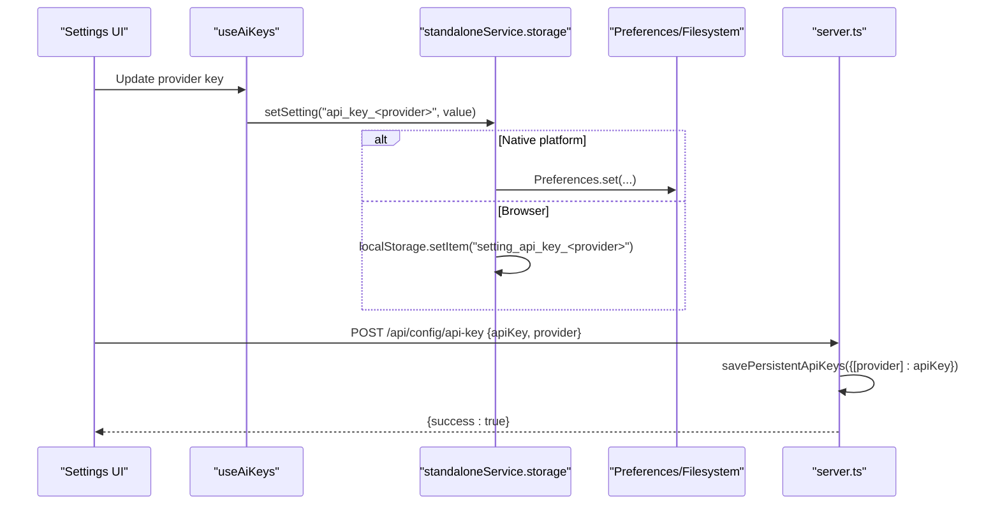
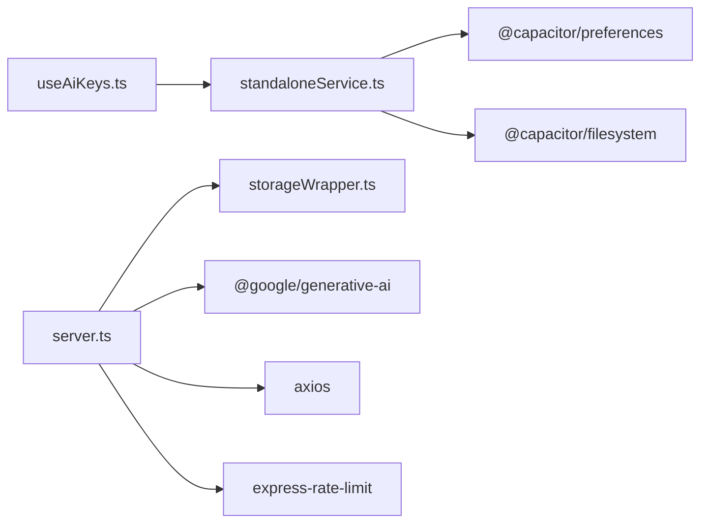

# API Key Management

<cite>
**Referenced Files in This Document**
- [server.ts](file://server.ts)
- [useAiKeys.ts](file://src/hooks/useAiKeys.ts)
- [standaloneService.ts](file://src/services/standaloneService.ts)
- [secureStorage.ts](file://src/services/secureStorage.ts)
- [nativeStorage.ts](file://src/services/nativeStorage.ts)
- [storageWrapper.ts](file://src/services/storageWrapper.ts)
- [App.tsx](file://src/App.tsx)
- [SettingsModal.tsx](file://src/components/SettingsModal.tsx)
- [package.json](file://package.json)
</cite>

## Table of Contents
1. [Introduction](#introduction)
2. [Project Structure](#project-structure)
3. [Core Components](#core-components)
4. [Architecture Overview](#architecture-overview)
5. [Detailed Component Analysis](#detailed-component-analysis)
6. [Dependency Analysis](#dependency-analysis)
7. [Performance Considerations](#performance-considerations)
8. [Troubleshooting Guide](#troubleshooting-guide)
9. [Conclusion](#conclusion)

## Introduction
This document describes the secure API key management system for AI provider credentials in the project. It covers how keys are stored, validated, and accessed across different deployment modes (standalone vs server), how the system integrates with the AI processing pipeline, and how to configure, rotate, and troubleshoot authentication issues for Gemini, GitHub, OpenRouter, and DeepSeek.

## Project Structure
The API key management spans three primary areas:
- Frontend React hooks and UI for key input and persistence
- Native mobile storage abstractions for secure settings
- Server-side persistence and validation for AI keys

**Diagram sources**
- [App.tsx](file://src/App.tsx)
- [SettingsModal.tsx](file://src/components/SettingsModal.tsx)
- [useAiKeys.ts](file://src/hooks/useAiKeys.ts)
- [standaloneService.ts](file://src/services/standaloneService.ts)
- [secureStorage.ts](file://src/services/secureStorage.ts)
- [storageWrapper.ts](file://src/services/storageWrapper.ts)
- [server.ts](file://server.ts)

**Section sources**
- [App.tsx](file://src/App.tsx)
- [SettingsModal.tsx](file://src/components/SettingsModal.tsx)
- [useAiKeys.ts](file://src/hooks/useAiKeys.ts)
- [standaloneService.ts](file://src/services/standaloneService.ts)
- [secureStorage.ts](file://src/services/secureStorage.ts)
- [storageWrapper.ts](file://src/services/storageWrapper.ts)
- [server.ts](file://server.ts)

## Core Components
- useAiKeys: React hook that loads and updates AI provider keys for the current mode (standalone or server). Keys are stored under prefixed keys for each provider.
- standaloneService.storage: Provides cross-platform settings storage for standalone mode using Capacitor Preferences and Filesystem.
- secureStorage: Dedicated secure token storage for tokens separate from API keys (prefix-based), leveraging native preferences on device and localStorage in browser.
- server.ts endpoints: Persist and validate AI keys server-side, expose status, and test endpoints for providers.
- storageWrapper: Cross-platform file read/write abstraction used by the server for persistent data.

Key storage locations and prefixes:
- Standalone keys: api_key_gemini, api_key_github, api_key_openrouter, api_key_deepseek
- Server keys: api_keys.json persisted on disk
- Secure tokens: secure_bot_token, secure_chat_id (prefix-based)

**Section sources**
- [useAiKeys.ts](file://src/hooks/useAiKeys.ts)
- [standaloneService.ts](file://src/services/standaloneService.ts)
- [secureStorage.ts](file://src/services/secureStorage.ts)
- [server.ts](file://server.ts)
- [storageWrapper.ts](file://src/services/storageWrapper.ts)

## Architecture Overview
The system supports two operational modes:
- Standalone (mobile): Keys are stored locally via Capacitor Preferences/Filesystem or localStorage in browser.
- Server (web): Keys are stored on the server in api_keys.json and exposed via REST endpoints.

**Diagram sources**
- [useAiKeys.ts](file://src/hooks/useAiKeys.ts)
- [standaloneService.ts](file://src/services/standaloneService.ts)
- [server.ts](file://server.ts)

## Detailed Component Analysis

### useAiKeys Hook
Responsibilities:
- Load AI keys for providers (Gemini, GitHub, OpenRouter, DeepSeek) from either standalone storage or browser localStorage depending on mode.
- Update keys and persist immediately.
- Provide loading and error states.

Behavior highlights:
- Parallel loading of all four keys.
- Mode-aware persistence: standalone uses Preferences; server mode uses localStorage with server-specific prefixes.
- Error propagation to UI for user feedback.

**Section sources**
- [useAiKeys.ts](file://src/hooks/useAiKeys.ts)

### standaloneService.storage
Responsibilities:
- Initialize a documents directory on native platforms.
- Save/load JSON files to Documents directory on native; localStorage fallback in browser.
- Persist settings (including API keys) using Capacitor Preferences or localStorage.

Security considerations:
- Uses Capacitor Preferences for settings on native.
- On web, falls back to localStorage; consider this less secure than native encrypted storage.

**Section sources**
- [standaloneService.ts](file://src/services/standaloneService.ts)

### secureStorage
Responsibilities:
- Provide a dedicated secure token store with a consistent prefix for keys.
- On native: use Preferences; in browser: warn and fall back to localStorage.

Usage note:
- Intended for tokens (bot_token, chat_id), not API keys. API keys are handled separately.

**Section sources**
- [secureStorage.ts](file://src/services/secureStorage.ts)

### Server-Side Key Management (server.ts)
Endpoints:
- POST /api/config/api-key: Accepts apiKey and provider, persists to api_keys.json, supports setting preferredProvider.
- GET /api/config/status: Returns current key status and preferred provider.
- POST /api/test-ai: Validates a single provider key against the AI pipeline without saving.
- POST /api/test-key: Validates a Gemini key against supported models.

Key loading and precedence:
- processWithAI reads saved keys from api_keys.json and merges with any custom keys passed for testing.
- Preferred provider influences the order of attempts.

Validation and error handling:
- Each provider handles 401/403 auth errors distinctly.
- Rate limiting and timeouts are applied to AI endpoints.
- Quota exhaustion (429) is detected and surfaced to the caller.

**Section sources**
- [server.ts](file://server.ts)

### Storage Abstraction (storageWrapper)
Responsibilities:
- Cross-platform file read/write for JSON and text files.
- Ensures a data directory exists on native platforms.
- Used by server to persist api_keys.json and other configuration.

**Section sources**
- [storageWrapper.ts](file://src/services/storageWrapper.ts)

### UI Integration (App.tsx and SettingsModal.tsx)
- SettingsModal toggles standalone/server mode and displays inputs for bot token and AI keys.
- Save actions:
  - Standalone: saves to standaloneService.storage.
  - Server: posts to /api/config/api-key.
- Test actions:
  - Standalone: calls aiService.processWithAI with a test prompt.
  - Server: posts to /api/test-ai.

**Section sources**
- [App.tsx](file://src/App.tsx)
- [SettingsModal.tsx](file://src/components/SettingsModal.tsx)

## Dependency Analysis
External libraries involved in key management and AI processing:
- @capacitor/preferences and @capacitor/filesystem for native storage
- @google/generative-ai for Gemini
- axios for provider HTTP calls
- express-rate-limit for rate limiting

**Diagram sources**
- [useAiKeys.ts](file://src/hooks/useAiKeys.ts)
- [standaloneService.ts](file://src/services/standaloneService.ts)
- [server.ts](file://server.ts)
- [storageWrapper.ts](file://src/services/storageWrapper.ts)
- [package.json](file://package.json)

**Section sources**
- [package.json](file://package.json)
- [server.ts](file://server.ts)
- [standaloneService.ts](file://src/services/standaloneService.ts)

## Performance Considerations
- Prefer server mode for production to centralize key management and enable rate limiting.
- Use preferredProvider to reduce retries when a provider is known to be reliable.
- Batch UI updates to avoid redundant writes; the hook already batches updates per provider.

## Troubleshooting Guide

Common issues and resolutions:
- Authentication failures (401/403):
  - Verify provider-specific permissions and scopes.
  - Confirm the correct provider is selected and the key matches the provider.
- Quota exceeded (429):
  - Reduce request frequency or switch providers.
  - The system detects retry hints and surfaces them in logs.
- Missing keys:
  - Ensure keys are saved in the correct mode (standalone vs server).
  - Use the test actions to validate keys before relying on them.
- CORS or connectivity in browser:
  - Use server mode for browser testing to avoid CORS restrictions.
- Path traversal protection:
  - Server image endpoints enforce path traversal checks; ensure configured image paths are correct.

Operational tips:
- Use /api/config/status to inspect which keys are present.
- Use /api/test-ai to validate a key/provider combination without persisting.
- Use /api/test-key for quick Gemini model availability checks.

**Section sources**
- [server.ts](file://server.ts)
- [App.tsx](file://src/App.tsx)

## Conclusion
The system provides a flexible, mode-aware API key management solution:
- Standalone mode uses native preferences for secure-ish storage on devices and localStorage in browsers.
- Server mode centralizes key storage and validation behind protected endpoints with rate limits.
- The AI processing pipeline validates keys, retries across providers, and surfaces meaningful errors for troubleshooting.

Best practices:
- Prefer server mode for production deployments.
- Rotate keys regularly and use the test endpoints to validate before switching.
- Keep preferredProvider aligned with your most reliable provider to minimize retries.