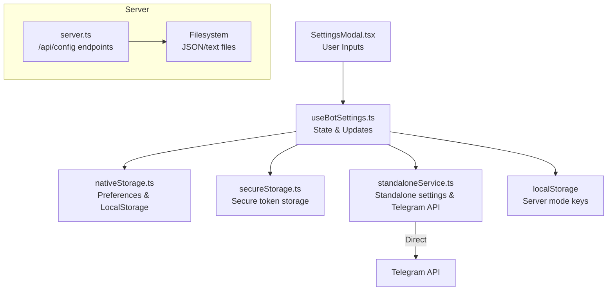
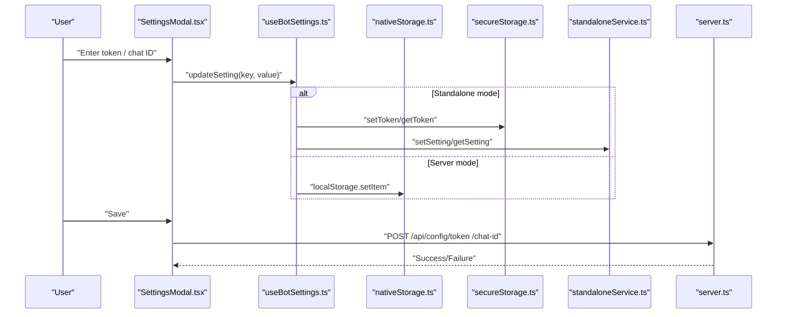
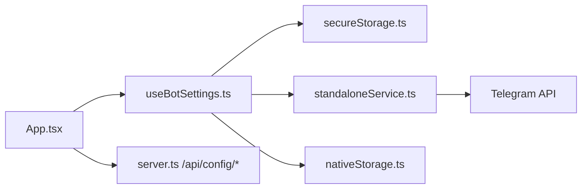

# Application Settings

<cite>
**Referenced Files in This Document**
- [nativeStorage.ts](file://src/services/nativeStorage.ts)
- [secureStorage.ts](file://src/services/secureStorage.ts)
- [standaloneService.ts](file://src/services/standaloneService.ts)
- [storageWrapper.ts](file://src/services/storageWrapper.ts)
- [useBotSettings.ts](file://src/hooks/useBotSettings.ts)
- [SettingsModal.tsx](file://src/components/SettingsModal.tsx)
- [App.tsx](file://src/App.tsx)
- [server.ts](file://server.ts)
- [capacitor.config.ts](file://capacitor.config.ts)
- [package.json](file://package.json)
</cite>

## Table of Contents
1. [Introduction](#introduction)
2. [Project Structure](#project-structure)
3. [Core Components](#core-components)
4. [Architecture Overview](#architecture-overview)
5. [Detailed Component Analysis](#detailed-component-analysis)
6. [Dependency Analysis](#dependency-analysis)
7. [Performance Considerations](#performance-considerations)
8. [Troubleshooting Guide](#troubleshooting-guide)
9. [Conclusion](#conclusion)
10. [Appendices](#appendices)

## Introduction
This document explains the application settings system with a focus on Telegram integration. It covers how bot tokens and chat IDs are configured for both standalone (native) and server modes, how settings are persisted and loaded, and how the UI exposes configuration options. It also documents validation rules, cross-platform behavior differences, and troubleshooting steps.

## Project Structure
The settings system spans client-side React hooks and services, Capacitor-native storage APIs, and a server-side configuration endpoint. The key areas are:
- Settings UI: modal and form controls
- Settings logic: hook managing bot token and chat ID
- Storage abstractions: native vs web persistence
- Server configuration: persistent storage for server mode

**Diagram sources**
- [SettingsModal.tsx:1-107](file://src/components/SettingsModal.tsx#L1-L107)
- [useBotSettings.ts:1-56](file://src/hooks/useBotSettings.ts#L1-L56)
- [nativeStorage.ts:1-63](file://src/services/nativeStorage.ts#L1-L63)
- [secureStorage.ts:1-40](file://src/services/secureStorage.ts#L1-L40)
- [standaloneService.ts:1-175](file://src/services/standaloneService.ts#L1-L175)
- [server.ts:991-1025](file://server.ts#L991-L1025)

**Section sources**
- [SettingsModal.tsx:1-107](file://src/components/SettingsModal.tsx#L1-L107)
- [useBotSettings.ts:1-56](file://src/hooks/useBotSettings.ts#L1-L56)
- [nativeStorage.ts:1-63](file://src/services/nativeStorage.ts#L1-L63)
- [secureStorage.ts:1-40](file://src/services/secureStorage.ts#L1-L40)
- [standaloneService.ts:1-175](file://src/services/standaloneService.ts#L1-L175)
- [server.ts:991-1025](file://server.ts#L991-L1025)

## Core Components
- Settings UI: Presents mode toggle (standalone vs server), token input, chat ID input, and action buttons.
- Settings hook: Centralizes loading and updating bot token and chat ID depending on mode.
- Storage services:
  - Native storage: Uses Capacitor Preferences for tokens and Capacitor Filesystem for JSON/text files in standalone mode.
  - Secure storage: Wraps Preferences/localStorage with a prefixed key for sensitive tokens.
  - Storage wrapper: Cross-platform abstraction for reading/writing JSON/text files.
- Server configuration: Exposes endpoints to persist token and chat ID on the server.

Key responsibilities:
- Mode detection and persistence of mode preference
- Token and chat ID loading and saving
- Validation and sanitization for URLs and chat IDs
- Cross-platform compatibility via Capacitor and localStorage fallbacks

**Section sources**
- [SettingsModal.tsx:1-107](file://src/components/SettingsModal.tsx#L1-L107)
- [useBotSettings.ts:1-56](file://src/hooks/useBotSettings.ts#L1-L56)
- [nativeStorage.ts:1-63](file://src/services/nativeStorage.ts#L1-L63)
- [secureStorage.ts:1-40](file://src/services/secureStorage.ts#L1-L40)
- [storageWrapper.ts:1-100](file://src/services/storageWrapper.ts#L1-L100)
- [standaloneService.ts:1-175](file://src/services/standaloneService.ts#L1-L175)
- [server.ts:991-1025](file://server.ts#L991-L1025)

## Architecture Overview
The settings architecture separates concerns between UI, logic, and persistence:
- UI triggers updates via the settings hook.
- The hook routes updates to either secure storage (standalone) or localStorage (server mode).
- Standalone mode uses Capacitor Preferences for tokens and a dedicated directory for settings.
- Server mode persists token and chat ID via server endpoints.

**Diagram sources**
- [SettingsModal.tsx:1-107](file://src/components/SettingsModal.tsx#L1-L107)
- [useBotSettings.ts:1-56](file://src/hooks/useBotSettings.ts#L1-L56)
- [nativeStorage.ts:1-63](file://src/services/nativeStorage.ts#L1-L63)
- [secureStorage.ts:1-40](file://src/services/secureStorage.ts#L1-L40)
- [standaloneService.ts:1-175](file://src/services/standaloneService.ts#L1-L175)
- [server.ts:991-1025](file://server.ts#L991-L1025)

## Detailed Component Analysis

### Settings Modal (UI)
- Provides mode toggle between standalone and server.
- Displays token input with masked preview and chat ID input.
- Offers actions: test connection (server mode), test network, save settings.
- Persists mode preference in localStorage and Capacitor Preferences.

Usage patterns:
- Toggle mode updates localStorage and Capacitor Preferences.
- Token and chat ID updates call the settings hook’s update function.
- Save triggers server endpoints in server mode.

**Section sources**
- [SettingsModal.tsx:1-107](file://src/components/SettingsModal.tsx#L1-L107)
- [App.tsx:174-182](file://src/App.tsx#L174-L182)

### Settings Hook (Logic)
- Manages bot token and chat ID state.
- Loads settings based on mode:
  - Standalone: reads secure token from secure storage and chat ID from standalone settings.
  - Server: reads token and chat ID from localStorage.
- Updates settings:
  - For tokens: writes to secure storage (standalone) or localStorage (server).
  - For chat ID: writes to standalone settings (standalone) or localStorage (server).

Default value handling:
- Reads return empty string if not found, ensuring safe defaults.

**Section sources**
- [useBotSettings.ts:1-56](file://src/hooks/useBotSettings.ts#L1-L56)
- [App.tsx:267-283](file://src/App.tsx#L267-L283)

### Secure Storage (Standalone Tokens)
- Prefixes keys to isolate secure tokens.
- On native platforms, uses Capacitor Preferences; on web, falls back to localStorage with a warning.
- Provides set/get/remove helpers for tokens.

Security note:
- On web, tokens are stored in localStorage; prefer native builds for stronger protection.

**Section sources**
- [secureStorage.ts:1-40](file://src/services/secureStorage.ts#L1-L40)

### Native Storage (Files and Preferences)
- Ensures a data directory exists on native platforms.
- Reads/writes JSON files via Capacitor Filesystem or localStorage fallback.
- Provides token and chat ID getters/setters via Capacitor Preferences.

**Section sources**
- [nativeStorage.ts:1-63](file://src/services/nativeStorage.ts#L1-L63)

### Standalone Settings and Telegram API
- Initializes a dedicated data directory for standalone mode.
- Saves and loads JSON files and settings using Capacitor Preferences.
- Implements Telegram API wrappers for getMe, sendMessage, sendPhoto, sendMediaGroup, and getUpdates.
- Uses CapacitorHttp on native for direct API calls; fetch on web.

**Section sources**
- [standaloneService.ts:1-175](file://src/services/standaloneService.ts#L1-L175)

### Server Configuration Endpoints
- Token endpoint: accepts a token, persists it, initializes/stops the Telegram bot.
- Chat ID endpoint: validates format and persists it.
- Validates chat ID format to ensure numeric or channel-like identifiers.

**Section sources**
- [server.ts:991-1025](file://server.ts#L991-L1025)

### Cross-Platform Compatibility
- Capacitor platform detection switches between native APIs and web APIs.
- Native builds use Capacitor Preferences and Filesystem; web builds fall back to localStorage and filesystem APIs.
- Capacitor configuration enables HTTP requests and navigation policies suitable for mixed content scenarios.

**Section sources**
- [capacitor.config.ts:1-26](file://capacitor.config.ts#L1-L26)
- [package.json:19-56](file://package.json#L19-L56)

## Dependency Analysis
The settings system depends on:
- Capacitor plugins for preferences and filesystem
- React hooks for state management
- Server endpoints for persistence in server mode
- Telegram API for bot operations

**Diagram sources**
- [App.tsx:267-283](file://src/App.tsx#L267-L283)
- [useBotSettings.ts:1-56](file://src/hooks/useBotSettings.ts#L1-L56)
- [secureStorage.ts:1-40](file://src/services/secureStorage.ts#L1-L40)
- [standaloneService.ts:1-175](file://src/services/standaloneService.ts#L1-L175)
- [nativeStorage.ts:1-63](file://src/services/nativeStorage.ts#L1-L63)
- [server.ts:991-1025](file://server.ts#L991-L1025)

**Section sources**
- [App.tsx:267-283](file://src/App.tsx#L267-L283)
- [useBotSettings.ts:1-56](file://src/hooks/useBotSettings.ts#L1-L56)
- [secureStorage.ts:1-40](file://src/services/secureStorage.ts#L1-L40)
- [standaloneService.ts:1-175](file://src/services/standaloneService.ts#L1-L175)
- [nativeStorage.ts:1-63](file://src/services/nativeStorage.ts#L1-L63)
- [server.ts:991-1025](file://server.ts#L991-L1025)

## Performance Considerations
- Prefer native builds for token storage to avoid localStorage limitations.
- Minimize redundant writes by batching updates and using debounced saves where appropriate.
- Use CapacitorHttp for native requests to bypass CORS overhead and improve reliability.
- Avoid frequent polling in server mode; rely on SSE where supported and polling as fallback.

## Troubleshooting Guide
Common issues and resolutions:
- Token not saved in server mode:
  - Ensure the server URL is set and reachable; verify the token endpoint responds successfully.
  - Confirm the token input is not empty and the save action was triggered.
- Chat ID validation failure:
  - Verify the chat ID matches the expected format (numeric or channel-like identifier).
  - Re-check the server endpoint response for validation errors.
- Standalone token visibility:
  - On web, tokens are stored in localStorage; use native builds for encrypted storage.
  - Clear browser cache/localStorage if corrupted entries are suspected.
- CORS errors in standalone mode:
  - Use native builds or configure the server to allow cross-origin requests.
  - Ensure the server URL is correctly formatted and accessible.
- Network connectivity tests:
  - Use the “Test internet” action to diagnose connectivity issues.
  - Review logs and error messages returned by the app.

Validation rules:
- Chat ID must be a valid numeric or channel-like identifier.
- URL inputs are sanitized and validated before use.

**Section sources**
- [server.ts:1011-1021](file://server.ts#L1011-L1021)
- [SettingsModal.tsx:88-96](file://src/components/SettingsModal.tsx#L88-L96)
- [App.tsx:75-80](file://src/App.tsx#L75-L80)

## Conclusion
The settings system cleanly separates standalone and server modes, leveraging Capacitor APIs for native environments and localStorage for web. It provides robust persistence for bot tokens and chat IDs, with clear validation and user feedback. Following the recommended configuration and troubleshooting steps ensures reliable Telegram integration across platforms.

## Appendices

### Configuration Examples
- Standalone mode:
  - Enter the Telegram bot token in the modal; it is securely stored.
  - Enter the target chat ID for posting.
- Server mode:
  - Enter the server URL and save.
  - Enter the Telegram bot token; the app posts it to the server endpoint for persistence.

### Settings Interface Methods and Usage Patterns
- useBotSettings:
  - loadSettings(): loads token and chat ID based on current mode.
  - updateSetting(key, value): updates token or chat ID and persists accordingly.
- nativeStorage:
  - readJsonFile/writeJsonFile: cross-platform JSON file I/O.
  - getToken/setToken/getChatId/setChatId: token and chat ID via Preferences.
- secureStorage:
  - setToken/getToken/removeToken: secure token management with platform-specific behavior.
- standaloneService:
  - init/saveJson/loadJson/setSetting/getSetting: standalone-specific settings and data persistence.
  - telegram.getMe/sendMessage/sendPhoto/sendMediaGroup/getUpdates: Telegram API wrappers.

**Section sources**
- [useBotSettings.ts:1-56](file://src/hooks/useBotSettings.ts#L1-L56)
- [nativeStorage.ts:1-63](file://src/services/nativeStorage.ts#L1-L63)
- [secureStorage.ts:1-40](file://src/services/secureStorage.ts#L1-L40)
- [standaloneService.ts:1-175](file://src/services/standaloneService.ts#L1-L175)
- [server.ts:991-1025](file://server.ts#L991-L1025)