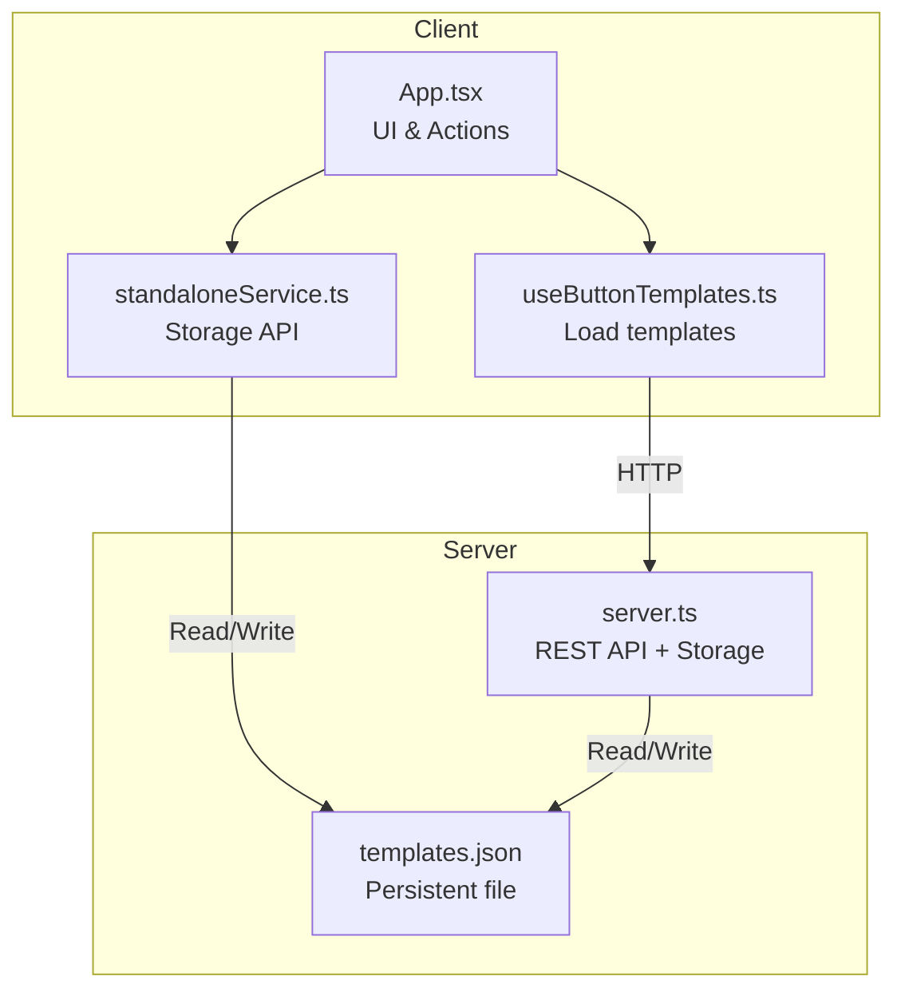
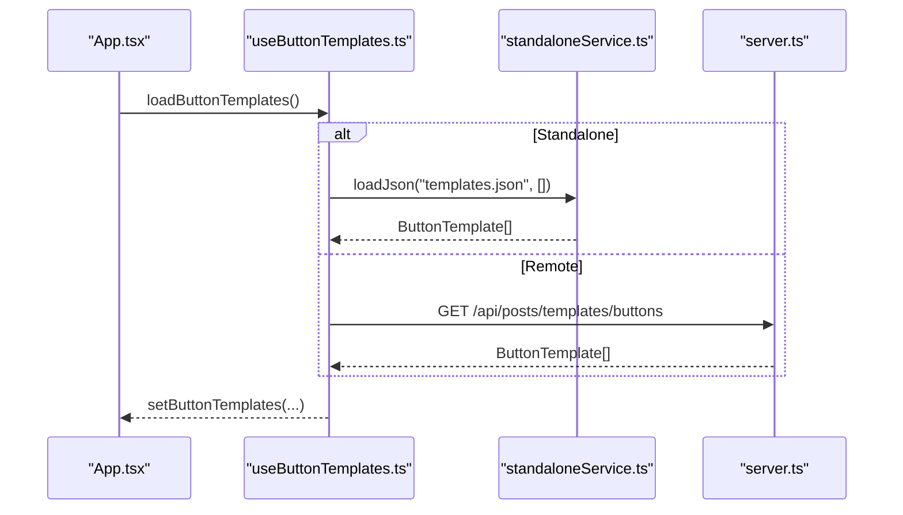
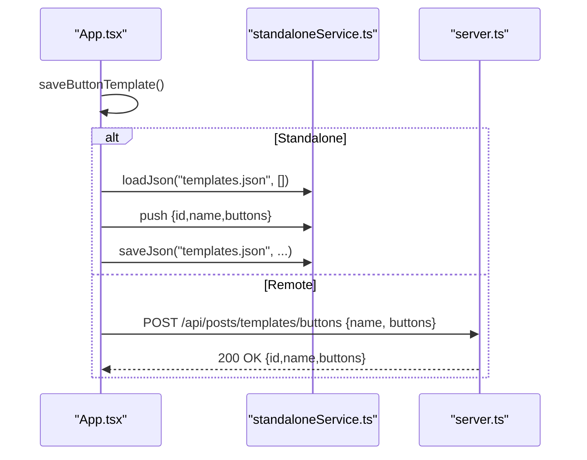
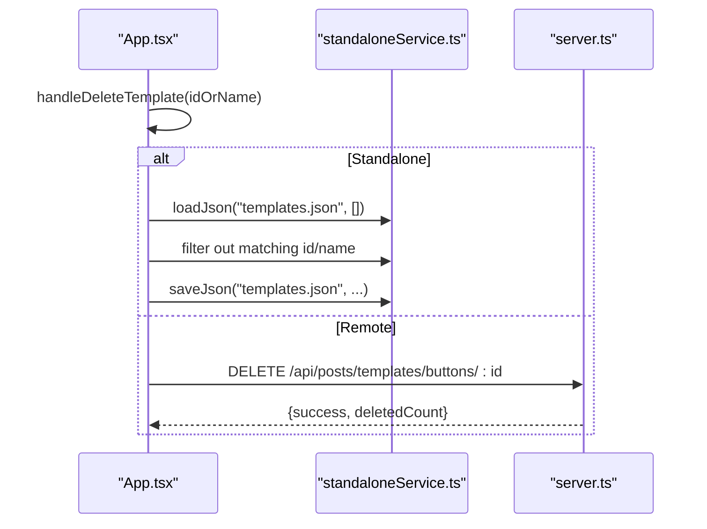
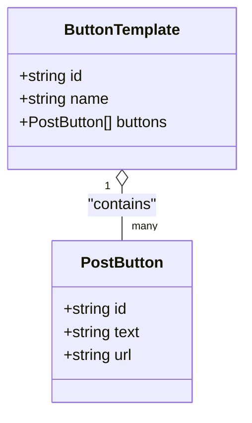
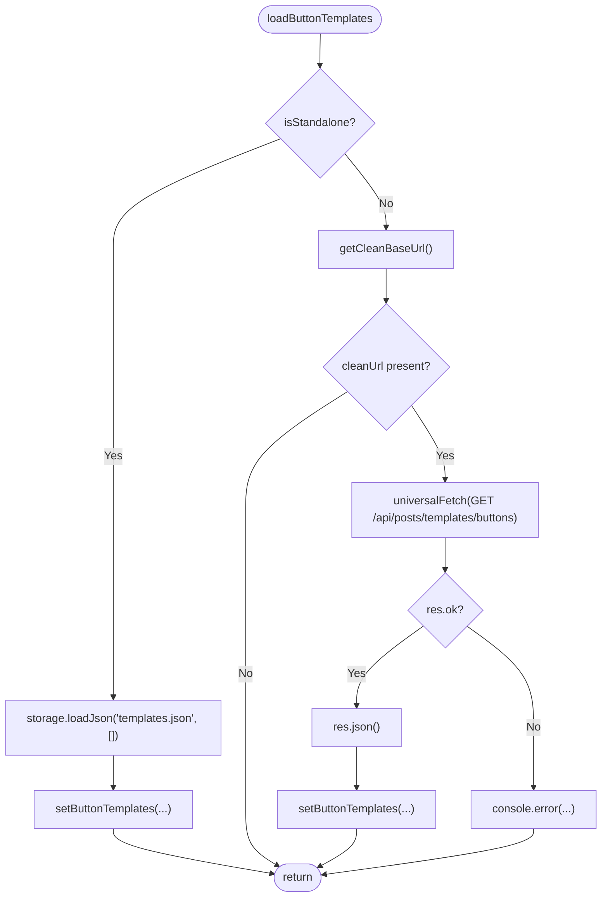
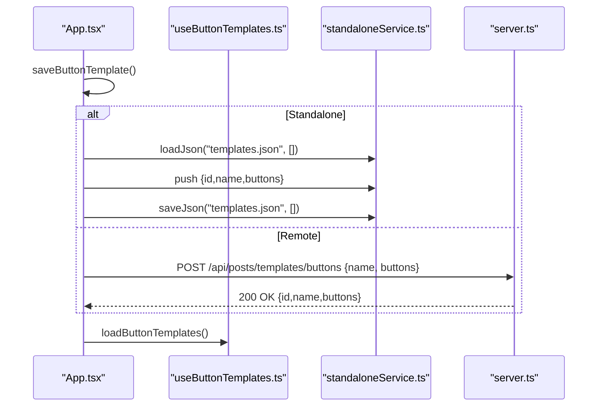
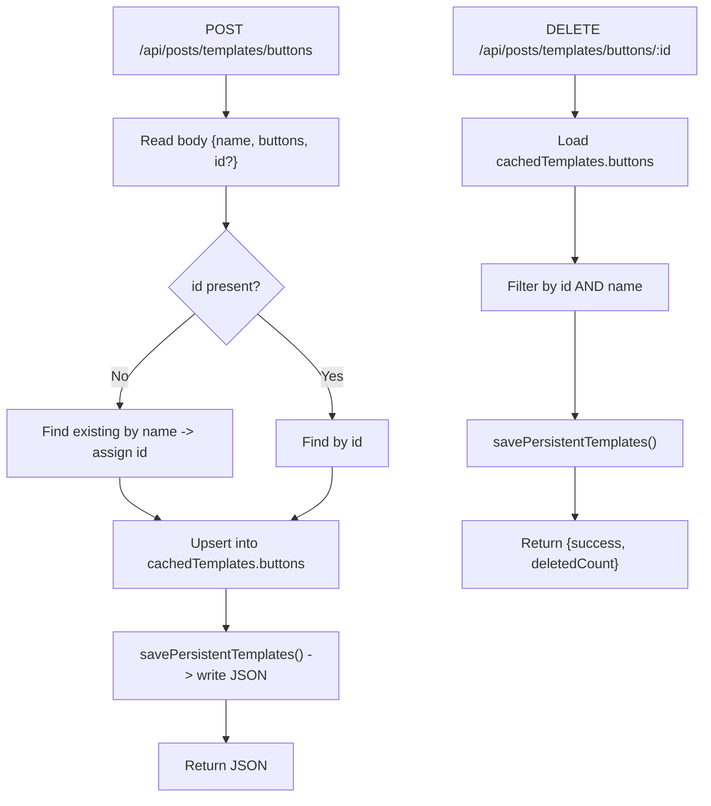
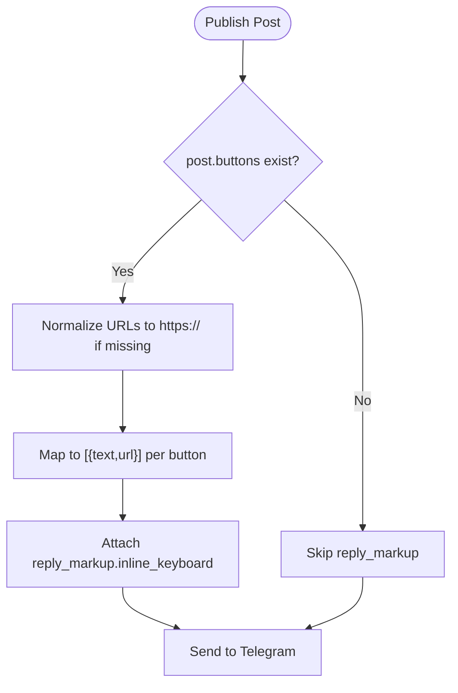
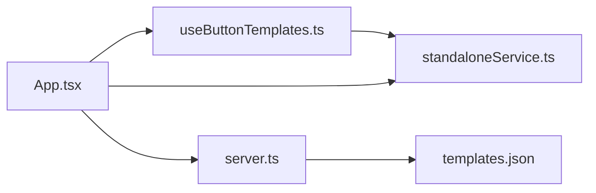

# Button Templates

<cite>
**Referenced Files in This Document**
- [useButtonTemplates.ts](file://src/hooks/useButtonTemplates.ts)
- [types.ts](file://src/types.ts)
- [App.tsx](file://src/App.tsx)
- [standaloneService.ts](file://src/services/standaloneService.ts)
- [server.ts](file://server.ts)
- [storageWrapper.ts](file://src/services/storageWrapper.ts)
- [README.md](file://README.md)
</cite>

## Table of Contents
1. [Introduction](#introduction)
2. [Project Structure](#project-structure)
3. [Core Components](#core-components)
4. [Architecture Overview](#architecture-overview)
5. [Detailed Component Analysis](#detailed-component-analysis)
6. [Dependency Analysis](#dependency-analysis)
7. [Performance Considerations](#performance-considerations)
8. [Troubleshooting Guide](#troubleshooting-guide)
9. [Conclusion](#conclusion)
10. [Appendices](#appendices)

## Introduction
This document explains the button template system used to define reusable Telegram inline button configurations for posts. It covers how templates are structured, how to create and manage them (including persistence), how they integrate into the content creation workflow, and how they are rendered into Telegram messages. It also documents validation, error handling, and troubleshooting steps.

## Project Structure
The button template system spans client-side React hooks and services, and server-side persistence and APIs. Key areas:
- Template data model and types
- Client-side hook for loading templates
- Client-side UI actions for saving/deleting templates
- Standalone persistence via filesystem/local storage
- Server-side REST endpoints for CRUD operations
- Server-side persistent storage for templates

**Diagram sources**
- [App.tsx:1044-1075](file://src/App.tsx#L1044-L1075)
- [useButtonTemplates.ts:1-37](file://src/hooks/useButtonTemplates.ts#L1-L37)
- [standaloneService.ts:11-72](file://src/services/standaloneService.ts#L11-L72)
- [server.ts:127-163](file://server.ts#L127-L163)

**Section sources**
- [README.md:1-25](file://README.md#L1-L25)
- [types.ts:28-32](file://src/types.ts#L28-L32)
- [useButtonTemplates.ts:1-37](file://src/hooks/useButtonTemplates.ts#L1-L37)
- [App.tsx:1044-1075](file://src/App.tsx#L1044-L1075)
- [standaloneService.ts:11-72](file://src/services/standaloneService.ts#L11-L72)
- [server.ts:127-163](file://server.ts#L127-L163)

## Core Components
- Data model
  - ButtonTemplate: an object containing an identifier, a human-readable name, and an array of PostButton entries.
  - PostButton: an object representing a single inline button with an identifier, text label, and URL.
- Client-side template loader
  - useButtonTemplates: loads templates either from a local JSON file (standalone mode) or from the server’s REST endpoint.
- Client-side template actions
  - Save template: persists a new template in standalone mode or sends a POST request to the server.
  - Delete template: removes a template by id or name in standalone mode or sends a DELETE request to the server.
- Server-side persistence
  - Templates are stored in a JSON file and loaded into memory at startup. The server exposes endpoints to list, create/update, and delete button templates.

**Section sources**
- [types.ts:28-32](file://src/types.ts#L28-L32)
- [types.ts:1-5](file://src/types.ts#L1-L5)
- [useButtonTemplates.ts:1-37](file://src/hooks/useButtonTemplates.ts#L1-L37)
- [App.tsx:1044-1075](file://src/App.tsx#L1044-L1075)
- [server.ts:127-163](file://server.ts#L127-L163)

## Architecture Overview
The system supports two modes:
- Standalone mode: templates are stored in a JSON file and accessed via the storage service.
- Remote mode: templates are managed via REST endpoints on the server.

**Diagram sources**
- [useButtonTemplates.ts:9-29](file://src/hooks/useButtonTemplates.ts#L9-L29)
- [standaloneService.ts:38-54](file://src/services/standaloneService.ts#L38-L54)
- [server.ts:1244-1245](file://server.ts#L1244-L1245)

**Diagram sources**
- [App.tsx:1044-1060](file://src/App.tsx#L1044-L1060)
- [standaloneService.ts:25-54](file://src/services/standaloneService.ts#L25-L54)
- [server.ts:1247-1258](file://server.ts#L1247-L1258)

**Diagram sources**
- [App.tsx:1062-1075](file://src/App.tsx#L1062-L1075)
- [standaloneService.ts:25-54](file://src/services/standaloneService.ts#L25-L54)
- [server.ts:1260-1265](file://server.ts#L1260-L1265)

## Detailed Component Analysis

### Data Model and Types
- ButtonTemplate
  - Fields: id, name, buttons
  - Purpose: encapsulates a named collection of inline buttons
- PostButton
  - Fields: id, text, url
  - Purpose: defines a single Telegram inline button

**Diagram sources**
- [types.ts:28-32](file://src/types.ts#L28-L32)
- [types.ts:1-5](file://src/types.ts#L1-L5)

**Section sources**
- [types.ts:1-32](file://src/types.ts#L1-L32)

### Client Template Loader (useButtonTemplates)
- Responsibilities
  - Load templates from either standalone storage or remote API
  - Manage loading state
- Behavior
  - In standalone mode: reads templates.json and sets the state
  - In remote mode: fetches from /api/posts/templates/buttons and sets the state
- Error handling
  - Logs failures during load and ensures loading flag is cleared

**Diagram sources**
- [useButtonTemplates.ts:9-29](file://src/hooks/useButtonTemplates.ts#L9-L29)

**Section sources**
- [useButtonTemplates.ts:1-37](file://src/hooks/useButtonTemplates.ts#L1-L37)

### Client Template Actions (Save/Delete)
- Save template
  - Standalone: append to templates.json and reload data
  - Remote: POST to /api/posts/templates/buttons with {name, buttons}
- Delete template
  - Standalone: filter templates.json by id or name and rewrite
  - Remote: DELETE /api/posts/templates/buttons/:id

**Diagram sources**
- [App.tsx:1044-1060](file://src/App.tsx#L1044-L1060)
- [standaloneService.ts:25-54](file://src/services/standaloneService.ts#L25-L54)
- [server.ts:1247-1258](file://server.ts#L1247-L1258)

**Section sources**
- [App.tsx:1044-1075](file://src/App.tsx#L1044-L1075)

### Server Template Management
- Endpoints
  - GET /api/posts/templates/buttons: returns persisted button templates
  - POST /api/posts/templates/buttons: upserts a template (assigns id if missing, updates or inserts)
  - DELETE /api/posts/templates/buttons/:id: deletes template by id or name
- Persistence
  - Templates are stored in a JSON file and cached in memory
  - On startup, templates are loaded and ensured to exist on disk

**Diagram sources**
- [server.ts:1244-1266](file://server.ts#L1244-L1266)
- [server.ts:127-163](file://server.ts#L127-L163)

**Section sources**
- [server.ts:1244-1266](file://server.ts#L1244-L1266)
- [server.ts:127-163](file://server.ts#L127-L163)

### Telegram Inline Button Rendering
- When publishing a post, the system constructs Telegram’s reply_markup.inline_keyboard from the template’s PostButton entries.
- Each PostButton becomes a single inline button with text and url.
- URLs are normalized to absolute HTTPS when constructing the post payload.

**Diagram sources**
- [App.tsx:920-936](file://src/App.tsx#L920-L936)
- [server.ts:816-825](file://server.ts#L816-L825)

**Section sources**
- [App.tsx:920-936](file://src/App.tsx#L920-L936)
- [server.ts:816-825](file://server.ts#L816-L825)

## Dependency Analysis
- Client depends on:
  - useButtonTemplates for loading templates
  - standaloneService for local storage operations
  - App.tsx for orchestrating save/delete and rendering
- Server depends on:
  - storageWrapper for file I/O
  - Express routes for template CRUD

**Diagram sources**
- [App.tsx:1044-1075](file://src/App.tsx#L1044-L1075)
- [useButtonTemplates.ts:1-37](file://src/hooks/useButtonTemplates.ts#L1-L37)
- [standaloneService.ts:11-72](file://src/services/standaloneService.ts#L11-L72)
- [server.ts:127-163](file://server.ts#L127-L163)

**Section sources**
- [App.tsx:1044-1075](file://src/App.tsx#L1044-L1075)
- [useButtonTemplates.ts:1-37](file://src/hooks/useButtonTemplates.ts#L1-L37)
- [standaloneService.ts:11-72](file://src/services/standaloneService.ts#L11-L72)
- [server.ts:127-163](file://server.ts#L127-L163)

## Performance Considerations
- Loading templates
  - Client-side: templates are small arrays; loading cost is minimal.
  - Server-side: templates are cached in memory; JSON read/write occurs on mutation.
- Network
  - Remote mode uses rate-limited endpoints; batch operations should avoid excessive mutations.
- Rendering
  - Each template button is a single inline keyboard row; keep the number reasonable for Telegram’s limits.

## Troubleshooting Guide
- Templates not loading
  - Verify standalone mode vs remote mode selection.
  - In remote mode, ensure the base URL is configured and reachable.
  - Confirm the server endpoint returns a valid JSON array.
- Save fails
  - Standalone: check permissions for file system/local storage.
  - Remote: inspect network tab for 4xx/5xx responses; confirm server logs.
- Delete fails
  - Ensure the id or name matches exactly; server filters by both id and name.
- URL normalization issues
  - When publishing, URLs are normalized to HTTPS; ensure original URLs are valid or will resolve to HTTPS.

**Section sources**
- [useButtonTemplates.ts:9-29](file://src/hooks/useButtonTemplates.ts#L9-L29)
- [App.tsx:1044-1075](file://src/App.tsx#L1044-L1075)
- [server.ts:1260-1265](file://server.ts#L1260-L1265)

## Conclusion
The button template system provides a simple, flexible way to define and reuse Telegram inline button layouts. Templates are modeled as named collections of PostButton entries, persisted either locally or remotely, and integrated seamlessly into the post publishing workflow. The design emphasizes straightforward CRUD operations, predictable data structures, and robust fallbacks for both standalone and remote environments.

## Appendices

### Template Structure Definition
- ButtonTemplate
  - id: unique identifier
  - name: human-readable name
  - buttons: array of PostButton
- PostButton
  - id: unique identifier
  - text: button label
  - url: target URL

**Section sources**
- [types.ts:28-32](file://src/types.ts#L28-L32)
- [types.ts:1-5](file://src/types.ts#L1-L5)

### Template Management Operations
- Create
  - Standalone: append to templates.json
  - Remote: POST /api/posts/templates/buttons
- Read
  - Standalone: load templates.json
  - Remote: GET /api/posts/templates/buttons
- Update
  - Remote: POST with existing id to upsert
- Delete
  - Standalone: filter templates.json by id or name
  - Remote: DELETE /api/posts/templates/buttons/:id

**Section sources**
- [App.tsx:1044-1075](file://src/App.tsx#L1044-L1075)
- [server.ts:1244-1266](file://server.ts#L1244-L1266)

### Integration with Content Creation Workflow
- During post construction, users can:
  - Add buttons manually (as PostButton entries)
  - Save current buttons as a template
  - Apply a saved template to the current post
- On publish, the system converts PostButton entries into Telegram’s inline_keyboard format.

**Section sources**
- [App.tsx:1044-1075](file://src/App.tsx#L1044-L1075)
- [App.tsx:920-936](file://src/App.tsx#L920-L936)