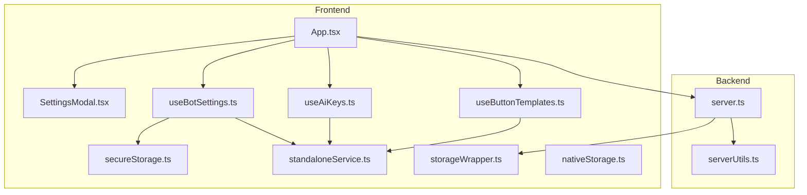
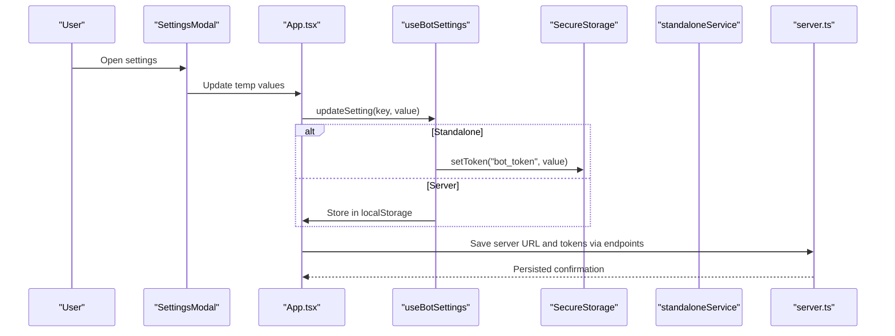
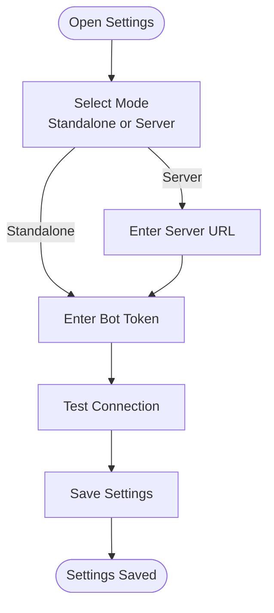
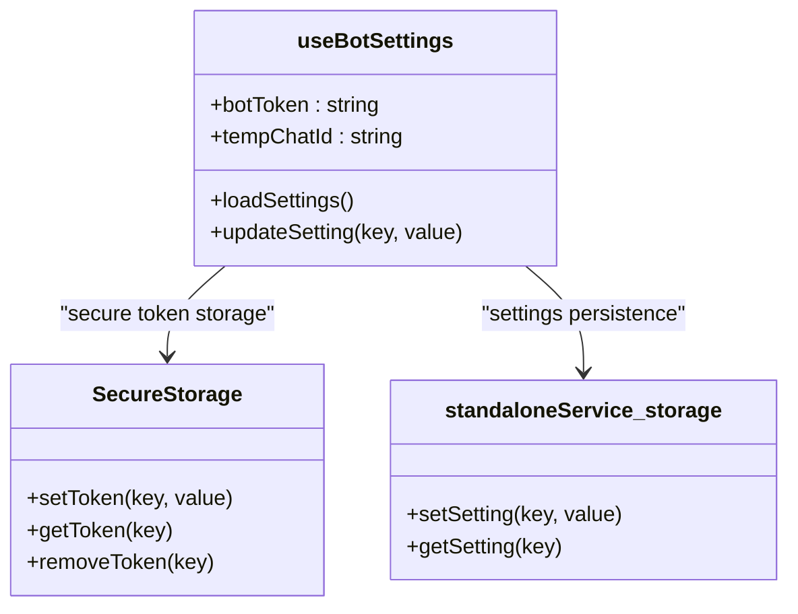
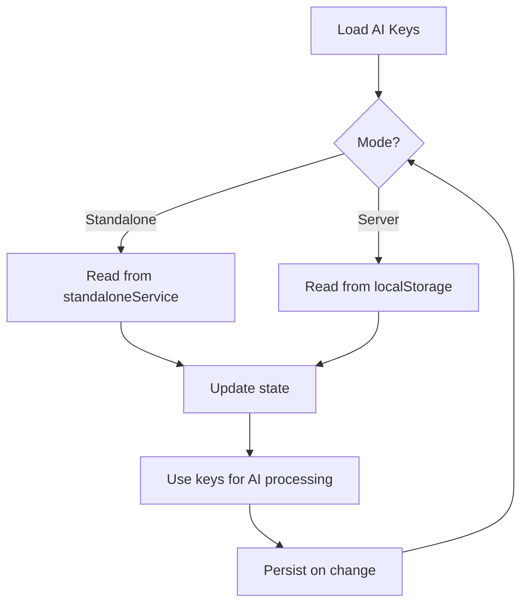
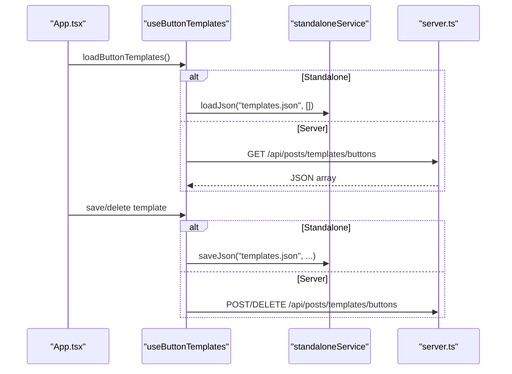
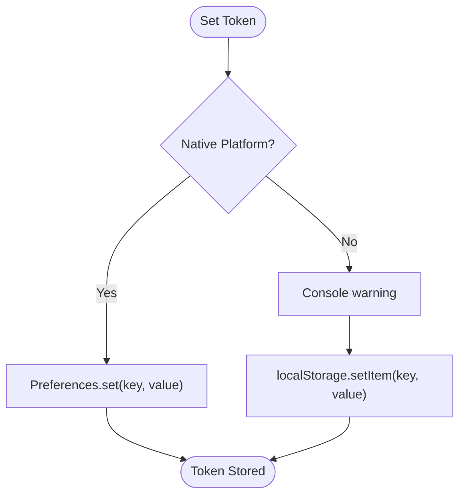
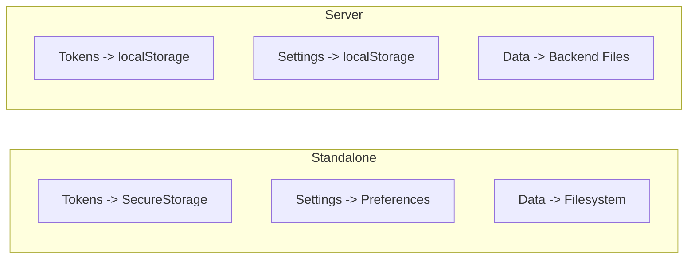
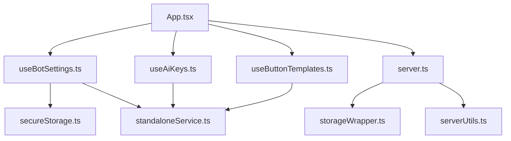

# Settings and Configuration

<cite>
**Referenced Files in This Document**
- [src/App.tsx](file://src/App.tsx)
- [src/components/SettingsModal.tsx](file://src/components/SettingsModal.tsx)
- [src/hooks/useBotSettings.ts](file://src/hooks/useBotSettings.ts)
- [src/hooks/useAiKeys.ts](file://src/hooks/useAiKeys.ts)
- [src/hooks/useButtonTemplates.ts](file://src/hooks/useButtonTemplates.ts)
- [src/services/secureStorage.ts](file://src/services/secureStorage.ts)
- [src/services/standaloneService.ts](file://src/services/standaloneService.ts)
- [src/services/storageWrapper.ts](file://src/services/storageWrapper.ts)
- [src/services/nativeStorage.ts](file://src/services/nativeStorage.ts)
- [src/types.ts](file://src/types.ts)
- [server.ts](file://server.ts)
- [src/serverUtils.ts](file://src/serverUtils.ts)
</cite>

## Table of Contents
1. [Introduction](#introduction)
2. [Project Structure](#project-structure)
3. [Core Components](#core-components)
4. [Architecture Overview](#architecture-overview)
5. [Detailed Component Analysis](#detailed-component-analysis)
6. [Dependency Analysis](#dependency-analysis)
7. [Performance Considerations](#performance-considerations)
8. [Troubleshooting Guide](#troubleshooting-guide)
9. [Conclusion](#conclusion)
10. [Appendices](#appendices)

## Introduction
This document explains the settings and configuration system for the application. It covers:
- Application settings: server configuration, AI provider settings, Telegram bot configuration, and UI preferences
- Button template management: creation, usage, and persistence
- Secure API key management: storage, validation, provider authentication, and access control
- Configuration persistence strategies, defaults, and user preference management
- Backup and restore procedures
- Troubleshooting and best practices for maintaining settings across deployments

## Project Structure
The configuration system spans the frontend (React) and backend (Node/Express) with shared storage abstractions:
- Frontend hooks manage settings and UI state
- Secure storage is handled via a dedicated service
- Standalone and server modes use different persistence strategies
- Backend persists configuration to files and exposes endpoints for remote clients

**Diagram sources**
- [src/App.tsx:168-182](file://src/App.tsx#L168-L182)
- [src/components/SettingsModal.tsx:28-33](file://src/components/SettingsModal.tsx#L28-L33)
- [src/hooks/useBotSettings.ts:5-23](file://src/hooks/useBotSettings.ts#L5-L23)
- [src/hooks/useAiKeys.ts:4-35](file://src/hooks/useAiKeys.ts#L4-L35)
- [src/hooks/useButtonTemplates.ts:5-29](file://src/hooks/useButtonTemplates.ts#L5-L29)
- [src/services/secureStorage.ts:4-38](file://src/services/secureStorage.ts#L4-L38)
- [src/services/standaloneService.ts:11-72](file://src/services/standaloneService.ts#L11-L72)
- [src/services/storageWrapper.ts:9-54](file://src/services/storageWrapper.ts#L9-L54)
- [src/services/nativeStorage.ts:8-46](file://src/services/nativeStorage.ts#L8-L46)
- [server.ts:1-36](file://server.ts#L1-L36)
- [src/serverUtils.ts:7-22](file://src/serverUtils.ts#L7-L22)

**Section sources**
- [src/App.tsx:168-182](file://src/App.tsx#L168-L182)
- [server.ts:1-36](file://server.ts#L1-L36)

## Core Components
- Settings modal and state management
- Bot settings hook with secure token storage
- AI keys management
- Button templates loader
- Storage abstractions for standalone and server modes
- Backend configuration endpoints and persistence

**Section sources**
- [src/components/SettingsModal.tsx:28-106](file://src/components/SettingsModal.tsx#L28-L106)
- [src/hooks/useBotSettings.ts:5-55](file://src/hooks/useBotSettings.ts#L5-L55)
- [src/hooks/useAiKeys.ts:4-56](file://src/hooks/useAiKeys.ts#L4-L56)
- [src/hooks/useButtonTemplates.ts:5-37](file://src/hooks/useButtonTemplates.ts#L5-L37)
- [src/services/secureStorage.ts:4-38](file://src/services/secureStorage.ts#L4-L38)
- [src/services/standaloneService.ts:11-72](file://src/services/standaloneService.ts#L11-L72)
- [src/services/storageWrapper.ts:9-54](file://src/services/storageWrapper.ts#L9-L54)
- [server.ts:1079-1105](file://server.ts#L1079-L1105)

## Architecture Overview
The system supports two operational modes:
- Standalone (native mobile): Uses Capacitor Preferences and filesystem for secure storage and local persistence
- Server (web/test): Uses browser localStorage and backend endpoints for configuration and data

**Diagram sources**
- [src/components/SettingsModal.tsx:28-106](file://src/components/SettingsModal.tsx#L28-L106)
- [src/hooks/useBotSettings.ts:25-43](file://src/hooks/useBotSettings.ts#L25-L43)
- [src/services/secureStorage.ts:7-38](file://src/services/secureStorage.ts#L7-L38)
- [src/services/standaloneService.ts:56-71](file://src/services/standaloneService.ts#L56-L71)
- [src/App.tsx:1261-1287](file://src/App.tsx#L1261-L1287)
- [server.ts:1079-1096](file://server.ts#L1079-L1096)

## Detailed Component Analysis

### Settings Modal and Application Settings
- Mode selection: Standalone vs Server
- Server URL input and validation
- Telegram bot token input (masked preview)
- Connection testing and network diagnostics
- Save settings with validation and feedback

**Diagram sources**
- [src/components/SettingsModal.tsx:46-101](file://src/components/SettingsModal.tsx#L46-L101)
- [src/App.tsx:1261-1287](file://src/App.tsx#L1261-L1287)

**Section sources**
- [src/components/SettingsModal.tsx:28-106](file://src/components/SettingsModal.tsx#L28-L106)
- [src/App.tsx:1261-1287](file://src/App.tsx#L1261-L1287)

### Bot Settings Hook and Secure Storage
- Loads and updates bot token and chat ID
- Uses secure storage for tokens on native platforms
- Persists settings locally in server mode

**Diagram sources**
- [src/hooks/useBotSettings.ts:5-55](file://src/hooks/useBotSettings.ts#L5-L55)
- [src/services/secureStorage.ts:4-38](file://src/services/secureStorage.ts#L4-L38)
- [src/services/standaloneService.ts:56-71](file://src/services/standaloneService.ts#L56-L71)

**Section sources**
- [src/hooks/useBotSettings.ts:5-55](file://src/hooks/useBotSettings.ts#L5-L55)
- [src/services/secureStorage.ts:4-38](file://src/services/secureStorage.ts#L4-L38)
- [src/services/standaloneService.ts:56-71](file://src/services/standaloneService.ts#L56-L71)

### AI Provider Keys Management
- Manages multiple AI provider keys (Gemini, GitHub, OpenRouter, DeepSeek)
- Supports standalone and server modes with appropriate persistence
- Provides loading and updating of keys

**Diagram sources**
- [src/hooks/useAiKeys.ts:8-44](file://src/hooks/useAiKeys.ts#L8-L44)
- [src/services/standaloneService.ts:11-72](file://src/services/standaloneService.ts#L11-L72)
- [server.ts:144-148](file://server.ts#L144-L148)

**Section sources**
- [src/hooks/useAiKeys.ts:4-56](file://src/hooks/useAiKeys.ts#L4-L56)
- [src/services/standaloneService.ts:11-72](file://src/services/standaloneService.ts#L11-L72)
- [server.ts:144-148](file://server.ts#L144-L148)

### Button Template Management
- Loads templates either from local storage (standalone) or server endpoint (server mode)
- Supports saving and deleting templates
- Templates are typed and persisted per mode

**Diagram sources**
- [src/hooks/useButtonTemplates.ts:9-29](file://src/hooks/useButtonTemplates.ts#L9-L29)
- [src/services/standaloneService.ts:38-54](file://src/services/standaloneService.ts#L38-L54)
- [src/App.tsx:1044-1075](file://src/App.tsx#L1044-L1075)
- [server.ts:1079-1105](file://server.ts#L1079-L1105)

**Section sources**
- [src/hooks/useButtonTemplates.ts:5-37](file://src/hooks/useButtonTemplates.ts#L5-L37)
- [src/services/standaloneService.ts:38-54](file://src/services/standaloneService.ts#L38-L54)
- [src/App.tsx:1044-1075](file://src/App.tsx#L1044-L1075)
- [src/types.ts:28-32](file://src/types.ts#L28-L32)
- [server.ts:1079-1105](file://server.ts#L1079-L1105)

### Secure API Key Management
- Tokens are stored securely on native platforms using Capacitor Preferences
- On web, warns about insecure storage and falls back to localStorage
- Tokens are masked in UI previews for bot tokens

**Diagram sources**
- [src/services/secureStorage.ts:7-38](file://src/services/secureStorage.ts#L7-L38)
- [src/components/SettingsModal.tsx:70-75](file://src/components/SettingsModal.tsx#L70-L75)

**Section sources**
- [src/services/secureStorage.ts:4-38](file://src/services/secureStorage.ts#L4-L38)
- [src/components/SettingsModal.tsx:70-75](file://src/components/SettingsModal.tsx#L70-L75)

### Configuration Persistence Strategies
- Standalone mode:
  - Tokens: secure storage
  - Settings: Preferences
  - Data: filesystem under Documents directory
- Server mode:
  - Tokens: localStorage
  - Settings: localStorage
  - Data: backend files via endpoints

**Diagram sources**
- [src/services/secureStorage.ts:4-38](file://src/services/secureStorage.ts#L4-L38)
- [src/services/standaloneService.ts:11-72](file://src/services/standaloneService.ts#L11-L72)
- [src/services/storageWrapper.ts:9-54](file://src/services/storageWrapper.ts#L9-L54)
- [server.ts:1079-1105](file://server.ts#L1079-L1105)

**Section sources**
- [src/services/secureStorage.ts:4-38](file://src/services/secureStorage.ts#L4-L38)
- [src/services/standaloneService.ts:11-72](file://src/services/standaloneService.ts#L11-L72)
- [src/services/storageWrapper.ts:9-54](file://src/services/storageWrapper.ts#L9-L54)
- [server.ts:1079-1105](file://server.ts#L1079-L1105)

### Default Value Handling and User Preferences
- Defaults are provided when loading configuration fails
- UI masks sensitive tokens for visibility without exposure
- Preferences include standalone mode flag and server URL

**Section sources**
- [src/services/standaloneService.ts:38-54](file://src/services/standaloneService.ts#L38-L54)
- [src/services/storageWrapper.ts:9-33](file://src/services/storageWrapper.ts#L9-L33)
- [src/components/SettingsModal.tsx:70-75](file://src/components/SettingsModal.tsx#L70-L75)
- [src/App.tsx:176-182](file://src/App.tsx#L176-L182)

## Dependency Analysis
- Frontend depends on hooks for settings and templates, and services for secure storage and standalone persistence
- Backend depends on storage wrappers and exposes endpoints for configuration and data
- Cross-cutting concerns: URL sanitization, platform detection, and error logging

**Diagram sources**
- [src/hooks/useBotSettings.ts:1-55](file://src/hooks/useBotSettings.ts#L1-L55)
- [src/hooks/useAiKeys.ts:1-56](file://src/hooks/useAiKeys.ts#L1-L56)
- [src/hooks/useButtonTemplates.ts:1-37](file://src/hooks/useButtonTemplates.ts#L1-L37)
- [src/services/secureStorage.ts:1-38](file://src/services/secureStorage.ts#L1-L38)
- [src/services/standaloneService.ts:1-72](file://src/services/standaloneService.ts#L1-L72)
- [src/App.tsx:1-120](file://src/App.tsx#L1-L120)
- [server.ts:1-36](file://server.ts#L1-L36)
- [src/serverUtils.ts:7-22](file://src/serverUtils.ts#L7-L22)

**Section sources**
- [src/hooks/useBotSettings.ts:1-55](file://src/hooks/useBotSettings.ts#L1-L55)
- [src/hooks/useAiKeys.ts:1-56](file://src/hooks/useAiKeys.ts#L1-L56)
- [src/hooks/useButtonTemplates.ts:1-37](file://src/hooks/useButtonTemplates.ts#L1-L37)
- [src/services/secureStorage.ts:1-38](file://src/services/secureStorage.ts#L1-L38)
- [src/services/standaloneService.ts:1-72](file://src/services/standaloneService.ts#L1-L72)
- [src/App.tsx:1-120](file://src/App.tsx#L1-L120)
- [server.ts:1-36](file://server.ts#L1-L36)
- [src/serverUtils.ts:7-22](file://src/serverUtils.ts#L7-L22)

## Performance Considerations
- Minimize synchronous filesystem operations on native platforms
- Debounce auto-saving of frequently changing settings (e.g., image path)
- Use caching for server configuration status and templates
- Avoid excessive polling; rely on SSE/WebSocket where available

## Troubleshooting Guide
Common configuration issues and resolutions:
- Invalid or malformed server URL
  - Validate URL format and scheme; ensure no whitespace
  - Use sanitized base URL helper
- CORS or connectivity issues in browser
  - Prefer server mode with a compatible backend URL
  - Test network connectivity and server reachability
- Missing or invalid Telegram bot token
  - Verify token length and format
  - Masked preview helps confirm partial correctness
- AI key errors
  - Confirm provider keys are set and valid
  - Check quotas and rate limits
- Template loading failures
  - Ensure templates exist or refresh from server
- Local storage errors
  - Clear browser storage or reset app settings

**Section sources**
- [src/App.tsx:254-265](file://src/App.tsx#L254-L265)
- [src/App.tsx:1261-1287](file://src/App.tsx#L1261-L1287)
- [src/components/SettingsModal.tsx:70-75](file://src/components/SettingsModal.tsx#L70-L75)
- [src/hooks/useAiKeys.ts:8-35](file://src/hooks/useAiKeys.ts#L8-L35)
- [src/hooks/useButtonTemplates.ts:9-29](file://src/hooks/useButtonTemplates.ts#L9-L29)

## Conclusion
The settings and configuration system provides a robust, cross-platform solution for managing application configuration. It balances security (secure token storage), flexibility (server and standalone modes), and usability (masked tokens, defaults, and UI feedback). Following the best practices outlined here ensures reliable operation across deployments.

## Appendices

### Configuration Backup and Restore
- Standalone mode
  - Export templates and drafts from filesystem-backed storage
  - Back up API keys and settings from secure storage
- Server mode
  - Back up backend files managed by the server
  - Use server endpoints to export configuration snapshots

[No sources needed since this section provides general guidance]

### Best Practices for Maintaining Settings Across Deployments
- Prefer secure storage for tokens on native platforms
- Use server mode for environments requiring centralized configuration
- Validate and sanitize URLs before persisting
- Keep defaults minimal and explicit for easy recovery
- Monitor logs for configuration-related errors

[No sources needed since this section provides general guidance]