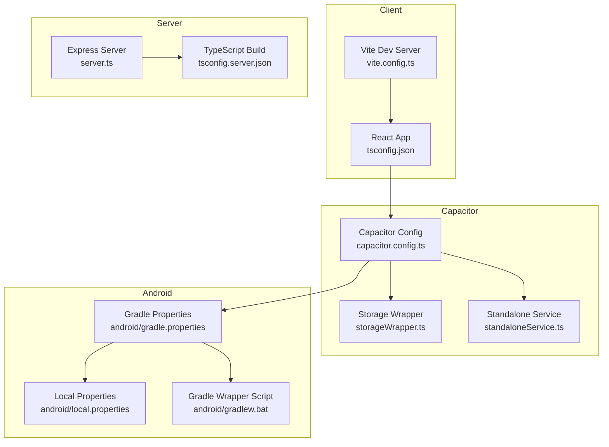
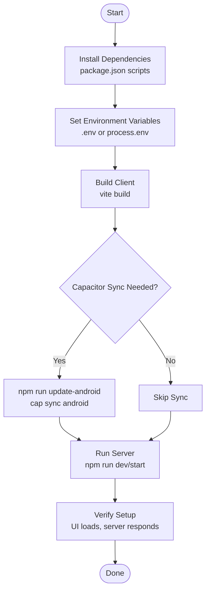
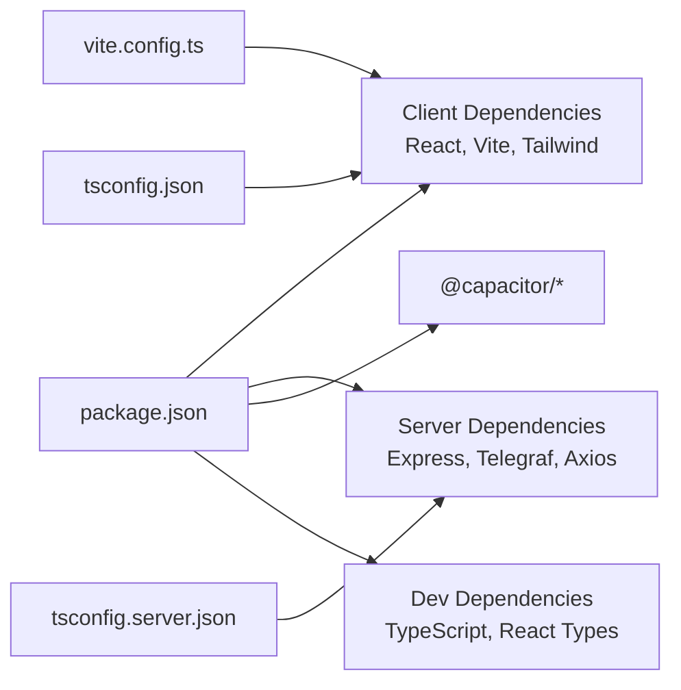

# Common Setup Issues

<cite>
**Referenced Files in This Document**
- [package.json](file://package.json)
- [README.md](file://README.md)
- [capacitor.config.ts](file://capacitor.config.ts)
- [vite.config.ts](file://vite.config.ts)
- [server.ts](file://server.ts)
- [tsconfig.json](file://tsconfig.json)
- [tsconfig.server.json](file://tsconfig.server.json)
- [src/hooks/useAiKeys.ts](file://src/hooks/useAiKeys.ts)
- [src/services/standaloneService.ts](file://src/services/standaloneService.ts)
- [src/services/storageWrapper.ts](file://src/services/storageWrapper.ts)
- [android/local.properties](file://android/local.properties)
- [android/gradle.properties](file://android/gradle.properties)
- [android/gradlew.bat](file://android/gradlew.bat)
</cite>

## Table of Contents
1. [Introduction](#introduction)
2. [Project Structure](#project-structure)
3. [Core Components](#core-components)
4. [Architecture Overview](#architecture-overview)
5. [Detailed Component Analysis](#detailed-component-analysis)
6. [Dependency Analysis](#dependency-analysis)
7. [Performance Considerations](#performance-considerations)
8. [Troubleshooting Guide](#troubleshooting-guide)
9. [Conclusion](#conclusion)

## Introduction
This document provides a comprehensive troubleshooting guide for common setup and installation issues encountered when building and running the project locally. It focuses on dependency installation problems (npm/yarn conflicts, version mismatches, peer dependency issues), environment configuration errors (.env/.env-style variables, missing API keys, port conflicts), and platform-specific setup issues for Windows, macOS, and Linux (path issues, permissions, and system requirements). It includes step-by-step resolution guides, preventive measures, and verification steps to ensure a smooth installation.

## Project Structure
The project is a hybrid web/native application using React, Vite, Express, Capacitor, and Telegram integration. Key areas affecting setup:
- Client-side build and runtime via Vite and React
- Server-side development and production via Express and TypeScript
- Native storage and HTTP via Capacitor
- Android packaging and Gradle configuration

**Diagram sources**
- [vite.config.ts:1-28](file://vite.config.ts#L1-L28)
- [tsconfig.json:1-27](file://tsconfig.json#L1-L27)
- [tsconfig.server.json:1-15](file://tsconfig.server.json#L1-L15)
- [server.ts:1-17](file://server.ts#L1-L17)
- [capacitor.config.ts:1-26](file://capacitor.config.ts#L1-L26)
- [src/services/storageWrapper.ts:1-100](file://src/services/storageWrapper.ts#L1-L100)
- [src/services/standaloneService.ts:1-175](file://src/services/standaloneService.ts#L1-L175)
- [android/gradle.properties:1-23](file://android/gradle.properties#L1-L23)
- [android/local.properties:1-9](file://android/local.properties#L1-L9)
- [android/gradlew.bat:1-93](file://android/gradlew.bat#L1-L93)

**Section sources**
- [vite.config.ts:1-28](file://vite.config.ts#L1-L28)
- [tsconfig.json:1-27](file://tsconfig.json#L1-L27)
- [tsconfig.server.json:1-15](file://tsconfig.server.json#L1-L15)
- [server.ts:1-17](file://server.ts#L1-L17)
- [capacitor.config.ts:1-26](file://capacitor.config.ts#L1-L26)
- [src/services/storageWrapper.ts:1-100](file://src/services/storageWrapper.ts#L1-L100)
- [src/services/standaloneService.ts:1-175](file://src/services/standaloneService.ts#L1-L175)
- [android/gradle.properties:1-23](file://android/gradle.properties#L1-L23)
- [android/local.properties:1-9](file://android/local.properties#L1-L9)
- [android/gradlew.bat:1-93](file://android/gradlew.bat#L1-L93)

## Core Components
- Client build and dev server: Vite handles development and bundling for the React UI.
- Server runtime: Express serves the backend, loads environment variables, and exposes APIs.
- Environment configuration: Dotenv loads environment variables; Vite injects selected variables at build time.
- Capacitor integration: Provides native-like storage and HTTP capabilities and configures the webDir and server behavior.
- Android packaging: Gradle properties and local SDK path are required for Android builds.

Key setup-related implications:
- Dependencies must satisfy peer requirements and module resolution modes.
- Environment variables for Telegram and AI providers must be present or injectable at build time.
- Capacitor’s webDir must match the Vite build output.
- Android SDK path and Gradle settings must be correct for packaging.

**Section sources**
- [package.json:1-70](file://package.json#L1-L70)
- [vite.config.ts:6-15](file://vite.config.ts#L6-L15)
- [server.ts:17-35](file://server.ts#L17-L35)
- [capacitor.config.ts:3-10](file://capacitor.config.ts#L3-L10)
- [android/local.properties:8-8](file://android/local.properties#L8-L8)

## Architecture Overview
The setup pipeline involves installing dependencies, configuring environment variables, building the client, optionally syncing to Android, and launching the server.

[No sources needed since this diagram shows conceptual workflow, not actual code structure]

## Detailed Component Analysis

### Dependency Installation Problems
Common issues:
- npm/yarn conflicts and peer dependency errors
- Version mismatches between Node, Vite, and TypeScript
- Missing system dependencies (e.g., sharp image processing)

Resolution steps:
- Use a single package manager consistently (prefer npm).
- Clear caches and reinstall if encountering peer dependency errors.
- Align Node.js version with the project’s engine requirements.
- On Linux/macOS, ensure system libraries required by native packages are installed before running npm install.

Verification:
- Confirm successful install completes without peer errors.
- Re-run install after clearing cache if issues persist.

**Section sources**
- [package.json:16-17](file://package.json#L16-L17)
- [package.json:57-67](file://package.json#L57-L67)
- [tsconfig.json:13-13](file://tsconfig.json#L13-L13)
- [tsconfig.server.json:10-10](file://tsconfig.server.json#L10-L10)

### Environment Configuration Errors
Critical environment variables:
- TELEGRAM_BOT_TOKEN (required)
- GEMINI_API_KEY (recommended)
- GITHUB_TOKEN (optional)
- OPENROUTER_API_KEY (optional)
- DEEPSEEK_API_KEY (optional)

Common mistakes:
- Missing variables in .env or process.env
- Incorrect variable names or casing
- Port conflicts when running the server

Resolution steps:
- Create a .env file at the project root with required keys.
- Ensure variables are loaded by dotenv and exposed to the server.
- If using Vite, confirm variables are injected at build time when needed.

Verification:
- Start the server and check for warnings or errors related to missing keys.
- Confirm the Telegram bot initializes successfully.

**Section sources**
- [README.md:18-24](file://README.md#L18-L24)
- [server.ts:24-35](file://server.ts#L24-L35)
- [vite.config.ts:12-14](file://vite.config.ts#L12-L14)

### Platform-Specific Setup Issues
Windows:
- Ensure JAVA_HOME is set and matches the Java installation path.
- Confirm Gradle wrapper can locate java.exe.
- Verify Android SDK path in local.properties is correct.

macOS:
- Install Xcode command line tools if not present.
- Ensure Node.js and npm are installed via a version manager (e.g., fnm/nvm) to avoid permission issues.

Linux:
- Install system dependencies required by native packages (e.g., sharp).
- Ensure correct permissions for Gradle wrapper and Android SDK directories.

Verification:
- Run the Gradle wrapper script to validate Java availability.
- Confirm Capacitor sync succeeds after building the client.

**Section sources**
- [android/gradlew.bat:47-66](file://android/gradlew.bat#L47-L66)
- [android/local.properties:8-8](file://android/local.properties#L8-L8)
- [android/gradle.properties:22-22](file://android/gradle.properties#L22-L22)

### Capacitor and Android Packaging
Key configuration:
- webDir must match Vite’s build output directory.
- Android scheme and mixed content settings for development.
- Plugins enabled for HTTP and keyboard behavior.

Resolution steps:
- Ensure Vite build output directory matches Capacitor’s webDir.
- Run the Capacitor sync script after building the client.
- Verify Android SDK path and Gradle settings.

Verification:
- Confirm Capacitor sync completes without errors.
- Test the app in an emulator or device.

**Section sources**
- [capacitor.config.ts:6-10](file://capacitor.config.ts#L6-L10)
- [capacitor.config.ts:15-22](file://capacitor.config.ts#L15-L22)
- [vite.config.ts:10-10](file://vite.config.ts#L10-L10)
- [package.json:15-15](file://package.json#L15-L15)

### Server Initialization and Logging
The server validates environment variables early and starts logging to a stream endpoint. This is helpful for diagnosing initialization issues.

Resolution steps:
- Fix missing environment variables before starting the server.
- Monitor the logs SSE endpoint to track initialization progress.

Verification:
- Access the logs endpoint and confirm initialization messages appear.
- Ensure the server responds to basic requests.

**Section sources**
- [server.ts:17-35](file://server.ts#L17-L35)
- [server.ts:342-352](file://server.ts#L342-L352)

## Dependency Analysis
The project relies on a mix of client-side and server-side dependencies, with Capacitor bridging native capabilities. Peer dependency conflicts often arise from mismatched versions of Vite, React, and TypeScript.

**Diagram sources**
- [package.json:19-55](file://package.json#L19-L55)
- [package.json:57-67](file://package.json#L57-L67)
- [vite.config.ts:1-28](file://vite.config.ts#L1-L28)
- [tsconfig.json:1-27](file://tsconfig.json#L1-L27)
- [tsconfig.server.json:1-15](file://tsconfig.server.json#L1-L15)

**Section sources**
- [package.json:19-67](file://package.json#L19-L67)
- [vite.config.ts:1-28](file://vite.config.ts#L1-L28)
- [tsconfig.json:1-27](file://tsconfig.json#L1-L27)
- [tsconfig.server.json:1-15](file://tsconfig.server.json#L1-L15)

## Performance Considerations
- Keep dependencies updated but aligned with the project’s module resolution and bundler targets.
- Prefer npm for consistency and reduce peer dependency churn.
- Minimize unnecessary native dependencies to reduce build times and potential OS-specific issues.

[No sources needed since this section provides general guidance]

## Troubleshooting Guide

### Step-by-Step Resolution Guides

#### 1) Dependency Installation Failures
- Symptom: Peer dependency errors or install hangs.
- Actions:
  - Clear cache and reinstall: remove node_modules and lock file, then re-install.
  - Use npm consistently; avoid mixing npm and yarn.
  - Align Node.js version with project requirements.
- Verification: Install completes without errors.

**Section sources**
- [package.json:16-17](file://package.json#L16-L17)
- [package.json:57-67](file://package.json#L57-L67)

#### 2) Missing Environment Variables
- Symptom: Server warns about missing keys or fails to initialize.
- Actions:
  - Create a .env file with required keys (TELEGRAM_BOT_TOKEN, optional AI keys).
  - Confirm dotenv loads variables and that the server reads them.
- Verification: No warnings about missing keys; server initializes successfully.

**Section sources**
- [README.md:18-24](file://README.md#L18-L24)
- [server.ts:24-35](file://server.ts#L24-L35)

#### 3) Port Conflicts
- Symptom: Server fails to start due to port in use.
- Actions:
  - Change the server port in the appropriate configuration or stop the conflicting service.
- Verification: Server starts and responds to requests.

[No sources needed since this section provides general guidance]

#### 4) Windows-Specific Issues
- Symptom: Gradle wrapper reports JAVA_HOME not set or invalid.
- Actions:
  - Set JAVA_HOME to the Java installation directory.
  - Ensure java.exe is on PATH.
- Verification: Gradle wrapper runs without Java errors.

**Section sources**
- [android/gradlew.bat:47-66](file://android/gradlew.bat#L47-L66)

#### 5) macOS/Linux Native Package Errors
- Symptom: Errors installing sharp or other native packages.
- Actions:
  - Install system dependencies required by native packages.
  - Reinstall with npm after ensuring dependencies are present.
- Verification: Install completes; Capacitor sync works.

[No sources needed since this section provides general guidance]

#### 6) Capacitor Sync and Android Build
- Symptom: Capacitor sync fails or Android build errors.
- Actions:
  - Build the client first, then run the Capacitor sync script.
  - Verify Android SDK path in local.properties and Gradle settings.
- Verification: Capacitor sync succeeds; Android app builds.

**Section sources**
- [package.json:15-15](file://package.json#L15-L15)
- [capacitor.config.ts:6-10](file://capacitor.config.ts#L6-L10)
- [android/local.properties:8-8](file://android/local.properties#L8-L8)

### Preventive Measures
- Pin Node.js version and use a version manager.
- Keep dependencies updated but test compatibility after updates.
- Use a dedicated .env file for local development and never commit secrets.
- Regularly rebuild the client before syncing to Android.

### Verification Steps
- Confirm client builds successfully.
- Confirm server starts and initializes without warnings.
- Verify logs SSE endpoint streams messages.
- Test Capacitor sync and Android build.

**Section sources**
- [vite.config.ts:10-10](file://vite.config.ts#L10-L10)
- [server.ts:342-352](file://server.ts#L342-L352)
- [package.json:15-15](file://package.json#L15-L15)

## Conclusion
By following the troubleshooting steps and preventive measures outlined above, most setup and installation issues can be resolved quickly. Pay special attention to environment variables, dependency alignment, platform-specific prerequisites, and Capacitor configuration. Use the verification steps to confirm a successful setup before proceeding with development or deployment.