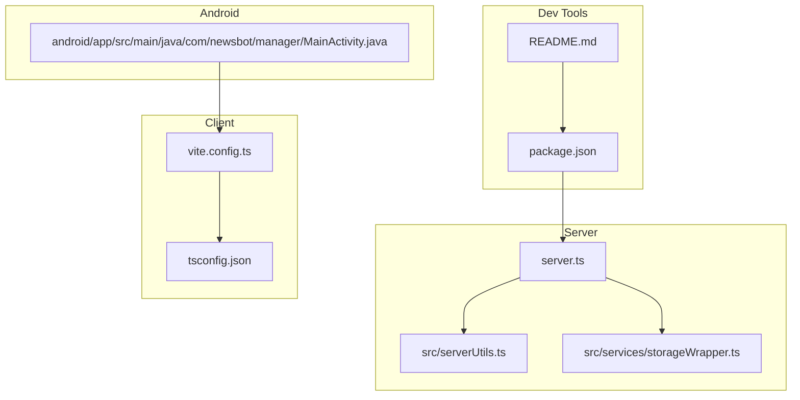
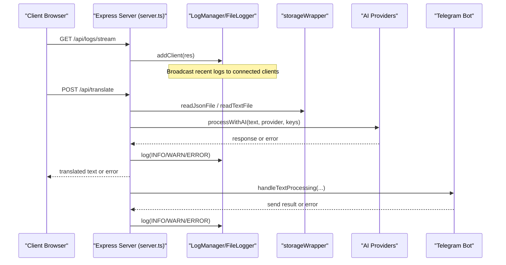
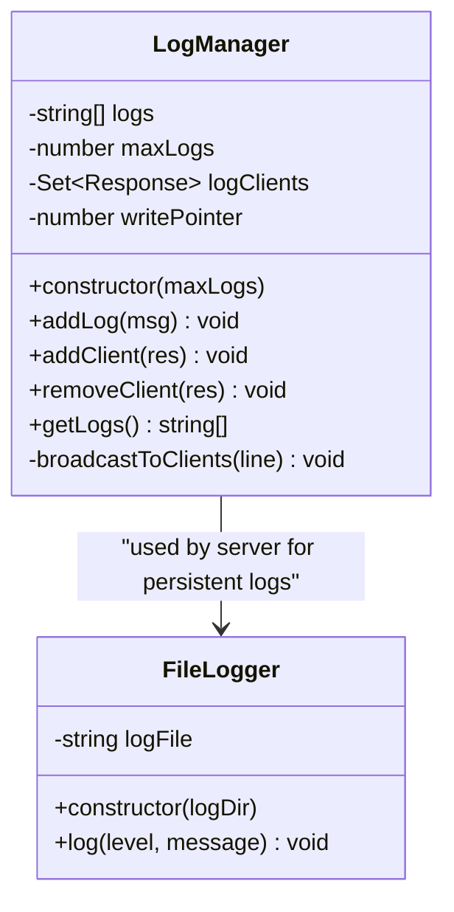
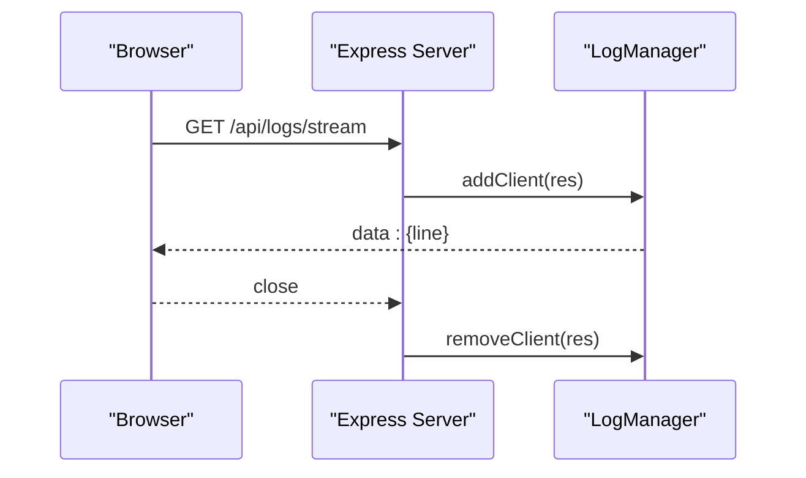
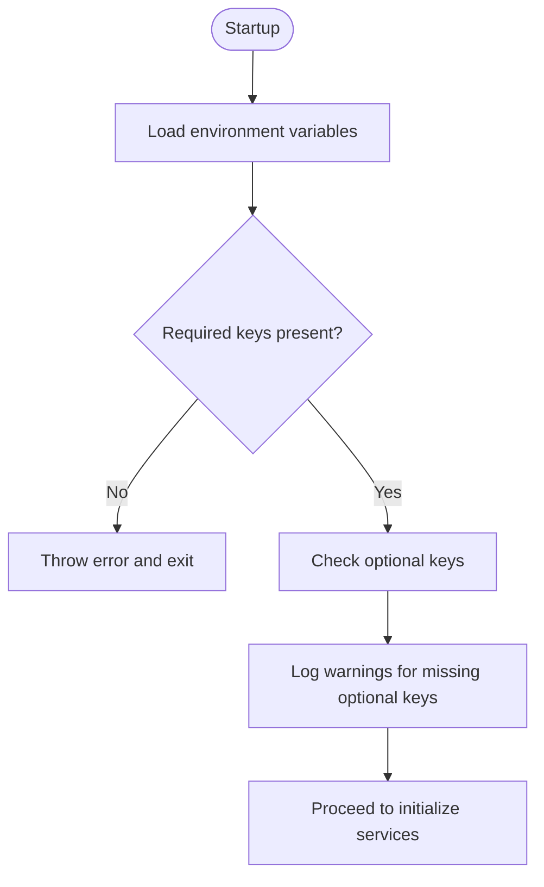
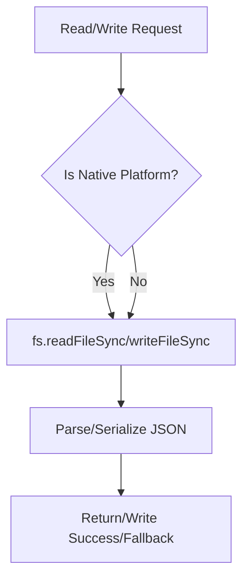
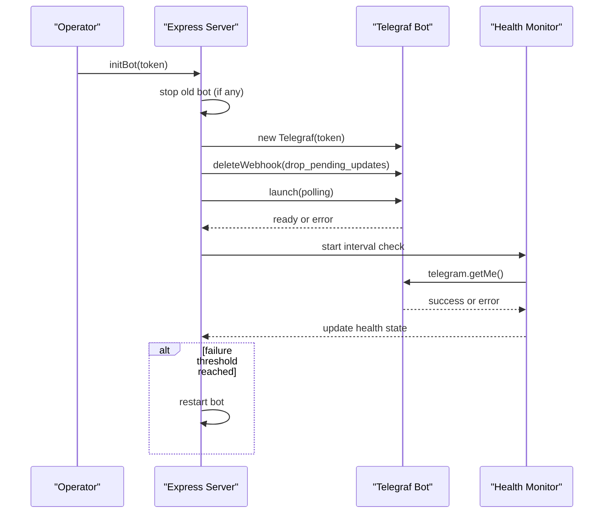
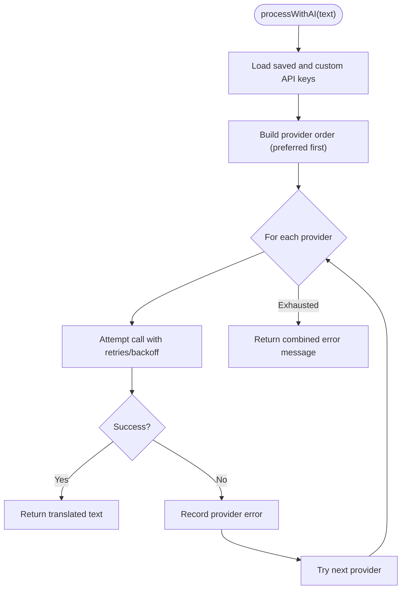
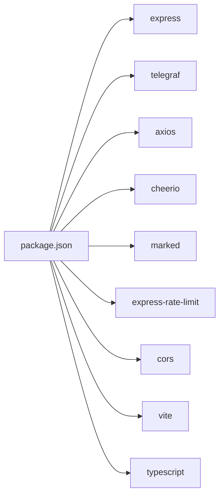

# Debugging Techniques and Tools

<cite>
**Referenced Files in This Document**
- [README.md](file://README.md)
- [package.json](file://package.json)
- [server.ts](file://server.ts)
- [src/serverUtils.ts](file://src/serverUtils.ts)
- [src/services/storageWrapper.ts](file://src/services/storageWrapper.ts)
- [vite.config.ts](file://vite.config.ts)
- [tsconfig.json](file://tsconfig.json)
- [tsconfig.server.json](file://tsconfig.server.json)
- [app/applet/test-fetch.js](file://app/applet/test-fetch.js)
- [app/applet/test2.js](file://app/applet/test2.js)
- [android/app/src/main/java/com/newsbot/manager/MainActivity.java](file://android/app/src/main/java/com/newsbot/manager/MainActivity.java)
</cite>

## Table of Contents
1. [Introduction](#introduction)
2. [Project Structure](#project-structure)
3. [Core Components](#core-components)
4. [Architecture Overview](#architecture-overview)
5. [Detailed Component Analysis](#detailed-component-analysis)
6. [Dependency Analysis](#dependency-analysis)
7. [Performance Considerations](#performance-considerations)
8. [Troubleshooting Guide](#troubleshooting-guide)
9. [Conclusion](#conclusion)
10. [Appendices](#appendices)

## Introduction
This document provides a comprehensive debugging guide tailored to the project’s backend server, client-side React application, and Android integration. It focuses on practical, systematic approaches to diagnosing and resolving issues, including log analysis, error diagnosis, performance profiling, and network debugging. The guide leverages the existing logging infrastructure, environment configuration, and runtime behaviors present in the repository.

## Project Structure
The project comprises:
- A Node.js/Express server with AI provider integrations and Telegram bot orchestration
- A React client built with Vite
- An Android app using Capacitor for cross-platform capabilities
- TypeScript configuration for both client and server builds
- Utility modules for file logging and persistent storage abstraction

**Diagram sources**
- [server.ts](file://server.ts)
- [src/serverUtils.ts](file://src/serverUtils.ts)
- [src/services/storageWrapper.ts](file://src/services/storageWrapper.ts)
- [vite.config.ts](file://vite.config.ts)
- [tsconfig.json](file://tsconfig.json)
- [android/app/src/main/java/com/newsbot/manager/MainActivity.java](file://android/app/src/main/java/com/newsbot/manager/MainActivity.java)
- [package.json](file://package.json)
- [README.md](file://README.md)

**Section sources**
- [package.json](file://package.json)
- [README.md](file://README.md)
- [vite.config.ts](file://vite.config.ts)
- [tsconfig.json](file://tsconfig.json)
- [tsconfig.server.json](file://tsconfig.server.json)
- [android/app/src/main/java/com/newsbot/manager/MainActivity.java](file://android/app/src/main/java/com/newsbot/manager/MainActivity.java)

## Core Components
- Logging subsystem
  - FileLogger writes structured log entries to a file for persistent tracking
  - In-memory LogManager streams recent logs via Server-Sent Events for real-time monitoring
- Environment and configuration
  - Environment variables for API keys and runtime behavior
  - Vite defines environment variable injection for the client
- Storage abstraction
  - storageWrapper transparently reads/writes files across web/native contexts
- Server runtime
  - Express server with rate limiting, CORS, and AI provider fallback logic
  - Telegram bot lifecycle management with health checks and restart logic

Key debugging-relevant entry points:
- Log streaming endpoint for real-time visibility
- FileLogger for persistent log retention
- Environment validation and warnings for missing keys
- Storage wrappers for diagnosing persistence failures

**Section sources**
- [src/serverUtils.ts](file://src/serverUtils.ts)
- [server.ts](file://server.ts)
- [src/services/storageWrapper.ts](file://src/services/storageWrapper.ts)
- [vite.config.ts](file://vite.config.ts)
- [package.json](file://package.json)

## Architecture Overview
The server orchestrates Telegram bot operations, AI provider calls, and persistent storage. Logs are emitted to both the console and a rotating in-memory buffer, and streamed to clients via SSE. The client consumes environment variables injected at build time, while Android integrates via Capacitor.

**Diagram sources**
- [server.ts](file://server.ts)
- [src/serverUtils.ts](file://src/serverUtils.ts)
- [src/services/storageWrapper.ts](file://src/services/storageWrapper.ts)

## Detailed Component Analysis

### Logging Subsystem
- FileLogger
  - Creates a logs directory and appends timestamped entries
  - Supports ERROR, WARN, INFO levels
- LogManager
  - Maintains a fixed-size ring buffer of recent log lines
  - Streams logs to connected clients via Server-Sent Events
  - Handles client disconnects gracefully

**Diagram sources**
- [src/serverUtils.ts](file://src/serverUtils.ts)
- [server.ts](file://server.ts)

**Section sources**
- [src/serverUtils.ts](file://src/serverUtils.ts)
- [server.ts](file://server.ts)

### Real-Time Log Streaming
- Endpoint: GET /api/logs/stream
- Behavior:
  - Sets appropriate headers for SSE
  - Registers client to receive live updates
  - On close, removes client from the set
- Use cases:
  - Observe bot initialization and health events
  - Track AI provider selection and fallback attempts
  - Monitor Telegram API interactions

**Diagram sources**
- [server.ts](file://server.ts)

**Section sources**
- [server.ts](file://server.ts)

### Environment Validation and API Keys
- validateEnv checks for required environment variables and warns if optional keys are missing
- Environment variables used:
  - TELEGRAM_BOT_TOKEN (required)
  - GEMINI_API_KEY (optional)
  - GITHUB_TOKEN (optional)
  - OPENROUTER_API_KEY (optional)
  - DEEPSEEK_API_KEY (optional)
- Client-side environment injection:
  - vite.config.ts defines environment variable substitution for the client bundle

**Diagram sources**
- [server.ts](file://server.ts)
- [vite.config.ts](file://vite.config.ts)

**Section sources**
- [server.ts](file://server.ts)
- [vite.config.ts](file://vite.config.ts)

### Storage Abstraction and Persistence Diagnostics
- storageWrapper abstracts file I/O across web and native platforms
- Reads/writes JSON/text files with platform-specific implementations
- Errors are caught and logged, with defaults returned on failure

**Diagram sources**
- [src/services/storageWrapper.ts](file://src/services/storageWrapper.ts)

**Section sources**
- [src/services/storageWrapper.ts](file://src/services/storageWrapper.ts)

### Telegram Bot Lifecycle and Health Monitoring
- Initialization:
  - Validates token, stops previous instances, deletes webhooks, launches polling
  - Catches early startup errors and marks bot as stopped on failure
- Health monitoring:
  - Periodic health checks against Telegram API
  - Restarts on specific transient errors or after consecutive failures
- Error handling:
  - Catches bot-level errors and logs network-related hints

**Diagram sources**
- [server.ts](file://server.ts)

**Section sources**
- [server.ts](file://server.ts)

### AI Provider Selection and Fallback
- processWithAI selects a provider order based on preferences and availability
- Attempts multiple providers with retries and backoff
- Logs provider-specific statuses and quotas; disables providers under quota constraints
- Returns a consolidated error message if all providers fail

**Diagram sources**
- [server.ts](file://server.ts)

**Section sources**
- [server.ts](file://server.ts)

### Network Debugging and API Inspection
- Test scripts:
  - applet test scripts perform HTTP GET requests to the deployed API status endpoint
  - Useful for validating connectivity, TLS, and basic service availability
- Recommendations:
  - Capture request/response bodies and headers
  - Measure round-trip latency
  - Verify CORS and rate-limit responses

**Section sources**
- [app/applet/test-fetch.js](file://app/applet/test-fetch.js)
- [app/applet/test2.js](file://app/applet/test2.js)

## Dependency Analysis
- Build-time dependencies
  - Vite and React plugins for client bundling
  - TypeScript configuration for both client and server
- Runtime dependencies
  - Express for HTTP server and middleware
  - Telegraf for Telegram bot integration
  - Axios for external AI provider calls
  - Cheerio and Marked for content processing
  - Rate limiting and CORS for API protection

**Diagram sources**
- [package.json](file://package.json)

**Section sources**
- [package.json](file://package.json)

## Performance Considerations
- Memory profiling
  - Monitor the in-memory log buffer size and client connections to avoid leaks
  - Ensure clients properly close SSE connections to release resources
- CPU analysis
  - Large text processing and AI calls can be CPU-intensive; consider batching and caching
- Network monitoring
  - Track AI provider latency and error rates
  - Use the test scripts to measure baseline connectivity and response times
- Build configuration
  - Vite disables HMR in AI Studio to reduce flickering; keep this setting for stability during agent edits

[No sources needed since this section provides general guidance]

## Troubleshooting Guide

### Log Analysis Techniques
- Interpretation
  - FileLogger entries include ISO timestamps and severity levels
  - LogManager entries include local time prefixes and are broadcast to SSE clients
- Real-time streaming
  - Connect to /api/logs/stream to observe live events
  - Look for initialization steps, provider selection, and health events
- Error pattern recognition
  - Look for repeated WARN entries indicating quota limits or permission errors
  - Identify provider-specific error messages to pinpoint failing integrations

**Section sources**
- [src/serverUtils.ts](file://src/serverUtils.ts)
- [server.ts](file://server.ts)

### Error Diagnosis Procedures
- Stack trace analysis
  - Use Node.js with TSX to run the server for accurate stack traces
  - Inspect thrown errors during bot initialization and AI calls
- Exception handling
  - Validate environment variables early to fail fast
  - Wrap external calls with try/catch and log contextual messages
- Root cause identification
  - For Telegram API errors, check health monitor logs and restart behavior
  - For AI providers, review provider-specific error messages and quota indicators

**Section sources**
- [server.ts](file://server.ts)

### Performance Profiling Methods
- Memory profiling
  - Monitor log buffer growth and client counts; adjust maxLogs if needed
- CPU analysis
  - Profile long-running AI translation tasks; consider reducing payload sizes
- Network monitoring
  - Measure latency and error rates for AI provider endpoints
  - Use the test scripts to establish baselines

**Section sources**
- [server.ts](file://server.ts)
- [app/applet/test-fetch.js](file://app/applet/test-fetch.js)
- [app/applet/test2.js](file://app/applet/test2.js)

### Network Debugging Approaches
- API request/response inspection
  - Use the test scripts to capture status codes and response bodies
  - Validate CORS headers and rate-limit responses
- Connection troubleshooting
  - Confirm outbound connectivity and DNS resolution
  - Check for proxy or firewall interference
- Latency analysis
  - Measure round-trip times for API calls and AI provider requests
  - Compare against baseline measurements

**Section sources**
- [app/applet/test-fetch.js](file://app/applet/test-fetch.js)
- [app/applet/test2.js](file://app/applet/test2.js)

### Debugging Tools and Workflows
- Development workflows
  - Use npm scripts to run the server locally
  - Inject environment variables via dotenv and Vite configuration
- Systematic problem-solving
  - Reproduce issues with minimal inputs
  - Isolate components (Telegram, AI providers, storage) and test individually
  - Use logs and SSE streams to correlate events across components

**Section sources**
- [README.md](file://README.md)
- [package.json](file://package.json)
- [vite.config.ts](file://vite.config.ts)

## Conclusion
The project provides robust logging and streaming capabilities, environment-driven configuration, and modular abstractions for storage and AI integration. By combining real-time log streaming, structured file logs, and targeted network tests, teams can systematically diagnose and resolve issues across the server, client, and Android layers.

[No sources needed since this section summarizes without analyzing specific files]

## Appendices

### Environment Variables Reference
- Required
  - TELEGRAM_BOT_TOKEN
- Optional
  - GEMINI_API_KEY
  - GITHUB_TOKEN
  - OPENROUTER_API_KEY
  - DEEPSEEK_API_KEY

**Section sources**
- [server.ts](file://server.ts)

### TypeScript Configuration Notes
- Client build targets modern JS environments
- Server build targets Node-compatible modules and JSON resolution

**Section sources**
- [tsconfig.json](file://tsconfig.json)
- [tsconfig.server.json](file://tsconfig.server.json)