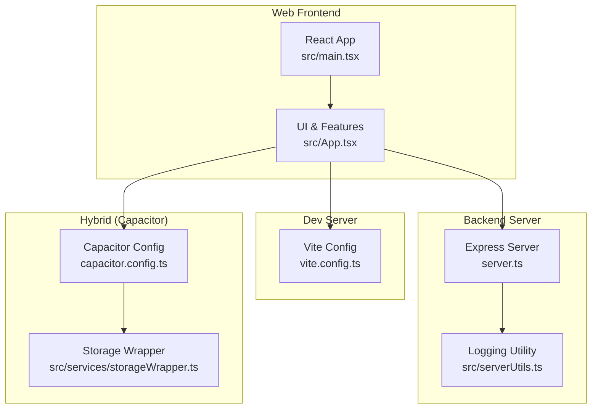
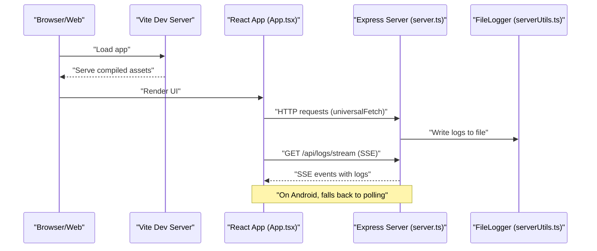
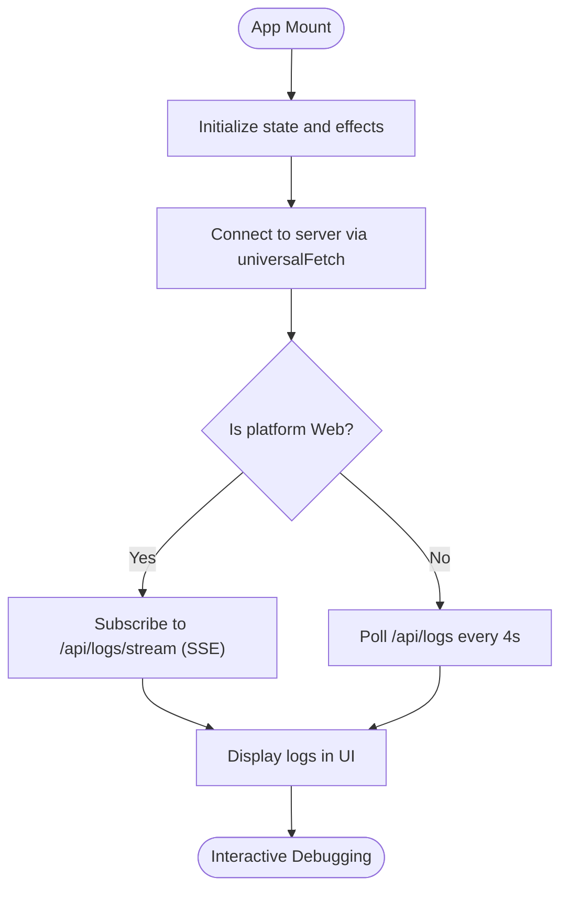
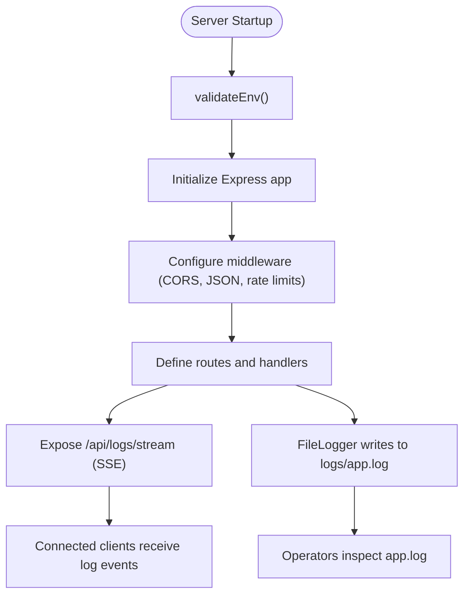
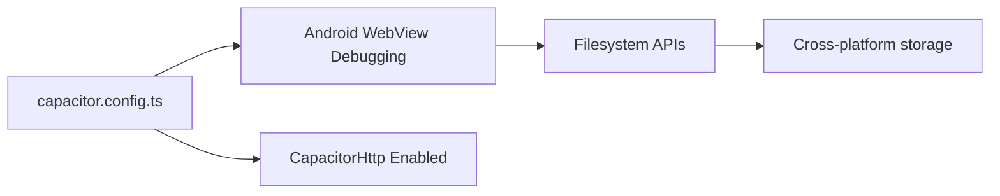
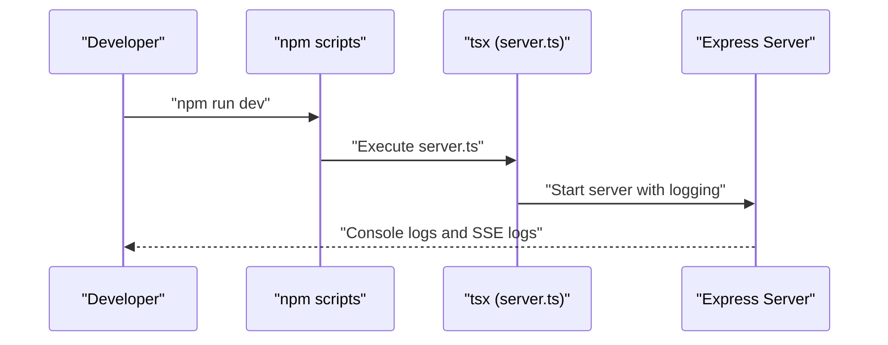
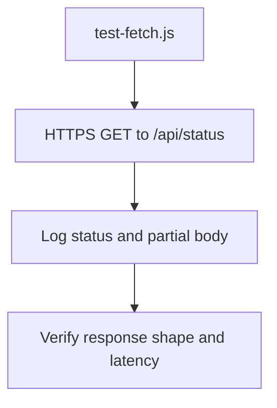
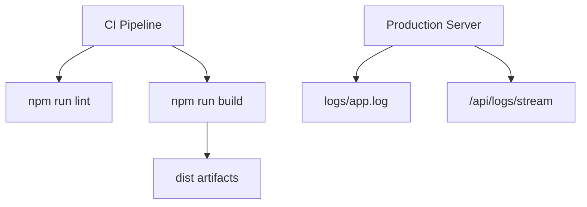
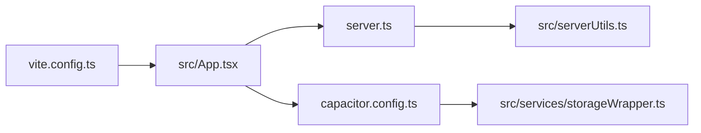

# Development Tools and Debugging Workflows

<cite>
**Referenced Files in This Document**
- [package.json](file://package.json)
- [vite.config.ts](file://vite.config.ts)
- [capacitor.config.ts](file://capacitor.config.ts)
- [tsconfig.json](file://tsconfig.json)
- [tsconfig.server.json](file://tsconfig.server.json)
- [server.ts](file://server.ts)
- [src/App.tsx](file://src/App.tsx)
- [src/main.tsx](file://src/main.tsx)
- [src/serverUtils.ts](file://src/serverUtils.ts)
- [src/services/storageWrapper.ts](file://src/services/storageWrapper.ts)
- [app/applet/test-fetch.js](file://app/applet/test-fetch.js)
- [README.md](file://README.md)
</cite>

## Table of Contents
1. [Introduction](#introduction)
2. [Project Structure](#project-structure)
3. [Core Components](#core-components)
4. [Architecture Overview](#architecture-overview)
5. [Detailed Component Analysis](#detailed-component-analysis)
6. [Dependency Analysis](#dependency-analysis)
7. [Performance Considerations](#performance-considerations)
8. [Troubleshooting Guide](#troubleshooting-guide)
9. [Conclusion](#conclusion)
10. [Appendices](#appendices)

## Introduction
This document provides a comprehensive guide to debugging tools and development workflows for the project. It covers browser developer tools usage, React DevTools integration, Node.js debugging techniques, logging frameworks, breakpoint strategies, step-through debugging procedures, automated testing approaches, continuous integration debugging, and production debugging workflows. It also includes tool configuration, workflow optimization, and systematic approaches to efficient debugging across web, hybrid mobile, and server environments.

## Project Structure
The project is a hybrid application combining a React web frontend, a Vite development server, a Node.js Express backend, and Capacitor for native capabilities. Key areas for debugging include:
- Frontend: React SPA bootstrapped in main.tsx, with App.tsx orchestrating UI, logging, and server connectivity.
- Backend: Express server with AI processing, rate limiting, logging, and streaming logs to clients.
- Hybrid: Capacitor configuration enabling Android WebView debugging and HTTP interception.

**Diagram sources**
- [src/main.tsx:1-11](file://src/main.tsx#L1-L11)
- [src/App.tsx:1-100](file://src/App.tsx#L1-L100)
- [vite.config.ts:1-28](file://vite.config.ts#L1-L28)
- [server.ts:1-120](file://server.ts#L1-L120)
- [src/serverUtils.ts:1-23](file://src/serverUtils.ts#L1-L23)
- [capacitor.config.ts:1-26](file://capacitor.config.ts#L1-L26)
- [src/services/storageWrapper.ts:1-100](file://src/services/storageWrapper.ts#L1-L100)

**Section sources**
- [package.json:1-70](file://package.json#L1-L70)
- [vite.config.ts:1-28](file://vite.config.ts#L1-L28)
- [capacitor.config.ts:1-26](file://capacitor.config.ts#L1-L26)
- [tsconfig.json:1-27](file://tsconfig.json#L1-L27)
- [tsconfig.server.json:1-15](file://tsconfig.server.json#L1-L15)

## Core Components
- React application bootstrap and rendering pipeline.
- Vite configuration for development, environment variable injection, and HMR behavior.
- Express server with structured logging, SSE-based live logs, rate limiting, and AI processing.
- Capacitor configuration enabling Android WebView debugging and HTTP interception.
- Logging utilities for file-based logs and in-memory log streaming.
- Storage abstraction for cross-platform persistence.

**Section sources**
- [src/main.tsx:1-11](file://src/main.tsx#L1-L11)
- [vite.config.ts:6-27](file://vite.config.ts#L6-L27)
- [server.ts:19-33](file://server.ts#L19-L33)
- [server.ts:218-277](file://server.ts#L218-L277)
- [server.ts:342-352](file://server.ts#L342-L352)
- [capacitor.config.ts:7-22](file://capacitor.config.ts#L7-L22)
- [src/serverUtils.ts:7-22](file://src/serverUtils.ts#L7-L22)
- [src/services/storageWrapper.ts:9-99](file://src/services/storageWrapper.ts#L9-L99)

## Architecture Overview
The system integrates a React SPA served by Vite, communicating with an Express backend. On Android, Capacitor injects the web app into a WebView with debugging and HTTP capabilities. Logging spans both client and server, with SSE for real-time updates in browsers and polling for Android.

**Diagram sources**
- [vite.config.ts:6-27](file://vite.config.ts#L6-L27)
- [src/App.tsx:651-698](file://src/App.tsx#L651-L698)
- [server.ts:342-352](file://server.ts#L342-L352)
- [src/serverUtils.ts:17-21](file://src/serverUtils.ts#L17-L21)

## Detailed Component Analysis

### React Application and DevTools Integration
- Bootstrapping: The React root mounts App inside StrictMode.
- DevTools: Enable profiling and component inspection in development builds.
- Logging: Client-side logs are appended to a local buffer and displayed in the UI.

**Diagram sources**
- [src/main.tsx:6-10](file://src/main.tsx#L6-L10)
- [src/App.tsx:651-698](file://src/App.tsx#L651-L698)

**Section sources**
- [src/main.tsx:1-11](file://src/main.tsx#L1-L11)
- [src/App.tsx:168-170](file://src/App.tsx#L168-L170)
- [src/App.tsx:651-698](file://src/App.tsx#L651-L698)

### Express Server and Logging Framework
- Environment validation and structured logging to file.
- SSE endpoint streams logs to connected clients.
- Rate limiting and error handling for robust debugging visibility.

**Diagram sources**
- [server.ts:24-33](file://server.ts#L24-L33)
- [server.ts:342-352](file://server.ts#L342-L352)
- [src/serverUtils.ts:17-21](file://src/serverUtils.ts#L17-L21)

**Section sources**
- [server.ts:19-33](file://server.ts#L19-L33)
- [server.ts:342-352](file://server.ts#L342-L352)
- [src/serverUtils.ts:7-22](file://src/serverUtils.ts#L7-L22)

### Capacitor and Android Debugging
- Android WebView debugging is enabled.
- HTTP interception is enabled for network debugging.
- Filesystem APIs support local storage debugging.

**Diagram sources**
- [capacitor.config.ts:7-22](file://capacitor.config.ts#L7-L22)
- [src/services/storageWrapper.ts:9-99](file://src/services/storageWrapper.ts#L9-L99)

**Section sources**
- [capacitor.config.ts:7-22](file://capacitor.config.ts#L7-L22)
- [src/services/storageWrapper.ts:9-99](file://src/services/storageWrapper.ts#L9-L99)

### Node.js Debugging Techniques
- Use the script entry for development and hot reloading.
- Leverage TSX for direct TypeScript execution.
- Inspect environment variables and API keys via server logs.

**Diagram sources**
- [package.json:7](file://package.json#L7)
- [server.ts:19-33](file://server.ts#L19-L33)

**Section sources**
- [package.json:7](file://package.json#L7)
- [server.ts:19-33](file://server.ts#L19-L33)

### Automated Testing Approaches
- Local HTTP probing script demonstrates outbound connectivity checks.
- Suggested approach: Add unit tests for parsing and sanitization helpers, integration tests for server endpoints, and E2E tests for the React UI.

**Diagram sources**
- [app/applet/test-fetch.js:1-8](file://app/applet/test-fetch.js#L1-L8)

**Section sources**
- [app/applet/test-fetch.js:1-8](file://app/applet/test-fetch.js#L1-L8)

### Continuous Integration and Production Debugging
- CI should run linting and build steps defined in package.json.
- Production debugging relies on file logs and SSE logs; ensure log retention and rotation policies.

**Diagram sources**
- [package.json:14](file://package.json#L14)
- [package.json:10](file://package.json#L10)
- [src/serverUtils.ts:17-21](file://src/serverUtils.ts#L17-L21)
- [server.ts:342-352](file://server.ts#L342-L352)

**Section sources**
- [package.json:14](file://package.json#L14)
- [package.json:10](file://package.json#L10)
- [src/serverUtils.ts:17-21](file://src/serverUtils.ts#L17-L21)
- [server.ts:342-352](file://server.ts#L342-L352)

## Dependency Analysis
- Frontend depends on Vite for dev server and asset handling.
- React app communicates with the backend via universalFetch, supporting both native and web contexts.
- Capacitor bridges web and native storage/network capabilities.
- Server depends on logging utilities and environment configuration.

**Diagram sources**
- [vite.config.ts:6-27](file://vite.config.ts#L6-L27)
- [src/App.tsx:194-251](file://src/App.tsx#L194-L251)
- [server.ts:19-33](file://server.ts#L19-L33)
- [src/serverUtils.ts:17-21](file://src/serverUtils.ts#L17-L21)
- [capacitor.config.ts:7-22](file://capacitor.config.ts#L7-L22)
- [src/services/storageWrapper.ts:9-99](file://src/services/storageWrapper.ts#L9-L99)

**Section sources**
- [vite.config.ts:6-27](file://vite.config.ts#L6-L27)
- [src/App.tsx:194-251](file://src/App.tsx#L194-L251)
- [server.ts:19-33](file://server.ts#L19-L33)
- [src/serverUtils.ts:17-21](file://src/serverUtils.ts#L17-L21)
- [capacitor.config.ts:7-22](file://capacitor.config.ts#L7-L22)
- [src/services/storageWrapper.ts:9-99](file://src/services/storageWrapper.ts#L9-L99)

## Performance Considerations
- Disable HMR in AI Studio to avoid flickering during agent edits.
- Use rate limiting to prevent overload and improve stability.
- Optimize SSE connections and polling intervals for battery life on Android.
- Minimize large JSON payloads and enable compression where appropriate.

[No sources needed since this section provides general guidance]

## Troubleshooting Guide
- Environment validation failures: Ensure required environment variables are present; server logs will indicate missing keys.
- SSE not available on Android: The app polls logs every 4 seconds as a fallback.
- Network timeouts: universalFetch applies timeouts and abort signals; adjust as needed.
- Filesystem permission errors: On Android, request and check permissions before accessing storage.
- Logging visibility: Use SSE for real-time logs in browsers; check logs/app.log in production.

**Section sources**
- [server.ts:24-33](file://server.ts#L24-L33)
- [src/App.tsx:651-698](file://src/App.tsx#L651-L698)
- [src/App.tsx:240-251](file://src/App.tsx#L240-L251)
- [src/services/storageWrapper.ts:408-416](file://src/services/storageWrapper.ts#L408-L416)
- [src/serverUtils.ts:17-21](file://src/serverUtils.ts#L17-L21)

## Conclusion
This project’s debugging ecosystem combines React DevTools, Vite’s development server, Capacitor’s Android WebView debugging, and a robust Node.js Express backend with structured logging and SSE. By leveraging these tools systematically—using breakpoints, step-through debugging, log inspection, and automated checks—you can efficiently debug across web, hybrid mobile, and server environments.

[No sources needed since this section summarizes without analyzing specific files]

## Appendices

### Tool Configuration Quick Reference
- Development server: HMR disabled in AI Studio; environment variables injected at build time.
- React DevTools: Use React Developer Tools extension in desktop Chrome.
- Node.js debugging: Use TSX to run server.ts; attach debugger to process.
- Android WebView: Enable webContentsDebuggingEnabled; use Chrome DevTools remote debugging.
- Logging: FileLogger writes to logs/app.log; SSE endpoint streams logs to clients.

**Section sources**
- [vite.config.ts:22-24](file://vite.config.ts#L22-L24)
- [capacitor.config.ts:13](file://capacitor.config.ts#L13)
- [src/serverUtils.ts:17-21](file://src/serverUtils.ts#L17-L21)
- [server.ts:342-352](file://server.ts#L342-L352)

### Workflow Optimization Tips
- Use React Profiler to identify expensive renders.
- Breakpoints in server.ts around AI processing and rate-limited endpoints.
- Conditional logging to reduce noise; enable verbose logs only during debugging.
- Use Capacitor’s Browser plugin to open external links in-system for debugging.

[No sources needed since this section provides general guidance]