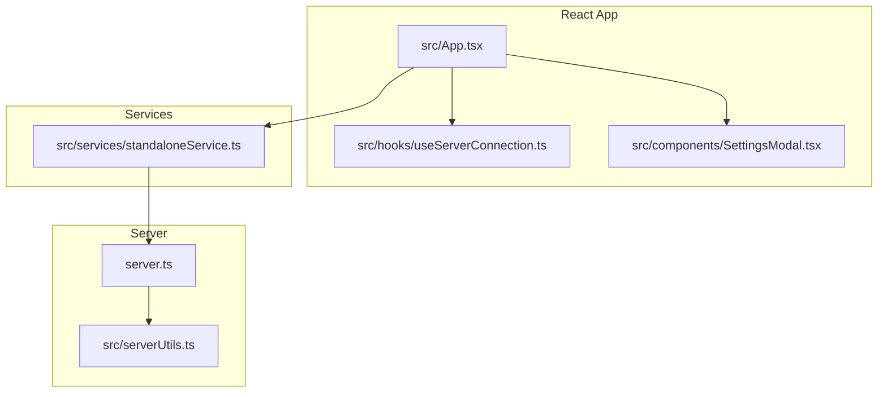
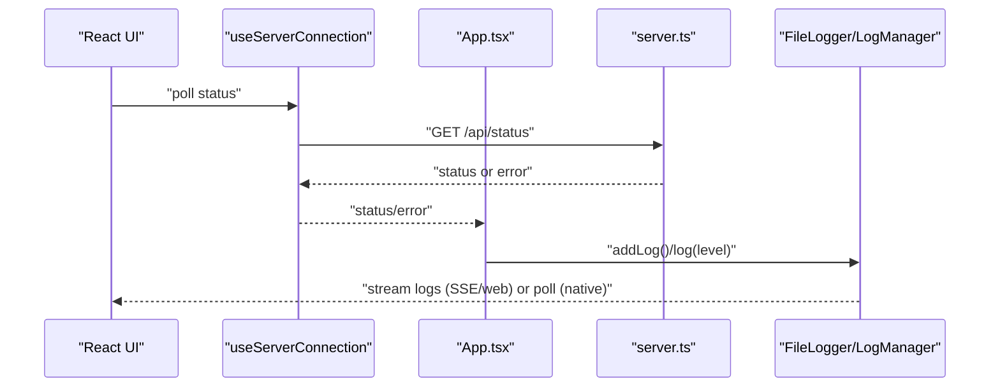
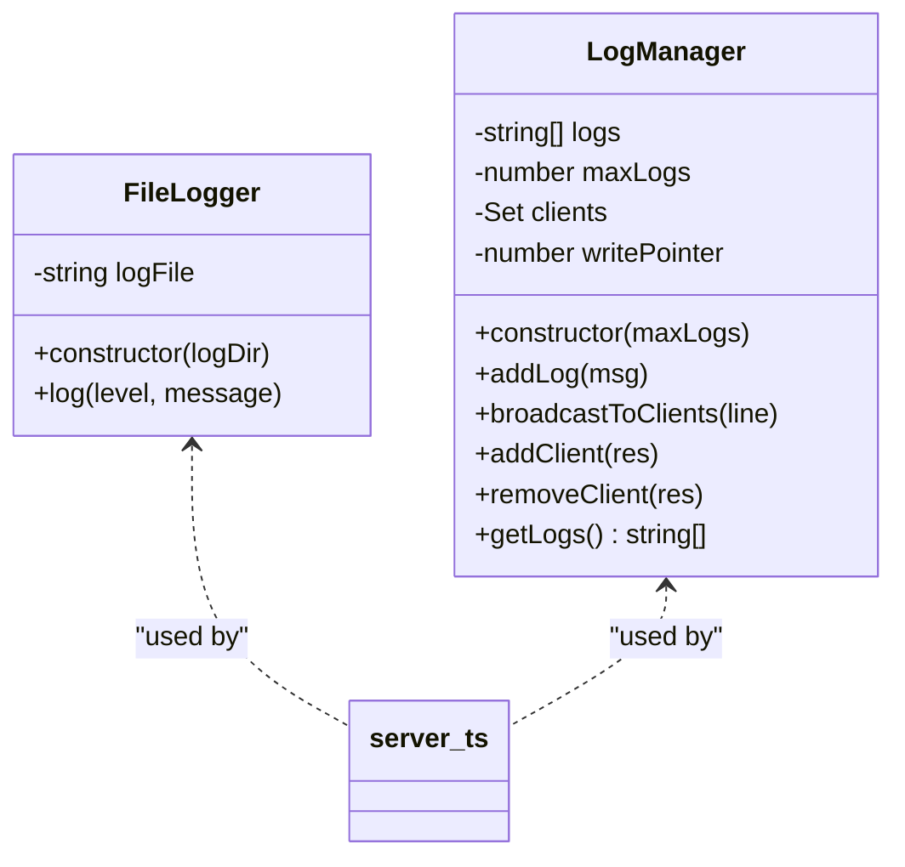
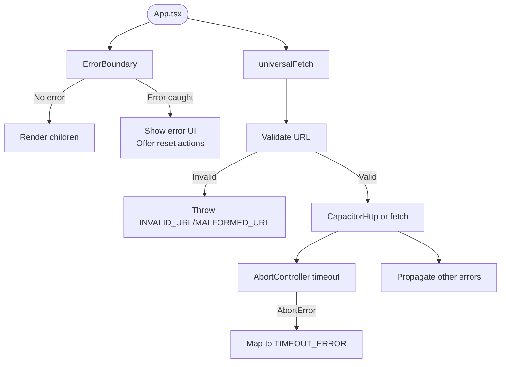
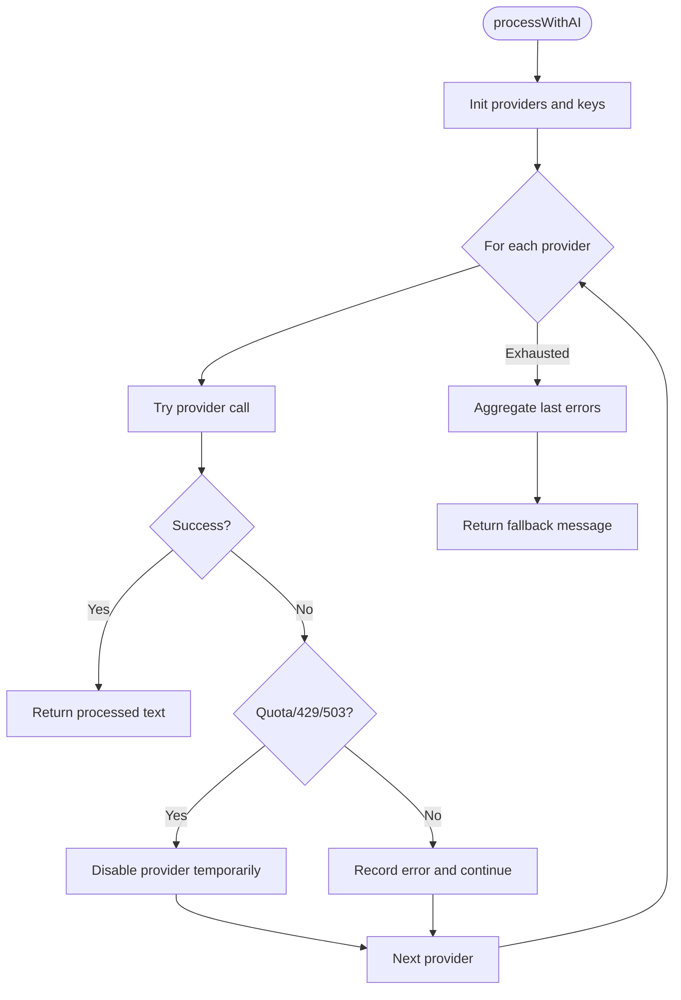
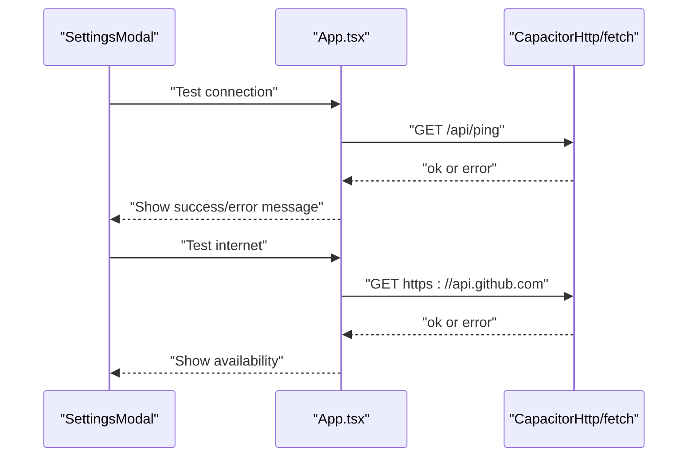
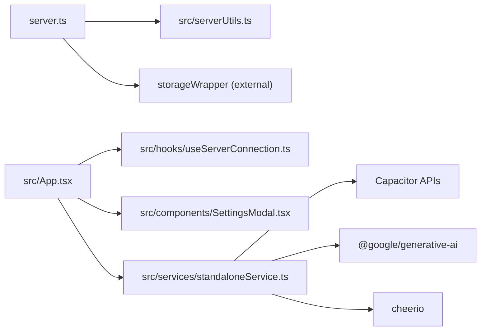

# Error Diagnosis and Exception Handling

<cite>
**Referenced Files in This Document**
- [server.ts](file://server.ts)
- [src/App.tsx](file://src/App.tsx)
- [src/serverUtils.ts](file://src/serverUtils.ts)
- [src/services/standaloneService.ts](file://src/services/standaloneService.ts)
- [src/hooks/useServerConnection.ts](file://src/hooks/useServerConnection.ts)
- [src/components/SettingsModal.tsx](file://src/components/SettingsModal.tsx)
- [README.md](file://README.md)
</cite>

## Table of Contents
1. [Introduction](#introduction)
2. [Project Structure](#project-structure)
3. [Core Components](#core-components)
4. [Architecture Overview](#architecture-overview)
5. [Detailed Component Analysis](#detailed-component-analysis)
6. [Dependency Analysis](#dependency-analysis)
7. [Performance Considerations](#performance-considerations)
8. [Troubleshooting Guide](#troubleshooting-guide)
9. [Conclusion](#conclusion)

## Introduction
This document provides a comprehensive guide to diagnosing and handling errors systematically across the application. It covers stack trace analysis techniques, exception categorization, root cause identification, error propagation patterns, error boundaries, graceful degradation strategies, and practical debugging workflows. It also documents logging best practices and outlines common error scenarios including API failures, database errors, and runtime exceptions.

## Project Structure
The project comprises:
- A Node.js/Express server that orchestrates Telegram bot operations, AI translation, and logging.
- A React-based Capacitor app that communicates with the server, manages settings, and displays logs.
- Shared services for storage, Telegram API calls, and AI processing.
- Hooks and components that encapsulate error handling and diagnostics.

**Diagram sources**
- [server.ts:1-800](file://server.ts#L1-L800)
- [src/App.tsx:168-1754](file://src/App.tsx#L168-L1754)
- [src/serverUtils.ts:1-23](file://src/serverUtils.ts#L1-L23)
- [src/services/standaloneService.ts:1-175](file://src/services/standaloneService.ts#L1-L175)
- [src/hooks/useServerConnection.ts:1-52](file://src/hooks/useServerConnection.ts#L1-L52)
- [src/components/SettingsModal.tsx:1-107](file://src/components/SettingsModal.tsx#L1-L107)

**Section sources**
- [README.md:1-25](file://README.md#L1-L25)

## Core Components
- Server-side error logging and telemetry:
  - FileLogger writes structured logs to disk.
  - LogManager maintains an in-memory rolling log buffer and streams logs via Server-Sent Events.
  - Environment validation and early throws for missing secrets.
- Frontend error boundary and diagnostics:
  - React ErrorBoundary catches rendering errors and provides recovery actions.
  - Universal fetch validates URLs, sets timeouts, and normalizes errors.
  - Server status hook polls and surfaces errors to the UI.
- AI provider fallback and quota handling:
  - Multi-provider AI processing with retries, timeouts, and graceful fallback.
  - Quota detection and retry hints for rate-limited providers.
- Native and web transport differences:
  - CapacitorHttp for native platforms; fetch with AbortController for web.

**Section sources**
- [server.ts:19-33](file://server.ts#L19-L33)
- [server.ts:219-280](file://server.ts#L219-L280)
- [src/serverUtils.ts:7-22](file://src/serverUtils.ts#L7-L22)
- [src/App.tsx:146-166](file://src/App.tsx#L146-L166)
- [src/App.tsx:195-251](file://src/App.tsx#L195-L251)
- [src/hooks/useServerConnection.ts:15-51](file://src/hooks/useServerConnection.ts#L15-L51)
- [server.ts:412-645](file://server.ts#L412-L645)

## Architecture Overview
The system implements layered error handling:
- Transport layer: Validates URLs, enforces timeouts, and converts platform-specific errors into unified error messages.
- Application layer: Uses try/catch around external calls, implements provider fallbacks, and records detailed logs.
- Presentation layer: Wraps the app in an ErrorBoundary and exposes logs via SSE (web) or polling (native).

**Diagram sources**
- [src/hooks/useServerConnection.ts:15-51](file://src/hooks/useServerConnection.ts#L15-L51)
- [src/App.tsx:622-641](file://src/App.tsx#L622-L641)
- [server.ts:219-280](file://server.ts#L219-L280)
- [src/serverUtils.ts:7-22](file://src/serverUtils.ts#L7-L22)

## Detailed Component Analysis

### Server Error Logging and Telemetry
- FileLogger writes timestamped entries to a log file.
- LogManager buffers recent logs and broadcasts them to clients via SSE.
- Environment validation throws early if required secrets are missing.

**Diagram sources**
- [src/serverUtils.ts:7-22](file://src/serverUtils.ts#L7-L22)
- [server.ts:219-280](file://server.ts#L219-L280)

**Section sources**
- [src/serverUtils.ts:7-22](file://src/serverUtils.ts#L7-L22)
- [server.ts:19-33](file://server.ts#L19-L33)
- [server.ts:219-280](file://server.ts#L219-L280)

### Frontend Error Boundary and Diagnostics
- ErrorBoundary renders a friendly error screen and offers quick fixes (clear URL, clear preferences).
- universalFetch validates URLs, enforces timeouts, and maps AbortError to a specific error code.
- useServerConnection polls the server status and surfaces errors to the UI.

**Diagram sources**
- [src/App.tsx:146-166](file://src/App.tsx#L146-L166)
- [src/App.tsx:195-251](file://src/App.tsx#L195-L251)
- [src/hooks/useServerConnection.ts:15-51](file://src/hooks/useServerConnection.ts#L15-L51)

**Section sources**
- [src/App.tsx:146-166](file://src/App.tsx#L146-L166)
- [src/App.tsx:195-251](file://src/App.tsx#L195-L251)
- [src/hooks/useServerConnection.ts:15-51](file://src/hooks/useServerConnection.ts#L15-L51)

### AI Provider Fallback and Graceful Degradation
- processWithAI attempts multiple providers in order, with retries and timeouts.
- Detects quota exhaustion and signals to disable a provider temporarily.
- Aggregates last errors and returns a user-friendly message when all providers fail.

**Diagram sources**
- [server.ts:412-645](file://server.ts#L412-L645)

**Section sources**
- [server.ts:412-645](file://server.ts#L412-L645)

### Native vs Web Transport Differences
- Native uses CapacitorHttp for reliability and CORS bypass.
- Web uses fetch with AbortController to enforce timeouts and detect AbortError.
- Settings modal provides connectivity and network tests to isolate transport issues.

**Diagram sources**
- [src/components/SettingsModal.tsx:87-106](file://src/components/SettingsModal.tsx#L87-L106)
- [src/App.tsx:1313-1344](file://src/App.tsx#L1313-L1344)
- [src/services/standaloneService.ts:75-98](file://src/services/standaloneService.ts#L75-L98)

**Section sources**
- [src/components/SettingsModal.tsx:87-106](file://src/components/SettingsModal.tsx#L87-L106)
- [src/App.tsx:1313-1344](file://src/App.tsx#L1313-L1344)
- [src/services/standaloneService.ts:75-98](file://src/services/standaloneService.ts#L75-L98)

## Dependency Analysis
- server.ts depends on:
  - Express, Telegraf, Axios, Cheerio, Marked, Rate Limit, UUID, Dotenv, and storage wrapper.
  - src/serverUtils.ts for file logging.
- src/App.tsx depends on:
  - Capacitor APIs for native transport.
  - useServerConnection hook for server status.
  - standaloneService for native-only operations.
- src/services/standaloneService.ts depends on:
  - Capacitor filesystem, preferences, and HTTP.
  - Google Generative AI and Cheerio for content processing.

**Diagram sources**
- [server.ts:1-17](file://server.ts#L1-L17)
- [src/serverUtils.ts:1-23](file://src/serverUtils.ts#L1-L23)
- [src/App.tsx:15-28](file://src/App.tsx#L15-L28)
- [src/services/standaloneService.ts:1-7](file://src/services/standaloneService.ts#L1-L7)

**Section sources**
- [server.ts:1-17](file://server.ts#L1-L17)
- [src/App.tsx:15-28](file://src/App.tsx#L15-L28)
- [src/services/standaloneService.ts:1-7](file://src/services/standaloneService.ts#L1-L7)

## Performance Considerations
- Use timeouts and AbortController to prevent long-running requests from blocking the UI.
- Implement exponential backoff for transient failures (e.g., 429/503).
- Prefer SSE for real-time logs on web; fall back to polling on native.
- Cache frequently accessed configuration to reduce network overhead.
- Validate URLs early to avoid unnecessary network calls.

## Troubleshooting Guide

### Stack Trace Analysis Techniques
- Capture and log full error objects with messages and stack traces.
- Normalize provider-specific errors (e.g., parsing JSON payloads) to a consistent shape.
- Use structured logs with timestamps and severity levels for easier correlation.

**Section sources**
- [server.ts:219-280](file://server.ts#L219-L280)
- [src/serverUtils.ts:7-22](file://src/serverUtils.ts#L7-L22)

### Exception Categorization
- Transport errors:
  - Invalid URL/Malformed URL: thrown by universalFetch.
  - Timeout: mapped to TIMEOUT_ERROR via AbortController.
  - Network unreachable: surfaced by server status hook.
- Provider errors:
  - Authentication failures (401/403) and quota exceeded (429/RESOURCE_EXHAUSTED).
  - Model not found (404) triggers fallback to next model/provider.
- Runtime errors:
  - Filesystem permission denied on native.
  - Telegram API errors with descriptive messages.

**Section sources**
- [src/App.tsx:195-251](file://src/App.tsx#L195-L251)
- [src/hooks/useServerConnection.ts:20-42](file://src/hooks/useServerConnection.ts#L20-L42)
- [server.ts:412-645](file://server.ts#L412-L645)
- [src/services/standaloneService.ts:75-98](file://src/services/standaloneService.ts#L75-L98)

### Root Cause Identification Methods
- Isolate transport issues:
  - Use Settings modal “Test internet” and “Test connection” to confirm network and server reachability.
- Validate environment:
  - Confirm required environment variables are present; server.ts throws early if missing.
- Inspect logs:
  - Enable SSE logs on web or polling logs on native; review recent entries for error patterns.
- Check provider quotas:
  - Look for quota-related messages and retry hints; temporarily disable failing providers.

**Section sources**
- [src/components/SettingsModal.tsx:87-106](file://src/components/SettingsModal.tsx#L87-L106)
- [src/App.tsx:1337-1344](file://src/App.tsx#L1337-L1344)
- [server.ts:19-33](file://server.ts#L19-L33)
- [server.ts:219-280](file://server.ts#L219-L280)

### Error Propagation Patterns
- Frontend:
  - universalFetch centralizes transport and error normalization.
  - useServerConnection encapsulates polling and error propagation to UI.
- Backend:
  - Telegraf’s bot.catch captures runtime errors and sets a global error state.
  - AI processing wraps provider calls with try/catch and aggregates errors.

**Section sources**
- [src/App.tsx:195-251](file://src/App.tsx#L195-L251)
- [src/hooks/useServerConnection.ts:15-51](file://src/hooks/useServerConnection.ts#L15-L51)
- [server.ts:736-743](file://server.ts#L736-L743)
- [server.ts:412-645](file://server.ts#L412-L645)

### Error Boundaries and Graceful Degradation
- React ErrorBoundary prevents app crashes and offers recovery actions.
- Graceful degradation:
  - Disable failing providers and continue with available ones.
  - Return a user-friendly fallback message when all providers fail.
  - Continue polling for logs and status even if individual requests fail.

**Section sources**
- [src/App.tsx:146-166](file://src/App.tsx#L146-L166)
- [server.ts:412-645](file://server.ts#L412-L645)

### Practical Debugging Workflows
- Quick checks:
  - Verify base URL correctness and scheme (http/https).
  - Confirm API keys are configured and not empty.
  - Check network connectivity and server status endpoint.
- Deep dive:
  - Review server logs for provider errors and quota messages.
  - Inspect client logs for transport errors and timeouts.
  - Reproduce with minimal input to isolate provider-specific issues.

**Section sources**
- [src/App.tsx:1313-1344](file://src/App.tsx#L1313-L1344)
- [server.ts:219-280](file://server.ts#L219-L280)
- [src/App.tsx:531-698](file://src/App.tsx#L531-L698)

### Error Logging Best Practices
- Include timestamps, severity, and contextual information (provider, action).
- Avoid logging sensitive data; mask tokens and secrets.
- Use structured logs for machine parsing and human readability.
- Stream logs to clients for real-time monitoring.

**Section sources**
- [src/serverUtils.ts:7-22](file://src/serverUtils.ts#L7-L22)
- [server.ts:219-280](file://server.ts#L219-L280)

### Common Error Scenarios and Resolutions
- API failures:
  - Symptom: server returns non-2xx status or HTML instead of JSON.
  - Resolution: verify URL correctness and server deployment; Settings modal “Test connection” helps.
- Database/file errors:
  - Symptom: filesystem permission denied or missing directories.
  - Resolution: grant permissions on native; ensure directories exist.
- Runtime exceptions:
  - Symptom: Telegram API errors or Telegraf initialization failures.
  - Resolution: check token validity and network connectivity; review bot catch handler.

**Section sources**
- [src/App.tsx:1313-1334](file://src/App.tsx#L1313-L1334)
- [src/services/standaloneService.ts:11-23](file://src/services/standaloneService.ts#L11-L23)
- [server.ts:736-743](file://server.ts#L736-L743)

## Conclusion
The application implements robust error handling across transport, application, and presentation layers. By combining structured logging, provider fallbacks, explicit timeouts, and an ErrorBoundary, it achieves predictable error propagation and graceful degradation. Use the provided workflows and best practices to diagnose issues quickly, categorize errors effectively, and resolve them with confidence.