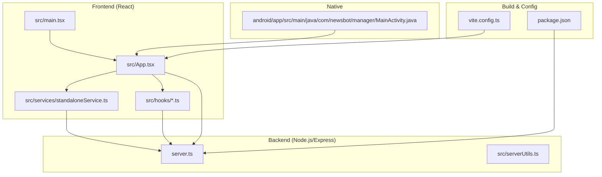
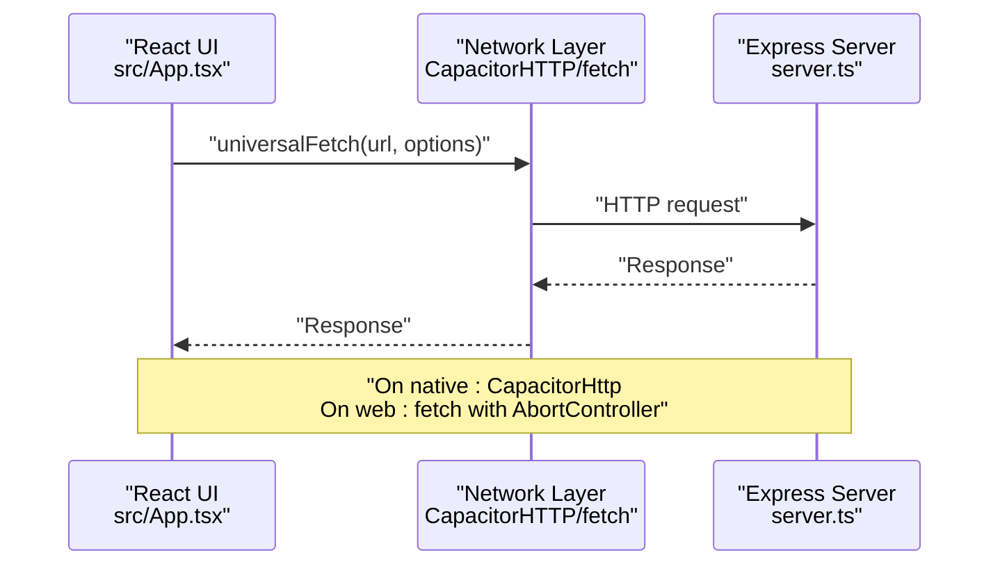
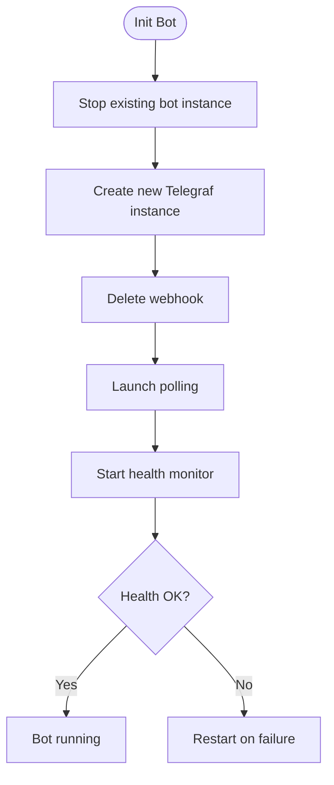
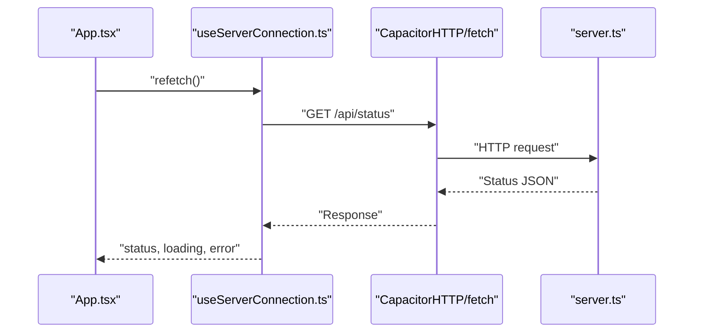
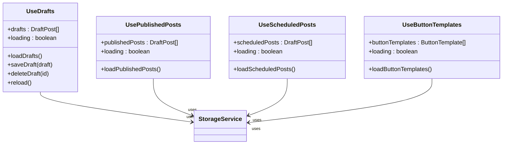
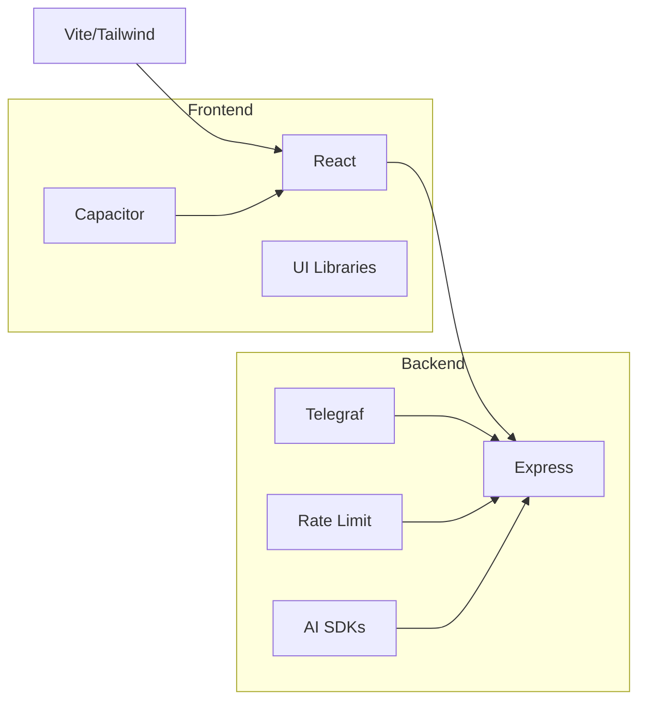

# Performance Profiling and Optimization

<cite>
**Referenced Files in This Document**
- [package.json](file://package.json)
- [vite.config.ts](file://vite.config.ts)
- [server.ts](file://server.ts)
- [src/main.tsx](file://src/main.tsx)
- [src/App.tsx](file://src/App.tsx)
- [src/services/standaloneService.ts](file://src/services/standaloneService.ts)
- [src/hooks/useServerConnection.ts](file://src/hooks/useServerConnection.ts)
- [src/hooks/useDrafts.ts](file://src/hooks/useDrafts.ts)
- [src/hooks/usePublishedPosts.ts](file://src/hooks/usePublishedPosts.ts)
- [src/hooks/useScheduledPosts.ts](file://src/hooks/useScheduledPosts.ts)
- [src/hooks/useButtonTemplates.ts](file://src/hooks/useButtonTemplates.ts)
- [src/types.ts](file://src/types.ts)
- [src/serverUtils.ts](file://src/serverUtils.ts)
- [android/app/src/main/java/com/newsbot/manager/MainActivity.java](file://android/app/src/main/java/com/newsbot/manager/MainActivity.java)
- [README.md](file://README.md)
</cite>

## Table of Contents
1. [Introduction](#introduction)
2. [Project Structure](#project-structure)
3. [Core Components](#core-components)
4. [Architecture Overview](#architecture-overview)
5. [Detailed Component Analysis](#detailed-component-analysis)
6. [Dependency Analysis](#dependency-analysis)
7. [Performance Considerations](#performance-considerations)
8. [Troubleshooting Guide](#troubleshooting-guide)
9. [Conclusion](#conclusion)
10. [Appendices](#appendices)

## Introduction
This document provides a comprehensive guide to performance profiling and optimization for the project. It covers memory profiling methods, CPU usage analysis, and garbage collection monitoring on the backend and frontend. It also explains network performance measurement, API latency analysis, and database query optimization strategies. Browser performance profiling, React component performance analysis, and memory leak detection are included, along with practical guidance for performance monitoring tools, benchmarking procedures, and systematic optimization strategies tailored to this codebase.

## Project Structure
The project is a hybrid mobile/web application built with React and Capacitor, with a Node.js/Express backend. The frontend is a Vite/React application that communicates with the backend via HTTP requests. On native platforms, Capacitor’s HTTP client is used to avoid CORS issues and improve reliability. The backend exposes REST endpoints for bot configuration, logging, and content operations, and integrates AI providers for content processing.

**Diagram sources**
- [src/main.tsx:1-11](file://src/main.tsx#L1-L11)
- [src/App.tsx:1-100](file://src/App.tsx#L1-L100)
- [src/services/standaloneService.ts:1-175](file://src/services/standaloneService.ts#L1-L175)
- [src/hooks/useServerConnection.ts:1-52](file://src/hooks/useServerConnection.ts#L1-L52)
- [server.ts:1-120](file://server.ts#L1-L120)
- [vite.config.ts:1-28](file://vite.config.ts#L1-L28)
- [package.json:1-70](file://package.json#L1-L70)
- [android/app/src/main/java/com/newsbot/manager/MainActivity.java:1-6](file://android/app/src/main/java/com/newsbot/manager/MainActivity.java#L1-L6)

**Section sources**
- [package.json:1-70](file://package.json#L1-L70)
- [vite.config.ts:1-28](file://vite.config.ts#L1-L28)
- [src/main.tsx:1-11](file://src/main.tsx#L1-L11)
- [src/App.tsx:1-100](file://src/App.tsx#L1-L100)
- [server.ts:1-120](file://server.ts#L1-L120)
- [android/app/src/main/java/com/newsbot/manager/MainActivity.java:1-6](file://android/app/src/main/java/com/newsbot/manager/MainActivity.java#L1-L6)

## Core Components
- Frontend entry and rendering: React root renders the App component.
- Application shell and orchestration: App component manages UI state, server connectivity, logs streaming, and data fetching.
- Native networking: Capacitor HTTP client is used on native platforms to avoid CORS and improve timeouts.
- Server-side orchestration: Express server handles requests, rate limits, caching, and AI processing.
- Logging and diagnostics: FileLogger writes structured logs to disk; App supports SSE and polling for live logs.

Key performance-relevant areas:
- Network layer: unifiedFetch with timeouts and platform-specific handling.
- Streaming logs: SSE on web, polling on native.
- AI processing: retries, timeouts, and provider fallbacks.
- Rate limiting: per-endpoint rate limits to protect resources.
- Local storage: Capacitor preferences/filesystem for offline-first behavior.

**Section sources**
- [src/main.tsx:1-11](file://src/main.tsx#L1-L11)
- [src/App.tsx:194-251](file://src/App.tsx#L194-L251)
- [src/App.tsx:651-698](file://src/App.tsx#L651-L698)
- [src/services/standaloneService.ts:74-146](file://src/services/standaloneService.ts#L74-L146)
- [server.ts:51-72](file://server.ts#L51-L72)
- [server.ts:412-645](file://server.ts#L412-L645)
- [src/serverUtils.ts:1-23](file://src/serverUtils.ts#L1-L23)

## Architecture Overview
The system comprises a React frontend, a Node.js/Express backend, and optional native runtime via Capacitor. The frontend communicates with the backend using HTTP requests. On native devices, Capacitor’s HTTP client is used to avoid WebView limitations. The backend exposes endpoints for configuration, logs, and content operations, and performs AI processing with provider fallbacks and rate limiting.

**Diagram sources**
- [src/App.tsx:194-251](file://src/App.tsx#L194-L251)
- [src/services/standaloneService.ts:74-146](file://src/services/standaloneService.ts#L74-L146)
- [server.ts:1-120](file://server.ts#L1-L120)

## Detailed Component Analysis

### Backend: Express Server and AI Processing
The backend orchestrates bot initialization, health checks, AI provider selection, and rate limiting. It includes:
- Rate limiters for general API, AI, and mutations.
- Health monitoring with periodic checks and restart logic.
- AI provider fallback chain with timeouts and error handling.
- Persistent caching of configuration and data.

**Diagram sources**
- [server.ts:688-799](file://server.ts#L688-L799)
- [server.ts:377-409](file://server.ts#L377-L409)

**Section sources**
- [server.ts:51-72](file://server.ts#L51-L72)
- [server.ts:377-409](file://server.ts#L377-L409)
- [server.ts:412-645](file://server.ts#L412-L645)
- [server.ts:688-799](file://server.ts#L688-L799)

### Frontend: React App and Network Layer
The React app initializes the UI, manages server connectivity, and streams logs. It uses a unified fetch abstraction:
- On native: Capacitor HTTP client with explicit timeouts.
- On web: fetch with AbortController for cancellation and timeout handling.
- SSE polling for logs on web; polling on native.

**Diagram sources**
- [src/App.tsx:622-641](file://src/App.tsx#L622-L641)
- [src/hooks/useServerConnection.ts:20-42](file://src/hooks/useServerConnection.ts#L20-L42)
- [server.ts:1-120](file://server.ts#L1-L120)

**Section sources**
- [src/App.tsx:194-251](file://src/App.tsx#L194-L251)
- [src/App.tsx:651-698](file://src/App.tsx#L651-L698)
- [src/hooks/useServerConnection.ts:15-51](file://src/hooks/useServerConnection.ts#L15-L51)

### Hooks: Data Fetching and Persistence
Hooks encapsulate data fetching and persistence for drafts, published posts, scheduled posts, and button templates. They support both standalone (local storage) and server-backed modes.

**Diagram sources**
- [src/hooks/useDrafts.ts:1-88](file://src/hooks/useDrafts.ts#L1-L88)
- [src/hooks/usePublishedPosts.ts:1-38](file://src/hooks/usePublishedPosts.ts#L1-L38)
- [src/hooks/useScheduledPosts.ts:1-38](file://src/hooks/useScheduledPosts.ts#L1-L38)
- [src/hooks/useButtonTemplates.ts:1-38](file://src/hooks/useButtonTemplates.ts#L1-L38)
- [src/services/standaloneService.ts:11-72](file://src/services/standaloneService.ts#L11-L72)

**Section sources**
- [src/hooks/useDrafts.ts:5-87](file://src/hooks/useDrafts.ts#L5-L87)
- [src/hooks/usePublishedPosts.ts:5-37](file://src/hooks/usePublishedPosts.ts#L5-L37)
- [src/hooks/useScheduledPosts.ts:5-37](file://src/hooks/useScheduledPosts.ts#L5-L37)
- [src/hooks/useButtonTemplates.ts:5-37](file://src/hooks/useButtonTemplates.ts#L5-L37)
- [src/services/standaloneService.ts:11-72](file://src/services/standaloneService.ts#L11-L72)

### Types and Data Contracts
Type definitions standardize data structures for posts, templates, and server configuration status, aiding predictable performance behavior and easier serialization/deserialization.

**Section sources**
- [src/types.ts:1-48](file://src/types.ts#L1-L48)

## Dependency Analysis
The frontend depends on React, Capacitor, and various UI libraries. The backend depends on Express, Telegraf, rate limiting, and AI SDKs. Build-time dependencies include Vite and TailwindCSS.

**Diagram sources**
- [package.json:19-56](file://package.json#L19-L56)
- [server.ts:1-15](file://server.ts#L1-L15)
- [vite.config.ts:1-28](file://vite.config.ts#L1-L28)

**Section sources**
- [package.json:19-56](file://package.json#L19-L56)
- [vite.config.ts:1-28](file://vite.config.ts#L1-L28)
- [server.ts:1-15](file://server.ts#L1-L15)

## Performance Considerations

### Memory Profiling Methods
- Backend:
  - Enable Node.js heap snapshots and track allocations during AI processing bursts.
  - Monitor memory growth during long-running polling sessions.
  - Use structured logging to correlate memory spikes with events.
- Frontend:
  - Use browser DevTools Memory panel to capture snapshots and detect retained objects.
  - Track component instances and event listeners to prevent accumulation.
  - Monitor memory usage during image-heavy operations (gallery sync).

Recommended actions:
- Instrument AI processing loops to ensure intermediate buffers are released promptly.
- Avoid retaining large arrays of images or logs in state; slice and cap lists.
- Use WeakRef and FinalizationRegistry cautiously for cleanup hooks.

### CPU Usage Analysis
- Backend:
  - Profile CPU during AI generation and HTML sanitization steps.
  - Identify hotspots in provider fallback loops and retries.
- Frontend:
  - Use Performance panel to record long tasks and layout thrashing.
  - Optimize rendering of large lists and drag-and-drop operations.

Recommended actions:
- Debounce or batch frequent UI updates.
- Split heavy computations into Web Workers or server-side processing.

### Garbage Collection Monitoring
- Backend:
  - Observe GC pauses during high-throughput periods.
  - Reduce object churn by reusing buffers and avoiding closures in tight loops.
- Frontend:
  - Watch for long GC pauses in older devices.
  - Minimize closure allocations inside render loops.

Recommended actions:
- Reuse Cheerio and Markdown parsers across requests where safe.
- Clear timers and intervals on component unmount.

### Network Performance Measurement
- Measure round-trip latency for each endpoint using browser DevTools Timing tab or curl with verbose timing.
- Track connection establishment, DNS lookup, and TLS handshake costs.
- On native, compare Capacitor HTTP vs. fetch to confirm reduced overhead.

Recommended actions:
- Keep connections alive where possible.
- Compress payloads and enable gzip on the server.

### API Latency Analysis
- Use server-side logging to record request timestamps and durations.
- Segment timings for parsing, AI calls, and external provider responses.
- Aggregate metrics (p50, p95, p99) and alert on regressions.

Recommended actions:
- Add middleware to log route-level latencies.
- Cache frequently accessed configuration endpoints.

### Database Query Optimization
- The codebase does not use a traditional SQL database; it relies on local filesystem and Capacitor preferences for persistence.
- Optimize file reads/writes by batching and minimizing redundant I/O.
- Use asynchronous APIs and avoid synchronous file operations.

Recommended actions:
- Persist only necessary data and compress large JSON payloads.
- Use streaming reads for large files.

### Browser Performance Profiling
- Use Chrome DevTools Performance panel to record interactions and identify long tasks.
- Inspect rendering bottlenecks with the Rendering tab and FPS meter.
- Audit Largest Contentful Paint (LCP), First Input Delay (FID), and Cumulative Layout Shift (CLS).

Recommended actions:
- Defer non-critical work until after initial paint.
- Use virtualized lists for large datasets.

### React Component Performance Analysis
- Identify slow components with React DevTools Profiler.
- Look for unnecessary re-renders caused by prop drift or unstable callbacks.
- Apply memoization and split heavy components.

Recommended actions:
- Wrap expensive components with memoization.
- Extract handlers into useCallback where appropriate.

### Memory Leak Detection
- Use browser DevTools Memory panel to take heap snapshots before and after user actions.
- Look for retained nodes that grow over time.
- Verify cleanup of timers, intervals, and event listeners.

Recommended actions:
- Always cancel AbortController signals on unmount.
- Clear SSE EventSource connections and polling intervals.

## Troubleshooting Guide

### Backend Logging and Diagnostics
- FileLogger writes structured entries to disk for offline analysis.
- Use SSE endpoint for real-time logs on web; polling fallback for native.

**Section sources**
- [src/serverUtils.ts:1-23](file://src/serverUtils.ts#L1-L23)
- [src/App.tsx:651-698](file://src/App.tsx#L651-L698)

### Network Connectivity Issues
- On native, ensure Capacitor HTTP is used for all requests.
- Configure timeouts and handle AbortError gracefully.
- Validate URLs and normalize base URLs before requests.

**Section sources**
- [src/App.tsx:194-251](file://src/App.tsx#L194-L251)
- [src/services/standaloneService.ts:74-146](file://src/services/standaloneService.ts#L74-L146)

### AI Provider Failures and Quotas
- The backend implements provider fallback and quota-aware retries.
- Log detailed error messages and retry hints.

**Section sources**
- [server.ts:412-645](file://server.ts#L412-L645)

### Bot Health and Polling
- Health checks periodically verify bot availability and restart on failures.
- Polling loop respects offsets and handles conflicts.

**Section sources**
- [server.ts:377-409](file://server.ts#L377-L409)
- [src/App.tsx:572-610](file://src/App.tsx#L572-L610)

## Conclusion
This project combines a React frontend with a Node.js backend and Capacitor for native environments. Performance optimization focuses on efficient networking, robust AI processing with retries, structured logging, and careful resource management. By applying the profiling techniques and optimization strategies outlined here—covering memory, CPU, GC, network, API latency, and React component performance—you can maintain smooth operation across web and native platforms.

## Appendices

### Benchmarking Procedures
- Frontend:
  - Use Lighthouse for automated audits.
  - Measure Time to Interactive (TTI) and First Contentful Paint (FCP).
- Backend:
  - Use wrk or Artillery to simulate concurrent requests.
  - Monitor CPU and memory under load.

### Systematic Optimization Strategies
- Reduce payload sizes and enable compression.
- Cache frequently accessed endpoints and assets.
- Virtualize large lists and defer heavy computations.
- Use platform-specific HTTP clients and timeouts.
- Instrument and monitor key metrics continuously.

**Section sources**
- [README.md:16-24](file://README.md#L16-L24)