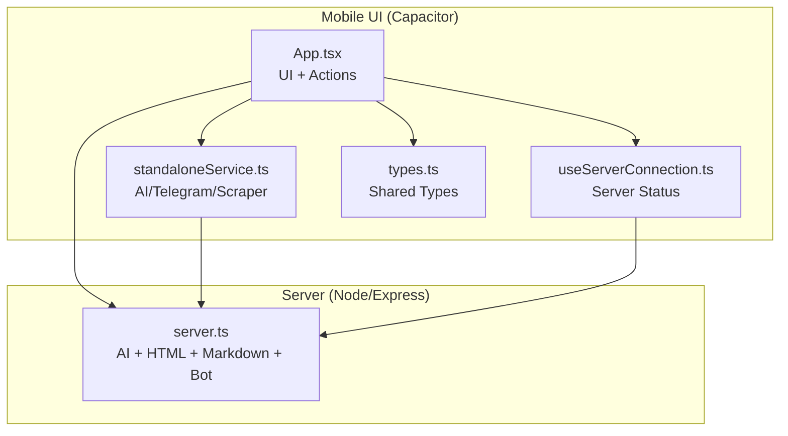
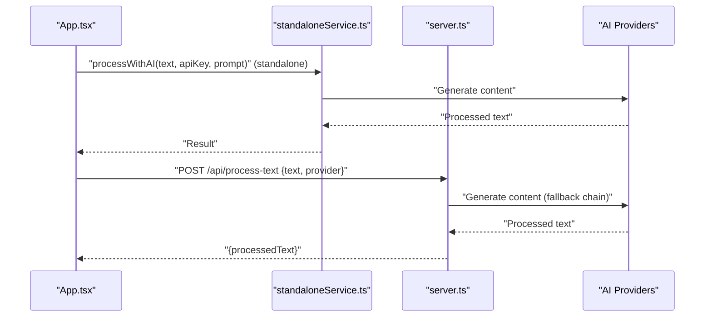
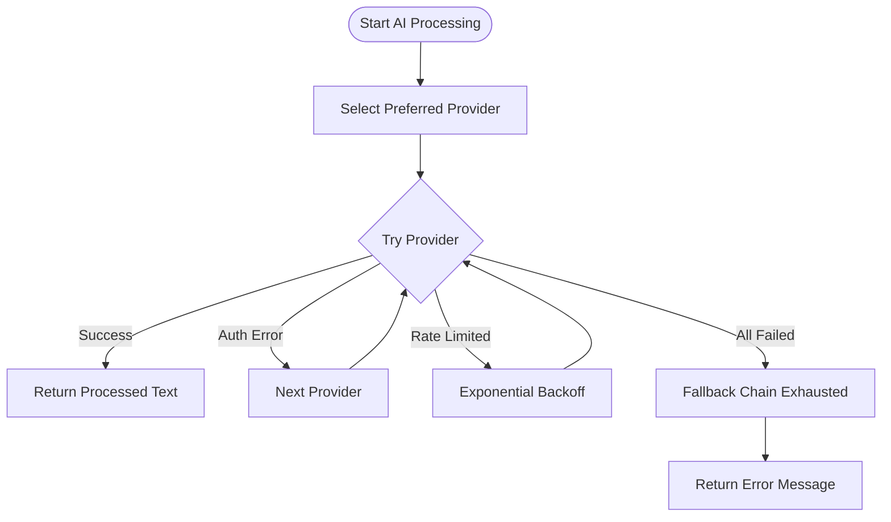
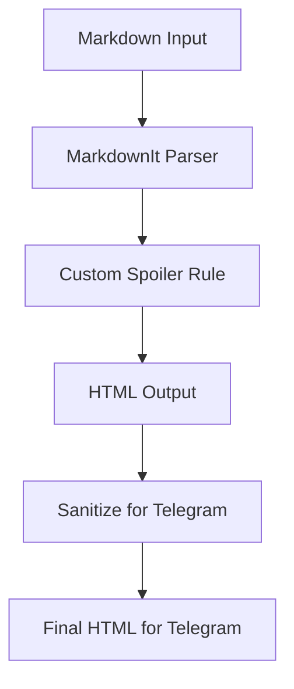
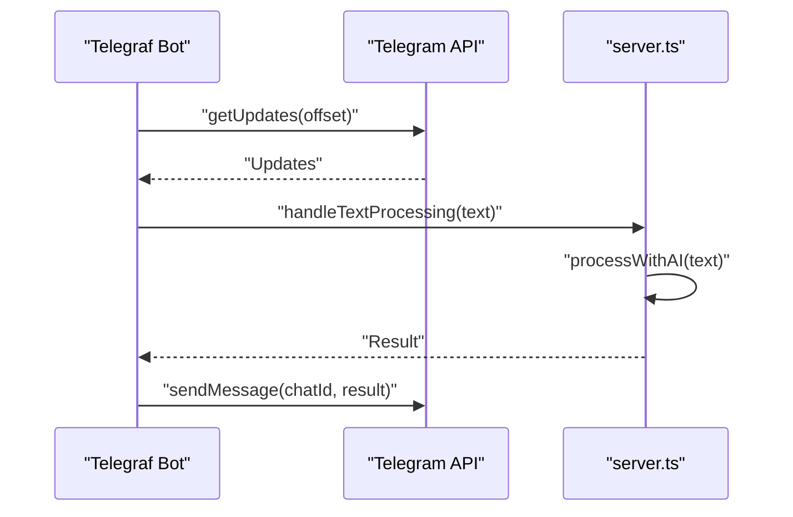
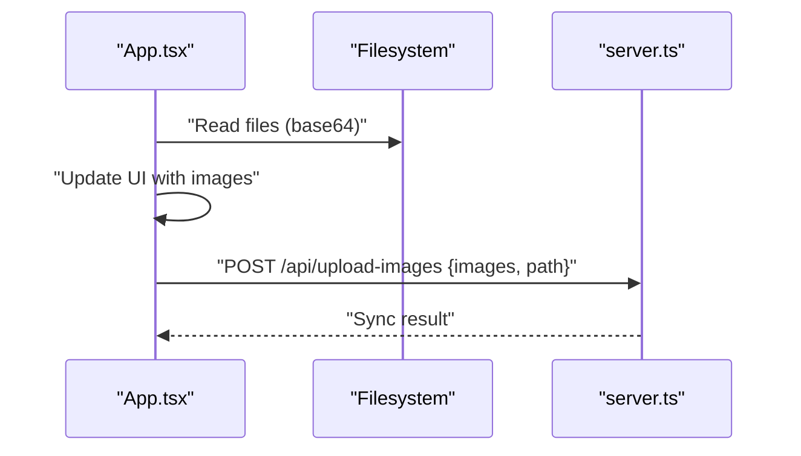
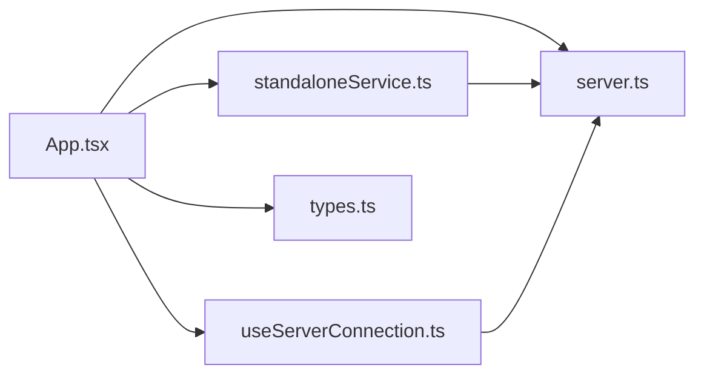

# CPU-Intensive Operations

<cite>
**Referenced Files in This Document**
- [server.ts](file://server.ts)
- [App.tsx](file://src/App.tsx)
- [standaloneService.ts](file://src/services/standaloneService.ts)
- [useServerConnection.ts](file://src/hooks/useServerConnection.ts)
- [types.ts](file://src/types.ts)
- [main.tsx](file://src/main.tsx)
</cite>

## Table of Contents
1. [Introduction](#introduction)
2. [Project Structure](#project-structure)
3. [Core Components](#core-components)
4. [Architecture Overview](#architecture-overview)
5. [Detailed Component Analysis](#detailed-component-analysis)
6. [Dependency Analysis](#dependency-analysis)
7. [Performance Considerations](#performance-considerations)
8. [Troubleshooting Guide](#troubleshooting-guide)
9. [Conclusion](#conclusion)

## Introduction
This document focuses on CPU-intensive operation performance issues within the project, specifically around AI content transformation, HTML sanitization, markdown-to-Telegram conversion, and image handling. It explains how background tasks are managed, how concurrent requests are handled, and how thread pools and CPU profiling can be leveraged to maintain responsiveness under load. It also covers load balancing considerations, request queuing, and resource allocation best practices.

## Project Structure
The project consists of:
- A Node.js/Express server that orchestrates AI transformations, HTML sanitization, markdown parsing, and Telegram bot operations.
- A Capacitor-based React mobile UI that interacts with the server and performs local AI processing in standalone mode.
- Shared types and services for AI, scraping, and Telegram operations.

**Diagram sources**
- [App.tsx:168-1888](file://src/App.tsx#L168-L1888)
- [standaloneService.ts:1-175](file://src/services/standaloneService.ts#L1-L175)
- [useServerConnection.ts:1-52](file://src/hooks/useServerConnection.ts#L1-L52)
- [types.ts:1-48](file://src/types.ts#L1-L48)
- [server.ts:1-1454](file://server.ts#L1-L1454)

**Section sources**
- [main.tsx:1-11](file://src/main.tsx#L1-L11)
- [App.tsx:168-1888](file://src/App.tsx#L168-L1888)
- [standaloneService.ts:1-175](file://src/services/standaloneService.ts#L1-L175)
- [useServerConnection.ts:1-52](file://src/hooks/useServerConnection.ts#L1-L52)
- [types.ts:1-48](file://src/types.ts#L1-L48)
- [server.ts:1-1454](file://server.ts#L1-L1454)

## Core Components
- AI content transformation:
  - Server-side: Gemini/Azure/GitHub/OpenRouter/DeepSeek via a robust provider fallback and retry mechanism.
  - Mobile standalone: Gemini via local AI service.
- HTML sanitization and markdown-to-Telegram conversion:
  - Server uses Cheerio and Marked for parsing and sanitization.
  - Mobile uses MarkdownIt with custom spoiler rule and sanitization pipeline.
- Image handling:
  - Mobile supports local image selection and upload; server supports image synchronization and upload endpoints.
- Background tasks and concurrency:
  - Telegram bot runs in polling mode with health checks and restart logic.
  - UI uses timeouts and polling for logs and server status.

**Section sources**
- [server.ts:412-645](file://server.ts#L412-L645)
- [standaloneService.ts:148-159](file://src/services/standaloneService.ts#L148-L159)
- [App.tsx:375-399](file://src/App.tsx#L375-L399)
- [App.tsx:811-864](file://src/App.tsx#L811-L864)

## Architecture Overview
The system splits CPU-heavy tasks between the server and the device:
- Server handles AI transformations and heavy parsing.
- Mobile performs lightweight AI processing locally and offloads heavy tasks to the server.

**Diagram sources**
- [App.tsx:811-864](file://src/App.tsx#L811-L864)
- [standaloneService.ts:148-159](file://src/services/standaloneService.ts#L148-L159)
- [server.ts:412-645](file://server.ts#L412-L645)

## Detailed Component Analysis

### AI Content Transformation Pipeline
- Provider fallback and retry:
  - The server attempts multiple providers in order, with per-provider retries and quota-aware backoff.
  - Gemini quota detection triggers provider disabling until retry delay.
- Standalone AI:
  - Uses Google Generative AI SDK directly on-device for small payloads.

**Diagram sources**
- [server.ts:412-645](file://server.ts#L412-L645)

**Section sources**
- [server.ts:412-645](file://server.ts#L412-L645)
- [standaloneService.ts:148-159](file://src/services/standaloneService.ts#L148-L159)

### HTML Sanitization and Markdown Conversion
- Server:
  - Cheerio sanitization strips disallowed tags and validates HTML safely.
  - Marked renders markdown to HTML for downstream Telegram formatting.
- Mobile:
  - MarkdownIt with custom spoiler rule and sanitization pipeline tailored for Telegram’s HTML subset.

**Diagram sources**
- [App.tsx:375-399](file://src/App.tsx#L375-L399)
- [server.ts:285-340](file://server.ts#L285-L340)

**Section sources**
- [App.tsx:375-399](file://src/App.tsx#L375-L399)
- [server.ts:285-340](file://server.ts#L285-L340)

### Telegram Bot Polling and Concurrency
- Polling loop with periodic updates and health monitoring.
- Graceful restart on conflicts and transient network errors.
- Handler timeout configured for long-running AI operations.

**Diagram sources**
- [server.ts:688-799](file://server.ts#L688-L799)
- [server.ts:648-671](file://server.ts#L648-L671)

**Section sources**
- [server.ts:688-799](file://server.ts#L688-L799)
- [server.ts:648-671](file://server.ts#L648-L671)

### Image Handling and Upload
- Mobile:
  - Local file selection and base64 conversion.
  - Optional server synchronization with fallback to local-only behavior.
- Server:
  - Image upload endpoint and gallery synchronization.

**Diagram sources**
- [App.tsx:1104-1184](file://src/App.tsx#L1104-L1184)
- [server.ts:1-1454](file://server.ts#L1-L1454)

**Section sources**
- [App.tsx:1104-1184](file://src/App.tsx#L1104-L1184)
- [server.ts:1-1454](file://server.ts#L1-L1454)

## Dependency Analysis
- UI depends on:
  - standaloneService for local AI and Telegram calls.
  - useServerConnection for server status and connectivity.
  - types for shared data contracts.
- Server depends on:
  - Telegraf for bot operations.
  - Cheerio and Marked for parsing and sanitization.
  - Rate limiters for request control.

**Diagram sources**
- [App.tsx:168-1888](file://src/App.tsx#L168-L1888)
- [standaloneService.ts:1-175](file://src/services/standaloneService.ts#L1-L175)
- [useServerConnection.ts:1-52](file://src/hooks/useServerConnection.ts#L1-L52)
- [types.ts:1-48](file://src/types.ts#L1-L48)
- [server.ts:1-1454](file://server.ts#L1-L1454)

**Section sources**
- [App.tsx:168-1888](file://src/App.tsx#L168-L1888)
- [standaloneService.ts:1-175](file://src/services/standaloneService.ts#L1-L175)
- [useServerConnection.ts:1-52](file://src/hooks/useServerConnection.ts#L1-L52)
- [types.ts:1-48](file://src/types.ts#L1-L48)
- [server.ts:1-1454](file://server.ts#L1-L1454)

## Performance Considerations
- CPU-intensive tasks:
  - AI generation is inherently expensive; use provider fallback and quota-aware backoff to avoid repeated failures.
  - On mobile, prefer standalone mode for small texts; offload larger payloads to the server.
- Parsing and sanitization:
  - Limit input sizes and use streaming-friendly parsers where possible.
  - Cache sanitized outputs for identical inputs.
- Concurrency:
  - Use rate limiters to cap concurrent AI requests.
  - Separate long-running tasks (AI) from short-lived UI actions.
- Thread pools and workers:
  - Offload heavy parsing/sanitization to worker threads or isolate them in separate processes.
  - Use clustering on the server to utilize multiple cores.
- Logging and monitoring:
  - Use structured logs and metrics to track latency and throughput.
  - Monitor provider quotas and adjust fallback strategies dynamically.

[No sources needed since this section provides general guidance]

## Troubleshooting Guide

### Identifying CPU Bottlenecks
- Use CPU profiling tools:
  - Node.js: --prof, --inspect, clinic, or built-in profiler.
  - Mobile: Android Studio CPU Profiler or Chrome DevTools for WebView.
- Focus areas:
  - AI provider calls and retries.
  - HTML sanitization and markdown parsing.
  - Image base64 conversions and uploads.

### Common Issues and Fixes
- AI quota exceeded:
  - Symptom: Repeated 429/RESOURCE_EXHAUSTED responses.
  - Fix: Implement exponential backoff and switch providers; monitor quotas.
- Slow HTML sanitization:
  - Symptom: High CPU usage during message processing.
  - Fix: Reduce payload size, cache sanitized results, or move to worker threads.
- Excessive polling overhead:
  - Symptom: Elevated CPU on bot polling.
  - Fix: Tune polling intervals and handler timeout; ensure health checks are efficient.
- Mobile memory pressure:
  - Symptom: Crashes or slowdowns during image selection.
  - Fix: Limit batch size of selected images; avoid large base64 payloads when possible.

### Monitoring and Logging
- Server-side:
  - Use the SSE log stream and rate-limited logs to observe bottlenecks.
  - Track provider-specific error rates and retry counts.
- Client-side:
  - Use the UI logs to correlate UI actions with backend delays.

**Section sources**
- [server.ts:342-352](file://server.ts#L342-L352)
- [server.ts:52-72](file://server.ts#L52-L72)
- [server.ts:412-645](file://server.ts#L412-L645)
- [App.tsx:652-679](file://src/App.tsx#L652-L679)

## Conclusion
To maintain responsive performance under CPU-intensive workloads:
- Distribute heavy tasks across server and device intelligently.
- Apply rate limiting, exponential backoff, and provider fallbacks.
- Profile and optimize parsing/sanitization and AI calls.
- Use worker threads or clustering to scale CPU-bound operations.
- Continuously monitor logs and metrics to detect and address bottlenecks early.

[No sources needed since this section summarizes without analyzing specific files]