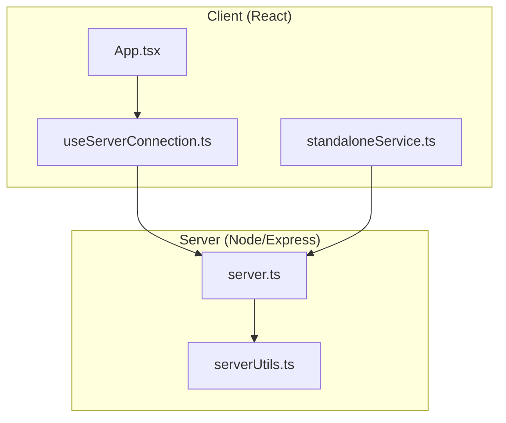
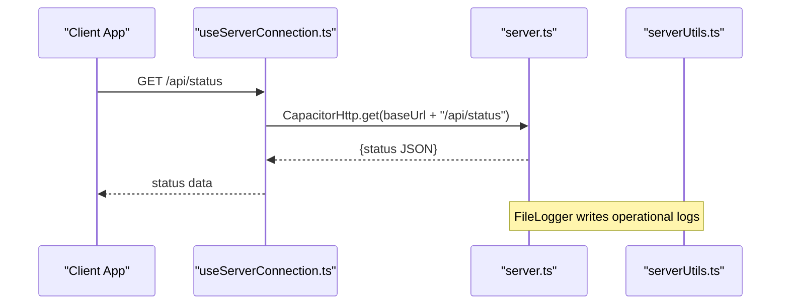
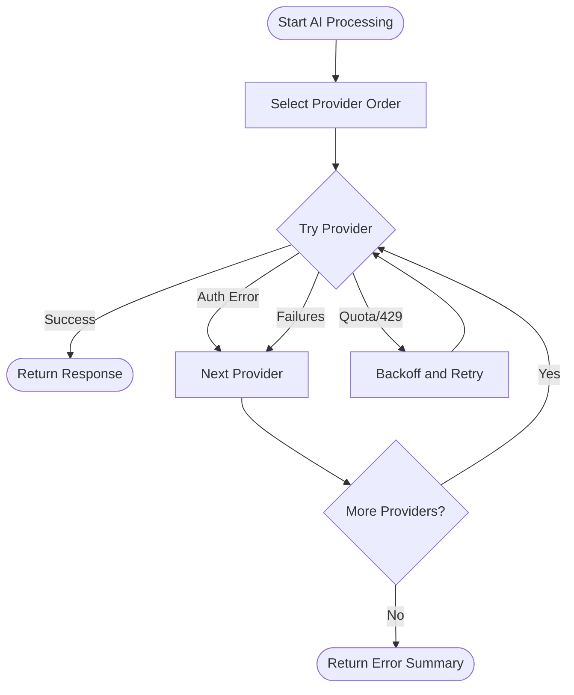
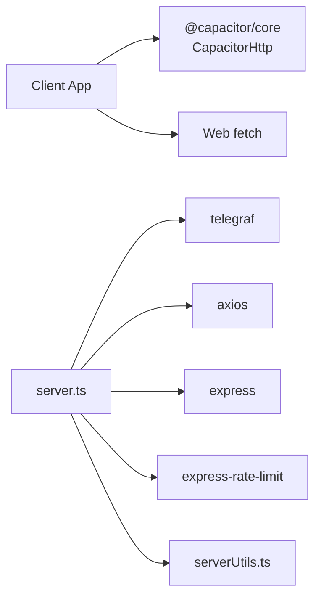

# Network Latency and Connectivity

<cite>
**Referenced Files in This Document**
- [server.ts](file://server.ts)
- [src/App.tsx](file://src/App.tsx)
- [src/hooks/useServerConnection.ts](file://src/hooks/useServerConnection.ts)
- [src/services/standaloneService.ts](file://src/services/standaloneService.ts)
- [src/serverUtils.ts](file://src/serverUtils.ts)
- [package.json](file://package.json)
- [README.md](file://README.md)
</cite>

## Table of Contents
1. [Introduction](#introduction)
2. [Project Structure](#project-structure)
3. [Core Components](#core-components)
4. [Architecture Overview](#architecture-overview)
5. [Detailed Component Analysis](#detailed-component-analysis)
6. [Dependency Analysis](#dependency-analysis)
7. [Performance Considerations](#performance-considerations)
8. [Troubleshooting Guide](#troubleshooting-guide)
9. [Conclusion](#conclusion)
10. [Appendices](#appendices)

## Introduction
This document provides actionable troubleshooting guidance for network latency and connectivity performance issues in the project. It focuses on:
- Slow API response times from AI providers
- Telegram bot connections
- External service calls
- Timeout configurations, connection pooling strategies, and retry mechanisms
- Network monitoring, latency measurement, and bandwidth optimization
- Procedures for intermittent connectivity, DNS resolution issues, and proxy configuration problems
- SSL/TLS handshake optimization and certificate validation performance

The goal is to help diagnose and resolve network-related bottlenecks affecting the client, server, and third-party integrations.

## Project Structure
The project consists of:
- A Node.js/Express server exposing APIs, managing a Telegram bot, and orchestrating AI provider calls
- A React client using Capacitor for native HTTP requests and platform-specific behaviors
- Services for Telegram direct calls, AI processing, and scraping
- Logging utilities for diagnostics

**Diagram sources**
- [src/App.tsx:194-251](file://src/App.tsx#L194-L251)
- [src/hooks/useServerConnection.ts:15-52](file://src/hooks/useServerConnection.ts#L15-L52)
- [src/services/standaloneService.ts:75-146](file://src/services/standaloneService.ts#L75-L146)
- [server.ts:37-800](file://server.ts#L37-L800)
- [src/serverUtils.ts:1-23](file://src/serverUtils.ts#L1-L23)

**Section sources**
- [README.md:1-25](file://README.md#L1-L25)
- [package.json:1-70](file://package.json#L1-L70)

## Core Components
- Express server with rate limiting, CORS, and logging
- Telegram bot with polling and health checks
- AI provider orchestration with retries and fallbacks
- Client-side HTTP abstraction using Capacitor for native platforms and fetch for web
- Logging via file logger and server-side SSE/SSE-like polling

Key areas impacting latency and connectivity:
- Timeout and retry configuration for AI providers
- Handler timeouts and polling intervals for Telegram
- Client-side request timeouts and platform-specific HTTP behavior
- Rate limiting and concurrency controls

**Section sources**
- [server.ts:37-800](file://server.ts#L37-L800)
- [src/App.tsx:194-251](file://src/App.tsx#L194-L251)
- [src/hooks/useServerConnection.ts:15-52](file://src/hooks/useServerConnection.ts#L15-L52)
- [src/serverUtils.ts:1-23](file://src/serverUtils.ts#L1-L23)

## Architecture Overview
The system integrates three primary network paths:
- Client-to-Server API calls (Capacitor fetch on native, fetch on web)
- Telegram bot polling and direct API calls
- AI provider requests with per-provider timeouts and retries

**Diagram sources**
- [src/hooks/useServerConnection.ts:15-52](file://src/hooks/useServerConnection.ts#L15-L52)
- [src/App.tsx:194-251](file://src/App.tsx#L194-L251)
- [server.ts:37-800](file://server.ts#L37-L800)
- [src/serverUtils.ts:1-23](file://src/serverUtils.ts#L1-L23)

## Detailed Component Analysis

### Express Server: Rate Limiting, CORS, and Logging
- Rate limits are applied to API endpoints, AI endpoints, and mutations to prevent overload and improve stability under burst traffic.
- CORS is configured to accept dynamic origins with credentials and common headers.
- Logging is centralized via a file logger and SSE streaming for real-time diagnostics.

Operational implications:
- Excessive client requests can trigger rate limits, causing delays or throttled responses.
- SSE streaming requires persistent connections; failures should be retried.

**Section sources**
- [server.ts:44-73](file://server.ts#L44-L73)
- [src/serverUtils.ts:1-23](file://src/serverUtils.ts#L1-L23)
- [server.ts:342-352](file://server.ts#L342-L352)

### Telegram Bot: Polling, Health Checks, and Timeouts
- The bot initializes with a handler timeout and uses polling to receive updates.
- Health checks periodically call the Telegram API to detect connectivity issues.
- On transient network errors, the bot continues attempting to recover.

Operational implications:
- Long handler timeouts increase resource usage; adjust based on workload.
- Health check thresholds determine automatic restart behavior after failures.
- Webhook deletion ensures no stale update delivery during restarts.

**Section sources**
- [server.ts:688-800](file://server.ts#L688-L800)
- [server.ts:377-409](file://server.ts#L377-L409)
- [server.ts:729-763](file://server.ts#L729-L763)

### AI Provider Orchestration: Timeouts, Retries, and Fallbacks
- Providers are attempted in order, with per-provider timeouts and retry logic for 429/503 responses.
- Gemini quotas and model availability are handled with explicit checks and fallbacks.
- GitHub, OpenRouter, DeepSeek, and Gemini are supported with distinct configurations.

Operational implications:
- Provider-specific timeouts prevent long hangs on slow endpoints.
- Retry delays and exponential backoff reduce contention and improve success rates.
- Model fallbacks mitigate partial outages.

**Diagram sources**
- [server.ts:412-645](file://server.ts#L412-L645)

**Section sources**
- [server.ts:412-645](file://server.ts#L412-L645)

### Client-Side HTTP Abstraction: Capacitor vs Web Fetch
- On native platforms, Capacitor HTTP is used with explicit connect/read timeouts.
- On web, fetch is used with an AbortController and a 120-second timeout.
- The client also supports SSE for logs on web and polling on native.

Operational implications:
- Native HTTP stack often yields more predictable timeouts and lower overhead.
- Web fetch relies on browser defaults; explicit timeouts avoid hanging requests.
- SSE is not supported in Android WebView; polling is used instead.

**Section sources**
- [src/App.tsx:194-251](file://src/App.tsx#L194-L251)
- [src/App.tsx:651-698](file://src/App.tsx#L651-L698)
- [src/hooks/useServerConnection.ts:15-52](file://src/hooks/useServerConnection.ts#L15-L52)

### Telegram Direct Calls and Scraping Service
- Telegram API calls are made directly via Capacitor HTTP or fetch depending on platform.
- Scraping uses Capacitor HTTP to bypass CORS on Android.

Operational implications:
- Consistent headers and JSON payload handling reduce errors.
- Platform-specific HTTP stacks improve reliability on mobile.

**Section sources**
- [src/services/standaloneService.ts:75-146](file://src/services/standaloneService.ts#L75-L146)
- [src/services/standaloneService.ts:161-174](file://src/services/standaloneService.ts#L161-L174)

## Dependency Analysis
External libraries influencing network behavior:
- Telegraf: includes internal timeout utilities and polling mechanics
- Axios: used for AI provider requests with explicit timeouts
- Capacitor HTTP: native HTTP stack with configurable timeouts
- Express rate-limit: controls request throughput to protect resources

**Diagram sources**
- [package.json:19-56](file://package.json#L19-L56)
- [src/App.tsx:194-251](file://src/App.tsx#L194-L251)
- [server.ts:1-16](file://server.ts#L1-L16)

**Section sources**
- [package.json:19-56](file://package.json#L19-L56)

## Performance Considerations
- Timeout tuning
  - AI provider requests: 60 seconds connect/read timeouts
  - Client fetch: 120 seconds for web; native uses 60/120 seconds
  - Telegram bot handler timeout: 90 seconds
- Retry strategies
  - 429/503 responses trigger backoff retries with incremental delays
  - Gemini quota detection includes retry hints derived from provider messages
- Connection pooling
  - No explicit pools configured; rely on underlying HTTP stacks
  - Consider enabling keep-alive at the OS/network layer for repeated AI requests
- Concurrency
  - Rate limits prevent overload; adjust windows and max values based on capacity
- Logging overhead
  - SSE streaming and frequent polling can increase network traffic; throttle as needed

[No sources needed since this section provides general guidance]

## Troubleshooting Guide

### 1) Slow API Response Times from AI Providers
Symptoms:
- Delays when translating or processing content
- Frequent 429/503 responses

Actions:
- Verify provider keys and quotas; monitor quota exhaustion indicators
- Confirm per-provider timeouts are sufficient (60 seconds)
- Enable retries for transient 429/503 responses
- Prefer model fallbacks when a model is unavailable

Evidence in code:
- Per-provider timeouts and retry loops
- Quota detection and retry hint parsing
- Model fallback chain for Gemini

**Section sources**
- [server.ts:456-499](file://server.ts#L456-L499)
- [server.ts:570-589](file://server.ts#L570-L589)
- [server.ts:598-626](file://server.ts#L598-L626)
- [server.ts:508-536](file://server.ts#L508-L536)
- [server.ts:548-562](file://server.ts#L548-L562)
- [server.ts:368-375](file://server.ts#L368-L375)

### 2) Telegram Bot Connections and Polling
Symptoms:
- Bot not receiving updates
- Frequent ETIMEDOUT or ECONNRESET errors
- Health check failures followed by restarts

Actions:
- Ensure polling is active and webhook is deleted before launching
- Monitor health check interval and failure thresholds
- Adjust handler timeout based on workload
- Investigate network interruptions causing transient errors

Evidence in code:
- Polling initialization and error handling
- Health check loop and restart logic
- Webhook deletion prior to polling

**Section sources**
- [server.ts:688-800](file://server.ts#L688-L800)
- [server.ts:377-409](file://server.ts#L377-L409)
- [server.ts:757-763](file://server.ts#L757-L763)
- [server.ts:729-743](file://server.ts#L729-L743)

### 3) Client-Side Connectivity and Timeouts
Symptoms:
- Requests hang or fail on web
- Native requests occasionally time out

Actions:
- Use Capacitor HTTP on native for consistent timeouts
- Apply AbortController-based timeouts on web
- Validate base URL normalization and scheme selection
- Monitor SSE vs polling fallback behavior

Evidence in code:
- Capacitor HTTP with connect/read timeouts
- AbortController-based fetch timeout
- SSE vs polling fallback for logs

**Section sources**
- [src/App.tsx:194-251](file://src/App.tsx#L194-L251)
- [src/App.tsx:651-698](file://src/App.tsx#L651-L698)

### 4) Monitoring and Diagnostics
Symptoms:
- Hard to pinpoint latency sources
- Difficult to correlate client and server events

Actions:
- Use SSE streaming for live logs on web
- Use polling logs on native
- Persist logs to file for offline analysis
- Correlate timestamps across client and server

Evidence in code:
- SSE endpoint for logs
- Polling logs on native
- File logger utility

**Section sources**
- [server.ts:342-352](file://server.ts#L342-L352)
- [src/App.tsx:651-698](file://src/App.tsx#L651-L698)
- [src/serverUtils.ts:1-23](file://src/serverUtils.ts#L1-L23)

### 5) Intermittent Connectivity and DNS Issues
Symptoms:
- Occasional failures to reach AI providers or Telegram
- Hostname resolution delays

Actions:
- Test DNS resolution independently
- Use IP-based endpoints as a temporary workaround
- Configure system-level DNS caching or resolver improvements
- Validate firewall/proxy policies

[No sources needed since this section provides general guidance]

### 6) Proxy Configuration Problems
Symptoms:
- Requests succeed locally but fail behind corporate proxies
- TLS handshake failures or timeouts through proxies

Actions:
- Ensure proxy-compatible HTTP stack is used
- Configure proxy environment variables if applicable
- Validate certificate trust stores and intermediate CA presence
- Test with direct connections to isolate proxy issues

[No sources needed since this section provides general guidance]

### 7) SSL/TLS Handshake Optimization and Certificate Validation
Symptoms:
- Slow HTTPS handshakes
- Certificate validation errors or delays

Actions:
- Enable HTTP/2 where supported to reduce handshake overhead
- Reuse connections and enable keep-alive
- Ensure system certificates are current
- Consider disabling hostname verification only for controlled testing environments

[No sources needed since this section provides general guidance]

## Conclusion
This guide consolidates practical steps to troubleshoot network latency and connectivity across the client, server, and third-party integrations. By tuning timeouts, leveraging retries and fallbacks, monitoring logs, and validating platform-specific HTTP behavior, most performance issues can be resolved efficiently.

[No sources needed since this section summarizes without analyzing specific files]

## Appendices

### A) Key Timeout and Retry Parameters
- AI provider requests: 60-second timeout
- Client fetch (web): 120-second timeout
- Client fetch (native): 60/120-second connect/read timeouts
- Telegram bot handler timeout: 90 seconds
- Health check interval: 60 seconds
- Health check failure threshold: 3 consecutive failures before restart

**Section sources**
- [server.ts:456-499](file://server.ts#L456-L499)
- [server.ts:570-589](file://server.ts#L570-L589)
- [server.ts:598-626](file://server.ts#L598-L626)
- [server.ts:508-536](file://server.ts#L508-L536)
- [server.ts:368-375](file://server.ts#L368-L375)
- [src/App.tsx:219-221](file://src/App.tsx#L219-L221)
- [server.ts:377-409](file://server.ts#L377-L409)

### B) Diagnostic Checklist
- Verify base URL correctness and scheme selection
- Confirm provider keys and quotas
- Check SSE/polling logs for recent errors
- Validate platform-specific HTTP behavior
- Test DNS and proxy connectivity
- Review rate-limiting impact on API throughput

[No sources needed since this section provides general guidance]