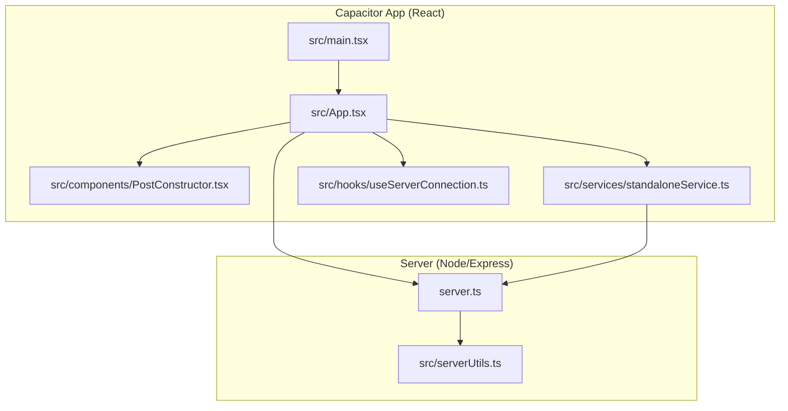
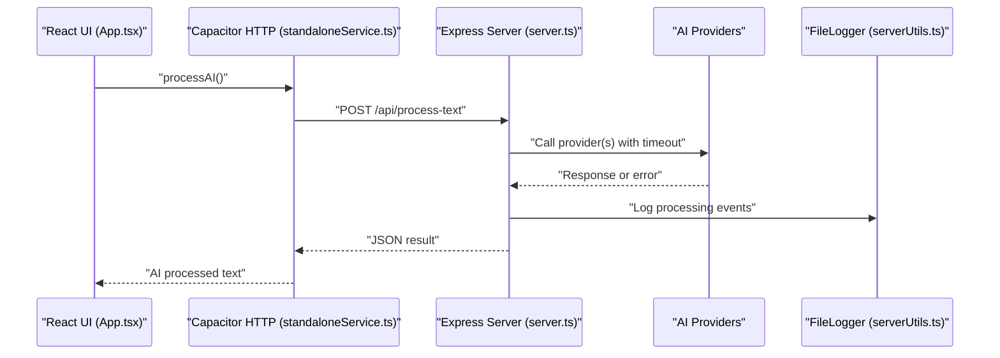
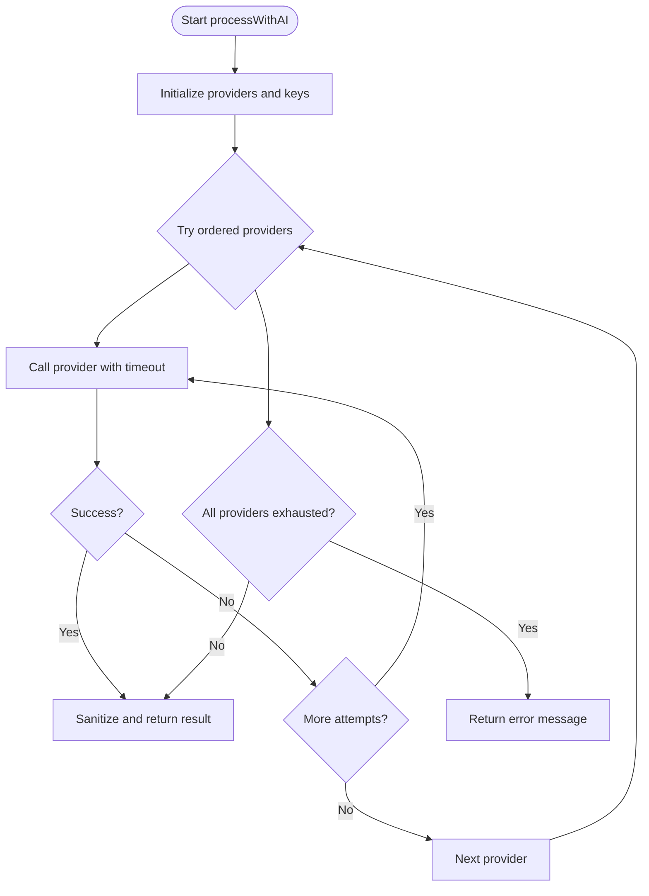
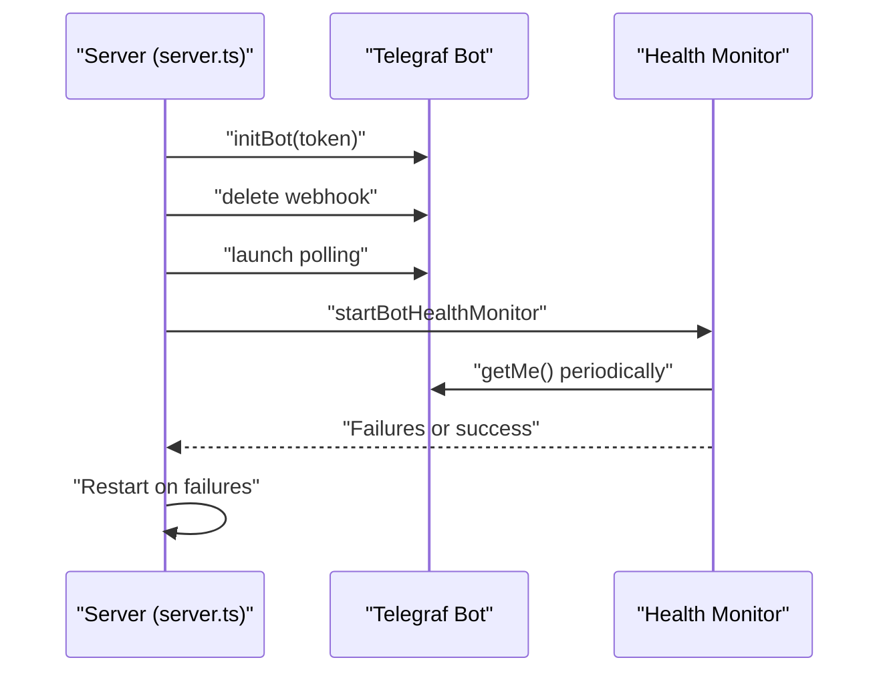
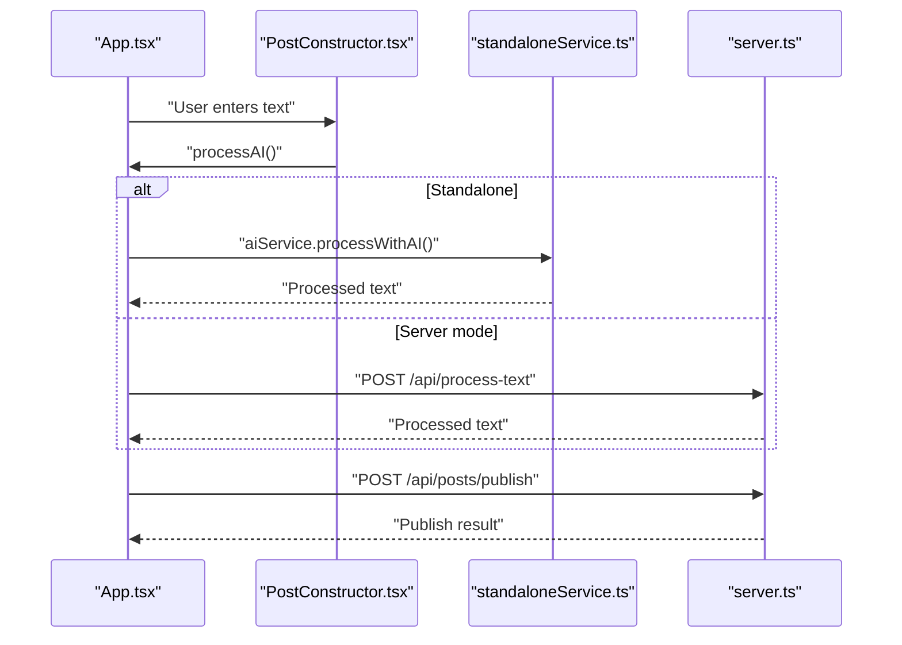
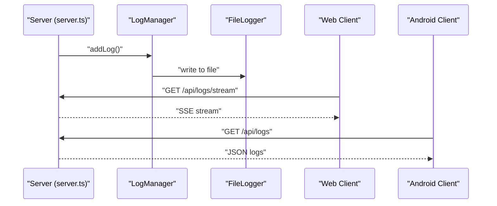
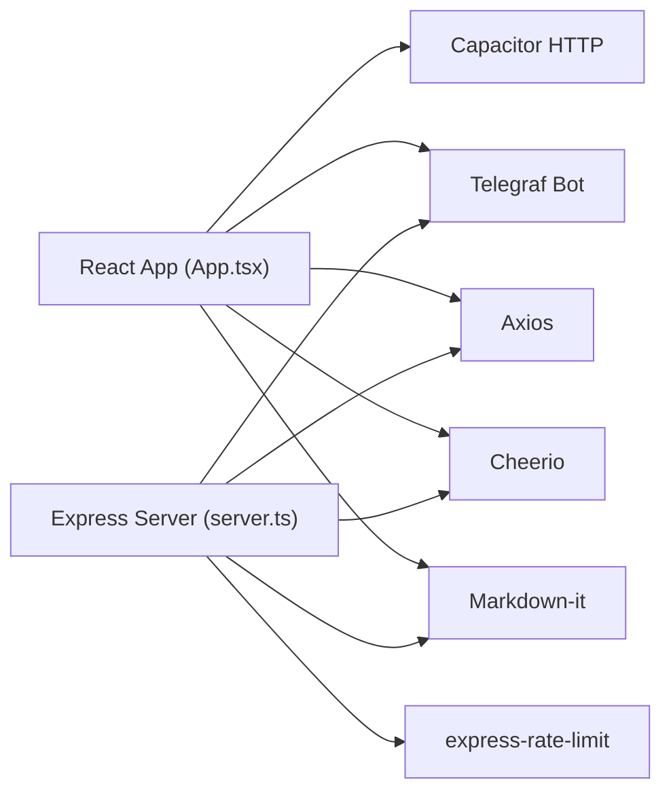

# Performance Issues and Optimization

<cite>
**Referenced Files in This Document**
- [server.ts](file://server.ts)
- [src/main.tsx](file://src/main.tsx)
- [src/App.tsx](file://src/App.tsx)
- [src/components/PostConstructor.tsx](file://src/components/PostConstructor.tsx)
- [src/services/standaloneService.ts](file://src/services/standaloneService.ts)
- [src/hooks/useServerConnection.ts](file://src/hooks/useServerConnection.ts)
- [src/serverUtils.ts](file://src/serverUtils.ts)
- [package.json](file://package.json)
- [README.md](file://README.md)
</cite>

## Table of Contents
1. [Introduction](#introduction)
2. [Project Structure](#project-structure)
3. [Core Components](#core-components)
4. [Architecture Overview](#architecture-overview)
5. [Detailed Component Analysis](#detailed-component-analysis)
6. [Dependency Analysis](#dependency-analysis)
7. [Performance Considerations](#performance-considerations)
8. [Troubleshooting Guide](#troubleshooting-guide)
9. [Conclusion](#conclusion)
10. [Appendices](#appendices)

## Introduction
This document focuses on diagnosing and resolving performance-related issues across the application stack. It covers:
- Slow AI processing times (provider latency, model loading delays, content transformation bottlenecks)
- Memory usage optimization (cache management, garbage collection, resource cleanup)
- Network latency problems (API response times, connection pooling, timeout configurations)
- CPU-intensive operations, background task management, and concurrent request handling
- Performance monitoring, profiling, bottleneck identification, and targeted optimization strategies

## Project Structure
The project consists of:
- A Node.js/Express server that orchestrates AI processing, Telegram bot lifecycle, and persistence
- A React-based Capacitor app that communicates with the server and handles UI rendering, image selection, and publishing
- Shared services for AI, Telegram, and filesystem operations

**Diagram sources**
- [src/main.tsx:1-11](file://src/main.tsx#L1-L11)
- [src/App.tsx:1-110](file://src/App.tsx#L1-L110)
- [src/components/PostConstructor.tsx:1-120](file://src/components/PostConstructor.tsx#L1-L120)
- [src/services/standaloneService.ts:1-175](file://src/services/standaloneService.ts#L1-L175)
- [src/hooks/useServerConnection.ts:1-52](file://src/hooks/useServerConnection.ts#L1-L52)
- [server.ts:1-120](file://server.ts#L1-L120)
- [src/serverUtils.ts:1-23](file://src/serverUtils.ts#L1-L23)

**Section sources**
- [src/main.tsx:1-11](file://src/main.tsx#L1-L11)
- [src/App.tsx:1-110](file://src/App.tsx#L1-L110)
- [server.ts:1-120](file://server.ts#L1-L120)

## Core Components
- Server-side AI orchestration and bot lifecycle management
- Client-side React UI with Capacitor-native networking and logging
- Services for AI, Telegram, and filesystem operations
- Hooks for server connectivity and status polling

Key performance-relevant areas:
- AI provider selection and retries with timeouts
- Rate limiting and concurrency controls
- Logging and SSE streaming for diagnostics
- Native HTTP client usage for Android WebView limitations
- Image handling and Markdown-to-HTML transformations

**Section sources**
- [server.ts:411-645](file://server.ts#L411-L645)
- [src/App.tsx:811-864](file://src/App.tsx#L811-L864)
- [src/services/standaloneService.ts:148-159](file://src/services/standaloneService.ts#L148-L159)
- [src/hooks/useServerConnection.ts:15-51](file://src/hooks/useServerConnection.ts#L15-L51)

## Architecture Overview
The system integrates a React app with a Node/Express backend. The app communicates with the server via HTTP requests and SSE for live logs. AI processing can be performed either on the server or locally via a Capacitor service depending on the operating mode.

**Diagram sources**
- [src/App.tsx:811-864](file://src/App.tsx#L811-L864)
- [src/services/standaloneService.ts:148-159](file://src/services/standaloneService.ts#L148-L159)
- [server.ts:411-645](file://server.ts#L411-L645)
- [src/serverUtils.ts:1-23](file://src/serverUtils.ts#L1-L23)

## Detailed Component Analysis

### AI Processing Pipeline
The server orchestrates AI processing with multiple providers, timeouts, and fallbacks. It logs provider attempts and errors, and returns a sanitized result or a user-friendly error message.

**Diagram sources**
- [server.ts:411-645](file://server.ts#L411-L645)

**Section sources**
- [server.ts:411-645](file://server.ts#L411-L645)

### Telegram Bot Lifecycle and Health Monitoring
The server manages a Telegraf bot with health checks, restart logic, and graceful shutdown. It deletes webhooks before polling and monitors health at intervals.

**Diagram sources**
- [server.ts:673-799](file://server.ts#L673-L799)
- [server.ts:377-409](file://server.ts#L377-L409)

**Section sources**
- [server.ts:673-799](file://server.ts#L673-L799)
- [server.ts:377-409](file://server.ts#L377-L409)

### Client-Side AI Processing and Publishing
The React app can delegate AI processing to the server or run it locally via Capacitor services. It also handles publishing to Telegram, including media groups and inline buttons.

**Diagram sources**
- [src/App.tsx:811-864](file://src/App.tsx#L811-L864)
- [src/components/PostConstructor.tsx:140-160](file://src/components/PostConstructor.tsx#L140-L160)
- [src/services/standaloneService.ts:148-159](file://src/services/standaloneService.ts#L148-L159)
- [server.ts:905-975](file://server.ts#L905-L975)

**Section sources**
- [src/App.tsx:811-864](file://src/App.tsx#L811-L864)
- [src/components/PostConstructor.tsx:140-160](file://src/components/PostConstructor.tsx#L140-L160)
- [src/services/standaloneService.ts:148-159](file://src/services/standaloneService.ts#L148-L159)
- [server.ts:905-975](file://server.ts#L905-L975)

### Logging and Diagnostics
The server maintains a rolling log buffer and streams logs via SSE for real-time diagnostics. The client polls logs on Android and uses SSE on web.

**Diagram sources**
- [server.ts:218-277](file://server.ts#L218-L277)
- [src/serverUtils.ts:1-23](file://src/serverUtils.ts#L1-L23)
- [src/App.tsx:651-698](file://src/App.tsx#L651-L698)

**Section sources**
- [server.ts:218-277](file://server.ts#L218-L277)
- [src/serverUtils.ts:1-23](file://src/serverUtils.ts#L1-L23)
- [src/App.tsx:651-698](file://src/App.tsx#L651-L698)

## Dependency Analysis
External libraries impacting performance:
- Express and Telegraf for HTTP and Telegram integration
- Axios for HTTP requests to AI providers
- Cheerio and Markdown-it for content parsing and transformation
- Capacitor HTTP for Android WebView compatibility
- Rate limiting middleware for request throttling

**Diagram sources**
- [package.json:19-55](file://package.json#L19-L55)
- [server.ts:1-17](file://server.ts#L1-L17)
- [src/App.tsx:1-28](file://src/App.tsx#L1-L28)

**Section sources**
- [package.json:19-55](file://package.json#L19-L55)
- [server.ts:1-17](file://server.ts#L1-L17)
- [src/App.tsx:1-28](file://src/App.tsx#L1-L28)

## Performance Considerations

### AI Processing Bottlenecks
- Provider latency: The server retries with exponential backoff and falls back across providers. Tune timeouts and retry counts based on provider SLAs.
- Model loading: Initialize AI clients once and reuse instances to avoid cold starts.
- Content transformation: Minimize heavy DOM parsing and HTML sanitization passes.

Optimization strategies:
- Pre-warm AI clients and cache provider credentials
- Reduce payload sizes and trim input text before processing
- Use streaming responses from providers when available
- Implement circuit breaker patterns for failing providers

**Section sources**
- [server.ts:411-645](file://server.ts#L411-L645)

### Memory Usage Optimization
- Rolling log buffer: The server maintains a fixed-size log ring buffer to cap memory growth.
- Client-side state: Avoid storing large images in memory; prefer base64 limits and lazy loading.
- Garbage collection: Clear timers and intervals on component unmount and page navigation.

Optimization strategies:
- Limit concurrent AI requests and batch image uploads
- Use virtualized lists for large galleries
- Dispose of FileReader and Blob URLs after use
- Periodically clear local caches and logs

**Section sources**
- [server.ts:218-277](file://server.ts#L218-L277)
- [src/App.tsx:1094-1184](file://src/App.tsx#L1094-L1184)

### Network Latency and Timeouts
- Client timeouts: The app sets connect/read timeouts for Capacitor HTTP and fetch with AbortController.
- Server timeouts: AI provider calls include explicit timeouts; Telegraf handler timeout is configured.
- Rate limiting: Express rate limiters protect the server from overload.

Optimization strategies:
- Increase timeouts for long-running AI calls
- Enable keep-alive and connection pooling where supported
- Use CDN for static assets and reduce redirects
- Monitor provider SLAs and adjust retry windows accordingly

**Section sources**
- [src/App.tsx:194-251](file://src/App.tsx#L194-L251)
- [server.ts:729-734](file://server.ts#L729-L734)
- [server.ts:456-472](file://server.ts#L456-L472)

### CPU-Intensive Operations
- Markdown parsing and HTML sanitization: Use efficient parsers and avoid redundant passes.
- Image handling: Prefer server-side resizing and compression for large images.
- Rendering: Defer heavy computations until after initial render; use requestAnimationFrame for animations.

Optimization strategies:
- Memoize parsed content and rendered previews
- Offload heavy tasks to Web Workers if feasible
- Debounce user input for live previews
- Use lazy loading for images and galleries

**Section sources**
- [src/App.tsx:375-399](file://src/App.tsx#L375-L399)
- [src/App.tsx:1094-1184](file://src/App.tsx#L1094-L1184)

### Background Task Management and Concurrency
- Bot polling: The app polls Telegram updates with a fixed interval; avoid excessive polling.
- Server concurrency: Use rate limiters and queue management for incoming requests.

Optimization strategies:
- Adjust polling intervals based on traffic
- Implement request queuing and backpressure
- Use worker threads for CPU-heavy tasks

**Section sources**
- [src/App.tsx:572-610](file://src/App.tsx#L572-L610)
- [server.ts:51-72](file://server.ts#L51-L72)

## Troubleshooting Guide

### Slow AI Processing Times
Symptoms:
- Long delays between clicking “Process” and receiving results
- Frequent quota or rate limit errors
- Provider-specific timeouts

Diagnosis steps:
- Check server logs for provider attempts and errors
- Verify AI keys and provider availability
- Confirm timeouts and retry logic are configured appropriately

Remediation:
- Switch to a faster provider or model variant
- Increase timeouts and tune retry backoff
- Cache successful results for repeated inputs

**Section sources**
- [server.ts:411-645](file://server.ts#L411-L645)
- [src/App.tsx:851-864](file://src/App.tsx#L851-L864)

### Memory Leaks and High Memory Usage
Symptoms:
- Increasing memory consumption over time
- UI slowdowns and jank

Diagnosis steps:
- Inspect log buffer size and rotation
- Review image handling and base64 storage
- Check for unclosed SSE connections or timers

Remediation:
- Limit log buffer size and enable periodic cleanup
- Avoid storing large images in state; use server-side storage
- Clear intervals and event listeners on component unmount

**Section sources**
- [server.ts:218-277](file://server.ts#L218-L277)
- [src/App.tsx:1094-1184](file://src/App.tsx#L1094-L1184)

### Network Latency and Timeout Errors
Symptoms:
- Frequent timeout errors when calling AI providers
- Slow response times from server endpoints

Diagnosis steps:
- Measure round-trip times to providers and server
- Verify client timeouts and server handler timeouts
- Check rate limiter thresholds

Remediation:
- Increase client and server timeouts
- Implement connection pooling and keep-alive
- Adjust rate limiter windows and quotas

**Section sources**
- [src/App.tsx:194-251](file://src/App.tsx#L194-L251)
- [server.ts:456-472](file://server.ts#L456-L472)
- [server.ts:51-72](file://server.ts#L51-L72)

### CPU Overuse and UI Freezes
Symptoms:
- UI becomes unresponsive during AI processing
- Heavy parsing causing frame drops

Diagnosis steps:
- Profile rendering and parsing operations
- Identify expensive computations in Markdown and HTML transforms
- Monitor image processing and preview generation

Remediation:
- Memoize parsed content and rendered previews
- Use requestAnimationFrame for UI updates
- Debounce live preview updates

**Section sources**
- [src/App.tsx:375-399](file://src/App.tsx#L375-L399)
- [src/App.tsx:1094-1184](file://src/App.tsx#L1094-L1184)

### Bot Health and Stability
Symptoms:
- Bot stops responding or restarts frequently
- Health checks report failures

Diagnosis steps:
- Review health monitor logs and restart triggers
- Check for 409 conflicts and webhook deletion
- Validate token and chat ID configuration

Remediation:
- Ensure unique bot instances and proper webhook cleanup
- Implement robust restart logic with backoff
- Monitor and alert on repeated failures

**Section sources**
- [server.ts:377-409](file://server.ts#L377-L409)
- [server.ts:673-799](file://server.ts#L673-L799)

## Conclusion
Performance optimization requires a layered approach:
- Optimize AI provider selection and timeouts
- Manage memory carefully with bounded buffers and state
- Tune network timeouts and rate limits
- Reduce CPU load through memoization and deferred rendering
- Strengthen bot lifecycle and health monitoring

## Appendices

### Performance Monitoring Checklist
- AI provider latency metrics and error rates
- Memory usage trends and GC pressure
- Network RTT and timeout distributions
- CPU utilization during rendering and parsing
- Bot uptime and restart frequency

### Recommended Tools
- Profiling: React DevTools, Chrome DevTools, Node.js profiler
- Metrics: Application-level counters and logs
- Observability: Structured logs with timestamps and correlation IDs

[No sources needed since this section provides general guidance]