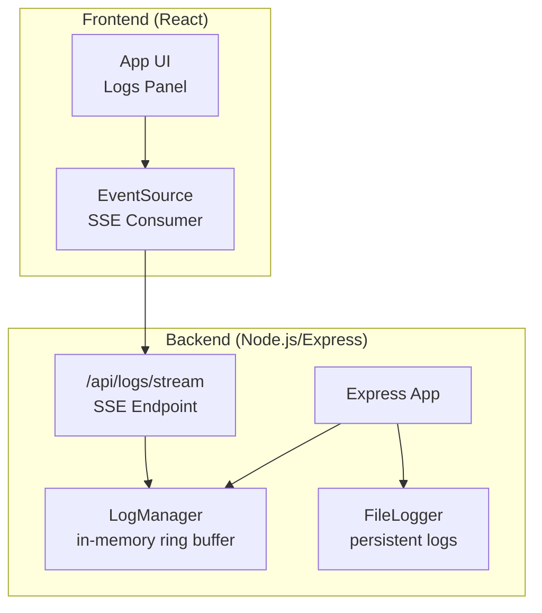
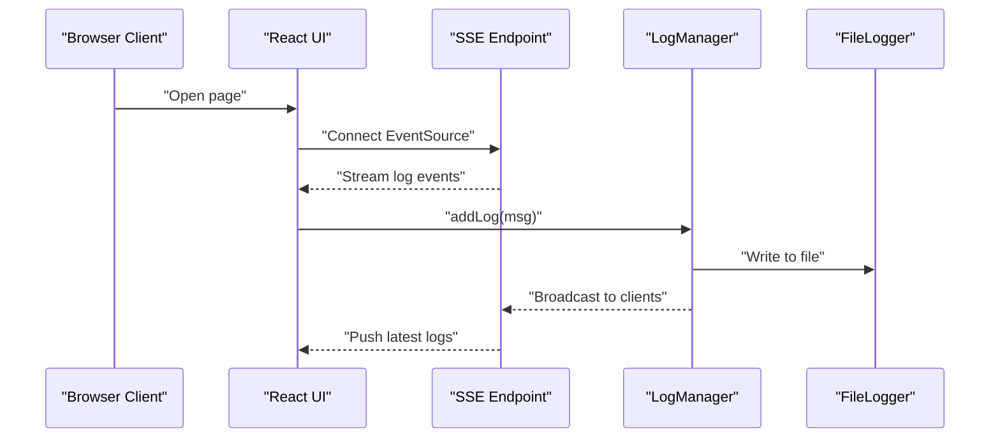
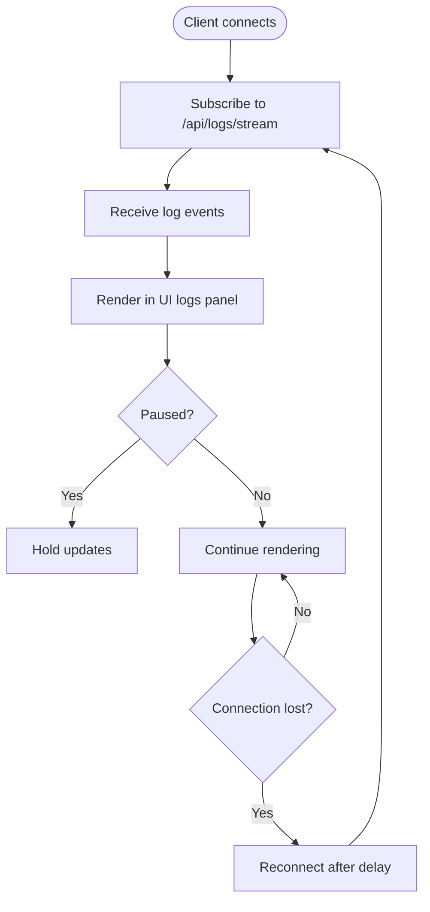
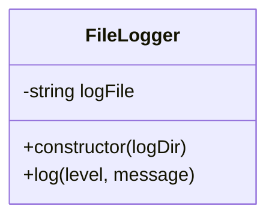
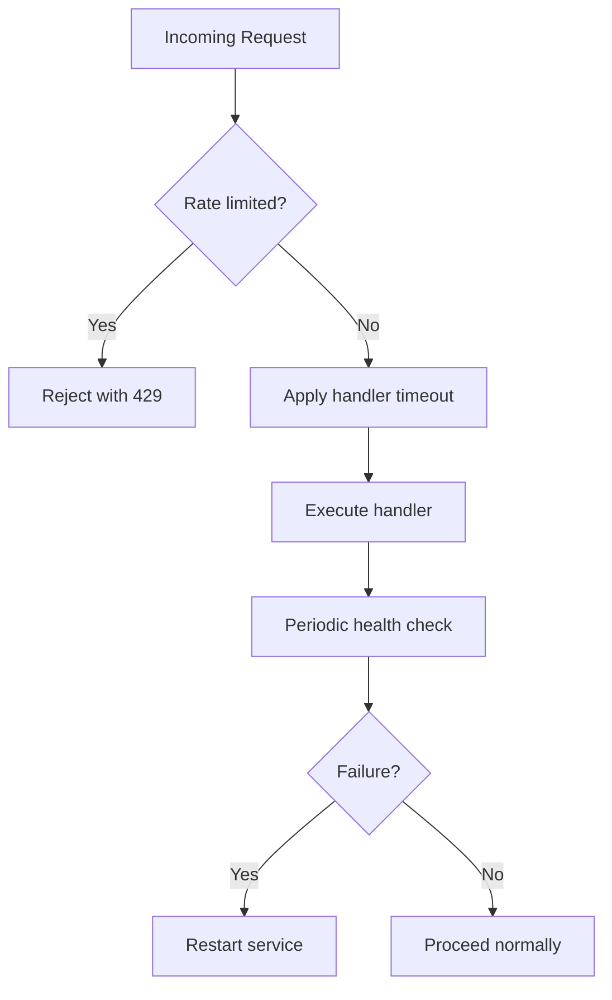
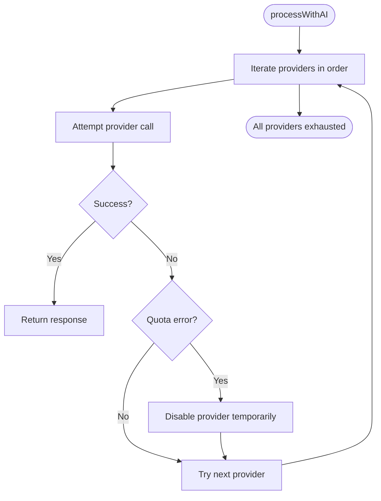
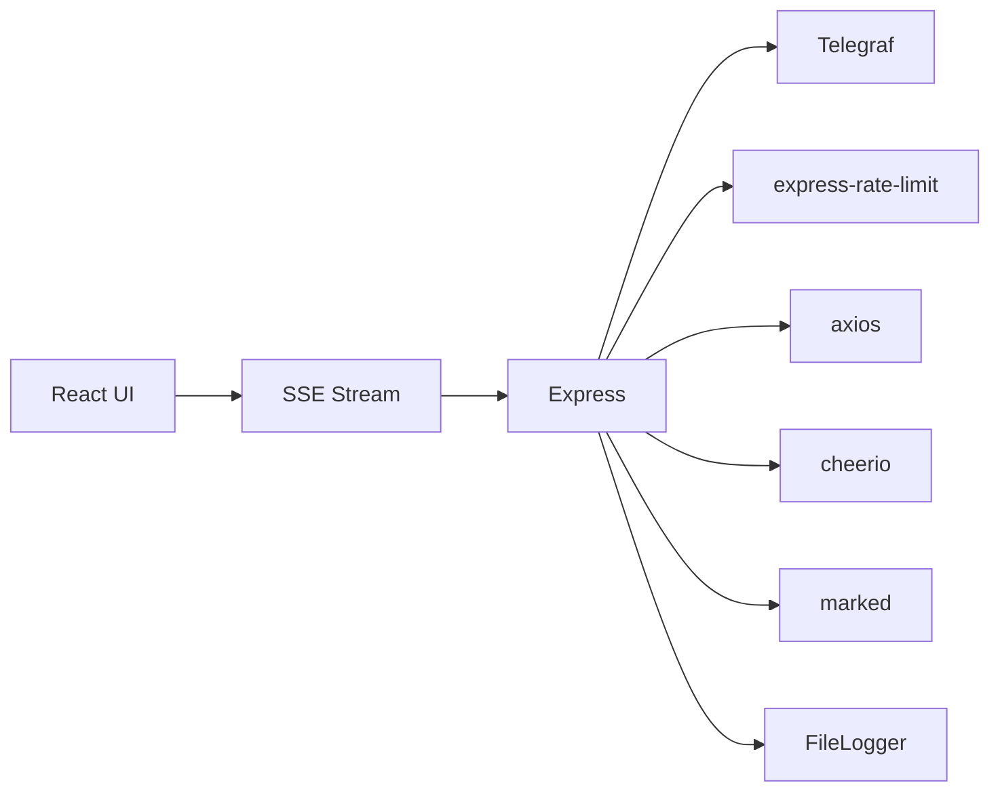

# Performance Monitoring and Profiling

<cite>
**Referenced Files in This Document**
- [server.ts](file://server.ts)
- [src/serverUtils.ts](file://src/serverUtils.ts)
- [src/App.tsx](file://src/App.tsx)
- [vite.config.ts](file://vite.config.ts)
- [package.json](file://package.json)
- [tsconfig.json](file://tsconfig.json)
- [tsconfig.server.json](file://tsconfig.server.json)
- [README.md](file://README.md)
- [app/applet/test-fetch.js](file://app/applet/test-fetch.js)
- [app/applet/test2.js](file://app/applet/test2.js)
</cite>

## Table of Contents
1. [Introduction](#introduction)
2. [Project Structure](#project-structure)
3. [Core Components](#core-components)
4. [Architecture Overview](#architecture-overview)
5. [Detailed Component Analysis](#detailed-component-analysis)
6. [Dependency Analysis](#dependency-analysis)
7. [Performance Considerations](#performance-considerations)
8. [Troubleshooting Guide](#troubleshooting-guide)
9. [Conclusion](#conclusion)
10. [Appendices](#appendices)

## Introduction
This document explains how performance monitoring and profiling are implemented and can be extended in the project. It covers built-in logging systems, real-time metrics collection, and performance analytics. It also outlines profiling tools for Node.js applications, memory usage tracking, and CPU performance analysis. Guidance is included for setting up monitoring dashboards, alerting mechanisms, establishing performance baselines, and using profiling data to troubleshoot bottlenecks and improve performance continuously.

## Project Structure
The project is a hybrid application with a React frontend and a Node.js/Express backend. The backend exposes real-time logging via Server-Sent Events (SSE) and integrates AI services and Telegram bot orchestration. The frontend consumes the SSE stream to visualize live logs and provides controls to pause, clear, and toggle the logs panel.

**Diagram sources**
- [server.ts:342-352](file://server.ts#L342-L352)
- [server.ts:219-277](file://server.ts#L219-L277)
- [src/serverUtils.ts:7-22](file://src/serverUtils.ts#L7-L22)
- [src/App.tsx:651-675](file://src/App.tsx#L651-L675)

**Section sources**
- [server.ts:1-120](file://server.ts#L1-L120)
- [src/App.tsx:168-1736](file://src/App.tsx#L168-L1736)
- [vite.config.ts:1-28](file://vite.config.ts#L1-L28)
- [package.json:1-70](file://package.json#L1-L70)

## Core Components
- Real-time logging via SSE: The backend maintains an in-memory ring buffer of recent logs and streams them to connected clients using SSE. Clients (web) consume the stream and render logs in the UI.
- Persistent file logging: A dedicated file logger writes structured entries to disk for post-mortem analysis.
- Rate limiting and timeouts: Built-in protections against overload and long-running operations.
- Environment validation and graceful error handling: Ensures minimal downtime and clear diagnostics.

Key implementation references:
- SSE endpoint and streaming: [server.ts:342-352](file://server.ts#L342-L352)
- In-memory log manager: [server.ts:219-277](file://server.ts#L219-L277)
- File logger: [src/serverUtils.ts:7-22](file://src/serverUtils.ts#L7-L22)
- Frontend SSE consumption: [src/App.tsx:651-675](file://src/App.tsx#L651-L675)

**Section sources**
- [server.ts:219-280](file://server.ts#L219-L280)
- [src/serverUtils.ts:1-23](file://src/serverUtils.ts#L1-L23)
- [src/App.tsx:651-675](file://src/App.tsx#L651-L675)

## Architecture Overview
The runtime performance architecture centers on:
- Logging pipeline: Application emits logs to both the in-memory ring buffer and persistent file.
- Real-time observability: Clients subscribe to SSE for live updates.
- Operational safeguards: Rate limits, timeouts, and health checks protect availability.

**Diagram sources**
- [server.ts:342-352](file://server.ts#L342-L352)
- [server.ts:219-277](file://server.ts#L219-L277)
- [src/serverUtils.ts:7-22](file://src/serverUtils.ts#L7-L22)
- [src/App.tsx:651-675](file://src/App.tsx#L651-L675)

## Detailed Component Analysis

### Real-Time Logging and SSE
- SSE endpoint: Exposes a long-lived connection that pushes log lines to subscribed clients.
- LogManager: Maintains a fixed-size ring buffer and broadcasts to all connected clients. Dead connections are pruned automatically.
- Frontend integration: Uses EventSource to receive and render logs, with pause/clear/toggle controls.

**Diagram sources**
- [server.ts:342-352](file://server.ts#L342-L352)
- [server.ts:219-277](file://server.ts#L219-L277)
- [src/App.tsx:651-675](file://src/App.tsx#L651-L675)

**Section sources**
- [server.ts:342-352](file://server.ts#L342-L352)
- [server.ts:219-277](file://server.ts#L219-L277)
- [src/App.tsx:651-675](file://src/App.tsx#L651-L675)

### Persistent File Logging
- FileLogger writes timestamped, leveled entries to a rotating log file for offline analysis.
- Integrates with application logging to capture errors, warnings, and informational events.

**Diagram sources**
- [src/serverUtils.ts:7-22](file://src/serverUtils.ts#L7-L22)

**Section sources**
- [src/serverUtils.ts:1-23](file://src/serverUtils.ts#L1-L23)

### Rate Limiting and Timeouts
- Express rate limiters protect API endpoints and AI mutation routes from abuse.
- Handler timeouts and health checks mitigate long-running operations and detect outages.

**Diagram sources**
- [server.ts:52-72](file://server.ts#L52-L72)
- [server.ts:377-409](file://server.ts#L377-L409)

**Section sources**
- [server.ts:52-72](file://server.ts#L52-L72)
- [server.ts:377-409](file://server.ts#L377-L409)

### AI Processing and Bottleneck Indicators
- Multi-provider AI fallback logic with retries and quota-aware handling.
- Logging of provider selection, attempts, and failures aids in identifying slow or failing providers.

**Diagram sources**
- [server.ts:412-645](file://server.ts#L412-L645)

**Section sources**
- [server.ts:412-645](file://server.ts#L412-L645)

## Dependency Analysis
- Runtime dependencies include Express, Telegraf, Axios, Cheerio, Marked, and rate limiting middleware.
- Build-time dependencies include Vite, TailwindCSS, and TypeScript tooling.
- Logging stack: in-memory ring buffer (LogManager) and file-based persistence (FileLogger).

**Diagram sources**
- [package.json:19-56](file://package.json#L19-L56)
- [server.ts:1-17](file://server.ts#L1-L17)
- [src/serverUtils.ts:1-23](file://src/serverUtils.ts#L1-L23)

**Section sources**
- [package.json:1-70](file://package.json#L1-L70)
- [server.ts:1-17](file://server.ts#L1-L17)
- [src/serverUtils.ts:1-23](file://src/serverUtils.ts#L1-L23)

## Performance Considerations
- SSE scalability: The current SSE implementation uses a simple in-memory ring buffer and broadcasts to connected clients. For high concurrency, consider:
  - Back-pressure handling and client-side reconnection policies.
  - Offload logs to a message bus or database for persistence and horizontal scaling.
- File logging overhead: Ensure log rotation and asynchronous writes to avoid blocking the event loop.
- AI provider latency: Monitor per-provider response times and adjust fallback ordering based on observed latency.
- Memory footprint: Monitor heap snapshots and reduce unnecessary allocations in hot paths (e.g., HTML sanitization and Markdown processing).
- CPU profiling: Use Node.js built-in profilers to identify hot functions and optimize loops or heavy computations.

[No sources needed since this section provides general guidance]

## Troubleshooting Guide
Common scenarios and steps:
- Logs not appearing in the UI:
  - Verify SSE endpoint connectivity and network conditions.
  - Check browser console for EventSource errors.
  - Confirm the backend is emitting logs and broadcasting to clients.
- Frequent quota errors from AI providers:
  - Inspect logs for quota indicators and retry hints.
  - Adjust provider fallback order and implement exponential backoff.
- Bot health issues:
  - Review periodic healthcheck logs and restart triggers.
  - Investigate transient network errors and stabilize connectivity.
- Backend slowdowns:
  - Use Node.js profiler to capture CPU profiles and identify hotspots.
  - Monitor memory usage and garbage collection pauses.

**Section sources**
- [server.ts:342-352](file://server.ts#L342-L352)
- [server.ts:219-277](file://server.ts#L219-L277)
- [src/App.tsx:651-675](file://src/App.tsx#L651-L675)
- [server.ts:412-645](file://server.ts#L412-L645)
- [server.ts:377-409](file://server.ts#L377-L409)

## Conclusion
The project provides a solid foundation for performance monitoring through real-time SSE logs and persistent file logging. By integrating rate limiting, health checks, and structured AI provider fallbacks, it achieves operational resilience. To advance to production-grade observability, augment the SSE pipeline with scalable persistence, implement alerting on critical log patterns, and adopt continuous profiling and baselining to drive iterative improvements.

[No sources needed since this section summarizes without analyzing specific files]

## Appendices

### Setup and Usage References
- Running locally and environment prerequisites: [README.md:11-25](file://README.md#L11-L25)
- Build and dev scripts: [package.json:6-18](file://package.json#L6-L18)
- TypeScript configuration for server build: [tsconfig.server.json:1-15](file://tsconfig.server.json#L1-L15)
- Frontend build and environment injection: [vite.config.ts:6-27](file://vite.config.ts#L6-L27)

**Section sources**
- [README.md:1-25](file://README.md#L1-L25)
- [package.json:6-18](file://package.json#L6-L18)
- [tsconfig.server.json:1-15](file://tsconfig.server.json#L1-L15)
- [vite.config.ts:6-27](file://vite.config.ts#L6-L27)

### External Connectivity Tests
- Example HTTPS GET to the backend status endpoint for connectivity verification: [app/applet/test-fetch.js:1-8](file://app/applet/test-fetch.js#L1-L8), [app/applet/test2.js:1-8](file://app/applet/test2.js#L1-L8)

**Section sources**
- [app/applet/test-fetch.js:1-8](file://app/applet/test-fetch.js#L1-L8)
- [app/applet/test2.js:1-8](file://app/applet/test2.js#L1-L8)