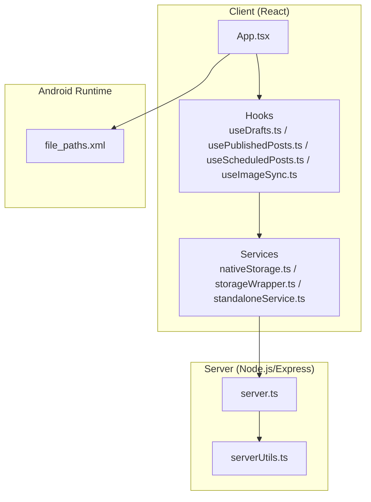
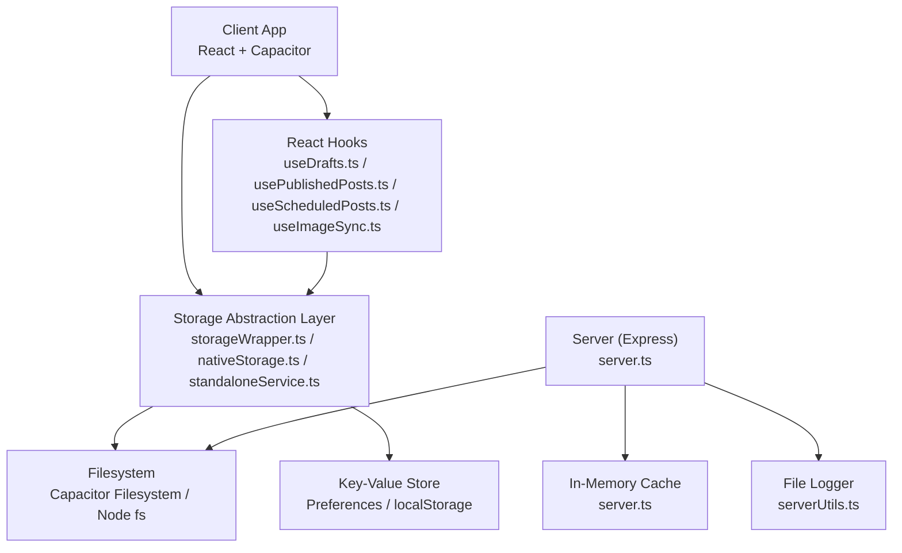
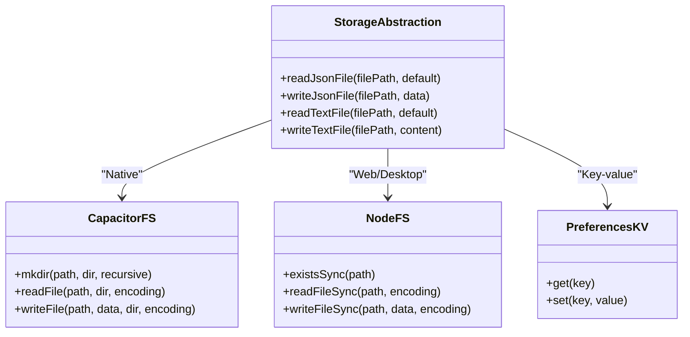
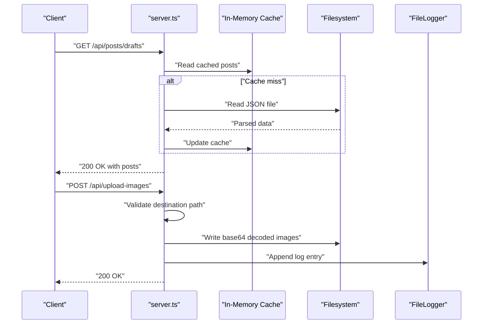
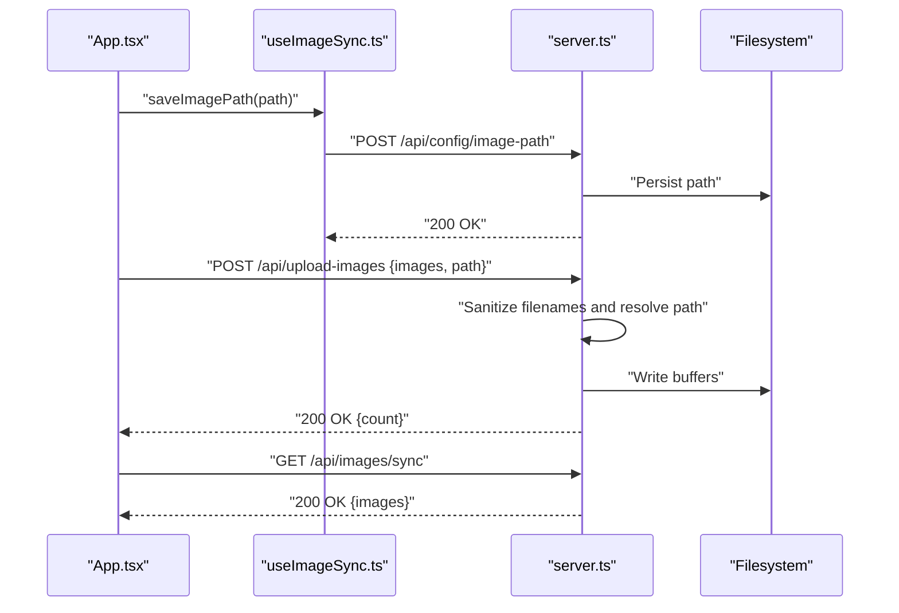
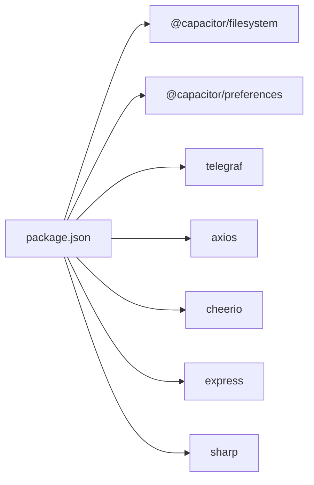

# Storage and I/O Performance

<cite>
**Referenced Files in This Document**
- [nativeStorage.ts](file://src/services/nativeStorage.ts)
- [storageWrapper.ts](file://src/services/storageWrapper.ts)
- [standaloneService.ts](file://src/services/standaloneService.ts)
- [server.ts](file://server.ts)
- [serverUtils.ts](file://src/serverUtils.ts)
- [useDrafts.ts](file://src/hooks/useDrafts.ts)
- [usePublishedPosts.ts](file://src/hooks/usePublishedPosts.ts)
- [useScheduledPosts.ts](file://src/hooks/useScheduledPosts.ts)
- [useImageSync.ts](file://src/hooks/useImageSync.ts)
- [App.tsx](file://src/App.tsx)
- [file_paths.xml](file://android/app/src/main/res/xml/file_paths.xml)
- [package.json](file://package.json)
</cite>

## Table of Contents
1. [Introduction](#introduction)
2. [Project Structure](#project-structure)
3. [Core Components](#core-components)
4. [Architecture Overview](#architecture-overview)
5. [Detailed Component Analysis](#detailed-component-analysis)
6. [Dependency Analysis](#dependency-analysis)
7. [Performance Considerations](#performance-considerations)
8. [Troubleshooting Guide](#troubleshooting-guide)
9. [Conclusion](#conclusion)
10. [Appendices](#appendices)

## Introduction
This document focuses on diagnosing and resolving storage and I/O performance issues across the application’s hybrid architecture. It covers slow file operations, database access patterns, cache performance, disk I/O optimization, file system access strategies, storage abstraction layer efficiency, large file handling, streaming operations, data serialization performance, monitoring techniques, profiling tools, and practical optimization strategies for read/write operations and overall storage responsiveness.

## Project Structure
The project comprises:
- A React client with Capacitor integration for mobile/desktop builds
- A Node.js/Express server for backend APIs and persistent storage
- Shared storage abstractions for cross-platform compatibility
- Hooks and services that orchestrate reads/writes and cache usage

**Diagram sources**
- [App.tsx](file://src/App.tsx)
- [useDrafts.ts](file://src/hooks/useDrafts.ts)
- [usePublishedPosts.ts](file://src/hooks/usePublishedPosts.ts)
- [useScheduledPosts.ts](file://src/hooks/useScheduledPosts.ts)
- [useImageSync.ts](file://src/hooks/useImageSync.ts)
- [nativeStorage.ts](file://src/services/nativeStorage.ts)
- [storageWrapper.ts](file://src/services/storageWrapper.ts)
- [standaloneService.ts](file://src/services/standaloneService.ts)
- [server.ts](file://server.ts)
- [serverUtils.ts](file://src/serverUtils.ts)
- [file_paths.xml](file://android/app/src/main/res/xml/file_paths.xml)

**Section sources**
- [package.json](file://package.json)

## Core Components
- Cross-platform storage abstractions:
  - Native filesystem via Capacitor Filesystem and Preferences
  - Local storage fallback for web/desktop environments
- Server-side file I/O and caching:
  - JSON/text file persistence
  - In-memory caches for frequently accessed data
- Image synchronization and upload pipeline:
  - Base64 decoding and file writes
  - Path validation and permission checks

Key responsibilities:
- Ensuring consistent read/write semantics across platforms
- Minimizing synchronous I/O and avoiding blocking operations
- Managing cache lifecycles and invalidation
- Validating paths and preventing unsafe writes

**Section sources**
- [nativeStorage.ts](file://src/services/nativeStorage.ts)
- [storageWrapper.ts](file://src/services/storageWrapper.ts)
- [standaloneService.ts](file://src/services/standaloneService.ts)
- [server.ts](file://server.ts)

## Architecture Overview
The storage architecture separates concerns between client-side and server-side I/O, with a shared abstraction layer to unify platform differences.

**Diagram sources**
- [storageWrapper.ts](file://src/services/storageWrapper.ts)
- [nativeStorage.ts](file://src/services/nativeStorage.ts)
- [standaloneService.ts](file://src/services/standaloneService.ts)
- [server.ts](file://server.ts)
- [serverUtils.ts](file://src/serverUtils.ts)
- [useDrafts.ts](file://src/hooks/useDrafts.ts)
- [usePublishedPosts.ts](file://src/hooks/usePublishedPosts.ts)
- [useScheduledPosts.ts](file://src/hooks/useScheduledPosts.ts)
- [useImageSync.ts](file://src/hooks/useImageSync.ts)

## Detailed Component Analysis

### Storage Abstraction Layer
The abstraction layer provides unified JSON/text read/write operations and ensures directories exist before writes. It switches behavior based on the platform.

**Diagram sources**
- [storageWrapper.ts](file://src/services/storageWrapper.ts)
- [nativeStorage.ts](file://src/services/nativeStorage.ts)
- [standaloneService.ts](file://src/services/standaloneService.ts)

**Section sources**
- [storageWrapper.ts](file://src/services/storageWrapper.ts)
- [nativeStorage.ts](file://src/services/nativeStorage.ts)
- [standaloneService.ts](file://src/services/standaloneService.ts)

### Server-Side File I/O and Caching
The server maintains in-memory caches for frequently accessed data and persists changes to JSON/text files. It uses a file logger for diagnostics.

**Diagram sources**
- [server.ts](file://server.ts)
- [serverUtils.ts](file://src/serverUtils.ts)

**Section sources**
- [server.ts](file://server.ts)
- [serverUtils.ts](file://src/serverUtils.ts)

### Image Upload and Sync Pipeline
The client uploads base64-encoded images to the server, which decodes and writes them to disk. The client can also scan local storage for images and synchronize paths.

**Diagram sources**
- [App.tsx](file://src/App.tsx)
- [useImageSync.ts](file://src/hooks/useImageSync.ts)
- [server.ts](file://server.ts)

**Section sources**
- [App.tsx](file://src/App.tsx)
- [useImageSync.ts](file://src/hooks/useImageSync.ts)
- [server.ts](file://server.ts)

### Large File Handling and Streaming
- Current implementation writes base64-decoded buffers directly to disk. For very large images or frequent uploads, consider:
  - Streaming writes to reduce memory pressure
  - Chunked processing and temporary staging areas
  - Compression or resizing before write
- On the server, ensure destination directories exist and sanitize paths to avoid traversal attacks.

**Section sources**
- [server.ts](file://server.ts)

### Data Serialization Performance
- JSON serialization uses pretty-print formatting, which increases file sizes and write time. Consider:
  - Minified JSON for less verbose persistence
  - Binary formats (MessagePack) for higher throughput
  - Lazy parsing and incremental updates to reduce CPU overhead

**Section sources**
- [storageWrapper.ts](file://src/services/storageWrapper.ts)
- [standaloneService.ts](file://src/services/standaloneService.ts)
- [server.ts](file://server.ts)

### Cache Performance Problems
- In-memory caches are initialized once and updated on writes. Monitor:
  - Cache invalidation timing and consistency
  - Cache warming strategies for cold starts
  - Memory footprint of large datasets

**Section sources**
- [server.ts](file://server.ts)

## Dependency Analysis
- Client-side dependencies:
  - Capacitor plugins for filesystem and preferences
  - Cheerio and Axios for scraping and HTTP
- Server-side dependencies:
  - Express, Telegraf, rate limiting, Cheerio, Marked, Google Generative AI
  - Sharp for image processing (optional)

**Diagram sources**
- [package.json](file://package.json)

**Section sources**
- [package.json](file://package.json)

## Performance Considerations
- Prefer asynchronous I/O and avoid synchronous file operations
- Batch writes and coalesce frequent updates to minimize disk thrash
- Use compression or binary serialization for large payloads
- Implement streaming for large files to reduce memory usage
- Cache frequently accessed data in memory with controlled TTLs
- Validate and sanitize all paths to prevent expensive error handling retries
- Use platform-specific optimizations (e.g., Capacitor Filesystem vs Node fs)
- Profile network and disk I/O separately to isolate bottlenecks

## Troubleshooting Guide

### Slow File Operations
Symptoms:
- Long delays when saving/loading drafts or posts
- UI freezes during bulk operations

Checklist:
- Verify platform detection logic and ensure Capacitor APIs are used on native
- Confirm directories exist before writes
- Avoid synchronous Node fs operations in hot paths
- Reduce JSON pretty-printing for large files

**Section sources**
- [storageWrapper.ts](file://src/services/storageWrapper.ts)
- [nativeStorage.ts](file://src/services/nativeStorage.ts)
- [standaloneService.ts](file://src/services/standaloneService.ts)
- [server.ts](file://server.ts)

### Database Access Patterns
Observations:
- No explicit SQL database is used; persistence relies on JSON/text files and key-value stores
- In-memory caches are used to reduce repeated reads

Recommendations:
- If moving to a database, ensure proper indexing and connection pooling
- Use transactions for multi-write operations
- Implement read replicas for heavy read loads

**Section sources**
- [server.ts](file://server.ts)

### Cache Performance Problems
Symptoms:
- Stale data after updates
- Memory growth over time

Actions:
- Ensure cache updates occur atomically with writes
- Implement periodic cache flush or TTL-based eviction
- Monitor cache hit ratio and adjust preload strategies

**Section sources**
- [server.ts](file://server.ts)

### Disk I/O Optimization
- Minimize small writes; batch and throttle
- Use buffered writes and avoid frequent fsync calls
- Prefer local SSDs and ensure adequate free space
- Avoid writing to system-protected directories

**Section sources**
- [server.ts](file://server.ts)
- [file_paths.xml](file://android/app/src/main/res/xml/file_paths.xml)

### File System Access Strategies
- Validate and sanitize all destination paths
- Use relative paths and resolve safely
- Respect platform-specific permissions and storage scopes

**Section sources**
- [server.ts](file://server.ts)
- [file_paths.xml](file://android/app/src/main/res/xml/file_paths.xml)

### Storage Abstraction Layer Efficiency
- Centralize platform checks and error handling
- Reuse directory creation logic to avoid redundant mkdir calls
- Normalize file paths and filenames across platforms

**Section sources**
- [storageWrapper.ts](file://src/services/storageWrapper.ts)
- [nativeStorage.ts](file://src/services/nativeStorage.ts)
- [standaloneService.ts](file://src/services/standaloneService.ts)

### Large File Handling and Streaming
- Decode base64 incrementally when possible
- Stream writes to disk to reduce peak memory
- Consider resizing or compressing images before persisting

**Section sources**
- [server.ts](file://server.ts)
- [App.tsx](file://src/App.tsx)

### Data Serialization Performance
- Switch to minified JSON or binary formats for large datasets
- Parse lazily and avoid unnecessary stringify operations

**Section sources**
- [storageWrapper.ts](file://src/services/storageWrapper.ts)
- [standaloneService.ts](file://src/services/standaloneService.ts)
- [server.ts](file://server.ts)

### Storage Monitoring Techniques
- Use the built-in file logger to track I/O events and errors
- Instrument hook and service calls to measure latency
- Monitor filesystem usage and free space

**Section sources**
- [serverUtils.ts](file://src/serverUtils.ts)
- [server.ts](file://server.ts)

### I/O Profiling Tools
- Node.js: Use profiler and heap snapshots for memory/disk hotspots
- Android: Use ADB and system profilers to inspect file I/O
- Web: Use browser devtools performance panel for client-side I/O

[No sources needed since this section provides general guidance]

### Optimization Strategies
- Reduce write frequency with debouncing and batching
- Use efficient serialization formats
- Implement streaming and chunked processing
- Cache aggressively with TTL and invalidation policies
- Validate inputs early to fail fast

[No sources needed since this section provides general guidance]

## Conclusion
By centralizing storage logic, validating paths, leveraging caches, and adopting streaming and efficient serialization, the application can achieve significant improvements in storage and I/O performance. Use the provided monitoring and profiling techniques to pinpoint bottlenecks and apply targeted optimizations.

## Appendices

### Quick Reference: Key Files and Responsibilities
- [nativeStorage.ts](file://src/services/nativeStorage.ts): Token and preference storage, JSON/text helpers
- [storageWrapper.ts](file://src/services/storageWrapper.ts): Unified read/write for JSON/text
- [standaloneService.ts](file://src/services/standaloneService.ts): Standalone storage and settings
- [server.ts](file://server.ts): Server-side persistence, caching, logging, image upload
- [serverUtils.ts](file://src/serverUtils.ts): File logger utility
- [useDrafts.ts](file://src/hooks/useDrafts.ts): Drafts CRUD with storage
- [usePublishedPosts.ts](file://src/hooks/usePublishedPosts.ts): Published posts retrieval
- [useScheduledPosts.ts](file://src/hooks/useScheduledPosts.ts): Scheduled posts retrieval
- [useImageSync.ts](file://src/hooks/useImageSync.ts): Image path management and sync
- [App.tsx](file://src/App.tsx): Image upload and sync orchestration
- [file_paths.xml](file://android/app/src/main/res/xml/file_paths.xml): Android storage access configuration

**Section sources**
- [nativeStorage.ts](file://src/services/nativeStorage.ts)
- [storageWrapper.ts](file://src/services/storageWrapper.ts)
- [standaloneService.ts](file://src/services/standaloneService.ts)
- [server.ts](file://server.ts)
- [serverUtils.ts](file://src/serverUtils.ts)
- [useDrafts.ts](file://src/hooks/useDrafts.ts)
- [usePublishedPosts.ts](file://src/hooks/usePublishedPosts.ts)
- [useScheduledPosts.ts](file://src/hooks/useScheduledPosts.ts)
- [useImageSync.ts](file://src/hooks/useImageSync.ts)
- [App.tsx](file://src/App.tsx)
- [file_paths.xml](file://android/app/src/main/res/xml/file_paths.xml)