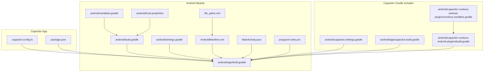
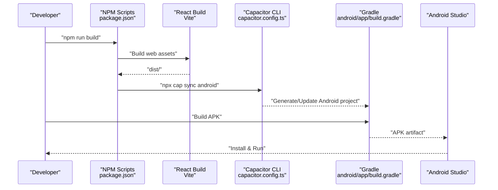
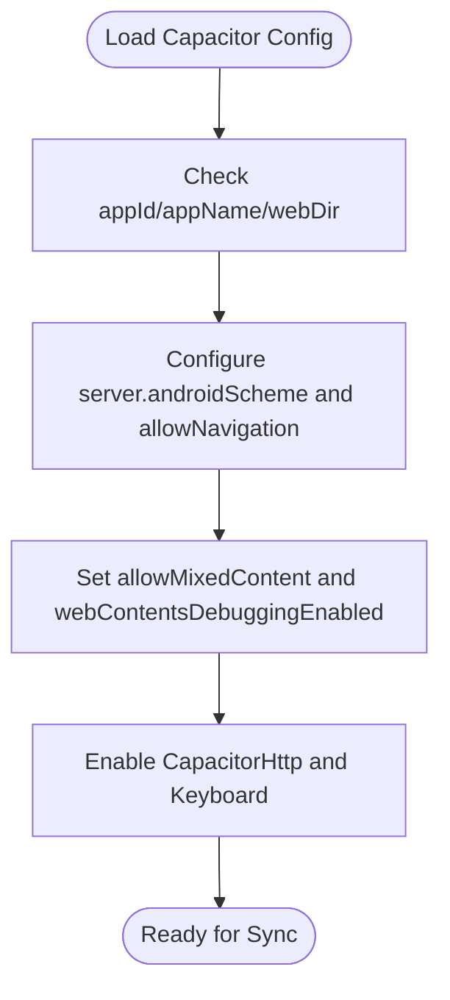
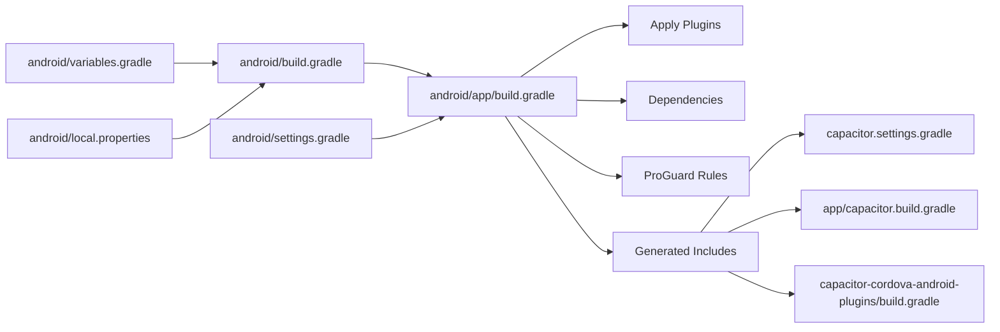
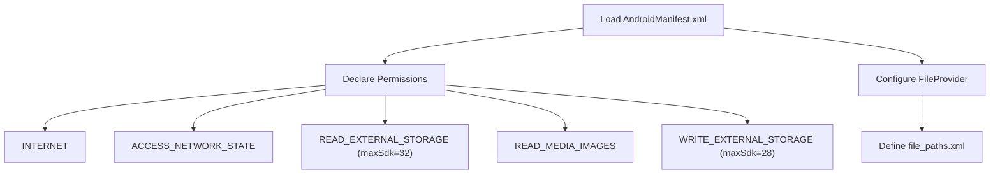
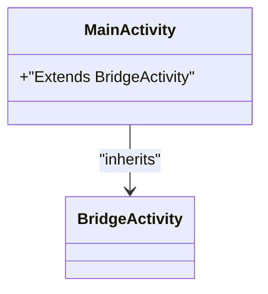
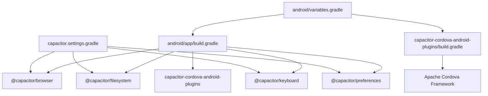

# Mobile Deployment Errors

<cite>
**Referenced Files in This Document**
- [capacitor.config.ts](file://capacitor.config.ts)
- [package.json](file://package.json)
- [android/build.gradle](file://android/build.gradle)
- [android/settings.gradle](file://android/settings.gradle)
- [android/variables.gradle](file://android/variables.gradle)
- [android/local.properties](file://android/local.properties)
- [android/app/build.gradle](file://android/app/build.gradle)
- [android/app/proguard-rules.pro](file://android/app/proguard-rules.pro)
- [android/app/src/main/AndroidManifest.xml](file://android/app/src/main/AndroidManifest.xml)
- [android/app/src/main/java/com/newsbot/manager/MainActivity.java](file://android/app/src/main/java/com/newsbot/manager/MainActivity.java)
- [android/app/src/main/res/xml/file_paths.xml](file://android/app/src/main/res/xml/file_paths.xml)
- [android/capacitor.settings.gradle](file://android/capacitor.settings.gradle)
- [android/capacitor-cordova-android-plugins/build.gradle](file://android/capacitor-cordova-android-plugins/build.gradle)
- [android/capacitor-cordova-android-plugins/cordova.variables.gradle](file://android/capacitor-cordova-android-plugins/cordova.variables.gradle)
- [android/app/capacitor.build.gradle](file://android/app/capacitor.build.gradle)
- [.codex/environments/environment.toml](file://.codex/environments/environment.toml)
</cite>

## Table of Contents
1. [Introduction](#introduction)
2. [Project Structure](#project-structure)
3. [Core Components](#core-components)
4. [Architecture Overview](#architecture-overview)
5. [Detailed Component Analysis](#detailed-component-analysis)
6. [Dependency Analysis](#dependency-analysis)
7. [Performance Considerations](#performance-considerations)
8. [Troubleshooting Guide](#troubleshooting-guide)
9. [Conclusion](#conclusion)
10. [Appendices](#appendices)

## Introduction
This document provides a comprehensive troubleshooting guide for mobile deployment and runtime errors in a Capacitor-based React application targeting Android. It focuses on build-time issues (missing dependencies, configuration errors, Gradle and Android SDK problems), Android permission-related failures (storage access and runtime permissions), and runtime crashes (memory, native plugin integration, and JavaScript-to-native bridge issues). It also covers debugging techniques using Android Studio and logcat, device-specific troubleshooting, and resolution steps for common deployment scenarios such as signing, ProGuard configuration, and native plugin compatibility.

## Project Structure
The project follows a standard Capacitor setup with a React client and an Android app module. Key build and configuration files reside under the android directory, while Capacitor configuration is centralized in the root configuration file. Scripts for building and syncing Capacitor are defined in the package manifest.

**Diagram sources**
- [capacitor.config.ts](file://capacitor.config.ts)
- [package.json](file://package.json)
- [android/app/build.gradle](file://android/app/build.gradle)
- [android/build.gradle](file://android/build.gradle)
- [android/settings.gradle](file://android/settings.gradle)
- [android/variables.gradle](file://android/variables.gradle)
- [android/local.properties](file://android/local.properties)
- [android/app/src/main/AndroidManifest.xml](file://android/app/src/main/AndroidManifest.xml)
- [android/app/src/main/java/com/newsbot/manager/MainActivity.java](file://android/app/src/main/java/com/newsbot/manager/MainActivity.java)
- [android/app/src/main/res/xml/file_paths.xml](file://android/app/src/main/res/xml/file_paths.xml)
- [android/app/proguard-rules.pro](file://android/app/proguard-rules.pro)
- [android/capacitor.settings.gradle](file://android/capacitor.settings.gradle)
- [android/app/capacitor.build.gradle](file://android/app/capacitor.build.gradle)
- [android/capacitor-cordova-android-plugins/build.gradle](file://android/capacitor-cordova-android-plugins/build.gradle)
- [android/capacitor-cordova-android-plugins/cordova.variables.gradle](file://android/capacitor-cordova-android-plugins/cordova.variables.gradle)

**Section sources**
- [capacitor.config.ts](file://capacitor.config.ts)
- [package.json](file://package.json)
- [android/app/build.gradle](file://android/app/build.gradle)
- [android/build.gradle](file://android/build.gradle)
- [android/settings.gradle](file://android/settings.gradle)
- [android/variables.gradle](file://android/variables.gradle)
- [android/local.properties](file://android/local.properties)
- [android/app/src/main/AndroidManifest.xml](file://android/app/src/main/AndroidManifest.xml)
- [android/app/src/main/java/com/newsbot/manager/MainActivity.java](file://android/app/src/main/java/com/newsbot/manager/MainActivity.java)
- [android/app/src/main/res/xml/file_paths.xml](file://android/app/src/main/res/xml/file_paths.xml)
- [android/app/proguard-rules.pro](file://android/app/proguard-rules.pro)
- [android/capacitor.settings.gradle](file://android/capacitor.settings.gradle)
- [android/app/capacitor.build.gradle](file://android/app/capacitor.build.gradle)
- [android/capacitor-cordova-android-plugins/build.gradle](file://android/capacitor-cordova-android-plugins/build.gradle)
- [android/capacitor-cordova-android-plugins/cordova.variables.gradle](file://android/capacitor-cordova-android-plugins/cordova.variables.gradle)

## Core Components
- Capacitor configuration defines app identifiers, web asset directory, server scheme, navigation allowances, Android-specific flags, and enabled plugins.
- Android Gradle configuration controls SDK versions, minification/proguard rules, and plugin inclusion via generated settings and build files.
- Manifest declares permissions and FileProvider configuration for sharing files.
- MainActivity extends the Capacitor bridge activity.
- Cordova plugin support is integrated via generated Gradle includes and variables.

Key configuration references:
- Capacitor config: [capacitor.config.ts](file://capacitor.config.ts)
- Android Gradle root: [android/build.gradle](file://android/build.gradle)
- Android app Gradle: [android/app/build.gradle](file://android/app/build.gradle)
- Android variables: [android/variables.gradle](file://android/variables.gradle)
- Android manifest: [android/app/src/main/AndroidManifest.xml](file://android/app/src/main/AndroidManifest.xml)
- MainActivity: [android/app/src/main/java/com/newsbot/manager/MainActivity.java](file://android/app/src/main/java/com/newsbot/manager/MainActivity.java)
- Capacitor settings: [android/capacitor.settings.gradle](file://android/capacitor.settings.gradle)
- Capacitor app Gradle include: [android/app/capacitor.build.gradle](file://android/app/capacitor.build.gradle)
- Cordova plugins Gradle: [android/capacitor-cordova-android-plugins/build.gradle](file://android/capacitor-cordova-android-plugins/build.gradle)
- Cordova variables: [android/capacitor-cordova-android-plugins/cordova.variables.gradle](file://android/capacitor-cordova-android-plugins/cordova.variables.gradle)

**Section sources**
- [capacitor.config.ts](file://capacitor.config.ts)
- [android/app/build.gradle](file://android/app/build.gradle)
- [android/build.gradle](file://android/build.gradle)
- [android/variables.gradle](file://android/variables.gradle)
- [android/app/src/main/AndroidManifest.xml](file://android/app/src/main/AndroidManifest.xml)
- [android/app/src/main/java/com/newsbot/manager/MainActivity.java](file://android/app/src/main/java/com/newsbot/manager/MainActivity.java)
- [android/capacitor.settings.gradle](file://android/capacitor.settings.gradle)
- [android/app/capacitor.build.gradle](file://android/app/capacitor.build.gradle)
- [android/capacitor-cordova-android-plugins/build.gradle](file://android/capacitor-cordova-android-plugins/build.gradle)
- [android/capacitor-cordova-android-plugins/cordova.variables.gradle](file://android/capacitor-cordova-android-plugins/cordova.variables.gradle)

## Architecture Overview
The build pipeline integrates the React client with Capacitor and Android Gradle. The React build produces web assets placed under the configured webDir. Capacitor sync copies assets and generates Android project artifacts. Gradle compiles the Android app, applies plugin configurations, and packages the APK.

**Diagram sources**
- [package.json](file://package.json)
- [capacitor.config.ts](file://capacitor.config.ts)
- [android/app/build.gradle](file://android/app/build.gradle)

**Section sources**
- [package.json](file://package.json)
- [capacitor.config.ts](file://capacitor.config.ts)
- [android/app/build.gradle](file://android/app/build.gradle)

## Detailed Component Analysis

### Capacitor Configuration and Plugin Setup
- App identifiers and webDir drive asset placement and navigation behavior.
- Android server scheme and navigation allowances influence HTTPS and cross-origin policies.
- Android flags enable mixed content and web debugging.
- Enabled plugins include HTTP and Keyboard, which require proper Cordova/Android integration.

**Diagram sources**
- [capacitor.config.ts](file://capacitor.config.ts)

**Section sources**
- [capacitor.config.ts](file://capacitor.config.ts)

### Android Gradle Build and Dependencies
- Root Gradle sets the Android Gradle plugin and Google Services plugin versions.
- App Gradle defines min/target SDK, packaging rules, repositories, and dependencies.
- ProGuard rules are included for release builds.
- Generated settings and includes wire Capacitor and Cordova plugins.

**Diagram sources**
- [android/build.gradle](file://android/build.gradle)
- [android/app/build.gradle](file://android/app/build.gradle)
- [android/settings.gradle](file://android/settings.gradle)
- [android/variables.gradle](file://android/variables.gradle)
- [android/local.properties](file://android/local.properties)
- [android/capacitor.settings.gradle](file://android/capacitor.settings.gradle)
- [android/app/capacitor.build.gradle](file://android/app/capacitor.build.gradle)
- [android/capacitor-cordova-android-plugins/build.gradle](file://android/capacitor-cordova-android-plugins/build.gradle)

**Section sources**
- [android/build.gradle](file://android/build.gradle)
- [android/app/build.gradle](file://android/app/build.gradle)
- [android/settings.gradle](file://android/settings.gradle)
- [android/variables.gradle](file://android/variables.gradle)
- [android/local.properties](file://android/local.properties)
- [android/capacitor.settings.gradle](file://android/capacitor.settings.gradle)
- [android/app/capacitor.build.gradle](file://android/app/capacitor.build.gradle)
- [android/capacitor-cordova-android-plugins/build.gradle](file://android/capacitor-cordova-android-plugins/build.gradle)

### Android Manifest and Permissions
- Declares core permissions including internet, network state, and storage permissions with maxSdk constraints.
- Configures FileProvider with explicit paths for external and cache directories.

**Diagram sources**
- [android/app/src/main/AndroidManifest.xml](file://android/app/src/main/AndroidManifest.xml)
- [android/app/src/main/res/xml/file_paths.xml](file://android/app/src/main/res/xml/file_paths.xml)

**Section sources**
- [android/app/src/main/AndroidManifest.xml](file://android/app/src/main/AndroidManifest.xml)
- [android/app/src/main/res/xml/file_paths.xml](file://android/app/src/main/res/xml/file_paths.xml)

### MainActivity and Bridge Activity
- MainActivity extends the Capacitor BridgeActivity, enabling the JavaScript-to-Native bridge and plugin integration.

**Diagram sources**
- [android/app/src/main/java/com/newsbot/manager/MainActivity.java](file://android/app/src/main/java/com/newsbot/manager/MainActivity.java)

**Section sources**
- [android/app/src/main/java/com/newsbot/manager/MainActivity.java](file://android/app/src/main/java/com/newsbot/manager/MainActivity.java)

## Dependency Analysis
Capacitor and Cordova plugin dependencies are resolved via generated Gradle includes and variables. The app depends on Capacitor Android modules and Cordova framework libraries. SDK versions are centrally managed in variables.

**Diagram sources**
- [android/app/build.gradle](file://android/app/build.gradle)
- [android/capacitor.settings.gradle](file://android/capacitor.settings.gradle)
- [android/capacitor-cordova-android-plugins/build.gradle](file://android/capacitor-cordova-android-plugins/build.gradle)
- [android/variables.gradle](file://android/variables.gradle)

**Section sources**
- [android/app/build.gradle](file://android/app/build.gradle)
- [android/capacitor.settings.gradle](file://android/capacitor.settings.gradle)
- [android/capacitor-cordova-android-plugins/build.gradle](file://android/capacitor-cordova-android-plugins/build.gradle)
- [android/variables.gradle](file://android/variables.gradle)

## Performance Considerations
- Minification and ProGuard: Release builds currently disable minification and include ProGuard rules. Consider enabling minification and optimizing rules for production builds.
- SDK versions: Target SDK 34 ensures modern APIs but requires updated permissions and behaviors. Keep dependencies aligned with target SDK.
- Web asset size: Large bundles increase cold-start time; optimize assets and code splitting.

[No sources needed since this section provides general guidance]

## Troubleshooting Guide

### Capacitor Build Failures
Common causes and resolutions:
- Missing dependencies or mismatched versions:
  - Verify Gradle plugin and Google Services plugin versions in the root Gradle file.
  - Ensure Android Gradle plugin and JDK compatibility.
  - Align target SDK with Cordova and Capacitor plugin versions.
  - References: [android/build.gradle](file://android/build.gradle), [android/variables.gradle](file://android/variables.gradle)
- Configuration errors in capacitor.config.ts:
  - Incorrect webDir path prevents asset copying.
  - Invalid server configuration can block navigation or cause mixed content errors.
  - References: [capacitor.config.ts](file://capacitor.config.ts)
- Platform-specific compilation issues with Gradle and Android SDK:
  - Confirm SDK path in local properties matches installed SDK.
  - Ensure Java 17 compatibility for compile options in generated Gradle includes.
  - References: [android/local.properties](file://android/local.properties), [android/app/capacitor.build.gradle](file://android/app/capacitor.build.gradle)
- Cordova plugin integration:
  - Missing or misconfigured Cordova variables can break plugin builds.
  - References: [android/capacitor-cordova-android-plugins/cordova.variables.gradle](file://android/capacitor-cordova-android-plugins/cordova.variables.gradle), [android/capacitor-cordova-android-plugins/build.gradle](file://android/capacitor-cordova-android-plugins/build.gradle)

**Section sources**
- [android/build.gradle](file://android/build.gradle)
- [android/variables.gradle](file://android/variables.gradle)
- [capacitor.config.ts](file://capacitor.config.ts)
- [android/local.properties](file://android/local.properties)
- [android/app/capacitor.build.gradle](file://android/app/capacitor.build.gradle)
- [android/capacitor-cordova-android-plugins/cordova.variables.gradle](file://android/capacitor-cordova-android-plugins/cordova.variables.gradle)
- [android/capacitor-cordova-android-plugins/build.gradle](file://android/capacitor-cordova-android-plugins/build.gradle)

### Android Permission Problems
Symptoms: File system access errors, storage permission denials, runtime permission handling failures.
- Storage permissions:
  - READ_EXTERNAL_STORAGE and WRITE_EXTERNAL_STORAGE are declared with maxSdk constraints.
  - On Android 13+, use granular media permissions (e.g., READ_MEDIA_IMAGES).
  - References: [android/app/src/main/AndroidManifest.xml](file://android/app/src/main/AndroidManifest.xml)
- FileProvider configuration:
  - FileProvider authorities must match the app’s applicationId.
  - file_paths.xml defines accessible external/cache paths.
  - References: [android/app/src/main/AndroidManifest.xml](file://android/app/src/main/AndroidManifest.xml), [android/app/src/main/res/xml/file_paths.xml](file://android/app/src/main/res/xml/file_paths.xml)
- Runtime permission handling:
  - Implement runtime permission checks for storage on Android 6+.
  - Ensure Capacitor filesystem plugin usage aligns with declared permissions.
  - References: [capacitor.config.ts](file://capacitor.config.ts)

**Section sources**
- [android/app/src/main/AndroidManifest.xml](file://android/app/src/main/AndroidManifest.xml)
- [android/app/src/main/res/xml/file_paths.xml](file://android/app/src/main/res/xml/file_paths.xml)
- [capacitor.config.ts](file://capacitor.config.ts)

### Runtime Crashes
Common categories and diagnostics:
- Memory issues:
  - Monitor heap usage during heavy operations; reduce retained references.
  - Optimize React component lifecycle and avoid large synchronous tasks on the main thread.
- Native plugin integration failures:
  - Verify plugin installation and registration in Capacitor settings.
  - Ensure plugin-specific permissions and FileProvider paths are present.
  - References: [android/capacitor.settings.gradle](file://android/capacitor.settings.gradle), [android/app/src/main/AndroidManifest.xml](file://android/app/src/main/AndroidManifest.xml)
- JavaScript-to-native bridge problems:
  - Confirm Capacitor configuration and that the bridge activity is used.
  - Validate plugin availability and correct usage in JavaScript.
  - References: [android/app/src/main/java/com/newsbot/manager/MainActivity.java](file://android/app/src/main/java/com/newsbot/manager/MainActivity.java), [capacitor.config.ts](file://capacitor.config.ts)

**Section sources**
- [android/capacitor.settings.gradle](file://android/capacitor.settings.gradle)
- [android/app/src/main/AndroidManifest.xml](file://android/app/src/main/AndroidManifest.xml)
- [android/app/src/main/java/com/newsbot/manager/MainActivity.java](file://android/app/src/main/java/com/newsbot/manager/MainActivity.java)
- [capacitor.config.ts](file://capacitor.config.ts)

### Debugging Techniques with Android Studio and Logcat
- Enable web debugging in Capacitor configuration for easier inspection.
- Use Android Studio to attach a debugger to the running process.
- Filter logcat by applicationId to isolate logs.
- Capture logs around crash time and permission prompts.
- Compare behavior between emulator and physical devices due to differing permission handling and API availability.

References:
- [capacitor.config.ts](file://capacitor.config.ts)
- [android/app/build.gradle](file://android/app/build.gradle)

**Section sources**
- [capacitor.config.ts](file://capacitor.config.ts)
- [android/app/build.gradle](file://android/app/build.gradle)

### Device-Specific Troubleshooting Procedures
- Emulator vs physical device:
  - Emulators may lack certain sensors or have stricter or looser permission policies.
  - Test push notifications, camera, and storage access on real devices.
- Permissions:
  - On Android 13+, ensure runtime permission dialogs are triggered and handled.
  - Validate FileProvider paths and share permissions for images.
- References:
  - [android/app/src/main/AndroidManifest.xml](file://android/app/src/main/AndroidManifest.xml)
  - [android/app/src/main/res/xml/file_paths.xml](file://android/app/src/main/res/xml/file_paths.xml)

**Section sources**
- [android/app/src/main/AndroidManifest.xml](file://android/app/src/main/AndroidManifest.xml)
- [android/app/src/main/res/xml/file_paths.xml](file://android/app/src/main/res/xml/file_paths.xml)

### Resolution Steps for Common Deployment Scenarios
- Signing certificate issues:
  - Configure keystore paths and passwords in Gradle signing configs.
  - Ensure release build type is signed before distribution.
  - References: [android/app/build.gradle](file://android/app/build.gradle)
- ProGuard configuration:
  - Review and tailor proguard-rules.pro for production builds.
  - Preserve necessary classes and interfaces used by Capacitor and plugins.
  - References: [android/app/proguard-rules.pro](file://android/app/proguard-rules.pro)
- Native plugin compatibility:
  - Align plugin versions with Capacitor major version.
  - Re-run sync after updating plugins.
  - References: [package.json](file://package.json), [android/capacitor.settings.gradle](file://android/capacitor.settings.gradle)

**Section sources**
- [android/app/build.gradle](file://android/app/build.gradle)
- [android/app/proguard-rules.pro](file://android/app/proguard-rules.pro)
- [package.json](file://package.json)
- [android/capacitor.settings.gradle](file://android/capacitor.settings.gradle)

## Conclusion
This guide consolidates the most frequent mobile deployment and runtime issues for a Capacitor-based Android app. By validating configuration files, ensuring SDK and plugin alignment, managing permissions correctly, and applying robust debugging practices, most build and runtime problems can be resolved efficiently. Regular updates to Capacitor and plugin versions, combined with careful testing on both emulators and physical devices, improve stability and user experience.

## Appendices
- Environment script for automated build and sync:
  - References: [.codex/environments/environment.toml](file://.codex/environments/environment.toml)

**Section sources**
- [.codex/environments/environment.toml](file://.codex/environments/environment.toml)