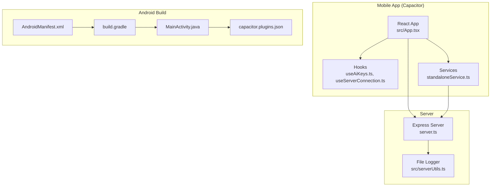
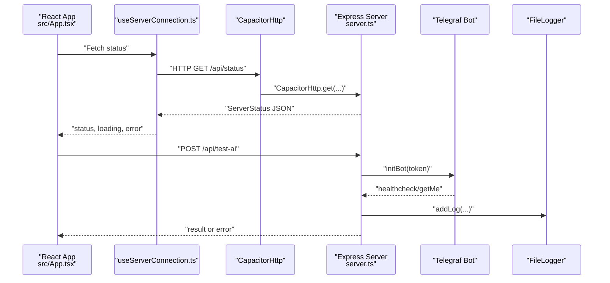
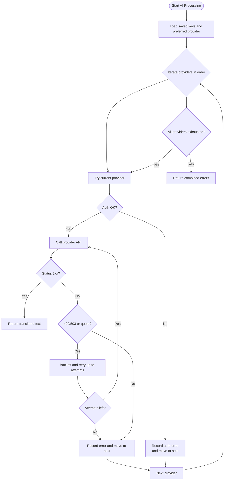
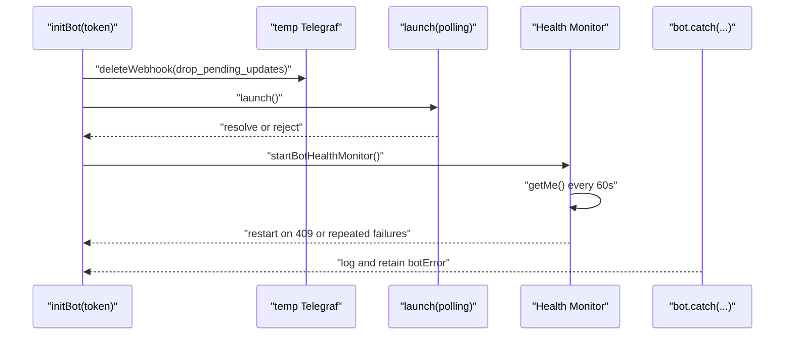
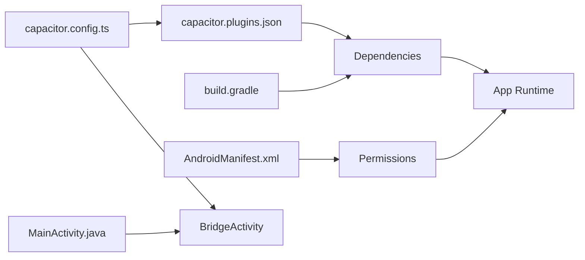
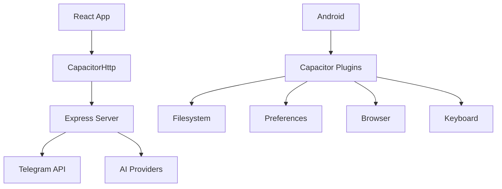

# Runtime Errors and Exceptions

<cite>
**Referenced Files in This Document**
- [README.md](file://README.md)
- [package.json](file://package.json)
- [capacitor.config.ts](file://capacitor.config.ts)
- [server.ts](file://server.ts)
- [src/App.tsx](file://src/App.tsx)
- [src/hooks/useAiKeys.ts](file://src/hooks/useAiKeys.ts)
- [src/hooks/useServerConnection.ts](file://src/hooks/useServerConnection.ts)
- [src/services/standaloneService.ts](file://src/services/standaloneService.ts)
- [src/serverUtils.ts](file://src/serverUtils.ts)
- [android/app/build.gradle](file://android/app/build.gradle)
- [android/app/src/main/AndroidManifest.xml](file://android/app/src/main/AndroidManifest.xml)
- [android/app/src/main/java/com/newsbot/manager/MainActivity.java](file://android/app/src/main/java/com/newsbot/manager/MainActivity.java)
- [android/app/src/main/assets/capacitor.plugins.json](file://android/app/src/main/assets/capacitor.plugins.json)
</cite>

## Table of Contents
1. [Introduction](#introduction)
2. [Project Structure](#project-structure)
3. [Core Components](#core-components)
4. [Architecture Overview](#architecture-overview)
5. [Detailed Component Analysis](#detailed-component-analysis)
6. [Dependency Analysis](#dependency-analysis)
7. [Performance Considerations](#performance-considerations)
8. [Troubleshooting Guide](#troubleshooting-guide)
9. [Conclusion](#conclusion)

## Introduction
This document provides comprehensive troubleshooting guidance for runtime errors and exceptions encountered during application operation. It covers:
- AI provider connectivity issues: API key errors, rate limiting, quota exhaustion, and provider unavailability
- Telegram bot problems: authentication failures, 409 conflicts, webhook issues, and message delivery errors
- Mobile app deployment challenges: Capacitor build errors, Android permission issues, and native plugin conflicts
- Error code explanations, diagnostic steps, automatic recovery mechanisms, and manual intervention procedures

## Project Structure
The project consists of:
- A React-based web client with Capacitor integration for mobile deployment
- A Node.js/Express server hosting the Telegram bot and serving AI translation services
- Android Gradle configuration and Capacitor plugin manifests

**Diagram sources**
- [src/App.tsx:168-170](file://src/App.tsx#L168-L170)
- [src/hooks/useAiKeys.ts:1-57](file://src/hooks/useAiKeys.ts#L1-L57)
- [src/hooks/useServerConnection.ts:1-52](file://src/hooks/useServerConnection.ts#L1-L52)
- [src/services/standaloneService.ts:1-175](file://src/services/standaloneService.ts#L1-L175)
- [server.ts:1-25](file://server.ts#L1-L25)
- [src/serverUtils.ts:1-23](file://src/serverUtils.ts#L1-L23)
- [android/app/src/main/AndroidManifest.xml:1-46](file://android/app/src/main/AndroidManifest.xml#L1-L46)
- [android/app/build.gradle:1-55](file://android/app/build.gradle#L1-L55)
- [android/app/src/main/java/com/newsbot/manager/MainActivity.java:1-6](file://android/app/src/main/java/com/newsbot/manager/MainActivity.java#L1-L6)
- [android/app/src/main/assets/capacitor.plugins.json:1-18](file://android/app/src/main/assets/capacitor.plugins.json#L1-L18)

**Section sources**
- [README.md:1-25](file://README.md#L1-L25)
- [package.json:1-70](file://package.json#L1-L70)
- [capacitor.config.ts:1-26](file://capacitor.config.ts#L1-L26)

## Core Components
- React App and Hooks: Manage server URL, status, and AI key storage; provide diagnostics and error boundaries
- Standalone Services: Provide native-capable HTTP calls, Telegram API wrappers, and AI service helpers
- Server: Hosts the Telegram bot, rate-limited endpoints, and AI translation pipeline with health checks and retries
- Android Build: Defines permissions, manifest entries, and Capacitor plugin configuration

**Section sources**
- [src/App.tsx:145-170](file://src/App.tsx#L145-L170)
- [src/hooks/useAiKeys.ts:1-57](file://src/hooks/useAiKeys.ts#L1-L57)
- [src/hooks/useServerConnection.ts:1-52](file://src/hooks/useServerConnection.ts#L1-L52)
- [src/services/standaloneService.ts:1-175](file://src/services/standaloneService.ts#L1-L175)
- [server.ts:24-35](file://server.ts#L24-L35)
- [android/app/src/main/AndroidManifest.xml:39-45](file://android/app/src/main/AndroidManifest.xml#L39-L45)

## Architecture Overview
The system integrates a React UI with a Node.js server that runs a Telegram bot and exposes AI translation endpoints. Capacitor bridges the web app to native capabilities on Android.

**Diagram sources**
- [src/hooks/useServerConnection.ts:20-42](file://src/hooks/useServerConnection.ts#L20-L42)
- [server.ts:729-799](file://server.ts#L729-L799)
- [src/serverUtils.ts:17-22](file://src/serverUtils.ts#L17-L22)

## Detailed Component Analysis

### AI Provider Connectivity
The server implements a robust fallback mechanism across multiple providers, with explicit handling for authentication, rate limits, quotas, and model availability.

**Diagram sources**
- [server.ts:412-645](file://server.ts#L412-L645)

Key behaviors:
- Authentication failures (401/403) halt the current provider and record the error
- Rate limiting/quota exhaustion (429/503/RESOURCE_EXHAUSTED) triggers backoff and disables the provider temporarily
- Model unavailability (404/not found) falls back to next model/provider
- Timeout and network errors are logged and retried

**Section sources**
- [server.ts:412-645](file://server.ts#L412-L645)

### Telegram Bot Lifecycle and Health Monitoring
The server initializes the bot in polling mode, deletes any existing webhook, and monitors health with periodic checks and automatic restarts.

**Diagram sources**
- [server.ts:688-799](file://server.ts#L688-L799)
- [server.ts:377-409](file://server.ts#L377-L409)

Operational details:
- Immediate startup error detection (e.g., 409 Conflict) is surfaced within a short timeout
- Health monitor restarts the bot on persistent failures or 409 conflicts
- Network timeouts and resets are treated as transient and retried

**Section sources**
- [server.ts:688-799](file://server.ts#L688-L799)
- [server.ts:377-409](file://server.ts#L377-L409)

### Mobile App Deployment (Capacitor)
The app uses Capacitor to bridge web APIs to native Android capabilities. The configuration and build scripts define plugin usage and permissions.

**Diagram sources**
- [capacitor.config.ts:1-26](file://capacitor.config.ts#L1-L26)
- [android/app/src/main/assets/capacitor.plugins.json:1-18](file://android/app/src/main/assets/capacitor.plugins.json#L1-L18)
- [android/app/src/main/AndroidManifest.xml:39-45](file://android/app/src/main/AndroidManifest.xml#L39-L45)
- [android/app/build.gradle:33-43](file://android/app/build.gradle#L33-L43)
- [android/app/src/main/java/com/newsbot/manager/MainActivity.java:1-6](file://android/app/src/main/java/com/newsbot/manager/MainActivity.java#L1-L6)

**Section sources**
- [capacitor.config.ts:1-26](file://capacitor.config.ts#L1-L26)
- [android/app/src/main/AndroidManifest.xml:39-45](file://android/app/src/main/AndroidManifest.xml#L39-L45)
- [android/app/build.gradle:33-43](file://android/app/build.gradle#L33-L43)
- [android/app/src/main/assets/capacitor.plugins.json:1-18](file://android/app/src/main/assets/capacitor.plugins.json#L1-L18)

## Dependency Analysis
- Frontend-to-Server: React app communicates via CapacitorHttp to the Express server endpoints
- Server-to-Providers: The server calls external AI providers and Telegram API
- Android-to-Capacitor: Native platform access through Capacitor plugins configured in the manifest and Gradle

**Diagram sources**
- [src/hooks/useServerConnection.ts:20-42](file://src/hooks/useServerConnection.ts#L20-L42)
- [server.ts:412-645](file://server.ts#L412-L645)
- [src/services/standaloneService.ts:1-175](file://src/services/standaloneService.ts#L1-L175)
- [android/app/src/main/assets/capacitor.plugins.json:1-18](file://android/app/src/main/assets/capacitor.plugins.json#L1-L18)

**Section sources**
- [package.json:19-56](file://package.json#L19-L56)
- [src/services/standaloneService.ts:1-175](file://src/services/standaloneService.ts#L1-L175)

## Performance Considerations
- Rate limiting: The server applies multiple rate limiters for general API, AI requests, and mutations to prevent overload
- Health monitoring: Periodic bot health checks detect failures and trigger restarts automatically
- Backoff strategies: AI provider calls implement exponential backoff on retryable errors
- Logging: File-based logging helps diagnose performance bottlenecks and error patterns

[No sources needed since this section provides general guidance]

## Troubleshooting Guide

### AI Provider Connectivity Issues
Symptoms:
- Translation endpoint returns errors indicating provider failures
- Quota exceeded messages with retry hints
- Authentication failures for a given provider

Diagnostic steps:
- Verify API keys are present and valid in the UI or environment variables
- Use the test endpoint to validate a single provider configuration
- Review server logs for detailed error messages and provider-specific hints

Automatic recovery:
- On quota exhaustion, the server disables the affected provider and retries others
- Backoff and retry logic handles transient 429/503 conditions

Manual intervention:
- Rotate or regenerate API keys if authentication fails
- Adjust preferred provider or enable fallback providers
- Monitor logs for persistent quota exhaustion and schedule usage windows

**Section sources**
- [server.ts:412-645](file://server.ts#L412-L645)
- [server.ts:1328-1339](file://server.ts#L1328-L1339)
- [src/App.tsx:1700-1720](file://src/App.tsx#L1700-L1720)

### Telegram Bot Problems
Symptoms:
- Bot initialization fails immediately with startup errors
- Health monitor reports repeated failures and restarts
- Conflicts (409) occur when multiple bot instances run concurrently

Diagnostic steps:
- Confirm the Telegram bot token is set and valid
- Check server logs for healthcheck failures and 409 conflict messages
- Validate that no other bot instance is running with the same token

Automatic recovery:
- Health monitor periodically restarts the bot on failures or 409 conflicts
- Webhook is deleted before launching polling to avoid stale updates

Manual intervention:
- Stop any duplicate bot processes
- Reset the bot token if unauthorized
- Reinitialize the bot manually if automatic restart does not resolve

**Section sources**
- [server.ts:688-799](file://server.ts#L688-L799)
- [server.ts:377-409](file://server.ts#L377-L409)

### Mobile App Deployment Challenges
Symptoms:
- Build failures due to missing dependencies or incompatible versions
- Runtime permission denials on Android
- Native plugin conflicts or missing plugin configurations

Diagnostic steps:
- Inspect Android build logs for dependency resolution errors
- Verify AndroidManifest permissions are declared
- Confirm Capacitor plugin entries match installed packages

Automatic recovery:
- Capacitor sync rebuilds native projects with current plugin configuration

Manual intervention:
- Align Gradle and Android SDK versions with project requirements
- Add missing permissions in the Android manifest
- Re-run Capacitor sync after updating plugins or dependencies

**Section sources**
- [android/app/build.gradle:33-43](file://android/app/build.gradle#L33-L43)
- [android/app/src/main/AndroidManifest.xml:39-45](file://android/app/src/main/AndroidManifest.xml#L39-L45)
- [android/app/src/main/assets/capacitor.plugins.json:1-18](file://android/app/src/main/assets/capacitor.plugins.json#L1-L18)
- [capacitor.config.ts:1-26](file://capacitor.config.ts#L1-L26)

### General Runtime Errors and Exceptions
Common error patterns:
- Invalid or malformed URLs passed to universal fetch
- Server status fetch failures due to network or misconfiguration
- AI key loading failures in standalone mode

Diagnostic steps:
- Use the built-in error boundary to capture and report app crashes
- Inspect server logs for structured ERROR/WARN/INFO entries
- Validate base URL and network connectivity

Automatic recovery:
- Server-side rate limiters prevent cascading failures
- Health monitoring restarts the bot on transient network errors

Manual intervention:
- Correct invalid URLs and ensure proper base URL configuration
- Clear stored preferences or reset server URL if stuck
- Review logs for detailed error context and remediation

**Section sources**
- [src/App.tsx:194-201](file://src/App.tsx#L194-L201)
- [src/hooks/useServerConnection.ts:20-42](file://src/hooks/useServerConnection.ts#L20-L42)
- [src/serverUtils.ts:17-22](file://src/serverUtils.ts#L17-L22)

## Conclusion
This guide consolidates actionable troubleshooting procedures for AI provider connectivity, Telegram bot operations, and mobile deployment on Android. By leveraging built-in health checks, rate limiters, and logging, most runtime issues can be diagnosed and recovered automatically. For persistent problems, the manual steps outlined above provide targeted interventions grounded in the project’s implementation.