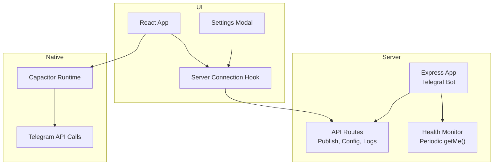
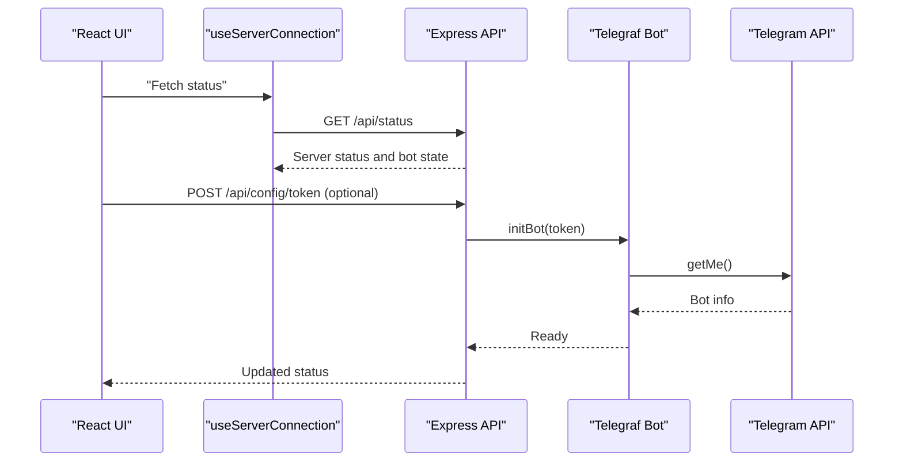
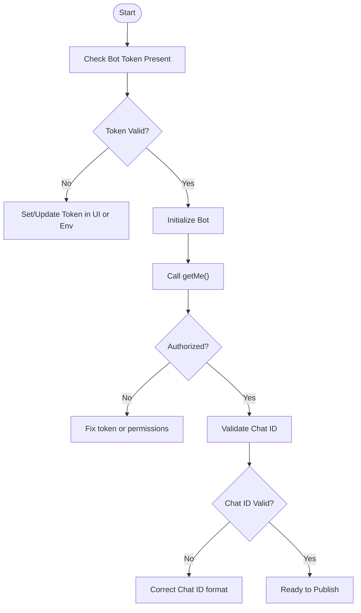
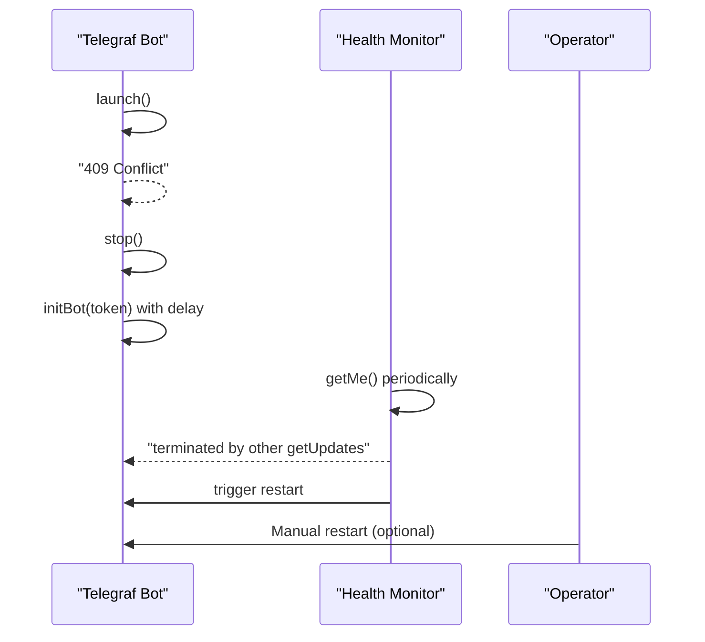
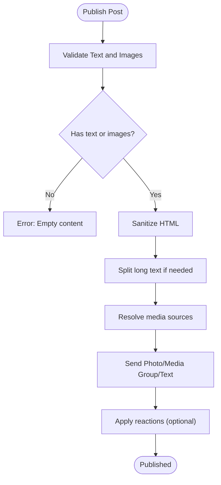
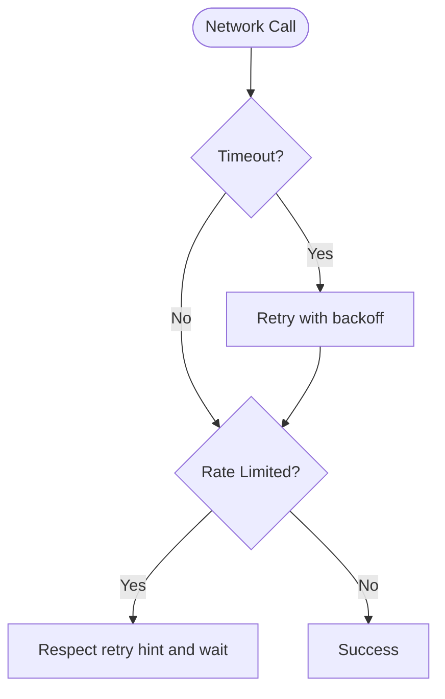
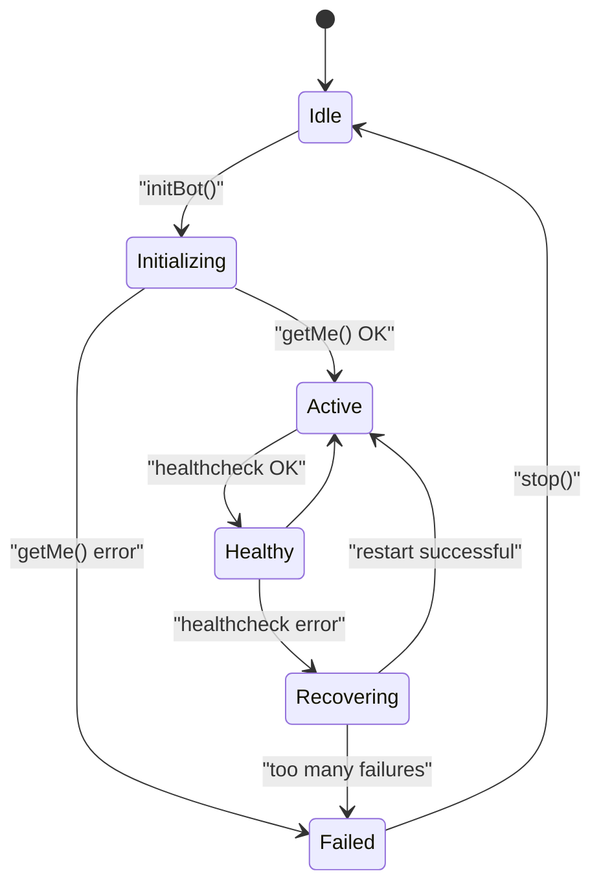
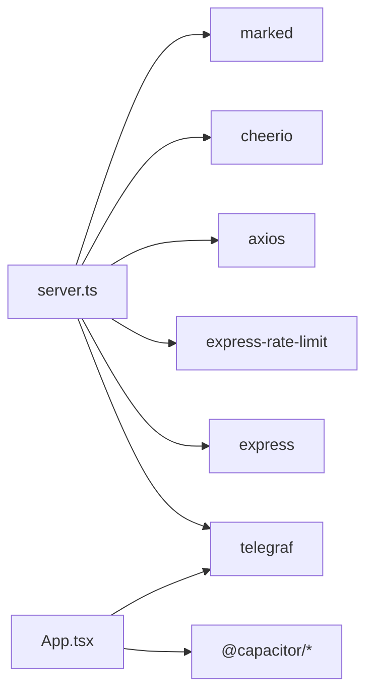

# Telegram Bot Errors

<cite>
**Referenced Files in This Document**
- [server.ts](file://server.ts)
- [standaloneService.ts](file://src/services/standaloneService.ts)
- [useServerConnection.ts](file://src/hooks/useServerConnection.ts)
- [SettingsModal.tsx](file://src/components/SettingsModal.tsx)
- [App.tsx](file://src/App.tsx)
- [package.json](file://package.json)
- [README.md](file://README.md)
</cite>

## Table of Contents
1. [Introduction](#introduction)
2. [Project Structure](#project-structure)
3. [Core Components](#core-components)
4. [Architecture Overview](#architecture-overview)
5. [Detailed Component Analysis](#detailed-component-analysis)
6. [Dependency Analysis](#dependency-analysis)
7. [Performance Considerations](#performance-considerations)
8. [Troubleshooting Guide](#troubleshooting-guide)
9. [Conclusion](#conclusion)

## Introduction
This document provides comprehensive troubleshooting guidance for Telegram bot operational issues. It covers authentication failures (invalid bot tokens, permission errors, authorization problems), 409 conflict errors (multiple bot instances, webhook conflicts, polling mode issues), message delivery failures (chat ID validation, media upload problems, formatting issues), network connectivity issues (timeouts, DNS resolution failures, API rate limiting), and bot lifecycle management (health checks, automatic recovery, restart procedures). It also includes diagnostic procedures using Telegram Bot API testing tools and webhook debugging techniques, with step-by-step resolution processes for each scenario.

## Project Structure
The project consists of:
- A Node.js/Express server that runs the Telegram bot using Telegraf, exposes APIs for configuration and publishing, and streams logs.
- A React-based UI that connects to the server, manages bot settings, and provides diagnostics.
- Native Android integration for standalone operation via Capacitor and direct Telegram API calls.

**Diagram sources**
- [server.ts](file://server.ts)
- [useServerConnection.ts](file://src/hooks/useServerConnection.ts)
- [standaloneService.ts](file://src/services/standaloneService.ts)
- [SettingsModal.tsx](file://src/components/SettingsModal.tsx)
- [App.tsx](file://src/App.tsx)

**Section sources**
- [server.ts](file://server.ts)
- [package.json](file://package.json)
- [README.md](file://README.md)

## Core Components
- Bot lifecycle management: initialization, stop, restart, and health monitoring.
- Authentication and authorization: token validation, chat ID validation, and provider key management.
- Message publishing: text, photos, media groups, and reactions.
- Diagnostics: logs streaming, status endpoint, and network tests.
- Native integration: direct Telegram API calls and polling for standalone mode.

**Section sources**
- [server.ts](file://server.ts)
- [standaloneService.ts](file://src/services/standaloneService.ts)
- [useServerConnection.ts](file://src/hooks/useServerConnection.ts)
- [SettingsModal.tsx](file://src/components/SettingsModal.tsx)
- [App.tsx](file://src/App.tsx)

## Architecture Overview
The system supports two modes:
- Server mode: UI communicates with the Express server, which controls the Telegraf bot and publishes content.
- Standalone mode: The UI polls Telegram updates directly using Capacitor HTTP and renders messages locally.

**Diagram sources**
- [server.ts](file://server.ts)
- [useServerConnection.ts](file://src/hooks/useServerConnection.ts)

## Detailed Component Analysis

### Authentication and Authorization Failures
Common symptoms:
- Bot fails to start or throws unauthorized errors.
- Messages cannot be sent due to invalid chat ID.
- Provider API keys rejected or rate-limited.

Resolution steps:
- Verify the Telegram bot token is present and correct. In server mode, set the token via UI or environment variable. In standalone mode, ensure the token is configured in the settings modal.
- Validate chat ID format (numeric or channel username with @). The server enforces a strict pattern and rejects invalid formats.
- Confirm provider API keys are configured and not rate-limited. Use the built-in test endpoints to validate keys.

**Diagram sources**
- [server.ts](file://server.ts)
- [SettingsModal.tsx](file://src/components/SettingsModal.tsx)

**Section sources**
- [server.ts](file://server.ts)
- [SettingsModal.tsx](file://src/components/SettingsModal.tsx)

### 409 Conflict Errors (Multiple Instances and Polling Issues)
Symptoms:
- Immediate startup failure with 409 conflict.
- Health monitor detects “terminated by other getUpdates”.
- Standalone polling reports a conflict indicating another instance is running elsewhere.

Resolution steps:
- Ensure only one bot instance is running at a time. Clear or rotate the token if conflicts persist.
- After detecting a 409, the system retries automatically with backoff. If persistent, manually restart the bot.
- In standalone mode, avoid running multiple clients polling the same token.

**Diagram sources**
- [server.ts](file://server.ts)

**Section sources**
- [server.ts](file://server.ts)
- [App.tsx](file://src/App.tsx)

### Message Delivery Failures
Common symptoms:
- Empty message or missing images.
- Media upload failures or invalid image paths.
- Formatting issues (HTML parse errors).

Resolution steps:
- Ensure the message text is not empty or excessively long. The system splits long texts into multiple messages.
- For media, confirm the image path is configured and accessible. The server validates paths and rejects unsafe destinations.
- Use supported HTML tags and avoid unsupported markup. The sanitizer strips disallowed tags and balances HTML.

**Diagram sources**
- [server.ts](file://server.ts)

**Section sources**
- [server.ts](file://server.ts)

### Network Connectivity Issues
Common symptoms:
- Timeouts during API calls.
- DNS resolution failures.
- Rate limiting from Telegram or AI providers.

Resolution steps:
- Increase timeouts and retry logic where applicable.
- Use the network test feature in the UI to validate connectivity.
- Monitor rate limits and implement backoff. The system surfaces quota exhaustion with retry hints.

**Diagram sources**
- [server.ts](file://server.ts)
- [standaloneService.ts](file://src/services/standaloneService.ts)
- [useServerConnection.ts](file://src/hooks/useServerConnection.ts)

**Section sources**
- [server.ts](file://server.ts)
- [standaloneService.ts](file://src/services/standaloneService.ts)
- [useServerConnection.ts](file://src/hooks/useServerConnection.ts)

### Bot Lifecycle Management and Automatic Recovery
Highlights:
- Health checks call Telegram’s getMe() periodically.
- Automatic restart triggered on 409 or repeated failures.
- Graceful stop and restart procedures.

**Diagram sources**
- [server.ts](file://server.ts)

**Section sources**
- [server.ts](file://server.ts)

## Dependency Analysis
External dependencies relevant to error handling:
- Telegraf for Telegram bot operations.
- Express for HTTP server and API routes.
- Rate limiter for API protection.
- Axios for external API calls (e.g., AI providers).
- Cheerio and Marked for content processing.
- Capacitor for native HTTP and filesystem access.

**Diagram sources**
- [server.ts](file://server.ts)
- [package.json](file://package.json)

**Section sources**
- [package.json](file://package.json)

## Performance Considerations
- Use health checks to detect stale sessions and trigger automatic recovery.
- Implement backoff strategies for rate-limited providers.
- Split long messages to avoid truncation and reduce payload sizes.
- Avoid sending excessive media groups in quick succession.

## Troubleshooting Guide

### Authentication Failures
- Invalid bot token:
  - Symptoms: Startup errors, authorization failures.
  - Resolution: Set a valid token in the UI or environment variable. Restart the bot.
  - References:
    - [server.ts](file://server.ts)
    - [SettingsModal.tsx](file://src/components/SettingsModal.tsx)

- Permission errors:
  - Symptoms: Unauthorized access to bot commands or API.
  - Resolution: Ensure the token belongs to the intended bot and has proper permissions. Rotate the token if needed.
  - References:
    - [server.ts](file://server.ts)

- Authorization problems:
  - Symptoms: getMe() fails immediately.
  - Resolution: Verify token correctness and network reachability to Telegram API.
  - References:
    - [server.ts](file://server.ts)

### 409 Conflict Errors
- Multiple bot instances:
  - Symptoms: 409 conflict on startup or health monitor detects termination.
  - Resolution: Stop all instances, clear token if necessary, and restart once.
  - References:
    - [server.ts](file://server.ts)

- Webhook vs polling:
  - Symptoms: Conflicts between webhook and polling.
  - Resolution: Delete existing webhook before launching polling; ensure only one mode is active.
  - References:
    - [server.ts](file://server.ts)

- Standalone polling conflicts:
  - Symptoms: Conflict warnings when polling in standalone mode.
  - Resolution: Ensure only one client polls the same token.
  - References:
    - [App.tsx](file://src/App.tsx)

### Message Delivery Failures
- Chat ID validation errors:
  - Symptoms: 400 Bad Request due to invalid chat ID.
  - Resolution: Use numeric chat ID or channel username with @; validate format before saving.
  - References:
    - [server.ts](file://server.ts)

- Media upload problems:
  - Symptoms: Image not found or path traversal errors.
  - Resolution: Configure image path correctly and ensure files exist under the allowed directory.
  - References:
    - [server.ts](file://server.ts)

- Formatting issues:
  - Symptoms: HTML parse errors or truncated content.
  - Resolution: Use supported HTML tags and avoid unsupported markup; sanitize input.
  - References:
    - [server.ts](file://server.ts)

### Network Connectivity Issues
- Timeout errors:
  - Symptoms: Request timeouts during bot initialization or publishing.
  - Resolution: Increase timeouts, check network stability, and retry.
  - References:
    - [server.ts](file://server.ts)
    - [standaloneService.ts](file://src/services/standaloneService.ts)

- DNS resolution failures:
  - Symptoms: Cannot reach Telegram API or external services.
  - Resolution: Verify DNS settings and network configuration.
  - References:
    - [server.ts](file://server.ts)

- API rate limiting:
  - Symptoms: 429 Too Many Requests or quota exceeded.
  - Resolution: Respect retry hints, implement exponential backoff, and consider switching providers.
  - References:
    - [server.ts](file://server.ts)

### Bot Lifecycle Management
- Health check failures:
  - Symptoms: Repeated healthcheck errors.
  - Resolution: Automatic restart is triggered; investigate underlying causes (network, token).
  - References:
    - [server.ts](file://server.ts)

- Automatic recovery mechanisms:
  - Symptoms: Frequent restarts.
  - Resolution: Investigate root cause; adjust retry delays and thresholds.
  - References:
    - [server.ts](file://server.ts)

- Restart procedures:
  - Steps: Stop bot, clear token if needed, set token, and restart.
  - References:
    - [server.ts](file://server.ts)

### Diagnostic Procedures
- Telegram Bot API testing tools:
  - Use the built-in test endpoints to validate tokens and keys.
  - References:
    - [server.ts](file://server.ts)

- Webhook debugging:
  - Ensure webhook is deleted before polling; monitor logs for conflicts.
  - References:
    - [server.ts](file://server.ts)

- Step-by-step resolution processes:
  - Authentication: Set token -> Initialize bot -> Validate getMe().
  - Publishing: Validate content -> Sanitize -> Send -> Apply reactions.
  - Network: Test connectivity -> Respect rate limits -> Retry with backoff.
  - References:
    - [server.ts](file://server.ts)
    - [SettingsModal.tsx](file://src/components/SettingsModal.tsx)

## Conclusion
This guide consolidates actionable steps to diagnose and resolve common Telegram bot operational issues. By leveraging built-in diagnostics, enforcing strict validation, and implementing robust recovery mechanisms, most problems can be resolved quickly and efficiently.