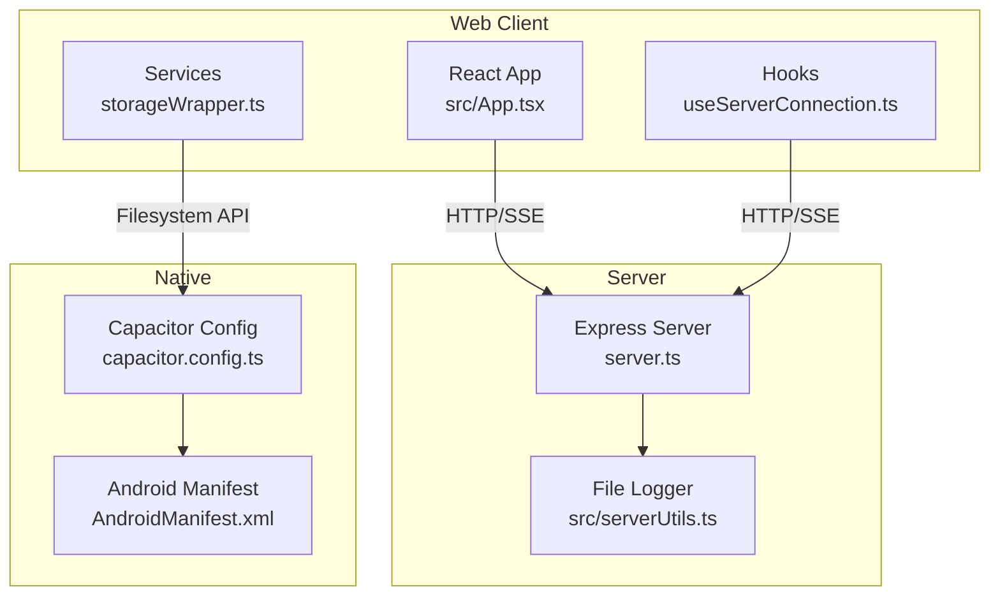
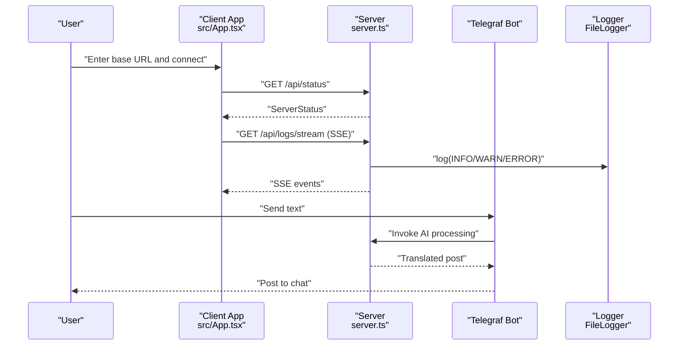
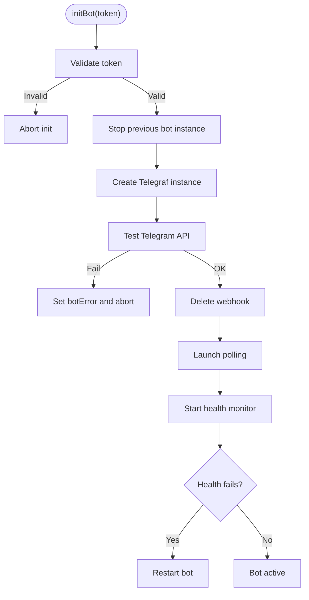
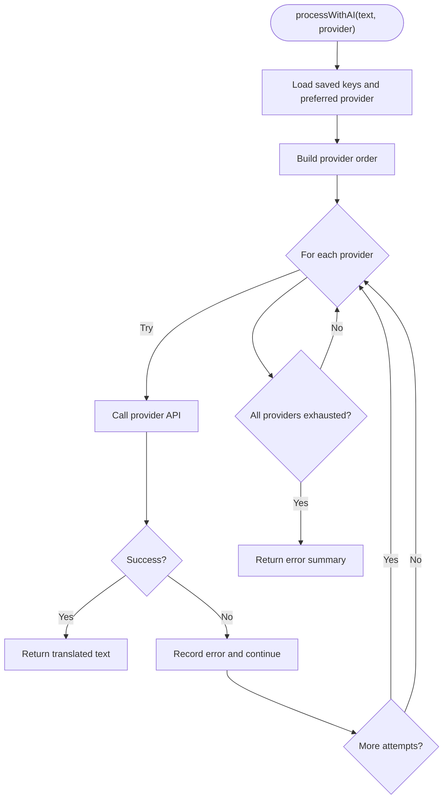
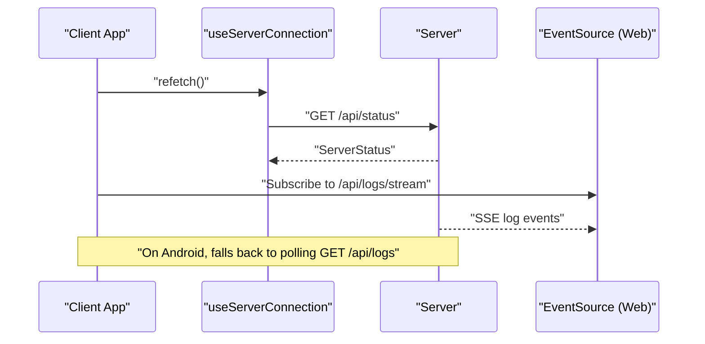
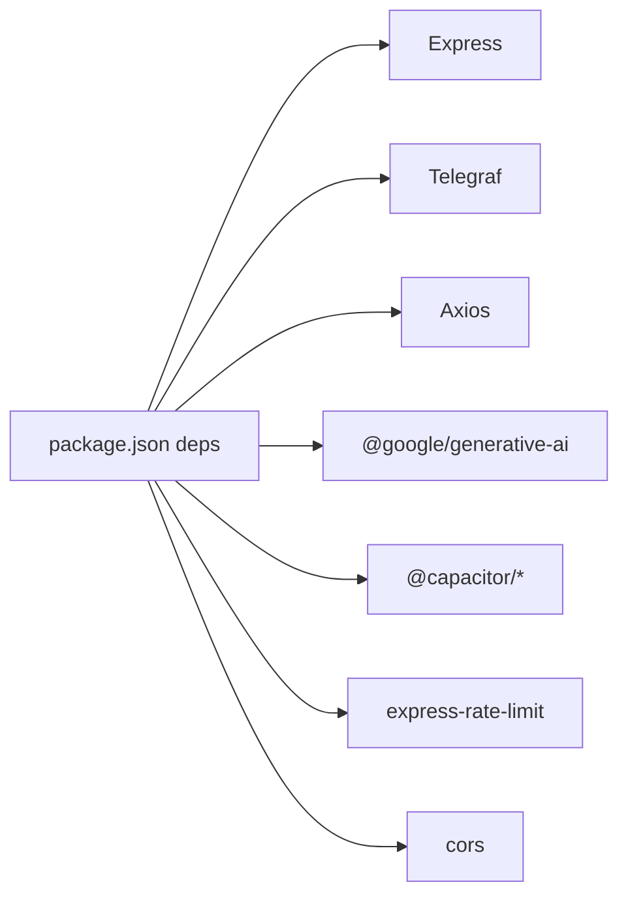

# Troubleshooting and FAQ

<cite>
**Referenced Files in This Document**
- [README.md](file://README.md)
- [package.json](file://package.json)
- [server.ts](file://server.ts)
- [capacitor.config.ts](file://capacitor.config.ts)
- [android\app\src\main\AndroidManifest.xml](file://android/app/src/main/AndroidManifest.xml)
- [android\gradle.properties](file://android/gradle.properties)
- [android\build.gradle](file://android/build.gradle)
- [src\serverUtils.ts](file://src/serverUtils.ts)
- [src\services\storageWrapper.ts](file://src/services/storageWrapper.ts)
- [src\hooks\useAiKeys.ts](file://src/hooks/useAiKeys.ts)
- [src\hooks\useServerConnection.ts](file://src/hooks/useServerConnection.ts)
- [src\App.tsx](file://src/App.tsx)
</cite>

## Table of Contents
1. [Introduction](#introduction)
2. [Project Structure](#project-structure)
3. [Core Components](#core-components)
4. [Architecture Overview](#architecture-overview)
5. [Detailed Component Analysis](#detailed-component-analysis)
6. [Dependency Analysis](#dependency-analysis)
7. [Performance Considerations](#performance-considerations)
8. [Troubleshooting Guide](#troubleshooting-guide)
9. [Conclusion](#conclusion)
10. [Appendices](#appendices)

## Introduction
This document provides comprehensive troubleshooting guidance and FAQs for the AI News Bot. It covers setup issues, runtime errors, performance bottlenecks, platform-specific pitfalls, and debugging techniques. It also includes step-by-step resolutions and preventive measures tailored to Windows, macOS, and Linux environments.

## Project Structure
The project is a hybrid web/native application:
- Web client built with React and Vite
- Native packaging via Capacitor for Android
- Backend server written in TypeScript using Express and Telegraf
- AI processing integrates multiple providers (Gemini, GitHub, OpenRouter, DeepSeek)
- Storage abstraction supports both web and native environments

**Diagram sources**
- [server.ts:1-800](file://server.ts#L1-L800)
- [src\App.tsx:1-800](file://src/App.tsx#L1-L800)
- [src\serverUtils.ts:1-23](file://src/serverUtils.ts#L1-L23)
- [src\services\storageWrapper.ts:1-100](file://src/services/storageWrapper.ts#L1-L100)
- [capacitor.config.ts:1-26](file://capacitor.config.ts#L1-L26)
- [android\app\src\main\AndroidManifest.xml:1-46](file://android/app/src/main/AndroidManifest.xml#L1-L46)

**Section sources**
- [README.md:1-25](file://README.md#L1-L25)
- [package.json:1-70](file://package.json#L1-L70)

## Core Components
- Server: Express-based backend with Telegraf bot, AI provider orchestration, rate limiting, and persistent storage
- Client: React app with Capacitor for native capabilities, logging via SSE/polling, and server connectivity checks
- Storage: Unified wrapper for filesystem access across web and native
- Logging: File logger and in-memory log manager with SSE streaming

Key responsibilities:
- Environment validation and API key handling
- Telegram bot lifecycle and health monitoring
- Multi-provider AI translation pipeline with fallbacks
- Client-server communication and real-time logs

**Section sources**
- [server.ts:24-35](file://server.ts#L24-L35)
- [server.ts:412-645](file://server.ts#L412-L645)
- [server.ts:688-799](file://server.ts#L688-L799)
- [src\App.tsx:622-641](file://src/App.tsx#L622-L641)
- [src\serverUtils.ts:7-22](file://src/serverUtils.ts#L7-L22)
- [src\services\storageWrapper.ts:9-99](file://src/services/storageWrapper.ts#L9-L99)

## Architecture Overview
High-level runtime flow:
- Client initializes and connects to the server endpoint
- Server validates environment and starts Telegraf bot
- Client polls or subscribes to logs via SSE
- AI processing routes through configured providers with retries and fallbacks

**Diagram sources**
- [src\App.tsx:622-641](file://src/App.tsx#L622-L641)
- [server.ts:342-352](file://server.ts#L342-L352)
- [server.ts:412-645](file://server.ts#L412-L645)
- [src\serverUtils.ts:17-21](file://src/serverUtils.ts#L17-L21)

## Detailed Component Analysis

### Server Startup and Environment Validation
Common issues:
- Missing TELEGRAM_BOT_TOKEN
- Missing GEMINI_API_KEY causing warnings
- Rate limiter blocking legitimate requests
- Health monitor detecting 409 conflicts or terminated sessions

Resolution steps:
- Ensure environment variables are present before starting the server
- Verify rate limiter thresholds are appropriate for your workload
- Monitor health monitor logs for recurring failures

**Section sources**
- [server.ts:24-35](file://server.ts#L24-L35)
- [server.ts:52-72](file://server.ts#L52-L72)
- [server.ts:377-409](file://server.ts#L377-L409)

### Telegram Bot Lifecycle and Health Monitoring
Key behaviors:
- Deletes existing webhook before launching polling
- Monitors bot health and auto-restarts on failure
- Handles 409 conflicts and network timeouts gracefully

**Diagram sources**
- [server.ts:688-799](file://server.ts#L688-L799)
- [server.ts:377-409](file://server.ts#L377-L409)

**Section sources**
- [server.ts:706-788](file://server.ts#L706-L788)
- [server.ts:377-409](file://server.ts#L377-L409)

### AI Provider Orchestration and Fallbacks
Processing logic:
- Attempts configured provider in priority order
- Supports GitHub, Gemini, OpenRouter, DeepSeek
- Implements retry/backoff and quota detection
- Returns structured error messages when all providers fail

**Diagram sources**
- [server.ts:412-645](file://server.ts#L412-L645)

**Section sources**
- [server.ts:412-645](file://server.ts#L412-L645)

### Client Connectivity and Logging
Client features:
- Uses CapacitorHttp on native, fetch on web
- Supports SSE for logs on web, polling on Android
- Validates base URL and handles timeouts

**Diagram sources**
- [src\hooks\useServerConnection.ts:20-42](file://src/hooks/useServerConnection.ts#L20-L42)
- [src\App.tsx:651-698](file://src/App.tsx#L651-L698)
- [server.ts:342-352](file://server.ts#L342-L352)

**Section sources**
- [src\hooks\useServerConnection.ts:15-51](file://src/hooks/useServerConnection.ts#L15-L51)
- [src\App.tsx:651-698](file://src/App.tsx#L651-L698)

## Dependency Analysis
External dependencies and integrations:
- Express server with Telegraf for Telegram
- Axios for provider HTTP calls
- Cheerio and Marked for parsing/formatting
- Capacitor for native Android support
- Rate limiting and CORS middleware

**Diagram sources**
- [package.json:19-56](file://package.json#L19-L56)

**Section sources**
- [package.json:19-56](file://package.json#L19-L56)

## Performance Considerations
- Memory usage: Large posts and image galleries can increase memory pressure. Limit concurrent AI requests and batch image operations.
- Network latency: Provider timeouts and retries can cause delays. Adjust client timeouts and enable caching where appropriate.
- Rate limits: Excessive requests trigger rate limiting. Tune thresholds and stagger requests.
- Logging overhead: SSE streaming can consume bandwidth. Pause logs when not needed.

[No sources needed since this section provides general guidance]

## Troubleshooting Guide

### Setup Problems

- Missing environment variables
  - Symptoms: Immediate startup errors indicating missing TELEGRAM_BOT_TOKEN; warnings about missing GEMINI_API_KEY.
  - Resolution: Set required environment variables before starting the server. See prerequisites and environment variable list in the project’s README.
  - Prevention: Use a .env file and validate with environment checks.

  **Section sources**
  - [README.md:16-24](file://README.md#L16-L24)
  - [server.ts:24-35](file://server.ts#L24-L35)

- Dependency installation issues
  - Symptoms: npm install fails or runtime errors related to missing modules.
  - Resolution: Reinstall dependencies with legacy peer deps if necessary. Ensure Node.js version compatibility.
  - Prevention: Pin Node.js version per project requirements and avoid global installations interfering with local dependencies.

  **Section sources**
  - [README.md:13](file://README.md#L13)
  - [package.json:17](file://package.json#L17)

- Android build and permissions
  - Symptoms: App crashes on startup, cannot access storage, or network requests blocked.
  - Resolution: Grant storage permissions at runtime; ensure INTERNET permission is declared; verify allowNavigation and mixed content settings.
  - Prevention: Review Capacitor config and Android manifest for required permissions and server scheme.

  **Section sources**
  - [capacitor.config.ts:7-22](file://capacitor.config.ts#L7-L22)
  - [android\app\src\main\AndroidManifest.xml:40-44](file://android/app/src/main/AndroidManifest.xml#L40-L44)

### Runtime Errors

- AI provider connectivity issues
  - Symptoms: “All AI providers failed” error; quota exceeded warnings; provider-specific auth errors.
  - Resolution: Verify API keys for each provider; check quotas and retry delays; switch providers or adjust preferred provider.
  - Prevention: Store keys securely and monitor quota usage.

  **Section sources**
  - [server.ts:412-645](file://server.ts#L412-L645)

- Telegram bot problems
  - Symptoms: 409 conflicts, terminated sessions, healthcheck failures, timeouts.
  - Resolution: Allow the health monitor to restart the bot; delete webhooks before polling; ensure stable network connectivity.
  - Prevention: Monitor logs and health intervals; avoid running multiple instances.

  **Section sources**
  - [server.ts:377-409](file://server.ts#L377-L409)
  - [server.ts:706-788](file://server.ts#L706-L788)

- Mobile app deployment challenges
  - Symptoms: Blank screen, navigation issues, or inability to reach server.
  - Resolution: Confirm base URL correctness; ensure server allows navigation; verify HTTPS/HTTP scheme alignment.
  - Prevention: Use the client’s URL normalization and prefer HTTP for local/private networks.

  **Section sources**
  - [src\App.tsx:68-100](file://src/App.tsx#L68-L100)
  - [capacitor.config.ts:7-10](file://capacitor.config.ts#L7-L10)

### Performance Issues

- Slow AI processing
  - Symptoms: Long delays when translating content.
  - Resolution: Reduce payload size; switch to lighter models; increase timeouts cautiously; monitor provider quotas.
  - Prevention: Pre-validate inputs and cache results where feasible.

  **Section sources**
  - [server.ts:412-645](file://server.ts#L412-L645)

- Memory usage optimization
  - Symptoms: Out-of-memory errors or sluggish UI.
  - Resolution: Limit concurrent image operations; reduce log buffer size; avoid large in-memory buffers.
  - Prevention: Profile memory usage and tune Gradle heap settings.

  **Section sources**
  - [android\gradle.properties:12](file://android/gradle.properties#L12)

- Network latency problems
  - Symptoms: Timeouts or frequent retries.
  - Resolution: Increase client timeouts; use local server for LAN deployments; monitor provider SLAs.
  - Prevention: Implement exponential backoff and circuit breaker patterns.

  **Section sources**
  - [src\App.tsx:213-251](file://src/App.tsx#L213-L251)

### Platform-Specific Troubleshooting

- Windows
  - Environment variables: Use Command Prompt or PowerShell to set variables before running the server.
  - Node.js: Ensure the installed version matches project requirements.
  - Android: Use Android Studio AVD or device; grant storage permissions.

  **Section sources**
  - [README.md:13](file://README.md#L13)
  - [android\app\src\main\AndroidManifest.xml:40-44](file://android/app/src/main/AndroidManifest.xml#L40-L44)

- macOS
  - Xcode command line tools: Required for building Capacitor apps.
  - Node.js: Prefer nvm-managed versions to avoid permission issues.

  **Section sources**
  - [package.json:17](file://package.json#L17)

- Linux
  - Permissions: Ensure proper file permissions for logs and data files.
  - Android: Use Android Studio or ADB; verify USB debugging and device drivers.

  **Section sources**
  - [src\serverUtils.ts:10-15](file://src/serverUtils.ts#L10-L15)

### Debugging Techniques

- Log analysis
  - Server-side logs: Inspect file logs generated by the logger and SSE streams.
  - Client-side logs: Enable logs panel and pause/resume as needed.

  **Section sources**
  - [src\serverUtils.ts:17-21](file://src/serverUtils.ts#L17-L21)
  - [src\App.tsx:651-698](file://src/App.tsx#L651-L698)

- Error diagnosis
  - Use server status endpoint to diagnose connectivity and bot state.
  - Inspect error boundaries and crash logs in the client.

  **Section sources**
  - [src\App.tsx:146-166](file://src/App.tsx#L146-L166)
  - [src\hooks\useServerConnection.ts:20-42](file://src/hooks/useServerConnection.ts#L20-L42)

- Performance profiling
  - Monitor memory and CPU usage on the host machine.
  - Adjust Gradle JVM args and client timeouts to balance responsiveness and throughput.

  **Section sources**
  - [android\gradle.properties:12](file://android/gradle.properties#L12)
  - [src\App.tsx:213-251](file://src/App.tsx#L213-L251)

- Network debugging
  - Verify base URL correctness and scheme (HTTP vs HTTPS).
  - On Android, confirm allowNavigation and mixed content policies.

  **Section sources**
  - [src\App.tsx:68-100](file://src/App.tsx#L68-L100)
  - [capacitor.config.ts:7-22](file://capacitor.config.ts#L7-L22)

### Step-by-Step Resolution Guides

- Initialize environment and run locally
  - Steps: Install dependencies, set environment variables, run the development server.
  - Verification: Confirm server status endpoint and logs.

  **Section sources**
  - [README.md:16-24](file://README.md#L16-L24)
  - [package.json:6-17](file://package.json#L6-L17)

- Configure AI keys
  - Steps: Enter keys in the UI or environment variables; verify they are loaded by the server.
  - Verification: Check logs for loaded keys and provider selection.

  **Section sources**
  - [README.md:18-22](file://README.md#L18-L22)
  - [src\hooks\useAiKeys.ts:8-56](file://src/hooks/useAiKeys.ts#L8-L56)
  - [server.ts:420-423](file://server.ts#L420-L423)

- Fix Telegram bot 409 conflicts
  - Steps: Stop other bot instances; allow health monitor to restart; delete webhooks.
  - Verification: Confirm bot status and absence of conflict errors.

  **Section sources**
  - [server.ts:395-406](file://server.ts#L395-L406)
  - [server.ts:757-763](file://server.ts#L757-L763)

- Resolve Android storage permission errors
  - Steps: Request storage permissions at runtime; verify manifest permissions.
  - Verification: Confirm successful image scanning and file access.

  **Section sources**
  - [src\App.tsx:408-416](file://src/App.tsx#L408-L416)
  - [android\app\src\main\AndroidManifest.xml:40-44](file://android/app/src/main/AndroidManifest.xml#L40-L44)

- Optimize performance for large posts
  - Steps: Reduce payload size; batch image operations; increase timeouts; monitor quotas.
  - Verification: Measure response times and memory usage.

  **Section sources**
  - [server.ts:412-645](file://server.ts#L412-L645)

### Preventive Measures
- Keep environment variables centralized and validated at startup
- Monitor provider quotas and implement fallback strategies
- Use health checks and automatic restarts for the Telegram bot
- Validate URLs and schemes before connecting
- Tune Gradle and client timeouts for your environment

[No sources needed since this section provides general guidance]

## Conclusion
By following the troubleshooting steps, leveraging the built-in logging and health monitoring, and applying platform-specific best practices, most issues with the AI News Bot can be resolved quickly. Regular monitoring and preventive measures will help maintain reliability and performance across environments.

[No sources needed since this section summarizes without analyzing specific files]

## Appendices

### Frequently Asked Questions
- How do I check if the server is reachable?
  - Use the client’s status endpoint and verify the response includes bot and server status.

  **Section sources**
  - [src\hooks\useServerConnection.ts:20-42](file://src/hooks/useServerConnection.ts#L20-L42)

- Why does my Android app show a blank screen?
  - Ensure the base URL is correct and the server allows navigation; verify HTTPS/HTTP scheme.

  **Section sources**
  - [src\App.tsx:68-100](file://src/App.tsx#L68-L100)
  - [capacitor.config.ts:7-10](file://capacitor.config.ts#L7-L10)

- How do I enable real-time logs on Android?
  - Real-time logs fall back to polling on Android; ensure logs panel is visible and not paused.

  **Section sources**
  - [src\App.tsx:681-698](file://src/App.tsx#L681-L698)

- What should I do if AI translation fails?
  - Verify API keys, check quotas, and review the error summary returned by the server.

  **Section sources**
  - [server.ts:643-644](file://server.ts#L643-L644)